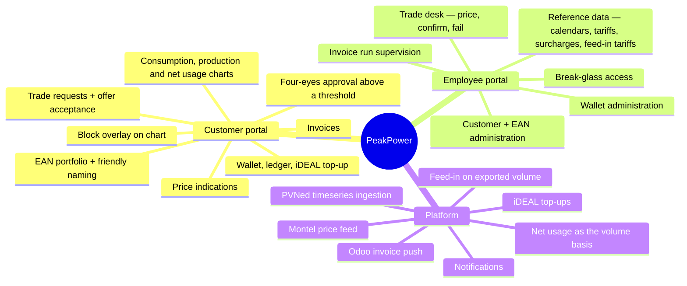

# Vision & Scope

## 1. The problem

Dutch **grootverbruik** (large-consumption) organisations — manufacturers, cold stores, data centres,
greenhouses, logistics hubs — buy electricity in volumes large enough that the wholesale market is
worth engaging with directly, but not large enough to justify an in-house trading desk.

Today that gap is bridged by phone calls, spreadsheets and email:

- The customer has no live view of their own consumption per metering point.
- Price indications arrive as a screenshot or a verbal quote.
- A purchase request is an email; the confirmation is another email.
- The relationship between *what was bought* and *what was actually consumed* only becomes visible
  weeks later, on an invoice nobody can reconstruct.

PeakPower already performs the back-office and market-access role. What is missing is the product
surface around it.

## 2. The product

**PeakPower is a self-service portal that lets grootverbruik customers see their energy position and
buy or sell wholesale energy blocks against it, with PeakPower brokering every trade.**

Three ideas hold it together:

1. **Position first.** The customer sees measured consumption and production per metering point —
   and the **net usage** the two produce **[DEC-22]** — with already-purchased blocks overlaid on the
   same chart. Buying decisions are made against a picture, not a price list.
2. **Quote-driven trading, not an order book.** The customer requests; PeakPower responds with a
   firm, time-limited price; the customer accepts or rejects. PeakPower keeps the human in the loop
   for market execution, and the platform keeps the audit trail.
3. **A wallet as the settlement primitive.** Money in the wallet backs every trade. Reservations,
   confirmations and invoices are all ledger entries against one balance the customer can inspect
   line by line. Money goes in and is spent; **there is no payout path back out [DEC-43]**.

## 3. Who it is for

| Segment | Description |
| --- | --- |
| **Primary** | Dutch grootverbruik electricity customers with one or more EAN connections, typically 1–50 metering points, annual volume 1–100 GWh |
| **Secondary** | Multi-site organisations that want to bundle small volumes across sites into whole-MW market blocks |
| **Internal** | PeakPower back-office employees who price, execute and settle the trades |

See [Actors & roles](03-actors-and-roles.md) for the full actor list.

## 4. Scope

### 4.1 In scope — first release track

**Production nets against consumption.** The platform's volume basis is **net usage** = consumption −
production, per interval per metering point **[DEC-22]**. Net usage may be negative when production
exceeds consumption. This **supersedes [AS-06]** and moves production from an informational series
into coverage, the net position and the invoice.

**The sale side has two halves, and they are not the same money.** *Unused block cover* — volume
bought and not consumed — is credited at the day-ahead price as a separate sale line **[DEC-23]**.
*Physically exported* volume — net usage below zero — is **feed-in**, and is credited at a
per-customer **feed-in tariff** on its own invoice line **[DEC-44]**. Three volumes, occurring at
different times, at three different prices, never netted against each other.

**Trades above a value threshold need a second pair of eyes.** Four-eyes approval **[DEC-33]** is in
scope: an approval state on the trade machine, an approving account that must differ from the
accepting one, and a threshold held as reference data. It is a condition on identity rather than a
permission, because **[DEC-16]** leaves no role to grant.

### 4.2 Explicitly out of scope — this track

| Out of scope | Rationale / when |
| --- | --- |
| **Gas** connections and gas products | Deliberately deferred. The data model is built gas-ready (commodity discriminator on EAN, product and price) and **[DEC-30]** confirms that gas keeps the same EAN model and the same block products when it arrives — only pricing and units differ, with volumes in **m³**. No gas-specific pricing, tariffs or unit handling is implemented, and the calorific correction is undecided. See [OQ-87]. |
| Direct market access / automated execution | PeakPower executes manually with its counterparty. The platform records the outcome; it does not send orders to an exchange. |
| **Imbalance** — trading *and* charging | Never traded, and **[DEC-25]** takes it out of scope for invoicing too: invoice line 3 is not implemented, PVNed `A12` documents are stored but not turned into charges, and no allocation method goes in the customer contract. Moots [AS-18]. Storing `A12` keeps the option open at the cost of a table. |
| **Energiebelasting** on the invoice | **Deferred, not settled [DEC-24]**. Invoice line 5 is not implemented, and the January annual true-up is deferred with it, retaining only its residual role of correcting late metering data. ⚠ **EB is a legal obligation, not a feature — it must return to scope before a single invoice is issued to a real customer.** [OQ-77] parks against the same reopening. |
| Public display of Montel price indications | **[DEC-27]** — not permitted. Display inside the authenticated portal is. Customer CSV export is not covered by that permission and is treated as not permitted until the licence says otherwise. Retires the public-price element of [F14]. |
| PPA / long-term bilateral contract management | Different product shape, different legal surface. |
| Network / transport cost billing (netbeheerkosten) | **Confirmed out [DEC-37]**, adopting the working assumption: the DSO invoices grootverbruik customers directly. [OQ-18] is closed. |
| **Refund payouts from the wallet** | **[DEC-43]** — there is no payout path. Surplus balance stays in the wallet, which removes the refund flow, its approval question and the provider-versus-manual-transfer question together. ⚠ **Offboarding is the gap this leaves**: a customer closing their account with a positive balance has no route for their money. That is a known gap rather than an open question, and it compounds [OQ-29] on what happens to their blocks. It must be answered before the first customer leaves, not before the first one joins. |
| **Payment methods other than iDEAL** | **[DEC-58]** — no SEPA via the provider, no Bancontact. iDEAL plus manual bank transfer is the whole payment surface, and the transfer half is matched on the company IBAN **[DEC-61]**. A Belgian entity would reopen this, and would reopen the flat 21% VAT of **[DEC-64]** with it. |
| Supplier switching, connection change requests (mutaties) | Handled outside the platform. |
| Customer self-onboarding | Customers and EANs are created by PeakPower employees. Self-service registration is a later phase. |
| Platform-held credentials for **customers** — password storage, resets, lockout | **[DEC-29]** — the identity provider owns the credential and the platform never stores a customer password. The proof of concept has no authentication at all **[DEC-20]**, which removes the login but **not** the tenancy context pipeline. ⚠ **One bounded exception, and it is not a customer one:** **[DEC-53]** brings hashing, rotation, lockout and breach handling back for a small set of **named employee break-glass accounts** — see §4.1 and the glossary. |
| Customer-managed encryption keys | **[DEC-52]** — platform-managed keys at rest. |
| Native mobile apps | Responsive web only. |

### 4.3 Deferred but designed for

These are not built in the first track, but the architecture must not preclude them:

- **Gas commodity alongside electricity** — the shape is now known: same EAN model, same block
  products, volumes in **m³ [DEC-30]**. Settle the calorific correction ([OQ-87]) before it is built,
  because retrofitting an m³ → kWh conversion beneath a stored volume series reprices history.
- Additional data providers next to PVNed.
- Additional block shapes (weekend, off-peak-only, custom shape).
- Multi-language UI (Dutch first, English second) — all user-facing strings externalised from day one.
- **Energiebelasting** — deferred by **[DEC-24]**. `IEnergyTaxCalculator` and the
  `billing.energy_tax_tariff` table stay in the model, unpopulated, so the calculation drops in
  rather than being retrofitted through a finished invoice engine. The annual true-up returns with
  it.
- **Imbalance charging** — out of scope by **[DEC-25]**, but `A12` documents are stored rather than
  discarded, so the option survives. [AS-18] becomes relevant again if it is ever invoiced.
- **Authentication** — the proof of concept runs without it **[DEC-20]**, so the `customer_id` /
  `account_id` context pipeline is built now and fed by a development context provider. Entra ID
  drops in behind it; the query filter, row-level security and the 404-not-403 behaviour are
  exercised from the first commit either way. The tenant it drops into is PeakPower's **existing
  corporate Microsoft tenancy [DEC-66]**; ⚠ *access* to it is a Phase 0 dependency granted outside the
  delivery team, and **[DEC-67]** puts it on the critical path by running the `customer_id`
  claim-mapping spike against it rather than a throwaway tenant.
- **Refunds and offboarding** — *not* designed for, and this is the one entry on this list that is a
  gap rather than a choice. **[DEC-43]** removes the payout path outright, so a customer leaving with
  a positive balance has nowhere for their money to go, and [OQ-29] leaves their open blocks equally
  unresolved. Nothing in the architecture precludes adding it; nothing in the architecture is waiting
  for it either. Answer it before the first customer leaves.
- ~~Customer users with differentiated rights (viewer vs. trader vs. admin).~~ — **decided against,
  not deferred [DEC-16]**. All accounts of a company have identical privileges; the customer governs
  internally, and the platform records *who acted* **[DEC-17]** rather than restricting who may act.
  [OQ-04] is closed.

## 5. Goals and success criteria

| # | Goal | Measure |
| --- | --- | --- |
| G1 | Customers can see their own position without asking PeakPower | ≥ 80% of active customers open the consumption view at least weekly |
| G2 | Trade turnaround shrinks | Median request → offer under 30 min; median offer → decision under 15 min |
| G3 | Back-office effort per trade drops | No manual spreadsheet step between request and confirmed trade |
| G4 | Invoices are reconstructable | Every invoice line traceable to interval data, a block, a tariff or a ledger entry |
| G5 | Nothing is lost | Every trade state change and every cent movement is in an immutable audit trail |

## 6. Guiding principles

1. **Immutable facts, derived views.** Metering data, ledger entries and trade events are append-only.
   Balances, positions and invoices are derived and reproducible from them.
2. **The customer and the employee see the same truth.** One trade history, one ledger, rendered for
   two audiences. No "internal notes the customer never sees" in the audit trail — internal remarks
   live in a separate, explicitly internal field.
3. **Money movements are never implicit.** Reserve, release, settle and adjust are distinct, named,
   logged operations. Refund is no longer among them **[DEC-43]** — which makes the remaining four
   carry more weight, not less.
4. **Time is hard; be explicit.** Every timestamp is stored in UTC with a known local calendar.
   Every interval calculation accounts for DST. Every "day" is an Amsterdam day.
5. **Third parties are unreliable.** Every inbound integration is idempotent, replayable and
   observable. Every outbound integration is retried and reconciled.

## 7. Constraints

| Constraint | Source |
| --- | --- |
| Backend in **C#/.NET** | Stakeholder preference |
| Frontends in **Angular 22**, all three applications | **[DEC-54]**, which settles the framework version and explicitly **not** the component library. That is still unchosen, and read with **[DEC-39]** it should be expected to come from the free field too — [OQ-49] |
| **Separate repositories** for .NET and Angular | **[DEC-55]**, reversing the monorepo assumption. Three properties now have to be preserved deliberately: the Aspire AppHost starts front-ends it does not contain, OpenAPI-generated clients cross a repository boundary and need a publishing step, and "one command brings up the whole system" is no longer free |
| The charting library must be **open-source and free**, or written in-house | **[DEC-39]**. Commercial licences are excluded. The phase-0 spike survives, narrowed to the free field and to the cost of building custom — the chart is the product, so this constrains the most user-visible part of the platform |
| **PostgreSQL** as primary datastore | Stakeholder preference |
| **Hangfire** for scheduled work | Stakeholder preference |
| **.NET Aspire** for local orchestration | Stakeholder preference — across two repositories **[DEC-55]** |
| Cloud deployment, Azure as default target | Stakeholder preference; Aspire deploys cleanly to Azure Container Apps. **[DEC-56]**: there is no existing tenancy, landing zone or naming standard, so all three are this project's to set. [OQ-50] still open |
| Production identity provider is **Microsoft Entra ID**; the PoC runs with **no authentication** | **[DEC-20]**. The provider owns credentials and the platform never stores a *customer* password **[DEC-29]**; named employee break-glass accounts are the one bounded exception **[DEC-53]**. Customer MFA is a tenant-policy matter, not a platform one **[DEC-51]**. It runs in PeakPower's **existing corporate Microsoft tenancy [DEC-66]**, which also hosts the Azure subscriptions — **[DEC-56]**'s "no Azure tenancy" means no subscription, landing zone or naming standard, not no directory. ⚠ *Access* to that tenancy is a Phase 0 dependency, not an open question; **[R-24]** carries what remains |
| Transactional email through **SendGrid** | **[DEC-48]**. A dedicated sending domain with SPF, DKIM and DMARC is required and is a lead-time item — offer notifications are time-critical **[DEC-63]** and invoices are on the same channel **[DEC-47]** |
| Payments are **iDEAL only**, plus manual bank transfer | **[DEC-58]**. No SEPA via the provider, no Bancontact |
| Metering data arrives only from **PVNed**, push-only | Third-party contract. The PoC ingests **generated** data in the PVNed document format, driven through the real webhook and parser **[DEC-21]**; the real integration is validated later, and R-01 is deferred rather than closed |
| Price indications come from an **existing Montel API implementation** | Existing asset to be reused. Licence restricts onward display: no public display, authenticated portal only **[DEC-27]** |
| Peak is **Mon–Fri, ≥ 08:00 and < 20:00** Europe/Amsterdam, public holidays **included** | **[DEC-19]**, matching the exchange convention for Dutch power peak-load products. Held as reference data, not code **[DEC-14]** |
| All prices, wallet balances and reservations are **VAT-exclusive** | **[DEC-26]**. VAT is added at invoice level, at **21% on every line category [DEC-64]**. The wallet debit basis is still open — [OQ-83] |
| Market prices are **€/MWh**; the two customer rates are **€/kWh** | **[DEC-35]** for the surcharge, **[DEC-44]** for the feed-in tariff. Two units in one system is a deliberate choice with a silent failure mode — a €/kWh figure read as €/MWh is wrong by exactly 1000 and still looks plausible. See **[R-23]** |
| The PoC **must not hold real customer funds** | **[DEC-28]** — the client-money question is deferred as a go-live gate. Test money only until it is answered |
| Data residency: EU | Dutch customers, GDPR |

## 8. What "done" looks like for this specification set

This set is complete enough to:

- run a stakeholder review and close the open questions in
  [80-open-questions.md](../80-open-questions.md) — two such reviews ran on **2026-08-11**, closing
  the eleven P1 questions as **[DEC-19]**…**[DEC-29]** and then thirty-six more as **[DEC-30]**…
  **[DEC-65]**; **43 remain open**, of which 35 were reviewed and deliberately parked, one was never
  reached, and seven are new questions the decisions themselves created;
- produce a story-level backlog and a T-shirt-size estimate per feature;
- start the architecture spike for PVNed ingestion and the wallet ledger, which are the two areas
  where a wrong early decision is expensive to unwind.

✅ **Nothing blocks.** [OQ-88] briefly recorded a contradiction between **[DEC-20]** and **[DEC-56]**
and was closed the same day by **[DEC-66]**: the corporate Microsoft tenancy exists, and the Azure
subscriptions sit under it. ⚠ What it left behind is a **dependency rather than a question** —
*access* to that tenancy is granted outside the delivery team, and **[DEC-67]** puts it on the
critical path by choice. It is tracked with an owner and a date in
[Roadmap §2.1](../70-delivery/01-roadmap-and-phasing.md), not in the open-question register.

It is **not** yet a build specification for the invoicing engine, but the gap is narrower than it
was — and it moved rather than only shrinking. Energiebelasting and imbalance are out of the first
track entirely ([DEC-24], [DEC-25]); VAT is exclusive throughout ([DEC-26]) at 21% on every line
([DEC-64]); day-ahead settlement is raw with no spread ([DEC-44]). Against that, **[DEC-44]** added a
sixth line category and **[DEC-35]** changed the surcharge's unit. What still has to be confirmed
before the invoicing engine is built is whether the wallet debit settles the ex-VAT subtotal or the
inclusive total ([OQ-83]), and what applies when a customer exports and no feed-in tariff resolves
([OQ-86]) — the larger of the two in money. ⚠ Energiebelasting is deferred, not resolved — it must
return before a real customer is invoiced.
