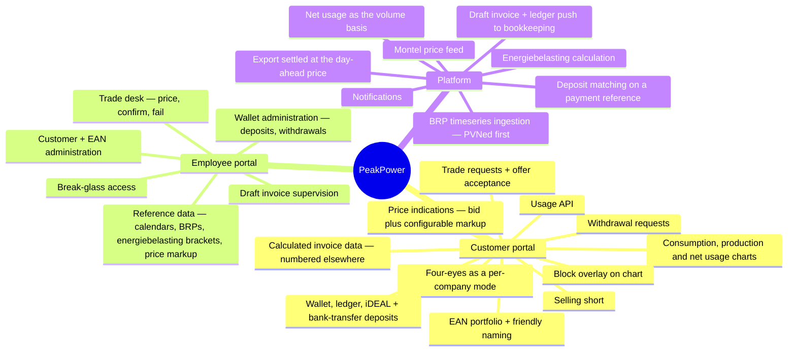

# Vision & Scope

## 1. The problem

Dutch **grootverbruik** (large-consumption) organisations — manufacturers, cold stores, data centres,
greenhouses, logistics hubs — buy electricity in volumes large enough that the wholesale market is
worth engaging with directly, but not large enough to justify an in-house trading desk.

Today that gap is bridged by phone calls, spreadsheets and email:

- The customer has no live view of their own consumption per metering point.
- Price indications arrive as a screenshot or a verbal quote.
- A purchase request is an email; the confirmation is another email.
- The relationship between *what was bought* and *what was actually consumed* only becomes visible
  weeks later, on an invoice nobody can reconstruct.

PeakPower already performs the back-office and market-access role. What is missing is the product
surface around it.

## 2. The product

**PeakPower is a self-service portal that lets grootverbruik customers see their energy position and
buy or sell wholesale energy blocks against it, with PeakPower brokering every trade.**

Three ideas hold it together:

1. **Position first.** The customer sees measured consumption and production per metering point —
   and the **net usage** the two produce **[DEC-22]** — with already-purchased blocks overlaid on the
   same chart. Buying decisions are made against a picture, not a price list.
2. **Quote-driven trading, not an order book.** The customer requests; PeakPower responds with a
   firm, time-limited price; the customer accepts or rejects. PeakPower keeps the human in the loop
   for market execution, and the platform keeps the audit trail.
3. **A wallet that funds trading, and only trading.** Money in the wallet backs every trade.
   Reservations and confirmations are ledger entries against one balance the customer can inspect
   line by line. ⚠ **Amended 2026-08-19 by [DEC-77]** — the original wording read "*Reservations,
   confirmations and invoices are all ledger entries*"; delivery invoices are **not** settled from
   the wallet any more. Monthly day-ahead, export and energiebelasting amounts are pushed to the
   bookkeeping program and paid to the bank, which reverses **[AS-12]** and removes the
   `INVOICE_DEBIT` entry type. Money goes in and is spent on trades; ~~**there is no payout path
   back out [DEC-43]**~~ ⚠ **Reversed 2026-08-19 by [DEC-83]** — a customer can request a
   withdrawal and PeakPower pays it out manually.

## 3. Who it is for

| Segment | Description |
| --- | --- |
| **Primary** | Dutch grootverbruik electricity customers with one or more EAN connections, typically 1–50 metering points, annual volume 1–100 GWh |
| **Secondary** | Multi-site organisations that want to bundle small volumes across sites into ~~whole-MW~~ market blocks. ⚠ **Amended 2026-08-19 by [DEC-70]** — the minimum request is **0,01 MW** with a **0,01 MW** increment, so bundling is no longer needed to reach a tradeable size; it stays a way to consolidate purchasing and to reduce the per-EAN allocation tail |
| **Internal** | PeakPower back-office employees who price, execute and settle the trades |

See [Actors & roles](03-actors-and-roles.md) for the full actor list.

## 4. Scope

### 4.1 In scope — first release track

⚠ **The mindmap was redrawn on 2026-08-19.** What left it: the four-eyes threshold **[DEC-71]**,
surcharge and feed-in reference data **[DEC-73]** **[DEC-87]**, feed-in on exported volume
**[DEC-87]**, and invoice numbering, the PDF and the invoice email **[DEC-88]** **[DEC-89]**. What
arrived: short selling **[DEC-72]**, bank-transfer deposits **[DEC-106]**, withdrawals **[DEC-83]**,
energiebelasting **[DEC-74]**, the customer usage API **[DEC-97]** and configurable BRPs
**[DEC-69]**. §4.4 lists every movement with the decision behind it.

**Production nets against consumption.** The platform's volume basis is **net usage** = consumption −
production, per interval per metering point **[DEC-22]**. Net usage may be negative when production
exceeds consumption. This **supersedes [AS-06]** and moves production from an informational series
into coverage, the net position and the invoice. **Whether a connection produces is the customer's
declaration, made at onboarding [DEC-112]** — SJV and profile fractions are a reference for
sanity-checking it, not its source. The property still defaults to `UNKNOWN`, and `UNKNOWN` is still
treated as `EXPECTED` for completeness alerting, but it now has an owner and a moment.

**The sale side has two halves, and they are now settled at the same price.** *Unused block cover* —
volume bought and not consumed — is credited at the day-ahead price as a separate sale line
**[DEC-23]**. *Physically exported* volume — net usage below zero — ~~is **feed-in**, and is credited
at a per-customer **feed-in tariff** on its own invoice line **[DEC-44]**. Three volumes, occurring at
different times, at three different prices, never netted against each other.~~
⚠ **Reversed 2026-08-19 by [DEC-87]** — the second half of **[DEC-44]** is withdrawn. Exported volume
is credited **raw at the day-ahead price for the interval**, exactly as surplus is under **[DEC-23]**.
There is no feed-in tariff, no feed-in line category, no `MISSING_FEED_IN_TARIFF` failure and no
topup on export volume. Two volumes then, occurring at different times, at one price, still never
netted against each other — they stay separate lines because they are separate events, not because
they carry separate rates. The first half of **[DEC-44]** (day-ahead used raw, no spread) is
confirmed.

**Sensitive actions need a second pair of eyes when the customer company asks for it.** ~~Trades
above a value threshold need a second pair of eyes. Four-eyes approval **[DEC-33]** is in scope: an
approval state on the trade machine, an approving account that must differ from the accepting one,
and a threshold held as reference data.~~ ⚠ **Reversed 2026-08-19 by [DEC-71]** — there is **no
threshold**, in euros or in megawatts, so the threshold reference table is not built. Four-eyes is a
**per-customer-company mode**: when a company has it enabled, an action taken by one **admin**
account must be approved — or declined — by a *different* admin account of the same company. In
scope: add a bank account, deactivate a bank account, execute a trade, add a user, withdraw funds.
**Deposits are explicitly out** — a customer can wire money or use iDEAL alone, so gating a deposit
gates nothing. A bank account cannot be edited once added; it can only be deactivated. ⚠ This
**qualifies [DEC-16]**: customer accounts now carry an **admin** flag. That is the smallest role
model that makes four-eyes expressible — exactly two levels — and **[DEC-17]** (every action records
the acting account) is what makes the approval trail worth keeping. Under **[DEC-111]** the admin who
must approve is notified alongside the requester.

**A customer may sell a block they do not hold [DEC-72].** The sell path no longer validates against
confirmed holdings for the delivery period; the motivating case is a customer with solar production
selling expected surplus. ⚠ This reverses **[DEC-34]** and brings back the exposure DEC-34 removed: a
short is a promise to deliver, not a spend, so neither the prepaid wallet **[AS-11]** nor the
pre-trade balance check **[DEC-41]** bounds it. No collateral or exposure limit is decided —
**[OQ-94]**, which must be answered before the sell path opens.

**Metering data comes from a configurable BRP; PVNed is the first, not the only one [DEC-69].** A BRP
is reference data with its own credentials, endpoint, document format and ingestion adapter, and a
metering point is assigned to one. The PVNed webhook, parser and validation path become *one adapter
behind a port* rather than the ingestion pipeline itself; raw-payload persistence, versioning
**[DEC-07]** and quarantine stay BRP-agnostic in the pipeline. This extends **[DEC-21]** rather than
reversing it — the PoC still ingests generated data in the PVNed format. Cost: an interface seam and
a `brp` table now, so that a second adapter later is additive instead of a rewrite.

**Energiebelasting is calculated by the platform and pushed as a ledger entry [DEC-74].** In scope: a
**versioned, editable bracket table** (tier boundaries and €/kWh rates per year), a **per-customer
reduction or exemption** for the minority who do not pay the standard rate — growers are the named
example — calculation per EAN per calendar year on net usage **[DEC-22]**, and a ledger push of the
result to the bookkeeping program. `IEnergyTaxCalculator` and `billing.energy_tax_tariff` are
implemented rather than left unpopulated. When an EAN transfers between customers mid-year each
period gets **50% of each bracket**, a straight half-and-half split of the annual tier boundaries
rather than a pro-rata by days **[OQ-77]**. The *vermindering* is not covered by the decision and is
parked as **[OQ-96]**.

**Deposits and withdrawals are both platform flows.** A deposit arrives by iDEAL or by **bank
transfer against a unique payment reference the platform issues**; the platform matches the incoming
payment on that reference, credits the wallet and emails the customer that the funds arrived
**[DEC-106]**, with **[DEC-61]**'s IBAN matching as the fallback when the reference is omitted. A
withdrawal is requested in the portal, notified to PeakPower, paid out manually by bank transfer to
the company bank account, and recorded as request, approval and debit **[DEC-83]**. There is **no
minimum and no maximum** deposit amount **[DEC-84]**, no balance threshold and no low-balance alert
**[DEC-90]**, and **no invoice** is raised for either a deposit or a withdrawal.

**Customers get programmatic access to their own usage, and to nothing priced [DEC-97].** Interval
and aggregated **net usage** per metering point, scoped to the calling company. Forward prices and
price indications are not exposed, consistent with **[DEC-27]** and **[DEC-81]**. Whether the
transport is an API, a file/FTP drop or both is **[OQ-95]**.

### 4.2 Explicitly out of scope — this track

| Out of scope | Rationale / when |
| --- | --- |
| **Gas** connections and gas products | **Confirmed out 2026-08-19 by [DEC-68]** — "for now gas is out of scope". ~~The data model is built gas-ready (commodity discriminator on EAN, product and price) and **[DEC-30]** confirms that gas keeps the same EAN model and the same block products when it arrives — only pricing and units differ, with volumes in **m³**. No gas-specific pricing, tariffs or unit handling is implemented, and the calorific correction is undecided. See [OQ-87].~~ ⚠ **[DEC-30]** is **withdrawn** rather than implemented. **[DEC-15]** stands: the `commodity` discriminator on metering point, product, tariff and price stays in the model, because it is nearly free now, expensive to retrofit, and gas is out *for now* rather than permanently. What goes away is every gas-specific price, unit and tariff. [OQ-87] (calorific correction) is **closed as not applicable** and reopens with gas. Electricity is the only commodity with data, tariffs or products. |
| Direct market access / automated execution | PeakPower executes manually with its counterparty. The platform records the outcome; it does not send orders to an exchange. |
| **Imbalance** — trading *and* charging | Never traded, and **[DEC-25]** takes it out of scope for invoicing too: invoice line 3 is not implemented, PVNed `A12` documents are stored but not turned into charges, and no allocation method goes in the customer contract. Moots [AS-18]. Storing `A12` keeps the option open at the cost of a table. ⚠ **Confirmed 2026-08-19 ([OQ-15])**, and the reason is now on the record: **PeakPower takes the full imbalance risk.** Out of the customer's invoice does not mean out of the business — every cent of imbalance cost lands on PeakPower and none of it is passed on, so it is a margin risk carried in [Risks](../70-delivery/02-risks.md) and priced through the spread **[DEC-80]**, not a billing feature. |
| ~~**Energiebelasting** on the invoice~~ ⚠ **Reversed 2026-08-19 by [DEC-74]** — **now in scope**, see §4.1 | ~~**Deferred, not settled [DEC-24]**. Invoice line 5 is not implemented, and the January annual true-up is deferred with it, retaining only its residual role of correcting late metering data.~~ ⚠ **EB is a legal obligation, not a feature — it must return to scope before a single invoice is issued to a real customer.** That warning was acted on: **[DEC-74]** brings it back with a versioned bracket table, per-customer reductions and a ledger push to the bookkeeping program. [OQ-77] is **closed** — a mid-year EAN transfer gives each period **50% of each bracket**. The residual is the *vermindering*, parked as **[OQ-96]**. |
| Public display of Montel price indications, **price history** and **price export** | **[DEC-27]** — public display is not permitted. Display inside the authenticated portal is. Customer CSV export is not covered by that permission and is treated as not permitted until the licence says otherwise. Retires the public-price element of [F14]. ⚠ **Extended 2026-08-19 by [DEC-81]**: the portal price board shows the **current** forward curve only — no history, and no export in any form, including through the customer usage API **[DEC-97]**, which carries usage and nothing priced. Indications are shown as **bid plus a configurable markup, defaulting to 2%**, never raw, and are firm only when PeakPower says so **[DEC-80]**. This is a licence restriction, not a product choice. |
| PPA / long-term bilateral contract management | Different product shape, different legal surface. |
| Network / transport cost billing (netbeheerkosten) | **Confirmed out [DEC-37]**, adopting the working assumption: the DSO invoices grootverbruik customers directly. [OQ-18] is closed. |
| ~~**Refund payouts from the wallet**~~ ⚠ **Reversed 2026-08-19 by [DEC-83]** — **withdrawals are in scope**, see §4.1 | ~~**[DEC-43]** — there is no payout path. Surplus balance stays in the wallet, which removes the refund flow, its approval question and the provider-versus-manual-transfer question together. ⚠ **Offboarding is the gap this leaves**: a customer closing their account with a positive balance has no route for their money.~~ Both halves of that gap are now closed. **[DEC-83]**: the customer raises a withdrawal request in the portal, PeakPower is notified, an employee pays it out by bank transfer to the company bank account on the customer record **[DEC-61]**, and the platform records the request, the approval **[DEC-71]** and the debit — manual payout, not an automated one. **[DEC-82]** closes [OQ-29]: a block runs to the end of its delivery period whatever happens to the contract, and with no metering data after the contract ends the whole block volume is surplus, sold at the day-ahead price **[DEC-23]**. Offboarding unwinds nothing. |
| **Payment methods other than iDEAL and bank transfer** | **[DEC-58]** — no SEPA via the provider, no Bancontact. ~~iDEAL plus manual bank transfer is the whole payment surface, and the transfer half is matched on the company IBAN **[DEC-61]**.~~ ⚠ **Amended 2026-08-19 by [DEC-106]** — bank transfer is no longer an out-of-band manual step but a **first-class, fully modelled deposit method**: the platform issues a unique payment reference per deposit intent, matches the incoming payment on it, credits the wallet and emails the customer, with **[DEC-61]**'s IBAN matching as the fallback. Which incoming-payment feed is consumed — CAMT.053 import, PSP webhook or SEPA-instant push — is **[OQ-93]**, and it blocks the route. No PSP is chosen; CM.com is a candidate, not a commitment **[DEC-86]**, and the bank-side limit on iDEAL amounts is the recorded reason bank transfer is a route rather than a fallback. A Belgian entity would reopen this, and would reopen the flat 21% VAT of **[DEC-64]** with it. |
| **Surcharges and topups** — the per-unit €/kWh customer fee | **Out 2026-08-19 by [DEC-73]**, ⚠ **reversing [DEC-35]**. The platform computes and pushes **volume**; the bookkeeping program multiplies it by the topup fee. The surcharge tariff table, its resolution order and invoice line 4 leave the platform. The platform's only margin instrument is the **spread on the price it quotes [DEC-80]**. [OQ-36] closes with the surcharge it was about. |
| **VAT computation** | **Out 2026-08-19 by [DEC-76]**. VAT is computed in the bookkeeping program, at a percentage set **per ledger account**. The platform pushes ex-VAT amounts against an account and computes no VAT at all — which confirms and extends **[DEC-26]**. ⚠ **[DEC-64]** (21%, no exemptions) survives only as the **reference rate**, because **[DEC-78]** needs a rate to gross up a trade reservation. |
| **Settlement of delivery invoices from the wallet** | **Out 2026-08-19 by [DEC-77]**, ⚠ reversing **[AS-12]**. Two money paths that do not meet: trading is reservation → debit inside the wallet, delivery is a draft invoice pushed to the bookkeeping program and paid to the bank. The wallet is never asked to cover an invoice, which is what lets **[AS-11]** hold without a credit concept. [OQ-19] closes with the question it was about. |
| **Invoice numbering** | **Out 2026-08-19 by [DEC-88]**, ⚠ reversing **[DEC-45]**. The platform calculates and pushes a **draft**; a human checks it in the bookkeeping program; that program assigns the number and issues it. The platform stores the returned number for display and reconciliation but never mints one. ⚠ Cost, recorded because DEC-45's rationale was exactly this: the customer-facing invoice number now depends on an integration **and** a manual check, and a push failure leaves the customer with no numbered invoice. |
| **Invoice PDF generation and the invoice email** | **Out 2026-08-19 by [DEC-89]**, ⚠ reversing **[DEC-46]** and amending **[DEC-47]**. The bookkeeping program renders the document and sends it. The platform keeps the **calculated invoice data**, shows it in the portal against the number returned by **[DEC-88]**, and loses control of the document's branding. [OQ-90] (attached or linked) is closed — it is no longer the platform's question. **[DEC-48]** narrows to the platform's own notifications. |
| **Matching invoice payments** | **Out 2026-08-19 by [DEC-88]** and **[DEC-109]**. Invoices are paid to the bank; the bank feed is connected to the bookkeeping program, so that program matches them. The platform → bookkeeping integration carries **draft invoices and ledger entries only**. The platform *does* match **wallet deposits**, on its own payment reference **[DEC-106]** — that is the one incoming-payment feed it consumes, which is how [OQ-07] closes. |
| **Chargebacks and payment reversals** | **Out 2026-08-19 by [DEC-85]**. The platform does not handle the payments; the bookkeeping program handles the chargeback. The manual-adjustment-with-a-reason path leaves the platform along with it. [OQ-33] closes. |
| **PSP settlement reconciliation** | **Out 2026-08-19 by [DEC-105]**. The platform does not consume a PSP settlement report; reconciling the provider's payout against the transactions behind it is the bookkeeping program's job. [OQ-67] closes. |
| Supplier switching, connection change requests (mutaties) | Handled outside the platform. |
| Customer self-onboarding | Customers and EANs are created by PeakPower employees. Self-service registration is a later phase. |
| Platform-held credentials for **customers** — password storage, resets, lockout | **[DEC-29]** — the identity provider owns the credential and the platform never stores a customer password. The proof of concept has no authentication at all **[DEC-20]**, which removes the login but **not** the tenancy context pipeline. ⚠ **One bounded exception, and it is not a customer one:** **[DEC-53]** brings hashing, rotation, lockout and breach handling back for a small set of **named employee break-glass accounts** — see §4.1 and the glossary. |
| Customer-managed encryption keys | **[DEC-52]** — platform-managed keys at rest. |
| Native mobile apps | Responsive web only. |

⚠ **What the eight new rows cost, stated once.** Numbering **[DEC-88]**, the document and its email
**[DEC-89]**, VAT **[DEC-76]**, topups **[DEC-73]**, chargebacks **[DEC-85]**, settlement
reconciliation **[DEC-105]**, invoice-payment matching **[DEC-109]** and the settlement of the
invoice itself **[DEC-77]** all move into the bookkeeping
program, while **[DEC-74]** adds an energiebelasting ledger account and **[DEC-107]** says the chart
of accounts and tax-code mapping do not exist yet and must be built. The platform gets smaller; the
integration gets larger and becomes load-bearing. **[OQ-69]** — which bookkeeping program, which
version, which API — is therefore no longer a scheduling question: **no invoice can be issued at all
without it**, and it should be carried at 🔴 P1. **[DEC-108]**: customer records do not exist in that
program either, so the platform creates them and matches on a stable identifier, never on name.

### 4.3 Deferred but designed for

These are not built in the first track, but the architecture must not preclude them:

- **Gas commodity alongside electricity** — ~~the shape is now known: same EAN model, same block
  products, volumes in **m³ [DEC-30]**. Settle the calorific correction ([OQ-87]) before it is built,
  because retrofitting an m³ → kWh conversion beneath a stored volume series reprices history.~~
  ⚠ **Amended 2026-08-19 by [DEC-68]**: gas is out of scope *for now*, **[DEC-30]** is withdrawn, and
  the shape it described is no longer a decision to design against. What survives is **[DEC-15]**'s
  `commodity` discriminator — kept because it is cheap now and expensive to retrofit. [OQ-87] is
  closed as not applicable and reopens with gas, and the m³ → kWh warning still applies then.
- ~~Additional data providers next to PVNed.~~ ⚠ **Moved into scope 2026-08-19 by [DEC-69]** — a BRP
  is configurable reference data with its own adapter, and PVNed is the first one. See §4.1.
- Additional block shapes (weekend, off-peak-only, custom shape).
- Multi-language UI (Dutch first, English second) — all user-facing strings externalised from day one.
- ~~**Energiebelasting** — deferred by **[DEC-24]**. `IEnergyTaxCalculator` and the
  `billing.energy_tax_tariff` table stay in the model, unpopulated, so the calculation drops in
  rather than being retrofitted through a finished invoice engine. The annual true-up returns with
  it.~~ ⚠ **Reversed 2026-08-19 by [DEC-74]** — built, not deferred. `IEnergyTaxCalculator` and
  `billing.energy_tax_tariff` are implemented and populated, which is the seam this entry was holding
  open paying off. The annual true-up does **not** return with it: **[DEC-99]** replaces it with
  correction invoices raised whenever a metering correction arrives, and **[DEC-100]** removes the
  materiality threshold, so every difference is handled individually.
- **Imbalance charging** — out of scope by **[DEC-25]**, but `A12` documents are stored rather than
  discarded, so the option survives. [AS-18] becomes relevant again if it is ever invoiced.
- **Authentication** — the proof of concept runs without it **[DEC-20]**, so the `customer_id` /
  `account_id` context pipeline is built now and fed by a development context provider. Entra ID
  drops in behind it; the query filter, row-level security and the 404-not-403 behaviour are
  exercised from the first commit either way. The tenant it drops into is PeakPower's **existing
  corporate Microsoft tenancy [DEC-66]**; ⚠ *access* to it is a Phase 0 dependency granted outside the
  delivery team, and **[DEC-67]** puts it on the critical path by running the `customer_id`
  claim-mapping spike against it rather than a throwaway tenant.
- ~~**Refunds and offboarding** — *not* designed for, and this is the one entry on this list that is a
  gap rather than a choice. **[DEC-43]** removes the payout path outright, so a customer leaving with
  a positive balance has nowhere for their money to go, and [OQ-29] leaves their open blocks equally
  unresolved. Nothing in the architecture precludes adding it; nothing in the architecture is waiting
  for it either. Answer it before the first customer leaves.~~ ⚠ **Reversed 2026-08-19 by [DEC-83]
  and [DEC-82]** — no longer a gap and no longer deferred. Withdrawals are built and paid out
  manually **[DEC-83]**; blocks run to the end of their delivery period regardless of the contract,
  with the whole volume sold at day-ahead once metering data stops **[DEC-82]**. [OQ-29] is closed.
- ~~Customer users with differentiated rights (viewer vs. trader vs. admin).~~ — **decided against,
  not deferred [DEC-16]**. All accounts of a company have identical privileges; the customer governs
  internally, and the platform records *who acted* **[DEC-17]** rather than restricting who may act.
  [OQ-04] is closed. ⚠ **Qualified 2026-08-19 by [DEC-71]**: accounts now carry an **admin** flag —
  two levels, not a role model, and it exists only to make four-eyes expressible. Who creates
  accounts (PeakPower employees) is unchanged, and no other privilege hangs off the flag.

### 4.4 What crossed the scope boundary on 2026-08-19

The third decision round moved more across this boundary than the first two together, in both
directions. Every row here is stated in full in §4.1, §4.2 or §4.3; this table exists so the movement
can be audited in one place.

| Direction | What | Decision | Replaces / reverses |
| --- | --- | --- | --- |
| **Out** | Gas — all pricing, units and tariffs | **[DEC-68]** | withdraws **[DEC-30]**; **[DEC-15]** stands |
| **Out** | Surcharges and topups (€/kWh customer fee) | **[DEC-73]** | reverses **[DEC-35]** |
| **Out** | VAT computation | **[DEC-76]** | supersedes **[DEC-64]** as behaviour |
| **Out** | Feed-in tariff on exported volume | **[DEC-87]** | reverses half of **[DEC-44]** |
| **Out** | Settlement of delivery invoices from the wallet | **[DEC-77]** | reverses **[AS-12]** |
| **Out** | Invoice numbering | **[DEC-88]** | reverses **[DEC-45]** |
| **Out** | Invoice PDF and invoice email | **[DEC-89]** | reverses **[DEC-46]**, amends **[DEC-47]** |
| **Out** | Matching invoice payments | **[DEC-88]**, **[DEC-109]** | — |
| **Out** | Chargebacks and reversals | **[DEC-85]** | — |
| **Out** | PSP settlement reconciliation | **[DEC-105]** | — |
| **Out** | The four-eyes value threshold | **[DEC-71]** | replaces **[DEC-33]** |
| **Out** | Wallet balance thresholds and low-balance alerts | **[DEC-90]** | reverses **[DEC-49]** |
| **Out** | Minimum and maximum deposit amounts | **[DEC-84]** | — |
| **In** | Energiebelasting — brackets, per-customer reductions, ledger push | **[DEC-74]** | reverses **[DEC-24]** |
| **In** | Short selling | **[DEC-72]** | reverses **[DEC-34]**, opens **[OQ-94]** |
| **In** | Configurable BRPs beyond PVNed | **[DEC-69]** | extends **[DEC-21]** |
| **In** | Bank-transfer deposits matched by the platform | **[DEC-106]** | amends **[DEC-58]**, opens **[OQ-93]** |
| **In** | Withdrawals | **[DEC-83]** | reverses **[DEC-43]** |
| **In** | Customer usage API | **[DEC-97]** | opens **[OQ-95]** |
| **In** | Four-eyes as a per-customer-company mode | **[DEC-71]** | qualifies **[DEC-16]** |
| **In** | Correction invoices at any time, no materiality threshold | **[DEC-99]**, **[DEC-100]** | replaces the annual true-up |
| **Confirmed out** | Imbalance — but PeakPower carries the **full** risk | **[DEC-25]**, [OQ-15] | — |

Net direction: the **calculation** surface grew (energiebelasting, shorts, correction invoices,
configurable BRPs) and the **document and payment** surface shrank (numbering, PDF, email, VAT,
chargebacks, settlement). The platform is becoming a calculation and trading engine with a
bookkeeping program bolted to its side, rather than a billing system.

## 5. Goals and success criteria

| # | Goal | Measure |
| --- | --- | --- |
| G1 | Customers can see their own position without asking PeakPower | ≥ 80% of active customers open the consumption view at least weekly |
| G2 | Trade turnaround shrinks | Median request → offer under 30 min; median offer → decision under 15 min |
| G3 | Back-office effort per trade drops | No manual spreadsheet step between request and confirmed trade |
| G4 | Invoices are reconstructable | Every line of every **draft** the platform pushes **[DEC-88]** traceable to interval data, a block, an energiebelasting bracket **[DEC-74]** or a ledger entry — including the lines of a correction invoice raised months later **[DEC-99]** |
| G5 | Nothing is lost | Every trade state change and every cent movement is in an immutable audit trail |

## 6. Guiding principles

1. **Immutable facts, derived views.** Metering data, ledger entries and trade events are append-only.
   Balances, positions and invoices are derived and reproducible from them.
2. **The customer and the employee see the same truth.** One trade history, one ledger, rendered for
   two audiences. No "internal notes the customer never sees" in the audit trail — internal remarks
   live in a separate, explicitly internal field.
3. **Money movements are never implicit.** Reserve, release, settle and adjust are distinct, named,
   logged operations. ~~Refund is no longer among them **[DEC-43]** — which makes the remaining four
   carry more weight, not less.~~ ⚠ **Amended 2026-08-19 by [DEC-83]**: **withdraw** joins them, as
   request → approval → debit, each recorded separately. **Adjust** loses its chargeback case
   **[DEC-85]**, and **settle** no longer covers invoices at all **[DEC-77]** — it is now a trading
   verb only.
4. **Time is hard; be explicit.** Every timestamp is stored in UTC with a known local calendar.
   Every interval calculation accounts for DST. Every "day" is an Amsterdam day.
5. **Third parties are unreliable.** Every inbound integration is idempotent, replayable and
   observable. Every outbound integration is retried and reconciled.

## 7. Constraints

| Constraint | Source |
| --- | --- |
| Backend in **C#/.NET** | Stakeholder preference |
| Frontends in **Angular 22**, all three applications | **[DEC-54]**, which settles the framework version and explicitly **not** the component library. That is still unchosen — [OQ-49]; ~~read with **[DEC-39]** it should be expected to come from the free field too~~ ⚠ **Amended 2026-08-19 by [DEC-79]**: with the licence constraint lifted, the component library is no longer expected to come from the free field either |
| **Separate repositories** for .NET and Angular | **[DEC-55]**, reversing the monorepo assumption. Three properties now have to be preserved deliberately: the Aspire AppHost starts front-ends it does not contain, OpenAPI-generated clients cross a repository boundary and need a publishing step, and "one command brings up the whole system" is no longer free |
| ~~The charting library must be **open-source and free**, or written in-house~~ ⚠ **Reversed 2026-08-19 by [DEC-79]** — a commercial licence is acceptable | ~~**[DEC-39]**. Commercial licences are excluded. The phase-0 spike survives, narrowed to the free field and to the cost of building custom~~ — the chart is the product, so this was the constraint on the most user-visible part of the platform, and lifting it is the cheapest quality gain in this round. The phase-0 spike survives with its scope *widened*: it judges the library on **fit**, not on licence cost, and building custom becomes the fallback rather than a likely outcome |
| **PostgreSQL** as primary datastore | Stakeholder preference |
| **Hangfire** for scheduled work | Stakeholder preference |
| **.NET Aspire** for local orchestration | Stakeholder preference — across two repositories **[DEC-55]** |
| Cloud deployment, Azure as default target | Stakeholder preference; Aspire deploys cleanly to Azure Container Apps. **[DEC-56]**: there is no existing tenancy, landing zone or naming standard, so all three are this project's to set. [OQ-50] still open |
| Production identity provider is **Microsoft Entra ID**; the PoC runs with **no authentication** | **[DEC-20]**. The provider owns credentials and the platform never stores a *customer* password **[DEC-29]**; named employee break-glass accounts are the one bounded exception **[DEC-53]**. ~~Customer MFA is a tenant-policy matter, not a platform one **[DEC-51]**.~~ ⚠ **Amended 2026-08-19 by [DEC-92]** — **MFA is mandatory for customer users**. It is still enforced by Conditional Access in the tenant **[DEC-66]** rather than implemented in the platform, but it is no longer optional and the platform **verifies the authentication-method claim on the token** rather than trusting the tenant silently. Onboarding friction is accepted. There is no existing customer-facing identity solution to migrate from **[DEC-110]**. It runs in PeakPower's **existing corporate Microsoft tenancy [DEC-66]**, which also hosts the Azure subscriptions — **[DEC-56]**'s "no Azure tenancy" means no subscription, landing zone or naming standard, not no directory. ⚠ *Access* to that tenancy is a Phase 0 dependency, not an open question; **[R-24]** carries what remains |
| Transactional email through **SendGrid**, for the platform's **own** notifications only | **[DEC-48]**. A dedicated sending domain with SPF, DKIM and DMARC is required and is a lead-time item — offer notifications are time-critical ~~**[DEC-63]** and invoices are on the same channel **[DEC-47]**~~. ⚠ **Narrowed 2026-08-19 by [DEC-89]**: the invoice email is sent by the bookkeeping program, so SendGrid carries offers, wallet events (including the "funds received" mail of **[DEC-106]**) and alerts, not invoices. ⚠ **[DEC-63]** is **reversed by [DEC-111]** — an offer notifies the account that raised the request, plus the approving admin when four-eyes is on **[DEC-71]**, not every active account. Cost, recorded because DEC-63's rationale was exactly this: a 30-minute offer can now die because one person is in a meeting, and **[DEC-18]** still lets any account accept |
| Payments are **iDEAL** plus a **platform-matched bank transfer** | ~~Payments are **iDEAL only**, plus manual bank transfer. **[DEC-58]**. No SEPA via the provider, no Bancontact~~ ⚠ **Amended 2026-08-19 by [DEC-106]** — no SEPA direct debit via the provider and no Bancontact still hold, but bank transfer is a modelled deposit route with a platform-issued payment reference, not a manual step beside the platform. No PSP is chosen **[DEC-86]**; the feed the platform reads incoming payments from is **[OQ-93]** |
| ~~Metering data arrives only from **PVNed**, push-only~~ ⚠ **Amended 2026-08-19 by [DEC-69]** — metering data arrives from a **configurable BRP**, push-only; PVNed is the first | Third-party contract. The PoC ingests **generated** data in the PVNed document format, driven through the real webhook and parser **[DEC-21]**; the real integration is validated later, and R-01 is deferred rather than closed. Each BRP brings its own credentials, endpoint, document format and adapter behind one port. **[DEC-98]** also reverses **[DEC-57]**: PVNed *does* supply reconciliation data after the 10-working-day correction window, sometimes as a manual process, which with **[DEC-99]** is what makes late correction invoices possible |
| Price indications come from an **existing Montel API implementation** | Existing asset to be reused — **[DEC-96]** names it: a Montel service already built inside PeakPower, integrated first rather than the Montel API directly. Licence restricts onward display: no public display, authenticated portal only **[DEC-27]**, current curve only, no history and no export **[DEC-81]**, and shown as bid plus a configurable markup defaulting to 2% **[DEC-80]**. Montel day-ahead **history** is available, so positions can be settled retrospectively with no backfill cliff **[DEC-75]** |
| Peak is **Mon–Fri, ≥ 08:00 and < 20:00** Europe/Amsterdam, public holidays **included** | **[DEC-19]**, matching the exchange convention for Dutch power peak-load products. Held as reference data, not code **[DEC-14]** |
| All prices, wallet balances and stored amounts are **VAT-exclusive**; the platform computes **no VAT** | **[DEC-26]**, confirmed and extended by **[DEC-76]** — ~~VAT is added at invoice level, at **21% on every line category [DEC-64]**~~ the bookkeeping program applies a rate **per ledger account**, and **[DEC-64]** survives only as the reference rate. ⚠ **Amended 2026-08-19 by [DEC-78]**: ~~The wallet debit basis is still open — [OQ-83]~~ a trade **reservation and its later debit are VAT-inclusive**, sized `volume × price × (1 + VAT rate)` at the **[DEC-64]** rate, because a reservation sized ex-VAT under-covers its own debit and **[DEC-41]** deliberately has no buffer to absorb the difference. This is the one place a VAT rate is still used inside the platform. **[AS-10]** is amended with it. An executed block is not cancellable once the delivery month starts |
| Market prices are **€/MWh**; ~~the two customer rates are~~ the remaining customer rate is **€/kWh** | ~~**[DEC-35]** for the surcharge, **[DEC-44]** for the feed-in tariff.~~ ⚠ **Amended 2026-08-19** — both €/kWh rates named here are gone: the surcharge with **[DEC-73]** and the feed-in tariff with **[DEC-87]**. What replaces them is the **energiebelasting bracket rate [DEC-74]**, also in €/kWh, so the hazard moves rather than disappearing: two units in one system has a silent failure mode — a €/kWh figure read as €/MWh is wrong by exactly 1000 and still looks plausible. See **[R-23]**, whose subject is now energiebelasting rather than the surcharge |
| The PoC **must not hold real customer funds** | **[DEC-28]** — the client-money question is deferred as a go-live gate. Test money only until it is answered. Confirmed 2026-08-19 ([OQ-31]) with an intent now stated: a **third-party account** is wanted eventually; for now the same bank account is used |
| **Invoicing depends on the bookkeeping program.** The platform cannot issue an invoice by itself | **[DEC-88]** (numbering), **[DEC-89]** (document and email), **[DEC-76]** (VAT), **[DEC-109]** (payment matching) and **[DEC-108]** (customer records created by the platform, matched on a stable identifier). **[DEC-107]**: the chart of accounts and the tax-code mapping do not exist and must be built, now carrying an energiebelasting account and a VAT rate per account, and they need a named owner from day one. Which program, version and API is **[OQ-69]** — 🔴 P1 |
| Data residency: EU | Dutch customers, GDPR |

## 8. What "done" looks like for this specification set

This set is complete enough to:

- run a stakeholder review and close the open questions in
  [80-open-questions.md](../80-open-questions.md) — three such reviews have now run. Two on
  **2026-08-11**, closing the eleven P1 questions as **[DEC-19]**…**[DEC-29]** and then thirty-six
  more as **[DEC-30]**…**[DEC-65]**; ~~**43 remain open**, of which 35 were reviewed and deliberately
  parked, one was never reached, and seven are new questions the decisions themselves created~~ and a
  third on **2026-08-19**, which took forty-five decisions **[DEC-68]**…**[DEC-112]** and closed
  thirty-one questions with them. **16 remain open** —
  eleven carried over from earlier rounds and five the third round's decisions created
  ([OQ-92]…[OQ-96]) — with [OQ-23] carried as a ⏸ partial for want of the Montel ticker symbols;
- produce a story-level backlog and a T-shirt-size estimate per feature;
- start the architecture spike for **BRP** ingestion **[DEC-69]** and the wallet ledger, which are the
  two areas where a wrong early decision is expensive to unwind. The BRP seam is now part of that
  spike rather than a later concern, because retrofitting a port beneath a finished PVNed pipeline is
  exactly the kind of unwind this bullet exists to avoid.

✅ **Nothing blocks.** [OQ-88] briefly recorded a contradiction between **[DEC-20]** and **[DEC-56]**
and was closed the same day by **[DEC-66]**: the corporate Microsoft tenancy exists, and the Azure
subscriptions sit under it. ⚠ What it left behind is a **dependency rather than a question** —
*access* to that tenancy is granted outside the delivery team, and **[DEC-67]** puts it on the
critical path by choice. It is tracked with an owner and a date in
[Roadmap §2.1](../70-delivery/01-roadmap-and-phasing.md), not in the open-question register.

~~It is **not** yet a build specification for the invoicing engine, but the gap is narrower than it
was — and it moved rather than only shrinking. Energiebelasting and imbalance are out of the first
track entirely ([DEC-24], [DEC-25]); VAT is exclusive throughout ([DEC-26]) at 21% on every line
([DEC-64]); day-ahead settlement is raw with no spread ([DEC-44]). Against that, **[DEC-44]** added a
sixth line category and **[DEC-35]** changed the surcharge's unit. What still has to be confirmed
before the invoicing engine is built is whether the wallet debit settles the ex-VAT subtotal or the
inclusive total ([OQ-83]), and what applies when a customer exports and no feed-in tariff resolves
([OQ-86]) — the larger of the two in money. ⚠ Energiebelasting is deferred, not resolved — it must
return before a real customer is invoiced.~~

⚠ **Rewritten 2026-08-19.** The invoicing picture changed shape rather than moving one step closer.
What the platform still calculates: day-ahead settlement, raw and with no spread ([DEC-44] first
half, confirmed), export at that same day-ahead price ([DEC-87]), and **energiebelasting**, which is
back in with brackets, per-customer reductions and a ledger push ([DEC-74]) — the ⚠ warning above was
answered, not carried. What the platform no longer does: the surcharge line ([DEC-73]), the feed-in
line ([DEC-87]), VAT ([DEC-76]), numbering ([DEC-88]), the document and its email ([DEC-89]) and
invoice payment ([DEC-77], [DEC-109]). Imbalance stays out ([DEC-25]) with PeakPower carrying the
whole risk ([OQ-15]). Two of the three questions this paragraph named are settled — the wallet debit
is **VAT-inclusive** ([DEC-78], closing the substance of [OQ-83]) and there is no feed-in tariff left
to fail to resolve ([OQ-86] closed). What is left before the engine can be built is **[OQ-69]** (the
bookkeeping program itself, now blocking rather than merely pending), **[OQ-92]** (one invoice
document or two — hedge and day-ahead delivery), **[OQ-96]** (the *vermindering*) and **[OQ-94]**
(collateral on a short, which is a trading question with an invoicing tail).
