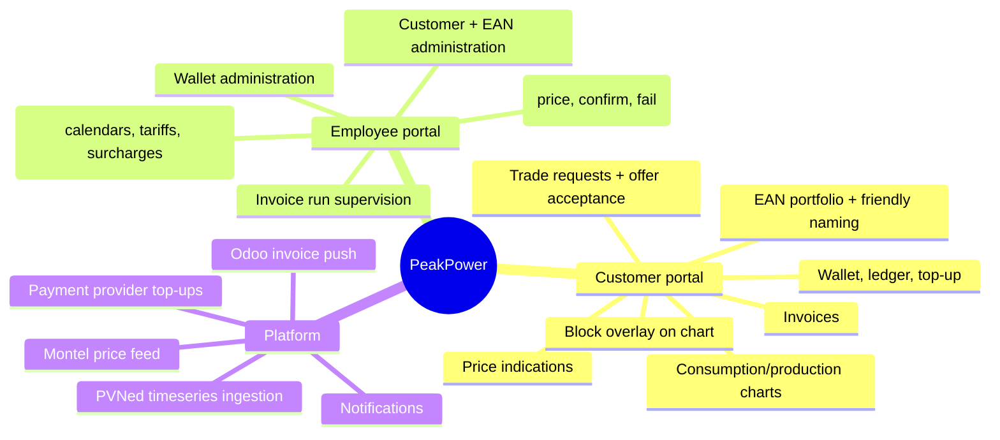

# Vision & Scope

## 1. The problem

Dutch **grootverbruik** (large-consumption) organisations — manufacturers, cold stores, data centres,
greenhouses, logistics hubs — buy electricity in volumes large enough that the wholesale market is
worth engaging with directly, but not large enough to justify an in-house trading desk.

Today that gap is bridged by phone calls, spreadsheets and email:

- The customer has no live view of their own consumption per metering point.
- Price indications arrive as a screenshot or a verbal quote.
- A purchase request is an email; the confirmation is another email.
- The relationship between *what was bought* and *what was actually consumed* only becomes visible
  weeks later, on an invoice nobody can reconstruct.

PeakPower already performs the back-office and market-access role. What is missing is the product
surface around it.

## 2. The product

**PeakPower is a self-service portal that lets grootverbruik customers see their energy position and
buy or sell wholesale energy blocks against it, with PeakPower brokering every trade.**

Three ideas hold it together:

1. **Position first.** The customer sees measured consumption and production per metering point,
   with already-purchased blocks overlaid on the same chart. Buying decisions are made against a
   picture, not a price list.
2. **Quote-driven trading, not an order book.** The customer requests; PeakPower responds with a
   firm, time-limited price; the customer accepts or rejects. PeakPower keeps the human in the loop
   for market execution, and the platform keeps the audit trail.
3. **A wallet as the settlement primitive.** Money in the wallet backs every trade. Reservations,
   confirmations, invoices and refunds are all ledger entries against one balance the customer can
   inspect line by line.

## 3. Who it is for

| Segment | Description |
| --- | --- |
| **Primary** | Dutch grootverbruik electricity customers with one or more EAN connections, typically 1–50 metering points, annual volume 1–100 GWh |
| **Secondary** | Multi-site organisations that want to bundle small volumes across sites into whole-MW market blocks |
| **Internal** | PeakPower back-office employees who price, execute and settle the trades |

See [Actors & roles](03-actors-and-roles.md) for the full actor list.

## 4. Scope

### 4.1 In scope — first release track

### 4.2 Explicitly out of scope — this track

| Out of scope | Rationale / when |
| --- | --- |
| **Gas** connections and gas products | Deliberately deferred. The data model is built gas-ready (commodity discriminator on EAN, product and price) but no gas-specific pricing, tariffs or unit handling is implemented. See [OQ-01]. |
| Direct market access / automated execution | PeakPower executes manually with its counterparty. The platform records the outcome; it does not send orders to an exchange. |
| Intraday and imbalance *trading* | Imbalance is settled and invoiced, not traded. |
| PPA / long-term bilateral contract management | Different product shape, different legal surface. |
| Network / transport cost billing (netbeheerkosten) | Invoiced directly by the DSO to the customer in the grootverbruik segment. See [OQ-18]. |
| Supplier switching, connection change requests (mutaties) | Handled outside the platform. |
| Customer self-onboarding | Customers and EANs are created by PeakPower employees. Self-service registration is a later phase. |
| Native mobile apps | Responsive web only. |

### 4.3 Deferred but designed for

These are not built in the first track, but the architecture must not preclude them:

- Gas commodity alongside electricity.
- Additional data providers next to PVNed.
- Additional block shapes (weekend, off-peak-only, custom shape).
- Multi-language UI (Dutch first, English second) — all user-facing strings externalised from day one.
- Customer users with differentiated rights (viewer vs. trader vs. admin).

## 5. Goals and success criteria

| # | Goal | Measure |
| --- | --- | --- |
| G1 | Customers can see their own position without asking PeakPower | ≥ 80% of active customers open the consumption view at least weekly |
| G2 | Trade turnaround shrinks | Median request → offer under 30 min; median offer → decision under 15 min |
| G3 | Back-office effort per trade drops | No manual spreadsheet step between request and confirmed trade |
| G4 | Invoices are reconstructable | Every invoice line traceable to interval data, a block, a tariff or a ledger entry |
| G5 | Nothing is lost | Every trade state change and every cent movement is in an immutable audit trail |

## 6. Guiding principles

1. **Immutable facts, derived views.** Metering data, ledger entries and trade events are append-only.
   Balances, positions and invoices are derived and reproducible from them.
2. **The customer and the employee see the same truth.** One trade history, one ledger, rendered for
   two audiences. No "internal notes the customer never sees" in the audit trail — internal remarks
   live in a separate, explicitly internal field.
3. **Money movements are never implicit.** Reserve, release, settle and refund are distinct,
   named, logged operations.
4. **Time is hard; be explicit.** Every timestamp is stored in UTC with a known local calendar.
   Every interval calculation accounts for DST. Every "day" is an Amsterdam day.
5. **Third parties are unreliable.** Every inbound integration is idempotent, replayable and
   observable. Every outbound integration is retried and reconciled.

## 7. Constraints

| Constraint | Source |
| --- | --- |
| Backend in **C#/.NET** | Stakeholder preference |
| Frontends in **Angular** | Stakeholder preference |
| **PostgreSQL** as primary datastore | Stakeholder preference |
| **Hangfire** for scheduled work | Stakeholder preference |
| **.NET Aspire** for local orchestration | Stakeholder preference |
| Cloud deployment, Azure as default target | Stakeholder preference; Aspire deploys cleanly to Azure Container Apps |
| Metering data arrives only from **PVNed**, push-only | Third-party contract |
| Price indications come from an **existing Montel API implementation** | Existing asset to be reused |
| Data residency: EU | Dutch customers, GDPR |

## 8. What "done" looks like for this specification set

This set is complete enough to:

- run a stakeholder review and close the open questions in [80-open-questions.md](../80-open-questions.md);
- produce a story-level backlog and a T-shirt-size estimate per feature;
- start the architecture spike for PVNed ingestion and the wallet ledger, which are the two areas
  where a wrong early decision is expensive to unwind.

It is **not** yet a build specification for the invoicing engine — that requires the energiebelasting
tariff table, the imbalance cost allocation rule and the VAT treatment to be confirmed first
([OQ-14], [OQ-15], [OQ-17]).
