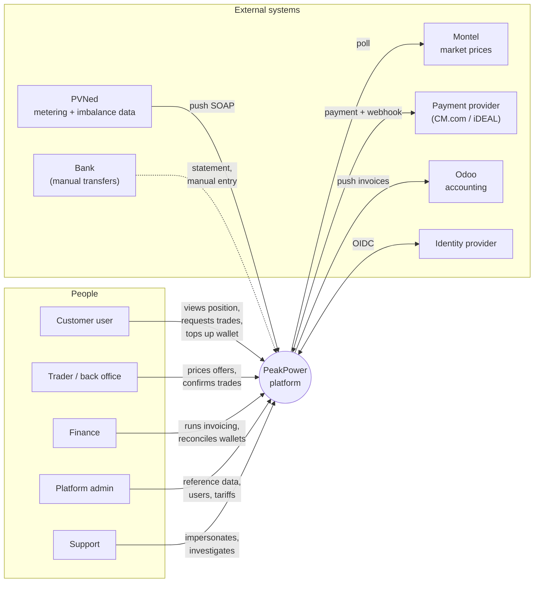
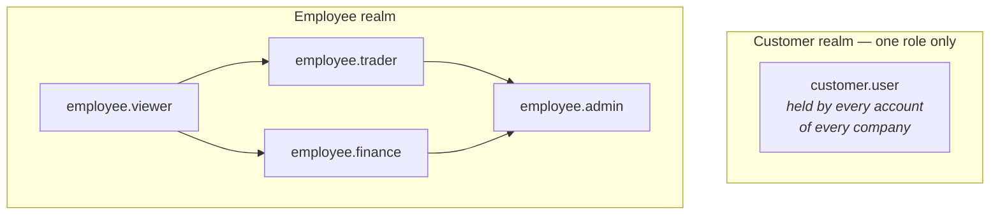

# Actors & Roles

## 1. Actor map

## 2. Human actors

### 2.1 Customer user

A person at the customer **company** who holds a **customer account** and uses the customer portal.

| | |
| --- | --- |
| **Goals** | Understand consumption, judge whether to hedge, execute a purchase, keep the wallet funded, check invoices |
| **Frequency** | Weekly to daily during volatile markets; monthly otherwise |
| **Expertise** | Energy-aware but not a trader. Comfortable with MWh and €/MWh; will not know what an ISP is |
| **Context** | Desktop, office hours, often comparing the portal against their own consumption planning |
| **Key screens** | Consumption chart, price indications, trade wizard, offer countdown, wallet, invoices |

#### One company, several accounts

A customer company has **one or more accounts**, each created by a PeakPower employee. Typical
shapes:

| Company | Accounts |
| --- | --- |
| Small manufacturer | 1 — the site or facility manager |
| Mid-size, multi-site | 2–4 — energy manager, finance, an operations backup |
| Larger organisation | 5+ — energy team, controller, plant managers per site |

**All accounts of one company are equal [DEC-16].** Every account sees the same data, can raise a
trade request, can accept or reject an offer, can top up the wallet, and can read the full ledger and
every invoice. There is no viewer/trader/approver split inside a company.

This is a deliberate product decision, not a simplification deferred for later. The customer decides
internally who does what; the platform's job is to record **who actually did it**.

#### Actions are attributed to the account, not the company [DEC-17]

The consequence of equal privileges is that attribution has to be precise. Every trade event and
every wallet movement records the **acting account**, so the history reads:

> **Requested by** J. de Vries (Energy Manager) · 14:25
> **Accepted by** M. Vandersteen (Finance Director) · 14:44

A request raised by one account may be answered by another. That is expected behaviour — the person
who spots the exposure is often not the person who signs off the spend — and the audit trail is what
makes it accountable rather than anonymous.

#### Account details

| Field | Notes |
| --- | --- |
| Username | Login identifier, unique across the platform |
| Password | Held by the identity provider, never by the platform — see [F13](../10-features/F13-identity-and-access.md) and [OQ-78] |
| First name, last name | Shown in the audit trail and in notifications |
| **Role in the company** | Free text job title. Displayed for context; grants nothing |
| Contact phone | |
| Contact email | Notification destination; may differ from the username |

Self-service account management by the customer is **out of scope** — accounts are created,
deactivated and edited by PeakPower employees. See [F13](../10-features/F13-identity-and-access.md).

### 2.2 Trader / back office

The PeakPower employee who turns a request into a price and executes it with the counterparty.

| | |
| --- | --- |
| **Goals** | See incoming requests immediately, price them accurately, execute externally, keep the platform in sync with reality |
| **Frequency** | Continuous during market hours |
| **Expertise** | Expert. Works with the wholesale market daily |
| **Pressure** | Time-critical. An offer has a countdown; the market moves underneath it |
| **Key screens** | Trade desk queue, trade detail with pricing panel, confirm/fail actions, customer wallet check |

### 2.3 Finance

| | |
| --- | --- |
| **Goals** | Correct monthly invoices, correct annual true-up, clean handover to Odoo, wallets that reconcile against the bank |
| **Frequency** | Monthly peak around month-close; January peak for the true-up |
| **Key screens** | Invoice run dashboard, invoice detail per EAN, wallet ledger, unmatched bank transfers, Odoo push status |

### 2.4 Platform admin

| | |
| --- | --- |
| **Goals** | Reference data is right: peak calendars, energiebelasting tariffs, surcharges, Montel ticker mapping, wallet threshold rules, employee accounts |
| **Frequency** | Low but high-impact. A wrong calendar or tariff corrupts every downstream calculation |
| **Key screens** | Reference data admin, customer configuration, user management, integration health |

### 2.5 Support

| | |
| --- | --- |
| **Goals** | Answer "why does my chart look like this" and "where did my money go" |
| **Needs** | Read-only view of any customer's data, including a **view-as-customer** mode. Every impersonation is logged and visible to the customer's own audit trail |

## 3. System actors

| Actor | Direction | Trigger | Notes |
| --- | --- | --- | --- |
| **PVNed** | Inbound | PVNed pushes | SOAP over HTTPS to a dedicated webhook endpoint. Allocation data from D+1; corrections up to 10 working days. Also supplies imbalance data. See [integration spec](../30-integrations/01-pvned-timeseries.md). |
| **Montel** | Outbound poll | Scheduled | Price indications (near real-time during market hours) and day-ahead prices (after auction publication). |
| **Payment provider** | Both | Customer-initiated + webhook | iDEAL payment request out, status webhook in. |
| **Odoo** | Outbound | Invoice finalisation | Invoice header + lines pushed; document reference stored back. |
| **Identity provider** | Both | Login | OIDC authorisation code + PKCE. |
| **Bank** | Manual | Finance | No direct integration in the first track. Finance registers received transfers manually or from a statement import. See [OQ-07]. |
| **Notification channels** | Outbound | Rules + events | Email first; in-app notification centre. SMS/push out of scope. |

## 4. Role & permission model

Two disjoint identity populations, two portals, two APIs.

Arrows read as *"is a superset of"*: `employee.admin` holds everything.

### 4.1 Permission matrix

`customer.user` is held by **every** customer account. The column below therefore describes what any
account of any company can do within its own company.

| Capability | customer.user | employee.viewer | employee.trader | employee.finance | employee.admin |
| --- | :--: | :--: | :--: | :--: | :--: |
| View own company's metering points & data | ✅ | — | — | — | — |
| Edit metering point name/description | ✅ | — | ✅ | — | ✅ |
| View any customer's data | — | ✅ | ✅ | ✅ | ✅ |
| Create/cancel a trade request for own company | ✅ | — | — | — | — |
| Accept/reject **any** offer of own company | ✅ | — | — | — | — |
| Create trade request on behalf of a customer | — | — | ✅ | — | ✅ |
| Price an offer / set reaction window | — | — | ✅ | — | ✅ |
| Confirm or fail a pending trade | — | — | ✅ | — | ✅ |
| View own company's wallet & ledger | ✅ | — | — | — | — |
| View any wallet & ledger | — | ✅ | ✅ | ✅ | ✅ |
| Register a manual bank deposit | — | — | — | ✅ | ✅ |
| Manual wallet adjustment (with mandatory reason) | — | — | — | ✅ | ✅ |
| Initiate an iDEAL top-up for own company | ✅ | — | — | — | — |
| View own company's invoices | ✅ | — | — | — | — |
| Run / re-run invoicing | — | — | — | ✅ | ✅ |
| Finalise & push invoice to Odoo | — | — | — | ✅ | ✅ |
| Credit an invoice | — | — | — | ✅ | ✅ |
| Manage customers & metering points | — | — | ✅ | — | ✅ |
| Manage surcharges per customer | — | — | — | ✅ | ✅ |
| Manage peak calendar & tax tariffs | — | — | — | — | ✅ |
| Manage Montel ticker mapping | — | — | ✅ | — | ✅ |
| Manage wallet threshold rules (global) | — | — | — | ✅ | ✅ |
| Manage employee users & roles | — | — | — | — | ✅ |
| **Create / deactivate customer accounts** | — | — | ✅ | — | ✅ |
| View integration health & message log | — | ✅ | ✅ | ✅ | ✅ |
| Replay an inbound message | — | — | — | — | ✅ |
| View-as-customer (impersonate, read-only) | — | ✅ | ✅ | ✅ | ✅ |
| View audit log | — | ✅ | ✅ | ✅ | ✅ |

### 4.2 Rules that hold regardless of role

1. **No employee can move money without a reason string.** Manual adjustments, failed-trade releases
   and credit notes all require a mandatory note that is stored and shown to the customer.
2. **No one can edit history.** Corrections are new entries, never mutations.
3. **Customer data access is always scoped by `customer_id`** at the query layer, not only in the
   controller — see [Security](../20-architecture/07-security.md).
4. **Four-eyes is not required in the first release** but the audit model makes it addable
   ([OQ-09] asks whether high-value trades should require a second approver).
