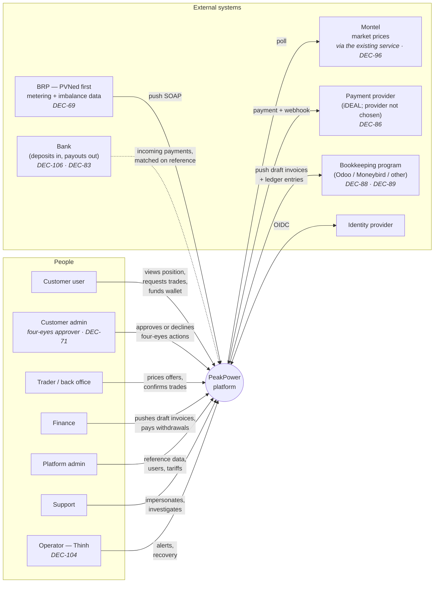
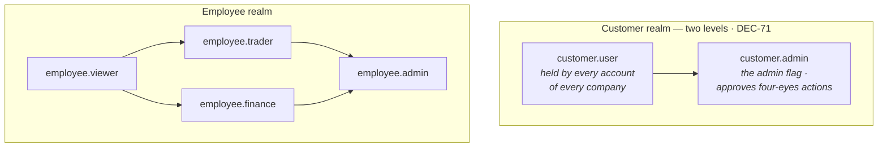

# Actors & Roles

## 1. Actor map

What moved on 2026-08-19, and why the map is not the one it was: the customer realm gained an
**admin** level **[DEC-71]**; the metering source became a configurable **BRP** with PVNed as the
first adapter rather than the pipeline itself **[DEC-69]**; the accounting counterparty became a
**bookkeeping program** that owns invoice numbering and the PDF **[DEC-88]**, **[DEC-89]**, and that
learns about wallet movements from its own bank feed rather than from the platform **[DEC-109]**; no
payment provider is chosen **[DEC-86]** and bank transfer became a first-class deposit route with a
platform-issued reference **[DEC-106]**; and a single named operator runs the platform after go-live
**[DEC-104]**.

## 2. Human actors

### 2.1 Customer user

A person at the customer **company** who holds a **customer account** and uses the customer portal.

| | |
| --- | --- |
| **Goals** | Understand consumption, judge whether to hedge, execute a purchase, keep the wallet funded, check invoices. ⚠ **Amended 2026-08-19 by [DEC-77]** — the wallet funds **trading only** (**[AS-12]** reversed): delivery invoices are paid to the bank and never touch it. Invoices are still read in the portal, but the number and the PDF come from the bookkeeping program **[DEC-88]**, **[DEC-89]** |
| **Frequency** | Weekly to daily during volatile markets; monthly otherwise |
| **Expertise** | Energy-aware but not a trader. Comfortable with MWh and €/MWh; will not know what an ISP is |
| **Context** | Desktop, office hours, often comparing the portal against their own consumption planning |
| **Key screens** | Consumption chart, price indications, trade wizard, offer countdown, wallet, invoices — and, for an **admin** of a company with four-eyes enabled, the approval queue **[DEC-71]** |

#### One company, several accounts

A customer company has **one or more accounts**, each created by a PeakPower employee. Typical
shapes:

| Company | Accounts |
| --- | --- |
| Small manufacturer | 1 — the site or facility manager |
| Mid-size, multi-site | 2–4 — energy manager, finance, an operations backup |
| Larger organisation | 5+ — energy team, controller, plant managers per site |

A one-account company is still a normal shape, but it cannot enable four-eyes — see *The admin flag
and four-eyes* below, rule **FE-1**.

**All accounts of one company are equal [DEC-16].** Every account sees the same data, can raise a
trade request, can accept or reject an offer, can top up the wallet, and can read the full ledger and
every invoice. There is no viewer/trader/approver split inside a company.

This is a deliberate product decision, not a simplification deferred for later. The customer decides
internally who does what; the platform's job is to record **who actually did it**.

⚠ **Amended 2026-08-19 by [DEC-71].** Everything above still describes what an account may *do* — a
non-admin account keeps every ordinary privilege in that list, and data visibility is identical for
all accounts. What is no longer true is that accounts are indistinguishable: each one carries an
**admin** flag. There is still no viewer/trader/approver split; there are two levels, not four, and
the second exists for one purpose only. Everything **[DEC-16]** said about *who creates and
deactivates accounts* — PeakPower employees, never the customer — is unchanged.

#### The admin flag and four-eyes [DEC-71]

A customer account is either an **admin account** or an ordinary account. That is the whole role
model inside a customer company: exactly two levels, and it exists for one reason — four-eyes cannot
be expressed without a second population to draw the approver from. It is not a permission ladder and
it is not the intra-company role model **[DEC-16]** rejected. A non-admin account keeps every
privilege it had: same data, same trade requests, same offer acceptance, same wallet top-ups, same
ledger and invoices.

A **customer company** has four-eyes either **enabled** or **disabled**. There is **no threshold** —
not in euros, not in megawatts — so there is no threshold table to build, no default to ship and no
row that has to be in force before the control works. This **replaces [DEC-33]** and **closes
[OQ-85]**, which existed only to supply the missing figure.

With four-eyes **disabled**, an account acts and the action takes effect. With four-eyes **enabled**,
these actions take effect only after a **second admin** approves them:

| Action | Four-eyes | Why this one |
| --- | :--: | --- |
| Add a bank account | required | It creates a new destination for money leaving the company. A bank account **cannot be edited once added** — it can only be deactivated **[DEC-71]** — so adding is the only moment the control can sit on |
| Deactivate a bank account | required | It removes a payout destination and forces the next withdrawal onto whatever remains |
| Execute a trade | required | It commits the company's money, and once the delivery month starts the hedge cannot be changed **[DEC-78]**. For a trade the gate sits **after acceptance and before PeakPower executes**, so the wallet reservation is already held and the offer's reaction window is the only clock — see [F05](../10-features/F05-energy-block-trading.md) |
| Add a user | required | A new account holds every ordinary privilege the moment it exists, so adding one changes who may spend |
| Withdraw funds | required | A manual outbound bank payment **[DEC-83]** — the only path that moves money out of the platform |
| **Deposit funds** | **not required** | Deliberately excluded. One person can wire money or use iDEAL on their own **[DEC-106]**, so gating a deposit gates nothing while costing a second person's time |

**Who may approve.** A **different admin account of the same company**. Three constraints, all of them
a comparison of ids rather than a permission check, and all of them made recordable by **[DEC-17]**:

1. the approver holds the **admin** flag;
2. the approver belongs to the **same customer company** — no PeakPower employee may approve on the
   customer's behalf, and no admin of another company may;
3. the approver is **not the account that raised the action** — a self-approval attempt is refused
   with a specific error, never silently ignored.

**A four-eyes company therefore needs at least two admin accounts.** These are rules the feature
specs must honour, not advice:

| Rule | Behaviour |
| --- | --- |
| **FE-1** | Four-eyes **cannot be enabled** for a company that does not have **two active admin accounts**. The employee action that enables it is refused with the reason; it is not queued until a second admin appears |
| **FE-2** | While four-eyes is enabled, deactivating an admin account or clearing an admin flag that would leave **fewer than two active admins** is refused. The company appoints another admin first, or an employee switches four-eyes off deliberately — a recorded action **[DEC-17]**, not a side effect |
| **FE-3** | If a company reaches one active admin anyway — a lockout, a person who has left — every four-eyes action is refused **at submission**, with the reason and with what to do about it. It is not accepted and left pending until it expires: an action that can never be approved must not look like one that is merely waiting |
| **FE-4** | There is **no escalation and no timeout that approves**. An unapproved action expires unapproved, and PeakPower cannot approve for the customer (constraint 2 above). Declining is as valid an outcome as approving and is recorded the same way |

Cost, stated plainly: a two-admin company where one admin is on holiday cannot execute a trade inside
a 30-minute offer window. That is the control working, not failing, and it is why four-eyes is a
per-company choice rather than a platform default — the customer decides whether the delay is worth
the protection.

⚠ **Two readings the feature specs must settle, recorded rather than resolved here:**

- **Who may *initiate*.** **[DEC-71]** is worded around an action "taken by one admin account", but it
  explicitly leaves **[DEC-16]**'s ordinary privileges intact for non-admin accounts. The reading
  taken here is that **any account may initiate** and **an admin other than the initiator approves**;
  when the initiator is an admin, the approver is a different admin. The alternative — only admins may
  initiate a sensitive action — would take privileges away from non-admin accounts, which is
  precisely what the ledger says did not happen.
- **Add-a-user against [DEC-16].** Accounts are created and deactivated by PeakPower employees, so
  the customer-side action a second admin approves is the **request** for a new account, not the
  creation itself; the employee acts on an approved request. Where that request and its approval are
  captured — [F01](../10-features/F01-customer-and-metering-points.md) or
  [F13](../10-features/F13-identity-and-access.md) — is not decided here.

⚠ **Source tension carried from [DEC-71]:** the two source rows differ on withdrawals. The union
recorded above takes withdrawal **in** (a manual outbound payment is exactly what the control is for)
and leaves deposits **out** (both rows agree). Confirm at the next session.

#### Actions are attributed to the account, not the company [DEC-17]

The consequence of equal privileges is that attribution has to be precise. Every trade event and
every wallet movement records the **acting account**, so the history reads:

> **Requested by** J. de Vries (Energy Manager) · 14:25
> **Accepted by** M. Vandersteen (Finance Director) · 14:44

A request raised by one account may be answered by another. That is expected behaviour — the person
who spots the exposure is often not the person who signs off the spend — and the audit trail is what
makes it accountable rather than anonymous. Under **[DEC-71]** the second signature is now sometimes
required rather than merely common, and it must come from an admin.

#### Who hears about an offer [DEC-111]

⚠ **Reversed 2026-08-19 by [DEC-111]** — **[DEC-63]** notified **every active account** of the company
when an offer arrived. It no longer does. Notification now goes to:

| Recipient | When |
| --- | --- |
| The account that **raised the request** | Always |
| The **admin who must approve** | Only when the company has four-eyes enabled **[DEC-71]** |

Nobody else is notified. ⚠ Cost, recorded because **[DEC-63]**'s reasoning was exactly this:
**[DEC-18]** still lets any account of the company accept an offer, so the platform now notifies
fewer people than may act, and a 30-minute offer can die because one person is in a meeting. That
risk is accepted deliberately in exchange for not mailing five people about a decision two of them
will make.

#### Account details

| Field | Notes |
| --- | --- |
| Username | Login identifier, unique across the platform |
| Password | Held by the identity provider, never by the platform — see [F13](../10-features/F13-identity-and-access.md) and [OQ-78] |
| First name, last name | Shown in the audit trail and in notifications |
| **Role in the company** | Free text job title. Displayed for context; grants nothing. ⚠ **Amended 2026-08-19 by [DEC-71]** — still grants nothing. The **admin** flag below is the only field on an account that grants anything |
| **Admin** | Boolean **[DEC-71]**. Set and cleared by a PeakPower employee **[DEC-16]**, subject to rule **FE-2**. It grants exactly one capability: approving or declining a four-eyes action of the same company. No extra data access, no extra ordinary privilege, no seniority |
| Contact phone | |
| Contact email | Notification destination; may differ from the username. Under **[DEC-111]** an admin of a four-eyes company receives offer notifications for requests they did not raise |

Self-service account management by the customer is **out of scope** — accounts are created,
deactivated and edited by PeakPower employees, and that includes setting the **admin** flag and the
company's **four-eyes mode** **[DEC-71]**. See
[F13](../10-features/F13-identity-and-access.md).

### 2.2 Trader / back office

The PeakPower employee who turns a request into a price and executes it with the counterparty.

| | |
| --- | --- |
| **Goals** | See incoming requests immediately, price them accurately, execute externally, keep the platform in sync with reality |
| **Frequency** | Continuous during market hours |
| **Expertise** | Expert. Works with the wholesale market daily |
| **Pressure** | Time-critical. An offer has a countdown; the market moves underneath it |
| **Key screens** | Trade desk queue, trade detail with pricing panel, confirm/fail actions, customer wallet check |

### 2.3 Finance

| | |
| --- | --- |
| **Goals** | ~~Correct monthly invoices, correct annual true-up, clean handover to Odoo, wallets that reconcile against the bank~~ ⚠ **Amended 2026-08-19 by [DEC-88]**, **[DEC-99]**, **[DEC-83]** — correct monthly **draft** invoices pushed to the bookkeeping program, which checks, numbers and issues them; a **correction invoice for the delta whenever a late metering correction lands**, at any time, rather than one annual true-up; withdrawal requests paid out by bank transfer; wallets that still reconcile against the bank |
| **Frequency** | Monthly peak around month-close; ~~January peak for the true-up~~ ⚠ **Amended 2026-08-19 by [DEC-99]** — corrections arrive months late and are invoiced when they arrive **[DEC-98]**, so the work is continuous instead of concentrated in January |
| **Key screens** | Invoice run dashboard, invoice detail per EAN, wallet ledger, unmatched bank transfers **[DEC-106]**, ~~Odoo push status~~ draft-invoice push status **[DEC-88]**, withdrawal request queue **[DEC-83]** |

### 2.4 Platform admin

| | |
| --- | --- |
| **Goals** | Reference data is right: peak calendars, energiebelasting **brackets and per-customer reductions** **[DEC-74]**, ~~surcharges~~ ⚠ **Reversed 2026-08-19 by [DEC-73]** (the surcharge left the platform; the bookkeeping program multiplies volume by the topup fee), Montel ticker mapping, the **price-indication markup percentage** (default 2%) **[DEC-80]**, ~~wallet threshold rules~~ ⚠ **Reversed 2026-08-19 by [DEC-90]** (no thresholds, no low-balance alerts), **BRP configuration** — endpoint, credentials, document format **[DEC-69]** — customer **four-eyes mode and admin flags** **[DEC-71]**, employee accounts |
| **Frequency** | Low but high-impact. A wrong calendar or tariff corrupts every downstream calculation, and a wrong energiebelasting bracket now corrupts a **legally owed** amount **[DEC-74]** |
| **Key screens** | Reference data admin, customer configuration, user management, integration health |

### 2.5 Support

| | |
| --- | --- |
| **Goals** | Answer "why does my chart look like this" and "where did my money go" |
| **Needs** | Read-only view of any customer's data, including a **view-as-customer** mode. Every impersonation is logged and visible to the customer's own audit trail |

### 2.6 Operator (after go-live) [DEC-104]

New on 2026-08-19. The role was implicit before; **[DEC-104]** names the person, which makes it an
actor with a name rather than a line in a runbook. **Closes [OQ-63]**.

| | |
| --- | --- |
| **Who** | **Thinh** — a single named operator, no rota, no second line **[DEC-104]** |
| **Goals** | The platform is up, background jobs finish, the BRP and bookkeeping integrations stay connected, P1 alerts get answered |
| **Frequency** | Event-driven. Quiet until an integration fails, a job stalls or a payment stops matching |
| **Platform role** | `employee.admin` — the operator holds no separate role in the permission model. The rest of the job (infrastructure, deployments, alerting) sits outside the platform's role model entirely |
| **Key screens** | Integration health & message log, background job dashboard, message replay, audit log |

⚠ **Recorded as a risk, not solved here: one operator is a single point of failure for P1 alerts.**
There is no contractual customer SLA **[DEC-103]**, so availability targets are internal engineering
goals rather than commitments with a remedy — that lowers the *contractual* cost of an unanswered
alert, not the operational one. The escalation shape stays open in [OQ-89] (break-glass time box and
function set) and [OQ-62] (single region versus warm secondary). See
[Risks](../70-delivery/02-risks.md).

## 3. System actors

| Actor | Direction | Trigger | Notes |
| --- | --- | --- | --- |
| **BRP** — PVNed first | Inbound | The BRP pushes | SOAP over HTTPS to a dedicated webhook endpoint. Allocation data from D+1; ~~corrections up to 10 working days~~ ⚠ **Amended 2026-08-19 by [DEC-98]**, **[DEC-99]** — reconciliation data does arrive after the 10-working-day window, sometimes as a manual process, and a correction landing months later produces a correction invoice for the delta. Also supplies imbalance data. ⚠ **Amended 2026-08-19 by [DEC-69]** — the metering source is a **configurable BRP** with its own credentials, endpoint, format and ingestion adapter; **PVNed is the first adapter behind a port**, not the pipeline itself. Raw-payload persistence, versioning **[DEC-07]** and quarantine stay BRP-agnostic. See [integration spec](../30-integrations/01-pvned-timeseries.md). |
| **Montel** | Outbound poll | Scheduled | Price indications (near real-time during market hours) and day-ahead prices (after auction publication), with history available for backfill **[DEC-75]**. ⚠ **Amended 2026-08-19 by [DEC-96]** — the platform integrates the **existing PeakPower Montel service** rather than the Montel API directly. Indications are never shown raw: quote plus a configurable percentage **[DEC-80]**. |
| **Payment provider** | Both | Customer-initiated + webhook | iDEAL payment request out, status webhook in. ⚠ **Amended 2026-08-19 by [DEC-86]** — **no provider is chosen**; CM.com is a candidate, not a commitment, and the provider-agnostic port is the mitigation. iDEAL is limited at the bank side, which is why bank transfer is a first-class deposit route **[DEC-106]** rather than a fallback. |
| **Bookkeeping program** — Odoo, Moneybird or another | Outbound | Draft ready; ledger push | ~~Invoice header + lines pushed on invoice finalisation; document reference stored back.~~ ⚠ **Amended 2026-08-19 by [DEC-88]**, **[DEC-89]**, **[DEC-109]** — the platform pushes a **draft**; a human checks it there; that program assigns the **number**, renders the **PDF** and **emails** it, and the platform stores the returned number for display and reconciliation but never mints one. Energiebelasting goes across as a **ledger entry** **[DEC-74]**; VAT is applied per ledger account in that program, not here **[DEC-76]**. Wallet **deposits and withdrawals are not pushed** — the bookkeeping program sees them on its own bank feed **[DEC-109]**. ⚠ [OQ-69] (version and API) is now a blocker rather than a detail: without this integration no invoice can be issued at all. |
| **Identity provider** | Both | Login | OIDC authorisation code + PKCE. ⚠ **Amended 2026-08-19 by [DEC-92]** — **MFA is mandatory for customer users**. It is still enforced by Conditional Access in the tenant **[DEC-66]** rather than implemented in the platform, but the platform verifies the authentication-method claim on the token instead of trusting the tenant silently. |
| **Bank** | Both | Deposits in, payouts out | ~~No direct integration in the first track. Finance registers received transfers manually or from a statement import. See [OQ-07].~~ ⚠ **Amended 2026-08-19 by [DEC-106]**, **[DEC-83]** — a bank transfer is a **first-class deposit method**: the platform issues a **unique payment reference** per deposit intent, matches the incoming payment on it, credits the wallet and emails the customer that funds were received. IBAN matching **[DEC-61]** is the fallback when the reference is omitted; manual registration is the fallback to that. **Withdrawals are paid out manually** by an employee to the company bank account. [OQ-07] is **closed** — an incoming-payment feed is in scope for wallet deposits only; **which** feed (CAMT.053 import, PSP webhook, SEPA-instant push) is [OQ-93]. |
| **Customer systems** | Inbound | Customer-initiated | New **[DEC-97]** — interval and aggregated **net usage** per metering point, scoped to the calling company. Nothing priced: no forward prices, no price history, no export of prices **[DEC-81]**. Whether the transport is an API, file/FTP or both is [OQ-95]. |
| **Notification channels** | Outbound | Rules + events | Email first; in-app notification centre. SMS/push out of scope. ⚠ **Amended 2026-08-19 by [DEC-89]**, **[DEC-111]** — invoice emails are sent by the **bookkeeping program**, so this channel carries the platform's own notifications only (offers, wallet events, alerts) over SendGrid **[DEC-48]**; and an offer notifies the **requester plus, under four-eyes, the approving admin**, not every active account. |

## 4. Role & permission model

Two disjoint identity populations, two portals, two APIs.

Arrows read as *"is a superset of"*: `employee.admin` holds everything.

⚠ **Amended 2026-08-19 by [DEC-71]** — the customer realm was labelled *one role only* and is now two.
The arrow in that realm is deliberately the shallowest one on the diagram: `customer.admin` is
`customer.user` **plus a single capability**, approving or declining a four-eyes action of its own
company. It carries no wider data access and no other privilege, which is what keeps the amendment to
**[DEC-16]** a qualification rather than the intra-company role model that decision rejected.

### 4.1 Permission matrix

`customer.user` is held by **every** customer account. The column below therefore describes what any
account of any company can do within its own company.

⚠ **Amended 2026-08-19 by [DEC-71]** — a `customer.admin` column is added. It repeats the
`customer.user` column everywhere except **one row**, and a ✅ in it means *inherited*, never
*wider*. Two reading rules for the whole table:

- **⚖** marks an action that, when the company has four-eyes **enabled**, takes effect only after a
  **different admin of the same company** approves it. A ✅ next to ⚖ still means *may initiate*.
- Deposits carry no ⚖ deliberately **[DEC-71]**.

| Capability | customer.user | customer.admin | employee.viewer | employee.trader | employee.finance | employee.admin |
| --- | :--: | :--: | :--: | :--: | :--: | :--: |
| View own company's metering points & data | ✅ | ✅ | — | — | — | — |
| Edit metering point name/description | ✅ | ✅ | — | ✅ | — | ✅ |
| View any customer's data | — | — | ✅ | ✅ | ✅ | ✅ |
| Create/cancel a trade request for own company | ✅ | ✅ | — | — | — | — |
| Accept/reject **any** offer of own company — **⚖ on acceptance only**; rejecting releases the reservation and needs no second pair of eyes | ✅ | ✅ | — | — | — | — |
| **Approve / decline a four-eyes action of own company [DEC-71]** | — | ✅ | — | — | — | — |
| Create trade request on behalf of a customer | — | — | — | ✅ | — | ✅ |
| Price an offer / set reaction window | — | — | — | ✅ | — | ✅ |
| Confirm or fail a pending trade | — | — | — | ✅ | — | ✅ |
| View own company's wallet & ledger | ✅ | ✅ | — | — | — | — |
| View any wallet & ledger | — | — | ✅ | ✅ | ✅ | ✅ |
| Register a manual bank deposit — fallback only **[DEC-106]** | — | — | — | — | ✅ | ✅ |
| ~~Manual wallet adjustment (with mandatory reason)~~ ⚠ **Reversed 2026-08-19 by [DEC-85]** — chargebacks and reversals are handled in the bookkeeping program; the adjustment-with-a-reason path leaves the platform | — | — | — | — | ~~✅~~ | ~~✅~~ |
| Initiate a deposit for own company — iDEAL **or bank transfer with a platform-issued reference [DEC-106]** | ✅ | ✅ | — | — | — | — |
| **Request a withdrawal to the company bank account ⚖ [DEC-83]** | ✅ | ✅ | — | — | — | — |
| **Pay out an approved withdrawal, manually [DEC-83]** | — | — | — | — | ✅ | ✅ |
| **Add / deactivate a bank account, customer-side ⚖ [DEC-71]** — a bank account **cannot be edited once added**, only deactivated | ✅ | ✅ | — | — | — | — |
| **Request a new account for own company ⚖ [DEC-71]** — the account itself is still created by a PeakPower employee **[DEC-16]**, on an approved request | ✅ | ✅ | — | — | — | — |
| View own company's invoices — number and PDF come from the bookkeeping program **[DEC-88]**, **[DEC-89]** | ✅ | ✅ | — | — | — | — |
| Run / re-run invoicing — produces a **draft** **[DEC-88]** | — | — | — | — | ✅ | ✅ |
| ~~Finalise & push invoice to Odoo~~ ⚠ **Amended 2026-08-19 by [DEC-88]** — push a **draft** to the bookkeeping program; it checks, numbers and issues. The platform never finalises or mints a number | — | — | — | — | ✅ | ✅ |
| ~~Credit an invoice~~ ⚠ **Amended 2026-08-19 by [DEC-99]**, **[DEC-88]** — calculate the delta from a late metering correction and push a **correction draft**; the bookkeeping program credits and numbers it | — | — | — | — | ✅ | ✅ |
| Manage customers & metering points | — | — | — | ✅ | — | ✅ |
| **Set a company's four-eyes mode and an account's admin flag [DEC-71]** — subject to rules **FE-1**/**FE-2** | — | — | — | ✅ | — | ✅ |
| ~~Manage surcharges per customer~~ ⚠ **Reversed 2026-08-19 by [DEC-73]** — the surcharge left the platform; the bookkeeping program multiplies pushed volume by the topup fee | — | — | — | — | ~~✅~~ | ~~✅~~ |
| Manage peak calendar & ~~tax tariffs~~ **energiebelasting brackets and per-customer reductions [DEC-74]** | — | — | — | — | — | ✅ |
| Manage Montel ticker mapping | — | — | — | ✅ | — | ✅ |
| **Set the price-indication markup percentage — default 2% [DEC-80]** | — | — | — | ✅ | — | ✅ |
| **Configure a BRP — endpoint, credentials, document format [DEC-69]** | — | — | — | — | — | ✅ |
| ~~Manage wallet threshold rules (global)~~ ⚠ **Reversed 2026-08-19 by [DEC-90]** — no thresholds and no low-balance alerts; the pre-trade check **[DEC-41]** is the only reader of the balance | — | — | — | — | ~~✅~~ | ~~✅~~ |
| Manage employee users & roles | — | — | — | — | — | ✅ |
| **Create / deactivate customer accounts** | — | — | — | ✅ | — | ✅ |
| **Retrieve own company's usage over the customer API [DEC-97]** — net usage only, nothing priced **[DEC-81]** | ✅ | ✅ | — | — | — | — |
| View integration health & message log | — | — | ✅ | ✅ | ✅ | ✅ |
| Replay an inbound message | — | — | — | — | — | ✅ |
| View-as-customer (impersonate, read-only) | — | — | ✅ | ✅ | ✅ | ✅ |
| View audit log | — | — | ✅ | ✅ | ✅ | ✅ |

### 4.2 Rules that hold regardless of role

1. **No employee can move money without a reason string.** Manual adjustments, failed-trade releases
   and credit notes all require a mandatory note that is stored and shown to the customer.
   ⚠ **Amended 2026-08-19 by [DEC-85]** — the *manual adjustment* leaves the platform entirely
   (chargebacks and reversals are handled in the bookkeeping program), so what this rule now governs
   is the failed-trade release, the withdrawal payout **[DEC-83]** and the correction draft
   **[DEC-99]**. The rule itself is unchanged for what remains.
2. **No one can edit history.** Corrections are new entries, never mutations.
3. **Customer data access is always scoped by `customer_id`** at the query layer, not only in the
   controller — see [Security](../20-architecture/07-security.md).
4. ~~**Four-eyes is not required in the first release** but the audit model makes it addable
   ([OQ-09] asks whether high-value trades should require a second approver).~~
   ⚠ **Reversed 2026-08-19 by [DEC-71].** Four-eyes is in scope, as a **per-customer-company mode
   with no threshold** — which also **replaces [DEC-33]** and **closes [OQ-85]**, the question that
   existed to supply the threshold figure. When a company has it enabled, the five actions listed
   under *The admin flag and four-eyes* (§2.1) take effect only after a **different admin account of
   the same company** approves them; deposits are excluded. What this rule got right was the
   mechanism — **[DEC-17]** attribution is what carries the approval trail. What it got wrong was the
   release.
5. **A company with four-eyes enabled always has at least two active admin accounts** **[DEC-71]**.
   Rules **FE-1** to **FE-4** in §2.1 are binding on the feature specs, not advisory: no enabling
   below two admins, no deactivation that drops below two, refusal **at submission** if a company
   ends up with one anyway, and no escalation path that lets PeakPower approve on the customer's
   behalf. A control that cannot be satisfied must fail loudly at the moment it is invoked, not
   silently at expiry.
6. **The admin flag grants approval, nothing else** **[DEC-71]**. It is not seniority, not wider data
   access and not a prerequisite for any ordinary action — **[DEC-16]** still gives a non-admin
   account every ordinary privilege.
