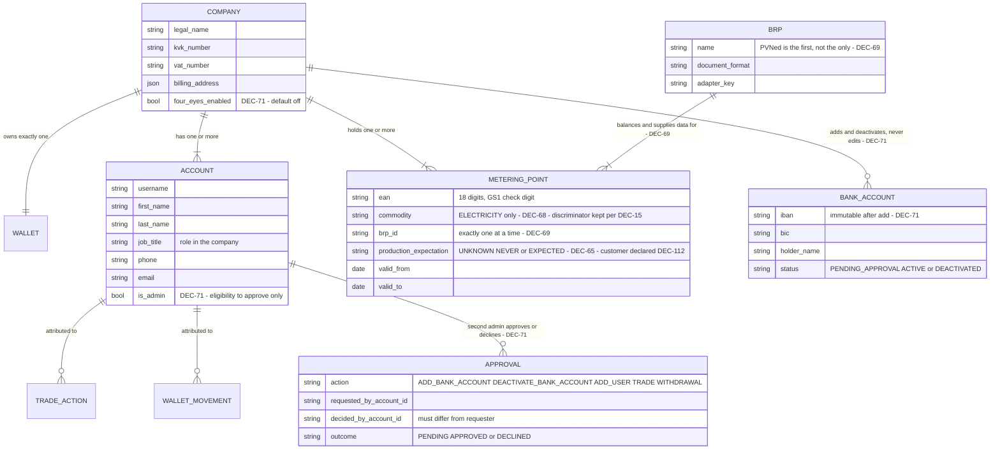

# F01 — Customer, Accounts & Metering Points

**Portal:** both · **Priority:** Must · **Phase:** 1 · **Size:** M

---

## 1. Summary

Three things, all administered by PeakPower employees rather than self-service:

**The customer is a company.** It carries the commercial identity — legal name, KvK registration,
VAT number, bank account, addresses, contacts — and it owns exactly one wallet.

**A company has one or more accounts.** Each account is one person's login: username, name, their
role in the company, and contact details. All accounts of a company are equal **[DEC-16]** and see
identical data. What distinguishes them is not permission but **attribution**: every action records
which account performed it **[DEC-17]**.

⚠ **Amended 2026-08-19 by [DEC-71]** — an account now carries an **admin** flag, and a company carries
a **four-eyes enabled** flag. This *qualifies* **[DEC-16]**; it does not reverse it, and the line
between the two is worth stating precisely.

- **What survives of [DEC-16].** Accounts are still created and deactivated by **PeakPower employees**
  only — there is no self-registration and no customer-side user management. And a **non-admin account
  keeps every ordinary privilege**: it sees exactly the same data **[F01-R14]**, requests, accepts and
  refuses trades **[DEC-18]**, tops the wallet up, and renames metering points. Nothing an account
  could do before 2026-08-19 requires the admin flag after it.
- **What [DEC-71] adds.** Exactly two levels, and only because four eyes cannot be expressed with one.
  The admin flag confers a single thing: **eligibility to give or withhold the second pair of eyes**
  **[F01-R47]**. It grants no extra data, no extra screens and no extra spending power.
- **What it costs.** A company that switches four-eyes on must keep **two** admins alive **[F01-R43]**,
  **[F01-R50]**, and every sensitive action gains a state in which it is neither done nor refused —
  which is a state that can expire, be forgotten, or block a payment.

**A company has one or more metering points**, identified by an 18-digit EAN. Because grootverbruik
customers routinely hold dozens of connections and an EAN is unmemorable, the platform lets the
customer attach their own vocabulary — *"Venlo cold store"*, *"Line 3 compressors"* — and then uses
that vocabulary everywhere: charts, trade requests, invoices, notifications.

The EAN never changes, even when the physical meter is replaced. That stability is what makes it a
safe natural key.

**A connection either produces or it does not, and the platform has to know which.** PVNed sends
**no `A01` production series at all** for a connection that never produces — the series is simply
absent **[DEC-65]**. So a metering point carries a recorded **production expectation** **[F01-R39]**.
Without it, an ingestion failure on a producing connection is indistinguishable from a connection that
never produces, and since **[DEC-22]** made net usage the volume basis that difference is a
**settlement figure, not a chart**. It is deliberately **not** a yes/no flag: "nobody has established
it yet" is a third answer, and it is the one most new registrations start in.

⚠ **Amended 2026-08-19 by [DEC-112]** — the expectation is **the customer's responsibility**, declared
at **onboarding** **[F01-R54]**. **SJV** (*standaardjaarverbruik*) and profile fractions are available
to **sanity-check** that declaration, never to produce it: they describe an expected consumption
pattern for a connection profile, and a solar installation commissioned last month is exactly the fact
they do not know. This gives **[F01-R39..R41]** the owner and the moment they lacked and **closes
[OQ-91]**. The three values, the `UNKNOWN` default, and the forward-only reading of a change
**[F01-R41]** are unchanged.

**Metering data reaches the platform through a BRP, and a metering point names exactly one of them.**
PVNed is the **first** BRP, not the only one **[DEC-69]**. A second BRP is a second adapter behind the
same port — credentials, endpoint, document format and parser — not a second pipeline. The assignment
sits on the metering point rather than on the company because that is the grain at which it genuinely
differs: one customer can hold connections balanced by two different parties **[F01-R51]**.

**Gas is out of scope** **[DEC-68]**. The `commodity` discriminator stays on metering point, product,
tariff and price **[DEC-15]** — it is nearly free now and expensive to retrofit, and gas is out of
scope *for now* rather than permanently — but **`ELECTRICITY` is the only value with data, tariffs or
products behind it** **[F01-R52]**. ⚠ **[DEC-30]** (gas keeps the same EAN model and the same block
products; volumes in m³) is **withdrawn**: it described work that is no longer planned.

## 2. User stories

| As a… | I want to… | So that… |
| --- | --- | --- |
| Employee | register a new customer company with contact, registration and bank details | it can be invoiced, its transfers can be matched to its wallet, and it can be given portal access |
| Employee | create several accounts for one company | each person at the customer logs in as themselves |
| Employee | see who at the customer has an account, and their role in the company | I know who I am dealing with when they call |
| Employee | deactivate an account when someone leaves | access ends immediately without losing their history |
| Employee | attach one or more EANs to a company with a validity period | their data lands in the right place |
| Employee | record whether a connection is expected to produce | an absent production series is either normal or a fault, and the platform can tell which |
| Employee | end-date an EAN when the contract ends | historical data stays intact but the connection stops accruing. ⚠ Blocks already bought are **not** ended with it **[DEC-82]**, **[F01-R53]** |
| Employee | mark an account as an **admin** and switch four-eyes on for a company | the customer's own internal control is expressible without PeakPower maintaining their org chart **[DEC-71]** |
| Employee | replace a bank account by deactivating the old one and adding the new one | a change of bank details is two audited events with an approver, not one silent field edit **[DEC-71]** |
| Employee | assign a metering point to a BRP | its data arrives through the right adapter and its balance responsibility is unambiguous **[DEC-69]** |
| Customer admin | approve or decline a colleague's bank-account change, user addition, trade or withdrawal | no single person at my company can widen access or move money alone **[DEC-71]** |
| Customer user | declare at onboarding whether a connection produces | the platform can tell an absent production series from a missing one, and the answer comes from the party that knows **[DEC-112]** |
| Customer user | see my colleagues' accounts on the company profile | I know who else can act on our behalf |
| Customer user | see all my connections in one list with their key figures | I can grasp my portfolio at a glance |
| Customer user | give a connection a name and a description | I can recognise it without decoding an 18-digit number |
| Customer user | search and filter my connections | I can work with 40 of them without scrolling |
| Customer user | open a connection and see its details and recent data | I can investigate one site |
| Employee | see which connections have stopped reporting data | I can chase PVNed before the customer notices |

## 3. Functional requirements

### Customer company records

| ID | Requirement | MoSCoW |
| --- | --- | :--: |
| F01-R01 | An employee can create a customer company with: legal name, trade name, KvK number, VAT number, **IBAN, BIC and bank account holder name**, billing address, visiting address, primary contact (name, email, phone), and an internal reference. ⚠ **Amended 2026-08-19 by [DEC-71]** — the bank details are no longer editable company fields. They are captured as the company's **first bank account record** **[F01-R44]**, and from then on the only ways to change them are *deactivate* and *add*. | Must |
| F01-R02 | Legal name and KvK number are mandatory; KvK number is unique across active customers. | Must |
| F01-R03 | The KvK number is validated as 8 digits. The IBAN is validated structurally — country code, length for that country, and the ISO 7064 mod-97 check. An invalid IBAN is rejected at entry, not at payment time. Under **[DEC-71]** "entry" now means **the moment a bank account is added** **[F01-R44]** — which is the only moment an IBAN is ever written, so the check has no second chance later. | Must |
| F01-R04 | A customer has a status: `PROSPECT`, `ACTIVE`, `SUSPENDED`, `CLOSED`. Only `ACTIVE` customers can trade. | Must |
| F01-R05 | Creating a customer automatically creates exactly one EUR wallet, shared by all of its accounts **[AS-02]**. | Must |
| F01-R06 | An employee can edit company details; every change is recorded in the audit log with before/after values. ~~Changes to the IBAN are additionally flagged in the audit log as sensitive.~~ ⚠ **Amended 2026-08-19 by [DEC-71]** — there is no IBAN *change* to flag any more, because a bank account cannot be edited. The two sensitive events are **add** and **deactivate** **[F01-R44]**, each audited with the acting account, the approver where four-eyes applies **[F01-R45]**, and the timestamp. | Must |
| F01-R07 | Customers are never deleted. `CLOSED` removes them from working lists but preserves all data. | Must |
| F01-R08 | An employee can attach free-text internal notes to a customer, not visible to the customer. | Should |
| F01-R09 | The customer's own portal shows the company profile read-only, including the registered bank account, so they can check it is correct. The IBAN is **also the matching key for incoming bank transfers** **[DEC-61]**, **[F07-R21]**, so a stale one costs the customer a day's delay on a top-up rather than merely being untidy. ⚠ **Amended 2026-08-19 by [DEC-106]** and **[DEC-83]** — two things changed and neither replaces the IBAN. (a) The platform now issues a **unique payment reference per deposit intent** **[DEC-106]**; the reference is the *primary* key and the registered IBAN is the **fallback** for the customer who omits it. (b) The bank account is again a live **payout destination**, because **[DEC-83]** reverses **[DEC-43]** and withdrawals exist **[F01-R46]**. A stale IBAN now costs a delayed *outbound* payment as well as a delayed top-up. | Should |

### Customer accounts

| ID | Requirement | MoSCoW |
| --- | --- | :--: |
| F01-R10 | An employee can create one or more accounts for a company, with: **username, first name, last name, role in the company (job title), contact phone, contact email**. | Must |
| F01-R11 | Username is mandatory and unique across the whole platform. Email is mandatory. First and last name are mandatory. Job title and phone are optional but prompted for. | Must |
| F01-R12 | ⚠ **Reversed 2026-09-03 by [DEC-113], permanently by [DEC-119].** The platform sets, stores (as an Argon2id hash) and resets the customer's password, because there is no identity provider to hand the job to. Never *seen* still holds: the hash is never logged and never returned by any endpoint. Original text: The password is never set, stored or seen by the platform. Account creation triggers an invitation through the identity provider, where the person sets their own credential — see [F13](F13-identity-and-access.md) and **[OQ-78]**. | Must |
| F01-R13 | **All accounts of one company have identical privileges** **[DEC-16]**. There is no permission field on an account, and "role in the company" is descriptive only. ⚠ **Amended 2026-08-19 by [DEC-71]** — there is now exactly one flag, `is_admin` **[F01-R47]**, and it is still not a permission field in the ordinary sense: it grants nothing on its own. "Role in the company" remains descriptive and is never checked. **[DEC-33]**'s value threshold, which would have required a reference-data table of amounts, is **replaced** — four-eyes is a per-company on/off mode with **no threshold** **[F01-R42]**. | Must |
| F01-R14 | Every account of a company sees exactly the same data: the same metering points, charts, trades, wallet, ledger and invoices. | Must |
| F01-R15 | An account has a status: `INVITED`, `ACTIVE`, `DEACTIVATED`. Only `ACTIVE` accounts can sign in. ⚠ **Amended 2026-08-19 by [DEC-71]** — a fourth status, **`PENDING_APPROVAL`**, precedes `INVITED` when the company has four-eyes on **[F01-R49]**. It cannot sign in and has had no invitation sent, so it is not a dormant login; it is a request. | Must |
| F01-R16 | An employee can deactivate an account, which revokes its sessions immediately. Accounts are never deleted, so historical attribution stays resolvable. ⚠ **Amended 2026-08-19 by [DEC-71]** — deactivation is **refused** when the account is the second-to-last `ACTIVE` admin of a company with four-eyes on **[F01-R50]**. | Must |
| F01-R17 | An employee can edit an account's name, job title, phone and email. Changing the username is not permitted after creation. | Must |
| F01-R18 | An employee can resend an invitation and can reissue one that has expired; the previous link is invalidated. | Must |
| F01-R19 | A company must retain at least one `ACTIVE` account. Deactivating the last one requires an explicit confirmation and is recorded with a reason. ⚠ **Amended 2026-08-19 by [DEC-71]** — with four-eyes on the floor is **two `ACTIVE` admin accounts**, and that floor is a hard refusal rather than a confirmable warning **[F01-R50]**. The reason for the difference: the last-account rule protects convenience (PeakPower can still act for the customer), the two-admin rule protects a control. | Should |
| F01-R20 | An account holder can update their own first name, last name, job title and phone. Changing their email requires verification. Username is fixed. | Should |
| F01-R21 | The customer portal shows the company's accounts — name, job title, email, status, last sign-in — so the customer can see who else can act for them. It is read-only; changes go through PeakPower. **A company's accounts are visible to each other** **[DEC-62]**; there is nothing to disclose, because **[DEC-16]** already lets any of them spend the company's money. ⚠ **Amended 2026-08-19 by [DEC-71]** — the list also shows the **admin** flag and any `PENDING_APPROVAL` account. This is not decoration: under four-eyes a customer who cannot see who the admins are cannot tell whom to chase for an approval that is holding up a trade or a withdrawal. | Must |
| F01-R22 | The employee portal shows, per account, when it was created, by which employee, and when it was last used. | Should |

### Four-eyes, admin accounts and the company bank account

New with **[DEC-71]**, which ⚠ **replaces [DEC-33]**. DEC-33 required approval above a **value
threshold**; there is no threshold, in euros or in megawatts, so the threshold reference table it
called for is **not built** and **[F05-R50]** lapses with it. What replaces it is a **per-company
mode**: four-eyes is on or off for a customer company, and when it is on it applies to every one of
five actions regardless of size. A 0,01 MW trade **[DEC-70]** needs the same second pair of eyes as a
10 MW one — which is cruder, and also the only version that cannot be walked under by splitting an
action in two.

| Action | Under four-eyes | Specified in |
| --- | :--: | --- |
| Add a bank account | Approval required | **[F01-R44]**, **[F01-R45]** |
| Deactivate a bank account | Approval required | **[F01-R45]** |
| Add a user | Approval required | **[F01-R49]** |
| Execute a trade | Approval required | [F05](F05-energy-block-trading.md) |
| Withdraw funds | Approval required | [F06](F06-wallet-and-ledger.md), [F07](F07-wallet-topup-and-payments.md), **[DEC-83]** |
| **Deposit funds** | **Explicitly out of scope** | Gating a deposit gates nothing: one person can wire money or use iDEAL without the platform's help **[DEC-106]**, so an approval step would add friction and control nothing |

⚠ **A tension in the source, recorded rather than resolved silently.** [OQ-09]'s comment lists
add-bank-account, trade and add-user; [OQ-85]'s answer lists those plus withdraw and
deactivate-a-bank-account. **[DEC-71]** takes the union: withdrawal is **in** — it is a manual outbound
payment, exactly what the control exists for **[DEC-83]** — and deposit is **out**, which both sources
agree on. Confirm at the next session.

| ID | Requirement | MoSCoW |
| --- | --- | :--: |
| F01-R42 | A customer company carries a **`four_eyes_enabled`** flag, default **off** **[DEC-71]**. It is set and cleared by a **PeakPower employee**, consistent with what survives of **[DEC-16]**: the customer decides internally who is trusted, PeakPower administers the record. There is **no amount threshold** of any kind, and no per-action override — the mode is all five actions or none. | Must |
| F01-R43 | Four-eyes can be enabled **only while the company has at least two `ACTIVE` admin accounts** **[F01-R47]**. Enabling it with one or none is refused, with a message naming exactly what is missing. Without this guard the mode is self-defeating: the company's first sensitive action would be unapprovable, and they would discover it at the moment they most need the platform to work. | Must |
| F01-R44 | A bank account is a **record**, not a set of fields on the company: IBAN, BIC, holder name, status (`PENDING_APPROVAL` \| `ACTIVE` \| `DEACTIVATED`), added-by, added-at, deactivated-by, deactivated-at. **It cannot be edited once added** **[DEC-71]** — only added or deactivated. Correcting a wrong IBAN is therefore *deactivate the old, add the new*: two audited events with two named actors, rather than one update whose previous value survives only in an audit row. | Must |
| F01-R45 | With four-eyes on, **adding** a bank account and **deactivating** one each require approval by a **different** `ACTIVE` admin **[F01-R48]**. A newly added record stays `PENDING_APPROVAL` until then, and while pending it is **neither a payout destination nor a matching key** — an unapproved IBAN must not be able to receive a withdrawal **[DEC-83]** nor to claim an incoming transfer **[F07-R21]**. A declined request leaves the record `DEACTIVATED` with the decline, the decliner and the reason recorded; nothing is deleted. | Must |
| F01-R46 | A company has **at most one `ACTIVE` bank account**, because both roles it plays have to be unambiguous: it is the destination for **withdrawals** **[DEC-83]** and the fallback matching key for incoming transfers **[DEC-61]**, **[F07-R21]**. Replacing one is a **single** approved operation that activates the new record and deactivates the old one together, so the company is never left with two active accounts or none. | Must |
| F01-R47 | A customer account carries an **`is_admin`** flag **[DEC-71]**, default off, set and cleared by a PeakPower employee **[DEC-16]**. It confers **exactly one capability: approving or declining another admin's sensitive action.** No additional data, screen, limit or spending power follows from it, and a **non-admin account keeps every ordinary privilege** — the same data **[F01-R14]**, requesting, accepting and refusing trades **[DEC-18]**, topping up, renaming. With four-eyes off the flag has no behavioural effect at all; it is still recorded, so that switching the mode on is a switch rather than a migration **[F01-R43]**. | Must |
| F01-R48 | An approval must come from an `ACTIVE` **admin account of the same company** that is **not** the account which raised the action. **[DEC-17]** is what makes this checkable at all — every action already carries its acting account — and it is why the approval trail means something. Self-approval is refused with a specific error. Declining is equally available, and is recorded with the declining account, the timestamp and an optional reason. | Must |
| F01-R49 | With four-eyes on, **adding a user** requires a second admin's approval **[DEC-71]**. The account is created in `PENDING_APPROVAL` **[F01-R15]** and **no invitation is sent** until the approval lands — the invitation is the thing that grants access, so issuing it first would make the approval decorative. This holds whether the addition was raised by a company admin or by a PeakPower employee on the company's behalf: **[DEC-16]** keeps account *creation* with PeakPower, and **[DEC-71]** puts the customer's own second pair of eyes on any widening of their access. | Must |
| F01-R50 | While four-eyes is on, any change that would leave the company with **fewer than two `ACTIVE` admin accounts** is **refused** — deactivating the second-to-last admin **[F01-R16]**, or clearing the admin flag on it. The routes out are to appoint another admin first, or to switch four-eyes off, which is itself an audited employee action **[F01-R42]**. ⚠ **Recorded cost:** a company that loses an admin to illness or departure is blocked on bank-account changes, user additions, trades and withdrawals until PeakPower intervenes. That is deliberate. The alternative — silently degrading to single approval when a company is short-staffed — removes the control exactly when it matters most. | Must |

### Metering points

| ID | Requirement | MoSCoW |
| --- | --- | :--: |
| F01-R23 | An employee can attach a metering point to a customer by entering its EAN. ⚠ **Amended 2026-09-03 by [DEC-113]:** a **customer** can also attach one, by claiming an unclaimed row out of the shared `metering.ean_pool` through `POST /metering-points`. The employee path is unchanged; a second path was added beside it. | Must |
| F01-R24 | ⚠ **Half-relaxed 2026-09-03 by [DEC-114]: eighteen digits only, for the proof of concept.** Not one of the six demo EANs carries a correct check digit under either weighting, so enforcing it would leave the demo with no data at all. **[OQ-97]** owns reinstating the digit and pinning which weighting is normative. Original text: The EAN is validated: exactly 18 digits, and the GS1 check digit must be correct. Invalid input is rejected with a specific message. **This is the only validation** — EANs are **not** checked against an external market register **[DEC-31]**. **Confirmed 2026-08-19, with the reason now on the record:** the **customer supplies the EAN and confirms it in the signed contract**. The control on a wrong EAN is therefore **contractual, not technical** — the customer has warranted the number — which is precisely why the check digit alone is enough and why an EDSN / C-AR dependency buys little. | Must |
| F01-R25 | A metering point carries: EAN, commodity (`ELECTRICITY` \| `GAS`) **[DEC-15]**, **production expectation [F01-R39]**, grid operator, connection capacity, physical address, `valid_from`, `valid_to`. ⚠ **Amended 2026-08-19** — two changes. **[DEC-68]**: the commodity column stays but `ELECTRICITY` is its only usable value **[F01-R52]**. **[DEC-69]**: the record gains a **BRP** reference **[F01-R51]**, which is distinct from the grid operator already on the row — the *netbeheerder* owns the physical connection, the **BRP** carries balance responsibility and is the party the metering data actually comes from. | Must |
| F01-R26 | The same EAN may appear for different customers over **non-overlapping** validity periods. Overlapping periods for one EAN are rejected **[AS-03]**. | Must |
| F01-R27 | An employee can end-date a metering point. Historical data and past invoices remain attached and visible. ⚠ **Amended 2026-08-19 by [DEC-82]** — end-dating does **not** touch blocks. A block bought against this connection runs to the end of its delivery period regardless **[F01-R53]**; offboarding neither unwinds nor marks it to market. | Must |
| ~~F01-R28~~ | ~~Only `ELECTRICITY` metering points are tradeable in this track; `GAS` can be registered and viewed but not traded. When gas enters scope it keeps **the same EAN model and the same block products**; only pricing and units differ — volumes in **m³** rather than kWh **[DEC-30]**.~~ **Retired 2026-08-19 by [DEC-68]** — gas is out of scope and **[DEC-30]** is withdrawn, so both halves of this requirement lapse: there is no gas registration to permit and no forward promise about gas block products to keep. Replaced by **[F01-R52]**. | ~~Must~~ |
| F01-R29 | A customer user can set a **name** (max 80 chars) and **description** (max 500 chars) on any of their metering points. | Must |
| F01-R30 | The friendly name replaces the EAN as the primary label in every customer-facing surface: lists, charts, trade requests, invoices, notifications. The EAN remains visible as a secondary label and is always copyable. | Must |
| F01-R31 | If no friendly name is set, the UI falls back to the EAN, formatted in readable groups. | Must |
| F01-R32 | An employee can also set the friendly name (e.g. during onboarding), and can see who last changed it. | Should |
| F01-R33 | Customer users can add free-text **tags** to metering points and filter by them. | Could |
| F01-R34 | Metering points can be grouped into customer-defined **sites** for aggregate viewing. | Could |
| F01-R51 | A metering point is assigned to a **BRP** **[DEC-69]**, and to **exactly one at a time**: the assignment is mandatory from registration, never null and never plural. A connection has one balance-responsible party, and two would make *"whose data is authoritative for this interval"* unanswerable at exactly the point where **[DEC-22]** turns it into a settlement figure. PVNed is the **first** BRP and the only one configured at go-live, but it is a **row** with its own credentials, endpoint, document format and ingestion adapter — not a constant. See [F02](F02-metering-data-ingestion.md) and [PVNed integration](../30-integrations/01-pvned-timeseries.md). A BRP change is audited **[F01-R06]** and applies from the change date forward; historical data keeps the BRP it arrived through. | Must |
| F01-R52 | Every metering point's commodity is **`ELECTRICITY`** **[DEC-68]**. The `commodity` discriminator stays on metering point, product, tariff and price **[DEC-15]**, but `GAS` is not a selectable value while gas is out of scope and there is no data, tariff or product behind it. Replaces ~~[F01-R28]~~. | Must |
| F01-R53 | Ending a metering point's validity **[F01-R27]**, or moving the customer to `CLOSED` **[F01-R04]**, does **not** terminate blocks bought against it **[DEC-82]**. A block runs to the end of its delivery period whatever happens to the contract. Once the contract ends there is no metering data, therefore no covered volume, therefore the **entire** block volume is surplus and is sold at the day-ahead price **[DEC-23]** — see [F05](F05-energy-block-trading.md) and [Position and coverage](../50-calculations/02-position-and-coverage.md). Offboarding does not unwind, transfer or mark to market. | Must |

### Listing and detail

| ID | Requirement | MoSCoW |
| --- | --- | :--: |
| F01-R35 | The customer's metering point list shows per row: friendly name, EAN, commodity, status, last data date, this-month consumption, active block cover. | Must |
| F01-R36 | The list supports free-text search across name, description and EAN, and filters on commodity, status and data freshness. | Must |
| F01-R37 | The list can be sorted by any displayed column and exported to CSV. | Should |
| F01-R38 | The detail page shows master data, the friendly-name editor, a data-quality panel (see [F02](F02-metering-data-ingestion.md)), the consumption chart ([F03](F03-consumption-visualisation.md)) and the block positions attached to this metering point. | Must |

### Production expectation

New with **[DEC-65]**. PVNed sends **no `A01` series at all** for a connection that never produces, so
"both directions present" cannot be the ingestion completeness test — see
[F02-R32](F02-metering-data-ingestion.md). The platform can only tell an absent series from a
**missing** one if it has been told which connections produce. The column, its constraints and the
reasoning for three values rather than a nullable boolean are in
[Database design §3.1.1](../20-architecture/04-database-design.md).

⚠ **Ownership settled 2026-08-19 by [DEC-112].** The property had a definition and no owner; it now has
both. **The customer declares it, at onboarding** **[F01-R54]**, and **SJV** and profile fractions are
a *reference to sanity-check the declaration, not its source*. That closes **[OQ-91]**, which asked
precisely for the owner and the moment. Nothing about the three values, the `UNKNOWN` default or the
forward-only reading of a change **[F01-R41]** is altered by it.

| ID | Requirement | MoSCoW |
| --- | --- | :--: |
| F01-R39 | A metering point records **`production_expectation`** — `UNKNOWN`, `NEVER` or `EXPECTED` **[DEC-65]**. It is prompted at EAN registration **[F01-R23]** — ⚠ **amended 2026-08-19 by [DEC-112]**: what is prompted for is **the customer's declaration**, taken at onboarding **[F01-R54]**, not an employee's guess — and defaults to **`UNKNOWN`**, never to `NEVER`: a default of "this connection never produces" is a claim nobody made, and it is indistinguishable from a deliberate one. `UNKNOWN` is **not a resting state** — it is treated as `EXPECTED` for completeness and alerting **[F02-R32]** until someone establishes the answer. | Must |
| F01-R40 | Any value other than `UNKNOWN` is **a claim, and carries its provenance**: a source (`CONTRACT`, `GRID_OPERATOR`, `OBSERVED` or `MANUAL`), the person or process that set it, and the timestamp. ⚠ **Amended 2026-08-19 by [DEC-112]** — a fifth source, **`CUSTOMER_DECLARED`**, is added and is the normal one **[F01-R54]**. Without it a customer's declaration would be stored as `MANUAL` and be indistinguishable from an employee's assumption, which would defeat the point of naming an owner. The property decides whether an absent series is a fault or a fact, which makes it reference data on a customer-master record rather than a checkbox. | Must |
| F01-R41 | An employee can change the production expectation when a site installs or removes generation. The change is audited with before/after values and the acting employee **[F01-R06]**, and applies **from the change date forward**; it does not retroactively re-evaluate delivery dates already ingested. Where the value was simply *wrong*, past dates are corrected by changing it **and then triggering a rebuild for the affected range** **[F02-R28]** — an explicit, audited action rather than a silent sweep over data that may already have been invoiced. Employees can list metering points by expectation, so `UNKNOWN` is a worklist rather than a permanent condition. **Confirmed 2026-08-19 by [DEC-112]**: the forward-only reading stands, and the change itself is now normally initiated by the **customer** telling PeakPower that a site has installed or removed generation **[F01-R54]** — the employee action records that notice rather than originating it. | Must |
| F01-R54 | The production expectation is **the customer's responsibility**, declared at **onboarding** **[DEC-112]**. Onboarding asks it per EAN and stores the answer with source **`CUSTOMER_DECLARED`** **[F01-R40]**, the declaring account and the timestamp. **SJV** (*standaardjaarverbruik*) and profile fractions may be shown next to the question as a **sanity check** — a connection whose profile looks like a producer while the customer has answered `NEVER` is worth querying before it is accepted — but they **never set the value and never override it**. They describe an expected pattern for a connection profile; the solar array commissioned last month is precisely the fact they do not know. An EAN registered without a declaration stays `UNKNOWN`, is treated as `EXPECTED` for alerting **[F01-R39]**, and stays on the worklist **[F01-R41]**. | Must |

> ⚠ **What [DEC-65] does not settle.** It confirms the absent series and requires the property; it does
> not say what to do with **delivery dates already ingested** when the value changes, nor whether a
> connection that produces only seasonally should be `EXPECTED` all year. **F01-R41** takes the
> forward-only reading because the alternative silently re-opens finalised dates — and, under
> **[DEC-57]**, re-opens them with data PVNed will never resend. Recorded here in prose deliberately:
> it is a live question, not a numbered one.
>
> ⚠ **Updated 2026-08-19.** Two of the three gaps moved.
> **(a) Owner and moment — settled.** **[DEC-112]** makes the expectation the customer's, declared at
> onboarding **[F01-R54]**, which closes **[OQ-91]**.
> **(b) The stated reason for forward-only — weakened, and the rule still stands.** ⚠ **[DEC-57] is
> reversed by [DEC-98]**: PVNed *does* supply reconciliation data after the correction window, and
> **[DEC-99]** lets a correction be invoiced whenever it lands. So "data PVNed will never resend" is no
> longer the argument. The forward-only reading survives on the remaining, stronger reason: a change of
> expectation is a change of **master data**, and silently re-evaluating finalised delivery dates from
> it would move settlement figures with no audit event to point at. Where the value was simply wrong,
> the corrective path is unchanged and explicit — change it, then trigger a rebuild for the affected
> range **[F02-R28]**, which under **[DEC-99]** now produces a correction invoice for the delta rather
> than waiting for an annual true-up.
> **(c) Seasonal production — still unanswered**, and still deliberately in prose.

## 4. Business rules

1. **A customer is a company; an account is a person.** Data, wallet, metering points and invoices
   belong to the company. Actions belong to accounts.
2. **All accounts of a company are equal, and every action is attributed** **[DEC-16]**, **[DEC-17]**.
   There is no permission field on an account. "Role in the company" is a label, never a check.
   ⚠ **Amended 2026-08-19 by [DEC-71]** — equal *in privilege*, with one flag that is not a privilege.
   `is_admin` **[F01-R47]** decides only who may give or withhold the **second** pair of eyes; a
   non-admin can still do everything a non-admin could do yesterday. "Role in the company" is still
   never checked.
3. **Accounts are created by PeakPower, never self-registered**, and are deactivated rather than
   deleted so that a trade from 2026 still resolves to a name in 2031.
4. **The username is immutable.** It is the stable link to the identity provider and appears
   throughout the audit trail; letting it change would break both.
5. **The EAN is the identity; everything else is a label.** Renaming never affects data linkage,
   history or invoices.
6. **An EAN belongs to one company at any instant.** Enforced by an exclusion constraint on
   `(ean, validity_period)` in the database, not only in application code.
7. **Validity periods are half-open** — `[valid_from, valid_to)` — so a same-day handover between two
   companies is unambiguous.
8. **Data outlives the relationship.** Ending a metering point never deletes interval data. A
   customer who leaves keeps their historical view until the company is closed and the retention
   period expires ([NFR-38](../20-architecture/08-non-functional-requirements.md)).
   **And so do their blocks** **[DEC-82]**, **[F01-R53]**: the contract end date does not terminate a
   block. It runs to the end of its delivery period, and because there is no metering data after the
   contract ends, its **whole** volume settles as surplus at the day-ahead price **[DEC-23]**.
9. **Inbound data for an unknown EAN is never discarded.** It is quarantined and raised to employees
   — see [F02-R14](F02-metering-data-ingestion.md).
10. **Friendly names are company property, not account property.** One account renames a connection
    and every colleague sees the new name. The change is attributed to the account that made it.
11. **A metering point declares whether it produces** **[DEC-65]**, **and the declaration is the
    customer's** **[DEC-112]**, **[F01-R54]**. The expectation is master data with provenance
    **[F01-R40]**, and it is **never inferred from whether data has arrived** — inferring it would make
    a two-week ingestion outage look like a factory that stopped generating. It is equally never
    inferred from **SJV** or profile fractions: those sanity-check a declaration, they do not make one.
    The one exception runs the safe way: **observed** production overrides a `NEVER` claim
    **[F02-R34]**, because a series that exists is evidence and an absent one is not.
12. **The GS1 check digit is the whole of EAN validation** **[DEC-31]**, **because the control on the
    EAN is contractual.** The **customer supplies the EAN and confirms it in the signed contract**
    (confirmed 2026-08-19), so the platform is checking a number the customer has already warranted —
    which is what makes a structural check sufficient. No external market register is
    consulted, so a typo that passes the check digit is *not* caught at entry. It surfaces later, as a
    quarantined unknown-EAN document for the connection that was mistyped **[F02-R14]** and as silence
    on the connection that was meant **[F02-R26]**. That is the accepted trade for not taking an
    EDSN / C-AR dependency.
13. **Accounts of one company are visible to each other** **[DEC-62]**. Under **[DEC-16]** any of them
    can commit the company's money, so knowing who else holds an account is not a disclosure. Under
    **[DEC-71]** the list also shows **which of them are admins** **[F01-R21]** — with four-eyes on, a
    customer who cannot see the admins cannot tell whom to chase for a blocking approval.
14. **Four-eyes is a mode, not a threshold** **[DEC-71]**. It is on or off per customer company and,
    when on, it applies to five actions at any size: add a bank account, deactivate a bank account,
    add a user, execute a trade, withdraw funds. **Deposits are out** — one person can wire money or
    use iDEAL unaided **[DEC-106]**, so an approval step there would control nothing. ⚠ This
    **replaces [DEC-33]**'s value threshold, and with it the threshold reference table **[F05-R50]**.
15. **The approver is a different admin of the same company** **[F01-R48]**. Not PeakPower, not the
    requester, not a non-admin. PeakPower administers the flags **[F01-R42]**, **[F01-R47]**; it does
    not stand in for the second pair of eyes, because a control the vendor exercises on the customer's
    behalf is not the customer's control.
16. **A bank account is added or deactivated, never edited** **[DEC-71]**, **[F01-R44]**. Every IBAN
    the company has ever registered stays on the record with the account that added it, the account
    that approved it and the account that retired it. This is what makes **[DEC-61]**'s matching key
    and **[DEC-83]**'s payout destination auditable rather than merely current.
17. **A metering point has exactly one BRP at a time** **[DEC-69]**, **[F01-R51]**. Balance
    responsibility is singular by definition, and the BRP is the party the data comes from — two would
    make the authoritative series for an interval undecidable.
18. **Electricity is the only commodity with anything behind it** **[DEC-68]**, **[F01-R52]**. The
    `commodity` discriminator survives **[DEC-15]** because retrofitting it is expensive and gas is out
    of scope *for now*, not permanently. Nothing else about gas is built, priced or promised.

## 5. Screens

| Screen | Mockup |
| --- | --- |
| Customer portal — metering point list | [`ean-list.svg`](../60-mockups/ean-list.svg) |
| Customer portal — metering point detail | [`ean-detail.svg`](../60-mockups/ean-detail.svg) |
| Employee portal — customer administration, accounts and bank details | [`employee-customer-admin.svg`](../60-mockups/employee-customer-admin.svg) |

⚠ **The mockups predate [DEC-71].** `employee-customer-admin.svg` shows the bank details as an editable
panel with an **Edit** control, and shows accounts with no **admin** flag and no four-eyes switch.
Three things have to be drawn before this screen is built: bank details as an **add / deactivate**
history rather than an editable field **[F01-R44]**, the admin flag and the four-eyes toggle with its
two-admin precondition **[F01-R42]**, **[F01-R43]**, and a **pending approvals** panel — a company
needs one place that shows everything waiting on a second pair of eyes **[F01-R48]**.

## 6. Data

| Entity | Key fields |
| --- | --- |
| `customer` | id, legal_name, trade_name, kvk_number, vat_number, ~~iban, bic, bank_account_holder~~, status, addresses, primary contact, locale, **`four_eyes_enabled` [DEC-71]**. ⚠ The three bank columns move to `customer_bank_account` — a field that cannot be edited **[DEC-71]** cannot live as a column on a row that is edited **[F01-R06]** |
| `customer_bank_account` | **New [DEC-71]**. id, customer_id, iban, bic, holder_name, status (`PENDING_APPROVAL` \| `ACTIVE` \| `DEACTIVATED`), added_by_account_id, added_at, approved_by_account_id, approved_at, deactivated_by_account_id, deactivated_at, deactivation_approved_by_account_id. At most one row per customer is `ACTIVE` **[F01-R46]** |
| `customer_account` | id, customer_id, **username**, first_name, last_name, **job_title**, phone, email, status (now including `PENDING_APPROVAL` **[F01-R15]**), **`is_admin` [DEC-71]**, **`password_hash` + `security_stamp` [DEC-113], [DEC-117]**, ~~external_subject_id~~ (⚠ dead column, **[DEC-119]**), created_by_employee, created_at, last_login_at |
| `approval_request` | **New [DEC-71]**. id, customer_id, action (`ADD_BANK_ACCOUNT` \| `DEACTIVATE_BANK_ACCOUNT` \| `ADD_USER` \| `TRADE` \| `WITHDRAWAL`), subject_id, requested_by_account_id, requested_at, decided_by_account_id, decided_at, outcome (`PENDING` \| `APPROVED` \| `DECLINED`), reason. `decided_by_account_id <> requested_by_account_id` is a database constraint, not only an application check **[F01-R48]**. The trade and withdrawal rows are written by [F05](F05-energy-block-trading.md) and [F06](F06-wallet-and-ledger.md); the table is shared so that one screen shows a company everything waiting on it |
| `brp` | **New [DEC-69]**. id, name, credentials reference, endpoint, document_format, adapter_key, active. PVNed is the first row **[F01-R51]** |
| `metering_point` | id, ean (18), commodity (`ELECTRICITY` only **[DEC-68]**), **`brp_id` — mandatory, exactly one [DEC-69]**, **production_expectation + source (now including `CUSTOMER_DECLARED` **[DEC-112]**), set_by, set_at, first_production_observed_at [DEC-65]**, customer_id, valid_from, valid_to, grid_operator, capacity, address |
| ~~`metering_point_label`~~ | ~~metering_point_id, name, description, updated_by_account_id, updated_at~~ ⚠ **Deleted 2026-09-03 — the table was never built and must not be.** See below |
| `ean_pool` | **New [DEC-113]**, in the `metering` schema. id, ean (18), commodity, grid_operator, capacity_kw, address, claimed_at, claimed_by_customer_id. The shared pool a self-service customer claims a connection out of; a claimed row leaves the pool because every read filters `claimed_at IS NULL` |
| `onboarding_application` | **New [DEC-113]**. The nine-step wizard's draft before a company exists: reference, status, the applicant's name, email and Argon2id password hash, then every later step's answers as nullable columns, `signatories` as `jsonb`, a hashed six-digit sign code with an attempt counter, and a nullable `customer_id` / `account_id` written only at signing |
| `refresh_token`, `password_reset_token` | **New [DEC-117]**, **[DEC-113]**. Both store the token **hashed**, both are scoped by **account** rather than by company, and the refresh chain records what replaced each token so a theft revokes the whole chain |

The friendly name is `name` and `description` **on `metering_point`**, which is what
`[F01-R29]`'s ≤80 and ≤500 limits actually describe. The separate `metering_point_label` table and
the domain model's `Label` property were two further spellings of the same thing; both are deleted in
favour of the physical schema, and `PATCH /metering-points/{id}/naming` is the one route that writes
them.

Full schema in [Database design](../20-architecture/04-database-design.md).

## 7. Edge cases & failure modes

| Case | Behaviour |
| --- | --- |
| **Username already taken by another company's account** | Rejected. Usernames are unique platform-wide, so the message says the username is unavailable without revealing which company holds it |
| **Two accounts of one company act on the same trade** | Expected and supported **[DEC-18]**. Both appear in the timeline with their own name and job title |
| **An account is deactivated while it has an open trade** | The trade is unaffected — it belongs to the company. Any remaining active account can accept or reject the offer. History still shows the deactivated account as the originator |
| **The last active account of a company is deactivated** | Allowed with explicit confirmation. The company keeps trading only via PeakPower until a new account is created |
| **The second-to-last admin is deactivated while four-eyes is on** | **Refused**, not confirmed **[F01-R50]**. The message names the two ways out: appoint another admin, or switch four-eyes off. Deliberately harder than the last-account case above, because that rule protects convenience and this one protects a control |
| **Four-eyes is switched on for a company with one admin** | Refused at the moment of enabling **[F01-R43]**, with the count shown. Enabling first and appointing later would leave the company's first sensitive action unapprovable |
| **An admin approves their own action** | Refused with a specific error **[F01-R48]**. This is the whole of four eyes in a company with two levels — and it is only checkable because **[DEC-17]** already records the acting account on every action |
| **An approval is still pending when the offer expires** | The trade expires unapproved; see [F05](F05-energy-block-trading.md). ⚠ Sharpened by **[DEC-111]**: only the requester and the approving admin are notified, so a short offer window plus one person in a meeting is now a realistic way to lose a trade |
| **A `PENDING_APPROVAL` user is declined** | No invitation was ever sent **[F01-R49]**, so there is nothing to revoke. The record stays with the decline, the decliner and the reason on it; the username is not released, because releasing it would let the same request be re-raised as if it were new |
| **Someone leaves and rejoins** | A new account, not a reactivation, if the username was released. Reactivating the original account is preferred so history stays contiguous |
| **Two people share one login** | Not preventable technically, but it defeats attribution. Employees are prompted to create one account per person during onboarding |
| **An invitation is never accepted** | Account stays `INVITED`, cannot sign in, and appears on an employee list of stale invitations after 14 days |
| **The company's IBAN changes** | ~~Edited by an employee and flagged as sensitive in the audit log.~~ ⚠ **Amended 2026-08-19 by [DEC-71]** — **it is not an edit.** The old account is deactivated and a new one added, both audited and, under four-eyes, both approved by a second admin **[F01-R44]**, **[F01-R45]**, as one operation so the company is never left without an active account **[F01-R46]**. Under **[DEC-61]** the consequence is still operational: transfers from the old IBAN stop auto-matching **[F07-R21]** and land in the unmatched queue until finance resolves them — though the reference the platform now issues per deposit intent **[DEC-106]** matches them anyway when the customer quotes it. ⚠ **And there is now a pending-refund case to hold**: **[DEC-83]** reverses **[DEC-43]** and reinstates the payout path, so a withdrawal in flight against a bank account being retired must be re-pointed at the new one before it is paid **[F01-R46]** |
| **A withdrawal is requested while the only bank account is `PENDING_APPROVAL`** | Blocked. A pending account is not a payout destination **[F01-R45]**, and PeakPower pays out by manual transfer **[DEC-83]** — paying to an unapproved IBAN would let one admin redirect the company's money, which is the exact scenario four eyes exists for |
| EAN with a valid length but a wrong check digit | Rejected at entry with the expected check digit shown |
| **A typo that passes the check digit** | **Not caught at entry [DEC-31].** There is no market-register lookup to catch it. It surfaces downstream: PVNed data for the mistyped EAN is quarantined as an unknown EAN **[F02-R14]**, and the connection that was meant reports nothing, which the silence monitor raises **[F02-R26]**. The fix is to correct the EAN and replay the quarantined series |
| EAN already active for another company | Rejected, showing the conflicting company and period, with a link to end-date it |
| **A producing connection registered as `NEVER`** | The `A01` series still arrives, is stored and is used — data is never discarded because master data disagrees with it. The ingestion transaction **resolves the contradiction**: the point moves to `EXPECTED` with source `OBSERVED`, `first_production_observed_at` is stamped, and an alert is raised **[F02-R34]** |
| **A non-producing connection registered as `EXPECTED`** | Every delivery date stays `PARTIAL` because a series that will never arrive is being waited for, which blocks invoicing **[F02-R32]**. The data-quality alert names the **master data** as the likely cause rather than blaming PVNed |
| **A metering point left at `UNKNOWN`** | Treated as `EXPECTED` for completeness and alerting **[F01-R39]** — conservative on purpose, because the alternative is silently invoicing a producing site on consumption alone. It appears on the employee worklist until someone establishes the answer **[F01-R41]** |
| **A site installs solar mid-contract** | An employee sets `EXPECTED` with source `CONTRACT` or `GRID_OPERATOR`. It applies from the change date forward; already-ingested dates are not re-evaluated **[F01-R41]** |
| An EAN moves between two companies mid-month | Both see only their own period's data; each invoice covers only its own period. The list shows the partial period explicitly |
| A meter is physically replaced | No platform action. The EAN is unchanged. A note may be added to the metering point |
| Data arrives for an EAN whose validity has ended | Stored and quarantined; employee alert. Never silently attached to the previous company |
| A friendly name duplicates another | Allowed — names are labels, not keys. The UI shows the EAN alongside to disambiguate |
| A company with 200 metering points | List is paginated and virtualised; charts require an explicit selection rather than defaulting to all |
| ~~Gas EAN registered before gas is supported~~ | ~~Visible, marked "not tradeable", excluded from trade wizards and invoicing. The record needs no reshaping when gas arrives — same EAN, same block products, different pricing and units **[DEC-30]**.~~ ⚠ **Retired 2026-08-19 by [DEC-68]** — the case cannot arise: `GAS` is not a selectable commodity **[F01-R52]** and **[DEC-30]** is withdrawn. The `commodity` column still exists **[DEC-15]**, so the case returns unchanged if gas re-enters scope |
| **A metering point is registered without a BRP** | Rejected. The BRP is mandatory from registration **[F01-R51]** — an unassigned connection has no ingestion adapter, so it would silently report nothing and only surface weeks later as a silence alert **[F02-R26]** |
| **A metering point moves to another BRP** | One assignment ends and the next begins; there is never a moment with two **[F01-R51]**. Historical intervals keep the BRP they arrived through, so a reconciliation dispute can be pointed at the right party **[DEC-98]** |
| **The contract ends while blocks are still running** | The blocks are **not** terminated **[DEC-82]**, **[F01-R53]**. Each runs to the end of its delivery period. With no metering data after the contract end there is no covered volume, so the **entire** block volume is surplus and sells at the day-ahead price **[DEC-23]**. Nothing is unwound, transferred or marked to market |
| **The customer declares `NEVER` but SJV and the profile fractions suggest production** | The declaration stands — it is the customer's **[DEC-112]**, **[F01-R54]**, and SJV is a sanity check, not a source. The mismatch is surfaced at onboarding for a human to query, and it resolves itself in any case if an `A01` series ever arrives: observed production overrides a `NEVER` claim **[F02-R34]** |

## 8. Out of scope

- Customer self-registration, and self-service creation of accounts by the customer.
- ~~Any permission model inside a company **[DEC-16]**.~~ ⚠ **Amended 2026-08-19 by [DEC-71]** — one
  flag, `is_admin` **[F01-R47]**, is in scope. Everything else stays out: no viewer/trader/approver
  hierarchy, no per-metering-point scoping, no per-amount limits, no customer-defined roles.
- Any **threshold** on four-eyes, in euros or megawatts **[DEC-71]** — ⚠ **[DEC-33]** is replaced, and
  the threshold reference table it required **[F05-R50]** is not built.
- **Gas** — no data, no tariffs, no products **[DEC-68]**. The `commodity` discriminator stays
  **[DEC-15]**, ⚠ and **[DEC-30]**'s promise about gas block products and m³ is **withdrawn**.
- **SJV and profile fractions as a source** for the production expectation **[DEC-112]**. They are a
  sanity check on the customer's declaration **[F01-R54]**; the platform does not derive the value.
- Automatic EAN validation against a market register (EDSN / C-AR) — **decided, not merely unbuilt**
  **[DEC-31]**. The control is contractual: the customer supplies the EAN and confirms it in the
  signed contract.
- Bank account verification by micro-deposit or by an account-information service.
- Contract document management.
- Grid operator master-data synchronisation.

## 9. Dependencies

| Depends on | Why |
| --- | --- |
| [F13 Identity & access](F13-identity-and-access.md) | Users must exist and be scoped to a customer. Under **[DEC-71]** the `is_admin` flag is a **platform** attribute, not a directory claim — the directory authenticates, the platform authorises the approval **[F01-R47]** |
| [F15 Audit](F15-audit-and-observability.md) | Master-data changes are audited. **[DEC-71]** adds the approval trail: requester, approver, outcome, reason **[F01-R48]** |
| [F02 Metering data ingestion](F02-metering-data-ingestion.md) | The BRP assignment **[F01-R51]** selects the ingestion adapter **[DEC-69]**, and the production expectation drives completeness alerting **[F02-R32]** |
| [F05 Energy block trading](F05-energy-block-trading.md) | Executing a trade is a four-eyes action **[DEC-71]**, and blocks outlive the contract **[DEC-82]**, **[F01-R53]** |
| [F06 Wallet & ledger](F06-wallet-and-ledger.md) | A withdrawal is a four-eyes action **[DEC-71]** and pays out to the company bank account **[DEC-83]**, **[F01-R46]** |
| [F07 Wallet top-up & payments](F07-wallet-topup-and-payments.md) | The registered IBAN is the fallback matching key **[DEC-61]**, **[F07-R21]**; the platform-issued deposit reference **[DEC-106]** is the primary one |

## 10. Open questions

| Ref | Question | Status |
| --- | --- | --- |
| ~~[OQ-01]~~ | ~~When does gas enter scope, and does it use the same EAN model?~~ | ~~**Closed — [DEC-30]**: the same EAN model and the same block products. Only pricing and units differ — **m³** rather than kWh.~~ ⚠ **Re-answered 2026-08-19 by [DEC-68]: gas is out of scope**, and **[DEC-30]** is withdrawn rather than deferred — it described work that is no longer planned **[F01-R52]**, ~~[F01-R28]~~. **[DEC-15]** still stands and is still vindicated, but for a narrower reason: the discriminator is kept because gas is out of scope *for now* and retrofitting the column later is expensive, not because a gas design exists behind it |
| [OQ-06] | Should the platform validate EANs against an external market register? | **Closed — [DEC-31]**: no. The GS1 check digit stays the only validation — business rule 12. **Confirmed 2026-08-19, with the reason now recorded**: *"the customer gives the EAN and signs the contract where he confirms the EAN"*. The control is **contractual**, which is why a structural check is enough and why an EDSN / C-AR dependency would buy little **[F01-R24]** |
| [OQ-78] | Are credentials owned by the identity provider, or does the platform hold username and password itself? | **Closed — [DEC-29]**: the provider owns them; the platform never stores a customer password. ⚠ **Amended by [DEC-53]** for a narrow set of named *employee* break-glass accounts — see [F13](F13-identity-and-access.md). Nothing changes for customer accounts, so **F01-R12** stands as written |
| [OQ-79] | What is the company bank account used for — refunds only, or also matching incoming transfers? | **Closed — [DEC-61]**: **both**. It is also the matching key for incoming transfers **[F07-R21]**, which attributes a transfer even when the customer omits the reference. ~~⚠ The refund half is vestigial under **[DEC-43]**, which removes the payout path~~ ⚠ **Amended 2026-08-19 — the refund half is live again.** **[DEC-83]** reverses **[DEC-43]**: withdrawals exist, are paid out manually by bank transfer, and this account is the destination **[F01-R46]**. And **[DEC-106]** demotes the IBAN match from the only key to the **fallback** — the platform now issues a **unique payment reference per deposit intent** and matches on that first **[F01-R09]** |
| [OQ-80] | Should a company's accounts be visible to each other in the customer portal? | **Closed — [DEC-62]**: yes, visible to each other **[F01-R21]** |
| [OQ-84] | Does PVNed send an `A01` series at all for a connection that never produces? | **Closed — [DEC-65]**: it does not; the series is simply absent. Hence `production_expectation` **[F01-R39..R41]** |
| ~~[OQ-85]~~ | ~~What is the four-eyes threshold, and is it one global figure or per customer?~~ | **Closed 2026-08-19 — [DEC-71]: there is no threshold**, in euros or in megawatts. Four-eyes is a per-customer-company **mode** instead **[F01-R42]**, so the threshold reference table **[DEC-33]** required is not built. ⚠ **[DEC-33]** is replaced, not merely amended |
| ~~[OQ-91]~~ | ~~Who sets a metering point's production expectation, at what point in onboarding, and what happens to already-ingested dates when it changes?~~ | **Closed 2026-08-19 — [DEC-112]: the customer sets it, at onboarding** **[F01-R54]**. **SJV** and profile fractions sanity-check the declaration; they are never its source. Already-ingested dates are unaffected — **[F01-R41]**'s forward-only reading stands, and a genuinely wrong value is corrected by changing it *and* triggering a rebuild **[F02-R28]**, which under **[DEC-99]** now yields a correction invoice for the delta |
| ~~[OQ-87]~~ | ~~Does the platform apply a calorific correction for gas (m³ → kWh)?~~ | **Closed 2026-08-19 — [DEC-68]: not applicable.** Gas is out of scope, so there is no gas volume to convert, no calorific reference data and no gas product to quote a unit for **[F01-R52]**. ⚠ **It reopens with gas** — and it must be settled *before* gas is built, because retrofitting a conversion under a stored volume series reprices history |
| [OQ-93] | Which incoming-payment feed does the platform consume for wallet deposits — CAMT.053 import, a PSP webhook, or a SEPA-instant push? | **Open (new 2026-08-19).** Owned by [F07](F07-wallet-topup-and-payments.md); it lands here because the registered bank account's second job — the **fallback** match on IBAN **[DEC-61]**, **[F01-R46]** — only functions once a feed exists to match against. **[DEC-106]** requires the platform to match a transfer on a reference it issued, which needs the same feed |

> [OQ-04] — "are differentiated roles needed within a customer?" — is **closed**. Confirmed: all
> accounts of a company are equal. See **[DEC-16]**.
>
> ⚠ **Qualified 2026-08-19 by [DEC-71]**, and the answer to OQ-04 as asked is still *no*. There is no
> role model: no viewer, no trader, no approver, no scoping and no limits. There is **one flag** —
> `is_admin` **[F01-R47]** — which exists solely so that "a *different* person approves" is expressible.
> A non-admin account can still do everything any account could do before.

> ⚠ **Gas is not fully specified by [DEC-30].** Gas is metered in **m³** but conventionally *billed* on
> energy content, and whether the platform must apply a **calorific correction** (m³ → kWh, using the
> grid operator's calorific value for the region and period) is **not answered**. It decides whether a
> gas metering point stores one volume series or two, whether the calorific value is reference data
> with its own validity periods, and what unit a gas block product is quoted in. **Settle it before gas
> is built** — retrofitting a conversion under a stored volume series is the kind of change that
> reprices history. Recorded here in prose deliberately: it is a live question, not a numbered one.
>
> ⚠ **Parked 2026-08-19 by [DEC-68].** **[DEC-30]** is withdrawn and gas is out of scope, so none of
> this is work now — and none of it is *resolved* either. The paragraph stays because the question it
> describes is the first thing that has to be answered if gas returns; **[OQ-87]** carries it in the
> register, closed as *not applicable* rather than as *answered*. The one piece that is decided and
> outlasts the parking: the `commodity` discriminator remains on metering point, product, tariff and
> price **[DEC-15]**, **[F01-R52]**, so gas returning is a matter of adding data behind an existing
> column rather than adding the column.
