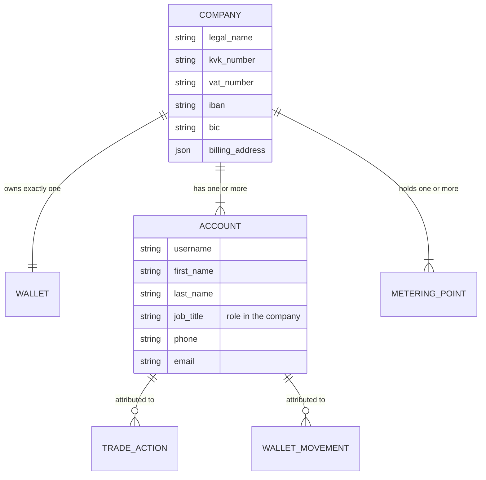

# F01 — Customer, Accounts & Metering Points

**Portal:** both · **Priority:** Must · **Phase:** 1 · **Size:** M

---

## 1. Summary

Three things, all administered by PeakPower employees rather than self-service:

**The customer is a company.** It carries the commercial identity — legal name, KvK registration,
VAT number, bank account, addresses, contacts — and it owns exactly one wallet.

**A company has one or more accounts.** Each account is one person's login: username, name, their
role in the company, and contact details. All accounts of a company are equal **[DEC-16]** and see
identical data. What distinguishes them is not permission but **attribution**: every action records
which account performed it **[DEC-17]**.

**A company has one or more metering points**, identified by an 18-digit EAN. Because grootverbruik
customers routinely hold dozens of connections and an EAN is unmemorable, the platform lets the
customer attach their own vocabulary — *"Venlo cold store"*, *"Line 3 compressors"* — and then uses
that vocabulary everywhere: charts, trade requests, invoices, notifications.

The EAN never changes, even when the physical meter is replaced. That stability is what makes it a
safe natural key.

## 2. User stories

| As a… | I want to… | So that… |
| --- | --- | --- |
| Employee | register a new customer company with contact, registration and bank details | it can be invoiced, refunded and given portal access |
| Employee | create several accounts for one company | each person at the customer logs in as themselves |
| Employee | see who at the customer has an account, and their role in the company | I know who I am dealing with when they call |
| Employee | deactivate an account when someone leaves | access ends immediately without losing their history |
| Employee | attach one or more EANs to a company with a validity period | their data lands in the right place |
| Employee | end-date an EAN when the contract ends | historical data stays intact but the connection stops accruing |
| Customer user | see my colleagues' accounts on the company profile | I know who else can act on our behalf |
| Customer user | see all my connections in one list with their key figures | I can grasp my portfolio at a glance |
| Customer user | give a connection a name and a description | I can recognise it without decoding an 18-digit number |
| Customer user | search and filter my connections | I can work with 40 of them without scrolling |
| Customer user | open a connection and see its details and recent data | I can investigate one site |
| Employee | see which connections have stopped reporting data | I can chase PVNed before the customer notices |

## 3. Functional requirements

### Customer company records

| ID | Requirement | MoSCoW |
| --- | --- | :--: |
| F01-R01 | An employee can create a customer company with: legal name, trade name, KvK number, VAT number, **IBAN, BIC and bank account holder name**, billing address, visiting address, primary contact (name, email, phone), and an internal reference. | Must |
| F01-R02 | Legal name and KvK number are mandatory; KvK number is unique across active customers. | Must |
| F01-R03 | The KvK number is validated as 8 digits. The IBAN is validated structurally — country code, length for that country, and the ISO 7064 mod-97 check. An invalid IBAN is rejected at entry, not at payment time. | Must |
| F01-R04 | A customer has a status: `PROSPECT`, `ACTIVE`, `SUSPENDED`, `CLOSED`. Only `ACTIVE` customers can trade. | Must |
| F01-R05 | Creating a customer automatically creates exactly one EUR wallet, shared by all of its accounts **[AS-02]**. | Must |
| F01-R06 | An employee can edit company details; every change is recorded in the audit log with before/after values. Changes to the IBAN are additionally flagged in the audit log as sensitive. | Must |
| F01-R07 | Customers are never deleted. `CLOSED` removes them from working lists but preserves all data. | Must |
| F01-R08 | An employee can attach free-text internal notes to a customer, not visible to the customer. | Should |
| F01-R09 | The customer's own portal shows the company profile read-only, including the registered bank account, so they can check it is correct. | Should |

### Customer accounts

| ID | Requirement | MoSCoW |
| --- | --- | :--: |
| F01-R10 | An employee can create one or more accounts for a company, with: **username, first name, last name, role in the company (job title), contact phone, contact email**. | Must |
| F01-R11 | Username is mandatory and unique across the whole platform. Email is mandatory. First and last name are mandatory. Job title and phone are optional but prompted for. | Must |
| F01-R12 | The password is never set, stored or seen by the platform. Account creation triggers an invitation through the identity provider, where the person sets their own credential — see [F13](F13-identity-and-access.md) and **[OQ-78]**. | Must |
| F01-R13 | **All accounts of one company have identical privileges** **[DEC-16]**. There is no permission field on an account, and "role in the company" is descriptive only. | Must |
| F01-R14 | Every account of a company sees exactly the same data: the same metering points, charts, trades, wallet, ledger and invoices. | Must |
| F01-R15 | An account has a status: `INVITED`, `ACTIVE`, `DEACTIVATED`. Only `ACTIVE` accounts can sign in. | Must |
| F01-R16 | An employee can deactivate an account, which revokes its sessions immediately. Accounts are never deleted, so historical attribution stays resolvable. | Must |
| F01-R17 | An employee can edit an account's name, job title, phone and email. Changing the username is not permitted after creation. | Must |
| F01-R18 | An employee can resend an invitation and can reissue one that has expired; the previous link is invalidated. | Must |
| F01-R19 | A company must retain at least one `ACTIVE` account. Deactivating the last one requires an explicit confirmation and is recorded with a reason. | Should |
| F01-R20 | An account holder can update their own first name, last name, job title and phone. Changing their email requires verification. Username is fixed. | Should |
| F01-R21 | The customer portal shows the company's accounts — name, job title, email, status, last sign-in — so the customer can see who else can act for them. It is read-only; changes go through PeakPower. | Should |
| F01-R22 | The employee portal shows, per account, when it was created, by which employee, and when it was last used. | Should |

### Metering points

| ID | Requirement | MoSCoW |
| --- | --- | :--: |
| F01-R23 | An employee can attach a metering point to a customer by entering its EAN. | Must |
| F01-R24 | The EAN is validated: exactly 18 digits, and the GS1 check digit must be correct. Invalid input is rejected with a specific message. | Must |
| F01-R25 | A metering point carries: EAN, commodity (`ELECTRICITY` \| `GAS`) **[DEC-15]**, grid operator, connection capacity, physical address, `valid_from`, `valid_to`. | Must |
| F01-R26 | The same EAN may appear for different customers over **non-overlapping** validity periods. Overlapping periods for one EAN are rejected **[AS-03]**. | Must |
| F01-R27 | An employee can end-date a metering point. Historical data and past invoices remain attached and visible. | Must |
| F01-R28 | Only `ELECTRICITY` metering points are tradeable in this track; `GAS` can be registered and viewed but not traded **[OQ-01]**. | Must |
| F01-R29 | A customer user can set a **name** (max 80 chars) and **description** (max 500 chars) on any of their metering points. | Must |
| F01-R30 | The friendly name replaces the EAN as the primary label in every customer-facing surface: lists, charts, trade requests, invoices, notifications. The EAN remains visible as a secondary label and is always copyable. | Must |
| F01-R31 | If no friendly name is set, the UI falls back to the EAN, formatted in readable groups. | Must |
| F01-R32 | An employee can also set the friendly name (e.g. during onboarding), and can see who last changed it. | Should |
| F01-R33 | Customer users can add free-text **tags** to metering points and filter by them. | Could |
| F01-R34 | Metering points can be grouped into customer-defined **sites** for aggregate viewing. | Could |

### Listing and detail

| ID | Requirement | MoSCoW |
| --- | --- | :--: |
| F01-R35 | The customer's metering point list shows per row: friendly name, EAN, commodity, status, last data date, this-month consumption, active block cover. | Must |
| F01-R36 | The list supports free-text search across name, description and EAN, and filters on commodity, status and data freshness. | Must |
| F01-R37 | The list can be sorted by any displayed column and exported to CSV. | Should |
| F01-R38 | The detail page shows master data, the friendly-name editor, a data-quality panel (see [F02](F02-metering-data-ingestion.md)), the consumption chart ([F03](F03-consumption-visualisation.md)) and the block positions attached to this metering point. | Must |

## 4. Business rules

1. **A customer is a company; an account is a person.** Data, wallet, metering points and invoices
   belong to the company. Actions belong to accounts.
2. **All accounts of a company are equal, and every action is attributed** **[DEC-16]**, **[DEC-17]**.
   There is no permission field on an account. "Role in the company" is a label, never a check.
3. **Accounts are created by PeakPower, never self-registered**, and are deactivated rather than
   deleted so that a trade from 2026 still resolves to a name in 2031.
4. **The username is immutable.** It is the stable link to the identity provider and appears
   throughout the audit trail; letting it change would break both.
5. **The EAN is the identity; everything else is a label.** Renaming never affects data linkage,
   history or invoices.
6. **An EAN belongs to one company at any instant.** Enforced by an exclusion constraint on
   `(ean, validity_period)` in the database, not only in application code.
7. **Validity periods are half-open** — `[valid_from, valid_to)` — so a same-day handover between two
   companies is unambiguous.
8. **Data outlives the relationship.** Ending a metering point never deletes interval data. A
   customer who leaves keeps their historical view until the company is closed and the retention
   period expires ([NFR-38](../20-architecture/08-non-functional-requirements.md)).
9. **Inbound data for an unknown EAN is never discarded.** It is quarantined and raised to employees
   — see [F02-R14](F02-metering-data-ingestion.md).
10. **Friendly names are company property, not account property.** One account renames a connection
    and every colleague sees the new name. The change is attributed to the account that made it.

## 5. Screens

| Screen | Mockup |
| --- | --- |
| Customer portal — metering point list | [`ean-list.svg`](../60-mockups/ean-list.svg) |
| Customer portal — metering point detail | [`ean-detail.svg`](../60-mockups/ean-detail.svg) |
| Employee portal — customer administration, accounts and bank details | [`employee-customer-admin.svg`](../60-mockups/employee-customer-admin.svg) |

## 6. Data

| Entity | Key fields |
| --- | --- |
| `customer` | id, legal_name, trade_name, kvk_number, vat_number, **iban, bic, bank_account_holder**, status, addresses, primary contact, locale |
| `customer_account` | id, customer_id, **username**, first_name, last_name, **job_title**, phone, email, status, external_subject_id, created_by_employee, created_at, last_login_at |
| `metering_point` | id, ean (18), commodity, customer_id, valid_from, valid_to, grid_operator, capacity, address |
| `metering_point_label` | metering_point_id, name, description, updated_by_account_id, updated_at |

Full schema in [Database design](../20-architecture/04-database-design.md).

## 7. Edge cases & failure modes

| Case | Behaviour |
| --- | --- |
| **Username already taken by another company's account** | Rejected. Usernames are unique platform-wide, so the message says the username is unavailable without revealing which company holds it |
| **Two accounts of one company act on the same trade** | Expected and supported **[DEC-18]**. Both appear in the timeline with their own name and job title |
| **An account is deactivated while it has an open trade** | The trade is unaffected — it belongs to the company. Any remaining active account can accept or reject the offer. History still shows the deactivated account as the originator |
| **The last active account of a company is deactivated** | Allowed with explicit confirmation. The company keeps trading only via PeakPower until a new account is created |
| **Someone leaves and rejoins** | A new account, not a reactivation, if the username was released. Reactivating the original account is preferred so history stays contiguous |
| **Two people share one login** | Not preventable technically, but it defeats attribution. Employees are prompted to create one account per person during onboarding |
| **An invitation is never accepted** | Account stays `INVITED`, cannot sign in, and appears on an employee list of stale invitations after 14 days |
| **The company's IBAN changes** | Edited by an employee, flagged as sensitive in the audit log, and any pending refund is held for re-confirmation |
| EAN with a valid length but a wrong check digit | Rejected at entry with the expected check digit shown |
| EAN already active for another company | Rejected, showing the conflicting company and period, with a link to end-date it |
| An EAN moves between two companies mid-month | Both see only their own period's data; each invoice covers only its own period. The list shows the partial period explicitly |
| A meter is physically replaced | No platform action. The EAN is unchanged. A note may be added to the metering point |
| Data arrives for an EAN whose validity has ended | Stored and quarantined; employee alert. Never silently attached to the previous company |
| A friendly name duplicates another | Allowed — names are labels, not keys. The UI shows the EAN alongside to disambiguate |
| A company with 200 metering points | List is paginated and virtualised; charts require an explicit selection rather than defaulting to all |
| Gas EAN registered before gas is supported | Visible, marked "not tradeable", excluded from trade wizards and invoicing |

## 8. Out of scope

- Customer self-registration, and self-service creation of accounts by the customer.
- Any permission model inside a company **[DEC-16]**.
- Automatic EAN validation against a market register (EDSN / C-AR).
- Bank account verification by micro-deposit or by an account-information service.
- Contract document management.
- Grid operator master-data synchronisation.

## 9. Dependencies

| Depends on | Why |
| --- | --- |
| [F13 Identity & access](F13-identity-and-access.md) | Users must exist and be scoped to a customer |
| [F15 Audit](F15-audit-and-observability.md) | Master-data changes are audited |

## 10. Open questions

| Ref | Question |
| --- | --- |
| [OQ-01] | When does gas enter scope, and does it use the same EAN model? |
| [OQ-06] | Should the platform validate EANs against an external market register? |
| [OQ-78] | Are credentials owned by the identity provider, or does the platform hold username and password itself? |
| [OQ-79] | What is the company bank account used for — refunds only, or also matching incoming transfers? |
| [OQ-80] | Should a company's accounts be visible to each other in the customer portal? |

> [OQ-04] — "are differentiated roles needed within a customer?" — is **closed**. Confirmed: all
> accounts of a company are equal. See **[DEC-16]**.
