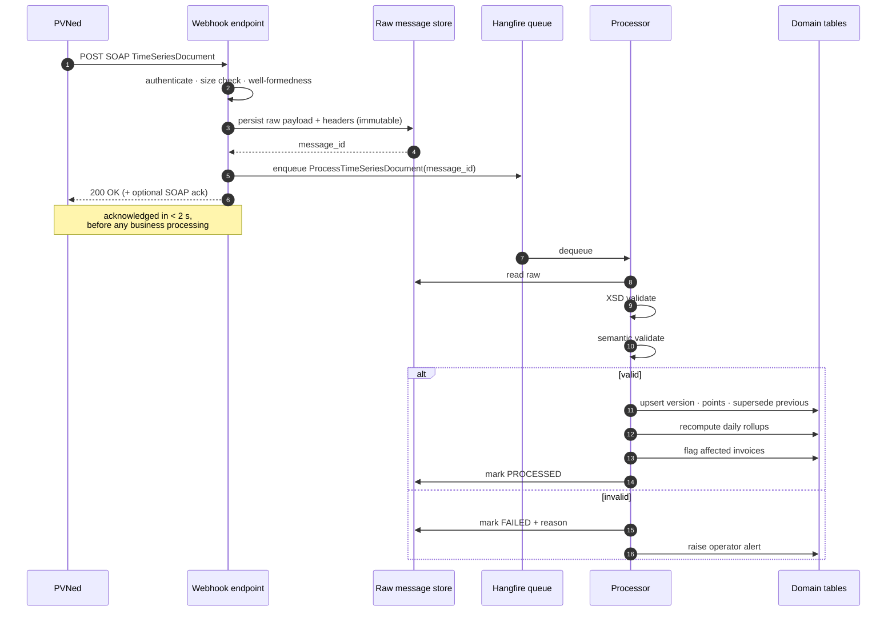
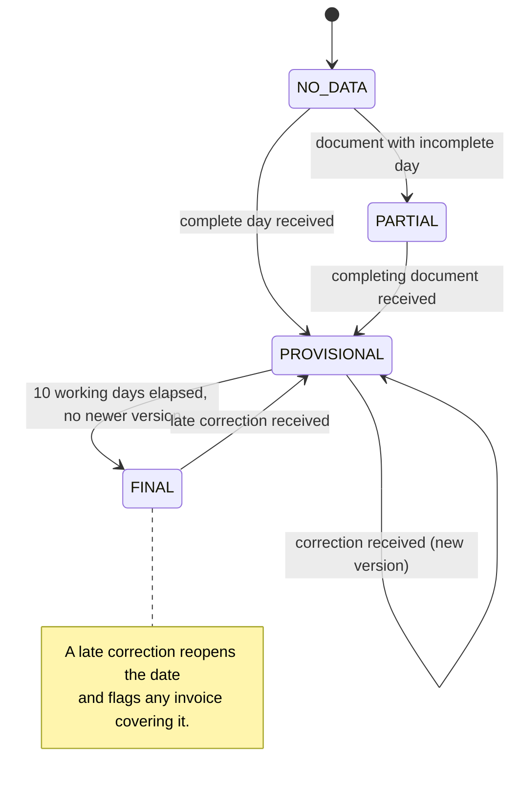

# F02 — Metering Data Ingestion (PVNed)

**Portal:** platform · **Priority:** Must · **Phase:** 1 · **Size:** L

---

## 1. Summary

Every number the platform shows, trades against and invoices originates here. PVNed pushes SOAP/XML
`TimeSeriesDocument` messages containing 15-minute consumption and production data per metering
point, plus portfolio-level imbalance data. Data for a delivery date starts arriving on **D+1** and
may be **corrected for up to 10 working days**. PVNed never revises a document — it sends a new one,
and the most recently received document wins.

That last rule shapes the whole design: the platform must keep versions, know which one is current,
and be able to answer "what did we believe on the day we invoiced?".

The wire-level detail is in [PVNed integration](../30-integrations/01-pvned-timeseries.md); this
document covers the platform behaviour around it.

## 2. User stories

| As a… | I want to… | So that… |
| --- | --- | --- |
| Platform | accept and durably store every PVNed message before doing anything with it | nothing is ever lost to a parsing bug |
| Platform | process a corrected document and supersede the previous version | the customer always sees the best-known data |
| Employee | see the ingestion status per metering point per day | I can spot missing data before the customer does |
| Employee | see why a message failed and replay it after a fix | a bad day doesn't require PVNed to resend |
| Employee | be alerted when a metering point stops reporting | I can chase it |
| Customer user | see clearly whether the data I'm looking at is provisional or final | I know how much to trust a number |
| Finance | know that an invoiced month cannot silently change underneath me | corrections become a visible true-up, not a mystery |

## 3. Ingestion flow

## 4. Functional requirements

### Receiving

| ID | Requirement | MoSCoW |
| --- | --- | :--: |
| F02-R01 | The platform exposes an HTTPS endpoint that accepts PVNed SOAP `TimeSeriesDocument` messages. | Must |
| F02-R02 | The endpoint authenticates the caller. Mechanism per **[OQ-05]**; the design supports mTLS, a shared secret header, or IP allow-listing, and more than one simultaneously. | Must |
| F02-R03 | The raw payload, HTTP headers, source IP and receipt timestamp are persisted **before** any parsing or validation. | Must |
| F02-R04 | The endpoint responds `200 OK` as soon as the payload is durably stored — before business processing. | Must |
| F02-R05 | Processing failures never produce a non-2xx response to PVNed once the payload is stored. Only authentication failure, malformed HTTP, or a storage failure produce an error status. | Must |
| F02-R06 | The endpoint enforces a maximum payload size (default 25 MB) and rejects larger requests with `413`. | Must |
| F02-R07 | Receipt of a payload byte-identical to one already received within 24 h is recorded as a duplicate and not reprocessed. | Must |
| F02-R08 | The endpoint returns a SOAP acknowledgement when PVNed expects one **[OQ-05]**. | Should |

### Validating

| ID | Requirement | MoSCoW |
| --- | --- | :--: |
| F02-R09 | Each message is validated against `TimeSeriesDocument-v2p0.xsd`. Failures are recorded with the XSD error path. | Must |
| F02-R10 | Semantic validation checks: `DocumentType`/`ProcessType` combination is one the platform handles; `Resolution = PT15M`; `CurveType = A01`; the point count matches the interval's expected count (96, or 92/100 on DST days); `Pos` values are contiguous from 1. | Must |
| F02-R11 | A `ResourceObject` that is 18 digits is treated as an EAN; anything else is treated as a descriptive resource label (`Prognosis`, `Realisation`, `Imbalance`, …) **[AS-17]**. | Must |
| F02-R12 | Validation failure marks the message `FAILED` with a machine-readable reason code and a human-readable message, and raises an operator alert. It never partially applies a document. | Must |
| F02-R13 | A document is applied **atomically**: either every timeseries in it lands, or none does. | Must |
| F02-R14 | Data for an EAN not registered on any customer is stored in quarantine, counted, and surfaced to employees. It is never discarded and never attached by guesswork. | Must |
| F02-R15 | Data for an EAN whose validity period does not cover the delivery date is quarantined the same way. | Must |

### Versioning and supersession

| ID | Requirement | MoSCoW |
| --- | --- | :--: |
| F02-R16 | Each accepted document creates an **interval data version** per (metering point, delivery date, direction), recording `DocumentIdentification`, `CreatedDateTime`, receipt time and the point values **[DEC-07]**. | Must |
| F02-R17 | The newest **received** version is authoritative, per the PVNed rule "the latest and greatest received document provides actual data". Ordering is by receipt time, with `CreatedDateTime` as a tiebreaker. | Must |
| F02-R18 | Superseding a version never deletes it. Previous versions remain queryable. | Must |
| F02-R19 | A new version triggers recomputation of the daily rollup, the affected month aggregate, and coverage figures for that metering point and date. | Must |
| F02-R20 | If a new version affects a delivery date already covered by a **finalised** invoice, the invoice is flagged `AFFECTED_BY_CORRECTION` and queued for the annual true-up. The invoice itself is never modified. | Must |
| F02-R21 | An employee can view the version history for a metering point and date, including a per-interval diff between any two versions. | Should |

### Data state and completeness

| ID | Requirement | MoSCoW |
| --- | --- | :--: |
| F02-R22 | Every (metering point, delivery date) has a data state: `NO_DATA`, `PARTIAL`, `PROVISIONAL`, `FINAL`. | Must |
| F02-R23 | A date becomes `FINAL` when 10 working days have passed since the delivery date with no newer version, using the platform's working-day calendar. | Must |
| F02-R24 | The state is exposed through the API and rendered in the UI wherever a figure derived from it is shown. | Must |
| F02-R25 | Missing intervals are represented as absent, never as zero. | Must |
| F02-R26 | A monitoring job detects metering points with no data for more than N days (default 3) and raises an alert. | Must |
| F02-R27 | An employee can replay a stored raw message. Replay is idempotent and produces a new version only if the content differs from the current one. | Should |
| F02-R28 | An employee can trigger a rebuild of derived data for a metering point and date range without needing a replay. | Should |

## 5. Business rules

1. **Store first, understand later.** The raw payload is the source of truth for disputes. It is
   retained for the full retention period even if processing succeeded.
2. **Latest received wins** — not the highest `DocumentVersion`, and not the latest
   `CreatedDateTime`. PVNed's own guide is explicit that documents are not revised, and each new
   send is version 1 with a fresh GUID. Ordering on anything other than receipt would mis-resolve
   out-of-order arrivals.
3. **Never partially apply.** A document with 96 points for one series and 94 for another is
   rejected whole. Half a day of data is worse than none, because it looks plausible.
4. **The DST day count is 92 / 96 / 100.** The XSD permits `Pos` up to 100 precisely because of the
   autumn transition. Validation must expect the right count for the specific date, not a constant.
5. **Zero is a measurement; absent is not.** Enforced at storage, at aggregation and at rendering.
6. **A correction after invoicing is a true-up, never an edit.** See
   [Annual true-up](../40-processes/05-annual-true-up.md).
7. **Imbalance data is portfolio-level [AS-18]** and lands on a different table from per-EAN interval
   data.

## 6. Data states

## 7. Screens

| Screen | Mockup |
| --- | --- |
| Employee — ingestion health dashboard | [`employee-ingestion-health.svg`](../60-mockups/employee-ingestion-health.svg) |
| Customer — data quality panel on the EAN detail page | [`ean-detail.svg`](../60-mockups/ean-detail.svg) |

## 8. Data

| Entity | Purpose |
| --- | --- |
| `inbound_message` | Raw payload, headers, hash, status, failure reason |
| `interval_data_version` | One per (metering point, delivery date, direction, document) |
| `interval_reading` | Point values; partitioned by month |
| `imbalance_reading` | Portfolio-level imbalance volume and price per settlement period |
| `metering_point_day_state` | Materialised data state per metering point per date |
| `quarantined_series` | Series that could not be attached to a metering point |

## 9. Edge cases & failure modes

| Case | Behaviour |
| --- | --- |
| Two documents for the same date arrive out of order | Receipt order decides. The later-received one wins even if its `CreatedDateTime` is earlier — and the discrepancy is logged as a warning for investigation |
| Spring-forward day (92 intervals) | Expected count is 92; a 96-point document for that date fails validation |
| Autumn day (100 intervals) | Expected count is 100; `Pos` 9–12 map to the repeated hour |
| Document spans several days | Each delivery date is versioned separately; supersession is per date |
| `Period.TimeInterval` disagrees with `MeasurementPeriode` | Observed in the supplied sample. `MeasurementPeriode` plus `Pos` is authoritative for interval mapping; the discrepancy is logged. See [OQ-20] |
| Payload arrives while a previous one for the same date is still processing | Serialised per (metering point, delivery date) so supersession cannot race |
| PVNed sends a cancellation (series omitted, or all points zero) | Treated as a new version with those values. The guide describes both forms |
| Message with 30 000 timeseries | Processed in batches; the job is resumable and reports progress |
| Storage full / DB unavailable at receipt | Non-2xx returned so PVNed retries. This is the one case where failing loudly is correct |
| Replay of a message whose EAN has since been registered | Succeeds and clears the quarantine entry |

## 10. Out of scope

- Outbound documents to PVNed.
- Pull-based retrieval as an alternative to push.
- Meter-level (sub-EAN) data.
- Forecasting.

## 11. Dependencies

| Depends on | Why |
| --- | --- |
| [F01](F01-customer-and-metering-points.md) | EANs must be registered for data to attach |
| [PVNed integration](../30-integrations/01-pvned-timeseries.md) | Wire format and field mapping |
| Hangfire | Queueing, retry, scheduled finalisation |

## 12. Open questions

| Ref | Question |
| --- | --- |
| [OQ-05] | PVNed endpoint authentication, acknowledgement expectations, retry policy, test environment |
| [OQ-15] | Can PVNed supply imbalance per EAN rather than per portfolio? |
| [OQ-20] | How should the `Period.TimeInterval` / `MeasurementPeriode` inconsistency in the sample be interpreted? |
| [OQ-21] | Expected message volume and cadence: one document per EAN per day, or batched? |
