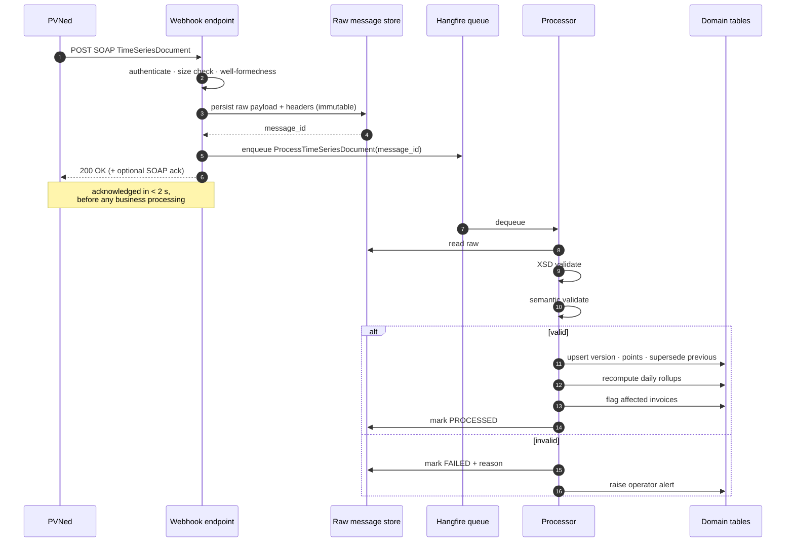
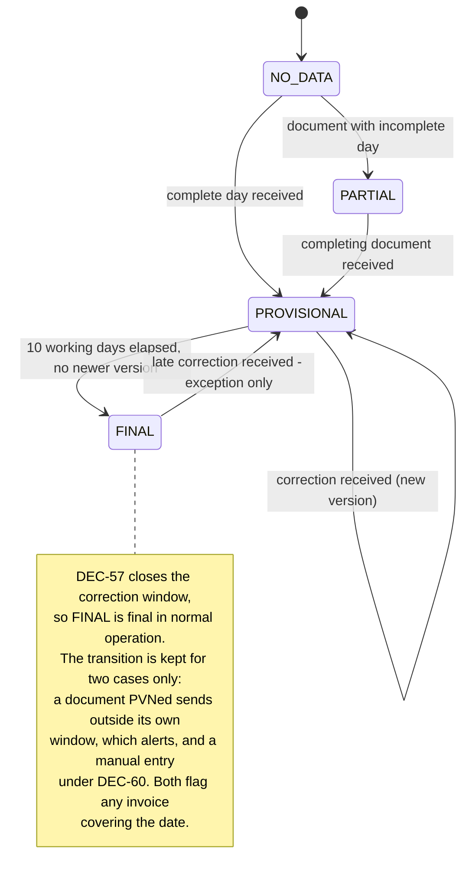

# F02 — Metering Data Ingestion (PVNed)

**Portal:** platform · **Priority:** Must · **Phase:** 1 · **Size:** L

---

## 1. Summary

Every number the platform shows, trades against and invoices originates here. PVNed pushes SOAP/XML
`TimeSeriesDocument` messages containing 15-minute consumption and production data per metering
point, plus portfolio-level imbalance data. Data for a delivery date starts arriving on **D+1** and
may be **corrected for up to 10 working days**. PVNed never revises a document — it sends a new one,
and the most recently received document wins.

That last rule shapes the whole design: the platform must keep versions, know which one is current,
and be able to answer "what did we believe on the day we invoiced?".

Three decisions size and bound that design:

| Decision | What it fixes | Consequence here |
| --- | --- | --- |
| **[DEC-38]** | **One document per EAN per day** | Many small documents rather than one daily batch. Document count scales with metering points, each payload stays small, and the per-(metering point, delivery date) mutex in [Background jobs](../20-architecture/06-background-jobs.md) is the **natural unit of concurrency** — the pipeline parallelises across EANs with no contention. Closes [OQ-21] |
| **[DEC-57]** | **No reconciliation data after the 10-working-day window** | The correction window is genuinely closed, which is what makes `FINAL` **final** **[F02-R23]**. A document arriving after the window is an exception to be alerted on, not a routine late feed. Closes [OQ-66] |
| **[DEC-65]** | **No `A01` production series at all** for a connection that never produces | "Both directions present" is **not** the completeness test. The test is stated against the metering point's `production_expectation` **[F01-R39]**, **[F02-R32]** |

The wire-level detail is in [PVNed integration](../30-integrations/01-pvned-timeseries.md); this
document covers the platform behaviour around it.

> **PoC data source — [DEC-21].** The proof of concept ingests **generated** data in the PVNed
> document format, built against the reconstructed sample message and XSD in
> [PVNed integration](../30-integrations/01-pvned-timeseries.md). A **mock PVNed** service follows in
> the test environment. Generated data MUST be driven through the real webhook, parser and validation
> path — never through a shortcut that writes readings directly. Fake data that skips the parser
> proves nothing. This closes [OQ-05] *for the PoC only*: the real endpoint, authentication
> mechanism, acknowledgement format, retry behaviour and the nine documentation inconsistencies
> ([OQ-65]) stay unvalidated, so **[R-01](../70-delivery/02-risks.md) is deferred, not closed**.

> **Imbalance — [DEC-25].** Imbalance is out of scope. PVNed `A12` documents are still received,
> validated and stored, but are never turned into charges: invoice line 3 is not implemented — see
> [F10](F10-invoicing-and-settlement.md). Storing rather than discarding keeps the option open at the
> cost of a table.

## 2. User stories

| As a… | I want to… | So that… |
| --- | --- | --- |
| Platform | accept and durably store every PVNed message before doing anything with it | nothing is ever lost to a parsing bug |
| Platform | process a corrected document and supersede the previous version | the customer always sees the best-known data |
| Employee | see the ingestion status per metering point per day | I can spot missing data before the customer does |
| Employee | see why a message failed and replay it after a fix | a bad day doesn't require PVNed to resend |
| Employee | be alerted when a metering point stops reporting | I can chase it |
| Employee | enter a day's data by hand when PVNed cannot resend it | a date that will never arrive does not block invoicing forever **[DEC-60]** |
| Customer user | see clearly whether the data I'm looking at is provisional or final | I know how much to trust a number |
| Finance | know that an invoiced month cannot silently change underneath me | corrections become a visible true-up, not a mystery |

## 3. Ingestion flow

## 4. Functional requirements

### Receiving

| ID | Requirement | MoSCoW |
| --- | --- | :--: |
| F02-R01 | The platform exposes an HTTPS endpoint that accepts PVNed SOAP `TimeSeriesDocument` messages. | Must |
| F02-R02 | The endpoint authenticates the caller. The design supports mTLS, a shared secret header, or IP allow-listing, and more than one simultaneously **[AS-16]**. The mechanism PVNed actually requires is still unconfirmed — **[DEC-21]** closes **[OQ-05]** for the PoC only. | Must |
| F02-R03 | The raw payload, HTTP headers, source IP and receipt timestamp are persisted **before** any parsing or validation. | Must |
| F02-R04 | The endpoint responds `200 OK` as soon as the payload is durably stored — before business processing. | Must |
| F02-R05 | Processing failures never produce a non-2xx response to PVNed once the payload is stored. Only authentication failure, malformed HTTP, or a storage failure produce an error status. | Must |
| F02-R06 | The endpoint enforces a maximum payload size (default 25 MB) and rejects larger requests with `413`. | Must |
| F02-R07 | Receipt of a payload byte-identical to one already received within 24 h is recorded as a duplicate and not reprocessed. | Must |
| F02-R08 | The endpoint returns a SOAP acknowledgement when PVNed expects one. Whether one is expected, and in what form, is unconfirmed **[OQ-05]**; **[DEC-21]** defers validation to the real integration. | Should |

### Validating

| ID | Requirement | MoSCoW |
| --- | --- | :--: |
| F02-R09 | Each message is validated against `TimeSeriesDocument-v2p0.xsd`. Failures are recorded with the XSD error path. | Must |
| F02-R10 | Semantic validation checks: `DocumentType`/`ProcessType` combination is one the platform handles; `Resolution = PT15M`; `CurveType = A01`; the point count matches the interval's expected count (96, or 92/100 on DST days); `Pos` values are contiguous from 1. | Must |
| F02-R11 | A `ResourceObject` that is 18 digits is treated as an EAN; anything else is treated as a descriptive resource label (`Prognosis`, `Realisation`, `Imbalance`, …) **[AS-17]**. | Must |
| F02-R12 | Validation failure marks the message `FAILED` with a machine-readable reason code and a human-readable message, and raises an operator alert. It never partially applies a document. | Must |
| F02-R13 | A document is applied **atomically**: either every timeseries in it lands, or none does. | Must |
| F02-R14 | Data for an EAN not registered on any customer is stored in quarantine, counted, and surfaced to employees. It is never discarded and never attached by guesswork. | Must |
| F02-R15 | Data for an EAN whose validity period does not cover the delivery date is quarantined the same way. | Must |

### Versioning and supersession

| ID | Requirement | MoSCoW |
| --- | --- | :--: |
| F02-R16 | Each accepted document creates an **interval data version** per (metering point, delivery date, direction), recording `DocumentIdentification`, `CreatedDateTime`, receipt time and the point values **[DEC-07]**. | Must |
| F02-R17 | The newest **received** version is authoritative, per the PVNed rule "the latest and greatest received document provides actual data". Ordering is by receipt time, with `CreatedDateTime` as a tiebreaker. | Must |
| F02-R18 | Superseding a version never deletes it. Previous versions remain queryable. | Must |
| F02-R19 | A new version triggers recomputation of the daily rollup, the affected month aggregate, and coverage figures for that metering point and date. | Must |
| F02-R20 | If a new version affects a delivery date already covered by a **finalised** invoice, the invoice is flagged `AFFECTED_BY_CORRECTION` and queued for the annual true-up. The invoice itself is never modified. | Must |
| F02-R21 | An employee can view the version history for a metering point and date, including a per-interval diff between any two versions. | Should |

### Data state and completeness

| ID | Requirement | MoSCoW |
| --- | --- | :--: |
| F02-R22 | Every (metering point, delivery date) has a data state: `NO_DATA`, `PARTIAL`, `PROVISIONAL`, `FINAL`. | Must |
| F02-R23 | A date becomes `FINAL` when 10 working days have passed since the delivery date with no newer version, using the platform's working-day calendar. **`FINAL` means final**: PVNed supplies no reconciliation data after the window **[DEC-57]**, so no routine feed can reopen the date. | Must |
| F02-R24 | The state is exposed through the API and rendered in the UI wherever a figure derived from it is shown. | Must |
| F02-R25 | Missing intervals are represented as absent, never as zero. | Must |
| F02-R26 | A monitoring job detects metering points with no data for more than N days (default 3) and raises an alert. Under **[DEC-38]** the expectation is exact — **one document per EAN per day** — so silence is detected per metering point rather than inferred from a batch. | Must |
| F02-R27 | An employee can replay a stored raw message. Replay is idempotent and produces a new version only if the content differs from the current one. | Should |
| F02-R28 | An employee can trigger a rebuild of derived data for a metering point and date range without needing a replay. | Should |

### Generated and mock data

New with **[DEC-21]**. These requirements exist to stop the PoC's data source becoming a second,
unvalidated ingestion path.

| ID | Requirement | MoSCoW |
| --- | --- | :--: |
| F02-R29 | A data generator produces `TimeSeriesDocument` messages in the PVNed format — consumption and production per EAN, plus corrections — built against the reconstructed sample message and XSD in [PVNed integration](../30-integrations/01-pvned-timeseries.md) **[DEC-21]**. | Must |
| F02-R30 | Generated documents are delivered over the **real webhook endpoint** and processed by the same parser, XSD validation and semantic validation as production traffic. No code path may bypass **F02-R01..R13** to write readings directly **[DEC-21]**. | Must |
| F02-R31 | A **mock PVNed** service in the test environment pushes documents on a configurable cadence, including a correction that supersedes an earlier version, so **F02-R16..R20** are exercised end to end **[DEC-21]**. | Must |

### Completeness and expected production

New with **[DEC-65]**. PVNed sends **no `A01` series at all** for a connection that never produces, so
the obvious completeness test — *both directions present* — would hold every non-producing connection
at `PARTIAL` forever and block its invoicing. The test is stated against master data instead
**[F01-R39]**: `production_expectation` is `UNKNOWN`, `NEVER` or `EXPECTED`.

| ID | Requirement | MoSCoW |
| --- | --- | :--: |
| F02-R32 | A (metering point, delivery date) is **complete** when the consumption (`A02`) series is present with the full expected interval count for that date (92 / 96 / 100), **and** the production (`A01`) series is too **unless** the metering point's `production_expectation` is `NEVER` **[F01-R39]**. `UNKNOWN` is treated as `EXPECTED`: the conservative reading, because the alternative is invoicing a producing site on consumption alone. **"Both directions present" MUST NOT be used as the completeness test** **[DEC-65]**. | Must |
| F02-R33 | Where `production_expectation` is `NEVER`, production for every interval of that date is **zero**, and net usage is therefore the consumption value **[DEC-22]**. This zero is a **declared** value taken from master data, not an absence inferred as zero: it traces to the source, the setter and the date recorded with the claim **[F01-R40]**, and the data-quality panel says so. | Must |
| F02-R34 | An `A01` series arriving for a metering point recorded as `NEVER` is **stored and used normally** — a document is never discarded because master data disagrees with it — and the **same transaction resolves the contradiction**: the metering point moves to `EXPECTED` with source `OBSERVED`, `first_production_observed_at` is stamped, and an alert is raised. Observed production is evidence and a claim is not, so the platform believes the data. It is not merely logged: a reading that contradicts its own master data must not be left stored beside it **[Database design §3.1.1](../20-architecture/04-database-design.md)**. | Must |
| F02-R35 | The reverse case — `EXPECTED` or `UNKNOWN` with no `A01` ever arriving — holds the date at `PARTIAL` and alerts. For `UNKNOWN` the alert names **the missing registration**, not PVNed, because the fix is to establish the expectation rather than to chase a resend **[F01-R41]**. | Must |

### Manual data entry

New with **[DEC-60]**, which closes [OQ-75] by confirming the current design. This is the last resort
for a delivery date PVNed cannot supply, and — under **[DEC-57]** — the only remaining route for a
date the correction window has closed on.

| ID | Requirement | MoSCoW |
| --- | --- | :--: |
| F02-R36 | An employee can enter interval data manually for a (metering point, delivery date, direction) when the date is **permanently missing and PVNed cannot resend** **[DEC-60]**. Entry is whole-day — the expected interval count for that date, no partial days — and requires a **mandatory reason**. It creates an ordinary version **[F02-R16]** whose source is `MANUAL` and whose actor is the entering employee. | Must |
| F02-R37 | A manual version is flagged, and the flag **propagates to every derived figure**: rollups, net usage, coverage, KPIs, charts and **every invoice line computed from it**, which states that it rests on manually entered data **[DEC-60]**, **[NFR-48]**. The flag is never dropped in aggregation — a month containing one manual day is a manual-affected month. | Must |
| F02-R38 | A real PVNed document arriving later for the same (metering point, delivery date, direction) supersedes the manual version by the ordinary receipt-order rule **[F02-R17]**; the manual version is retained, superseded, and the manual flag clears from the derived figures because they no longer rest on it. Manual entry is **not** available for a date that has current PVNed data — correcting that is PVNed's job, and an employee overriding it would be an unauditable edit wearing a version number. | Must |

## 5. Business rules

1. **Store first, understand later.** The raw payload is the source of truth for disputes. It is
   retained for the full retention period even if processing succeeded.
2. **Latest received wins** — not the highest `DocumentVersion`, and not the latest
   `CreatedDateTime`. PVNed's own guide is explicit that documents are not revised, and each new
   send is version 1 with a fresh GUID. Ordering on anything other than receipt would mis-resolve
   out-of-order arrivals.
3. **Never partially apply.** A document with 96 points for one series and 94 for another is
   rejected whole. Half a day of data is worse than none, because it looks plausible.
4. **The DST day count is 92 / 96 / 100.** The XSD permits `Pos` up to 100 precisely because of the
   autumn transition. Validation must expect the right count for the specific date, not a constant.
5. **Zero is a measurement; absent is not.** Enforced at storage, at aggregation and at rendering.
   **[DEC-65]** adds the single case where an absence is not an absence: a metering point **declared**
   `NEVER` has no `A01` series by design, and its production is a **declared zero** taken from master
   data **[F02-R33]**. The declaration — with its source, its setter and its date — is what turns the
   absence into a measurement. Everywhere else the rule is unchanged: a missing production interval on
   an `EXPECTED` connection makes **net usage missing**, not net usage equal to consumption
   **[DEC-22]**, and an `UNKNOWN` connection is treated as `EXPECTED` rather than as a quiet `NEVER`.
6. **A correction after invoicing is a true-up, never an edit.** See
   [Annual true-up](../40-processes/05-annual-true-up.md).
7. **Imbalance data is portfolio-level [AS-18]** and lands on a different table from per-EAN interval
   data. **[DEC-25]** takes imbalance out of scope: `A12` documents are stored and queryable, but no
   charge is ever derived from them, so no allocation key is needed and [AS-18] is moot for now.
8. **Generated data uses the production path [DEC-21].** The PoC's data source differs only in who
   sends the document, never in what happens to it after receipt.
9. **One document per EAN per day [DEC-38].** The arrival pattern is per metering point, not per
   portfolio: absence is detectable per EAN **[F02-R26]**, each payload stays small, and the
   per-(metering point, delivery date) mutex is the unit of concurrency rather than a bottleneck.
10. **The correction window is closed at 10 working days [DEC-57].** Nothing routine reopens a `FINAL`
    date. A document arriving after the window is an **exception**: it is still stored, still versioned
    and still flags any invoice it affects **[F02-R20]**, and it raises an alert because it contradicts
    what PVNed says it sends. What still happens routinely is a correction *inside* the window landing
    *after* the invoice run — see [Metering data flow](../40-processes/02-metering-data-flow.md) §4 —
    so **F02-R20** stays live for that reason, not for late reconciliation.
11. **Manual data announces itself [DEC-60].** A manually entered day is flagged on every figure and
    every invoice derived from it **[F02-R37]**. The flag is the price of the escape hatch: an
    unlabelled manual figure is indistinguishable from a metered one, which would make the whole data
    state machine decorative.

## 6. Data states

## 7. Screens

| Screen | Mockup |
| --- | --- |
| Employee — ingestion health dashboard | [`employee-ingestion-health.svg`](../60-mockups/employee-ingestion-health.svg) |
| Customer — data quality panel on the EAN detail page | [`ean-detail.svg`](../60-mockups/ean-detail.svg) |

## 8. Data

| Entity | Purpose |
| --- | --- |
| `inbound_message` | Raw payload, headers, hash, status, failure reason |
| `interval_data_version` | One per (metering point, delivery date, direction, document). Carries **`source`** (`PVNED` \| `MANUAL`), and for a manual version the entering employee and the mandatory reason **[DEC-60]** |
| `interval_reading` | Point values; partitioned by month |
| `imbalance_reading` | Portfolio-level imbalance volume and price per settlement period. Stored, never charged **[DEC-25]** |
| `metering_point_day_state` | Materialised data state per metering point per date |
| `quarantined_series` | Series that could not be attached to a metering point |

## 9. Edge cases & failure modes

| Case | Behaviour |
| --- | --- |
| Two documents for the same date arrive out of order | Receipt order decides. The later-received one wins even if its `CreatedDateTime` is earlier — and the discrepancy is logged as a warning for investigation |
| Spring-forward day (92 intervals) | Expected count is 92; a 96-point document for that date fails validation |
| Autumn day (100 intervals) | Expected count is 100; `Pos` 9–12 map to the repeated hour |
| Document spans several days | Each delivery date is versioned separately; supersession is per date |
| `Period.TimeInterval` disagrees with `MeasurementPeriode` | Observed in the supplied sample. `MeasurementPeriode` plus `Pos` is authoritative for interval mapping; the discrepancy is logged. See [OQ-20] |
| Payload arrives while a previous one for the same date is still processing | Serialised per (metering point, delivery date) so supersession cannot race. Under **[DEC-38]** — one document per EAN per day — this mutex is the unit of concurrency, and documents for different EANs never contend |
| PVNed sends a cancellation (series omitted, or all points zero) | Treated as a new version with those values. The guide describes both forms. ⚠ Not to be confused with **[DEC-65]**: a series that is absent because the connection *never* produces is not a cancellation, and `production_expectation` **[F01-R39]** is what tells the two apart. An `EXPECTED` connection whose `A01` stops arriving is missing data; a `NEVER` one never had a series to cancel |
| **No `A01` series ever arrives for a connection** | Normal where the expectation is `NEVER`. The date completes on the consumption series alone **[F02-R32]** and production is a declared zero **[F02-R33]**. Where it is `EXPECTED` or `UNKNOWN`, the same silence holds the date at `PARTIAL` and alerts **[F02-R35]** |
| **`A01` arrives for a connection recorded as `NEVER`** | Stored and used, and the metering point is promoted to `EXPECTED` with source `OBSERVED` in the same transaction **[F02-R34]**. The alert reports a resolved contradiction rather than asking someone to go and fix one |
| **A document arrives after the 10-working-day window** | An exception under **[DEC-57]**, not a routine late feed. Stored, versioned and applied as usual, any covering invoice flagged **[F02-R20]**, **and alerted** — it contradicts what PVNed states it sends |
| **A delivery date is permanently missing and PVNed cannot resend** | Employee-entered whole day with a mandatory reason **[F02-R36]**, flagged as manual on every derived figure and invoice **[F02-R37]**. Because the window has usually elapsed by then, such a date typically becomes `FINAL` on the next finalisation pass |
| **A manual day is later covered by a real PVNed document** | Ordinary supersession by receipt order **[F02-R38]**. The manual version is retained and the manual flag clears from the derived figures |
| Message with 30 000 timeseries | Processed in batches; the job is resumable and reports progress |
| Storage full / DB unavailable at receipt | Non-2xx returned so PVNed retries. This is the one case where failing loudly is correct |
| Replay of a message whose EAN has since been registered | Succeeds and clears the quarantine entry |

## 10. Out of scope

- Outbound documents to PVNed.
- Pull-based retrieval as an alternative to push.
- Meter-level (sub-EAN) data.
- Forecasting.

## 11. Dependencies

| Depends on | Why |
| --- | --- |
| [F01](F01-customer-and-metering-points.md) | EANs must be registered for data to attach, and **`production_expectation` [F01-R39]** decides the completeness test **[F02-R32]** |
| [PVNed integration](../30-integrations/01-pvned-timeseries.md) | Wire format and field mapping |
| Hangfire | Queueing, retry, scheduled finalisation |

## 12. Open questions

| Ref | Question |
| --- | --- |
| [OQ-05] | PVNed endpoint authentication, acknowledgement expectations, retry policy, test environment. **Closed for the PoC only by [DEC-21]** — the real integration stays unvalidated and [R-01] stays open |
| ~~[OQ-15]~~ | ~~Can PVNed supply imbalance per EAN rather than per portfolio?~~ **Closed by [DEC-25]** — imbalance is out of scope, so no allocation key is needed |
| [OQ-20] | How should the `Period.TimeInterval` / `MeasurementPeriode` inconsistency in the sample be interpreted? |
| ~~[OQ-21]~~ | ~~Expected message volume and cadence: one document per EAN per day, or batched?~~ **Closed by [DEC-38]** — one document per EAN per day. Sizes the pipeline at document-per-metering-point and makes the per-(point, date) mutex the unit of concurrency |
| ~~[OQ-66]~~ | ~~Does PVNed supply reconciliation data after the 10-working-day window?~~ **Closed by [DEC-57]** — it does not. `FINAL` is final **[F02-R23]**, and a post-window document is an exception that alerts |
| [OQ-65] | The nine documentation inconsistencies — still unwalked, and **[DEC-21]** does not close them |
| ~~[OQ-75]~~ | ~~If a delivery date is permanently missing and PVNed cannot resend, is manual data entry acceptable?~~ **Closed by [DEC-60]** — yes, flagged as manual and surfaced on every derived figure and invoice **[F02-R36..R38]** |
| ~~[OQ-84]~~ | ~~Does PVNed send an `A01` series at all for a connection that never produces?~~ **Closed by [DEC-65]** — it does not. The completeness test is stated against `production_expectation` **[F02-R32]**, not against "both directions present" |
