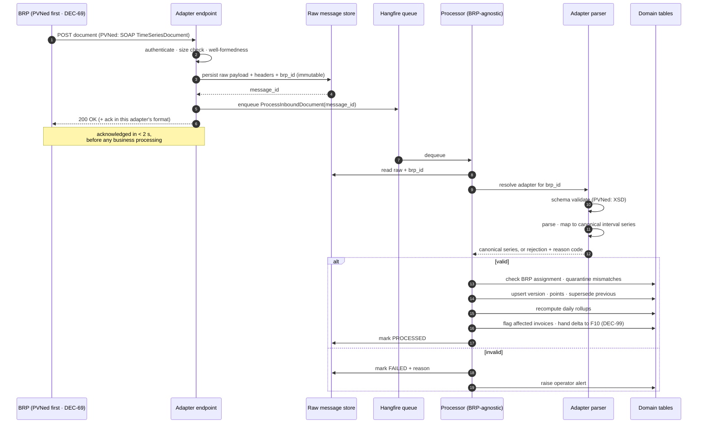
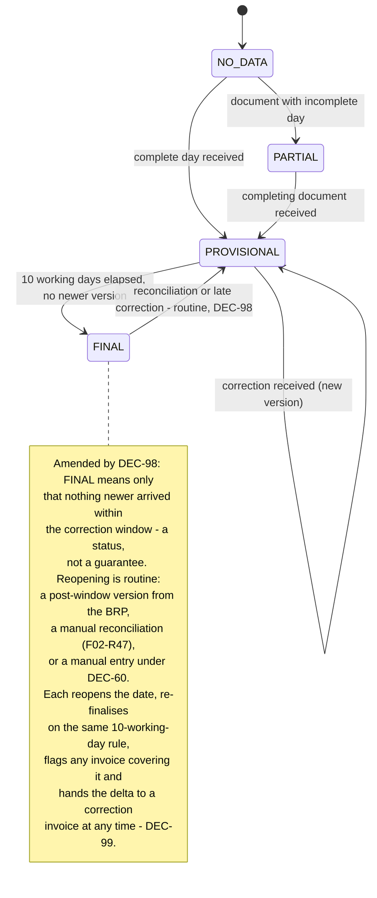

# F02 — Metering Data Ingestion

⚠ **Retitled 2026-08-19 by [DEC-69]** — was "F02 — Metering Data Ingestion (PVNed)". PVNed is the
first BRP configured, not the ingestion pipeline itself, so the title stops naming it. The filename
is already generic and does not change.

**Portal:** platform · **Priority:** Must · **Phase:** 1 · **Size:** L

---

## 1. Summary

Every number the platform shows, trades against and invoices originates here. A **BRP**
(*programmaverantwoordelijke*) pushes 15-minute consumption and production data per metering point,
plus portfolio-level imbalance data. **PVNed is the first BRP, not the only one [DEC-69]**: it pushes
SOAP/XML `TimeSeriesDocument` messages, and everything in that sentence after "pushes" is *adapter*
detail rather than pipeline behaviour (§3.1).

Data for a delivery date starts arriving on **D+1** and is corrected for up to **10 working days** —
and, since **[DEC-98]**, reconciliation data arrives **after** that window too, sometimes by hand
rather than on the feed. PVNed never revises a document — it sends a new one, and the most recently
received document wins.

That last rule shapes the whole design: the platform must keep versions, know which one is current,
and be able to answer "what did we believe on the day we invoiced?".

These decisions size and bound that design:

| Decision | What it fixes | Consequence here |
| --- | --- | --- |
| **[DEC-69]** | **The metering-data source is a configurable BRP; PVNed is the first** | The webhook, parser, schema and field mapping are **one adapter behind a port**, not the pipeline. Raw-payload persistence **[DEC-03]**, versioning and supersession **[DEC-07]**, quarantine and completeness are BRP-agnostic and stay in the pipeline — §3.1, **[F02-R39..R44]**. A metering point is assigned to exactly one BRP at a time **[F01-R51]**. Cost: an interface seam now, so a second adapter later is additive rather than a second pipeline |
| **[DEC-38]** | **One document per EAN per day** | Many small documents rather than one daily batch. Document count scales with metering points, each payload stays small, and the per-(metering point, delivery date) mutex in [Background jobs](../20-architecture/06-background-jobs.md) is the **natural unit of concurrency** — the pipeline parallelises across EANs with no contention. Closes [OQ-21]. ⚠ **Scoped 2026-08-19 by [DEC-69]**: the *cadence* is the PVNed adapter's property, not the pipeline's. The mutex and the per-EAN silence detector **[F02-R26]** are BRP-agnostic; a future BRP that batches changes what its adapter expects, not how the pipeline serialises |
| ~~**[DEC-57]**~~ | ~~**No reconciliation data after the 10-working-day window**~~ ~~The correction window is genuinely closed, which is what makes `FINAL` **final** **[F02-R23]**. A document arriving after the window is an exception to be alerted on, not a routine late feed. Closes [OQ-66]~~ | ⚠ **Reversed 2026-08-19 by [DEC-98]** |
| **[DEC-98]** | **PVNed does supply reconciliation data after the window, sometimes as a manual process** | `FINAL` becomes a *status*, not a guarantee **[F02-R23]**. A post-window version is **routine, not an exception** **[F02-R45]**, and the manual case is handled by extending manual entry **[DEC-60]**, **[F02-R47]**. Closes [OQ-66] with the opposite answer |
| **[DEC-99]** | **A correction is invoiced as a delta whenever it lands, months later included** | The `AFFECTED_BY_CORRECTION` flag **[F02-R20]** stops queueing for an annual true-up and hands the delta to a **correction invoice** — see [F10](F10-invoicing-and-settlement.md), **[F02-R46]**. The monthly run is no longer a gate that closes |
| **[DEC-65]** | **No `A01` production series at all** for a connection that never produces | "Both directions present" is **not** the completeness test. The test is stated against the metering point's `production_expectation` **[F01-R39]**, **[F02-R32]** |
| **[DEC-112]** | **The production expectation is the customer's declaration at onboarding** | **[F02-R32]**'s reading of `UNKNOWN` as `EXPECTED` survives unchanged; what changes is that the resulting worklist **[F02-R35]** now has an owner and a moment **[F01-R54]**, which is what stopped it degrading into permanent false alarms. **SJV** (*standaardjaarverbruik*) and profile fractions are a sanity check on the declaration, never its source. Closes [OQ-91] |
| **[DEC-68]** | **Gas is out of scope** | **Electricity is the only commodity with data.** No m³ series, no gas document format and no gas adapter. The `commodity` discriminator stays in the model **[DEC-15]**, **[F01-R52]** |

The wire-level detail of the first adapter is in
[PVNed integration](../30-integrations/01-pvned-timeseries.md); this document covers the platform
behaviour around it.

> **PoC data source — [DEC-21].** The proof of concept ingests **generated** data in the PVNed
> document format, built against the reconstructed sample message and XSD in
> [PVNed integration](../30-integrations/01-pvned-timeseries.md). A **mock PVNed** service follows in
> the test environment. Generated data MUST be driven through the real endpoint, parser and
> validation path — that is, through the **PVNed adapter** **[F02-R44]** — never through a shortcut
> that writes readings directly. Fake data that skips the parser proves nothing. This closes [OQ-05]
> *for the PoC only*: the real endpoint, authentication mechanism, acknowledgement format, retry
> behaviour and the nine documentation inconsistencies ([OQ-65]) stay unvalidated, so
> **[R-01](../70-delivery/02-risks.md) is deferred, not closed**. ⚠ Under **[DEC-69]** that residue
> is now **per adapter**: every BRP added later brings its own endpoint, credentials, ack format and
> retry behaviour, and therefore its own version of [OQ-05]. What it does not bring is a second
> pipeline.

> **Imbalance — [DEC-25].** Imbalance is out of scope. PVNed `A12` documents are still received,
> validated and stored, but are never turned into charges: invoice line 3 is not implemented — see
> [F10](F10-invoicing-and-settlement.md). Storing rather than discarding keeps the option open at the
> cost of a table.

## 2. User stories

| As a… | I want to… | So that… |
| --- | --- | --- |
| Platform | accept and durably store every inbound message before doing anything with it | nothing is ever lost to a parsing bug |
| Employee | configure a new BRP and point metering points at it | a second data source is an adapter and a row of reference data, not a rebuild **[DEC-69]** |
| Employee | enter reconciliation figures a BRP supplied outside the feed | a manual reconciliation still corrects the volume and the invoice **[DEC-98]**, **[DEC-60]** |
| Platform | process a corrected document and supersede the previous version | the customer always sees the best-known data |
| Employee | see the ingestion status per metering point per day | I can spot missing data before the customer does |
| Employee | see why a message failed and replay it after a fix | a bad day doesn't require the BRP to resend |
| Employee | be alerted when a metering point stops reporting | I can chase it |
| Employee | enter a day's data by hand when the BRP cannot resend it | a date that will never arrive does not block invoicing forever **[DEC-60]** |
| Customer user | see clearly whether the data I'm looking at is provisional or final | I know how much to trust a number |
| Finance | know that an invoiced month cannot silently change underneath me | a correction becomes a visible **correction invoice** for the delta whenever it lands, not a mystery **[DEC-99]** |

## 3. Ingestion flow

### 3.1 One pipeline, one adapter per BRP **[DEC-69]**

The PVNed webhook, parser and validation path used to *be* the ingestion pipeline. They are now **one
adapter behind a port**. The split is not cosmetic: it decides where a second BRP costs a week and
where it would have cost a quarter. Everything that is about a **document** belongs to the adapter;
everything that is about a **reading** belongs to the pipeline.

| Concern | Where it lives | Why there |
| --- | --- | --- |
| Endpoint route, transport, authentication mechanism, credentials | **Adapter** | Each BRP publishes its own URL and decides its own auth **[F02-R02]**. Nothing downstream cares which one was used |
| Document format and schema (PVNed: SOAP + `TimeSeriesDocument-v2p0.xsd`) | **Adapter** | The XSD is PVNed's, not the platform's **[F02-R09]** |
| Parsing, field mapping to the canonical interval series, `ResourceObject` interpretation | **Adapter** | `A01`/`A02`, `Pos`, `MeasurementPeriode` are format vocabulary **[F02-R10..R11]** |
| Format-bound semantic rules (`Resolution = PT15M`, `CurveType = A01`, contiguous `Pos`) | **Adapter** | They assert that *this document* is well formed, not that the reading is usable |
| Acknowledgement (whether one is expected, and in what form) | **Adapter** | PVNed's ack is not the next BRP's **[F02-R08]** |
| Arrival cadence expectation (PVNed: one document per EAN per day **[DEC-38]**) | **Adapter** | It is an observation about one party's behaviour |
| Raw-payload persistence before parsing, headers, source IP, hash, dedupe | **Pipeline** | **[DEC-03]** — the payload is the evidence in a dispute whatever produced it **[F02-R03]**, **[F02-R07]** |
| Versioning, supersession, receipt-order resolution, history | **Pipeline** | **[DEC-07]** — "latest received wins" is a platform rule, not a PVNed one **[F02-R16..R21]** |
| Quarantine (unknown EAN, outside validity, wrong BRP) | **Pipeline** | Attaching a series to a metering point is master-data work **[F02-R14]**, **[F02-R15]**, **[F02-R42]** |
| Completeness, data state, rollups, silence detection, invoice flagging | **Pipeline** | Stated against `production_expectation` and the calendar **[F02-R22..R26]**, **[F02-R32]** |
| Manual entry and its flag | **Pipeline** | It has no document and no BRP transport at all **[F02-R36..R38]** |

The port is one direction only: an adapter hands the pipeline a canonical interval series or a
rejection reason. **No pipeline stage branches on BRP identity, and no adapter reimplements a
pipeline stage** **[F02-R40]** — the moment either happens, the seam has stopped paying for itself.

### 3.2 Sequence

## 4. Functional requirements

### BRP configuration and the ingestion port

New with **[DEC-69]**. The BRP **record** — name, credentials, endpoint, document format, adapter key
— and the metering point's assignment to it are master data and live in
[F01](F01-customer-and-metering-points.md) **[F01-R51]**. What follows is what ingestion does with
them; it is deliberately not a second definition of the same table.

| ID | Requirement | MoSCoW |
| --- | --- | :--: |
| F02-R39 | Ingestion is structured as a **port with one adapter per BRP**. An adapter owns the endpoint route, the authentication mechanism and credentials, the document format and its schema, parsing, field mapping and the acknowledgement format, and hands the pipeline a **canonical interval series** or a rejection reason **[DEC-69]**. | Must |
| F02-R40 | The BRP-agnostic pipeline owns raw-payload persistence and dedupe **[DEC-03]**, versioning and supersession **[DEC-07]**, quarantine, completeness and data state, rollups, silence detection and invoice flagging. **No pipeline stage branches on BRP identity, and no adapter reimplements a pipeline stage** **[DEC-69]**. | Must |
| F02-R41 | Every inbound message records the **BRP it arrived from**. The stored `brp_id` is what selects the adapter at processing time, so a replay **[F02-R27]** is parsed by the same adapter that first parsed it — including after that BRP has been deactivated. | Must |
| F02-R42 | A metering point is assigned to **exactly one BRP at a time** **[F01-R51]**. A series for a metering point assigned to a *different* BRP is quarantined with reason `WRONG_BRP` **[F02-R14]** — never applied, never discarded, never attached by guesswork. Two BRPs claiming the same EAN is a master-data conflict for an employee, not a supersession race. | Must |
| F02-R43 | Reassigning a metering point to another BRP is recorded with actor, timestamp and reason, and reads **forward**: versions already stored keep the BRP that produced them and are never rewritten **[DEC-07]**. The assignment in force at **receipt** time decides **F02-R42**. | Must |
| F02-R44 | **PVNed is configured as the first BRP** and its adapter is the only one built in phase 1. The generator and the mock **[F02-R29..R31]** push through that adapter's real endpoint **[DEC-21]**, **[DEC-69]**. | Must |

### Receiving

⚠ **Amended 2026-08-19 by [DEC-69]** — the endpoint below is the **PVNed adapter's** endpoint, not
*the* platform endpoint. `F02-R03..R07` are pipeline behaviour and hold for every adapter; `F02-R01`,
`F02-R02` and `F02-R08` are per-adapter and are re-answered by each new BRP.

| ID | Requirement | MoSCoW |
| --- | --- | :--: |
| F02-R01 | The platform exposes an HTTPS endpoint that accepts PVNed SOAP `TimeSeriesDocument` messages. ⚠ **Amended 2026-08-19 by [DEC-69]** — the platform exposes **one endpoint per configured BRP adapter**; the PVNed adapter's endpoint is the SOAP `TimeSeriesDocument` one described here **[F02-R39]**. | Must |
| F02-R02 | The endpoint authenticates the caller. The design supports mTLS, a shared secret header, or IP allow-listing, and more than one simultaneously **[AS-16]**. The mechanism PVNed actually requires is still unconfirmed — **[DEC-21]** closes **[OQ-05]** for the PoC only. ⚠ **Amended 2026-08-19 by [DEC-69]** — the mechanism and the credentials are **per BRP** and held on the BRP record **[F01-R51]**; the supported set stays platform-wide so a new BRP is configuration, not code. | Must |
| F02-R03 | The raw payload, HTTP headers, source IP, receipt timestamp **and the receiving BRP** **[F02-R41]** are persisted **before** any parsing or validation **[DEC-03]**. | Must |
| F02-R04 | The endpoint responds `200 OK` as soon as the payload is durably stored — before business processing. | Must |
| F02-R05 | Processing failures never produce a non-2xx response to the sending BRP once the payload is stored. Only authentication failure, malformed HTTP, or a storage failure produce an error status. | Must |
| F02-R06 | The endpoint enforces a maximum payload size (default 25 MB) and rejects larger requests with `413`. | Must |
| F02-R07 | Receipt of a payload byte-identical to one already received within 24 h is recorded as a duplicate and not reprocessed. | Must |
| F02-R08 | The endpoint returns a SOAP acknowledgement when PVNed expects one. Whether one is expected, and in what form, is unconfirmed **[OQ-05]**; **[DEC-21]** defers validation to the real integration. ⚠ **Amended 2026-08-19 by [DEC-69]** — the acknowledgement is the **adapter's** responsibility and its form is per BRP **[F02-R39]**. | Should |

### Validating

⚠ **Split 2026-08-19 by [DEC-69]** — `F02-R09..R11` are **adapter** rules stated in PVNed's document
vocabulary; another BRP's adapter answers the same questions in its own format. `F02-R12..R15` are
**pipeline** rules and hold for every adapter: fail whole, apply atomically, quarantine rather than
guess.

| ID | Requirement | MoSCoW |
| --- | --- | :--: |
| F02-R09 | Each message is validated against `TimeSeriesDocument-v2p0.xsd`. Failures are recorded with the XSD error path. | Must |
| F02-R10 | Semantic validation checks: `DocumentType`/`ProcessType` combination is one the platform handles; `Resolution = PT15M`; `CurveType = A01`; the point count matches the interval's expected count (96, or 92/100 on DST days); `Pos` values are contiguous from 1. | Must |
| F02-R11 | A `ResourceObject` that is 18 digits is treated as an EAN; anything else is treated as a descriptive resource label (`Prognosis`, `Realisation`, `Imbalance`, …) **[AS-17]**. | Must |
| F02-R12 | Validation failure marks the message `FAILED` with a machine-readable reason code and a human-readable message, and raises an operator alert. It never partially applies a document. | Must |
| F02-R13 | A document is applied **atomically**: either every timeseries in it lands, or none does. | Must |
| F02-R14 | Data for an EAN not registered on any customer is stored in quarantine, counted, and surfaced to employees. It is never discarded and never attached by guesswork. | Must |
| F02-R15 | Data for an EAN whose validity period does not cover the delivery date is quarantined the same way. | Must |

### Versioning and supersession

| ID | Requirement | MoSCoW |
| --- | --- | :--: |
| F02-R16 | Each accepted document creates an **interval data version** per (metering point, delivery date, direction), recording the document identity, its creation timestamp, receipt time, **the BRP it came from [F02-R41]** and the point values **[DEC-07]**. For the PVNed adapter the document identity is `DocumentIdentification` and the creation timestamp is `CreatedDateTime`. | Must |
| F02-R17 | The newest **received** version is authoritative, per the PVNed rule "the latest and greatest received document provides actual data". Ordering is by receipt time, with the document's creation timestamp as a tiebreaker. This is a **pipeline** rule and applies to every adapter **[DEC-69]** — a BRP that *does* revise documents is still resolved on receipt order, because receipt order is the only ordering the platform observes itself. | Must |
| F02-R18 | Superseding a version never deletes it. Previous versions remain queryable. | Must |
| F02-R19 | A new version triggers recomputation of the daily rollup, the affected month aggregate, and coverage figures for that metering point and date. | Must |
| F02-R20 | If a new version affects a delivery date already covered by a **finalised** invoice, the invoice is flagged `AFFECTED_BY_CORRECTION` and ~~queued for the annual true-up~~. The invoice itself is never modified. ⚠ **Amended 2026-08-19 by [DEC-99]** — the flag no longer waits for an annual run: the delta is handed to invoicing for a **correction invoice** at any time **[F02-R46]**, see [F10](F10-invoicing-and-settlement.md). The flag and the immutability of the finalised invoice are unchanged; only its destination moved. | Must |
| F02-R21 | An employee can view the version history for a metering point and date, including a per-interval diff between any two versions. | Should |

### Data state and completeness

| ID | Requirement | MoSCoW |
| --- | --- | :--: |
| F02-R22 | Every (metering point, delivery date) has a data state: `NO_DATA`, `PARTIAL`, `PROVISIONAL`, `FINAL`. | Must |
| F02-R23 | A date becomes `FINAL` when 10 working days have passed since the delivery date with no newer version, using the platform's working-day calendar. ~~**`FINAL` means final**: PVNed supplies no reconciliation data after the window **[DEC-57]**, so no routine feed can reopen the date.~~ ⚠ **Amended 2026-08-19 by [DEC-98]** — PVNed **does** supply reconciliation data after the window, sometimes as a manual process. `FINAL` therefore means *"nothing newer arrived within the correction window"* — a **status, not a guarantee**. A later version reopens the date to `PROVISIONAL` and it re-finalises on the same 10-working-day rule **[F02-R45]**. Everything downstream that read `FINAL` as "will not change" must instead read it as "safe to invoice on", because a change is now handled **[F02-R46]** rather than prevented. | Must |
| F02-R24 | The state is exposed through the API and rendered in the UI wherever a figure derived from it is shown. | Must |
| F02-R25 | Missing intervals are represented as absent, never as zero. | Must |
| F02-R26 | A monitoring job detects metering points with no data for more than N days (default 3) and raises an alert. Under **[DEC-38]** the expectation is exact — **one document per EAN per day** — so silence is detected per metering point rather than inferred from a batch. ⚠ **Amended 2026-08-19 by [DEC-69]** — the *expected cadence* is a property of the metering point's BRP adapter **[F02-R39]** and N is configurable per BRP; the detector itself is BRP-agnostic and the alert names the BRP that owes the data. | Must |
| F02-R27 | An employee can replay a stored raw message. Replay is idempotent and produces a new version only if the content differs from the current one. | Should |
| F02-R28 | An employee can trigger a rebuild of derived data for a metering point and date range without needing a replay. | Should |
| F02-R45 | **Reconciliation data arriving after the 10-working-day window is ingested as an ordinary new version** — stored, versioned, superseding, rollups recomputed **[F02-R16..R19]** — and is **not** treated as an exception **[DEC-98]**. The date returns to `PROVISIONAL` and re-finalises **[F02-R23]**. It raises an **informational notice to Finance**, not the operator alert **[DEC-57]** required, because a post-window version is now expected behaviour rather than a contradiction of what the BRP says it sends. | Must |
| F02-R46 | A version that changes a delivery date covered by a **finalised** invoice hands the recomputed delta to invoicing for a **correction invoice**, **at any time and with no cut-off** — months after the month closed is the case the decision names **[DEC-99]**. The trigger, the delta and the affected invoice are recorded here; the document, its numbering and its lines are [F10](F10-invoicing-and-settlement.md)'s and are not restated in this file. The finalised invoice is still never modified **[F02-R20]**. | Must |

Two things follow from **[DEC-98]** and **[DEC-99]** that the earlier design deliberately did not
support, and they cost real work. First, **finalisation is no longer terminal**: every consumer of
`FINAL` — the invoice run, the data-quality panel, the customer's chart — has to tolerate a figure
moving afterwards, and the state machine keeps the `FINAL → PROVISIONAL` edge as a *routine*
transition rather than an alarm (§6). Second, **the correction path must be live from day one**: the
flag set by **[F02-R20]** used to accumulate against a deferred annual run, which was acceptable only
because nothing was expected to arrive. Now something is, so a flag with nowhere to go would be a
customer-visible error rather than a parked item.

### Generated and mock data

New with **[DEC-21]**. These requirements exist to stop the PoC's data source becoming a second,
unvalidated ingestion path.

| ID | Requirement | MoSCoW |
| --- | --- | :--: |
| F02-R29 | A data generator produces `TimeSeriesDocument` messages in the PVNed format — consumption and production per EAN, plus corrections — built against the reconstructed sample message and XSD in [PVNed integration](../30-integrations/01-pvned-timeseries.md) **[DEC-21]**. | Must |
| F02-R30 | Generated documents are delivered over the **PVNed adapter's real endpoint** **[F02-R44]** and processed by the same parser, XSD validation and semantic validation as production traffic. No code path may bypass **F02-R01..R13** to write readings directly **[DEC-21]**, **[DEC-69]**. | Must |
| F02-R31 | A **mock PVNed** service in the test environment pushes documents on a configurable cadence, including a correction that supersedes an earlier version, so **F02-R16..R20** are exercised end to end **[DEC-21]**. It also pushes **one correction after the 10-working-day window**, so the reopening path **[F02-R45]** and the correction-invoice hand-off **[F02-R46]** are exercised rather than assumed **[DEC-98]**, **[DEC-99]**. | Must |

### Completeness and expected production

New with **[DEC-65]**. PVNed sends **no `A01` series at all** for a connection that never produces, so
the obvious completeness test — *both directions present* — would hold every non-producing connection
at `PARTIAL` forever and block its invoicing. The test is stated against master data instead
**[F01-R39]**: `production_expectation` is `UNKNOWN`, `NEVER` or `EXPECTED`.

**[DEC-112] gives that master data an owner.** The expectation is **the customer's responsibility**,
declared at onboarding **[F01-R54]**, with **SJV** (*standaardjaarverbruik*) and profile fractions
available to sanity-check the declaration rather than to derive it. Nothing in **F02-R32..R35**
changes as a rule — `UNKNOWN` is still read as `EXPECTED`, which is still the conservative choice —
but the worklist those requirements generate is now somebody's, and that is exactly what stopped it
degrading into permanent false alarms that get ignored **[OQ-91]**.

| ID | Requirement | MoSCoW |
| --- | --- | :--: |
| F02-R32 | A (metering point, delivery date) is **complete** when the consumption (`A02`) series is present with the full expected interval count for that date (92 / 96 / 100), **and** the production (`A01`) series is too **unless** the metering point's `production_expectation` is `NEVER` **[F01-R39]**. `UNKNOWN` is treated as `EXPECTED`: the conservative reading, because the alternative is invoicing a producing site on consumption alone. **"Both directions present" MUST NOT be used as the completeness test** **[DEC-65]**. **Confirmed 2026-08-19 by [DEC-112]** — the `UNKNOWN`-as-`EXPECTED` reading survives; what changed is that the value is a **customer declaration made at onboarding** **[F01-R54]**, so the population left at `UNKNOWN` is bounded rather than open-ended. | Must |
| F02-R33 | Where `production_expectation` is `NEVER`, production for every interval of that date is **zero**, and net usage is therefore the consumption value **[DEC-22]**. This zero is a **declared** value taken from master data, not an absence inferred as zero: it traces to the source, the setter and the date recorded with the claim **[F01-R40]**, and the data-quality panel says so. | Must |
| F02-R34 | An `A01` series arriving for a metering point recorded as `NEVER` is **stored and used normally** — a document is never discarded because master data disagrees with it — and the **same transaction resolves the contradiction**: the metering point moves to `EXPECTED` with source `OBSERVED`, `first_production_observed_at` is stamped, and an alert is raised. Observed production is evidence and a claim is not, so the platform believes the data. It is not merely logged: a reading that contradicts its own master data must not be left stored beside it **[Database design §3.1.1](../20-architecture/04-database-design.md)**. | Must |
| F02-R35 | The reverse case — `EXPECTED` or `UNKNOWN` with no `A01` ever arriving — holds the date at `PARTIAL` and alerts. For `UNKNOWN` the alert names **the missing registration**, not the BRP, because the fix is to establish the expectation rather than to chase a resend **[F01-R41]**. ⚠ **Amended 2026-08-19 by [DEC-112]** — the alert names **the missing customer declaration** and is routed to onboarding, which owns it **[F01-R54]**. SJV and profile fractions may be shown alongside it as a sanity check on what the customer then declares; they never set the value. | Must |

### Manual data entry

New with **[DEC-60]**, which closes [OQ-75] by confirming the current design. This is the last resort
for a delivery date the BRP cannot supply, and — ~~under **[DEC-57]** — the only remaining route for a
date the correction window has closed on~~ ⚠ **Amended 2026-08-19 by [DEC-98]**.

**What [DEC-98] changes here.** Reconciliation data *does* arrive after the window, and **sometimes as
a manual process** rather than as a document on the feed — a spreadsheet, a mail, a figure read off a
BRP portal. That case has no adapter to parse it, so it lands in this subsection rather than in a new
one: manual entry stops being only an escape hatch for data that will never arrive and becomes **the
transport of last resort for a reconciliation that did arrive, just not machine-readably**
**[F02-R47]**. The two cases share the audit machinery — whole-day entry, mandatory reason, `MANUAL`
source, the flag that propagates — and differ only in what the employee is copying from.

| ID | Requirement | MoSCoW |
| --- | --- | :--: |
| F02-R36 | An employee can enter interval data manually for a (metering point, delivery date, direction) when the date is **permanently missing and the BRP cannot resend** **[DEC-60]**. Entry is whole-day — the expected interval count for that date, no partial days — and requires a **mandatory reason**. It creates an ordinary version **[F02-R16]** whose source is `MANUAL` and whose actor is the entering employee. | Must |
| F02-R37 | A manual version is flagged, and the flag **propagates to every derived figure**: rollups, net usage, coverage, KPIs, charts and **every invoice line computed from it**, which states that it rests on manually entered data **[DEC-60]**, **[NFR-48]**. The flag is never dropped in aggregation — a month containing one manual day is a manual-affected month. | Must |
| F02-R38 | A real BRP document arriving later for the same (metering point, delivery date, direction) supersedes the manual version by the ordinary receipt-order rule **[F02-R17]**; the manual version is retained, superseded, and the manual flag clears from the derived figures because they no longer rest on it. Manual entry is **not** available for a date that has current BRP data — correcting that is the BRP's job, and an employee overriding it would be an unauditable edit wearing a version number. ⚠ **Amended 2026-08-19 by [DEC-98]** — one carve-out: a **manual reconciliation** **[F02-R47]** may be entered over a date that already has current BRP data, because it *is* the BRP's own corrected figure arriving by another route. It is admissible only with the evidence recorded; an employee's own judgement about a metered value remains inadmissible. | Must |
| F02-R47 | An employee can enter a **reconciliation supplied by the BRP outside the feed** **[DEC-98]** using the same whole-day, mandatory-reason path as **F02-R36**, with reason category `RECONCILIATION` and a **mandatory reference to the source** — the mail, file or portal export the figures were taken from, retained with the version. It creates an ordinary version **[F02-R16]** with source `MANUAL`, carries the manual flag **[F02-R37]** like any other, reopens the date under **[F02-R45]** and triggers the correction invoice under **[F02-R46]**. | Must |

## 5. Business rules

1. **Store first, understand later.** The raw payload is the source of truth for disputes. It is
   retained for the full retention period even if processing succeeded.
2. **Latest received wins** — not the highest `DocumentVersion`, and not the latest
   `CreatedDateTime`. PVNed's own guide is explicit that documents are not revised, and each new
   send is version 1 with a fresh GUID. Ordering on anything other than receipt would mis-resolve
   out-of-order arrivals.
3. **Never partially apply.** A document with 96 points for one series and 94 for another is
   rejected whole. Half a day of data is worse than none, because it looks plausible.
4. **The DST day count is 92 / 96 / 100.** The XSD permits `Pos` up to 100 precisely because of the
   autumn transition. Validation must expect the right count for the specific date, not a constant.
5. **Zero is a measurement; absent is not.** Enforced at storage, at aggregation and at rendering.
   **[DEC-65]** adds the single case where an absence is not an absence: a metering point **declared**
   `NEVER` has no `A01` series by design, and its production is a **declared zero** taken from master
   data **[F02-R33]**. The declaration — with its source, its setter and its date — is what turns the
   absence into a measurement. Everywhere else the rule is unchanged: a missing production interval on
   an `EXPECTED` connection makes **net usage missing**, not net usage equal to consumption
   **[DEC-22]**, and an `UNKNOWN` connection is treated as `EXPECTED` rather than as a quiet `NEVER`.
6. ~~**A correction after invoicing is a true-up, never an edit.**~~ ⚠ **Amended 2026-08-19 by
   [DEC-99]** — **a correction after invoicing is a correction invoice, never an edit.** The finalised
   invoice stays immutable; the **delta** is invoiced whenever the correction lands, months later
   included **[F02-R46]**. What changes is only the timing and the vehicle: the annual
   [true-up](../40-processes/05-annual-true-up.md) was a once-a-year batch of exactly this, and
   becomes continuous — see [F10](F10-invoicing-and-settlement.md) for the document itself.
7. **Imbalance data is portfolio-level [AS-18]** and lands on a different table from per-EAN interval
   data. **[DEC-25]** takes imbalance out of scope: `A12` documents are stored and queryable, but no
   charge is ever derived from them, so no allocation key is needed and [AS-18] is moot for now.
8. **Generated data uses the production path [DEC-21].** The PoC's data source differs only in who
   sends the document, never in what happens to it after receipt.
9. **One document per EAN per day [DEC-38].** The arrival pattern is per metering point, not per
   portfolio: absence is detectable per EAN **[F02-R26]**, each payload stays small, and the
   per-(metering point, delivery date) mutex is the unit of concurrency rather than a bottleneck.
10. ~~**The correction window is closed at 10 working days [DEC-57].** Nothing routine reopens a
    `FINAL` date. A document arriving after the window is an **exception**: it is still stored, still
    versioned and still flags any invoice it affects **[F02-R20]**, and it raises an alert because it
    contradicts what PVNed says it sends.~~ ⚠ **Reversed 2026-08-19 by [DEC-98].** **The correction
    window bounds the routine feed, not the corrections.** Reconciliation data arrives after the 10
    working days, sometimes as a manual process **[F02-R47]**, so a post-window version is **routine**:
    stored, versioned, applied, the date reopened **[F02-R45]** and the delta invoiced **[F02-R46]**.
    The notice it raises is informational, not an exception alert. What was already routine is
    unchanged — a correction *inside* the window landing *after* the invoice run, see
    [Metering data flow](../40-processes/02-metering-data-flow.md) §4 — and **F02-R20** now carries
    both cases rather than only that one.
11. **Manual data announces itself [DEC-60].** A manually entered day is flagged on every figure and
    every invoice derived from it **[F02-R37]**. The flag is the price of the escape hatch: an
    unlabelled manual figure is indistinguishable from a metered one, which would make the whole data
    state machine decorative. Under **[DEC-98]** the same flag carries a **manual reconciliation**
    **[F02-R47]** — the figures are the BRP's, but the keystrokes are an employee's, and the
    distinction between a metered and a transcribed number is exactly what the flag exists to keep.
12. **One pipeline, one adapter per BRP [DEC-69].** A document's format, transport and credentials are
    the adapter's; a reading's storage, version, quarantine and completeness are the pipeline's
    **[F02-R39]**, **[F02-R40]**. The test that the seam is real: adding a BRP touches reference data
    and one new adapter, and touches **no** requirement in *Versioning and supersession* or *Data state
    and completeness*. A metering point belongs to exactly one BRP at a time **[F01-R51]**, so a series
    from any other is a master-data conflict and quarantines **[F02-R42]** rather than superseding.
13. **Electricity only [DEC-68].** Gas is out of scope, so no gas series, no m³ volumes and no gas
    document format enter this pipeline. The `commodity` discriminator stays in the model **[DEC-15]**
    — cheap now, expensive to retrofit — but a document for a non-`ELECTRICITY` metering point has no
    handling and quarantines. ⚠ **[DEC-30]** (gas on the same EAN model, volumes in m³) is withdrawn.

## 6. Data states

The `FINAL → PROVISIONAL` edge used to be drawn as an exception. It is now an ordinary edge, and a
date may traverse it more than once: reconciliation can arrive twice, and nothing in **[DEC-98]**
bounds how late. `FINAL` is therefore a statement about the *window*, and the guarantee finance
actually relies on is **[F02-R46]** — that whatever moves gets invoiced — not that nothing moves.

## 7. Screens

| Screen | Mockup |
| --- | --- |
| Employee — ingestion health dashboard | [`employee-ingestion-health.svg`](../60-mockups/employee-ingestion-health.svg) |
| Customer — data quality panel on the EAN detail page | [`ean-detail.svg`](../60-mockups/ean-detail.svg) |

## 8. Data

| Entity | Purpose |
| --- | --- |
| `brp` | Reference data per balance responsible party: name, endpoint, credentials, document format, adapter key **[DEC-69]**. **Owned by [F01](F01-customer-and-metering-points.md) [F01-R51]** and listed here only because ingestion reads it to resolve an adapter **[F02-R41]** |
| `inbound_message` | Raw payload, headers, hash, status, failure reason, **`brp_id`** — the BRP the message arrived from, which selects the adapter on processing and on replay **[F02-R41]**. The constant `source` column in [Database design](../20-architecture/04-database-design.md) §3.2 becomes this reference **[DEC-69]** |
| `interval_data_version` | One per (metering point, delivery date, direction, document). Carries **`source`** (`BRP_FEED` \| `MANUAL`) and the **`brp_id`** that produced it **[F02-R16]**; for a manual version the entering employee and the mandatory reason **[DEC-60]**, and for a manual reconciliation the reason category `RECONCILIATION` and the retained source reference **[F02-R47]**. ⚠ The `PVNED` source value is renamed to `BRP_FEED` by **[DEC-69]** — the BRP is now a column, not a value |
| `interval_reading` | Point values; partitioned by month |
| `imbalance_reading` | Portfolio-level imbalance volume and price per settlement period. Stored, never charged **[DEC-25]** |
| `metering_point_day_state` | Materialised data state per metering point per date |
| `quarantined_series` | Series that could not be attached to a metering point |

## 9. Edge cases & failure modes

| Case | Behaviour |
| --- | --- |
| Two documents for the same date arrive out of order | Receipt order decides. The later-received one wins even if its `CreatedDateTime` is earlier — and the discrepancy is logged as a warning for investigation |
| Spring-forward day (92 intervals) | Expected count is 92; a 96-point document for that date fails validation |
| Autumn day (100 intervals) | Expected count is 100; `Pos` 9–12 map to the repeated hour |
| Document spans several days | Each delivery date is versioned separately; supersession is per date |
| `Period.TimeInterval` disagrees with `MeasurementPeriode` | Observed in the supplied sample. `MeasurementPeriode` plus `Pos` is authoritative for interval mapping; the discrepancy is logged. See [OQ-20] |
| Payload arrives while a previous one for the same date is still processing | Serialised per (metering point, delivery date) so supersession cannot race. Under **[DEC-38]** — one document per EAN per day — this mutex is the unit of concurrency, and documents for different EANs never contend |
| **A series arrives for a metering point assigned to a different BRP** | Quarantined with reason `WRONG_BRP` **[F02-R42]**, never applied. Two BRPs claiming one EAN is a master-data conflict for an employee to resolve on the assignment **[F01-R51]**, not a supersession race to be settled by receipt order |
| **A metering point is reassigned to another BRP** | Forward only **[F02-R43]**. Stored versions keep the BRP that produced them, and the assignment in force at **receipt** time decides whether an in-flight document from the previous BRP is applied or quarantined |
| **A document arrives for a metering point whose commodity is not `ELECTRICITY`** | Quarantined. **[DEC-68]** puts gas out of scope, so no adapter, unit or tariff exists to handle it; the `commodity` discriminator survives **[DEC-15]** precisely so this is a rejected row rather than a schema change when gas returns |
| PVNed sends a cancellation (series omitted, or all points zero) | Treated as a new version with those values. The guide describes both forms. ⚠ Not to be confused with **[DEC-65]**: a series that is absent because the connection *never* produces is not a cancellation, and `production_expectation` **[F01-R39]** is what tells the two apart. An `EXPECTED` connection whose `A01` stops arriving is missing data; a `NEVER` one never had a series to cancel |
| **No `A01` series ever arrives for a connection** | Normal where the expectation is `NEVER`. The date completes on the consumption series alone **[F02-R32]** and production is a declared zero **[F02-R33]**. Where it is `EXPECTED` or `UNKNOWN`, the same silence holds the date at `PARTIAL` and alerts **[F02-R35]** |
| **`A01` arrives for a connection recorded as `NEVER`** | Stored and used, and the metering point is promoted to `EXPECTED` with source `OBSERVED` in the same transaction **[F02-R34]**. The alert reports a resolved contradiction rather than asking someone to go and fix one |
| **A document arrives after the 10-working-day window** | ~~An exception under **[DEC-57]**, not a routine late feed. Stored, versioned and applied as usual, any covering invoice flagged **[F02-R20]**, **and alerted** — it contradicts what PVNed states it sends~~ ⚠ **Amended 2026-08-19 by [DEC-98]** — **routine reconciliation.** Stored, versioned and applied as usual, the date reopened to `PROVISIONAL` **[F02-R45]**, any covering invoice flagged **[F02-R20]** and the delta invoiced **[F02-R46]**. The notice is informational to Finance; the operator alert is withdrawn, because the arrival is expected |
| **A reconciliation arrives by mail or spreadsheet rather than on the feed** | Entered by an employee as a manual reconciliation **[F02-R47]** with the source document retained as evidence. Flagged `MANUAL` **[F02-R37]** on every derived figure, reopens the date **[F02-R45]** and triggers the correction invoice **[F02-R46]**. This is the case **[DEC-98]** names explicitly — "this can also be a manual process" — and it is why manual entry is no longer only a last resort |
| **A correction lands months after the month was invoiced** | The finalised invoice is never modified. The delta becomes a **correction invoice** whenever it lands **[DEC-99]**, **[F02-R46]** — see [F10](F10-invoicing-and-settlement.md). There is no cut-off after which a correction is dropped, and none after which it is silently absorbed |
| **A delivery date is permanently missing and the BRP cannot resend** | Employee-entered whole day with a mandatory reason **[F02-R36]**, flagged as manual on every derived figure and invoice **[F02-R37]**. Because the window has usually elapsed by then, such a date typically becomes `FINAL` on the next finalisation pass — and can still be reopened later **[F02-R45]** |
| **A manual day is later covered by a real BRP document** | Ordinary supersession by receipt order **[F02-R38]**. The manual version is retained and the manual flag clears from the derived figures |
| Message with 30 000 timeseries | Processed in batches; the job is resumable and reports progress |
| Storage full / DB unavailable at receipt | Non-2xx returned so PVNed retries. This is the one case where failing loudly is correct |
| Replay of a message whose EAN has since been registered | Succeeds and clears the quarantine entry |

## 10. Out of scope

- Outbound documents to a BRP.
- Pull-based retrieval as an alternative to push. ⚠ Under **[DEC-69]** this is scoped to the **PVNed
  adapter**: a BRP that only offers a pull interface would bring a pull adapter behind the same port,
  which is the point of the seam. No such adapter is planned or budgeted.
- **Gas data of any kind [DEC-68].** No m³ series, no gas document format, no gas adapter. Electricity
  is the only commodity with data. The `commodity` discriminator stays **[DEC-15]**, **[F01-R52]**.
- A second BRP adapter. **[DEC-69]** requires the **seam** now — the port, the `brp` record and the
  assignment — not a second implementation; only the PVNed adapter is built in phase 1 **[F02-R44]**.
- Meter-level (sub-EAN) data.
- Forecasting.

## 11. Dependencies

| Depends on | Why |
| --- | --- |
| [F01](F01-customer-and-metering-points.md) | EANs must be registered for data to attach; **`production_expectation` [F01-R39]** — the customer's declaration at onboarding **[F01-R54]**, **[DEC-112]** — decides the completeness test **[F02-R32]**; and the **BRP record and assignment [F01-R51]** decide which adapter parses a message and whether a series is quarantined **[F02-R42]** |
| [F10](F10-invoicing-and-settlement.md) | A correction to an invoiced date produces a **correction invoice** for the delta at any time **[DEC-99]**, **[F02-R46]**. Ingestion raises the trigger; the document is F10's |
| [PVNed integration](../30-integrations/01-pvned-timeseries.md) | Wire format and field mapping **of the first adapter** **[DEC-69]** |
| Hangfire | Queueing, retry, scheduled finalisation |

## 12. Open questions

| Ref | Question |
| --- | --- |
| [OQ-05] | PVNed endpoint authentication, acknowledgement expectations, retry policy, test environment. **Closed for the PoC only by [DEC-21]** — the real integration stays unvalidated and [R-01] stays open |
| ~~[OQ-15]~~ | ~~Can PVNed supply imbalance per EAN rather than per portfolio?~~ **Closed by [DEC-25]** — imbalance is out of scope, so no allocation key is needed |
| [OQ-20] | How should the `Period.TimeInterval` / `MeasurementPeriode` inconsistency in the sample be interpreted? |
| ~~[OQ-21]~~ | ~~Expected message volume and cadence: one document per EAN per day, or batched?~~ **Closed by [DEC-38]** — one document per EAN per day. Sizes the pipeline at document-per-metering-point and makes the per-(point, date) mutex the unit of concurrency |
| ~~[OQ-66]~~ | ~~Does PVNed supply reconciliation data after the 10-working-day window?~~ **Closed by [DEC-57]** — it does not. `FINAL` is final **[F02-R23]**, and a post-window document is an exception that alerts |
| [OQ-65] | The nine documentation inconsistencies — still unwalked, and **[DEC-21]** does not close them |
| ~~[OQ-75]~~ | ~~If a delivery date is permanently missing and PVNed cannot resend, is manual data entry acceptable?~~ **Closed by [DEC-60]** — yes, flagged as manual and surfaced on every derived figure and invoice **[F02-R36..R38]** |
| ~~[OQ-84]~~ | ~~Does PVNed send an `A01` series at all for a connection that never produces?~~ **Closed by [DEC-65]** — it does not. The completeness test is stated against `production_expectation` **[F02-R32]**, not against "both directions present" |
