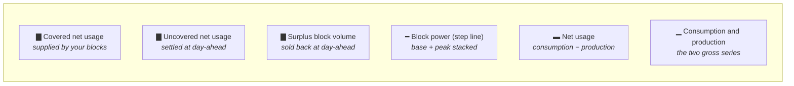

# F03 — Consumption & Production Visualisation

**Portal:** customer · **Priority:** Must · **Phase:** 1 (chart) / 2 (block overlay) · **Size:** L

---

## 1. Summary

The chart is the product's centre of gravity. It answers three questions at a glance: *what did I
use*, *what have I already hedged*, and *where am I exposed*. Everything else — price indications,
the trade wizard — hangs off a decision the customer makes while looking at this screen.

Two views: **day** (96 points, the shape of a working day) and **month** (daily totals, the shape of a
season). Purchased blocks overlay both.

> **[DEC-22] changes what the chart is about.** The volume basis is **net usage** = consumption −
> production, per interval per metering point. The chart therefore carries **three** series — the two
> gross ones and the net one — and coverage, the KPI strip and the covered / uncovered / surplus
> rendering are all measured against net usage, not against gross consumption. Consumption and
> production remain separate non-negative series **[AS-05]**; net usage is derived from them.
> Net usage may be **negative** in an interval when production exceeds consumption. That is export,
> and it is credited at the day-ahead price **[DEC-23]** — so the surplus band is now money the
> customer receives, not merely a shape on a chart.

## 2. User stories

| As a… | I want to… | So that… |
| --- | --- | --- |
| Customer user | see a day's consumption in 15-minute detail | I can see my load shape and my peaks |
| Customer user | see a month at daily resolution | I can see trend and weekday/weekend patterns |
| Customer user | see my purchased blocks drawn on the same chart | I can tell covered from uncovered volume immediately |
| Customer user | compare this period against the previous one | I can see whether something changed |
| Customer user | see consumption, production and net usage together | I can see the volume I am actually covered and charged on |
| Customer user | know whether the data is provisional or final | I know how much to trust it |
| Customer user | switch between metering points, or view several combined | I can work per site or per portfolio |
| Customer user | export the underlying data | I can use it in my own model |
| Customer user | go from "I'm exposed here" to a trade request in one click | the insight leads somewhere |

## 3. Functional requirements

### Day view

| ID | Requirement | MoSCoW |
| --- | --- | :--: |
| F03-R01 | The day view renders 15-minute interval data for one Amsterdam calendar day: 96 points normally, 92 or 100 on DST transition days. | Must |
| F03-R02 | Consumption, production and **net usage** (consumption − production) are rendered as three distinct, visually separable series **[DEC-22]**. The y-axis accommodates negative net usage; the zero line is always drawn. | Must |
| F03-R03 | The x-axis is local time with hour ticks; the autumn duplicate hour is labelled unambiguously (`02:00 A` / `02:00 B`). | Must |
| F03-R04 | The y-axis is kWh per interval by default, with a toggle to average kW. | Should |
| F03-R05 | Hovering an interval shows a tooltip with: local time range, consumption, production, **net usage**, block cover, net position (net usage − block cover), and the day-ahead price if available **[DEC-22]**. | Must |
| F03-R06 | Missing intervals are drawn as gaps, never as zero **[F02-R25]**. | Must |
| F03-R07 | Date navigation: previous/next day, a date picker, and a jump to the most recent day with data. | Must |

### Month view

| ID | Requirement | MoSCoW |
| --- | --- | :--: |
| F03-R08 | The month view renders daily totals for one calendar month. | Must |
| F03-R09 | Each day is clickable and drills into the day view. | Must |
| F03-R10 | Days with partial or missing data are visually marked, not silently short. | Must |
| F03-R11 | Non-peak days are shaded, using the same calendar as the peak definition **[DEC-14]**. Under **[DEC-19]** that is **Saturdays and Sundays only**: peak is Mon–Fri, at or after 08:00 and strictly before 20:00 `Europe/Amsterdam`, and public holidays are **not** excluded, so a holiday on a weekday is shaded as a peak day like any other. If a peak calendar's `excluded_dates[]` is ever populated, those dates shade too — the rule reads the calendar, never a hard-coded holiday list. | Should |
| F03-R12 | A quarter and a year view follow the same pattern at coarser granularity. | Could |

### Block overlay

| ID | Requirement | MoSCoW |
| --- | --- | :--: |
| F03-R13 | Confirmed blocks are overlaid as a step line showing total block power per interval, stacking base and peak **[F05](F05-energy-block-trading.md)**. | Must |
| F03-R14 | Coverage bands are drawn against **net usage**, not gross consumption **[DEC-22]**. The area below the overlay and under the net-usage curve is **covered**; net usage above it is **uncovered**; overlay above net usage is **surplus**. Where net usage is negative the whole interval is **export** and is rendered as surplus below the zero line, because it settles the same way **[DEC-23]**. | Must |
| F03-R15 | The overlay is derived from the same coverage function used for invoicing, on the same net-usage basis — one implementation, no divergence **[DEC-22]**. | Must |
| F03-R16 | Accepted-but-unconfirmed trades can be shown as a separate, visually provisional overlay, off by default and clearly labelled. | Should |
| F03-R17 | A legend lists the contributing blocks, each linking to its trade detail. | Must |
| F03-R18 | Individual blocks can be toggled to see the effect of removing one. | Could |

### Metrics and interaction

| ID | Requirement | MoSCoW |
| --- | --- | :--: |
| F03-R19 | A KPI strip above the chart shows, for the visible range: total consumption, total production, **total net usage**, block volume, covered %, uncovered MWh, surplus MWh, and the indicative day-ahead value of the open position **[DEC-22]**. That last figure is signed: a cost when the position is short, a **credit** when it is long, because surplus is credited at day-ahead **[DEC-23]**. Cost and credit are shown as two figures, never as one net number. | Must |
| F03-R20 | Every KPI carries the data state of its range; a range containing non-final data is labelled *provisional*. | Must |
| F03-R21 | A metering point selector supports one, several, or all — with several rendering the aggregate. | Must |
| F03-R22 | Comparison mode overlays the previous equivalent period (previous day / same weekday last week / previous month / same month last year). | Should |
| F03-R23 | The visible data can be exported as CSV and as PNG. Montel **price-indication** series are excluded from the export until the licence permits redistribution **[F04-R16]**, **[DEC-27]**. | Should |
| F03-R24 | A **"Hedge this exposure"** action on the chart opens the trade wizard pre-filled with the visible period and the **uncovered net-usage** volume as a suggested MW **[DEC-22]**. When the visible range has no uncovered volume — including a range that is net long or net exporting — the action is disabled with a plain explanation rather than offering a hedge against a surplus. | Should |
| F03-R25 | The chart is usable on a tablet: pinch-zoom on the x-axis, tap for tooltip. Phone gets a simplified view. | Should |

## 4. Business rules

1. **One coverage implementation.** Chart, invoice and employee view call the same function. A
   discrepancy between the chart and the invoice destroys trust faster than any bug.
2. **Provisional data is always labelled.** No number derived from non-final data appears without its
   state.
3. **Aggregation across metering points sums volumes; it never averages prices or ratios.**
   Coverage ratio for a selection is `Σ covered / Σ net usage` **[DEC-22]**, aggregated first and
   divided second. Intervals with negative net usage contribute nothing to the denominator: they are
   export **[DEC-23]**, reported as their own figure. Netting them into the denominator would make
   the ratio uninterpretable.
4. **The overlay reflects allocation, not the whole block.** If a 1 MW block is allocated 0.2 MW to
   this metering point, the overlay shows 0.2 MW here.
5. **Local time throughout.** No UTC anywhere in a customer-facing chart.
6. **Empty state is informative.** "No data yet — first data for a day arrives the following day"
   beats a blank canvas.

## 5. Reading the chart

The bands are drawn against **net usage**; the two gross series stay on the chart so the customer can
see where the net figure came from **[DEC-22]**. Below the zero line the surplus band is export, which
is credited at day-ahead rather than merely displayed **[DEC-23]**.

The 08:00 and 20:00 steps in the block line on weekdays are the single most informative feature of
the chart — they show peak cover starting and stopping. On **every** Monday to Friday, public
holidays included **[DEC-19]**. The design must not smooth them.

## 6. Screens

| Screen | Mockup |
| --- | --- |
| Day view with block overlay | [`chart-day-view.svg`](../60-mockups/chart-day-view.svg) |
| Month view | [`chart-month-view.svg`](../60-mockups/chart-month-view.svg) |
| Customer dashboard (chart in context) | [`customer-dashboard.svg`](../60-mockups/customer-dashboard.svg) |

## 7. Data & performance

| Concern | Approach |
| --- | --- |
| Day view payload | 96 intervals × a handful of series — trivial |
| Month view | Served from the `daily_position` rollup, not from raw intervals |
| Year view across 50 metering points | Served from a monthly rollup |
| Cache | Rollups are cached with the interval-data version as part of the cache key, so a correction invalidates naturally |
| Target | Day view interactive within **1.5 s** on a warm cache; month view within **2 s** ([NFR-03](../20-architecture/08-non-functional-requirements.md)) |

## 8. Edge cases

| Case | Behaviour |
| --- | --- |
| DST autumn day | 100 intervals; duplicate hour labelled `02:00 A` / `02:00 B`; day total correctly exceeds a normal day |
| DST spring day | 92 intervals; the 02:00–03:00 gap is a real gap, drawn as such |
| No data at all for the metering point | Explanatory empty state with the expected first-data date |
| Data arrives while the user is viewing | A non-intrusive "new data available" affordance; no silent redraw |
| Block covers only part of the visible range | The step line drops to zero outside the delivery period — never extrapolated |
| Production exceeds consumption | All three series render; net usage goes below the zero line and the interval is drawn as export **[DEC-22]**. The KPI strip shows it as exported MWh with its day-ahead credit **[DEC-23]**, not as a negative consumption |
| Whole visible range is net long | Coverage % is reported against the positive net-usage volume only; the "Hedge this exposure" action is disabled **[F03-R24]** |
| Public holiday on a weekday | Not shaded and not treated as off-peak — it is a peak day **[DEC-19]**. The block step line shows the 08:00 and 20:00 steps as on any other weekday |
| A correction changes yesterday | Chart shows the new values with a "corrected on …" marker |
| 50 metering points selected | Aggregate only; per-EAN breakdown moves to a table below the chart |

## 9. Out of scope

- Forecasting or predicted consumption.
- Weather overlays.
- Real-time / near-live metering (data is D+1 by nature).
- Anomaly detection.

## 10. Dependencies

| Depends on | Why |
| --- | --- |
| [F02](F02-metering-data-ingestion.md) | The data itself |
| [F05](F05-energy-block-trading.md) | Blocks to overlay |
| [F08](F08-day-ahead-prices.md) | Price in tooltips and the exposure KPI |
| [Position & coverage](../50-calculations/02-position-and-coverage.md) | The maths |

## 11. Open questions

| Ref | Question |
| --- | --- |
| ~~[OQ-11]~~ | ~~Does production net against consumption, or is it informational only?~~ **Closed by [DEC-22]** — it nets. [AS-06] is superseded |
| [OQ-22] | Which charting library — and is a commercial licence acceptable? Note it must now render three series plus signed bands around a zero line **[DEC-22]** |
