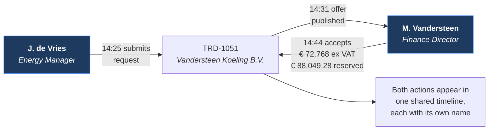
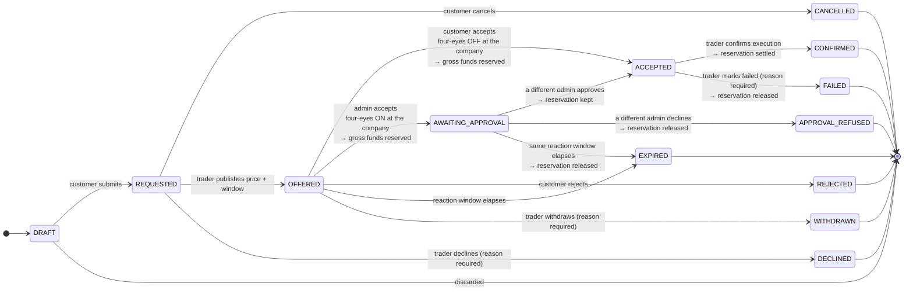
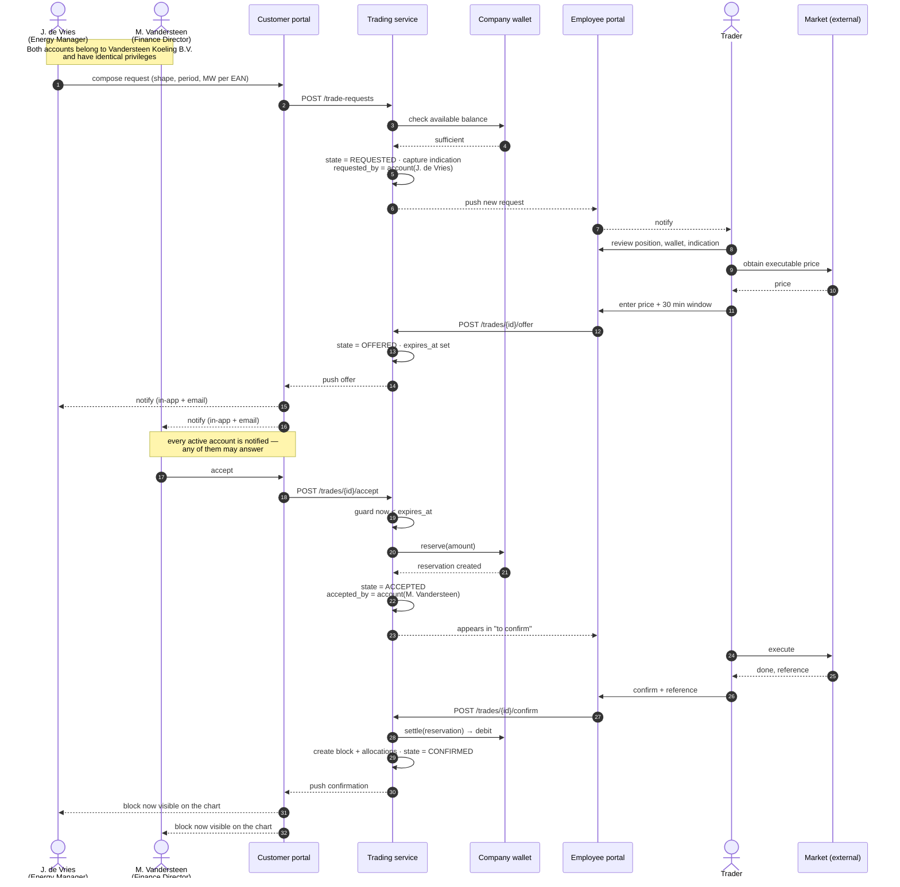
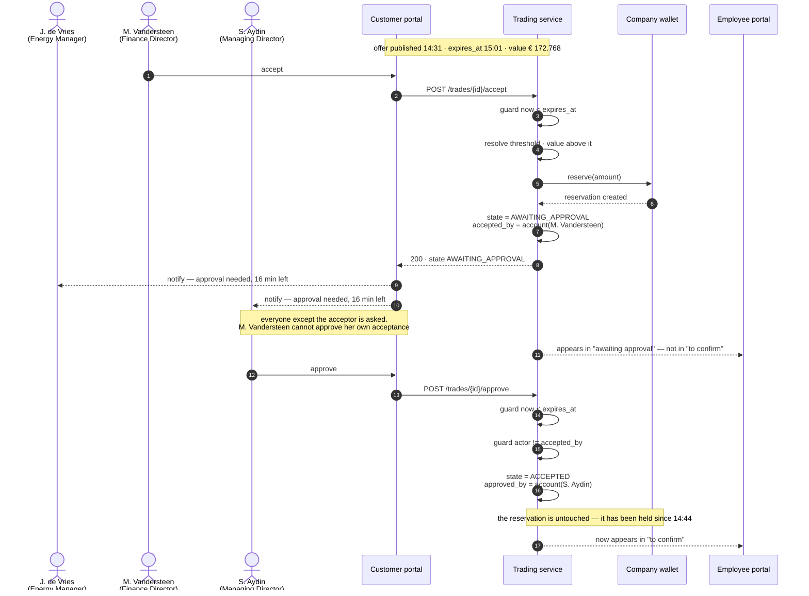

# F05 — Energy Block Trading

**Portal:** both · **Priority:** Must · **Phase:** 2 · **Size:** XL

---

## 1. Summary

The heart of the platform. A customer requests a block; PeakPower responds with a firm, time-limited
price; the customer accepts or rejects; PeakPower executes on the market and confirms. Money is
reserved on acceptance and settled on confirmation. Above a value threshold, a **second account at
the customer must approve the acceptance** before PeakPower executes **[DEC-33]**. ⚠ **Reversed
2026-08-19 by [DEC-71]** — there is **no threshold**, in euros or in megawatts. Four-eyes is a
**per-customer-company mode**: a flag on the company. When it is on, an action by one **admin
account** of that company must be approved — or declined — by a **different admin account of the
same company** before PeakPower executes. When it is off, no approval step exists at any value.

Two money facts belong in the first paragraph because everything downstream depends on them. The
amount reserved and later debited is **VAT-inclusive** **[DEC-78]** — prices stay quoted and stored
ex-VAT **[DEC-26]**, and the wallet holds `volume × price × (1 + VAT rate)` at the 21% rate of
**[DEC-64]**. And the wallet funds **trading and nothing else** **[DEC-77]**: no delivery invoice
ever debits it, which is what turns the pre-trade balance check from one control among several into
the only one there is.

It is a **quote-driven** flow, not an order book. A human trader sits in the middle deliberately —
they are the market access. The platform's job is to make that human fast, to make the customer's
wait bounded and visible, and to leave an audit trail that answers any later question without anyone
having to remember anything.

Three properties are non-negotiable: **the customer can never commit money they don't have**, **every
state change is recorded with who, when and why**, and **"who" is a named person, not a company**.

### Two accounts, one trade

A trade belongs to the customer **company**; each action on it belongs to a specific **customer
account** **[DEC-17]**. Any account of the company may take any action, so the common shape is that
one person raises the request and another answers the offer **[DEC-18]**:

This is not an edge case to be tolerated — it is the normal division of labour at a company of any
size, and the reason attribution has to be per account rather than per company.

Above a value threshold it stops being merely the normal shape and becomes a **rule**: the acceptance
and the approval must come from two different accounts **[DEC-33]**. ⚠ **Amended 2026-08-19 by
[DEC-71]** — the trigger is the **company's four-eyes flag**, not a value, and both accounts must be
**admin** accounts of that company. See §3.2 — the whole design rests on the fact that per-account
attribution already exists **[DEC-17]**.

## 2. User stories

### Customer

| As a… | I want to… | So that… |
| --- | --- | --- |
| Customer user | request a block by shape, period and MW | I can hedge my exposure |
| Customer user | split the volume across several of my metering points in one request | I can bundle small site volumes into a tradeable whole-MW block |
| Customer user | see the estimated cost before I submit | I know what I'm asking for |
| Customer user | know our wallet can cover it before I submit | I don't waste a request |
| Customer user | cancel a request while it is still unanswered — including one a colleague raised | someone who is out of office does not block us |
| Customer user | be told immediately when an offer arrives on a request **I** raised | I don't miss a 30-minute window. ⚠ Under **[DEC-111]** nobody else is told, so the colleague who might have answered it does not know it exists |
| Customer user | see the offer with a live countdown | I know how long I have |
| Customer user | accept or reject an offer my colleague requested | the person who approves spend is not always the person who spots the exposure |
| Customer user | be told, before I accept, that our company runs four-eyes and a second **admin** must approve **[DEC-71]** | I don't accept with two minutes left and no one to call |
| Customer **admin** | approve or decline another admin's acceptance **[DEC-71]** | one person alone cannot commit the company's money |
| Customer user | see which of my colleagues did what, and when | I can reconstruct what happened without asking around |
| Customer user | see my colleague's job title next to their name in the history | I can tell whether the right person approved it |
| Customer user | sell a block back | I can unwind a position, up to the moment the delivery month starts **[DEC-78]** |
| Customer user | sell volume I do not yet hold | I can monetise expected solar surplus I can forecast but cannot yet prove **[DEC-72]** |

### Employee

| As a… | I want to… | So that… |
| --- | --- | --- |
| Trader | see new requests the moment they arrive | I can respond inside the expected turnaround |
| Trader | see everything I need on one screen: volumes per EAN, the customer's position, their wallet, the current indication | I can price without switching context |
| Trader | enter a price and a reaction window and publish the offer | the customer gets a firm number |
| Trader | see which offers are counting down and which are about to expire | nothing is dropped |
| Trader | know at pricing time that this customer runs four-eyes **[DEC-71]** | I can quote a reaction window two people can actually meet |
| Trader | see which accepted trades are still waiting on a second approver | I do not execute against a commitment that is not yet binding |
| Trader | confirm a trade after I've executed it externally | the customer's position becomes real |
| Trader | mark a trade failed with a mandatory explanation | the reservation is released and the customer knows why |
| Trader | see the reserved amount and the wallet impact before confirming | I don't confirm a trade the wallet can't take |
| Trader | see which person at the customer raised the request, and their role | I know who to call if I need to clarify something |

## 3. State machine

`ACCEPTED` is the state the brief calls *PENDING*. It is named `ACCEPTED` here because it says what
happened rather than what is being waited for; the UI may still label it "Pending confirmation".

`AWAITING_APPROVAL` and `APPROVAL_REFUSED` are added by **[DEC-33]**. ⚠ **Amended 2026-08-19 by
[DEC-71]** — **[DEC-33]** is replaced, but these two states are **kept**: the approval step stays in
the trade state machine, and only the guard that reaches it changes. The machine is still **fourteen
transitions over thirteen states**; the authoritative, exhaustively-testable tuple set is in
[Domain model §4.2](../20-architecture/03-domain-model.md).

Two things the diagram is saying that are easy to miss. `AWAITING_APPROVAL` is entered by the *same*
`Accept` action as `ACCEPTED` — the destination is decided by one guard on the trade value, not by a
different button. ⚠ **Amended 2026-08-19 by [DEC-71]**: that guard reads the **owning company's
four-eyes flag**. It is a boolean on a row the platform already has loaded, so it cannot fail on
missing reference data, and it returns the same answer for a € 400 trade and a € 400.000 one. And
`AWAITING_APPROVAL` leads back into `ACCEPTED`, so **the trader's half of the machine is unchanged**:
`ACCEPTED` still means "fully committed by the customer", and an unapproved trade never reaches the
"to confirm" queue.

### 3.1 State reference

| State | Meaning | Money | Who can move it | Customer sees |
| --- | --- | --- | --- | --- |
| `DRAFT` | Being composed | — | The composing account only | Not submitted |
| `REQUESTED` | Awaiting a price | — | **Any** account of the company (cancel), Trader | Awaiting price |
| `OFFERED` | Firm price, clock running | — | **Any** account of the company, Trader (withdraw), System (expire) | **Offer — respond within mm:ss** |
| `AWAITING_APPROVAL` | ~~Accepted above the threshold~~, waiting on a second account **[DEC-33]**. ⚠ **Amended 2026-08-19 by [DEC-71]** — entered because the **company has four-eyes on**, at any value | **Reserved, gross** **[DEC-78]** | Any active **admin** account of the company **except the acceptor** (approve or decline) **[DEC-71]**, System (expire) | **Accepted — awaiting approval, mm:ss left** |
| `ACCEPTED` | Customer committed | **Reserved, gross** **[DEC-78]** | Trader | Pending confirmation |
| `CONFIRMED` | Executed and settled | **Debited gross** (BUY) / **Credited gross** (SELL) **[DEC-78]** | — | Confirmed |
| `DECLINED` | PeakPower will not price it | — | — | Declined + reason |
| `REJECTED` | Customer said no | — | — | Rejected |
| `EXPIRED` | Window elapsed | — **or Released**, if it elapsed while awaiting approval | — | Expired |
| `WITHDRAWN` | Offer pulled before response | — | — | Withdrawn + reason |
| `FAILED` | Execution failed after acceptance | **Released** | — | Failed + reason |
| `APPROVAL_REFUSED` | A second ~~account~~ **admin account [DEC-71]** would not approve the acceptance **[DEC-33]** | **Released** | — | Not approved + who declined |
| `CANCELLED` | Withdrawn before pricing | — | — | Cancelled |

Terminal states are immutable. A mistake is corrected by a new trade, never by editing an old one.

Three negative verbs, three different actors, deliberately not interchangeable: PeakPower
**declines** a request, the customer **rejects** an offer, and a second customer account **refuses**
an acceptance that has already been made. Only the third has money to release. ⚠ **Amended
2026-08-19 by [DEC-71]** — the third actor is now specifically a **different admin account** of the
same company, and the verb covers both outcomes: [DEC-71] gives that account the approve *and* the
decline.

Note also that `EXPIRED` is the one state whose money column is now conditional. Before **[DEC-33]**
no expiry could touch the wallet, because nothing was reserved before acceptance. An offer that is
accepted above the threshold and then expires unapproved *does* release a reservation. ⚠ **Amended
2026-08-19 by [DEC-71]** — read "accepted at a company with four-eyes on" for "accepted above the
threshold". The conditional money column survives untouched; only what puts a trade into that column
changed. Under **[DEC-78]** the amount released is the **gross** reservation.

### 3.2 Four-eyes approval — the design and why

**[DEC-33]** requires a second pair of eyes above a value threshold. It does not say where in the
flow, who counts as a second pair, what happens to the money or what happens to the clock. Those are
design choices; each is stated here with its reasoning so it can be argued with later.

⚠ **Replaced 2026-08-19 by [DEC-71].** There is **no threshold**, in euros or in megawatts. Four-eyes
is a **per-customer-company mode**: a flag on the customer company. When it is on, an action by one
**admin account** of that company must be approved — or declined — by a **different admin account of
the same company**. When it is off, nothing in the trade flow changes at any value. **[OQ-85]**, which
asked what the threshold should be, closes with the threshold itself.

What that buys and what it costs, stated plainly rather than presented as a simplification. It buys
the removal of an entire class of reference data: a threshold table, a most-specific-scope resolution
order, a version pinned on every trade, an admin screen to maintain it, and the deployment failure
mode in which a platform holding no threshold row cannot accept a trade at all. It costs granularity
— a company with four-eyes on needs two admins for a € 400 trade exactly as much as for a € 400.000
one, and there is no way to exempt the small ones. That cost lands on a customer who chose the mode,
which is the right place for it; the threshold's cost landed on PeakPower, in the form of a number
nobody was willing to name.

**What four-eyes covers.** **[DEC-71]** puts five actions in scope. Exactly one of them belongs to
this document — **execute a trade**, which in this state machine means *accept an offer*. The others
are specified where they live and are deliberately **not** restated here:

| Action in scope **[DEC-71]** | Specified in |
| --- | --- |
| **Execute a trade** — accept an offer | **This document**: §3.2, **[F05-R59]**…**[F05-R67]**, **[F05-R71]** |
| Add a bank account · deactivate a bank account | [F01 Customer & metering points](F01-customer-and-metering-points.md). ⚠ **[DEC-71]** also settles that a bank account **cannot be edited once added** — it can only be deactivated |
| Add a user | [F01 Customer & metering points](F01-customer-and-metering-points.md), [F13 Identity & access](F13-identity-and-access.md) |
| Withdraw funds | [F06 Wallet & ledger](F06-wallet-and-ledger.md), [F07 Wallet top-up & payments](F07-wallet-topup-and-payments.md) — the payout path itself is **[DEC-83]** |

**Deposits are explicitly out of scope** for four-eyes: a customer can transfer money or use iDEAL
alone, so gating a deposit gates nothing that is not already ungated.

**Where it sits — after acceptance.** The approval is a gate between the customer's commitment and
PeakPower's execution, not between the offer and the answer. The alternative considered was an
*endorse-then-accept* shape: one account endorses the offer, a second accepts it. Rejected, for
three reasons. (a) **Money.** Nothing is reserved until acceptance, so a pending endorsement has no
claim on the balance — an invoice debit or a second trade could empty it underneath, and the control
would fail at the last step for reasons unrelated to governance. (b) **Clock.** It makes answering an
offer a two-step act, so **[DEC-13]**'s single server-side guard has to be evaluated twice with two
different meanings. (c) **Meaning.** Acceptance is currently the one atomic instant at which the
customer commits and the money moves; splitting it creates a state where the company has said yes and
nothing is held. Placing the state after acceptance keeps all three properties intact.

**The money — an awaiting-approval trade holds a reservation.** `Accept` creates the reservation in
the same transaction whichever state it lands in. This is not an optimisation, it is the point:
without it the available balance could be spent underneath a pending approval, and approval would
then be a race against the customer's own invoices rather than a governance step. It also means
approval needs **no second balance check** — the money was already put beyond reach at acceptance.
Leaving `AWAITING_APPROVAL` by any route other than approval releases the reservation in full, in the
same transaction. ⚠ **Amended 2026-08-19 by [DEC-78]** — the amount held is the **gross** amount,
`volume × price × (1 + VAT rate)`; §5.1 works the figures. ⚠ **Amended 2026-08-19 by [DEC-77]** — the
"customer's own invoices" this paragraph feared can no longer reach the wallet at all, so the only
thing that can now spend an available balance underneath a pending approval is *another trade*. The
argument for reserving at acceptance is unchanged; the list of threats it defends against is one
shorter.

**The clock — the offer window keeps running, and it is the only window.** If approval has not been
recorded by `expires_at`, the trade expires and the reservation is released. This is the sharpest
edge in the design, so it is worth being explicit about the alternatives.

- *Stop the clock at acceptance.* Rejected. The trader quoted a firm price for a bounded window; a
  trade that binds PeakPower indefinitely while a customer hunts for a second signatory transfers
  market risk to PeakPower for free, and does so precisely on the largest trades. ⚠ **Amended
  2026-08-19 by [DEC-71]** — "precisely on the largest trades" no longer holds, because the mode is
  not size-dependent; the risk transfer itself is unchanged, so the rejection stands on its first
  two clauses alone.
- *Start a second, separate approval window at acceptance.* Rejected. It invents a second clock, and
  it lets a customer accept at `expires_at − 1s` and still bind PeakPower for another half hour —
  the same risk transfer, wearing a timer.
- *Keep one clock.* Chosen. The reaction window is the whole period during which the customer may
  bind PeakPower, and **both** signatures must fall inside it. **[DEC-13]** is unchanged: one
  `expires_at`, one server-side guard, one expiry job, now guarding two transitions instead of one.

The consequence is real and must not be papered over: accepting a large trade with four minutes left
will usually expire unapproved (⚠ **[DEC-71]**: read *any* trade at a four-eyes company, not just a
large one — the exposure to this failure is now uniform across that customer's trades, and
**[DEC-111]** narrows the people who even know the offer arrived). That is a *safe* failure — nothing is bound, the money comes back —
but it is a bad experience, so it is mitigated in three places rather than by bending the rule. The
wizard warns before submission **[F05-R56]**, the offer screen warns before acceptance
**[F05-R57]**, and the trader is told at pricing time so they can quote a longer window
**[F05-R58]**; the window is already configurable up to 1440 minutes **[F05-R17]**, so no new
mechanism is needed. An expired trade is not extended or revived — that would re-open a priced offer
after its window, which is the thing the window exists to prevent. The remedy is a new request.

**Who may approve — a different account, because there is nothing else it could be.** **[DEC-16]**
gives every account of a company identical privileges, so approval cannot be a permission: there is
no role to grant and no role to check. **[DEC-17]** records the acting account on every action, which
is what makes the rule enforceable at all. So four eyes reduces to exactly one condition: **the
approving account is an active account of the owning company and is not the account that accepted.**
That sentence is the whole of it.

⚠ **Amended 2026-08-19 by [DEC-71].** **[DEC-16]** is now *qualified*: customer accounts carry an
**admin** flag. This is the smallest role model that can express four-eyes at all — exactly two
levels, existing for no other purpose, and everything [DEC-16] said about *who creates accounts*
(PeakPower employees) is untouched. The condition therefore grows by one clause: **the approving
account is an active *admin* account of the owning company and is not the account that accepted.**
The **accepting** account must be an admin too, otherwise a non-admin could commit the company and
only the counter-signature would be governed — which would make the control decorative in the one
direction that matters. Cost of the flag: a company that enables four-eyes and then flags only one
admin cannot trade, so the flag needs a screen, an owner and the guard in **[F05-R71]**.

Two consequences follow. First, the interaction with **[DEC-18]**: a trade may be raised by one
account and accepted by another, and **the requesting account is an eligible approver** provided it
is not also the accepting account. Requesting commits nothing — it asks for a price — so the person
who raised the request has not yet been one of the two pairs of eyes on the *commitment*. ⚠ **Amended
2026-08-19 by [DEC-71]** — and provided that account is an **admin**. A non-admin may still raise the
request; requesting is not an action four-eyes governs, so the wizard stays open to everyone. Requiring
three distinct accounts was considered and rejected: it would be unmeetable at a company with two
accounts, and **[DEC-16]** gives no basis for calling one account more senior than another.

Second, **a company with one active account can never clear the threshold.** This is a genuine
operational dead end and must be surfaced early — at submission, not at acceptance — and it sharpens
the existing reason for prompting a second account at onboarding. ⚠ **Amended 2026-08-19 by
[DEC-71]** — read: **a company with four-eyes on and fewer than two active admin accounts can never
execute a trade at all, at any value.** The dead end is wider than it was, because it no longer waits
for a large trade to appear, and narrower, because it only exists at companies that switched the mode
on. It is therefore caught in two places: at the moment the mode is enabled **[F05-R71]** and at
submission **[F05-R56]**.

**Refusal is a new terminal state, not a return.** Two alternatives were considered. *Back to
`OFFERED`* would make acceptance reversible, re-open a binding offer, put a cycle into an otherwise
acyclic machine, and let a third account simply accept again — routing around the refusal and
defeating the control. *Reuse `REJECTED`* would conflate "the customer said no to an offer" with "a
second person refused a commitment already made": different moments, different actors, and unlike
`REJECTED` this one releases money. Reporting and the money table would both be quietly wrong. So
`APPROVAL_REFUSED` is its own terminal state. Refusal ends the trade for the company as a whole —
symmetric with `REJECTED`, where one account's no also answers for everyone **[DEC-18]**.

Refusal, unlike approval, is open to **any** active account including the acceptor. The four-eyes
rule exists to stop one person committing the company's money alone; refusing only ever *releases*
money and cannot bind anyone, so the rule has nothing to bite on. This also gives an acceptor who
realises their mistake a way out that does not involve waiting for the clock.

⚠ **Reversed 2026-08-19 by [DEC-71].** [DEC-71] gives the *decision* — "approved **or declined**" —
to a **different admin account of the same company**, in both directions. The refusal is no longer a
free action open to anyone; it is the negative half of the same counter-signature. ⚠ **Cost,
recorded because the paragraph above is the argument that is being overruled:** an acceptor who
realises immediately that they were wrong can no longer release their own reservation. They must
reach the other admin or wait for `expires_at`. No money is trapped — expiry releases the reservation
in full **[F05-R62]** — but the fast escape hatch is gone, and on a 1440-minute window the wait is a
day. If that turns out to hurt in practice, the cheapest fix is a *cancel-my-own-acceptance* action
distinct from *decline*, which is not decided here.

~~**⚠ The threshold value does not exist yet.** **[DEC-33]** states that a threshold is required and
deliberately does not say what it is. It is modelled as reference data with the same shape as a
surcharge **[F09-R01]** — scope, amount, `valid_from`, `valid_to` — and **no default is shipped**. A
guessed default is worse than an absent one: too low and every trade needs two people inside a
30-minute window, which makes the platform slower than the phone call it replaces; too high and the
control is decorative. **This value must be set, per customer or globally, before the state is
built.** Whether it is one global figure or a per-customer figure is part of the same unanswered
question — the data model supports both, and answering it is a business decision, not a technical
one. Treat this paragraph as an open question in everything but the numbering.~~

⚠ **Reversed 2026-08-19 by [DEC-71].** The question this paragraph refused to guess at was asked as
**[OQ-85]** and answered by removing it: there is no threshold, so there is no value to set, no
reference table to build and nothing blocking the state from being implemented. Concretely, what goes
away: **[F05-R50]**, **[F05-R51]**, **[F05-R52]**, **[F05-R53]** and **[F05-R54]** are retired below
(struck, not renumbered); the `four_eyes_threshold` table in §8 is not created; and **[F12-R38]**'s
admin screen becomes a per-company flag and an account flag instead of a versioned amount. What
arrives in its place is smaller than what leaves: one boolean on the customer company and one on the
customer account **[F05-R71]**.

## 4. Functional requirements

### Composing a request

| ID | Requirement | MoSCoW |
| --- | --- | :--: |
| F05-R01 | A customer can create a trade request with: direction (`BUY` / `SELL`), shape (`BASE` / `PEAK`), delivery period (month, quarter or calendar year), and one or more metering points each with a volume in MW. | Must |
| F05-R02 | Selectable delivery periods are **periods that have not yet started** **[DEC-42]**, bounded by a configurable horizon (default: up to 3 calendar years ahead). Mid-period entry does not exist: there is no partial-period volume and no mid-period coverage start. | Must |
| F05-R03 | Only `ACTIVE` electricity metering points belonging to the requesting customer, valid for the **entire** delivery period, may be selected **[DEC-40]**. A point whose validity covers only part of the period is **rejected, not pro-rated** — pro-rated allocation does not exist in the model. | Must |
| F05-R04 | Per-metering-point volume is entered in MW in steps of ~~**0,1 MW**, minimum 0,1 MW per line **[DEC-32]**~~ **0,01 MW, minimum 0,01 MW per line** **[DEC-70]**. ⚠ **Amended 2026-08-19 by [DEC-70]** — ten times finer than [DEC-32]. Every input mask, validation message and unit test carrying 0,1 changes with it. The total is computed and displayed live. | Must |
| F05-R05 | The wizard shows live: total MW, total MWh (from the calendar), estimated value at the current indication, and the resulting wallet impact. ⚠ **Amended 2026-08-19 by [DEC-80]** and **[DEC-78]** — the indication used is the **marked-up** one the customer is shown (quote plus a configurable percentage, default 2%, held as reference data) **[DEC-80]**, **[F04](F04-price-indications.md)**, never the raw quote; and the wallet impact displayed is the **gross** amount **[DEC-78]**, because that is what will actually be held. An ex-VAT impact shown next to a gross reservation understates it by 21% and would make the wizard lie about the only number the customer checks. | Must |
| F05-R06 | The estimated value is labelled as an estimate based on an indication, not a price. ⚠ **Amended 2026-08-19 by [DEC-80]** — an indication is **never firm unless PeakPower says so**, and it already carries the markup, so the label must not suggest either a firm number or a raw market number. | Must |
| F05-R07 | If the total is not a whole MW, an informational notice explains that PeakPower will round on the market side; the request is **not** blocked. ⚠ Under **[DEC-32]** this notice is the **common case, not the exception** — 0,1 MW steps rarely sum to a whole clip, so the wording must read as routine information rather than as a warning, or customers will learn to ignore it. ⚠ **Amended 2026-08-19 by [DEC-70]** — at 0,01 MW steps it is the case in *almost every* request. The notice is now effectively permanent chrome, which is an argument for stating it once, quietly, next to the total rather than as a dismissible alert. | Must |
| F05-R08 | Minimum requested volume ~~**0,1 MW**~~ **0,01 MW** and increment ~~**0,1 MW**~~ **0,01 MW**, both held as reference data with those values as the decided defaults ~~**[DEC-32]**~~ **[DEC-70]**. A total or line volume that is not a whole multiple of the increment is rejected. ⚠ **Amended 2026-08-19 by [DEC-70]**. The reference-data shape is unchanged — only the shipped values move — but every consequence [DEC-32] had for **per-EAN allocation rounding returns at 0,01 MW**: allocations are multiples of 0,01 MW and the non-whole-MW tail is back, distributed by the largest-remainder rule in [Energy block maths](../50-calculations/01-energy-block-maths.md) §5.2. Validation copy quoting "0,1 MW" must change with the rule or it will contradict the field it sits under. | Must |
| F05-R09 | For a `BUY`, submission is blocked when the estimated value exceeds the wallet's available balance, with a top-up call to action. The check uses **100% of the estimate with no buffer** **[DEC-41]**. ~~⚠ This confirms the default, and it is only safe while the wallet debit is VAT-exclusive: if [OQ-83] resolves the other way and the invoice debit turns out to be VAT-inclusive, the absence of a buffer is exactly what makes the shortfall bite **[DEC-26]**.~~ ⚠ **Amended 2026-08-19 by [DEC-78]**, which resolves **[OQ-83]** in exactly the direction that warning feared. **[DEC-41]**'s "100%, no buffer" survives, but the estimate it is 100% *of* is now the **gross** one — `volume × price × (1 + VAT rate)` at 21% **[DEC-64]**, computed on the marked-up indication **[DEC-80]** — see **[F05-R70]** and §5.1. An ex-VAT check would clear a request whose own reservation it under-covers by 21%, and the missing buffer is precisely what cannot absorb that. | Must |
| ~~F05-R10~~ | ~~For a `SELL`, the platform checks the customer holds sufficient **confirmed** block volume for that shape and period. **Short selling is not permitted at all** **[DEC-34]** — there is no per-customer authorisation flag and no credit view. A sell beyond confirmed holdings is rejected at submission.~~ ⚠ **Retired 2026-08-19 — [DEC-34] is reversed by [DEC-72]**, which permits short selling. Replaced by **[F05-R69]**. | ~~Must~~ |
| F05-R69 | For a `SELL`, the platform does **not** check holdings. **Short selling is permitted** **[DEC-72]**: a customer may sell a block they do not hold, and the case that motivates it is a customer with solar production selling **expected surplus** — volume they can forecast but cannot yet prove. There is no confirmed-holdings validation, no per-customer authorisation flag and no credit view; the sell wizard is the buy wizard with the direction flipped. ⚠ **What this exposes, recorded rather than assumed away:** a short is a **promise to deliver**, not a spend. The prepaid wallet **[AS-11]** does not bound it and the pre-trade balance check **[DEC-41]**, **[F05-R09]** does not either, because that check sizes a *debit* and a short creates none — a `SELL` **credits** the wallet on confirmation **[F05-R35]**. No collateral or exposure rule is decided: **[OQ-94]**. Until it is answered the sell path is specified but not safe to open to volumes beyond confirmed holdings. | Must |
| F05-R73 | The wallet funds **trading and nothing else** **[DEC-77]**. Delivery amounts — day-ahead, export, energiebelasting — are pushed to the bookkeeping program as a draft invoice **[DEC-88]** and paid to the bank; they never debit the wallet, and the `INVOICE_DEBIT` entry type is removed from it **[F06](F06-wallet-and-ledger.md)**. ⚠ This is what makes **[F05-R09]** the wallet's entire reason to exist: with invoices gone, the only thing that can consume an available balance is another trade of the same customer, so the pre-trade check is not one guard among several — it is the only one, and **[AS-11]** (no negative balance) holds or fails on it alone. It must therefore be strict, server-side and inside the same transaction as the reservation **[F05-R28]**, never an advisory check in the wizard. ⚠ Reverses **[AS-12]**. | Must |
| F05-R11 | The customer can add a comment to the request, visible to the trader and preserved in history. | Should |
| F05-R12 | On submission the platform captures the current price indication for the matching product **[F04-R10]**. | Must |
| F05-R13 | The customer receives an on-screen confirmation with a trade reference. | Must |
| F05-R14 | A trader can create a request on behalf of a customer, recorded as such in the audit trail. | Should |

### Pricing the request

| ID | Requirement | MoSCoW |
| --- | --- | :--: |
| F05-R15 | New requests appear on the employee trade desk in real time, sorted oldest-first, with an age indicator. | Must |
| F05-R16 | The trade detail screen shows: customer, all metering points with volumes, computed MWh, delivery period, the captured indication, current indication, the customer's existing position for that period, wallet balance and available balance, and the request comment. | Must |
| F05-R17 | The trader enters a price in €/MWh (4 decimals) and a reaction window in minutes (default 30, configurable range 5–1440). | Must |
| F05-R18 | Before publishing, the trader sees the resulting total value and the amount that will be reserved. ⚠ **Amended 2026-08-19 by [DEC-78]** — these are now **two different numbers** and both are shown, labelled: the total value is ex-VAT **[DEC-26]**, the amount reserved is that value grossed up by 21% **[DEC-64]**, **[F05-R70]**. Neither may stand in for the other on the pricing screen; the trader is the last person who can spot a wallet that covers the value but not the hold. | Must |
| F05-R19 | Publishing sets state `OFFERED`, stamps `offered_at` and computes `expires_at = offered_at + window`. | Must |
| F05-R20 | The trader can decline a request with a mandatory reason, which the customer sees. | Must |
| F05-R21 | The trader can withdraw a published offer before the customer responds, with a mandatory reason. | Should |
| F05-R22 | The trade desk shows offers counting down, ordered by time remaining, with a visual warning under 5 minutes. | Must |
| F05-R23 | A trader can add an internal note, **not** visible to the customer, stored separately from the shared history. | Should |

### Responding to an offer

| ID | Requirement | MoSCoW |
| --- | --- | :--: |
| F05-R24 | ~~The customer is notified of a new offer immediately: in-app, and by email **[F11](F11-notifications.md)**.~~ ⚠ **Amended 2026-08-19 by [DEC-111]**, which reverses **[DEC-63]**. The offer notification goes **only to the account that raised the request**, plus — when the company has four-eyes on **[DEC-71]** — the **admin accounts that would have to approve it**. No other account of the company is told, in-app or by email **[F11](F11-notifications.md)**. ⚠ **Cost, recorded because [DEC-63]'s rationale named exactly this:** a 30-minute offer can now die because one person is in a meeting. **[DEC-18]** still lets *any* account accept, so the platform deliberately narrows who **knows** while leaving open who **may act** — the two are no longer the same set, and that gap is an accepted risk, not an oversight. The mitigation is the requester's own escalation, not a platform broadcast. | Must |
| F05-R25 | The offer screen shows price, total value, full per-EAN breakdown, and a live countdown to `expires_at`. | Must |
| F05-R26 | The countdown is rendered client-side but **expiry is decided server-side [DEC-13]**. A client whose timer has run out still gets the server's answer. | Must |
| F05-R27 | Accepting requires a confirmation step that restates price, volume and the amount to be reserved. ⚠ **Amended 2026-08-19 by [DEC-78]** — the amount restated is the **gross** amount actually reserved, with the ex-VAT value and the 21% shown as separate lines so the customer can see where the difference comes from rather than discovering it in the ledger. | Must |
| F05-R28 | On acceptance the platform, in a single transaction: re-checks `now < expires_at`, re-checks available balance, ~~resolves the four-eyes threshold **[F05-R50]**~~ **reads the owning company's four-eyes flag** **[F05-R71]**, creates the reservation, and moves the trade to `ACCEPTED` **or** `AWAITING_APPROVAL` ~~**[F05-R51]**~~ **[F05-R71]**. Any check failing aborts the whole thing. ⚠ **Amended 2026-08-19 by [DEC-71]** and **[DEC-78]** — the branch is a boolean read on a row that is always present, not a reference-data resolution that can fail (see the retired **[F05-R53]**); and both the balance re-check and the reservation are **gross** **[F05-R70]**. | Must |
| F05-R29 | If the wallet no longer covers the amount at acceptance time, acceptance is refused with a specific message and a top-up route. The offer stays open until it expires. ⚠ **Amended 2026-08-19 by [DEC-77]** — after [DEC-77] the *only* thing that can have moved the balance since submission is another trade by the same company, so the message can say so specifically instead of guessing. | Must |
| F05-R70 | The amount **reserved** at acceptance and the amount **debited** at confirmation are **VAT-inclusive**: `reservation = round(totalMWh * price * (1 + vatRate), 2)` at the **[DEC-64]** rate of **21%** **[DEC-78]**. Prices are still quoted, offered and stored **ex-VAT** **[DEC-26]**, and the platform still computes no VAT for accounting purposes **[DEC-76]** — this is a **sizing rule for a wallet hold**, not a tax calculation, and it produces no VAT line anywhere. ⚠ The whole point: an ex-VAT reservation under-covers its own debit by 21%, and **[DEC-41]** deliberately leaves no buffer to absorb the difference. Reservation and debit are the **same stored number**, never two calculations, so settlement cannot fall short and a VAT-rate change between acceptance and confirmation cannot open a gap. Worked figures in §5.1. | Must |
| F05-R30 | The customer can reject an offer, optionally with a reason. | Must |
| F05-R31 | A background job expires trades past `expires_at` in **both** `OFFERED` and `AWAITING_APPROVAL`; additionally every accept **and every approve** attempt is guarded, so a job delay cannot let a stale offer through. | Must |
| F05-R32 | Expiry, rejection and withdrawal notify both sides. | Must |

### Four-eyes approval **[DEC-33]**

The reasoning behind each of these is in §3.2. ⚠ **None of this can be built until the threshold
value exists** — see the warning at the end of §3.2.

| ID | Requirement | MoSCoW |
| --- | --- | :--: |
| F05-R50 | The four-eyes threshold is **reference data, never a constant** **[DEC-33]**. A threshold row has: scope (`GLOBAL_DEFAULT` or a specific customer), `threshold_amount` in EUR **VAT-exclusive [DEC-26]** — nullable, where null means *this scope never requires approval* — `valid_from`, `valid_to` (nullable = open-ended), and a note. Same shape as a surcharge **[F09-R01]**. | Must |
| F05-R51 | The effective threshold for a trade is the **most specific row in force at the moment of acceptance**: a customer-scoped row wins over `GLOBAL_DEFAULT`. Approval is required when the offer's total value is **strictly greater than** the threshold; a value exactly equal to it is not. | Must |
| F05-R52 | The value compared is the offer's total value, `totalMWh × price` ex-VAT — the same number as the reservation amount **[AS-10]**, not the pre-submission estimate. | Must |
| F05-R53 | If **no** threshold row is in force for a customer, acceptance is refused with a configuration error and the desk raises a reference-data alert. The platform never guesses a default in either direction: silently requiring approval of everything and silently requiring it of nothing are both wrong. | Must |
| F05-R54 | The trade records the **threshold version and the amount compared** at acceptance, pinned like the peak-calendar version, so a later reference-data change cannot retroactively make a past trade look approved or unapproved in error. | Must |
| F05-R55 | Acceptance creates the reservation in the same transaction **whichever state it lands in**. An `AWAITING_APPROVAL` trade always holds an active reservation for the full value, so the balance cannot be spent underneath it and approval performs **no second balance check**. | Must |
| F05-R56 | The request wizard states, before submission, that the estimated value is above the customer's effective threshold and will need a second approver. It warns **prominently** when the company has fewer than two active accounts, because such a company cannot clear the threshold at all. | Must |
| F05-R57 | The acceptance confirmation step **[F05-R27]** states that a second colleague must approve, names how much time remains, and says plainly that the trade expires if approval does not arrive inside the window. | Must |
| F05-R58 | The trade desk tells the trader, at pricing time, that a request's value is above the customer's threshold, so a reaction window long enough for two people can be chosen **[F05-R17]**, **[F12-R35]**. | Must |
| F05-R59 | Approval is given by an **active account of the owning company that is not the accepting account** **[DEC-33]**. This is not a permission — **[DEC-16]** gives every account identical privileges, so the rule is a comparison of account ids and nothing else, made possible by **[DEC-17]**. A self-approval attempt is refused with a specific error, never silently ignored. | Must |
| F05-R60 | The **requesting** account is an eligible approver, provided it is not also the accepting account **[DEC-18]**. Raising a request commits nothing, so the requester has not yet been one of the two pairs of eyes on the commitment. Three distinct accounts are **not** required. | Must |
| F05-R61 | Approval must be recorded before the offer's `expires_at`. **There is no separate approval window** — the reaction window is the whole period in which the customer may bind PeakPower, and both the acceptance and the approval must fall inside it **[DEC-13]**. | Must |
| F05-R62 | A trade still in `AWAITING_APPROVAL` at `expires_at` moves to `EXPIRED` and its reservation is **released in full in the same transaction**. It is not extended, not revived and not re-offered; the remedy is a new request. | Must |
| F05-R63 | **Any** active account, **including the acceptor**, may refuse approval, optionally with a reason, moving the trade to the terminal state `APPROVAL_REFUSED` and releasing the reservation in full in the same transaction. Refusal only ever releases money, so the four-eyes rule has nothing to bite on; requiring a second person to undo a commitment would trap it. | Must |
| F05-R64 | Refusal ends the trade for the whole company. No other account may accept again, and the offer does not re-open — otherwise a refusal could be routed around by a third colleague, which would make the control decorative. | Must |
| F05-R65 | On entering `AWAITING_APPROVAL`, **every active account except the acceptor** is notified immediately, in-app and by email, with the value, the acceptor's name and job title, and the time remaining. The T−5-minute reminder goes to the same set. | Must |
| F05-R66 | A trade in `AWAITING_APPROVAL` does **not** appear in the trader's "To confirm" queue and cannot be confirmed or failed. `ACCEPTED` keeps its meaning — fully committed by the customer — so no path exists by which PeakPower executes against an unapproved commitment. | Must |
| F05-R67 | The timeline records the acceptance and the approval or refusal as separate events, each with the acting account's name and job title **[DEC-17]**, and shows the threshold that applied and the value compared. | Must |
| F05-R68 | The delivery period must still not have started at the moment of **acceptance and approval**, not only at submission **[DEC-42]**. A trade whose period starts while it is being answered is refused. *Design choice: **[DEC-42]** is written about buying, and the commitment happens at acceptance, so the guard belongs there as well as in the wizard.* | Must |

**A "cannot self-approve" test belongs in the must-exist set** in
[Solution structure §6.1](../20-architecture/02-solution-structure.md), alongside the eight already
there. It has the same shape as the ones listed: cheap to write, expensive and silent when wrong. The
test asserts that an approve attempt by the accepting account is refused, that the trade stays in
`AWAITING_APPROVAL`, and that no reservation is settled — because the failure mode is not an error
message, it is a large trade that quietly went through on one person's say-so. That file is owned
elsewhere; this is the note, not the edit.

### Confirming and failing

| ID | Requirement | MoSCoW |
| --- | --- | :--: |
| F05-R33 | Accepted trades appear on the trade desk in a **"To confirm"** queue with the acceptance age. | Must |
| F05-R34 | A trader can confirm, optionally recording the external execution reference and the actual market price. | Must |
| F05-R35 | On confirmation the platform, in one transaction: settles the reservation into a wallet debit (or credit for `SELL`), creates the block with its per-metering-point allocation, and moves the trade to `CONFIRMED`. | Must |
| F05-R36 | A trader can mark an accepted trade `FAILED` with a **mandatory** free-text reason. | Must |
| F05-R37 | Failing releases the reservation in full, in the same transaction, and the release appears in the ledger linked to the trade. | Must |
| F05-R38 | The failure reason is shown to the customer in the trade history and in a notification. | Must |
| F05-R39 | Accepted trades not confirmed within a configurable period (default 4 hours) raise an escalation alert. They do **not** auto-fail — releasing a customer's hedge automatically would be worse than a late confirmation. | Should |
| F05-R40 | A confirmed block cannot be edited or deleted. Unwinding is a new `SELL` trade. | Must |

### Account attribution

| ID | Requirement | MoSCoW |
| --- | --- | :--: |
| F05-R41 | Every customer action on a trade — submit, cancel, accept, reject, comment — records the **acting customer account**: account id, full name and job title at the time of the action **[DEC-17]**. | Must |
| F05-R42 | The trade carries a denormalised `requested_by_account_id` for listing and filtering; the authoritative record of every action remains the event stream. | Must |
| F05-R43 | **Any active account of the owning company** may cancel a request, or accept or reject an offer, regardless of which account raised it **[DEC-18]**. | Must |
| F05-R44 | The trade timeline shows, per event, the person's name and job title — *"Accepted by M. Vandersteen (Finance Director)"* — to both the customer and the employee. | Must |
| F05-R45 | The employee trade detail shows the requesting person's name, job title, email and phone, so the trader can call the right person. | Must |
| F05-R46 | Attribution survives deactivation: a trade raised by an account that is later deactivated still resolves to that person's name and job title. | Must |
| F05-R47 | The job title is captured **as it was at the time of the action**. A later promotion does not rewrite history. | Must |
| F05-R48 | A customer can filter their trade list by the account that raised the trade. | Should |
| F05-R49 | When an offer is answered by a different account than the one that requested it, the timeline makes that visually explicit rather than leaving it to be inferred from two names. | Should |

## 5. Business rules

1. **Money is reserved, then settled — never skipped.** No path exists from `OFFERED` to a wallet
   debit without passing through a reservation.
2. **Reservation amount = `totalMWh × price`, rounded to 2 decimals** **[AS-10]**, **VAT-exclusive**
   **[DEC-26]**. This is also the number compared against the four-eyes threshold **[F05-R52]**. ⚠ The
   residual exposure is [OQ-83] — if the invoice debit turns out to be VAT-inclusive, an ex-VAT
   reservation under-covers it, and **[DEC-41]** removed the buffer that would have absorbed it.
3. **Available balance can never go negative through a customer action** **[AS-11]**.
4. **The server owns the clock** **[DEC-13]**.
5. **Reasons are mandatory on every negative outcome** initiated by PeakPower: decline, withdraw,
   fail. The customer always learns why.
6. **The trade history is shared.** Customer and employee see the same event stream — same events,
   same timestamps, same comments. Internal notes are a separate, explicitly internal channel.
7. **The trade belongs to the company; every action belongs to an account.** No customer-initiated
   event is ever recorded against the company alone **[DEC-17]**.
8. **Any account may act on any of its company's trades** **[DEC-18]**. The platform does not
   enforce the customer's internal governance; it records who exercised it.
9. **Blocks exist only from confirmed trades.** No other path creates a position.
10. **Allocations sum exactly to the block power**, with the largest-remainder rounding rule from
    [Energy block maths](../50-calculations/01-energy-block-maths.md) §5.2.
11. **A trade references the peak calendar version it was priced under**, so a later calendar change
    cannot retroactively alter volume or value.
12. **Concurrent acceptance is impossible.** The accept path takes a row-level lock on the wallet and
    on the trade. If two accounts click Accept simultaneously, exactly one succeeds and the timeline
    names them. The same applies to approval and refusal.
13. **Four eyes is two account ids, not a permission** **[DEC-33]**. **[DEC-16]** leaves no role to
    grant or check, so the entire rule is: the approving account is active, belongs to the owning
    company, and is **not** the account that accepted.
14. **An awaiting-approval trade always holds a reservation.** There is no state in which the
    customer has committed and the money is not held. Rule 1 extends unchanged: no path exists from
    `OFFERED` to a wallet debit without passing through a reservation.
15. **One clock covers the whole customer response** **[DEC-13]**. Acceptance and approval must both
    fall inside the reaction window. There is no second timer, no extension and no grace period.
16. **The threshold is reference data and has no default** **[DEC-33]**. A deployment with no
    threshold in force does not trade.

## 6. The full happy path

Two customer accounts of one company, which is the realistic shape.

The resulting timeline names both people, so "who approved this?" is answerable a year later without
anyone having to remember.

### 6.1 The four-eyes path

The same flow when the offer's total value is above the customer's threshold **[DEC-33]**. Three
accounts appear, but only the last two matter to the rule: the **acceptor** and the **approver** must
differ.

Two things this diagram is asserting. The wallet is touched **once**, at acceptance — approval moves
no money, which is why approval cannot fail on funds. And `expires_at` is guarded **twice**, with the
same value, because the reaction window governs the whole of the customer's response.

If S. Aydin does nothing, the expiry job moves the trade to `EXPIRED` at 15:01 and releases the
reservation. Nothing is bound and the money comes back; the customer starts again with a fresh
request, which the trader can quote with a longer window.

## 7. Screens

| Screen | Mockup |
| --- | --- |
| Trade request wizard | [`trade-wizard.svg`](../60-mockups/trade-wizard.svg) |
| Offer with countdown | [`trade-offer-countdown.svg`](../60-mockups/trade-offer-countdown.svg) |
| Trade history / audit timeline | [`trade-history.svg`](../60-mockups/trade-history.svg) |
| Employee trade desk | [`employee-trade-desk.svg`](../60-mockups/employee-trade-desk.svg) |
| Employee trade detail & pricing | [`employee-trade-detail.svg`](../60-mockups/employee-trade-detail.svg) |

## 8. Data

| Entity | Purpose |
| --- | --- |
| `trade` | Current projection: customer (company), **requested_by_account_id**, direction, shape, period, total MW, price, state, timestamps, and — for **[DEC-33]** — `accepted_by_account_id`, `approved_by_account_id`, `four_eyes_threshold_version_id`, `threshold_amount_applied` |
| `four_eyes_threshold` | Reference data **[DEC-33]**: scope, scope_id, threshold_amount (nullable), valid_from, valid_to, note, created_by. Same shape as `surcharge`. ⚠ **Ships unpopulated — the value is not decided** |
| `trade_line` | Per-metering-point requested volume |
| `trade_event` | Append-only event stream — the audit trail **[DEC-06]**. Each event carries actor type, **account id, name and job title as at that moment** **[DEC-17]** |
| `offer` | Price, window, `offered_at`, `expires_at`, offering employee |
| `block` | A confirmed position, created from a confirmed trade |
| `block_allocation` | Per-metering-point MW of a block |
| `wallet_reservation` | Amount held, linked to the trade |

## 9. Edge cases & failure modes

| Case | Behaviour |
| --- | --- |
| Customer accepts at the same moment the offer expires | Server timestamp decides. A single serialised guard; no double outcome |
| Two browser tabs both accept | Second attempt fails idempotently on the trade version; one reservation only |
| **Two different accounts click Accept at the same instant** | The wallet row lock serialises them. Exactly one acceptance is recorded, and the timeline names whoever won. The other sees the trade already accepted, with the colleague's name |
| **One account cancels a request another raised** | Allowed **[DEC-18]**. The timeline shows the requester and the canceller separately |
| **The requesting account is deactivated before the offer arrives** | The offer stands — it belongs to the company. Remaining accounts are notified and any may accept. History still names the deactivated requester |
| **A company has only one account and that person is on holiday** | Nobody can accept. The offer expires. This is a customer-side operational risk, and the reason employees are prompted to create a second account at onboarding |
| **An account's job title changes after acting on a trade** | The historical event keeps the title as it was **[F05-R47]**; the account record shows the new one |
| Wallet drained by an invoice between offer and acceptance | Acceptance refused with a clear message; offer remains open |
| Trader publishes an offer on an already-cancelled request | Rejected — state guard |
| Trader confirms twice | Idempotent; only one block and one settlement |
| Confirmation fails halfway (block created, wallet not debited) | Impossible: one database transaction covers both |
| Customer requests a period that starts tomorrow | Allowed while the period has not started, and re-checked at acceptance and approval **[F05-R68]**. The trader judges feasibility and may decline. ⚠ A short-dated period plus a four-eyes approval is the one combination that can run out of time twice |
| A metering point is end-dated between request and confirmation, ending **inside** the delivery period | Blocked. **[DEC-40]** requires validity across the entire period, so the trade is rejected rather than trimmed and the allocation is never pro-rated. If it is discovered after the offer, the trader declines or withdraws with a reason |
| Delivery period already started | Blocked in the wizard, and blocked again at acceptance and approval **[F05-R68]**. Mid-period entry does not exist **[DEC-42]** |
| A metering point is valid for only part of the delivery period | Rejected at submission **[DEC-40]**. The volume is not pro-rated and the point is not silently dropped |
| Offer window set to 5 minutes | Allowed; the notification and countdown must still be reliable, which is why email is sent immediately and not batched. ⚠ Do not set a 5-minute window on a request above the four-eyes threshold — two people cannot realistically both act, and the trade will expire unapproved **[F05-R58]** |
| **Trade value exceeds the four-eyes threshold** | Acceptance lands in `AWAITING_APPROVAL`, funds already reserved, and a second account must approve inside the same window **[DEC-33]** |
| **The acceptor tries to approve their own acceptance** | Refused with a specific error. This is the whole of four eyes in a system with no intra-company roles **[F05-R59]** |
| **The company has only one active account and the value is above the threshold** | The trade can never be approved. Warned prominently **before submission** **[F05-R56]**, not discovered at acceptance. This is the sharpest form of the operational risk that already argues for a second account at onboarding |
| **A customer accepts a large trade with two minutes left** | Allowed, and warned about first **[F05-R57]**. If approval does not arrive, the trade expires and the reservation is released. Safe, but a wasted round trip — which is why the trader is told at pricing time to quote a longer window |
| **Approval arrives at the same moment the window closes** | Server timestamp decides, under the same row lock as acceptance. Exactly one outcome: approved, or expired with the reservation released. Never both |
| **The only eligible approver is deactivated after acceptance** | Eligibility is evaluated live against active accounts. If none remains, the trade expires unapproved and the money returns. No override exists — an employee cannot approve on the customer's behalf, because that would be one pair of eyes wearing PeakPower's badge |
| **The threshold is changed while a trade is awaiting approval** | Irrelevant to that trade. The version and the compared amount were pinned at acceptance **[F05-R54]** |
| **A third account tries to accept after a refusal** | Refused. `APPROVAL_REFUSED` is terminal and the offer does not re-open **[F05-R64]** |
| Customer sells more than they hold | Rejected at submission. Short selling is not permitted at all **[DEC-34]** |
| A request total that is not a multiple of 0,1 MW | Rejected **[DEC-32]**. A total that is not a whole MW is fine and is the normal case — see **[F05-R07]** |
| Failed trade after the wallet has moved on | Release is always possible: it restores availability, never removes settled money |

## 10. Out of scope

- Automated or algorithmic execution.
- Order books, limit orders, resting orders.
- Structured or shaped products.
- Options, caps, collars.
- Secondary trading between customers.
- Partial fills — an offer is accepted whole or not at all.

## 11. Dependencies

| Depends on | Why |
| --- | --- |
| [F06 Wallet & ledger](F06-wallet-and-ledger.md) | Reserve, settle, release |
| [F04 Price indications](F04-price-indications.md) | Indication capture and the entry point |
| [F01](F01-customer-and-metering-points.md) | Metering points to allocate to |
| [F11 Notifications](F11-notifications.md) | Offer alerts are time-critical |
| [F15 Audit](F15-audit-and-observability.md) | The shared event stream |
| [F12 Employee back office](F12-employee-back-office.md) | The four-eyes threshold is reference data and needs an admin screen **[F12-R38]** |
| [Energy block maths](../50-calculations/01-energy-block-maths.md) | Volume and value |

## 12. Open questions

| Ref | Question | Status |
| --- | --- | --- |
| [OQ-08] | Minimum and increment for requested volume | **Closed — [DEC-32]**: 0,1 MW minimum, 0,1 MW increment |
| [OQ-09] | Is four-eyes approval required above a value threshold? | **Closed — [DEC-33]**: yes. See §3.2 |
| [OQ-10] | May a customer sell short, and who authorises it? | **Closed — [DEC-34]**: no, and nobody |
| [OQ-26] | Must a metering point be valid for the entire delivery period to be included? | **Closed — [DEC-40]**: yes, and validation rejects rather than trims |
| [OQ-27] | Should the pre-submission wallet check use a buffer above the estimate? | **Closed — [DEC-41]**: no, 100% of the estimate |
| [OQ-28] | Can a customer buy into a delivery period that has already started? | **Closed — [DEC-42]**: no |
| [OQ-29] | What happens to a customer's blocks when their contract ends mid-period? | **Open** |
| [OQ-81] | When an offer arrives, is every account notified, or only the one that raised the request? | **Closed — [DEC-63]**: every active account |

> ⚠ **[DEC-33]** closes [OQ-09] but leaves a hole behind it. **The threshold amount is not decided**,
> and the four-eyes state cannot be built until it is — see the warning at the end of §3.2. It is
> reference data with no default, per customer or global, and answering it is a business decision.
> Recorded here in prose deliberately: it is a live question, not a numbered one.
