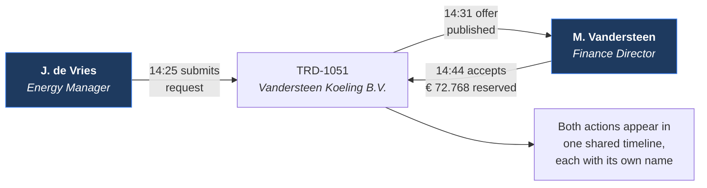
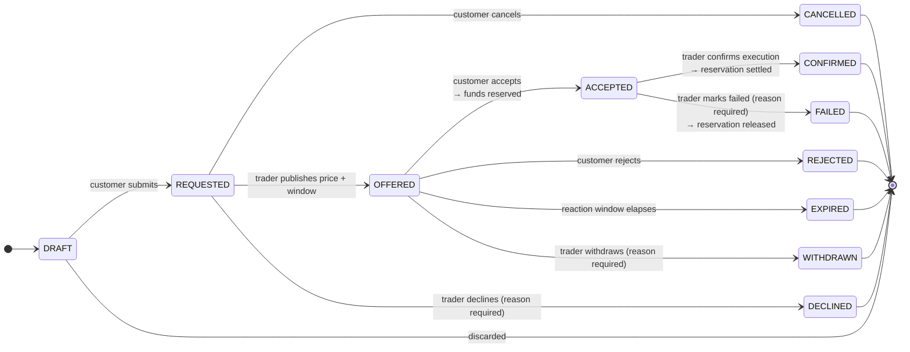
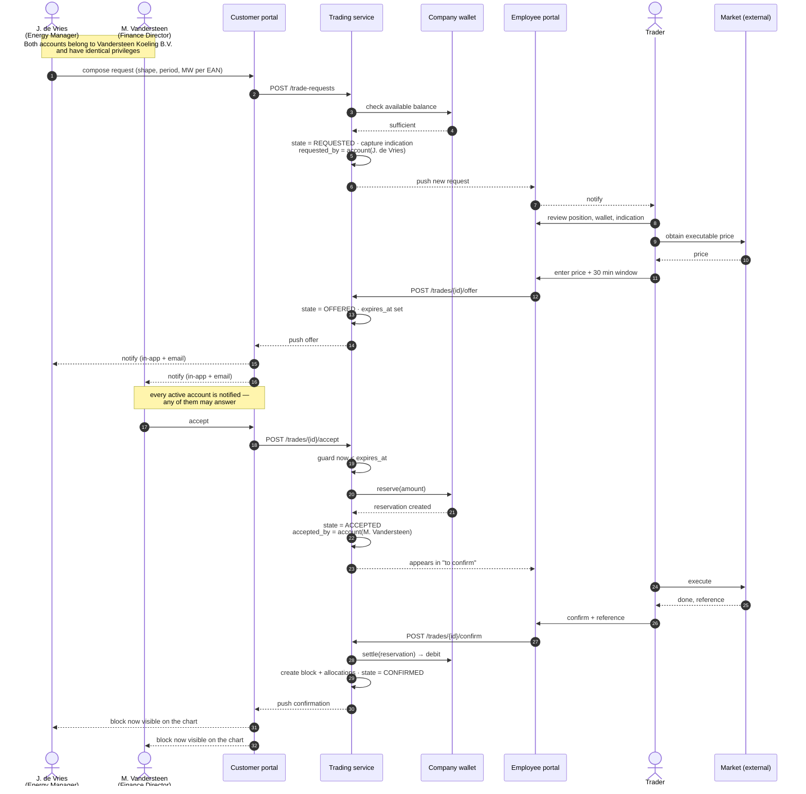

# F05 — Energy Block Trading

**Portal:** both · **Priority:** Must · **Phase:** 2 · **Size:** XL

---

## 1. Summary

The heart of the platform. A customer requests a block; PeakPower responds with a firm, time-limited
price; the customer accepts or rejects; PeakPower executes on the market and confirms. Money is
reserved on acceptance and settled on confirmation.

It is a **quote-driven** flow, not an order book. A human trader sits in the middle deliberately —
they are the market access. The platform's job is to make that human fast, to make the customer's
wait bounded and visible, and to leave an audit trail that answers any later question without anyone
having to remember anything.

Three properties are non-negotiable: **the customer can never commit money they don't have**, **every
state change is recorded with who, when and why**, and **"who" is a named person, not a company**.

### Two accounts, one trade

A trade belongs to the customer **company**; each action on it belongs to a specific **customer
account** **[DEC-17]**. Any account of the company may take any action, so the common shape is that
one person raises the request and another answers the offer **[DEC-18]**:

This is not an edge case to be tolerated — it is the normal division of labour at a company of any
size, and the reason attribution has to be per account rather than per company.

## 2. User stories

### Customer

| As a… | I want to… | So that… |
| --- | --- | --- |
| Customer user | request a block by shape, period and MW | I can hedge my exposure |
| Customer user | split the volume across several of my metering points in one request | I can bundle small site volumes into a tradeable whole-MW block |
| Customer user | see the estimated cost before I submit | I know what I'm asking for |
| Customer user | know our wallet can cover it before I submit | I don't waste a request |
| Customer user | cancel a request while it is still unanswered — including one a colleague raised | someone who is out of office does not block us |
| Customer user | be told immediately when an offer arrives | I don't miss a 30-minute window |
| Customer user | see the offer with a live countdown | I know how long I have |
| Customer user | accept or reject an offer my colleague requested | the person who approves spend is not always the person who spots the exposure |
| Customer user | see which of my colleagues did what, and when | I can reconstruct what happened without asking around |
| Customer user | see my colleague's job title next to their name in the history | I can tell whether the right person approved it |
| Customer user | sell a block back | I can unwind a position |

### Employee

| As a… | I want to… | So that… |
| --- | --- | --- |
| Trader | see new requests the moment they arrive | I can respond inside the expected turnaround |
| Trader | see everything I need on one screen: volumes per EAN, the customer's position, their wallet, the current indication | I can price without switching context |
| Trader | enter a price and a reaction window and publish the offer | the customer gets a firm number |
| Trader | see which offers are counting down and which are about to expire | nothing is dropped |
| Trader | confirm a trade after I've executed it externally | the customer's position becomes real |
| Trader | mark a trade failed with a mandatory explanation | the reservation is released and the customer knows why |
| Trader | see the reserved amount and the wallet impact before confirming | I don't confirm a trade the wallet can't take |
| Trader | see which person at the customer raised the request, and their role | I know who to call if I need to clarify something |

## 3. State machine

`ACCEPTED` is the state the brief calls *PENDING*. It is named `ACCEPTED` here because it says what
happened rather than what is being waited for; the UI may still label it "Pending confirmation".

### 3.1 State reference

| State | Meaning | Money | Who can move it | Customer sees |
| --- | --- | --- | --- | --- |
| `DRAFT` | Being composed | — | The composing account only | Not submitted |
| `REQUESTED` | Awaiting a price | — | **Any** account of the company (cancel), Trader | Awaiting price |
| `OFFERED` | Firm price, clock running | — | **Any** account of the company, Trader (withdraw), System (expire) | **Offer — respond within mm:ss** |
| `ACCEPTED` | Customer committed | **Reserved** | Trader | Pending confirmation |
| `CONFIRMED` | Executed and settled | **Debited** (BUY) / **Credited** (SELL) | — | Confirmed |
| `DECLINED` | PeakPower will not price it | — | — | Declined + reason |
| `REJECTED` | Customer said no | — | — | Rejected |
| `EXPIRED` | Window elapsed | — | — | Expired |
| `WITHDRAWN` | Offer pulled before response | — | — | Withdrawn + reason |
| `FAILED` | Execution failed after acceptance | **Released** | — | Failed + reason |
| `CANCELLED` | Withdrawn before pricing | — | — | Cancelled |

Terminal states are immutable. A mistake is corrected by a new trade, never by editing an old one.

## 4. Functional requirements

### Composing a request

| ID | Requirement | MoSCoW |
| --- | --- | :--: |
| F05-R01 | A customer can create a trade request with: direction (`BUY` / `SELL`), shape (`BASE` / `PEAK`), delivery period (month, quarter or calendar year), and one or more metering points each with a volume in MW. | Must |
| F05-R02 | Selectable delivery periods are future periods only, bounded by a configurable horizon (default: up to 3 calendar years ahead). | Must |
| F05-R03 | Only `ACTIVE` electricity metering points belonging to the requesting customer, valid for the whole delivery period, may be selected **[OQ-26]**. | Must |
| F05-R04 | Per-metering-point volume is entered in MW with 3 decimals. The total is computed and displayed live. | Must |
| F05-R05 | The wizard shows live: total MW, total MWh (from the calendar), estimated value at the current indication, and the resulting wallet impact. | Must |
| F05-R06 | The estimated value is labelled as an estimate based on an indication, not a price. | Must |
| F05-R07 | If the total is not a whole MW, an informational notice explains that PeakPower will round on the market side; the request is **not** blocked. | Must |
| F05-R08 | A minimum request volume is enforced (reference data, default 0.1 MW total) **[OQ-08]**. | Must |
| F05-R09 | For a `BUY`, submission is blocked when the estimated value exceeds the wallet's available balance, with a top-up call to action. The threshold uses a configurable buffer (default 100% of estimate) **[OQ-27]**. | Must |
| F05-R10 | For a `SELL`, the platform checks the customer holds sufficient confirmed block volume for that shape and period. Selling short is blocked unless the customer is flagged as permitted **[OQ-10]**. | Must |
| F05-R11 | The customer can add a comment to the request, visible to the trader and preserved in history. | Should |
| F05-R12 | On submission the platform captures the current price indication for the matching product **[F04-R10]**. | Must |
| F05-R13 | The customer receives an on-screen confirmation with a trade reference. | Must |
| F05-R14 | A trader can create a request on behalf of a customer, recorded as such in the audit trail. | Should |

### Pricing the request

| ID | Requirement | MoSCoW |
| --- | --- | :--: |
| F05-R15 | New requests appear on the employee trade desk in real time, sorted oldest-first, with an age indicator. | Must |
| F05-R16 | The trade detail screen shows: customer, all metering points with volumes, computed MWh, delivery period, the captured indication, current indication, the customer's existing position for that period, wallet balance and available balance, and the request comment. | Must |
| F05-R17 | The trader enters a price in €/MWh (4 decimals) and a reaction window in minutes (default 30, configurable range 5–1440). | Must |
| F05-R18 | Before publishing, the trader sees the resulting total value and the amount that will be reserved. | Must |
| F05-R19 | Publishing sets state `OFFERED`, stamps `offered_at` and computes `expires_at = offered_at + window`. | Must |
| F05-R20 | The trader can decline a request with a mandatory reason, which the customer sees. | Must |
| F05-R21 | The trader can withdraw a published offer before the customer responds, with a mandatory reason. | Should |
| F05-R22 | The trade desk shows offers counting down, ordered by time remaining, with a visual warning under 5 minutes. | Must |
| F05-R23 | A trader can add an internal note, **not** visible to the customer, stored separately from the shared history. | Should |

### Responding to an offer

| ID | Requirement | MoSCoW |
| --- | --- | :--: |
| F05-R24 | The customer is notified of a new offer immediately: in-app, and by email **[F11](F11-notifications.md)**. | Must |
| F05-R25 | The offer screen shows price, total value, full per-EAN breakdown, and a live countdown to `expires_at`. | Must |
| F05-R26 | The countdown is rendered client-side but **expiry is decided server-side [DEC-13]**. A client whose timer has run out still gets the server's answer. | Must |
| F05-R27 | Accepting requires a confirmation step that restates price, volume and the amount to be reserved. | Must |
| F05-R28 | On acceptance the platform, in a single transaction: re-checks `now < expires_at`, re-checks available balance, creates the reservation, and moves the trade to `ACCEPTED`. Any check failing aborts the whole thing. | Must |
| F05-R29 | If the wallet no longer covers the amount at acceptance time, acceptance is refused with a specific message and a top-up route. The offer stays open until it expires. | Must |
| F05-R30 | The customer can reject an offer, optionally with a reason. | Must |
| F05-R31 | A background job expires offers past `expires_at`; additionally every accept attempt is guarded, so a job delay cannot let a stale offer through. | Must |
| F05-R32 | Expiry, rejection and withdrawal notify both sides. | Must |

### Confirming and failing

| ID | Requirement | MoSCoW |
| --- | --- | :--: |
| F05-R33 | Accepted trades appear on the trade desk in a **"To confirm"** queue with the acceptance age. | Must |
| F05-R34 | A trader can confirm, optionally recording the external execution reference and the actual market price. | Must |
| F05-R35 | On confirmation the platform, in one transaction: settles the reservation into a wallet debit (or credit for `SELL`), creates the block with its per-metering-point allocation, and moves the trade to `CONFIRMED`. | Must |
| F05-R36 | A trader can mark an accepted trade `FAILED` with a **mandatory** free-text reason. | Must |
| F05-R37 | Failing releases the reservation in full, in the same transaction, and the release appears in the ledger linked to the trade. | Must |
| F05-R38 | The failure reason is shown to the customer in the trade history and in a notification. | Must |
| F05-R39 | Accepted trades not confirmed within a configurable period (default 4 hours) raise an escalation alert. They do **not** auto-fail — releasing a customer's hedge automatically would be worse than a late confirmation. | Should |
| F05-R40 | A confirmed block cannot be edited or deleted. Unwinding is a new `SELL` trade. | Must |

### Account attribution

| ID | Requirement | MoSCoW |
| --- | --- | :--: |
| F05-R41 | Every customer action on a trade — submit, cancel, accept, reject, comment — records the **acting customer account**: account id, full name and job title at the time of the action **[DEC-17]**. | Must |
| F05-R42 | The trade carries a denormalised `requested_by_account_id` for listing and filtering; the authoritative record of every action remains the event stream. | Must |
| F05-R43 | **Any active account of the owning company** may cancel a request, or accept or reject an offer, regardless of which account raised it **[DEC-18]**. | Must |
| F05-R44 | The trade timeline shows, per event, the person's name and job title — *"Accepted by M. Vandersteen (Finance Director)"* — to both the customer and the employee. | Must |
| F05-R45 | The employee trade detail shows the requesting person's name, job title, email and phone, so the trader can call the right person. | Must |
| F05-R46 | Attribution survives deactivation: a trade raised by an account that is later deactivated still resolves to that person's name and job title. | Must |
| F05-R47 | The job title is captured **as it was at the time of the action**. A later promotion does not rewrite history. | Must |
| F05-R48 | A customer can filter their trade list by the account that raised the trade. | Should |
| F05-R49 | When an offer is answered by a different account than the one that requested it, the timeline makes that visually explicit rather than leaving it to be inferred from two names. | Should |

## 5. Business rules

1. **Money is reserved, then settled — never skipped.** No path exists from `OFFERED` to a wallet
   debit without passing through a reservation.
2. **Reservation amount = `totalMWh × price`, rounded to 2 decimals** **[AS-10]**, VAT treatment per
   **[OQ-17]**.
3. **Available balance can never go negative through a customer action** **[AS-11]**.
4. **The server owns the clock** **[DEC-13]**.
5. **Reasons are mandatory on every negative outcome** initiated by PeakPower: decline, withdraw,
   fail. The customer always learns why.
6. **The trade history is shared.** Customer and employee see the same event stream — same events,
   same timestamps, same comments. Internal notes are a separate, explicitly internal channel.
7. **The trade belongs to the company; every action belongs to an account.** No customer-initiated
   event is ever recorded against the company alone **[DEC-17]**.
8. **Any account may act on any of its company's trades** **[DEC-18]**. The platform does not
   enforce the customer's internal governance; it records who exercised it.
9. **Blocks exist only from confirmed trades.** No other path creates a position.
10. **Allocations sum exactly to the block power**, with the largest-remainder rounding rule from
    [Energy block maths](../50-calculations/01-energy-block-maths.md) §5.2.
11. **A trade references the peak calendar version it was priced under**, so a later calendar change
    cannot retroactively alter volume or value.
12. **Concurrent acceptance is impossible.** The accept path takes a row-level lock on the wallet and
    on the trade. If two accounts click Accept simultaneously, exactly one succeeds and the timeline
    names them.

## 6. The full happy path

Two customer accounts of one company, which is the realistic shape.

The resulting timeline names both people, so "who approved this?" is answerable a year later without
anyone having to remember.

## 7. Screens

| Screen | Mockup |
| --- | --- |
| Trade request wizard | [`trade-wizard.svg`](../60-mockups/trade-wizard.svg) |
| Offer with countdown | [`trade-offer-countdown.svg`](../60-mockups/trade-offer-countdown.svg) |
| Trade history / audit timeline | [`trade-history.svg`](../60-mockups/trade-history.svg) |
| Employee trade desk | [`employee-trade-desk.svg`](../60-mockups/employee-trade-desk.svg) |
| Employee trade detail & pricing | [`employee-trade-detail.svg`](../60-mockups/employee-trade-detail.svg) |

## 8. Data

| Entity | Purpose |
| --- | --- |
| `trade` | Current projection: customer (company), **requested_by_account_id**, direction, shape, period, total MW, price, state, timestamps |
| `trade_line` | Per-metering-point requested volume |
| `trade_event` | Append-only event stream — the audit trail **[DEC-06]**. Each event carries actor type, **account id, name and job title as at that moment** **[DEC-17]** |
| `offer` | Price, window, `offered_at`, `expires_at`, offering employee |
| `block` | A confirmed position, created from a confirmed trade |
| `block_allocation` | Per-metering-point MW of a block |
| `wallet_reservation` | Amount held, linked to the trade |

## 9. Edge cases & failure modes

| Case | Behaviour |
| --- | --- |
| Customer accepts at the same moment the offer expires | Server timestamp decides. A single serialised guard; no double outcome |
| Two browser tabs both accept | Second attempt fails idempotently on the trade version; one reservation only |
| **Two different accounts click Accept at the same instant** | The wallet row lock serialises them. Exactly one acceptance is recorded, and the timeline names whoever won. The other sees the trade already accepted, with the colleague's name |
| **One account cancels a request another raised** | Allowed **[DEC-18]**. The timeline shows the requester and the canceller separately |
| **The requesting account is deactivated before the offer arrives** | The offer stands — it belongs to the company. Remaining accounts are notified and any may accept. History still names the deactivated requester |
| **A company has only one account and that person is on holiday** | Nobody can accept. The offer expires. This is a customer-side operational risk, and the reason employees are prompted to create a second account at onboarding |
| **An account's job title changes after acting on a trade** | The historical event keeps the title as it was **[F05-R47]**; the account record shows the new one |
| Wallet drained by an invoice between offer and acceptance | Acceptance refused with a clear message; offer remains open |
| Trader publishes an offer on an already-cancelled request | Rejected — state guard |
| Trader confirms twice | Idempotent; only one block and one settlement |
| Confirmation fails halfway (block created, wallet not debited) | Impossible: one database transaction covers both |
| Customer requests a period that starts tomorrow | Allowed if the period is still future at submission; the trader judges feasibility and may decline |
| A metering point is end-dated between request and confirmation | Warning to the trader; confirmation permitted but flagged. Allocation stays on the EAN for the period it was valid |
| Delivery period already started | Blocked in the wizard. Mid-period entry is out of scope **[OQ-28]** |
| Offer window set to 5 minutes | Allowed; the notification and countdown must still be reliable, which is why email is sent immediately and not batched |
| Trade value exceeds a large-trade threshold | Flagged on the desk. Whether a second approver is required is **[OQ-09]** |
| Customer sells more than they hold | Blocked by default **[OQ-10]** |
| Failed trade after the wallet has moved on | Release is always possible: it restores availability, never removes settled money |

## 10. Out of scope

- Automated or algorithmic execution.
- Order books, limit orders, resting orders.
- Structured or shaped products.
- Options, caps, collars.
- Secondary trading between customers.
- Partial fills — an offer is accepted whole or not at all.

## 11. Dependencies

| Depends on | Why |
| --- | --- |
| [F06 Wallet & ledger](F06-wallet-and-ledger.md) | Reserve, settle, release |
| [F04 Price indications](F04-price-indications.md) | Indication capture and the entry point |
| [F01](F01-customer-and-metering-points.md) | Metering points to allocate to |
| [F11 Notifications](F11-notifications.md) | Offer alerts are time-critical |
| [F15 Audit](F15-audit-and-observability.md) | The shared event stream |
| [Energy block maths](../50-calculations/01-energy-block-maths.md) | Volume and value |

## 12. Open questions

| Ref | Question |
| --- | --- |
| [OQ-08] | Minimum and increment for requested volume |
| [OQ-09] | Is four-eyes approval required above a value threshold? |
| [OQ-10] | May a customer sell short, and who authorises it? |
| [OQ-26] | Must a metering point be valid for the entire delivery period to be included? |
| [OQ-27] | Should the pre-submission wallet check use a buffer above the estimate? |
| [OQ-28] | Can a customer buy into a delivery period that has already started? |
| [OQ-29] | What happens to a customer's blocks when their contract ends mid-period? |
| [OQ-81] | When an offer arrives, is every account notified, or only the one that raised the request? |
