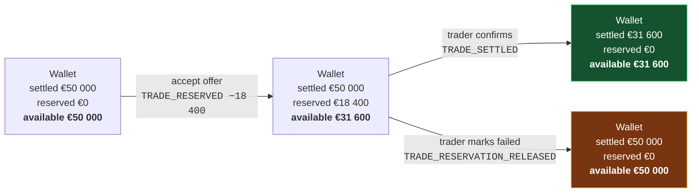

# F06 — Wallet & Ledger

**Portal:** both · **Priority:** Must · **Phase:** 2 · **Size:** L

---

## 1. Summary

Every customer **company** has one prepaid EUR wallet **[AS-02]**, shared by all of its accounts. It
funds trades, absorbs invoices, and is the single place a customer can answer "where did my money
go" — and, because every movement names the account that caused it, "who spent it". The ledger behind it is append-only:
entries are never edited or deleted, and each one records the balances that resulted from it.

The design problem is that a wallet has to express two different things at once — money that is
*there*, and money that is *spoken for*. Reservations sit between an accepted trade and its
confirmation, sometimes for hours. The customer must see them, must not be able to spend them twice,
and must get them back cleanly if the trade fails.

## 2. Balances

Three figures, one derived:

```
settledBalance    = Σ of all ledger entry settled deltas
reservedAmount    = Σ of all active reservations
availableBalance  = settledBalance − reservedAmount
```

| Balance | What it means | Where it appears |
| --- | --- | --- |
| **Settled** | Money actually in the wallet | Ledger running balance, statements |
| **Reserved** | Committed to accepted-but-unconfirmed trades | Wallet header, trade screens |
| **Available** | What can be committed right now | Everywhere a spending decision is made |

**Available balance is the number the customer cares about**, so it is the largest one on the screen.

## 3. Entry types

| Type | Direction | Settled Δ | Reserved Δ | Trigger | Links to |
| --- | --- | --- | --- | --- | --- |
| `DEPOSIT_IDEAL` | Credit | + | — | Payment provider webhook confirms | Payment |
| `DEPOSIT_BANK` | Credit | + | — | Finance registers a received transfer | Bank reference |
| `TRADE_RESERVED` | — | 0 | + | Customer accepts an offer | Trade |
| `TRADE_RESERVATION_RELEASED` | — | 0 | − | Trade marked failed | Trade |
| `TRADE_SETTLED` | Debit | − | − | Trader confirms a BUY | Trade, block |
| `TRADE_PROCEEDS` | Credit | + | — | Trader confirms a SELL | Trade |
| `INVOICE_DEBIT` | Debit | − | — | Invoice finalised | Invoice |
| `INVOICE_CREDIT` | Credit | + | — | Credit note issued | Credit note |
| `REFUND` | Debit | − | — | Money returned to the customer's bank | Refund request |
| `ADJUSTMENT` | Either | ± | — | Finance correction, mandatory reason | Reason + actor |
| `FEE` | Debit | − | — | Contractual fee, if any | Fee definition |

`TRADE_RESERVED` and `TRADE_RESERVATION_RELEASED` change only the reserved amount, so they appear in
the ledger with an unchanged settled balance and a changed available balance — which is exactly the
information the customer needs **[DEC-05]**.

## 4. Money movement through a trade



Note that the settled balance does not move at reservation time. Nothing has been paid yet.

## 5. Functional requirements

### Balances and integrity

| ID | Requirement | MoSCoW |
| --- | --- | :--: |
| F06-R01 | Every customer **company** has exactly one EUR wallet, created with the company and shared by all of its accounts **[F01-R05]**. | Must |
| F06-R02 | The wallet exposes settled, reserved and available balances. | Must |
| F06-R03 | Every balance change is a ledger entry. There is no code path that changes a balance without one. | Must |
| F06-R04 | Each entry stores: type, direction, amount, settled Δ, reserved Δ, resulting settled / reserved / available balances, timestamp, actor, description, and a typed link to the causing object. | Must |
| F06-R05 | For a customer-initiated movement the actor is the **customer account** — id and name, snapshotted **[DEC-17]**. The ledger shows *who* reserved or spent, not merely *which company*. | Must |
| F06-R06 | Entries are append-only. No update or delete, enforced by database permissions as well as by code. | Must |
| F06-R07 | Each entry has a monotonic per-wallet sequence number, assigned under the same lock as the balance update. | Must |
| F06-R08 | The materialised balance is updated in the same transaction as the entry **[DEC-04]**. | Must |
| F06-R09 | A scheduled reconciliation recomputes balances from the entry history and alerts on any mismatch. | Must |
| F06-R10 | `availableBalance` may not go below zero as a result of a customer action **[AS-11]**. | Must |
| F06-R11 | `settledBalance` may go below zero **only** via `INVOICE_DEBIT` **[OQ-19]**, and doing so raises an alert and blocks trading. | Must |

### Reservations

| ID | Requirement | MoSCoW |
| --- | --- | :--: |
| F06-R12 | A reservation is created atomically with a trade acceptance and references it. | Must |
| F06-R13 | A reservation has state `ACTIVE`, `SETTLED` or `RELEASED`; only `ACTIVE` reservations count toward the reserved amount. | Must |
| F06-R14 | Settling a reservation converts it into a settled debit for the same amount, in one transaction. | Must |
| F06-R15 | Releasing a reservation restores availability in full, in one transaction, and records the reason. | Must |
| F06-R16 | Reservations cannot be partially settled or partially released. | Must |
| F06-R17 | A wallet's active reservations are listed with their trade links and ages. | Must |

### Ledger view

| ID | Requirement | MoSCoW |
| --- | --- | :--: |
| F06-R18 | Both customer and employee can view the full ledger, newest first, paginated. | Must |
| F06-R19 | Each row shows: date/time, type (human-readable), description, direction, amount, resulting available balance, and — for customer-initiated movements — **the colleague who caused it**. | Must |
| F06-R20 | Each row links to the object that caused it — trade, invoice, payment, credit note. Clicking a reservation row opens that trade **(explicitly required by the brief)**. | Must |
| F06-R21 | The ledger can be filtered by date range, type, direction and **acting account**, and searched by description or linked reference. | Must |
| F06-R22 | The ledger can be exported to CSV and PDF for a chosen period. | Should |
| F06-R23 | A period statement shows opening balance, movements grouped by type, and closing balance. | Should |
| F06-R24 | Employees see the same ledger, plus the acting employee on manual entries. | Must |

### Employee operations

| ID | Requirement | MoSCoW |
| --- | --- | :--: |
| F06-R25 | Finance can register a manual bank deposit: amount, value date, bank reference, optional note. | Must |
| F06-R26 | Finance can post an `ADJUSTMENT` in either direction with a **mandatory** reason, shown to the customer. | Must |
| F06-R27 | Adjustments above a configurable threshold require a second approver. | Should |
| F06-R28 | Employees can see wallets ranked by lowest available balance, to spot customers heading for trouble. | Must |

## 6. Business rules

1. **The ledger is the truth; the balance is a cache.** Any disagreement is resolved in favour of the
   ledger, and the reconciliation job exists to find that disagreement before a human does.
2. **Reservations are not money.** They never touch the settled balance. This keeps the ledger's
   running balance reconcilable against the bank.
3. **Nothing is deleted.** A mistaken entry is corrected by a compensating entry that references it.
4. **Every entry names a cause and an actor.** No orphan movements, and no anonymous ones —
   a customer-initiated entry always names the account **[DEC-17]**. `ADJUSTMENT` requires prose.
5. **One currency.** EUR only; the schema carries a currency column so that stays true by
   construction.
6. **Reserved money is the customer's.** Until settlement it is still theirs; a failed trade returns
   it in full, immediately, with no netting of costs.
7. **Concurrency is handled by locking the wallet row**, not by optimistic retry. Money paths favour
   correctness over throughput.

## 7. Ledger presentation

The required format, as described in the brief:

| Date & time | Type | Description | By | Ref | Debit | Credit | Available after |
| --- | --- | --- | --- | --- | --: | --: | --: |
| 12-08-2026 09:14 | Deposit (iDEAL) | Top-up | J. de Vries | `PAY-2291` | | €25 000.00 | €50 000.00 |
| 12-08-2026 11:02 | Funds reserved | Peak Q4-26 · 1.0 MW | **M. Vandersteen** | **`TRD-1051`** | €18 400.00 | | €31 600.00 |
| 12-08-2026 11:47 | Trade confirmed | Peak Q4-26 · 1.0 MW | PeakPower | **`TRD-1051`** | €18 400.00 | | €31 600.00 |
| 31-08-2026 23:59 | Invoice | August 2026 | System | **`INV-2026-08-0042`** | €34 397.48 | | −€2 797.48 |
| 01-09-2026 08:30 | Deposit (bank) | Transfer `NL91…` | S. Willems (PeakPower) | `DEP-0118` | | €40 000.00 | €37 202.52 |

Reference cells in bold are links. The "Trade confirmed" row shows the reservation converting to a
settled debit: available is unchanged because the money was already committed, while the settled
balance drops.

## 8. Screens

| Screen | Mockup |
| --- | --- |
| Customer wallet & ledger | [`wallet-ledger.svg`](../60-mockups/wallet-ledger.svg) |
| Employee wallet administration | [`employee-wallet-admin.svg`](../60-mockups/employee-wallet-admin.svg) |

## 9. Data

| Entity | Purpose |
| --- | --- |
| `wallet` | customer_id (company), currency, settled_balance, reserved_amount, version |
| `wallet_entry` | Append-only ledger, with sequence, deltas, resulting balances, links |
| `wallet_reservation` | amount, state, trade_id, created/settled/released timestamps |
| `wallet_threshold_rule` | Minimum-balance rules, global and per customer — [F11](F11-notifications.md) |

## 10. Edge cases & failure modes

| Case | Behaviour |
| --- | --- |
| Two trades accepted simultaneously, together exceeding the balance | Wallet row lock serialises them; the second is refused |
| Invoice finalised while a reservation is active | Invoice debits the settled balance; available may go negative. Alert raised, trading blocked, customer notified |
| Reservation released after the wallet went negative | Release still applies; it can only improve availability |
| Deposit arrives while the wallet is negative | Applied normally; the alert clears when availability returns to positive |
| Duplicate payment webhook | Idempotent on the provider payment id; one entry only |
| Manual deposit entered twice by finance | Duplicate warning on matching amount + reference within 7 days; overridable with a note |
| Balance and ledger disagree | Reconciliation job raises a `LEDGER_MISMATCH` alert with both figures; no automatic repair |
| Customer closed with a positive balance | Refund flow; wallet frozen after settlement |
| Rounding | Entries are exact to 2 decimals; no fractional cents are ever created |

## 11. Out of scope

- Multiple wallets or sub-accounts per customer.
- Multi-currency.
- Interest on balances.
- Credit limits or overdraft facilities **[AS-11]**.
- Direct debit collection.

## 12. Dependencies

| Depends on | Why |
| --- | --- |
| [F05](F05-energy-block-trading.md) | Reserve / settle / release |
| [F07](F07-wallet-topup-and-payments.md) | Deposits |
| [F10](F10-invoicing-and-settlement.md) | Invoice debits and credits |
| [F11](F11-notifications.md) | Low-balance alerts |

## 13. Open questions

| Ref | Question |
| --- | --- |
| [OQ-17] | Are wallet amounts VAT-inclusive or exclusive? |
| [OQ-19] | Full debit into negative, or partial settlement, when a wallet cannot cover an invoice? |
| [OQ-30] | Is a refund of surplus balance to the customer's bank in scope, and who approves it? |
| [OQ-31] | Must wallet funds be held in a segregated client account, and does that carry regulatory obligations? |
