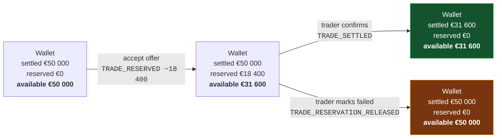

# F06 — Wallet & Ledger

**Portal:** both · **Priority:** Must · **Phase:** 2 · **Size:** L

---

## 1. Summary

Every customer **company** has one prepaid EUR wallet **[AS-02]**, shared by all of its accounts. It
funds trades, absorbs invoices, and is the single place a customer can answer "where did my money
go" — and, because every movement names the account that caused it, "who spent it". The ledger behind it is append-only:
entries are never edited or deleted, and each one records the balances that resulted from it.

The design problem is that a wallet has to express two different things at once — money that is
*there*, and money that is *spoken for*. Reservations sit between an accepted trade and its
confirmation, sometimes for hours. The customer must see them, must not be able to spend them twice,
and must get them back cleanly if the trade fails.

> **Client money — [DEC-28].** The segregated-client-account question is **deferred**. This is a
> **go-live gate, not a build gate**: the wallet is built now but exercised with **test money only**,
> and the PoC must not hold real customer funds. Risk [R-05](../70-delivery/02-risks.md) stays open
> on the register and must be answered before any real deposit is accepted, because an adverse answer
> may imply a licence application with its own lead time **[OQ-31]**.

> **Money is one-way — [DEC-43].** **There is no refund payout path.** Surplus balance stays in the
> wallet and is spent on future trades and invoices. This closes [OQ-30] and removes three things
> outright: the refund flow, the question of who approves a refund, and the choice between refunding
> through the payment provider or by manual transfer. `availableBalance` therefore only ever leaves
> the wallet through a trade, an invoice or a finance `ADJUSTMENT` **[F06-R29]**.
>
> ⚠ **Offboarding is now a known gap, not an open question.** A customer closing their account with a
> positive balance **has no route for their money**. **[DEC-43]** does not provide one and nothing else
> in this set does either. It interacts with **[OQ-29]** — what happens to a customer's blocks when
> their contract ends mid-period — because both are parts of an offboarding process that does not yet
> exist. This must be answered before a real customer is offboarded, and holding someone's money with
> no way to return it is the kind of gap that becomes a legal question rather than a product one.
> Recorded plainly here so it is not mistaken for something the refund flow used to cover.

## 2. Balances

Three figures, one derived:

```
settledBalance    = Σ of all ledger entry settled deltas
reservedAmount    = Σ of all active reservations
availableBalance  = settledBalance − reservedAmount
```

| Balance | What it means | Where it appears |
| --- | --- | --- |
| **Settled** | Money actually in the wallet | Ledger running balance, statements |
| **Reserved** | Committed to accepted-but-unconfirmed trades | Wallet header, trade screens |
| **Available** | What can be committed right now | Everywhere a spending decision is made |

**Available balance is the number the customer cares about**, so it is the largest one on the screen.

All three figures are **VAT-exclusive [DEC-26]**. VAT is added at invoice level, never carried in the
wallet.

## 3. Entry types

| Type | Direction | Settled Δ | Reserved Δ | Trigger | Links to |
| --- | --- | --- | --- | --- | --- |
| `DEPOSIT_IDEAL` | Credit | + | — | Payment provider webhook confirms | Payment |
| `DEPOSIT_BANK` | Credit | + | — | Finance registers a received transfer | Bank reference |
| `TRADE_RESERVED` | — | 0 | + | Customer accepts an offer | Trade |
| `TRADE_RESERVATION_RELEASED` | — | 0 | − | Trade marked failed | Trade |
| `TRADE_SETTLED` | Debit | − | − | Trader confirms a BUY | Trade, block |
| `TRADE_PROCEEDS` | Credit | + | — | Trader confirms a SELL | Trade |
| `INVOICE_DEBIT` | Debit | − | — | Invoice finalised | Invoice |
| `INVOICE_CREDIT` | Credit | + | — | Credit note issued | Credit note |
| ~~`REFUND`~~ | ~~Debit~~ | ~~−~~ | — | **Not implemented [DEC-43]** — there is no refund payout path and no refund request to trigger it. The type is kept in the enumeration, unused, so the ledger's type list does not have to be renumbered if a payout path is ever specified | — |
| `ADJUSTMENT` | Either | ± | — | Finance correction, mandatory reason | Reason + actor |
| `FEE` | Debit | − | — | Contractual fee, if any | Fee definition |

`TRADE_RESERVED` and `TRADE_RESERVATION_RELEASED` change only the reserved amount, so they appear in
the ledger with an unchanged settled balance and a changed available balance — which is exactly the
information the customer needs **[DEC-05]**.

### VAT and the amounts in this table

**[DEC-26]** makes every price, balance and reservation VAT-exclusive and confirms **[AS-10]**: a
reservation is the trade value ex-VAT. Two sub-questions remain **open**, and both move money:

| # | Open sub-question | Exposure |
| --- | --- | --- |
| **(a)** | The VAT **rate per line category**, plus any exemption or reverse-charge case. 21% NL standard is *assumed* until confirmed | Wrong rate, wrong invoice total, wrong debit |
| **(b)** | Whether `INVOICE_DEBIT` settles the VAT-**exclusive** subtotal or the VAT-**inclusive** total | If inclusive, a reservation sized ex-VAT **under-covers the eventual debit by the VAT rate** — precisely the exposure [AS-10] was flagged for |

Both must be resolved **before wallet settlement is built** **[OQ-17]**. Until (b) is answered, the
amount carried by `INVOICE_DEBIT` is undetermined and is not to be assumed either way in code.

## 4. Money movement through a trade



Note that the settled balance does not move at reservation time. Nothing has been paid yet.

## 5. Functional requirements

### Balances and integrity

| ID | Requirement | MoSCoW |
| --- | --- | :--: |
| F06-R01 | Every customer **company** has exactly one EUR wallet, created with the company and shared by all of its accounts **[F01-R05]**. | Must |
| F06-R02 | The wallet exposes settled, reserved and available balances. All three are **VAT-exclusive**; VAT is added at invoice level **[DEC-26]**. | Must |
| F06-R03 | Every balance change is a ledger entry. There is no code path that changes a balance without one. | Must |
| F06-R04 | Each entry stores: type, direction, amount, settled Δ, reserved Δ, resulting settled / reserved / available balances, timestamp, actor, description, and a typed link to the causing object. | Must |
| F06-R05 | For a customer-initiated movement the actor is the **customer account** — id and name, snapshotted **[DEC-17]**. The ledger shows *who* reserved or spent, not merely *which company*. | Must |
| F06-R06 | Entries are append-only. No update or delete, enforced by database permissions as well as by code. | Must |
| F06-R07 | Each entry has a monotonic per-wallet sequence number, assigned under the same lock as the balance update. | Must |
| F06-R08 | The materialised balance is updated in the same transaction as the entry **[DEC-04]**. | Must |
| F06-R09 | A scheduled reconciliation recomputes balances from the entry history and alerts on any mismatch. | Must |
| F06-R10 | `availableBalance` may not go below zero as a result of a customer action **[AS-11]**. | Must |
| F06-R11 | `settledBalance` may go below zero **only** via `INVOICE_DEBIT` **[OQ-19]**, and doing so raises an alert and blocks trading. | Must |

### Reservations

| ID | Requirement | MoSCoW |
| --- | --- | :--: |
| F06-R12 | A reservation is created atomically with a trade acceptance and references it. Its amount is the full trade value **excluding VAT** **[AS-10]**, **[DEC-26]**. | Must |
| F06-R13 | A reservation has state `ACTIVE`, `SETTLED` or `RELEASED`; only `ACTIVE` reservations count toward the reserved amount. | Must |
| F06-R14 | Settling a reservation converts it into a settled debit for the same amount, in one transaction. | Must |
| F06-R15 | Releasing a reservation restores availability in full, in one transaction, and records the reason. | Must |
| F06-R16 | Reservations cannot be partially settled or partially released. | Must |
| F06-R17 | A wallet's active reservations are listed with their trade links and ages. | Must |

### Ledger view

| ID | Requirement | MoSCoW |
| --- | --- | :--: |
| F06-R18 | Both customer and employee can view the full ledger, newest first, paginated. | Must |
| F06-R19 | Each row shows: date/time, type (human-readable), description, direction, amount, resulting available balance, and — for customer-initiated movements — **the colleague who caused it**. | Must |
| F06-R20 | Each row links to the object that caused it — trade, invoice, payment, credit note. Clicking a reservation row opens that trade **(explicitly required by the brief)**. | Must |
| F06-R21 | The ledger can be filtered by date range, type, direction and **acting account**, and searched by description or linked reference. | Must |
| F06-R22 | The ledger can be exported to CSV and PDF for a chosen period. | Should |
| F06-R23 | A period statement shows opening balance, movements grouped by type, and closing balance. | Should |
| F06-R24 | Employees see the same ledger, plus the acting employee on manual entries. | Must |

### Employee operations

| ID | Requirement | MoSCoW |
| --- | --- | :--: |
| F06-R25 | Finance can register a manual bank deposit: amount, value date, bank reference, optional note. Matching a received transfer to a wallet is specified in **[F07-R21]** — by wallet reference, and failing that by the customer's registered IBAN **[DEC-61]**. | Must |
| F06-R26 | Finance can post an `ADJUSTMENT` in either direction with a **mandatory** reason, shown to the customer. | Must |
| F06-R27 | Adjustments above a configurable threshold require a second approver. | Should |
| F06-R28 | Employees can see wallets ranked by lowest available balance, to spot customers heading for trouble. | Must |
| F06-R29 | **No code path moves money out of a wallet to a bank account** **[DEC-43]**. There is no refund endpoint, no refund job and no employee screen that initiates one; the `REFUND` entry type exists in the enumeration but has no writer. Money leaves a wallet only as `TRADE_SETTLED`, `INVOICE_DEBIT`, `FEE` or a finance `ADJUSTMENT`, all of which stay inside the platform. ⚠ An `ADJUSTMENT` is **not** a refund route: it can zero a balance in the ledger but it cannot pay anyone, so using it to "refund" a customer records a movement that did not happen. | Must |

## 6. Business rules

1. **The ledger is the truth; the balance is a cache.** Any disagreement is resolved in favour of the
   ledger, and the reconciliation job exists to find that disagreement before a human does.
2. **Reservations are not money.** They never touch the settled balance. This keeps the ledger's
   running balance reconcilable against the bank.
3. **Nothing is deleted.** A mistaken entry is corrected by a compensating entry that references it.
4. **Every entry names a cause and an actor.** No orphan movements, and no anonymous ones —
   a customer-initiated entry always names the account **[DEC-17]**. `ADJUSTMENT` requires prose.
5. **One currency.** EUR only; the schema carries a currency column so that stays true by
   construction.
6. **Reserved money is the customer's.** Until settlement it is still theirs; a failed trade returns
   it in full, immediately, with no netting of costs.
7. **Concurrency is handled by locking the wallet row**, not by optimistic retry. Money paths favour
   correctness over throughput.
8. **One tax basis.** Every amount in the wallet is VAT-exclusive **[DEC-26]**. No entry type mixes
   bases, and no screen puts a wallet figure beside a VAT-inclusive one without saying which is
   which.
9. **Test money until the client-money question is answered [DEC-28].** The wallet may be exercised
   end to end, but the PoC holds no real customer funds. This is a deployment gate, checked before
   go-live, not a constraint on what is built.
10. **Money in the wallet stays in the wallet [DEC-43].** Deposits are one-way. There is no payout
    path, so the only way a balance falls is by being spent on a trade, an invoice or a fee
    **[F06-R29]**. ⚠ The corollary is the offboarding gap in §1: a closing customer's surplus has
    nowhere to go, and no rule in this document creates one.

## 7. Ledger presentation

The required format, as described in the brief:

| Date & time | Type | Description | By | Ref | Debit | Credit | Available after |
| --- | --- | --- | --- | --- | --: | --: | --: |
| 12-08-2026 09:14 | Deposit (iDEAL) | Top-up | J. de Vries | `PAY-2291` | | €25 000.00 | €50 000.00 |
| 12-08-2026 11:02 | Funds reserved | Peak Q4-26 · 1.0 MW | **M. Vandersteen** | **`TRD-1051`** | €18 400.00 | | €31 600.00 |
| 12-08-2026 11:47 | Trade confirmed | Peak Q4-26 · 1.0 MW | PeakPower | **`TRD-1051`** | €18 400.00 | | €31 600.00 |
| 31-08-2026 23:59 | Invoice | August 2026 | System | **`INV-2026-08-0042`** | €34 397.48 | | −€2 797.48 |
| 01-09-2026 08:30 | Deposit (bank) | Transfer `NL91…` | S. Willems (PeakPower) | `DEP-0118` | | €40 000.00 | €37 202.52 |

Reference cells in bold are links. The "Trade confirmed" row shows the reservation converting to a
settled debit: available is unchanged because the money was already committed, while the settled
balance drops.

## 8. Screens

| Screen | Mockup |
| --- | --- |
| Customer wallet & ledger | [`wallet-ledger.svg`](../60-mockups/wallet-ledger.svg) |
| Employee wallet administration | [`employee-wallet-admin.svg`](../60-mockups/employee-wallet-admin.svg) |

## 9. Data

| Entity | Purpose |
| --- | --- |
| `wallet` | customer_id (company), currency, settled_balance, reserved_amount, version |
| `wallet_entry` | Append-only ledger, with sequence, deltas, resulting balances, links |
| `wallet_reservation` | amount, state, trade_id, created/settled/released timestamps |
| `wallet_threshold_rule` | Minimum-balance rules, global and per customer — **fixed EUR amounts, never derived from trading volume [DEC-49]** — [F11](F11-notifications.md) |

## 10. Edge cases & failure modes

| Case | Behaviour |
| --- | --- |
| Two trades accepted simultaneously, together exceeding the balance | Wallet row lock serialises them; the second is refused |
| Invoice finalised while a reservation is active | Invoice debits the settled balance; available may go negative. Alert raised, trading blocked, customer notified |
| Reservation released after the wallet went negative | Release still applies; it can only improve availability |
| Deposit arrives while the wallet is negative | Applied normally; the alert clears when availability returns to positive |
| Duplicate payment webhook | Idempotent on the provider payment id; one entry only |
| Manual deposit entered twice by finance | Duplicate warning on matching amount + reference within 7 days; overridable with a note |
| Balance and ledger disagree | Reconciliation job raises a `LEDGER_MISMATCH` alert with both figures; no automatic repair |
| **Customer closed with a positive balance** | **No defined route for the money — a known gap [DEC-43].** The wallet is frozen after the final invoice settles and the balance simply remains. There is no refund flow to invoke **[F06-R29]**, and an `ADJUSTMENT` writing the balance down would record a payment nobody made. Escalate to finance and legal; this needs an answer before the first offboarding, alongside **[OQ-29]** |
| Rounding | Entries are exact to 2 decimals; no fractional cents are ever created |
| Reservation sized ex-VAT meets a VAT-inclusive invoice debit | **Undetermined — [DEC-26] (b)**. If the debit carries the inclusive total, the reservation under-covers it by the VAT rate and the shortfall lands on the available balance. Do not implement either behaviour until [OQ-83] is answered |

## 11. Out of scope

- Multiple wallets or sub-accounts per customer.
- Multi-currency.
- Interest on balances.
- Credit limits or overdraft facilities **[AS-11]**.
- Direct debit collection.
- **Refund payouts of any kind** **[DEC-43]** — no provider refund, no manual transfer, no approval
  flow. ⚠ Out of scope by decision, but the offboarding case it leaves behind is **not** resolved —
  see §1.
- **Holding real customer money** — deferred to a go-live gate **[DEC-28]**; test money only for now.
- VAT inside the wallet **[DEC-26]** — it belongs to the invoice.

## 12. Dependencies

| Depends on | Why |
| --- | --- |
| [F05](F05-energy-block-trading.md) | Reserve / settle / release |
| [F07](F07-wallet-topup-and-payments.md) | Deposits |
| [F10](F10-invoicing-and-settlement.md) | Invoice debits and credits |
| [F11](F11-notifications.md) | Low-balance alerts |

## 13. Open questions

| Ref | Question |
| --- | --- |
| [OQ-17] | **Partly closed by [DEC-26]** — wallet amounts are VAT-**exclusive**. Still open: **(a)** the rate per line category plus exemptions and reverse charge, 21% NL standard assumed; **(b)** whether `INVOICE_DEBIT` settles the VAT-exclusive subtotal or the VAT-inclusive total. Resolve both before wallet settlement is built |
| [OQ-19] | Full debit into negative, or partial settlement, when a wallet cannot cover an invoice? |
| ~~[OQ-30]~~ | ~~Is a refund of surplus balance to the customer's bank in scope, and who approves it?~~ **Closed by [DEC-43]** — no refund payout path exists; surplus stays in the wallet **[F06-R29]**. ⚠ **This closes the question and leaves a gap**: offboarding a customer with a positive balance has no route for the money. Known gap, not an open question, and it interacts with **[OQ-29]** — see §1 |
| [OQ-31] | Must wallet funds be held in a segregated client account, and does that carry regulatory obligations? **Deferred by [DEC-28]** — a go-live gate, not a build gate. [R-05] stays open |
