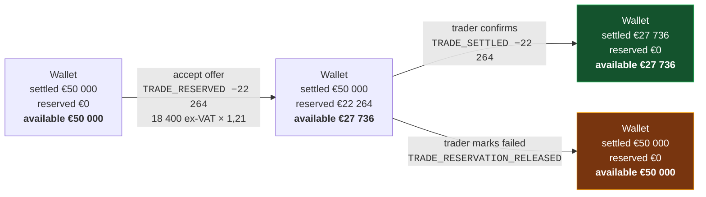
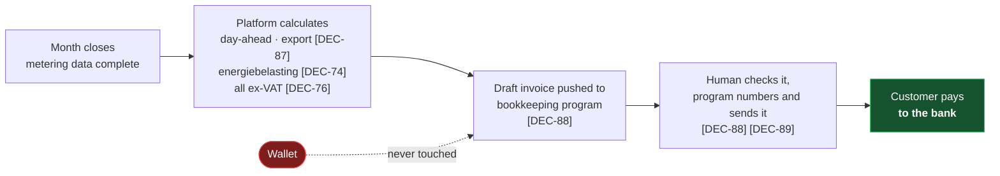
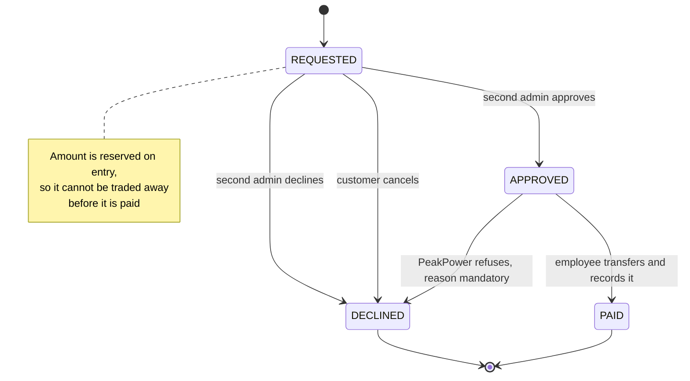

# F06 — Wallet & Ledger

**Portal:** both · **Priority:** Must · **Phase:** 2 · **Size:** L

---

## 1. Summary

Every customer **company** has one prepaid EUR wallet **[AS-02]**, shared by all of its accounts. It
funds trades, absorbs invoices, and is the single place a customer can answer "where did my money
go" — and, because every movement names the account that caused it, "who spent it". The ledger behind it is append-only:
entries are never edited or deleted, and each one records the balances that resulted from it.

⚠ **Amended 2026-08-19 by [DEC-77] — "absorbs invoices" is no longer true.** The wallet **funds
trading only**. There are two money paths and they do not meet:

| Path | What moves | Where it settles |
| --- | --- | --- |
| **Trading** | Reservation when an offer is accepted, debit when the trade is executed, proceeds when a sell is confirmed | Entirely inside the wallet |
| **Delivery** — day-ahead, export **[DEC-87]**, energiebelasting **[DEC-74]** | The monthly calculated amount per customer | Pushed to the bookkeeping program as a **draft invoice [DEC-88]** and paid to the bank. It never touches the wallet |

Why the separation is worth its cost: a customer can only trade within their balance **[DEC-41]**, so
if the wallet is never asked to cover a debt it can never go negative, and **[AS-11]** (no credit)
holds by construction rather than by an alert. What it costs is that the platform loses sight of
whether a delivery invoice was actually **paid** — receivables, dunning and payment matching for
invoices live entirely in the bookkeeping program **[DEC-88]**, **[DEC-105]**, **[DEC-109]**. The
platform can therefore show a customer with a healthy wallet and an unpaid invoice, and will not know.

The design problem is that a wallet has to express two different things at once — money that is
*there*, and money that is *spoken for*. Reservations sit between an accepted trade and its
confirmation, sometimes for hours. The customer must see them, must not be able to spend them twice,
and must get them back cleanly if the trade fails. Withdrawals **[DEC-83]** use the same mechanism:
requested money is spoken for before anyone at PeakPower has moved it.

> **Client money — [DEC-28].** The segregated-client-account question is **deferred**. This is a
> **go-live gate, not a build gate**: the wallet is built now but exercised with **test money only**,
> and the PoC must not hold real customer funds. Risk [R-05](../70-delivery/02-risks.md) stays open
> on the register and must be answered before any real deposit is accepted, because an adverse answer
> may imply a licence application with its own lead time **[OQ-31]**.
>
> Confirmed 2026-08-19 ([OQ-31] comment): *"Ideally we want to have a third party account. For now
> just use same bank account."* The deferral stands and now has a stated intent — a third-party
> account is wanted, it is simply not built yet. **[DEC-83]** makes this sharper, not softer: money
> now flows **out** of the wallet to a customer's bank as well as in, so the account the payout is
> made from is the same undifferentiated PeakPower account **[DEC-61]**.

> **Money is one-way — [DEC-43].** **There is no refund payout path.** Surplus balance stays in the
> wallet and is spent on future trades and invoices. This closes [OQ-30] and removes three things
> outright: the refund flow, the question of who approves a refund, and the choice between refunding
> through the payment provider or by manual transfer. `availableBalance` therefore only ever leaves
> the wallet through a trade, an invoice or a finance `ADJUSTMENT` **[F06-R29]**.
>
> ⚠ **Reversed 2026-08-19 by [DEC-83].** Money is **not** one-way. A customer raises a withdrawal
> request in the portal, PeakPower is notified, and an **employee pays it out manually** by bank
> transfer to the company bank account on the customer record **[DEC-61]**. The platform records
> three things — the request, the approval and the debit — and performs none of the payment. Under
> **[DEC-71]** the request needs a **second admin's approval** when four-eyes is on for that company.
> **No invoice is raised for a deposit or a withdrawal** **[DEC-106]**; the bookkeeping program sees
> both through its bank feed **[DEC-109]**.
>
> The three things DEC-43 removed come back in a cheaper form: the flow is manual (no provider payout
> integration), the approver is the second admin under four-eyes (not a new role), and the
> provider-versus-manual-transfer choice is settled as **manual transfer**. What it costs is an
> operational commitment — a payout only happens when a human does it, so the turnaround is a working
> day, not a webhook.
>
> ~~⚠ **Offboarding is now a known gap, not an open question.** A customer closing their account with a~~
> ~~positive balance **has no route for their money**. **[DEC-43]** does not provide one and nothing else~~
> ~~in this set does either.~~ ⚠ **Resolved 2026-08-19 by [DEC-83]** — the route is a withdrawal
> request. The interacting half, **[OQ-29]** (what happens to a customer's blocks when their contract
> ends mid-period), is **closed by [DEC-82]**: a block runs to the end of its delivery period whatever
> happens to the contract, and with no metering data the entire block volume is surplus and is sold at
> the day-ahead price **[DEC-23]**. Offboarding is therefore: let the blocks run out, let the final
> delivery invoices settle in the bookkeeping program, withdraw what is left. No part of it is
> undefined any more, and none of it needs an `ADJUSTMENT` to fake a payment.

## 2. Balances

Three figures, one derived:

```
settledBalance    = Σ of all ledger entry settled deltas
reservedAmount    = Σ of all active reservations
availableBalance  = settledBalance − reservedAmount
```

| Balance | What it means | Where it appears |
| --- | --- | --- |
| **Settled** | Money actually in the wallet | Ledger running balance, statements |
| **Reserved** | Committed to accepted-but-unconfirmed trades, and to requested-but-unpaid withdrawals **[DEC-83]** | Wallet header, trade screens |
| **Available** | What can be committed right now | Everywhere a spending decision is made |

**Available balance is the number the customer cares about**, so it is the largest one on the screen.

All three figures are **VAT-exclusive [DEC-26]**. VAT is added at invoice level, never carried in the
wallet.

⚠ **Amended 2026-08-19 by [DEC-78], [DEC-76] and [DEC-77].** Both halves of that sentence have moved:

| Was | Is |
| --- | --- |
| The balances are VAT-exclusive | The balances are **money**, and money has no tax basis. What is stored ex-VAT is the **price** **[DEC-26]**, confirmed by **[DEC-76]**. The amount a trade reserves and debits is the **VAT-inclusive** settlement amount **[DEC-78]** |
| VAT is added at invoice level | The platform computes **no VAT at all** **[DEC-76]** — it pushes ex-VAT amounts against a ledger account and the bookkeeping program applies that account's rate. And the invoice no longer touches the wallet **[DEC-77]** |

The one place the wallet meets VAT is the gross-up on a trade, at the **[DEC-64]** reference rate of
21% — see [§3 VAT and the amounts in this table](#vat-and-the-amounts-in-this-table).

## 3. Entry types

| Type | Direction | Settled Δ | Reserved Δ | Trigger | Links to |
| --- | --- | --- | --- | --- | --- |
| `DEPOSIT_IDEAL` | Credit | + | — | Payment provider webhook confirms | Payment |
| `DEPOSIT_BANK` | Credit | + | — | ⚠ **Amended 2026-08-19 by [DEC-106]** — was "finance registers a received transfer". The platform matches the incoming transfer on the **unique payment reference it issued** for the deposit intent, credits the wallet and emails the customer. Registered-IBAN matching **[DEC-61]** is the fallback, and manual registration by finance **[F06-R25]** is the fallback to that | Deposit intent, payment reference, bank reference |
| `TRADE_RESERVED` | — | 0 | + | Customer accepts an offer. Amount is **VAT-inclusive [DEC-78]** | Trade |
| `TRADE_RESERVATION_RELEASED` | — | 0 | − | Trade marked failed | Trade |
| `TRADE_SETTLED` | Debit | − | − | Trader confirms a BUY. Amount is **VAT-inclusive [DEC-78]** | Trade, block |
| `TRADE_PROCEEDS` | Credit | + | — | Trader confirms a SELL. Amount is **VAT-inclusive [DEC-78]** | Trade |
| ~~`INVOICE_DEBIT`~~ | ~~Debit~~ | ~~−~~ | — | ⚠ **Removed 2026-08-19 by [DEC-77]** — the wallet funds trading only. The monthly delivery amount (day-ahead, export, energiebelasting) is pushed to the bookkeeping program as a **draft invoice [DEC-88]** and **paid to the bank**; it never reaches the ledger. Nothing replaces this type inside the wallet, and no writer for it may be built | ~~Invoice~~ |
| ~~`INVOICE_CREDIT`~~ | ~~Credit~~ | ~~+~~ | — | ⚠ **Removed 2026-08-19 by [DEC-77]**, consequentially: an invoice that never debited the wallet cannot be credited back to it. A credit note is raised, numbered and settled in the bookkeeping program **[DEC-88]**, **[DEC-89]**, against the bank | ~~Credit note~~ |
| ~~`REFUND`~~ | ~~Debit~~ | ~~−~~ | — | **Not implemented [DEC-43]** — there is no refund payout path and no refund request to trigger it. The type is kept in the enumeration, unused, so the ledger's type list does not have to be renumbered if a payout path is ever specified. ⚠ **Amended 2026-08-19 by [DEC-83]:** a payout path now exists, but it is a **withdrawal**, not the refund of a payment. `REFUND` stays unused; the `WITHDRAWAL_*` types below carry the movement, because a withdrawal is not tied to an inbound payment and must not be modelled as reversing one | — |
| `WITHDRAWAL_REQUESTED` | — | 0 | + | Customer **admin** requests a withdrawal **[DEC-83]**. Reserves the amount on the same mechanism as a trade **[DEC-05]**, so it cannot be traded away before it is paid | Withdrawal request |
| `WITHDRAWAL_RELEASED` | — | 0 | − | The request is declined — by the second admin under four-eyes **[DEC-71]**, by PeakPower, or withdrawn by the customer. Returns the amount to available in full | Withdrawal request, reason |
| `WITHDRAWAL_PAID` | Debit | − | − | An employee records the manual bank transfer they have made **[DEC-83]** | Withdrawal request, bank account, employee |
| ~~`ADJUSTMENT`~~ | ~~Either~~ | ~~±~~ | — | ⚠ **Removed 2026-08-19 by [DEC-85]** — chargebacks and reversals are handled in the bookkeeping program, and the manual-adjustment-with-a-reason path goes with them. ⚠ **What this costs, recorded rather than glossed:** a charged-back iDEAL deposit takes money out of the bank but the platform has **no entry type left** to take it out of the wallet, so the balance overstates until someone decides otherwise. Reinstating an adjustment type is a decision, not an oversight | ~~Reason + actor~~ |
| `FEE` | Debit | − | — | Contractual fee, if any | Fee definition |

`TRADE_RESERVED`, `TRADE_RESERVATION_RELEASED`, `WITHDRAWAL_REQUESTED` and `WITHDRAWAL_RELEASED`
change only the reserved amount, so they appear in the ledger with an unchanged settled balance and a
changed available balance — which is exactly the information the customer needs **[DEC-05]**.

Every movement above is handled **individually**: nothing is netted against anything else, batched
into a periodic sweep, or waived because it is small. There is no materiality threshold **[DEC-100]**,
**[F06-R40]**.

### VAT and the amounts in this table

**[DEC-26]** makes every price, balance and reservation VAT-exclusive and confirms **[AS-10]**: a
reservation is the trade value ex-VAT. Two sub-questions remain **open**, and both move money:

| # | Open sub-question | Exposure |
| --- | --- | --- |
| **(a)** | The VAT **rate per line category**, plus any exemption or reverse-charge case. 21% NL standard is *assumed* until confirmed | Wrong rate, wrong invoice total, wrong debit |
| **(b)** | Whether `INVOICE_DEBIT` settles the VAT-**exclusive** subtotal or the VAT-**inclusive** total | If inclusive, a reservation sized ex-VAT **under-covers the eventual debit by the VAT rate** — precisely the exposure [AS-10] was flagged for |

~~Both must be resolved **before wallet settlement is built** **[OQ-17]**. Until (b) is answered, the~~
~~amount carried by `INVOICE_DEBIT` is undetermined and is not to be assumed either way in code.~~

⚠ **Both closed 2026-08-19.** (a) was closed by **[DEC-64]** at 21% on every line and is now
superseded as a *platform behaviour* by **[DEC-76]** — the platform computes no VAT, so it has no rate
to get wrong; 21% survives only as the reference rate the gross-up below uses. (b) disappears with its
subject: `INVOICE_DEBIT` is removed **[DEC-77]**, so there is no invoice debit to size. What replaced
the question is a narrower and firmer rule.

**The rule now — [DEC-78].** Three statements that have to be read together, because each one alone is
misleading:

| Layer | Basis | Decision |
| --- | --- | --- |
| Price quoted, stored and pushed | **ex-VAT** | **[DEC-26]**, confirmed by **[DEC-76]** |
| VAT calculation | **none, in this platform** — the bookkeeping program applies the rate of the ledger account it is pushed against | **[DEC-76]** |
| Trade reservation and its settling debit | **VAT-inclusive**, grossed up at the **[DEC-64]** 21% reference rate | **[DEC-78]** |

```
reservationAmount = round(volumeMWh * priceExVat * 1.21, 2)
tradeDebitAmount  = reservationAmount        // identical, by [F06-R14]
```

⚠ **This amends [AS-10]**, which said the reservation is the full trade value *excluding* VAT, and it
amends the sizing rule under **[DEC-41]**. The reason it has to change: the settlement of a hedge is
inclusive of VAT (the source for **[DEC-78]** is explicit — *"The settlement is incl. VAT and only
applicable for the hedges"*), so a reservation sized ex-VAT would under-cover its own debit by exactly
21%, and **[DEC-41]** deliberately leaves no buffer to absorb the difference. Grossing up at
reservation time is the cheapest place to fix it: one multiplication, applied consistently at the
pre-trade check **[F05-R52]**, at reservation and at settlement, so the three numbers are the same
number.

What it costs: the customer's available balance falls by 21% more than the price they were quoted, and
the price board **[F04](F04-price-indications.md)** shows ex-VAT figures **[DEC-26]** while the wallet
moves inclusive ones. Every screen that puts the two side by side must say which basis it is showing
**[§6 rule 8](#6-business-rules)**.

Also from **[DEC-78]**, recorded as the commercial position rather than as a wallet rule: once the
delivery month starts *"the hedge is there and cannot be changed"* — an executed block is not
cancellable, so a `TRADE_SETTLED` debit is never reversed by a later cancellation.

## 4. Money movement through a trade

**A trade is the only thing that spends wallet money on delivery — and it spends it on the hedge, not
on the energy.** The block bought here is settled from the wallet **[DEC-77]**; the energy delivered
against it in the months that follow is invoiced separately, pushed to the bookkeeping program as a
draft **[DEC-88]** and paid to the bank. Nothing in the diagram below is ever repeated at invoice time.

Worked example: 1,0 MW Peak Q4-26 at a trade value of **€18 400,00 ex-VAT**. The reservation and the
debit are grossed up at 21% **[DEC-78]**, **[DEC-64]**:

```
18 400.00 * 1.21 = 22 264.00
50 000.00 - 22 264.00 = 27 736.00
```



Note that the settled balance does not move at reservation time. Nothing has been paid yet.

**Where the delivery money goes instead — [DEC-77].** The wallet is not in this path at all:



## 4a. Money movement out of the wallet — withdrawal

**[DEC-83]** reverses **[DEC-43]**: a payout path exists, and it is manual end to end. The platform
records the request, the approval and the debit; a human makes the payment.



| Transition | Ledger entry | Settled Δ | Reserved Δ | Who |
| --- | --- | :--: | :--: | --- |
| → `REQUESTED` | `WITHDRAWAL_REQUESTED` | 0 | + | Customer **admin** account **[DEC-71]**, **[DEC-17]** |
| `REQUESTED` → `APPROVED` | none — the approval is an audit record, not a movement | 0 | 0 | A **different** admin of the same company when four-eyes is on **[DEC-71]**; when it is off the request enters `APPROVED` on submission with the requester as the only actor |
| → `DECLINED` | `WITHDRAWAL_RELEASED` | 0 | − | Second admin, the customer, or a PeakPower employee — reason mandatory |
| `APPROVED` → `PAID` | `WITHDRAWAL_PAID` | − | − | PeakPower employee, after the bank transfer has actually been made **[DEC-83]** |

Worked example, continuing from **€27 736,00** settled after the trade above: the customer requests
**€10 000,00**.

| Step | Entry | Settled | Reserved | Available |
| --- | --- | --: | --: | --: |
| After the trade settles | — | €27 736,00 | €0,00 | €27 736,00 |
| Customer admin requests €10 000 | `WITHDRAWAL_REQUESTED` | €27 736,00 | €10 000,00 | €17 736,00 |
| Second admin approves **[DEC-71]** | — (approval is audit, not a movement) | €27 736,00 | €10 000,00 | €17 736,00 |
| Employee transfers and records it | `WITHDRAWAL_PAID` | €17 736,00 | €0,00 | €17 736,00 |

Had the second admin declined instead, `WITHDRAWAL_RELEASED` returns the reserved €10 000,00 and the
wallet is back to €27 736,00 available, with the decline reason on the ledger row.

**No invoice is raised for a deposit or for a withdrawal [DEC-106].** Neither is pushed to the
bookkeeping program either — it learns about both from its bank feed **[DEC-109]**.

## 5. Functional requirements

### Balances and integrity

| ID | Requirement | MoSCoW |
| --- | --- | :--: |
| F06-R01 | Every customer **company** has exactly one EUR wallet, created with the company and shared by all of its accounts **[F01-R05]**. | Must |
| F06-R02 | The wallet exposes settled, reserved and available balances. ~~All three are **VAT-exclusive**; VAT is added at invoice level **[DEC-26]**.~~ ⚠ **Amended 2026-08-19 by [DEC-78], [DEC-76], [DEC-77]**: the balances are money, not a tax basis. Prices remain stored ex-VAT **[DEC-26]**, the platform computes no VAT **[DEC-76]**, and the amounts that move for a trade are **VAT-inclusive** **[F06-R32]**. Nothing is "added at invoice level" here, because the invoice never touches the wallet. | Must |
| F06-R03 | Every balance change is a ledger entry. There is no code path that changes a balance without one. | Must |
| F06-R04 | Each entry stores: type, direction, amount, settled Δ, reserved Δ, resulting settled / reserved / available balances, timestamp, actor, description, and a typed link to the causing object. | Must |
| F06-R05 | For a customer-initiated movement the actor is the **customer account** — id and name, snapshotted **[DEC-17]**. The ledger shows *who* reserved or spent, not merely *which company*. | Must |
| F06-R06 | Entries are append-only. No update or delete, enforced by database permissions as well as by code. | Must |
| F06-R07 | Each entry has a monotonic per-wallet sequence number, assigned under the same lock as the balance update. | Must |
| F06-R08 | The materialised balance is updated in the same transaction as the entry **[DEC-04]**. | Must |
| F06-R09 | A scheduled reconciliation recomputes balances from the entry history and alerts on any mismatch. | Must |
| F06-R10 | `availableBalance` may not go below zero as a result of a customer action **[AS-11]**. Under **[DEC-77]** this now holds by construction: every debit is bounded by a check on `availableBalance` before it is written. | Must |
| ~~F06-R11~~ | ~~`settledBalance` may go below zero **only** via `INVOICE_DEBIT` **[OQ-19]**, and doing so raises an alert and blocks trading.~~ **Retired 2026-08-19 by [DEC-77]** — `INVOICE_DEBIT` is removed, so the only writer that could take the balance negative is gone. Replaced by **[F06-R31]**, which states the stronger rule that the settled balance can never be negative at all. | — |
| F06-R30 | The wallet funds **trading only** **[DEC-77]**. No delivery amount — day-ahead, export **[DEC-87]**, energiebelasting **[DEC-74]** — is ever debited from a wallet; those are pushed to the bookkeeping program as a draft invoice **[DEC-88]** and paid to the bank ([F10](F10-invoicing-and-settlement.md)). There is no code path from an invoice to a ledger entry. | Must |
| F06-R31 | `settledBalance` can never go below zero. Every debit is bounded before it is written — a trade by the pre-trade check on `availableBalance` **[DEC-41]**, a withdrawal by **[F06-R33]**, a `FEE` by the same available-balance check — and no other writer exists **[F06-R30]**. Replaces ~~[F06-R11]~~. | Must |

### Reservations

| ID | Requirement | MoSCoW |
| --- | --- | :--: |
| F06-R12 | A reservation is created atomically with a trade acceptance and references it. ~~Its amount is the full trade value **excluding VAT** **[AS-10]**, **[DEC-26]**.~~ ⚠ **Amended 2026-08-19 by [DEC-78]** — the amount is the full trade value **including VAT**; see **[F06-R32]** for the formula. | Must |
| F06-R13 | A reservation has state `ACTIVE`, `SETTLED` or `RELEASED`; only `ACTIVE` reservations count toward the reserved amount. | Must |
| F06-R14 | Settling a reservation converts it into a settled debit for the same amount, in one transaction. | Must |
| F06-R15 | Releasing a reservation restores availability in full, in one transaction, and records the reason. | Must |
| F06-R16 | Reservations cannot be partially settled or partially released. | Must |
| F06-R17 | A wallet's active reservations are listed with their trade links and ages. Withdrawal reservations **[F06-R33]** appear in the same list, labelled as such. | Must |
| F06-R32 | A trade reservation and the debit that settles it are **VAT-inclusive**: `round(volume * price * 1.21, 2)`, using the **[DEC-64]** reference rate **[DEC-78]**. The same figure is used by the pre-trade check **[DEC-41]**, **[F05-R52]**, by `TRADE_RESERVED` and by `TRADE_SETTLED`, so the three can never disagree. Prices stay stored ex-VAT **[DEC-26]** and the platform computes no VAT of its own **[DEC-76]**; this gross-up exists solely so a reservation covers the debit it becomes. | Must |

### Withdrawals **[DEC-83]**

| ID | Requirement | MoSCoW |
| --- | --- | :--: |
| F06-R33 | A customer **admin** account can raise a withdrawal request for any amount up to `availableBalance`. The request writes `WITHDRAWAL_REQUESTED`, which reserves the amount **[DEC-05]** so it cannot be traded away before it is paid. No minimum and no maximum amount is defined — **[DEC-84]** removes them on the deposit side and no decision sets one here. | Must |
| F06-R34 | When four-eyes is enabled for the company **[DEC-71]**, the request must be approved by a **different** admin account of the same company before PeakPower is asked to pay. A decline writes `WITHDRAWAL_RELEASED` with a mandatory reason and returns the amount to available in full. When four-eyes is off, the request is approved on submission by the requester alone. | Must |
| F06-R35 | PeakPower is notified when a withdrawal request becomes payable ([F11](F11-notifications.md)). There is no automatic payout and no provider integration: an employee makes the transfer by hand **[DEC-83]**. | Must |
| F06-R36 | An employee records the payment they have made. `WITHDRAWAL_PAID` debits the settled balance and clears the reservation in one transaction, and stores the value date, the bank reference and the acting employee **[DEC-17]**. The entry is written **after** the transfer, never as an instruction to make one. | Must |
| F06-R37 | A withdrawal may be paid **only** to the company bank account on the customer record **[DEC-61]**, **[F01-R01]**. That account **cannot be edited** — it can only be deactivated and a new one added — and both adding and deactivating need a second admin's approval when four-eyes is on **[DEC-71]**. | Must |
| F06-R38 | **No invoice is raised for a deposit or a withdrawal** **[DEC-106]**, and neither is pushed to the bookkeeping program; it learns about both through its bank feed **[DEC-109]**. | Must |

### Ledger view

| ID | Requirement | MoSCoW |
| --- | --- | :--: |
| F06-R18 | Both customer and employee can view the full ledger, newest first, paginated. | Must |
| F06-R19 | Each row shows: date/time, type (human-readable), description, direction, amount, resulting available balance, and — for customer-initiated movements — **the colleague who caused it**. | Must |
| F06-R20 | Each row links to the object that caused it — trade, ~~invoice,~~ payment, ~~credit note~~ withdrawal request (⚠ **amended 2026-08-19 by [DEC-77]**: no ledger row can link to an invoice or a credit note any more, because neither ever produces one). Clicking a reservation row opens that trade **(explicitly required by the brief)**. | Must |
| F06-R21 | The ledger can be filtered by date range, type, direction and **acting account**, and searched by description or linked reference. | Must |
| F06-R22 | The ledger can be exported to CSV and PDF for a chosen period. | Should |
| F06-R23 | A period statement shows opening balance, movements grouped by type, and closing balance. | Should |
| F06-R24 | Employees see the same ledger, plus the acting employee on manual entries. | Must |

### Employee operations

| ID | Requirement | MoSCoW |
| --- | --- | :--: |
| F06-R25 | Finance can register a manual bank deposit: amount, value date, bank reference, optional note. ⚠ **Amended 2026-08-19 by [DEC-106]** — this is now the **third** route, not the first. A bank-transfer deposit is a modelled flow: the platform issues a **unique payment reference** for the deposit intent, matches the incoming payment on it, credits the wallet and emails the customer that funds were received. Matching order **[F07-R21]**: platform-issued reference first, the customer's registered IBAN **[DEC-61]** as fallback, manual registration by finance only when both fail. | Must |
| ~~F06-R26~~ | ~~Finance can post an `ADJUSTMENT` in either direction with a **mandatory** reason, shown to the customer.~~ **Retired 2026-08-19 by [DEC-85]** — chargebacks and reversals, and with them the manual-adjustment-with-a-reason path, are handled in the bookkeeping program. Nothing replaces it inside the wallet; see the `ADJUSTMENT` row in §3 for what that costs. | — |
| ~~F06-R27~~ | ~~Adjustments above a configurable threshold require a second approver.~~ **Retired 2026-08-19** on both halves: the adjustment is gone **[DEC-85]**, and approval is no longer threshold-driven — four-eyes is a per-company mode with **no threshold at all** **[DEC-71]**, and there is no materiality threshold anywhere **[DEC-100]**. Replaced for the case that still exists by **[F06-R34]** (withdrawals). | — |
| F06-R28 | Employees can see wallets ranked by lowest available balance, ~~to spot customers heading for trouble~~. ⚠ **Amended 2026-08-19 by [DEC-90]** — it is a plain view with no threshold colouring, no warning or critical state and no alert behind it. There is no "trouble" to spot: a customer can only trade within their balance, so a low balance limits them rather than exposing PeakPower. | Must |
| ~~F06-R29~~ | ~~**No code path moves money out of a wallet to a bank account** **[DEC-43]**. There is no refund endpoint, no refund job and no employee screen that initiates one; the `REFUND` entry type exists in the enumeration but has no writer. Money leaves a wallet only as `TRADE_SETTLED`, `INVOICE_DEBIT`, `FEE` or a finance `ADJUSTMENT`, all of which stay inside the platform. ⚠ An `ADJUSTMENT` is **not** a refund route: it can zero a balance in the ledger but it cannot pay anyone, so using it to "refund" a customer records a movement that did not happen.~~ **Retired 2026-08-19 by [DEC-83]**, which reverses [DEC-43]: money does leave the wallet for a bank account, through the withdrawal flow **[F06-R33]**..**[F06-R37]**. The one sentence worth keeping is that the platform still **initiates no payment** — `WITHDRAWAL_PAID` records a transfer an employee has already made **[F06-R36]**. | — |
| F06-R39 | The wallet has **no thresholds**: no warning amount, no critical amount, no low-balance alert and no `wallet_threshold_rule` **[DEC-90]**, which reverses **[DEC-49]**. The balance is visible on the wallet screen and in the employee list **[F06-R28]**; the **only** decision taken on it is the pre-trade check **[DEC-41]**. | Must |
| F06-R40 | Every deposit, trade, withdrawal and correction is handled **individually** **[DEC-100]**. Nothing is netted against anything else, batched into a periodic sweep, or waived for being small; there is no materiality threshold and no €25 default. | Must |

## 6. Business rules

1. **The ledger is the truth; the balance is a cache.** Any disagreement is resolved in favour of the
   ledger, and the reconciliation job exists to find that disagreement before a human does.
2. **Reservations are not money.** They never touch the settled balance. This keeps the ledger's
   running balance reconcilable against the bank.
3. **Nothing is deleted.** A mistaken entry is corrected by a compensating entry that references it.
   ⚠ **Amended 2026-08-19 by [DEC-85]** — with `ADJUSTMENT` retired the platform has no general
   compensating entry left. A mistake that is not a trade or a withdrawal is corrected in the
   bookkeeping program, which cannot move a wallet balance.
4. **Every entry names a cause and an actor.** No orphan movements, and no anonymous ones —
   a customer-initiated entry always names the account **[DEC-17]**. ~~`ADJUSTMENT` requires prose.~~
   ⚠ **[DEC-85]** — the type that required prose is gone; `WITHDRAWAL_RELEASED` now carries the
   mandatory-reason obligation **[F06-R34]**.
5. **One currency.** EUR only; the schema carries a currency column so that stays true by
   construction.
6. **Reserved money is the customer's.** Until settlement it is still theirs; a failed trade returns
   it in full, immediately, with no netting of costs.
7. **Concurrency is handled by locking the wallet row**, not by optimistic retry. Money paths favour
   correctness over throughput.
8. **One tax basis.** ~~Every amount in the wallet is VAT-exclusive **[DEC-26]**.~~ ⚠ **Amended
   2026-08-19 by [DEC-78]**: every amount a **trade** moves through the wallet is VAT-**inclusive**,
   grossed up at 21% **[DEC-64]**, **[F06-R32]**. Prices are still stored and pushed ex-VAT
   **[DEC-26]**, **[DEC-76]**. The second half of the rule survives intact and matters more than
   before: no entry type mixes bases, and **no screen puts a wallet figure beside a price without
   saying which basis each one is on** — the price board is ex-VAT, the wallet movement is inclusive.
9. **Test money until the client-money question is answered [DEC-28].** The wallet may be exercised
   end to end, but the PoC holds no real customer funds. This is a deployment gate, checked before
   go-live, not a constraint on what is built.
10. ~~**Money in the wallet stays in the wallet [DEC-43].** Deposits are one-way. There is no payout
    path, so the only way a balance falls is by being spent on a trade, an invoice or a fee
    **[F06-R29]**. ⚠ The corollary is the offboarding gap in §1: a closing customer's surplus has
    nowhere to go, and no rule in this document creates one.~~
    ⚠ **Reversed 2026-08-19 by [DEC-83].** Money leaves the wallet two ways: spent on a trade, or
    **withdrawn** to the company bank account **[F06-R33]**..**[F06-R37]**. The offboarding gap is
    closed with it.
11. **The wallet funds trading, not delivery [DEC-77].** No invoice, credit note or delivery amount
    ever reaches the ledger; those are pushed to the bookkeeping program as a draft **[DEC-88]** and
    paid to the bank **[F06-R30]**.
12. **The platform never moves money [DEC-83].** It records movements. A deposit is credited when the
    bank or the provider says it arrived **[DEC-106]**; a withdrawal is debited when an employee says
    they have paid it **[F06-R36]**. There is no outbound payment instruction anywhere in the system.
13. **The balance is shown, not watched [DEC-90].** No thresholds, no low-balance alerting. The only
    automated decision taken on a balance is the pre-trade check **[DEC-41]**, because a customer can
    only trade within it.
14. **Nothing is netted or waived [DEC-100].** Every movement is handled individually, whatever its
    size.

## 7. Ledger presentation

The required format, as described in the brief:

| Date & time | Type | Description | By | Ref | Debit | Credit | Available after |
| --- | --- | --- | --- | --- | --: | --: | --: |
| 12-08-2026 09:14 | Deposit (iDEAL) | Top-up | J. de Vries | `PAY-2291` | | €25 000.00 | €50 000.00 |
| 12-08-2026 11:02 | Funds reserved | Peak Q4-26 · 1.0 MW · incl. VAT | **M. Vandersteen** | **`TRD-1051`** | €22 264.00 | | €27 736.00 |
| 12-08-2026 11:47 | Trade confirmed | Peak Q4-26 · 1.0 MW · incl. VAT | PeakPower | **`TRD-1051`** | €22 264.00 | | €27 736.00 |
| 28-08-2026 14:20 | Withdrawal requested | To `NL91…` | **M. Vandersteen** | **`WDR-0037`** | €10 000.00 | | €17 736.00 |
| 28-08-2026 16:05 | Withdrawal paid | Transfer made 28-08 | S. Willems (PeakPower) | **`WDR-0037`** | €10 000.00 | | €17 736.00 |
| 01-09-2026 08:30 | Deposit (bank) | Ref `PP-DEP-8Q4T` | System (matched) | `DEP-0118` | | €40 000.00 | €57 736.00 |

Reference cells in bold are links. Three things this table now shows and did not before:

- **The trade rows are VAT-inclusive [DEC-78]** — €18 400,00 ex-VAT × 1,21 = €22 264,00. The
  description says so, because the price the customer was quoted was the ex-VAT one **[DEC-26]**.
- **The "Trade confirmed" row** shows the reservation converting to a settled debit: available is
  unchanged because the money was already committed, while the settled balance drops.
- **The withdrawal pair** behaves the same way — the request reserves, the payment settles, and
  available moves only once **[DEC-83]**. The approving admin, when four-eyes is on **[DEC-71]**, is
  on the request's audit record, not on a ledger row, because approval moves no money.

⚠ **Removed 2026-08-19 by [DEC-77]:** the row `31-08-2026 23:59 | Invoice | August 2026 | System |
INV-2026-08-0042 | €34 397.48 | | −€2 797.48`. There is no invoice row in a wallet ledger any more,
and with it goes the negative available balance it produced — the wallet cannot go negative
**[F06-R31]**. The August delivery amount is a draft invoice in the bookkeeping program **[DEC-88]**,
paid to the bank.

## 8. Screens

| Screen | Mockup |
| --- | --- |
| Customer wallet & ledger | [`wallet-ledger.svg`](../60-mockups/wallet-ledger.svg) |
| Employee wallet administration | [`employee-wallet-admin.svg`](../60-mockups/employee-wallet-admin.svg) |

⚠ **Both mockups are stale as of 2026-08-19 and must be regenerated** from
[`screens-customer.mjs`](../60-mockups/screens-customer.mjs) and
[`screens-employee.mjs`](../60-mockups/screens-employee.mjs). `wallet-ledger.svg` still shows two
**Invoice** ledger rows, which **[DEC-77]** removes; `employee-wallet-admin.svg` still shows
**Warning** and **Critical** threshold states, which **[DEC-90]** removes. Neither needs a new screen —
the customer wallet gains a withdrawal request action **[F06-R33]** and the employee screen gains a
withdrawal payout queue **[F06-R36]**, and both lose more than they gain.

## 9. Data

| Entity | Purpose |
| --- | --- |
| `wallet` | customer_id (company), currency, settled_balance, reserved_amount, version |
| `wallet_entry` | Append-only ledger, with sequence, deltas, resulting balances, links |
| `wallet_reservation` | amount, state, trade_id **or** withdrawal_request_id, created/settled/released timestamps |
| `wallet_withdrawal_request` | amount, state (`REQUESTED`/`APPROVED`/`DECLINED`/`PAID`), requested_by (admin account), approved_by (a **different** admin **[DEC-71]**), decline reason, bank_account_id **[DEC-61]**, paid_by (employee), value date, bank reference **[DEC-83]** |
| ~~`wallet_threshold_rule`~~ | ~~Minimum-balance rules, global and per customer — **fixed EUR amounts, never derived from trading volume [DEC-49]** — [F11](F11-notifications.md)~~ **Removed 2026-08-19 by [DEC-90]**, which reverses [DEC-49]. No table, no rows, no rule evaluation job. [F11](F11-notifications.md) loses the alert that read it |

## 10. Edge cases & failure modes

| Case | Behaviour |
| --- | --- |
| Two trades accepted simultaneously, together exceeding the balance | Wallet row lock serialises them; the second is refused |
| ~~Invoice finalised while a reservation is active~~ | ~~Invoice debits the settled balance; available may go negative. Alert raised, trading blocked, customer notified~~ **Cannot occur — [DEC-77]**. An invoice never debits the wallet; it is a draft in the bookkeeping program **[DEC-88]**, paid to the bank |
| ~~Reservation released after the wallet went negative~~ | ~~Release still applies; it can only improve availability~~ **Cannot occur — [DEC-77]**, **[F06-R31]**: nothing can take the settled balance negative |
| ~~Deposit arrives while the wallet is negative~~ | ~~Applied normally; the alert clears when availability returns to positive~~ **Cannot occur — [DEC-77]**, and there is no alert to clear **[DEC-90]** |
| Duplicate payment webhook | Idempotent on the provider payment id; one entry only |
| **Bank transfer arrives with the platform's payment reference** | Matched automatically on that reference, wallet credited, customer emailed **[DEC-106]**. This is the normal path, not an exception |
| **Bank transfer arrives without the reference** | Fall back to the registered IBAN **[DEC-61]**, **[F07-R21]**; if that resolves to no customer or to more than one, it goes to the unmatched queue **[F07-R22]** and finance registers it by hand **[F06-R25]** |
| Manual deposit entered twice by finance | Duplicate warning on matching amount + reference within 7 days; overridable with a note |
| Balance and ledger disagree | Reconciliation job raises a `LEDGER_MISMATCH` alert with both figures; no automatic repair |
| **Customer requests a withdrawal, then tries to trade the same money** | The request reserved it on entry **[F06-R33]**, so `availableBalance` already excludes it and the pre-trade check **[DEC-41]** refuses the trade. The customer can cancel the request to free it |
| **Second admin declines a withdrawal** | `WITHDRAWAL_RELEASED` returns the full amount to available with the mandatory reason on the row **[F06-R34]**. Nothing was paid, so nothing has to be recovered |
| **An approved withdrawal is never paid** | It sits in `APPROVED` and the money stays reserved indefinitely — the platform cannot pay it itself **[DEC-83]**. Ageing of the approved queue is visible to employees **[F06-R17]**; it is an operational commitment, not a technical one |
| **A paid withdrawal bounces back from the bank** | The returned money arrives as an ordinary incoming payment and is matched and credited as a deposit **[DEC-106]**. The `WITHDRAWAL_PAID` entry stands — it correctly records a transfer that was made |
| **iDEAL deposit is charged back** | ⚠ **Known gap.** The bookkeeping program handles the chargeback **[DEC-85]**, but it cannot move a wallet balance and the platform no longer has an `ADJUSTMENT` to do it with. The wallet overstates by the charged-back amount until a decision reinstates a correction entry. Recorded plainly rather than assumed away |
| **Customer closed with a positive balance** | ~~**No defined route for the money — a known gap [DEC-43].**~~ **Resolved by [DEC-83]**: the customer raises a withdrawal request and an employee pays it out **[F06-R33]**..**[F06-R37]**. Sequence: outstanding blocks run to the end of their delivery period and are sold at day-ahead **[DEC-82]**, **[DEC-23]**; the final delivery invoices settle in the bookkeeping program **[DEC-88]**; whatever is left is withdrawn |
| Rounding | Entries are exact to 2 decimals; no fractional cents are ever created. The VAT gross-up rounds **once**, at the reservation **[F06-R32]**, and the settling debit reuses that stored figure rather than recomputing it |
| ~~Reservation sized ex-VAT meets a VAT-inclusive invoice debit~~ | ~~**Undetermined — [DEC-26] (b)**. If the debit carries the inclusive total, the reservation under-covers it by the VAT rate and the shortfall lands on the available balance. Do not implement either behaviour until [OQ-83] is answered~~ **Cannot occur — [DEC-78]** sizes the reservation inclusive and **[DEC-77]** removes the invoice debit. The reservation and the debit are the same stored amount **[F06-R14]** |

## 11. Out of scope

- Multiple wallets or sub-accounts per customer.
- Multi-currency.
- Interest on balances.
- Credit limits or overdraft facilities **[AS-11]**.
- Direct debit collection.
- ~~**Refund payouts of any kind** **[DEC-43]** — no provider refund, no manual transfer, no approval
  flow. ⚠ Out of scope by decision, but the offboarding case it leaves behind is **not** resolved —
  see §1.~~ ⚠ **Reversed 2026-08-19 by [DEC-83]** — a **manual** payout is in scope. What stays out is
  an **automated** one: no provider refund API, no payment file, no outbound bank integration. The
  platform records a transfer a human made **[F06-R36]**.
- **Settling delivery invoices from the wallet** **[DEC-77]** — day-ahead, export and
  energiebelasting amounts are pushed to the bookkeeping program as a draft **[DEC-88]** and paid to
  the bank. No `INVOICE_DEBIT`, no `INVOICE_CREDIT`, no receivable, no dunning here.
- **Chargebacks, reversals and manual adjustments** **[DEC-85]** — the bookkeeping program's job. The
  `ADJUSTMENT` entry type is retired ~~[F06-R26]~~.
- **Balance monitoring** — no warning or critical thresholds, no low-balance alerts, no
  `wallet_threshold_rule` **[DEC-90]**, **[F06-R39]**.
- **Materiality thresholds of any kind** **[DEC-100]** — nothing is netted, batched or waived
  **[F06-R40]**.
- **Minimum or maximum deposit amounts** **[DEC-84]** — the €100 / €250 000 defaults are removed, not
  configured.
- **Holding real customer money** — deferred to a go-live gate **[DEC-28]**; test money only for now.
- **Computing VAT** **[DEC-76]** — the bookkeeping program applies the rate per ledger account. The
  wallet's only contact with VAT is the fixed 21% gross-up on a trade **[DEC-78]**, **[DEC-64]**.
  ~~VAT inside the wallet **[DEC-26]** — it belongs to the invoice.~~ ⚠ **Amended 2026-08-19 by
  [DEC-78]**: trade amounts in the wallet **are** VAT-inclusive.

## 12. Dependencies

| Depends on | Why |
| --- | --- |
| [F05](F05-energy-block-trading.md) | Reserve / settle / release, and the pre-trade check that reads `availableBalance` **[DEC-41]** against the VAT-inclusive figure **[DEC-78]** |
| [F07](F07-wallet-topup-and-payments.md) | Deposits — iDEAL and the bank transfer matched on a platform-issued payment reference **[DEC-106]**, with IBAN as fallback **[DEC-61]** |
| ~~[F10](F10-invoicing-and-settlement.md)~~ | ~~Invoice debits and credits~~ ⚠ **Dependency removed 2026-08-19 by [DEC-77]** — F10 no longer writes to the wallet. It pushes a draft invoice to the bookkeeping program **[DEC-88]**; the two features share no money path, only a customer |
| [F11](F11-notifications.md) | ~~Low-balance alerts~~ ⚠ **Amended by [DEC-90]** — those are gone. What remains: the deposit-received email **[DEC-106]**, the withdrawal-request notification to PeakPower **[F06-R35]**, and the four-eyes approval notification to the second admin **[DEC-71]** — the same narrowed audience **[DEC-111]** sets for offers |
| [F13](F13-identity-and-access.md) | The customer **admin** flag and the four-eyes mode that gate withdrawals and bank-account changes **[DEC-71]** |
| [F01](F01-customer-and-metering-points.md) | The company bank account a withdrawal is paid to **[DEC-61]**, **[F01-R01]** — addable and deactivatable, never editable **[DEC-71]** |

## 13. Open questions

| Ref | Question |
| --- | --- |
| ~~[OQ-17]~~ | ~~**Partly closed by [DEC-26]** — wallet amounts are VAT-**exclusive**. Still open: **(a)** the rate per line category plus exemptions and reverse charge, 21% NL standard assumed; **(b)** whether `INVOICE_DEBIT` settles the VAT-exclusive subtotal or the VAT-inclusive total. Resolve both before wallet settlement is built~~ **CLOSED 2026-08-19.** (a) was closed by **[DEC-64]** at 21% and is superseded as a platform behaviour by **[DEC-76]** — the platform computes no VAT at all. (b) is closed twice over: `INVOICE_DEBIT` is removed **[DEC-77]**, and the amount that does move is the **inclusive** trade reservation **[DEC-78]** |
| ~~[OQ-19]~~ | ~~Full debit into negative, or partial settlement, when a wallet cannot cover an invoice?~~ **CLOSED by [DEC-77]** — neither. The wallet is **never asked to cover an invoice**: it funds trading only, and the monthly delivery amount is pushed to the bookkeeping program as a draft **[DEC-88]** and paid to the bank **[F06-R30]**. The premise of the question is gone, and the receivable half with it **[DEC-109]** |
| ~~[OQ-30]~~ | ~~Is a refund of surplus balance to the customer's bank in scope, and who approves it?~~ ~~**Closed by [DEC-43]** — no refund payout path exists; surplus stays in the wallet **[F06-R29]**. ⚠ **This closes the question and leaves a gap**: offboarding a customer with a positive balance has no route for the money. Known gap, not an open question, and it interacts with **[OQ-29]** — see §1~~ ⚠ **Re-answered 2026-08-19 by [DEC-83]**, which reverses [DEC-43]: a payout **is** in scope, as a manually executed **withdrawal**, and the approver is a **second admin of the customer's own company** when four-eyes is on **[DEC-71]** — not a PeakPower approver. The gap this row recorded is closed **[F06-R33]**..**[F06-R37]**, and **[OQ-29]** is closed by **[DEC-82]** |
| ~~[OQ-83]~~ | ~~Does the wallet debit settle the VAT-**exclusive** subtotal or the VAT-**inclusive** total?~~ **CLOSED by [DEC-78]** — **inclusive**, for the trade reservation and the debit that settles it, grossed up at the **[DEC-64]** 21% rate **[F06-R32]**. This was the exposure **[AS-10]** was flagged for; [AS-10] is therefore **amended**, not confirmed |
| [OQ-31] | Must wallet funds be held in a segregated client account, and does that carry regulatory obligations? **Deferred by [DEC-28]** — a go-live gate, not a build gate. [R-05](../70-delivery/02-risks.md) stays open. ⚠ Confirmed 2026-08-19 with a stated intent — *"Ideally we want to have a third party account. For now just use same bank account."* — and **[DEC-83]** raises the stake, because money now leaves the same undifferentiated account it sits in |
| [OQ-93] | Which incoming-payment feed does the platform consume for wallet deposits — a CAMT.053 import, a PSP webhook, or a SEPA-instant push? **[DEC-106]** requires the platform to match a wire transfer on a reference it issued, which needs a feed, and the source names transports without choosing one. **Blocks the bank-transfer deposit route**: until it is answered `DEPOSIT_BANK` is no better than manual registration **[F06-R25]** |
| [OQ-94] | What collateral or exposure limit applies to a **short** position? **[DEC-72]** permits short selling. The wallet is prepaid **[AS-11]** and a short is a promise to deliver rather than a spend, so the pre-trade balance check **[DEC-41]** does not bound the risk and the wallet has no instrument that does. Needed before the sell path opens |
