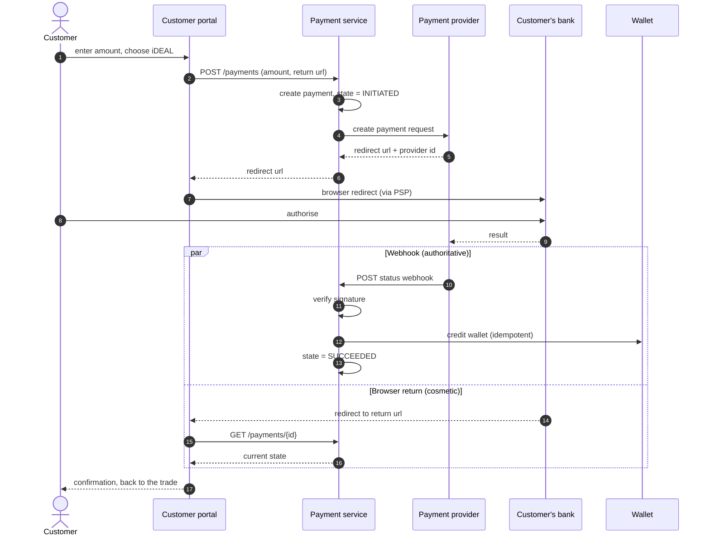

# F07 — Wallet Top-up & Payments

**Portal:** customer · **Priority:** Must · **Phase:** 2 · **Size:** M

---

## 1. Summary

Two ways to put money in the wallet:

1. **iDEAL via a payment provider** (CM.com is the candidate) — funds land in the wallet within
   seconds of the bank confirming. This is the preferred route and the one the UI should push.
2. **Manual bank transfer** — the platform shows the IBAN, BIC, account holder and a wallet
   reference; the customer transfers; PeakPower reconciles and credits. Slower by a day or more, but
   it needs no provider and no card-scheme relationship.

The important asymmetry: with iDEAL the customer can go from "I can't afford this trade" to "I can"
without leaving the tab. With a bank transfer they cannot. That difference decides how many trades
get lost at the funding step, and it is the reason iDEAL is a Must rather than a Should.

## 2. User stories

| As a… | I want to… | So that… |
| --- | --- | --- |
| Customer user | top up by iDEAL and see the money immediately | I can complete the trade I was in the middle of |
| Customer user | see clear bank-transfer instructions with my own reference | my transfer is recognised without a phone call |
| Customer user | see pending top-ups and their status | I know whether to wait or chase |
| Customer user | be taken back to what I was doing after paying | the interruption is minimal |
| Finance | see incoming transfers and match them to wallets | crediting is quick and correct |
| Finance | see failed and abandoned payments | I can help a customer who thinks they paid |

## 3. iDEAL flow

**The webhook is authoritative; the browser return is not.** A customer who closes the tab mid-payment
must still be credited, and a customer who is redirected back before the webhook lands must see
"processing" rather than a wrong answer.

## 4. Functional requirements

### iDEAL

| ID | Requirement | MoSCoW |
| --- | --- | :--: |
| F07-R01 | A customer can start a top-up by entering an amount and choosing iDEAL. | Must |
| F07-R02 | Minimum and maximum top-up amounts are configurable (defaults €100 and €250 000) **[OQ-32]**. | Must |
| F07-R03 | A `payment` record is created before redirecting, with state `INITIATED`. | Must |
| F07-R04 | The customer is redirected to the provider and returned to a platform URL that preserves their prior context. | Must |
| F07-R05 | The provider webhook is signature-verified; unverified callbacks are rejected and logged. | Must |
| F07-R06 | The webhook is idempotent on the provider payment id: repeated deliveries credit once. | Must |
| F07-R07 | On success the wallet is credited with a `DEPOSIT_IDEAL` entry in the same transaction as the state change. | Must |
| F07-R08 | Payment states: `INITIATED`, `PENDING`, `SUCCEEDED`, `FAILED`, `CANCELLED`, `EXPIRED`. | Must |
| F07-R09 | If the browser returns before the webhook, the UI shows "processing" and polls until resolved or a timeout, then explains what to do. | Must |
| F07-R10 | A reconciliation job queries the provider for payments stuck in `INITIATED`/`PENDING` beyond a threshold and resolves them. | Must |
| F07-R11 | The customer's payment history is visible with state and timestamps. | Must |
| F07-R12 | The suggested top-up amount is prefilled when the customer arrives from a blocked trade — the shortfall, rounded up. | Should |

### Bank transfer

| ID | Requirement | MoSCoW |
| --- | --- | :--: |
| F07-R13 | The portal shows transfer instructions: IBAN, BIC, account holder name, and the customer's unique **wallet reference**. | Must |
| F07-R14 | The wallet reference is stable, unique per customer, and formatted to survive being retyped (grouped, unambiguous character set). | Must |
| F07-R15 | Instructions are copyable field by field and downloadable as PDF. | Should |
| F07-R16 | The screen states plainly that funds appear only after PeakPower processes the transfer, typically within one business day. | Must |
| F07-R17 | Finance can register a received transfer against a wallet with amount, value date, bank reference and note, creating a `DEPOSIT_BANK` entry. | Must |
| F07-R18 | Registering a duplicate (same amount and reference within 7 days) warns before proceeding. | Should |
| F07-R19 | Finance can import a bank statement (CAMT.053 or CSV) and match lines to wallets by reference, with manual resolution for the rest. | Could |

## 5. Business rules

1. **The webhook credits the wallet; the browser never does.** No wallet mutation on a return URL.
2. **Idempotency everywhere.** Provider id is the key.
3. **Credit only on confirmed settlement.** No optimistic crediting on redirect.
4. **The wallet reference is the matching key** for manual transfers, and it must be easy for a human
   to copy correctly.
5. **A failed payment leaves no trace on the balance** — only in payment history.
6. **PeakPower never stores card or account credentials.** Redirect flow only; the platform sees a
   payment id and a status **(and this remains true regardless of provider choice)**.
7. **Refunds are a separate, employee-initiated flow** **[OQ-30]** — never automatic, never
   customer-initiated.

## 6. Screens

| Screen | Mockup |
| --- | --- |
| Top-up (iDEAL and bank transfer tabs) | [`wallet-topup.svg`](../60-mockups/wallet-topup.svg) |
| Wallet & ledger | [`wallet-ledger.svg`](../60-mockups/wallet-ledger.svg) |

## 7. Data

| Entity | Purpose |
| --- | --- |
| `payment` | id, customer_id, amount, method, provider, provider_payment_id, state, timestamps, return context |
| `payment_event` | Append-only state history including raw webhook payloads |
| `bank_deposit` | Manually registered transfers with reference and value date |
| `customer_wallet_reference` | The stable transfer reference per customer |

## 8. Edge cases

| Case | Behaviour |
| --- | --- |
| Customer closes the tab after authorising | Webhook credits regardless; notification informs them |
| Webhook arrives before the browser return | Return page already shows success |
| Webhook never arrives | Reconciliation job resolves it against the provider; alert if unresolved after N attempts |
| Duplicate webhook | Idempotent — one credit |
| Payment succeeds after being marked expired | Late success wins; wallet credited and the state corrected, with an audit note |
| Customer transfers without the reference | Lands in an unmatched queue for finance to resolve manually |
| Customer transfers the wrong amount | Credited as received; the trade they wanted may still be unaffordable |
| Provider outage | iDEAL disabled in the UI with an explanation; bank transfer remains available |
| Amount below minimum | Blocked with the minimum stated |
| Chargeback / reversal | Handled as a manual `ADJUSTMENT` with a mandatory reason **[OQ-33]** |

## 9. Out of scope

- Credit card, PayPal, Bancontact and other methods (the model is provider-agnostic, so adding one is
  configuration plus testing).
- Recurring or scheduled automatic top-ups.
- Direct debit (SEPA incasso).
- Automatic bank feed via PSD2 account information.

## 10. Dependencies

| Depends on | Why |
| --- | --- |
| [F06](F06-wallet-and-ledger.md) | The wallet being credited |
| [Payments integration](../30-integrations/03-payments-cm-com.md) | Provider specifics |
| [F11](F11-notifications.md) | Top-up confirmations and low-balance prompts |

## 11. Open questions

| Ref | Question |
| --- | --- |
| [OQ-07] | Is a bank statement import in scope, or is manual registration acceptable indefinitely? |
| [OQ-30] | Refunds: in scope, and who approves? |
| [OQ-32] | Minimum and maximum top-up amounts |
| [OQ-33] | How are chargebacks and reversals handled operationally? |
| [OQ-34] | Is CM.com confirmed, and does the contract cover iDEAL plus the volumes expected? |
