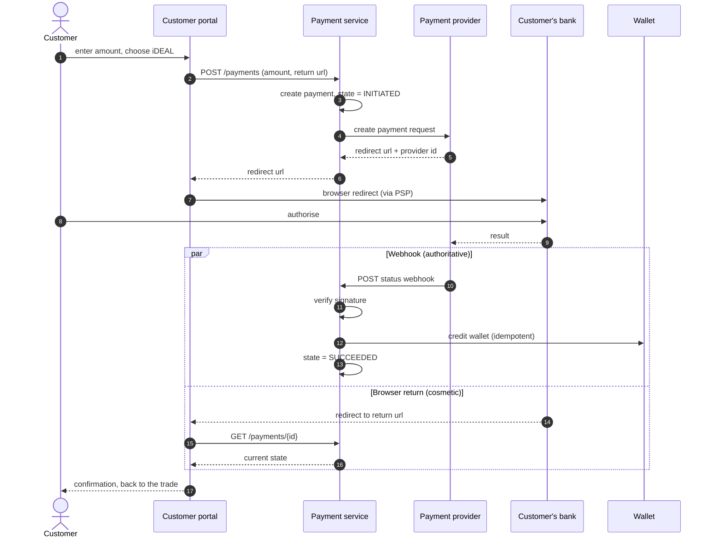
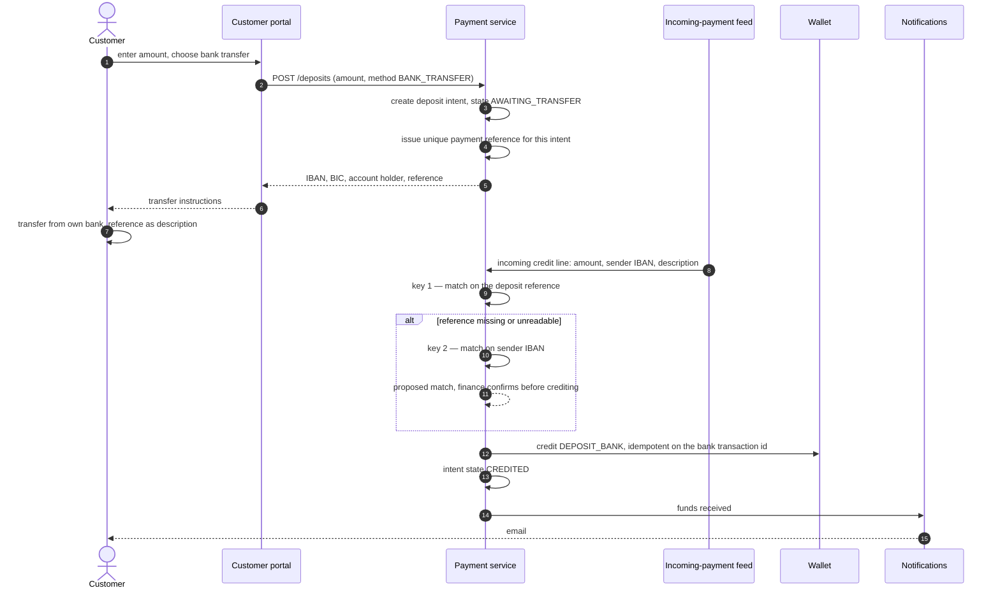
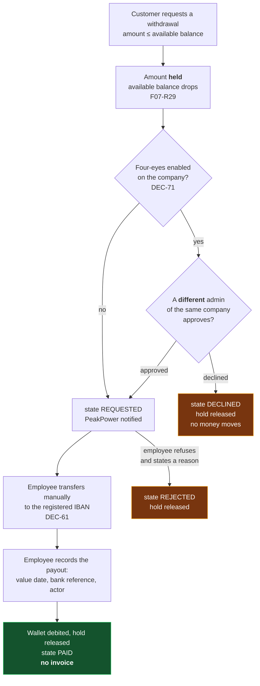

# F07 — Wallet Top-up & Payments

**Portal:** customer · **Priority:** Must · **Phase:** 2 · **Size:** M

---

## 1. Summary

Two ways to put money in the wallet, and **only** two **[DEC-58]**:

1. **iDEAL via a payment provider** (CM.com is the candidate) — funds land in the wallet within
   seconds of the bank confirming. This is the preferred route and the one the UI should push.
2. **Manual bank transfer** — the platform shows the IBAN, BIC, account holder and a wallet
   reference; the customer transfers; PeakPower reconciles and credits. Slower by a day or more, but
   it needs no provider and no card-scheme relationship.

The important asymmetry: with iDEAL the customer can go from "I can't afford this trade" to "I can"
without leaving the tab. With a bank transfer they cannot. That difference decides how many trades
get lost at the funding step, and it is the reason iDEAL is a Must rather than a Should.

⚠ **Amended 2026-08-19 by [DEC-106] and [DEC-86].** The method *set* is unchanged — still two, still
nothing else. What changes is **what the second method is** and **what the first one can carry**:

1. **iDEAL via a payment provider.** **[DEC-86]: no PSP is chosen.** CM.com is a candidate, not a
   commitment, and the provider-agnostic port **[F07-R20]** stops being a nicety and becomes the thing
   that keeps this decision cheap to make late. The recorded reason it stays undecided is also the
   reason bank transfer matters: **iDEAL is limited at the bank side** — the customer's own bank caps
   what a single iDEAL payment may be — so iDEAL **cannot carry the amounts a trading wallet needs**.
   It is the fast route, not the large one.
2. **Bank transfer — a first-class deposit method [DEC-106]**, modelled end to end rather than left as
   an out-of-band manual step. The customer chooses deposit → bank transfer; the platform issues a
   **unique payment reference for that deposit intent** **[F07-R23]**; the customer uses it as the
   payment description; the platform matches the incoming payment on that reference **[F07-R25]**,
   credits the wallet, and **emails the customer that the funds have arrived** **[F07-R27]**. Finance
   registering a transfer by hand **[F07-R17]** becomes the exception path, not the norm.

Restated asymmetry: **iDEAL is instant but bounded; a transfer is unbounded but takes as long as the
payment feed takes.** A customer who is one deposit short of a block uses iDEAL when the amount fits
under their bank's limit and a transfer when it does not. Both routes therefore have to be complete;
neither can be a stub.

> **One payment method — [DEC-58].** No SEPA-via-provider, no Bancontact, no card. The payment surface
> is iDEAL plus manual bank transfer, which closes [OQ-68]. The provider port stays method-agnostic
> **[F07-R20]**, so adding one later is configuration plus testing rather than a redesign — but nothing
> is built for a second method now.
>
> ⚠ **Amended 2026-08-19 by [DEC-106].** The exclusions stand verbatim — no SEPA-via-provider, no
> Bancontact, no card, and [OQ-68] stays closed. The word "manual" does not: bank transfer is a built
> deposit method with its own record, its own reference and its own matching, not a page of
> instructions plus a human.

> **Money is one-way — [DEC-43].** There is **no refund payout path**: surplus balance stays in the
> wallet. This document therefore describes money coming **in** only. See
> [F06](F06-wallet-and-ledger.md) §1 for the offboarding gap that follows from it, which is a known
> gap rather than an open question.
>
> ⚠ **Reversed 2026-08-19 by [DEC-83].** Money is **two-way**. The customer raises a withdrawal
> request in the portal, PeakPower pays it out **manually** by bank transfer to the company bank
> account on the customer record **[DEC-61]**, and the platform records the request, the approval and
> the wallet debit **[F07-R29..R33]**. Under **[DEC-71]** a withdrawal is a four-eyes action when the
> customer company has four-eyes enabled. What this costs: an outbound money path now exists, so the
> platform can be the instrument of a mistaken or fraudulent payout — which is precisely why the
> payout itself stays a human bank action and the platform only records it. What it buys: the
> offboarding gap in [F06](F06-wallet-and-ledger.md) §1 gets a route out, so a closing customer's
> balance is no longer stranded.

> **Two matching keys, not one — [DEC-61].** The company bank account on the customer record is used
> **both** as a refund destination — vestigial now, under **[DEC-43]** — **and to match incoming
> transfers**. Matching on a known IBAN attributes a transfer even when the customer omits the
> reference, which removes the largest single source of unmatched payments **[F07-R21]**. Closes
> [OQ-79].
>
> ⚠ **Amended 2026-08-19 by [DEC-106] and [DEC-83].** Both halves change and both get sharper. The
> refund destination is **no longer vestigial** — it is where a withdrawal is actually paid
> **[DEC-83]**. And the first key is no longer a standing per-customer reference but the
> **deposit-intent reference [F07-R23]**, which identifies one expected payment rather than a wallet;
> **IBAN matching is the fallback for the customer who omits it [F07-R21]**.

> **The wallet funds trading only — [DEC-77].** A deposit is not sized against an invoice, because
> **no invoice is ever settled from the wallet**: monthly day-ahead, export and energiebelasting
> amounts are pushed to the bookkeeping program **[DEC-88]** and paid to the bank. Top-up sizing is
> therefore driven by **the volume the customer intends to trade** — which is exactly why **[DEC-84]**
> removes the minimum and the maximum rather than setting them **[F07-R28]**.

> **No invoice is ever raised for a deposit or a withdrawal** **[DEC-106]**, **[DEC-83]**. A deposit
> is a transfer of the customer's own money into their own wallet; nothing is sold, so there is nothing
> to invoice and no VAT to state **[DEC-76]**. The bookkeeping program learns about both movements
> from its **bank feed**, not from the platform **[DEC-109]** **[F07-R31]**.

> ⚠ **[OQ-93] blocks the bank-transfer route.** **[DEC-106]** requires the platform to match an
> incoming payment on a reference it issued, which requires an **incoming-payment feed** — and the
> source names SEPA-instant and a PSP-generated description without choosing between a **CAMT.053
> import**, a **PSP webhook** and a **SEPA-instant push** from a modern bank. Everything in §4 "Bank
> transfer" downstream of "the money arrives" is specified against a feed that has not been picked
> **[F07-R24]**. Until it is, only the manual registration path **[F07-R17]** is buildable.

## 2. User stories

| As a… | I want to… | So that… |
| --- | --- | --- |
| Customer user | top up by iDEAL and see the money immediately | I can complete the trade I was in the middle of |
| Customer user | see clear bank-transfer instructions with my own reference | my transfer is recognised without a phone call |
| Customer user | see pending top-ups and their status | I know whether to wait or chase |
| Customer user | be taken back to what I was doing after paying | the interruption is minimal |
| Finance | see incoming transfers and match them to wallets | crediting is quick and correct |
| Finance | have a transfer that arrived without a reference matched on the sender's IBAN | the commonest customer mistake stops creating manual work **[DEC-61]** |
| Finance | see failed and abandoned payments | I can help a customer who thinks they paid |
| Customer user | deposit an amount iDEAL cannot carry | my bank's iDEAL limit does not cap what I can trade **[DEC-86]** |
| Customer user | get a payment reference for the deposit I am about to wire | my transfer is credited without anyone at PeakPower touching it **[DEC-106]** |
| Customer user | be emailed the moment my transfer lands | I know I can trade, without watching the balance **[DEC-106]** |
| Customer user | request a withdrawal of my balance | money I no longer intend to trade with is not stuck in the wallet **[DEC-83]** |
| Customer admin | approve or decline another admin's withdrawal request | one person alone cannot move money out of our company **[DEC-71]** |
| Finance | see withdrawal requests with the destination IBAN and pay them out | the payout is a deliberate act with a record, not an automated transfer **[DEC-83]** |

## 3. Flows

### 3.1 iDEAL deposit

**The webhook is authoritative; the browser return is not.** A customer who closes the tab mid-payment
must still be credited, and a customer who is redirected back before the webhook lands must see
"processing" rather than a wrong answer.

### 3.2 Bank-transfer deposit **[DEC-106]**

**The feed is authoritative and the intent is only an expectation.** The customer may transfer more,
less, later or never; the wallet is credited with **what actually arrived**, against the intent the
reference names. Nothing is credited on the strength of the intent alone — creating a deposit intent
moves no money **[F07-R23]**.

⚠ **The `FEED` participant is not chosen yet — [OQ-93].** CAMT.053 import, PSP webhook and
SEPA-instant push all fit this diagram and differ in latency (minutes versus a working day), in who
runs the connection, and in whether the platform ever sees a payment the bookkeeping program does not.
The diagram is drawn against the *shape* of a feed on purpose; the arrow from `FEED` is the part that
cannot be built yet **[F07-R24]**.

### 3.3 Withdrawal **[DEC-83]**

**The hold is the point.** Without it, a customer can request a withdrawal and then spend the same
money on a block before finance pays out, and PeakPower transfers money that is no longer there —
which **[AS-11]** (no credit, no negative balance) forbids. The mechanism is the wallet's existing
**reserved amount** [F06](F06-wallet-and-ledger.md) §2, the same one a trade reservation uses; the
settled debit happens only when the payout is recorded, because until the bank transfer is made
nothing has left PeakPower either.

**The payout itself stays outside the platform.** No API to a bank, no batch file, no scheduled SEPA
run **[DEC-83]**. What that costs is a working day and a human; what it buys is that no defect in this
platform can, on its own, move money to a bank account.

## 4. Functional requirements

### iDEAL

| ID | Requirement | MoSCoW |
| --- | --- | :--: |
| F07-R01 | A customer can start a top-up by entering an amount and choosing iDEAL. ⚠ **Amended 2026-08-19 by [DEC-106]** — the entry point is now **one deposit action with a method choice**: the customer starts a deposit, enters an amount, then picks **iDEAL** (this section) or **bank transfer** (**[F07-R23]**). The two methods are peers on that screen; iDEAL is not the default that bank transfer hides behind. | Must |
| ~~F07-R02~~ | ~~Minimum and maximum top-up amounts are configurable (defaults €100 and €250 000) **[OQ-32]**.~~ ⚠ **Retired 2026-08-19 by [DEC-84]** — there is **no minimum and no maximum**. The €100 / €250 000 defaults are **removed rather than configured**, because the right deposit is whatever the volume the customer intends to trade costs **[DEC-77]**, and no constant knows that. Replaced by **[F07-R28]**; closes [OQ-32]. | ~~Must~~ |
| F07-R03 | A `payment` record is created before redirecting, with state `INITIATED`. | Must |
| F07-R04 | The customer is redirected to the provider and returned to a platform URL that preserves their prior context. | Must |
| F07-R05 | The provider webhook is signature-verified; unverified callbacks are rejected and logged. | Must |
| F07-R06 | The webhook is idempotent on the provider payment id: repeated deliveries credit once. | Must |
| F07-R07 | On success the wallet is credited with a `DEPOSIT_IDEAL` entry in the same transaction as the state change. | Must |
| F07-R08 | Payment states: `INITIATED`, `PENDING`, `SUCCEEDED`, `FAILED`, `CANCELLED`, `EXPIRED`. | Must |
| F07-R09 | If the browser returns before the webhook, the UI shows "processing" and polls until resolved or a timeout, then explains what to do. | Must |
| F07-R10 | A reconciliation job queries the provider for payments stuck in `INITIATED`/`PENDING` beyond a threshold and resolves them. | Must |
| F07-R11 | The customer's payment history is visible with state and timestamps. | Must |
| F07-R12 | The suggested top-up amount is prefilled when the customer arrives from a blocked trade — the shortfall, rounded up. | Should |

### Bank transfer

⚠ **Rewritten 2026-08-19 by [DEC-106].** Bank transfer is a **deposit method the platform runs**, not
a page of instructions plus a human. The customer chooses deposit → bank transfer, the platform issues
a **reference for that one intended payment**, matches the incoming payment on it, credits the wallet
and emails the customer. The rows below keep their IDs; what changed in each is marked in its cell.

| ID | Requirement | MoSCoW |
| --- | --- | :--: |
| F07-R13 | The portal shows transfer instructions: IBAN, BIC, account holder name, and the customer's unique **wallet reference**. ⚠ **Amended 2026-08-19 by [DEC-106]** — the reference shown is the **deposit-intent reference [F07-R23]**, issued for the payment the customer is about to make, not a standing per-customer code. The instruction screen is reached *from* a deposit, never as a static page, because a reference without an intent behind it matches nothing. | Must |
| F07-R14 | The wallet reference is stable, unique per customer, and formatted to survive being retyped (grouped, unambiguous character set). ⚠ **Amended 2026-08-19 by [DEC-106]** — the formatting rule is unchanged and still load-bearing (grouped, unambiguous character set, check character, recognisable `PP-` prefix on a statement). **Uniqueness moves from per customer to per deposit intent**, which enlarges the code space and means a reference must not be guessable from another customer's: a guessed reference would credit someone else's wallet. It is **not** invalidated by use **[F07-R26]**. | Must |
| F07-R15 | Instructions are copyable field by field and downloadable as PDF. | Should |
| F07-R16 | The screen states plainly that funds appear only after PeakPower processes the transfer, typically within one business day. ⚠ **Amended 2026-08-19 by [DEC-106]** — "after PeakPower processes the transfer" is no longer true: the platform credits automatically on the feed **[F07-R25]**. The screen states the **timing** honestly instead, and the honest statement depends on which feed is chosen **[OQ-93]** — minutes on a SEPA-instant push, up to a working day on a daily CAMT.053 import. It must not promise instant crediting before that is decided. | Must |
| F07-R17 | Finance can register a received transfer against a wallet with amount, value date, bank reference and note, creating a `DEPOSIT_BANK` entry. ⚠ **Amended 2026-08-19 by [DEC-106]** — retained, but as the **exception path**: unmatched transfers **[F07-R22]**, payments that arrive outside the feed, and the whole route until **[OQ-93]** is answered. It is no longer how a normal bank deposit is credited. | Must |
| F07-R18 | Registering a duplicate (same amount and reference within 7 days) warns before proceeding. ⚠ **Amended 2026-08-19 by [DEC-106]** — the warning applies to **manual registration only**. Automatic crediting deduplicates on the bank transaction id **[F07-R25]**, not on amount-and-reference, because a customer may legitimately send the same amount twice against a reference **[F07-R26]** and a same-amount rule would silently swallow the second one. | Should |
| ~~F07-R19~~ | ~~Finance can import a bank statement (CAMT.053 or CSV) and match lines to wallets by reference **and by IBAN [F07-R21]**, with manual resolution for the rest.~~ ⚠ **Retired 2026-08-19 by [DEC-106]** — an incoming-payment feed is now **in scope and Must**, not a *Could*, and it is consumed by the platform rather than imported by a person. Replaced by **[F07-R24]**, which keeps CAMT.053 as one of three candidate transports **[OQ-93]**. Closes [OQ-07] for wallet deposits. | ~~Could~~ |

#### Deposit intents, matching and crediting **[DEC-106]**

| ID | Requirement | MoSCoW |
| --- | --- | :--: |
| F07-R23 | Choosing bank transfer creates a **deposit intent**: customer, initiating account, intended amount, method `BANK_TRANSFER`, state, and a **unique payment reference issued by the platform** for that intent. Creating an intent **moves no money and reserves nothing** — it is an expectation, and the intended amount is used for matching confidence, duplicate detection and the customer's own "pending" list **[F07-R11]**, never as a credit. | Must |
| F07-R24 | The platform consumes an **incoming-payment feed** for the PeakPower bank account and evaluates every credit line against open deposit intents **[F07-R25]**. ⚠ **The transport is undecided — [OQ-93]**: CAMT.053 import, PSP webhook or SEPA-instant push. The matcher is specified against a normalised line — amount, value date, sender IBAN, sender name, description, bank transaction id — so the adapter is the only part that changes when [OQ-93] is answered. **This requirement blocks the whole automatic route**; until it exists, [F07-R17] is the only way a transfer is credited. | Must |
| F07-R25 | A credit line whose description contains a valid deposit reference credits the wallet **automatically** with a `DEPOSIT_BANK` entry for **the amount actually received**, links it to the intent, sets `matched_by = REFERENCE`, and is **idempotent on the bank transaction id** — a re-delivered or re-imported line credits once. Debit lines are not actioned **[F07-R34]**. | Must |
| F07-R26 | A deposit reference is **not consumed by use and does not expire**. A payment carrying a reference whose intent is already credited is credited again to the same wallet, against the same intent, as a further deposit. Refusing it would strand a customer's money on the PeakPower account with no automatic route back — worse than crediting a wallet the customer already owns. Repeat matches are flagged for finance to see, not blocked. | Must |
| F07-R27 | On any wallet credit from a bank transfer, the customer is **emailed that the funds have been received**, stating amount, value date and the new balance **[DEC-106]**. The notification is defined in [F11](F11-notifications.md) and goes to the initiating account plus the company's notification addresses; the email is the reason the customer does not have to watch the balance after wiring. | Must |
| F07-R28 | There is **no minimum and no maximum deposit amount**, on either method **[DEC-84]**. No configurable limit is built and no default is set: the amount follows the volume the customer wants to trade **[DEC-77]**. ⚠ What this costs: nothing bounds a mistyped deposit, and the only recovery is a withdrawal **[F07-R29]**. Any limit iDEAL imposes is the **bank's**, not the platform's **[DEC-86]**, and is reported as the bank's. | Must |

### Withdrawals **[DEC-83]**

⚠ **New 2026-08-19.** **[DEC-43]** (no payout path at all) is **reversed**; the customer requests,
PeakPower pays out manually, the platform records. Nothing here initiates a bank payment.

| ID | Requirement | MoSCoW |
| --- | --- | :--: |
| F07-R29 | A customer account can raise a **withdrawal request** for an amount up to the **available balance**. The requested amount is **held** from that moment — it leaves the available balance and cannot be spent on a trade — using the wallet's existing reserved-amount mechanism [F06](F06-wallet-and-ledger.md) §2. Without the hold, the same euros can be traded and withdrawn **[AS-11]**. | Must |
| F07-R30 | When the customer company has **four-eyes enabled [DEC-71]**, a withdrawal must be approved by a **different admin account of the same company** before PeakPower sees it; that admin may also decline it, which releases the hold and moves no money. Deposits are explicitly **not** four-eyes actions **[DEC-71]** — anyone may put money in. | Must |
| F07-R31 | PeakPower is notified of an approved request; an employee pays it out **manually** by bank transfer and then **records the payout** — value date, bank reference, acting employee — which posts the wallet debit and releases the hold in one transaction. **No invoice and no credit note is raised for a withdrawal, and none for a deposit** **[DEC-106]**: nothing is sold, so there is nothing to invoice and no VAT to state **[DEC-76]**. The bookkeeping program sees both movements through its own bank feed **[DEC-109]**. | Must |
| F07-R32 | Withdrawal states: `REQUESTED`, `AWAITING_APPROVAL`, `APPROVAL_DECLINED`, `REJECTED`, `PAID`, `CANCELLED`. `CANCELLED` is the customer withdrawing their own request before payout; `REJECTED` is PeakPower refusing it **with a mandatory reason**. Every state change records the acting account **[DEC-17]**, and every state except `PAID` releases the hold. | Must |
| F07-R33 | The destination is **the company bank account on the customer record [DEC-61]** and cannot be typed in on the request. A customer who wants a different account changes it first — which is itself a four-eyes action **[DEC-71]** and cannot be edited, only replaced by adding an account and deactivating the old one. This is what stops a compromised account from redirecting money. | Must |

### Payment methods, transfer matching, chargebacks and settlement

**[DEC-58]** fixes the method set and **[DEC-61]** adds the second matching key.

⚠ **Amended 2026-08-19 by [DEC-106], [DEC-85] and [DEC-105].** The method set is unchanged; what
changes is that the second method is built rather than manual, that the reference key now names a
**deposit intent** rather than a customer, and that everything *after* a payment goes wrong —
chargebacks, reversals, settlement reconciliation — leaves the platform entirely.

| ID | Requirement | MoSCoW |
| --- | --- | :--: |
| F07-R20 | The platform offers **iDEAL and manual bank transfer, and no other payment method** **[DEC-58]**. No SEPA-via-provider, no Bancontact, no card. The provider port stays method-agnostic so a method is data rather than a redesign, but no second method is configured, tested or shown in the UI. ⚠ **Amended 2026-08-19 by [DEC-86] and [DEC-106]** — bank transfer is no longer "manual"; and because **no PSP is chosen**, the method-agnostic port is now doing real work: it is what lets the PSP decision be made after the wallet is built. **iDEAL is limited at the bank side**, so the port must also carry no assumption that a deposit fits in one iDEAL payment. | Must |
| F07-R21 | An incoming transfer is matched to a wallet in this order **[DEC-61]**: **(1)** the wallet reference **[F07-R14]**, when present and check-character valid; **(2)** failing that, the **customer's registered IBAN [F01-R01]**, when it resolves to exactly one active customer. A match by IBAN alone is presented to finance as a **proposed** match naming the customer, and is confirmed before crediting — the platform never credits on an IBAN match unattended. ⚠ **Amended 2026-08-19 by [DEC-106]** — key (1) is the **deposit-intent reference [F07-R23]** and, when it matches, crediting is **automatic [F07-R25]** rather than an act of registration. Key (2) is unchanged and stays **the fallback for the customer who omits the reference**, still proposed and still confirmed by a human. | Must |
| F07-R22 | An IBAN that resolves to **no** customer, or to **more than one**, produces no proposal: the transfer goes to the unmatched queue for manual resolution **[F07-R17]**. The stored match basis — `REFERENCE`, `IBAN` or `MANUAL` — is recorded on the deposit, so the value of each key is measurable rather than assumed. | Must |
| F07-R34 | The platform does **not** handle chargebacks or reversals **[DEC-85]**. There is no reversal screen, no automatic unwind and no manual-adjustment-with-a-reason path for one; the **bookkeeping program** handles them. The deposit matcher reads **credit lines only [F07-R25]**, so a reversal arriving on the same feed as a debit is recorded as seen and not actioned. ⚠ **The exposure, stated rather than hidden:** a wallet can hold credit whose underlying payment was later reversed, and nothing in the platform detects or unwinds it. What **[DEC-85]** removes is the chargeback *feature*, not the wallet's generic correction primitive: if a balance must actually be reduced, finance posts an ordinary `ADJUSTMENT` with a mandatory reason **[F06-R26]** on instruction from the bookkeeping side, and it is a correction like any other rather than a chargeback workflow. | Must |
| F07-R35 | The platform does **not** consume a PSP settlement report and does not reconcile provider payouts against its own payment records **[DEC-105]**. That reconciliation is the bookkeeping program's, which sees the settlement on the bank account. The platform's own reconciliation stops at **payment state** — the stuck-payment job **[F07-R10]** — which is about whether a customer was credited, not about whether PeakPower was paid. Closes [OQ-67]. | Must |

## 5. Business rules

1. **The webhook credits the wallet; the browser never does.** No wallet mutation on a return URL.
2. **Idempotency everywhere.** Provider id is the key. ⚠ **Amended 2026-08-19 by [DEC-106]** — on the
   bank-transfer route the key is the **bank transaction id** on the feed line **[F07-R25]**, not the
   reference and not the amount, because the same reference may legitimately carry two payments
   **[F07-R26]**.
3. **Credit only on confirmed settlement.** No optimistic crediting on redirect. ⚠ **Extended by
   [DEC-106]**: a deposit **intent** is not a settlement either. Money the customer says they will
   send credits nothing **[F07-R23]**; only a line on the feed does.
4. **The wallet reference is the first matching key** for manual transfers, and it must be easy for a
   human to copy correctly. **The registered IBAN is the second [DEC-61]** — it catches the transfer
   that arrived without a usable reference, which is the common failure. Neither key credits without
   the reference being valid or a human confirming the IBAN match **[F07-R21]**.
   ⚠ **Amended 2026-08-19 by [DEC-106]** — the first key is the **deposit-intent reference**, and it
   *does* credit unattended, because it identifies one expected payment and was issued by the platform
   rather than typed by a person. The second key is unchanged: an IBAN identifies a **company**, not a
   payment, so it stays a proposal a human confirms.
5. **A failed payment leaves no trace on the balance** — only in payment history.
6. **PeakPower never stores card or account credentials.** Redirect flow only; the platform sees a
   payment id and a status **(and this remains true regardless of provider choice)**.
7. **There is no refund flow at all** **[DEC-43]**. Not automatic, not customer-initiated, not
   employee-initiated. Money moves into a wallet and is spent from it; it does not move back out
   **[F06-R29]**.
   ⚠ **Reversed 2026-08-19 by [DEC-83].** Money moves back out, by **withdrawal request → approval →
   manual bank transfer → recorded debit** **[F07-R29..R33]**. The rule that survives is narrower and
   still absolute: **no code path in this platform instructs a bank to pay anybody** — an employee
   does, and the platform records it afterwards.
8. **One method in, and it is iDEAL** **[DEC-58]**. Manual bank transfer is the fallback, not a second
   product.
   ⚠ **Amended 2026-08-19 by [DEC-106] and [DEC-86].** Two methods in, and **neither is a fallback**.
   iDEAL is the fast one and is capped by the customer's bank; bank transfer is the one that can carry
   a trading deposit. The set is still closed — no third method **[DEC-58]**.
9. **No minimum and no maximum** **[DEC-84]**. Not "configurable with a default": absent
   **[F07-R28]**. The sizing question belongs to the customer's trading intention **[DEC-77]**, and the
   platform has no basis for an opinion on it.
10. **No invoice for a deposit and no invoice for a withdrawal** **[DEC-106]**, **[DEC-83]**. Neither
    is a sale. Nothing is pushed to the bookkeeping program for either; it sees them on its bank feed
    **[DEC-109]**.
11. **A withdrawal is held before it is paid, and paid before it is debited** **[F07-R29]**,
    **[F07-R31]**. The hold protects the balance from being spent twice; the debit follows the actual
    bank transfer, so the ledger never claims money left before it did.
12. **Every deposit and every withdrawal is handled individually** **[DEC-100]** — nothing is netted,
    batched or waived below a threshold, and no payout run groups requests. ⚠ [DEC-100] is recorded in
    the ledger with an interpretation flag: its source comment sits on the true-up materiality row but
    is phrased about deposits and withdrawals. It is followed here because it is the only reading that
    is also consistent with **[F07-R32]**'s per-request states.
13. **What happens after a payment goes wrong is not this platform's** **[DEC-85]**, **[DEC-105]**.
    Chargebacks, reversals and provider settlement all live in the bookkeeping program
    **[F07-R34]**, **[F07-R35]**.

## 6. Screens

| Screen | Mockup |
| --- | --- |
| Top-up (iDEAL and bank transfer tabs) | [`wallet-topup.svg`](../60-mockups/wallet-topup.svg) — ⚠ the bank-transfer tab shows a **standing** reference and an amount field with a stated minimum; both are wrong after **[DEC-106]** and **[DEC-84]**. The tab now shows the reference issued for **this** deposit **[F07-R23]** and no limit text **[F07-R28]** |
| Wallet & ledger | [`wallet-ledger.svg`](../60-mockups/wallet-ledger.svg) |
| **Withdrawal request** | ⚠ **No mockup yet** — new under **[DEC-83]**. It needs the amount against the available balance, the destination IBAN shown read-only **[F07-R33]**, and, under four-eyes, who has to approve **[DEC-71]** |

## 7. Data

| Entity | Purpose |
| --- | --- |
| `payment` | id, customer_id, amount, method, provider, provider_payment_id, state, timestamps, return context |
| `payment_event` | Append-only state history including raw webhook payloads |
| `bank_deposit` | Manually registered transfers with reference, value date, sender IBAN and **`matched_by`** (`REFERENCE` \| `IBAN` \| `MANUAL`) **[DEC-61]**. ⚠ **Amended by [DEC-106]** — no longer only manually registered: it is the record of **every** bank deposit, automatic or manual, and carries the **bank transaction id** (the idempotency key **[F07-R25]**) and the `deposit_intent` it matched |
| ~~`customer_wallet_reference`~~ | ~~The stable transfer reference per customer~~ ⚠ **Retired 2026-08-19 by [DEC-106]** — the reference is per deposit intent, not per customer. Replaced by `deposit_intent` |
| `deposit_intent` **[DEC-106]** | id, customer_id, initiating account, intended amount, method, **payment reference** (unique, check-character protected), state (`AWAITING_TRANSFER` \| `CREDITED` \| `CANCELLED`), timestamps. One intent may carry more than one credited deposit **[F07-R26]** |
| `incoming_payment` **[OQ-93]** | A normalised credit line from the payment feed: bank transaction id, amount, value date, sender IBAN, sender name, description, match result. Kept whatever the transport turns out to be, so the matcher is written once **[F07-R24]** |
| `withdrawal_request` **[DEC-83]** | id, customer_id, requesting account, amount, state **[F07-R32]**, approving account (four-eyes **[DEC-71]**), destination IBAN as at request time **[F07-R33]**, payout value date, bank reference, paying employee, rejection reason |

## 8. Edge cases

| Case | Behaviour |
| --- | --- |
| Customer closes the tab after authorising | Webhook credits regardless; notification informs them |
| Webhook arrives before the browser return | Return page already shows success |
| Webhook never arrives | Reconciliation job resolves it against the provider; alert if unresolved after N attempts |
| Duplicate webhook | Idempotent — one credit |
| Payment succeeds after being marked expired | Late success wins; wallet credited and the state corrected, with an audit note |
| **Customer transfers without the reference** | Matched on the sending IBAN when it resolves to exactly one active customer, and proposed to finance for confirmation **[F07-R21]**, **[DEC-61]**. Only an unknown or ambiguous IBAN reaches the unmatched queue **[F07-R22]** |
| **Customer transfers from a different account of their own** | Not matched — the IBAN is unknown to the platform. Unmatched queue, and the fix is for finance to record the additional IBAN on the customer **[F01-R06]** rather than to credit on a name match |
| **One IBAN registered on two customers** | No proposal; unmatched queue **[F07-R22]**. Guessing between two companies is worse than a day's delay |
| Customer transfers the wrong amount | Credited as received; the trade they wanted may still be unaffordable. ⚠ Under **[DEC-106]** the intent records what they *said* they would send, so a mismatch is visible on the intent and shown to finance — but it never blocks the credit **[F07-R23]** |
| ~~**Customer asks for their money back**~~ | ~~There is nothing to invoke — **no refund path exists [DEC-43]**, **[F06-R29]**. The balance stays in the wallet and the request is a commercial conversation, not a platform action~~ ⚠ **Reversed 2026-08-19 by [DEC-83]** — there is now something to invoke: a **withdrawal request** **[F07-R29]**, approved under four-eyes where enabled **[DEC-71]**, paid manually and recorded **[F07-R31]** |
| Provider outage | iDEAL disabled in the UI with an explanation; bank transfer remains available |
| ~~Amount below minimum~~ | ~~Blocked with the minimum stated~~ ⚠ **Retired 2026-08-19 by [DEC-84]** — there is no minimum, so there is no case. Only a non-positive amount is rejected **[F07-R28]** |
| ~~Chargeback / reversal~~ | ~~Handled as a manual `ADJUSTMENT` with a mandatory reason **[OQ-33]**~~ ⚠ **Reversed 2026-08-19 by [DEC-85]** — not handled here at all. The bookkeeping program owns it **[F07-R34]**; the deposit matcher ignores the debit line |
| **Deposit above the customer's iDEAL limit** | Their bank refuses it, not the platform **[F07-R28]**. The UI names bank transfer as the route for a larger amount **[DEC-86]**, because that limit is exactly why bank transfer is first-class **[DEC-106]** |
| **Reference typed with a wrong character** | The check character fails, so it is not a reference match; the transfer falls through to the IBAN key **[F07-R21]** and, failing that, to the unmatched queue. A near-miss is never "corrected" into a match — that would credit a wallet on a guess |
| **A customer quotes another customer's reference** | Credited to the wallet the **reference** names, because a platform-issued reference identifies one intended payment and is the stronger key **[F07-R21]**. This is why references must be non-guessable **[F07-R14]**, and why the sender IBAN not matching the credited customer is flagged to finance rather than passing silently |
| **Payment arrives against an intent already credited** | Credited again to the same wallet, against the same intent, and flagged **[F07-R26]**. Refusing it would strand the money on PeakPower's account with no automatic route back |
| **Same feed line delivered or imported twice** | One credit — idempotent on the bank transaction id **[F07-R25]** |
| **Payment feed outage or a delayed import** | Nothing is credited late-but-wrong; deposits simply sit uncredited until the feed catches up, and finance can register the urgent ones by hand **[F07-R17]**. ⚠ How long "sit" is depends on the transport, which is **[OQ-93]** |
| **Customer withdraws, then tries to trade the same money** | Impossible: the requested amount is held at request time and is out of the available balance **[F07-R29]** |
| **Four-eyes admin declines a withdrawal** | State `APPROVAL_DECLINED`, hold released, no money moves, both admins notified **[F07-R32]**, **[DEC-71]** |
| **Company has four-eyes on and only one admin** | The withdrawal cannot be approved at all. Same shape as the trading case; the fix is a second admin, not a bypass **[DEC-71]** |
| **Customer's IBAN changes between request and payout** | The payout goes to the IBAN **recorded on the request** **[F07-R33]**; a change during the window is a reason to reject and re-request, not to redirect the payment |
| **Withdrawal requested for the whole balance while a trade reservation is open** | Only the **available** balance can be requested, so the reserved part cannot be withdrawn **[F07-R29]**, [F06](F06-wallet-and-ledger.md) §2 |

## 9. Out of scope

- Credit card, PayPal, Bancontact, SEPA-via-provider and every other method — **decided, not merely
  unbuilt** **[DEC-58]**. The model stays provider-agnostic, so adding one is configuration plus
  testing. ⚠ The port matters more now, not less: **no PSP is chosen [DEC-86]**.
- ~~**Refunds and any other outbound payment** **[DEC-43]**, **[F06-R29]**.~~ ⚠ **Reversed 2026-08-19
  by [DEC-83]** — withdrawals are **in** scope **[F07-R29..R33]**. What stays out is the platform
  **executing** a payment: no bank API, no SEPA batch file, no scheduled payout run. An employee
  transfers the money; the platform records it.
- Recurring or scheduled automatic top-ups.
- Direct debit (SEPA incasso).
- ~~Automatic bank feed via PSD2 account information.~~ ⚠ **Amended 2026-08-19 by [DEC-106]** — an
  **incoming-payment feed is in scope**, for wallet deposits only **[F07-R24]** (invoice payments are
  matched in the bookkeeping program **[DEC-88]**). PSD2 account information is still not one of the
  three candidate transports named in **[OQ-93]** — CAMT.053 import, PSP webhook, SEPA-instant push —
  so it stays out until [OQ-93] says otherwise.
- **Chargebacks, reversals and disputes** **[DEC-85]** — the bookkeeping program's **[F07-R34]**.
- **PSP settlement reporting and payout reconciliation** **[DEC-105]** — likewise **[F07-R35]**.
- **Invoices for deposits or withdrawals** **[DEC-106]**, **[DEC-83]** — none is ever raised
  **[F07-R31]**.
- **Minimum and maximum deposit amounts** **[DEC-84]** — not merely unconfigured: not built
  **[F07-R28]**.

## 10. Dependencies

| Depends on | Why |
| --- | --- |
| [F06](F06-wallet-and-ledger.md) | The wallet being credited, the reserved-amount mechanism a withdrawal hold uses **[F07-R29]**, and the `ADJUSTMENT` primitive a reversal falls back to **[F06-R26]** |
| [Payments integration](../30-integrations/03-payments-cm-com.md) | Provider specifics. ⚠ **No PSP is chosen [DEC-86]** — that document describes a candidate, not a contract |
| **Incoming-payment feed** — transport undecided **[OQ-93]** | The bank-transfer deposit route cannot be built without one **[F07-R24]**, **[DEC-106]** |
| [F11](F11-notifications.md) | Top-up confirmations, the **funds-received email [F07-R27]**, and withdrawal request/approval/payout notices. ⚠ "Low-balance prompts" is struck: **[DEC-90]** removes wallet thresholds and low-balance alerts — the balance is visible, not monitored |
| [F01](F01-customer-and-metering-points.md) | The registered company IBAN: matching key for deposits **[F07-R21]** and the only permitted withdrawal destination **[F07-R33]**, **[DEC-61]** |

## 11. Open questions

Post-2026-08-19 truth: **one question is open in this file — [OQ-93] — and it blocks the bank-transfer
deposit route.** Everything else here is closed.

| Ref | Question |
| --- | --- |
| **[OQ-93]** 🟠 | **Which incoming-payment feed does the platform consume for wallet deposits — a CAMT.053 import, a PSP webhook, or a SEPA-instant push from a modern bank?** ⚠ **New 2026-08-19.** **[DEC-106]** requires the platform to match a wire transfer on a reference it issued, which requires a feed; the source names SEPA instant and a PSP-generated description without choosing between them. **What it blocks:** [F07-R24] and therefore [F07-R25], the automatic credit, the honest timing statement on the instructions screen [F07-R16] and the funds-received email's latency [F07-R27] — in short, everything in §3.2 downstream of "the money arrives". **What is not blocked:** the deposit intent and its reference [F07-R23], the portal flow, and manual registration [F07-R17]. **What the answer changes:** latency (minutes versus a working day), who owns the bank connection, whether the feed is coupled to the still-unchosen PSP **[DEC-86]**, and whether the platform ever sees a payment the bookkeeping program does not **[DEC-109]** |
| ~~[OQ-07]~~ | ~~Is a bank statement import in scope, or is manual registration acceptable indefinitely?~~ **CLOSED — a payment feed into the platform IS in scope, for wallet deposits only** **[DEC-106]**. Invoice payments are matched in the bookkeeping program **[DEC-88]**, not here. Manual registration survives as the exception path **[F07-R17]**. Which feed is **[OQ-93]** |
| ~~[OQ-30]~~ | ~~Refunds: in scope, and who approves?~~ ~~**Closed by [DEC-43]** — not in scope, and nobody, because no payout path exists **[F06-R29]**. ⚠ The offboarding gap it leaves is recorded in [F06](F06-wallet-and-ledger.md) §1~~ ⚠ **Rewritten 2026-08-19 — [DEC-43] is reversed by [DEC-83].** **CLOSED, with the opposite answer:** withdrawals are in scope. The **customer requests**, a **second admin approves** when four-eyes is on **[DEC-71]**, **PeakPower pays out manually** to the registered IBAN **[DEC-61]**, and the platform records request, approval, payout and debit **[F07-R29..R33]**. No invoice is raised. The offboarding gap in [F06](F06-wallet-and-ledger.md) §1 now has a route out |
| ~~[OQ-32]~~ | ~~Minimum and maximum top-up amounts~~ **CLOSED — there are none** **[DEC-84]**. The €100 / €250 000 defaults are removed rather than configured, because the amount depends on the volume the customer wants to trade **[DEC-77]**. ~~[F07-R02]~~ retired, replaced by **[F07-R28]** |
| ~~[OQ-33]~~ | ~~How are chargebacks and reversals handled operationally?~~ **CLOSED — in the bookkeeping program, not here** **[DEC-85]**. The platform has no chargeback path, no reversal screen and no chargeback-specific adjustment **[F07-R34]**. ⚠ The residual exposure — a wallet holding credit whose payment was reversed, undetected by the platform — is recorded on [F07-R34] rather than left with this row |
| ~~[OQ-34]~~ | ~~Is CM.com confirmed, and does the contract cover iDEAL plus the volumes expected?~~ **CLOSED as deliberately undecided** **[DEC-86]** — **no PSP is chosen**; CM.com is a candidate, not a commitment. The mitigation is the provider-agnostic port **[F07-R20]**, which now earns its keep. The volume half of the question is answered differently than asked: **iDEAL is limited at the bank side**, so no PSP contract could carry a trading deposit anyway — which is why bank transfer is first-class **[DEC-106]** |
| ~~[OQ-67]~~ | ~~Does the payment provider offer a settlement report suitable for automated reconciliation?~~ **CLOSED — the platform does not consume one** **[DEC-105]**. Settlement reconciliation is the bookkeeping program's **[F07-R35]** |
| ~~[OQ-68]~~ | ~~Are non-iDEAL payment methods needed — SEPA via provider, Bancontact?~~ **Closed by [DEC-58]** — none. iDEAL plus manual bank transfer is the whole surface **[F07-R20]**. ⚠ Still closed after **[DEC-106]**: the set is unchanged at two, but the second is built rather than manual |
| ~~[OQ-79]~~ | ~~What is the company bank account used for?~~ **Closed by [DEC-61]** — refund destination *and* matching key for incoming transfers **[F07-R21]**. The refund half is vestigial under **[DEC-43]** ⚠ **Amended 2026-08-19 by [DEC-83]** — the refund half is **no longer vestigial**: it is the destination of every withdrawal payout **[F07-R33]**, and it is the reason a bank account cannot be edited, only replaced **[DEC-71]** |
