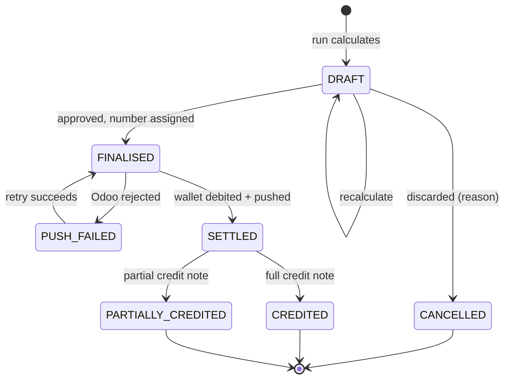

# F10 — Invoicing & Settlement

**Portal:** both · **Priority:** Must · **Phase:** 3 · **Size:** XL

---

## 1. Summary

Each month the platform calculates an invoice per customer, broken down per metering point, covering
purchased blocks, day-ahead settlement of the uncovered position, imbalance, surcharge and
energiebelasting. The invoice is pushed to Odoo for accounting and settled by debiting the wallet.

Each January it produces an annual **true-up** for the preceding year, because energiebelasting tiers
are an annual construct and because metering data can still change after a month has been invoiced.

The arithmetic is specified in [Invoice calculation](../50-calculations/03-invoice-calculation.md).
This document covers the process, the states and the controls around it.

> **Do not start building this until [OQ-14], [OQ-15] and [OQ-17] are closed.** The tariff table, the
> imbalance allocation rule and the VAT treatment each change the calculation itself, not just a
> configuration value.

## 2. User stories

| As a… | I want to… | So that… |
| --- | --- | --- |
| Finance | run the monthly invoice calculation for all customers | invoicing is one action, not fifty |
| Finance | see which customers could not be calculated and why | I can fix the cause instead of hunting |
| Finance | review a draft invoice line by line before it goes out | errors are caught before the customer sees them |
| Finance | recalculate a draft after fixing data | I don't have to start the run over |
| Finance | finalise and push to Odoo | accounting has what it needs |
| Finance | issue a credit note | a mistake can be corrected properly |
| Finance | run the January true-up | the year's tax is settled correctly |
| Customer user | see my invoices with a per-EAN breakdown | I can check and approve the charge |
| Customer user | trace an invoice line back to a trade or to my consumption | I can verify it myself |
| Customer user | download a PDF | I can file it |

## 3. Invoice run

### 3.1 Pre-flight gate

A customer is only calculated when **all** of these hold. Each failure produces a named reason, and
the run continues with the other customers.

| Check | Failure reason |
| --- | --- |
| Every delivery date in the month has interval data for every active metering point | `MISSING_METERING_DATA` |
| No metering point is in `PARTIAL` state for the month | `INCOMPLETE_METERING_DATA` |
| A day-ahead price exists for every interval of the month | `MISSING_DAY_AHEAD_PRICE` |
| Imbalance data is present for the month | `MISSING_IMBALANCE_DATA` |
| An energiebelasting tariff is loaded for the year | `MISSING_TAX_TARIFF` |
| A surcharge resolves (or the global default exists) | `MISSING_SURCHARGE` — warning only |
| No trade for the period is still in a non-terminal state | `OPEN_TRADE_IN_PERIOD` — warning only |

**Provisional data does not block the run.** Waiting for every date to reach `FINAL` would push
invoicing past the middle of the following month. Invoicing on provisional data and correcting via
the true-up is the intended design — but the invoice must state which of its dates were provisional.

## 4. Functional requirements

### Calculation

| ID | Requirement | MoSCoW |
| --- | --- | :--: |
| F10-R01 | The platform can run monthly invoicing for all customers, a subset, or a single customer. | Must |
| F10-R02 | The run is scheduled (default: the 5th of the following month) and can also be started manually. | Must |
| F10-R03 | The pre-flight gate in §3.1 runs per customer; failures skip that customer with a reason and never abort the whole run. | Must |
| F10-R04 | An invoice contains one section per metering point active during the period. | Must |
| F10-R05 | Line categories per section: block energy, spot settlement, imbalance, surcharge, energiebelasting — computed as specified in [Invoice calculation](../50-calculations/03-invoice-calculation.md). | Must |
| F10-R06 | Every line stores the inputs used: volume, unit price, the rate's source and version, and links to the causing objects. | Must |
| F10-R07 | Block lines link to their trade; spot lines link to the underlying interval range. | Must |
| F10-R08 | The engine asserts the volume identity `Σ block + Σ spot purchases − Σ spot sales = measured consumption` per metering point, to a tolerance of 0.001 MWh, and **fails the calculation** if it does not hold. | Must |
| F10-R09 | The invoice records the data state of every delivery date it covers, and shows a prominent notice when any is not `FINAL`. | Must |
| F10-R10 | A run produces a report: invoiced, skipped with reasons, failed with errors, totals. | Must |
| F10-R11 | A run is repeatable: re-running for a period recalculates drafts and never touches finalised invoices. | Must |
| F10-R12 | Calculation is deterministic — same inputs, same outputs — and the input versions are recorded so a past result can be reproduced. | Must |

### Review and finalisation

| ID | Requirement | MoSCoW |
| --- | --- | :--: |
| F10-R13 | Finance can open a draft and inspect every line with its inputs. | Must |
| F10-R14 | Finance can recalculate a draft after upstream data is corrected. | Must |
| F10-R15 | Finance can discard a draft with a reason. | Must |
| F10-R16 | Finalising assigns a sequential, gapless invoice number per legal entity per year. | Must |
| F10-R17 | A finalised invoice is immutable. Corrections go through a credit note. | Must |
| F10-R18 | Finalisation renders a PDF and stores it immutably. | Must |
| F10-R19 | Finalisation triggers the Odoo push and the wallet debit; both are retried independently and their statuses are visible. | Must |
| F10-R20 | Finance can issue a full or partial credit note against a finalised invoice, with a mandatory reason; it credits the wallet and is pushed to Odoo. | Must |
| F10-R21 | Bulk finalisation of reviewed drafts is possible, with a confirmation showing the total value. | Should |
| F10-R22 | An invoice that references a metering date later corrected is flagged `AFFECTED_BY_CORRECTION` **[F02-R20]** and listed for the true-up. | Must |

### Settlement

| ID | Requirement | MoSCoW |
| --- | --- | :--: |
| F10-R23 | Finalisation debits the wallet with a single `INVOICE_DEBIT` entry linked to the invoice. | Must |
| F10-R24 | If the balance is insufficient, the debit still applies, the wallet may go negative, an alert is raised, trading is blocked and the customer is notified **[OQ-19]**. | Must |
| F10-R25 | A credit note creates an `INVOICE_CREDIT` entry. | Must |
| F10-R26 | Invoice payment state is derived from the wallet, not tracked separately. | Must |

### Annual true-up

| ID | Requirement | MoSCoW |
| --- | --- | :--: |
| F10-R27 | Each January the platform can run an annual true-up for the previous calendar year, per customer. | Must |
| F10-R28 | The run is gated on all of the previous year's delivery dates being `FINAL` for the customer; a customer failing the gate is skipped with a reason. | Must |
| F10-R29 | The true-up recomputes energiebelasting on the final full-year volume per EAN and compares it with the sum already invoiced. | Must |
| F10-R30 | It also recomputes every volume-driven component whose inputs changed, and includes those deltas. | Must |
| F10-R31 | The result is a correction invoice or credit note carrying only the deltas, with a supporting statement showing original vs. recomputed per component per EAN. | Must |
| F10-R32 | Monthly invoices for the year are not modified. | Must |
| F10-R33 | A zero delta produces a statement, not an invoice. | Should |

### Presentation

| ID | Requirement | MoSCoW |
| --- | --- | :--: |
| F10-R34 | Customers see their invoices with per-EAN sections and can download the PDF. | Must |
| F10-R35 | Each line offers a drill-down: block lines to the trade, spot lines to the interval data, tax lines to the tier breakdown. | Should |
| F10-R36 | Customers can export invoice detail as CSV. | Should |
| F10-R37 | An invoice overview shows the last 24 months with amounts and states. | Should |

## 5. Business rules

1. **Finalised invoices are immutable.** Every correction is a new document.
2. **Numbering is gapless and sequential** per legal entity per year — a legal requirement, and the
   reason a discarded draft never consumes a number.
3. **The volume identity must hold.** Blocks plus spot purchases minus spot sales equals measured
   consumption. It is asserted, printed on the invoice, and treated as a hard failure — it is the
   cheapest possible detector of a coverage or calendar bug.
4. **Every line is reconstructable** from stored inputs, without re-reading current reference data.
5. **Provisional data is disclosed**, never hidden.
6. **The true-up corrects; it does not replace.**
7. **Odoo receives finalised documents only.** Drafts never leave the platform.
8. **Wallet settlement and Odoo push are independent.** One failing must not roll back the other; both
   are retried and monitored.

## 6. Invoice state machine

## 7. Screens

| Screen | Mockup |
| --- | --- |
| Customer invoice detail | [`invoice-detail.svg`](../60-mockups/invoice-detail.svg) |
| Employee invoice run dashboard | [`employee-invoice-run.svg`](../60-mockups/employee-invoice-run.svg) |

## 8. Data

| Entity | Purpose |
| --- | --- |
| `invoice_run` | period, scope, trigger, state, counts, report |
| `invoice` | customer, period, number, state, totals, PDF reference, Odoo reference |
| `invoice_section` | Per metering point |
| `invoice_line` | category, description, volume, unit price, amount, rate source, links |
| `invoice_data_state` | Per delivery date covered: the data state at calculation time |
| `credit_note` | Links to the original invoice, reason, lines |

## 9. Edge cases

| Case | Behaviour |
| --- | --- |
| Customer joined mid-month | Only their valid period is invoiced; the section shows the partial period |
| EAN transferred between customers mid-month | Each customer's invoice covers only their own period; combined volumes never cross |
| Zero consumption for an EAN | Section still appears with zero-volume lines, so the customer sees it was considered |
| Block covers a month with no consumption data | Blocked by the pre-flight gate |
| Negative invoice total (heavy surplus at high prices) | Produced as a credit note rather than an invoice with a negative total |
| Correction arrives between finalisation and the Odoo push | Push proceeds; the invoice is flagged for true-up |
| Odoo rejects the push | State `PUSH_FAILED`, retried with backoff, visible on the dashboard; the wallet debit is unaffected |
| Two runs started for the same period concurrently | Second is refused; runs are exclusive per period |
| Energiebelasting tariff for the year not loaded | Pre-flight failure `MISSING_TAX_TARIFF`; nothing is invoiced with a guessed rate |
| Customer closed mid-year | Final invoice on closure, then a true-up covering their partial year |

## 10. Out of scope

- Payment terms, dunning, receivables ageing (Odoo's job) **[AS-12]**.
- Network/transport cost billing **[OQ-18]**.
- Gas invoicing **[OQ-01]**.
- Consolidated invoicing across group entities.

## 11. Dependencies

| Depends on | Why |
| --- | --- |
| [F02](F02-metering-data-ingestion.md) | Volumes and imbalance |
| [F05](F05-energy-block-trading.md) | Blocks |
| [F06](F06-wallet-and-ledger.md) | Settlement |
| [F08](F08-day-ahead-prices.md) | Spot prices |
| [F09](F09-surcharges.md) | Surcharge rates |
| [Odoo integration](../30-integrations/04-odoo-accounting.md) | Push |
| [Invoice calculation](../50-calculations/03-invoice-calculation.md) | The arithmetic |

## 12. Open questions

| Ref | Question |
| --- | --- |
| [OQ-13] | Surplus settlement policy |
| [OQ-14] | Energiebelasting tariffs, credits and exemptions |
| [OQ-15] | Imbalance allocation to EANs |
| [OQ-17] | VAT treatment |
| [OQ-18] | Network/transport costs in scope? |
| [OQ-19] | Wallet behaviour on insufficient funds |
| [OQ-37] | Who owns invoice numbering — the platform or Odoo? |
| [OQ-38] | Is the invoice PDF generated by the platform or by Odoo? |
| [OQ-39] | Are invoices emailed to customers, or portal-only? |
