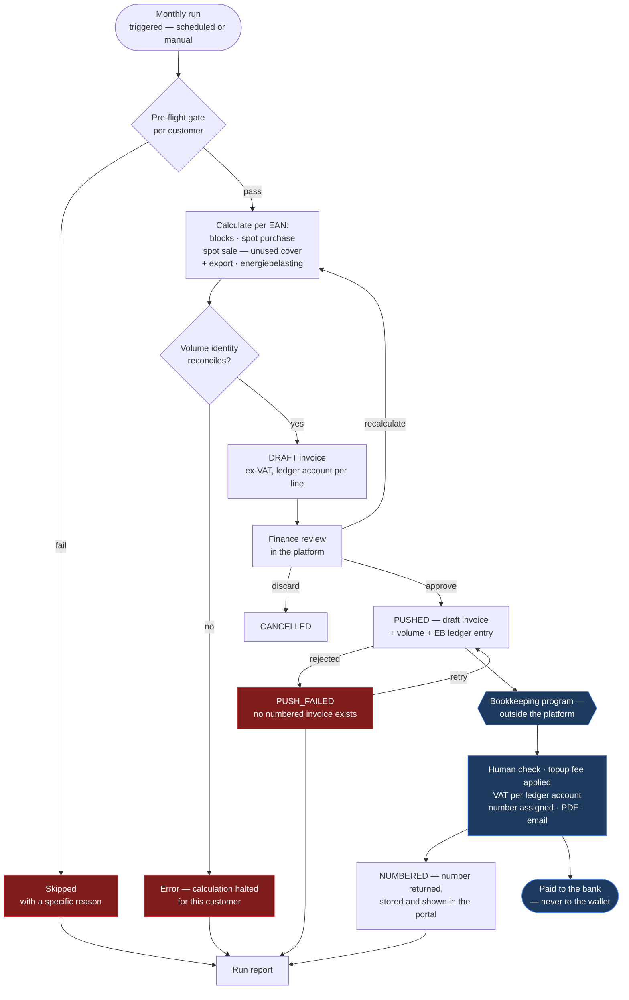
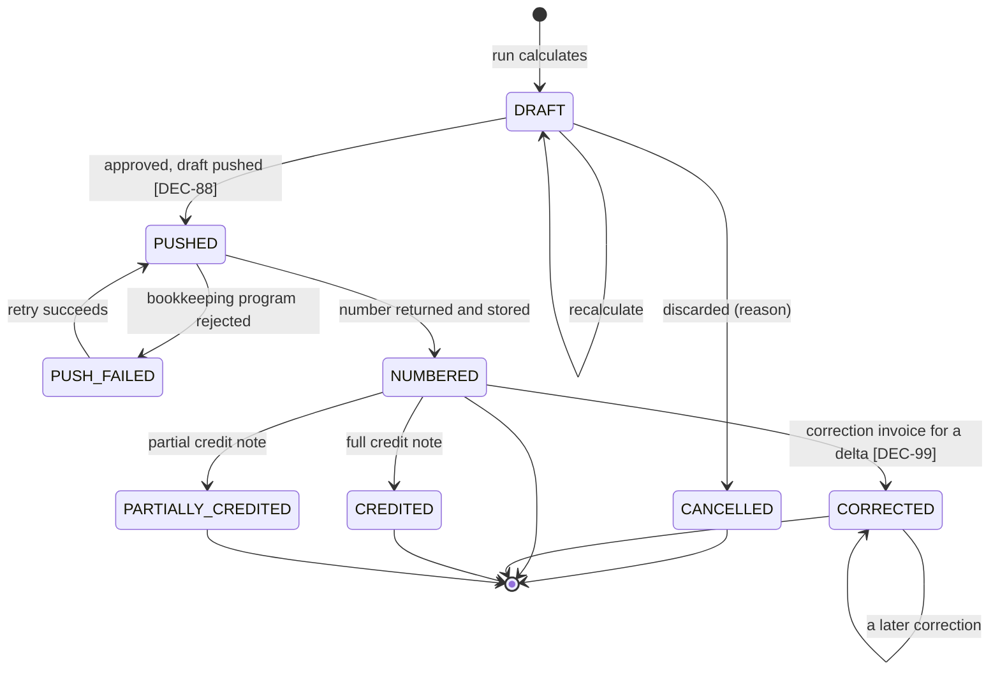

# F10 — Invoicing & Settlement

**Portal:** both · **Priority:** Must · **Phase:** 3 · **Size:** ~~L~~ **XL** ⚠ *(2026-08-19 — the
degressive tax engine returns with **[DEC-74]** and the correction path becomes continuous with
**[DEC-99]**; see §1)*

---

## 1. Summary

~~Each month the platform calculates an invoice per customer, broken down per metering point, covering
purchased blocks, day-ahead settlement of the open position, the surcharge and the feed-in credit on
exported volume. The invoice is pushed to Odoo for accounting and settled by debiting the wallet.~~

⚠ **Rewritten 2026-08-19 by [DEC-73], [DEC-74], [DEC-77], [DEC-87], [DEC-88], [DEC-89].** Each month
the platform **calculates** an invoice per customer, broken down per metering point, covering
purchased blocks, day-ahead settlement of the open position — which now includes exported volume —
and **energiebelasting**. It pushes that calculation as a **draft** to the **bookkeeping program**,
which a human checks there; that program assigns the invoice number, generates the PDF and emails it.
The invoice is paid **to the bank**. It is never settled from the wallet.

### 1.1 Line inventory after 2026-08-19

Three of the six line categories are live. Two of the three that are not were removed *this round*,
which is the largest single change to this document since it was written.

| Line | Category | Status | Driving decision |
| :--: | --- | --- | --- |
| **1** | Block energy | **In.** €/MWh, linked to the trade | [DEC-23] |
| **2** | Spot settlement — a **purchase leg** and a separate **sale leg** | **In, and it grew.** The sale leg now carries **unused block cover *and* physical export**, both at the raw day-ahead price | [DEC-23], [DEC-44] first half, **[DEC-87]** |
| **3** | Imbalance | **Out, confirmed.** ⚠ The source added the reason on OQ-15: **"We take the full imbalance risk"** — PeakPower absorbs imbalance cost entirely rather than allocating it. This is a margin exposure, not a billing gap | [DEC-25] |
| ~~**4**~~ | ~~Surcharge~~ | ⚠ **Removed 2026-08-19 by [DEC-73]**, reversing [DEC-35]. The platform pushes **volume**; the bookkeeping program multiplies it by the topup fee. The surcharge tariff table and its resolution order leave the platform with the line | **[DEC-73]** |
| **5** | Energiebelasting | ⚠ **Back in scope 2026-08-19 by [DEC-74]**, reversing [DEC-24]. Versioned bracket table, per-customer reductions, per EAN per calendar year on net usage **[DEC-22]**, pushed as a **ledger entry** | **[DEC-74]** |
| ~~**6**~~ | ~~Feed-in on exported volume~~ | ⚠ **Removed 2026-08-19 by [DEC-87]**, reversing the second half of [DEC-44]. Export is credited **raw at the day-ahead price** on line 2's sale leg, exactly as surplus is under **[DEC-23]** | **[DEC-87]** |

Numbers 3, 4 and 6 stay **reserved, never reused**. The platform's only margin instrument on the
delivery side is now the **spread on the price it quotes [DEC-80]** — line 4 was the other one.

The volume basis is **net usage** = consumption − production, per interval per metering point
**[DEC-22]**. ~~Where net usage is negative the interval is an **export**, and **[DEC-44]** takes it
out of the day-ahead leg: it is credited at a per-customer **feed-in tariff** on **line 6**. Unused
block cover continues to settle at the day-ahead price **[DEC-23]** on line 2's sale leg. Purchase,
sale and feed-in are **three separate lines, never netted against each other** — the three volumes
occur at different times and now at three different prices.~~
⚠ **Reversed 2026-08-19 by [DEC-87].** Where net usage is negative the interval is an **export**, and
it goes back onto **line 2's sale leg at the raw day-ahead price** — there is no feed-in tariff and no
line 6. The sale leg therefore carries two volume sources, unused block cover and physical export, at
**one** price. Purchase and sale remain **two separate legs, never netted against each other**: they
occur at different times, and netting them would hide the coverage error the volume identity exists to
catch **[F10-R08]**.

> ~~**Two unit systems, deliberately. [DEC-35], [DEC-44].** Market prices — block prices and
> day-ahead — are **€/MWh**. The two per-customer rates, surcharge and feed-in tariff, are **€/kWh**,
> applied to kWh volumes with **no conversion**. Lines 4 and 6 therefore carry no `/1000` where every
> other line does. Both rate columns need **7 decimal places** to keep the granularity the platform
> had before the unit changed — [Invoice calculation](../50-calculations/03-invoice-calculation.md)
> §6.1.~~
>
> ⚠ **Amended 2026-08-19 by [DEC-73], [DEC-87], [DEC-74].** Two unit systems, still — but the €/kWh
> side has changed hands entirely. Both per-customer rates that motivated the callout are gone
> (surcharge with line 4, feed-in tariff with line 6). Market prices — block prices and day-ahead —
> are **€/MWh** on lines 1 and 2. The **energiebelasting bracket rates on line 5 are €/kWh**, applied
> to kWh volumes with **no conversion**, so **line 5** is now the only line carrying no `/1000`. The
> trap does not disappear, it moves: a €/kWh figure read as €/MWh is still wrong by exactly 1000 while
> looking plausible. The rate column keeps **7 decimal places** —
> [Invoice calculation](../50-calculations/03-invoice-calculation.md) §6.1.

The arithmetic is specified in [Invoice calculation](../50-calculations/03-invoice-calculation.md).
This document covers the process, the states and the controls around it.

> ~~**Deferred scope — two of the six line categories are not implemented.**~~
> ⚠ **Amended 2026-08-19.** Three are not implemented, and they are not the same three.
>
> **Imbalance, line 3 — [DEC-25].** Out of scope, **confirmed** by the source: *"We take the full
> imbalance risk"*. PVNed `A12` documents are stored but never turned into charges **[F02]**. This
> moots [AS-18] and the allocation-key question, and removes the requirement to state an allocation
> method in the customer contract. ⚠ What the confirmation adds is the *reason the customer never sees
> a line*: PeakPower absorbs the imbalance cost itself. It is a **margin exposure carried by
> PeakPower**, not an omission, and it belongs on the risk register rather than on the invoice.
>
> ~~**Energiebelasting, line 5 — [DEC-24].** Out of scope *for now*. `IEnergyTaxCalculator` and the
> `billing.energy_tax_tariff` table stay in the model, **unpopulated**, so the calculation drops in
> rather than being retrofitted through the invoice engine. ⚠ **EB is a legal obligation, not a
> feature: it must be reopened before a single invoice is issued to a real customer.**~~
> ⚠ **Reversed 2026-08-19 by [DEC-74]** — reopened, exactly as the warning above demanded and before
> the first real invoice. `IEnergyTaxCalculator` and `billing.energy_tax_tariff` **stop being
> unpopulated placeholders**: the bracket table is versioned and editable, a per-customer reduction or
> exemption covers the minority who do not pay the standard rate (growers are the named example), the
> calculation runs **per EAN per calendar year on net usage [DEC-22]**, and the result is **pushed as
> a ledger entry** to the bookkeeping program. The detail — bracket shape, versioning, resolution and
> the mid-year transfer split — lives in **[F09 — Tariffs & Energiebelasting](F09-surcharges.md)**,
> which took over the reference-data role that surcharges vacated **[DEC-73]**.
>
> ~~**Surcharge, line 4.**~~ Not deferred — **removed**. ⚠ **[DEC-73]**, reversing **[DEC-35]**: the
> platform pushes **volume** per EAN per month and the bookkeeping program applies the topup fee.
> Nothing about it is retrofittable into the invoice engine because nothing about it stays here.
>
> ~~**The January annual true-up goes with it.** Tier crossings were its principal reason to exist, so
> it is deferred alongside EB, keeping only a residual role for late metering corrections — see §4.~~
> ⚠ **Reversed in part 2026-08-19.** Tier crossings are back with **[DEC-74]**, so the annual run is
> back — but only for what is genuinely annual. **[DEC-99]** takes the late-metering-correction role
> *out* of it and makes it continuous. See §4.
>
> The true-up requirements **F10-R27..R33** keep their IDs; those that return lose the `Deferred` tag,
> those the continuous path replaces are struck in place. Imbalance still carries no numbered
> requirement. Nothing is deleted and nothing is renumbered.
>
> ~~**Size changed: XL → L.** The degressive tax engine, the imbalance allocation and the annual
> true-up were three of the four things that made this XL. It returns to **XL** when [DEC-24] is
> reopened.~~ ⚠ **Size is back to XL 2026-08-19.** [DEC-24] *was* reopened, by **[DEC-74]**: the
> degressive tax engine and the annual tier close return, and **[DEC-99]** adds a correction-invoice
> path that runs at any time. What comes off — the surcharge line **[DEC-73]**, the feed-in line and
> its tariff resolution **[DEC-87]**, VAT computation **[DEC-76]**, wallet settlement **[DEC-77]**,
> numbering, the PDF and the email **[DEC-88]**, **[DEC-89]** — is real but smaller than what returns.

> ~~**Added scope — [DEC-44] adds a sixth line category.** Feed-in on exported volume is **line 6**,
> settled at a per-customer feed-in tariff rather than at day-ahead. It takes the next free line
> number; nothing is renumbered, and the reserved 3 and 5 stay reserved. New requirements
> **F10-R39..R42**, one new pre-flight check, a new reference-data dependency on
> [F09](F09-surcharges.md), and a **changed volume identity** in F10-R08. The size tag stays **L**:
> the new line is one more application of machinery that already exists, unlike the tax engine.~~
>
> ⚠ **Reversed 2026-08-19 by [DEC-87].** Line 6 is withdrawn before it was built. Export settles raw
> at day-ahead on line 2's sale leg **[DEC-23]**. **F10-R39**, **F10-R40** and **F10-R42** are struck,
> the `MISSING_FEED_IN_TARIFF` pre-flight check and the month-skip it caused are removed, the feed-in
> reference-data dependency on [F09](F09-surcharges.md) disappears (replaced by an energiebelasting
> one **[DEC-74]**), and the volume identity in **F10-R08** reverts to three terms. **F10-R41**
> survives, amended: exported volume is still worth printing, now as a component of line 2.

> **Readiness.** ~~[OQ-14] and [OQ-15] are closed *by deferral* ([DEC-24], [DEC-25]).~~ ⚠ **[OQ-14]
> now closes on substance, not by deferral — [DEC-74]** gives it brackets, per-customer reductions and
> a ledger push. It hands on one residual: whether the **vermindering** (the fixed annual reduction
> per connection) applies — **[OQ-96]**. [OQ-15] stays closed by **[DEC-25]**, now with a stated
> reason: PeakPower takes the full imbalance risk. [OQ-35] is closed by **[DEC-44]**'s first half —
> the raw day-ahead price, no spread — while its second half is **reversed by [DEC-87]**, and
> **[OQ-86]** (the feed-in fallback) **closes with the tariff that raised it**.
>
> ~~[OQ-17] is now closed on its first half: **[DEC-26]** makes all prices, balances and reservations
> VAT-exclusive with VAT added at invoice level, and **[DEC-64]** fixes the rate at **21% on every
> line category, with no exemptions and no reverse-charge cases**, closing [OQ-82]. **[OQ-83] remains
> open** — whether `INVOICE_DEBIT` settles the VAT-exclusive subtotal or the VAT-inclusive total.
> Settle it before wallet settlement is built: a reservation sized ex-VAT under-covers an inclusive
> debit by the VAT rate **[F06]**, and **[DEC-41]** removed the buffer that would have absorbed it.~~
> ⚠ **Amended 2026-08-19 by [DEC-76] and [DEC-77].** The platform computes **no VAT at all**. It
> pushes **ex-VAT amounts against a ledger account** and the bookkeeping program applies that
> account's rate. **[DEC-64]** survives only as the **reference rate** that **[DEC-78]** needs to
> gross up a trade reservation. **[OQ-83] is no longer this document's question**: **[DEC-77]** deletes
> `INVOICE_DEBIT`, so there is no invoice debit whose base could be in doubt; the surviving half —
> what a *trade* reservation is sized at — is answered VAT-**inclusive** by **[DEC-78]** in
> [F05](F05-energy-block-trading.md) and [F06](F06-wallet-and-ledger.md).
>
> ~~One question is **newly open and owned here**: **[DEC-44] does not say what applies when a customer
> exports and no feed-in tariff resolves** — zero, or day-ahead as a fallback. Both are defensible and
> they differ in money. It is described in [F09](F09-surcharges.md) §11.1 and needs a decision ID of
> its own.~~ ⚠ **Closed 2026-08-19 by [DEC-87]** without ever being decided on its own terms: with no
> feed-in tariff there is nothing to fail to resolve, and the answer turns out to be the day-ahead
> price for every exporting interval, not only the unresolved ones.
>
> One question is **newly open and owned here**: **[OQ-92] — are the hedge and the day-ahead delivery
> one invoice document or two?** See §12.

## 2. User stories

| As a… | I want to… | So that… |
| --- | --- | --- |
| Finance | run the monthly invoice calculation for all customers | invoicing is one action, not fifty |
| Finance | see which customers could not be calculated and why | I can fix the cause instead of hunting |
| Finance | review a draft invoice line by line before it goes out | errors are caught before the customer sees them |
| Finance | recalculate a draft after fixing data | I don't have to start the run over |
| Finance | ~~finalise and push to Odoo~~ push the checked draft to the **bookkeeping program** ⚠ **[DEC-88]** | it can be checked once more there, numbered and issued |
| Finance | see the invoice number the bookkeeping program returned, next to the calculation that produced it ⚠ *new — **[DEC-88]*** | I can reconcile the two systems without exporting either |
| Finance | know immediately when a push failed ⚠ *new — **[DEC-88]*** | a failed push means the customer has **no numbered invoice at all**, not merely a delayed one |
| Finance | issue a credit note | a mistake can be corrected properly |
| Finance | invoice a metering correction the moment it lands, months after the month closed ⚠ *new — **[DEC-99]**, **[DEC-98]*** | a late correction is settled instead of accumulating as a flag |
| ~~Finance~~ **Finance** | ~~run the January true-up~~ run the annual energiebelasting close per EAN ⚠ **Reinstated and narrowed 2026-08-19 by [DEC-74]** and **[DEC-99]** | ~~the year's tax is settled correctly~~ the calendar-year tiers are settled correctly; late metering is no longer this run's job |
| Customer user | see my invoices with a per-EAN breakdown | I can check and approve the charge |
| ~~Customer user~~ | ~~see what I was credited for the energy I exported, and at what rate~~ ⚠ **Amended 2026-08-19 by [DEC-87]** — there is no feed-in rate; **see what I was credited for the energy I exported** stands, at the **day-ahead price** on line 2's sale leg | ~~the feed-in line is verifiable too **[DEC-44]**~~ the export credit is verifiable against a published market price **[DEC-23]** |
| Customer user | see the energiebelasting I am charged and which bracket produced it ⚠ *new — **[DEC-74]*** | a legally required charge is checkable, not a lump sum |
| Customer user | trace an invoice line back to a trade or to my consumption | I can verify it myself |
| ~~Customer user~~ | ~~download a PDF~~ ⚠ **Amended 2026-08-19 by [DEC-89]** — the PDF is generated and emailed by the **bookkeeping program**; the portal shows the **calculated invoice data** with the returned number | ~~I can file it~~ I can file the document that arrived by email and check it against the portal |

## 3. Invoice run

⚠ **Redrawn 2026-08-19.** The old diagram ended at `SETTLED` with two parallel arms, *Push to Odoo*
and *Debit wallet*. **[DEC-77]** removes the wallet arm entirely and **[DEC-88]** moves the moment a
number exists across the system boundary, so the run no longer ends inside the platform.

**Read the boundary carefully.** Everything below `BK` is the bookkeeping program's, and the platform
observes it only through the returned number **[DEC-88]**. Three things the platform used to do sit on
the far side now: the **topup fee** applied to the pushed volume **[DEC-73]**, **VAT** applied per
ledger account **[DEC-76]**, and the **number, PDF and email** **[DEC-88]**, **[DEC-89]**.

### 3.1 Pre-flight gate

A customer is only calculated when **all** of these hold. Each failure produces a named reason, and
the run continues with the other customers.

| Check | Failure reason |
| --- | --- |
| Every delivery date in the month has interval data for every active metering point, **in both directions** — consumption and production, since the basis is net usage **[DEC-22]** | `MISSING_METERING_DATA` |
| No metering point is in `PARTIAL` state for the month | `INCOMPLETE_METERING_DATA` |
| A day-ahead price exists for every interval of the month — **including every interval in which the metering point exported [DEC-87]** | `MISSING_DAY_AHEAD_PRICE` |
| ~~A surcharge resolves (or the global default exists)~~ ⚠ **Removed 2026-08-19 by [DEC-73]** — there is no surcharge to resolve | ~~`MISSING_SURCHARGE` — warning only~~ |
| ~~A feed-in tariff resolves for every interval in which the metering point exported **[DEC-44]**~~ ⚠ **Removed 2026-08-19 by [DEC-87]** — there is no feed-in tariff to resolve, so nothing can fail to resolve | ~~`MISSING_FEED_IN_TARIFF` — **hard skip where there is export**, warning only where there is none. See F10-R39~~ |
| An energiebelasting bracket table is loaded and in force for the calendar year, and the customer's reduction or exemption resolves ⚠ *reinstated 2026-08-19 by **[DEC-74]*** | `MISSING_TAX_TARIFF` — **hard skip.** EB is a legal charge; the run must not invoice around it |
| No trade for the period is still in a non-terminal state | `OPEN_TRADE_IN_PERIOD` — warning only |

~~**One check was added, and it is asymmetric with `MISSING_SURCHARGE` on purpose.** A missing
surcharge bills nothing and costs the customer nothing, so it is a warning. A missing feed-in tariff
would value exported energy at zero — and whether zero is the right answer is **not decided by
[DEC-44]** ([F09](F09-surcharges.md) §11.1). Until it is, the run refuses rather than defaults, but
only for the customers where the difference is real: no export in the month means no volume and no
money at stake.~~

⚠ **Rewritten 2026-08-19.** Both halves of that paragraph are gone: `MISSING_SURCHARGE` with
**[DEC-73]** and `MISSING_FEED_IN_TARIFF` with **[DEC-87]**. The asymmetry they argued about no longer
exists, and neither does the month-skip: a month with export is now priced from the same day-ahead
curve as a month without one, so the only price the gate has to find is the one it already required.
`MISSING_TAX_TARIFF` takes the hard-skip role instead, and for a stronger reason than the feed-in
check ever had — energiebelasting is a legal obligation, so invoicing without it is not a valuation
choice but a wrong invoice.

**Check history, and by which decision:**

| Check | Status | Decision |
| --- | --- | --- |
| `MISSING_IMBALANCE_DATA` | **Removed, still removed.** Imbalance produces no charge, so its absence cannot make an invoice wrong. Confirmed 2026-08-19: PeakPower takes the full imbalance risk | **[DEC-25]** |
| `MISSING_TAX_TARIFF` | Removed by [DEC-24] — ⚠ **reinstated 2026-08-19, unchanged**, exactly as this table promised it would be | **[DEC-24]** → **[DEC-74]** |
| ~~`MISSING_SURCHARGE`~~ | ⚠ **Removed 2026-08-19.** The surcharge left the platform; the reason code is retired, not repurposed | **[DEC-73]** |
| ~~`MISSING_FEED_IN_TARIFF`~~ | ⚠ **Removed 2026-08-19** before it was ever built. Retired, not repurposed | **[DEC-87]** |

No reason code is repurposed. `MISSING_IMBALANCE_DATA` comes back unchanged if [DEC-25] is reopened;
the two retired this round come back only if the platform takes surcharges or a feed-in tariff back,
which is a product decision, not a deferral.

**Provisional data does not block the run.** Waiting for every date to reach `FINAL` would push
invoicing past the middle of the following month. Invoicing on provisional data is the intended
design — but the invoice must state which of its dates were provisional. ~~⚠ The correction path for
those dates was the annual true-up, which **[DEC-24]** defers: until it returns, a late correction
leaves a finalised invoice flagged `AFFECTED_BY_CORRECTION` **[F02-R20]** with no automatic
settlement of the delta. Corrections accumulate; they are not lost, but nor are they cleared.~~

⚠ **Reversed 2026-08-19 by [DEC-99] and [DEC-98].** Provisional data is now *cheap* rather than
merely tolerated. PVNed **does** supply reconciliation data after the 10-working-day window, sometimes
as a manual process **[DEC-98]** — which reverses **[DEC-57]** and is what makes late corrections
real — and a correction that changes an already-invoiced volume produces a **correction invoice for
the delta whenever it lands**, months later included **[DEC-99]**. `AFFECTED_BY_CORRECTION`
**[F02-R20]** stops being a flag that accumulates and becomes a **trigger**. The monthly run is no
longer a gate that closes; it is the first pass at a month that can be revisited any number of times.
Cost: correction invoices are routine rather than exceptional, and **[DEC-100]** forbids netting or
waiving the small ones — see **[F10-R50]** and risk **[R-20]**.

## 4. Functional requirements

### Calculation

| ID | Requirement | MoSCoW |
| --- | --- | :--: |
| F10-R01 | The platform can run monthly invoicing for all customers, a subset, or a single customer. | Must |
| F10-R02 | The run is scheduled (default: the 5th of the following month) and can also be started manually. | Must |
| F10-R03 | The pre-flight gate in §3.1 runs per customer; failures skip that customer with a reason and never abort the whole run. | Must |
| F10-R04 | An invoice contains one section per metering point active during the period. | Must |
| F10-R05 | ~~Line categories per section: **1** block energy, **2** spot settlement — presented as a **purchase line and a separate sale line, never netted [DEC-23]**, the sale leg carrying **unused block cover only [DEC-44]** — **4** surcharge, and **6** feed-in on exported volume **[DEC-44]**, all computed as specified in [Invoice calculation](../50-calculations/03-invoice-calculation.md). Category **3** imbalance is deferred **[DEC-25]** and category **5** energiebelasting is deferred **[DEC-24]**; their numbers are reserved, not reused, and feed-in takes the next free number rather than a reserved one.~~ ⚠ **Amended 2026-08-19.** Line categories per section: **1** block energy, **2** spot settlement — a **purchase leg and a separate sale leg, never netted [DEC-23]**, the sale leg carrying **unused block cover *and* physical export, both at the raw day-ahead price [DEC-87]** — and **5** energiebelasting **[DEC-74]**. Category **3** imbalance stays out of scope **[DEC-25]**; category **4** surcharge is **removed [DEC-73]**; category **6** feed-in is **removed [DEC-87]**. All three numbers are reserved, never reused. See §1.1. | Must |
| F10-R06 | ~~Every line stores the inputs used: volume, unit price **with its unit — €/MWh for lines 1 and 2, €/kWh for lines 4 and 6 [DEC-35], [DEC-44]** — the rate's source and version, and links to the causing objects.~~ ⚠ **Amended 2026-08-19 by [DEC-73], [DEC-87], [DEC-74], [DEC-76].** Every line stores the inputs used: volume, unit price **with its unit — €/MWh for lines 1 and 2, €/kWh for line 5's bracket rates** — the rate's source and version, links to the causing objects, and **the ledger account the amount is pushed against [DEC-76]**. All amounts are **ex-VAT**; the platform stores no VAT figure. | Must |
| F10-R07 | ~~Block lines link to their trade; spot and feed-in lines link to the underlying interval range.~~ ⚠ **Amended 2026-08-19 by [DEC-87]** — there are no feed-in lines. Block lines link to their trade; spot lines link to the underlying interval range, and the sale leg distinguishes the **unused-cover** intervals from the **exporting** intervals even though both price identically **[F10-R41]**. Line 5 links to the calendar-year volume and the bracket version that produced each tier amount **[DEC-74]**. | Must |
| F10-R08 | ~~The engine asserts the volume identity `Σ block + Σ spot purchases − Σ unused cover − Σ feed-in volume = net usage` per metering point~~ ⚠ **Amended 2026-08-19 by [DEC-87].** The engine asserts the volume identity **`Σ block + Σ spot purchases − Σ sale volume = net usage`** per metering point, where **`Σ sale volume = Σ unused cover + Σ export`**, to a tolerance of 0.001 MWh, and **fails the calculation** if it does not hold. Net usage is `Σ consumption − Σ production` over the same intervals **[DEC-22]**. The four-term form **[DEC-44]** introduced collapses back to three because export and unused cover now settle on the same leg at the same price; the two are still counted separately for presentation, but they no longer need separate terms to balance. The identity carries no imbalance term because imbalance contributes no volume **[DEC-25]**, and no energiebelasting term because line 5 charges the *same* net usage rather than adding volume to it **[DEC-74]**. The authoritative statement and its proof are in [Invoice calculation](../50-calculations/03-invoice-calculation.md) §11.1. | Must |
| F10-R09 | The invoice records the data state of every delivery date it covers, and shows a prominent notice when any is not `FINAL`. | Must |
| F10-R10 | A run produces a report: invoiced, skipped with reasons, failed with errors, totals. | Must |
| F10-R11 | A run is repeatable: re-running for a period recalculates drafts and never touches finalised invoices. | Must |
| F10-R12 | Calculation is deterministic — same inputs, same outputs — and the input versions are recorded so a past result can be reproduced. | Must |

### Review and push — ~~Review and finalisation~~

⚠ **Retitled 2026-08-19 by [DEC-88].** There is no platform-side finalisation any more. The platform's
last act on an invoice is to **push a draft**; everything the word "finalisation" used to mean —
numbering, the PDF, issuing — happens in the bookkeeping program after a human check.

| ID | Requirement | MoSCoW |
| --- | --- | :--: |
| F10-R13 | Finance can open a draft and inspect every line with its inputs. | Must |
| F10-R14 | Finance can recalculate a draft after upstream data is corrected. | Must |
| F10-R15 | Finance can discard a draft with a reason. | Must |
| ~~F10-R16~~ | ~~Finalising assigns a sequential, gapless invoice number per legal entity per year.~~ ⚠ **Retired 2026-08-19 by [DEC-88]**, which reverses **[DEC-45]**. The platform never mints a number. Replaced by **[F10-R44]** (push a draft, store the returned number) and **[F10-R45]** (what a push failure costs). | ~~Must~~ |
| F10-R17 | ~~A finalised invoice is immutable. Corrections go through a credit note.~~ ⚠ **Amended 2026-08-19 by [DEC-88]** and **[DEC-99]**. A **pushed** invoice is immutable in the platform from the moment it is pushed, not from a platform-side finalisation that no longer exists. Corrections go through a **correction invoice for the delta [DEC-99]** or a credit note **[F10-R20]**; both are new documents, both are pushed as drafts, and both are numbered by the bookkeeping program. | Must |
| ~~F10-R18~~ | ~~Finalisation renders a PDF and stores it immutably.~~ ⚠ **Retired 2026-08-19 by [DEC-89]**, which reverses **[DEC-46]**. The bookkeeping program generates the PDF and emails it. Replaced by **[F10-R46]**. | ~~Must~~ |
| ~~F10-R19~~ | ~~Finalisation triggers the Odoo push and the wallet debit; both are retried independently and their statuses are visible.~~ ⚠ **Retired 2026-08-19 by [DEC-77]** — there is no wallet debit, so there are no longer two independent arms to retry. Replaced by **[F10-R44]** and **[F10-R45]**: one push, retried, with a visible status. | ~~Must~~ |
| F10-R20 | Finance can issue a full or partial credit note against a ~~finalised~~ **numbered** invoice, with a mandatory reason; ~~it credits the wallet and is pushed to Odoo~~ ⚠ **Amended 2026-08-19 by [DEC-77]** and **[DEC-88]** — it credits **nothing in the wallet** and is pushed to the bookkeeping program **as a draft**, which numbers and issues it like any other document. The refund itself, if any, is a bank movement handled there **[DEC-85]**. | Must |
| F10-R21 | ~~Bulk finalisation~~ **Bulk push** of reviewed drafts is possible, with a confirmation showing the total value ⚠ *(amended 2026-08-19 — there is no finalisation step; the confirmation now also shows how many drafts will be created in the bookkeeping program, which under **[OQ-92]** may be one or two per customer)*. | Should |
| F10-R22 | An invoice that references a metering date later corrected is flagged `AFFECTED_BY_CORRECTION` **[F02-R20]** ~~and listed for the true-up. ⚠ The **capture** side stays Must under **[DEC-24]** — flags must still be set and must accumulate — but the **settlement** side is deferred with F10-R27…R33, so flagged invoices have no live correction path until the true-up returns.~~ ⚠ **Amended 2026-08-19 by [DEC-99]** — the flag now **triggers a correction invoice for the delta [F10-R49]** instead of accumulating for an annual run. Capture and settlement are both live; nothing waits for January. | Must |

### Settlement

⚠ **Rewritten completely on 2026-08-19 by [DEC-77], which reverses [AS-12].** The wallet is no longer
the settlement primitive for delivery. There are **two money paths and they do not meet**:

| Path | What moves | Where it lives | Rule |
| --- | --- | --- | --- |
| **Trading** | Reservation on request, debit on execution | Entirely inside the **wallet** | A customer can only trade within their balance, which is what makes **[AS-11]** (no negative balance) hold without a credit concept **[DEC-41]**. The reserved and debited amount is **VAT-inclusive [DEC-78]** even though prices are quoted and stored ex-VAT **[DEC-26]** |
| **Delivery** | The monthly invoice — day-ahead purchase and sale, export, energiebelasting | Pushed to the **bookkeeping program** as a draft **[DEC-88]**, collected **to the bank** | It **never touches the wallet**. No debit, no reservation, no balance check, and no route by which an invoice can drive a balance negative |

Consequences, stated plainly because they delete behaviour that was specified in detail here:

- The `INVOICE_DEBIT` wallet entry type is **removed** **[DEC-77]**, **[F06]**.
- **[OQ-19]** — full debit into negative, or partial settlement with a receivable — **closes**. The
  wallet is never asked to cover an invoice, so the question has no subject.
- **[OQ-83]** loses its F10 half with the entry it was about. Its surviving half, how a *trade*
  reservation is sized, is answered VAT-**inclusive** by **[DEC-78]** in
  [F05](F05-energy-block-trading.md) and [F06](F06-wallet-and-ledger.md).
- Receivables, dunning and payment matching for delivery invoices are the bookkeeping program's
  **[DEC-105]**; the platform holds **no** payment state of its own.
- Cost: the platform loses the one control that guaranteed an invoice was funded before it was issued.
  Delivery is now sold on credit, in the ordinary commercial sense, and credit risk moves to whoever
  chases the bank payment. That is a deliberate trade for not making customers pre-fund consumption
  they have already had.

| ID | Requirement | MoSCoW |
| --- | --- | :--: |
| ~~F10-R23~~ | ~~Finalisation debits the wallet with a single `INVOICE_DEBIT` entry linked to the invoice. Whether that entry carries the VAT-**exclusive** subtotal or the VAT-**inclusive** total is **open — [OQ-83]**, left open explicitly by **[DEC-64]** — and must be answered before this is built. The wallet itself is VAT-exclusive **[DEC-26]**, **[F06-R02]**, and **[DEC-64]** now makes the gap exactly 21% of the subtotal on every invoice.~~ ⚠ **Retired 2026-08-19 by [DEC-77]**, which reverses **[AS-12]**. Delivery invoices are paid to the bank. Replaced by **[F10-R48]**. | ~~Must~~ |
| ~~F10-R24~~ | ~~If the balance is insufficient, the debit still applies, the wallet may go negative, an alert is raised, trading is blocked and the customer is notified **[OQ-19]**.~~ ⚠ **Retired 2026-08-19 by [DEC-77]** — no debit, therefore no insufficiency, therefore no negative balance. **[OQ-19]** closes with it. **[DEC-90]** separately removes balance thresholds and low-balance alerts. | ~~Must~~ |
| ~~F10-R25~~ | ~~A credit note creates an `INVOICE_CREDIT` entry.~~ ⚠ **Retired 2026-08-19 by [DEC-77]** — a credit note is a document pushed to the bookkeeping program **[F10-R20]**, not a wallet movement. | ~~Must~~ |
| ~~F10-R26~~ | ~~Invoice payment state is derived from the wallet, not tracked separately.~~ ⚠ **Retired 2026-08-19 by [DEC-77]** and **[DEC-105]**. Replaced by **[F10-R48]**: the platform derives payment state from nothing and shows none; the bookkeeping program owns it. | ~~Must~~ |

### Annual true-up — ~~deferred by [DEC-24]~~ ⚠ **reinstated and narrowed 2026-08-19**

~~**Deferred, not deleted.** Degressive energiebelasting tiers were the principal reason this process
existed; with EB out of scope **[DEC-24]** the true-up is deferred alongside it, keeping only its
residual role of correcting late metering data. Every requirement below keeps its ID and its place.
All were **Must** except F10-R33, which was **Should**. They are reinstated unchanged when EB is
reopened — which must happen before the first invoice to a real customer.~~

~~What remains unhandled meanwhile is stated plainly in §3.1: corrections arriving after finalisation
flag the invoice **[F02-R20]** and accumulate. There is no settlement path for them while this
section is deferred, and that is a known, accepted gap for the PoC — not an oversight.~~

⚠ **Rewritten 2026-08-19.** Two decisions pull this section in opposite directions and both are
applied. **[DEC-74]** reverses **[DEC-24]**: energiebelasting is back, so the degressive tiers that
were "the principal reason this process existed" are back with it. **[DEC-99]** takes the *other*
reason away: metering corrections arrive at any time **[DEC-98]** and are invoiced as a
**correction invoice for the delta whenever they land**, so they no longer wait for January. The net
result is a **smaller annual run than the original**, plus a **continuous path that never existed**.

| Job | When it runs now | Why |
| --- | --- | --- |
| **Close the calendar-year energiebelasting tiers per EAN** — recompute EB on the full-year net usage, compare with the sum of the monthly amounts already charged, invoice or credit the difference | **Annually**, and only annually | A degressive tier boundary is defined *per EAN per calendar year* **[DEC-74]**. It cannot be settled before the year is over, because the tier a December kWh falls into depends on every kWh before it. Nothing else in the invoice has this property |
| **Settle a metering correction** | **Whenever the correction lands**, months after the month closed if that is when it arrives **[DEC-99]**, **[DEC-98]** | It is a delta on one month's volumes at that month's prices. Waiting for January delayed cash and let errors compound; there was never a calculation reason for the wait, only the absence of a mechanism |
| **Waive or net a small difference** | **Never** | **[DEC-100]** — no materiality threshold. The €25 default is **removed rather than set**, and every difference is invoiced individually. Cost: a €0,40 correction is a numbered document with a manual check behind it **[DEC-88]** |

⚠ A correction that lands *after* the annual EB close has been run reopens the tier arithmetic for
that EAN and year, because it changes the annual volume the brackets were applied to. It produces a
correction invoice like any other **[F10-R49]**; the annual close is repeatable for a closed year and
is not a one-shot event.

| ID | Requirement | MoSCoW |
| --- | --- | :--: |
| F10-R27 | Each January the platform can run an annual ~~true-up~~ **energiebelasting close** for the previous calendar year, per customer. ~~**Deferred [DEC-24]**.~~ ⚠ **Reinstated and narrowed 2026-08-19 by [DEC-74]** and **[DEC-99]** — it settles the calendar-year EB tiers per EAN and nothing else. | Must |
| ~~F10-R28~~ | ~~The run is gated on all of the previous year's delivery dates being `FINAL` for the customer; a customer failing the gate is skipped with a reason. **Deferred [DEC-24]**.~~ ⚠ **Retired 2026-08-19 by [DEC-99]** and **[DEC-98]**. A `FINAL`-everywhere gate would postpone the EB close indefinitely, because reconciliation data now arrives at any time. The run proceeds on the best data it has and a later correction reopens it — see **[F10-R49]**. | ~~Must~~ |
| F10-R29 | The ~~true-up~~ **annual close** recomputes energiebelasting on the final full-year volume per EAN and compares it with the sum already invoiced. ~~**Deferred [DEC-24]** — this is the EB calculation itself.~~ ⚠ **Reinstated 2026-08-19 by [DEC-74]** — this is the EB calculation itself, and it is the whole purpose of the annual run. Volume is **net usage [DEC-22]**; brackets come from the versioned table and the customer's reduction or exemption applies **[F10-R43]**. | Must |
| ~~F10-R30~~ | ~~It also recomputes every volume-driven component whose inputs changed, and includes those deltas. **Deferred [DEC-24]** — this is the residual late-metering-correction role, deferred with the process that carried it.~~ ⚠ **Retired 2026-08-19 by [DEC-99]** — this role is now **continuous**, not annual. Replaced by **[F10-R49]**. | ~~Must~~ |
| F10-R31 | The result is a correction invoice or credit note carrying only the deltas, with a supporting statement showing original vs. recomputed per component per EAN. ~~**Deferred [DEC-24]**.~~ ⚠ **Reinstated 2026-08-19**, and it now governs **both** paths — the annual EB close **[F10-R29]** and every continuous correction **[F10-R49]**. Like every invoice it is pushed as a draft and numbered by the bookkeeping program **[DEC-88]**. | Must |
| F10-R32 | Monthly invoices for the year are not modified. ~~**Deferred [DEC-24]** — moot while no true-up runs; the immutability rule itself holds regardless **[F10-R17]**.~~ ⚠ **Reinstated 2026-08-19** and no longer moot: with corrections continuous **[DEC-99]** this is the rule that keeps a re-invoiced month from being rewritten in place **[F10-R17]**. | Must |
| F10-R33 | A zero delta produces a statement, not an invoice. ~~**Deferred [DEC-24]**.~~ ⚠ **Reinstated 2026-08-19.** It is not a materiality threshold and **[DEC-100]** does not touch it: zero is zero, not "small". Every **non-zero** difference is invoiced individually **[F10-R50]**. | Should |

### Presentation

| ID | Requirement | MoSCoW |
| --- | --- | :--: |
| F10-R34 | Customers see their invoices with per-EAN sections ~~and can download the PDF~~ ⚠ **Amended 2026-08-19 by [DEC-89]** — the portal shows the **calculated invoice data** with the number returned by the bookkeeping program **[DEC-88]**; the **PDF is generated and emailed by that program**, not downloaded from here. | Must |
| F10-R35 | Each line offers a drill-down: block lines to the trade, spot ~~and feed-in~~ lines to the interval data. ~~The tax-line drill-down to the tier breakdown is deferred with the line itself **[DEC-24]**;~~ ⚠ **Amended 2026-08-19** — the **tax-line drill-down to the tier breakdown is reinstated [DEC-74]**: it shows the year-to-date net usage per EAN, the bracket boundaries crossed, the rate per bracket and any per-customer reduction. The spot drill-down shows consumption, production and the derived net usage **[DEC-22]**, and **separates the unused-cover intervals from the exporting intervals** even though both carry the same day-ahead price **[DEC-87]**. ~~the feed-in drill-down shows the exporting intervals only, with the rate that applied to each **[DEC-44]**~~. | Should |
| F10-R36 | Customers can export invoice detail as CSV. | Should |
| F10-R37 | An invoice overview shows the last 24 months with amounts and states ⚠ *(amended 2026-08-19 — the states are the platform's own, §6, plus the returned invoice number where one exists **[DEC-88]**)*. | Should |
| F10-R38 | ~~The invoice presents a **VAT-exclusive subtotal**, the VAT amount per rate group, and the VAT-inclusive total. Every price feeding it is VAT-exclusive **[DEC-26]**. **The rate is 21% on every line category, with no exemptions and no reverse-charge cases [DEC-64]**, closing [OQ-82] — so there is one rate group today. Keep the per-group *shape* so a second group is data rather than a refactor: **[DEC-64]** is recorded as stated and reopens for any customer outside the standard rate, before their first invoice.~~ ⚠ **Amended 2026-08-19 by [DEC-76].** The platform's draft presents a **VAT-exclusive subtotal and nothing else** — it computes **no VAT at all**, per rate group or otherwise. Every price feeding it is VAT-exclusive **[DEC-26]**. The **VAT amount and the inclusive total are produced by the bookkeeping program** from the rate on each line's **ledger account [F10-R47]**, and appear on the document that program issues **[DEC-89]**, not in the platform's calculation. **[DEC-64]** (21%, every category) survives only as the **reference rate [DEC-78]** needs to gross up a trade reservation; [OQ-82] is answered there, not here. The per-rate-group shape moves with the VAT to the chart of accounts **[DEC-107]**, where a second rate is a second account rather than a refactor. | Must |
| ~~F10-R39~~ | ~~A metering point that exported in the month and for which **no feed-in tariff resolves** causes the customer to be **skipped** with `MISSING_FEED_IN_TARIFF`; where there was no export the same condition is a warning only. This is interim behaviour pending a decision on the fallback, which **[DEC-44]** does not supply — see [F09](F09-surcharges.md) §11.1. The engine must not default to zero or to day-ahead on its own.~~ ⚠ **Retired 2026-08-19 by [DEC-87]** — there is no feed-in tariff, so nothing can fail to resolve. The reason code, the hard skip and the interim behaviour all go; export is priced from the day-ahead curve the gate already requires **[F10-R05]**. [OQ-86] closes with it. | ~~Must~~ |
| ~~F10-R40~~ | ~~The feed-in line shows the exported volume as a negative kWh figure, the applied **€/kWh** rate snapshotted from the tariff in force for those intervals, and the resulting credit. A mid-month tariff change produces **two lines, never a blended rate** **[DEC-44]**, **[F09-R15]**.~~ ⚠ **Retired 2026-08-19 by [DEC-87]** — there is no feed-in line and no per-customer rate that can change mid-month. Export appears on line 2's sale leg at the day-ahead price, which already varies per interval by construction. | ~~Must~~ |
| F10-R41 | Exported volume `Σ max(−U, 0)` is a metered figure in its own right and is printed in the section header alongside gross consumption, production and net usage ~~, because the volume identity in F10-R08 is stated against it **[DEC-44]**~~. ⚠ **Amended 2026-08-19 by [DEC-87]** — the identity no longer carries a separate export term **[F10-R08]**, but the figure is **kept and still printed**: it is the only place the customer sees how much they physically exported, it is the split inside line 2's sale volume, and dropping it would make the sale leg an unexplained aggregate of two different physical events. | Must |
| ~~F10-R42~~ | ~~A metering point that exported in the month but resolves a feed-in tariff of **exactly zero** is invoiced with a zero-amount feed-in line, not with the line omitted — a configured zero is a deliberate statement and must be visible as one **[F09]**.~~ ⚠ **Retired 2026-08-19 by [DEC-87]** — there is no tariff to configure to zero. A zero-priced *interval* can still occur, because a day-ahead price of €0,00/MWh is a real market outcome; that is line 2's ordinary behaviour and needs no rule of its own. | ~~Must~~ |

### New requirements — 2026-08-19

Continuing this file's numbering from its previous maximum, **F10-R42**.

| ID | Requirement | MoSCoW |
| --- | --- | :--: |
| F10-R43 | Line 5 charges **energiebelasting** per EAN per calendar year on **net usage [DEC-22]**, from a **versioned, editable bracket table** (tier boundaries and €/kWh rates per year) with an optional **per-customer reduction or exemption** for the minority who do not pay the standard rate **[DEC-74]**. The monthly invoice carries the year-to-date tier position; the annual close settles it **[F10-R29]**. When an EAN transfers between customers mid-year, **each period gets 50% of each bracket** — a straight half-and-half split of the annual boundaries, not a pro-rata by days ([OQ-77] closed by **[DEC-74]**). The bracket table, its versioning and its resolution live in [F09 — Tariffs & Energiebelasting](F09-surcharges.md). ⚠ Whether the **vermindering** applies is **not decided — [OQ-96]**. | Must |
| F10-R44 | The platform **pushes a draft invoice** to the bookkeeping program and **stores the invoice number that program returns**, for display and reconciliation. It **never mints a number of its own [DEC-88]**, reversing **[DEC-45]**. Alongside the draft it pushes the **invoiced volume per EAN** so the topup fee can be applied there **[DEC-73]**, and the **energiebelasting amount as a ledger entry [DEC-74]**. | Must |
| F10-R45 | A failed push is retried with backoff, is visible on the run dashboard and raises an alert. ⚠ **The failure mode is stated rather than softened**, because **[DEC-45]**'s rationale was exactly this: the customer-facing invoice number now depends on **an integration and a manual check**, so **a push failure means there is no numbered invoice at all** — not a delayed one, not a provisional one. The platform holds a correct calculation that no customer can be billed from. Nothing in the platform can substitute for the number **[DEC-88]**. | Must |
| F10-R46 | The **PDF and the invoice email are the bookkeeping program's [DEC-89]**, reversing **[DEC-46]** and amending **[DEC-47]** — invoices are still emailed *and* in the portal, with a different sender. The platform stores and displays the **calculated invoice data** with the returned number and does not render, store or send a document. ⚠ Cost: **branding of the customer-facing document leaves platform control**, and the portal view and the emailed PDF can drift in layout, wording and language without the platform being able to detect it. **[OQ-90]** (attached or linked) **closes** — it is no longer the platform's question. **[DEC-48]** narrows to the platform's own notifications. | Must |
| F10-R47 | Every pushed amount is **ex-VAT** and carries the **ledger account** it belongs to; the bookkeeping program applies that account's VAT rate **[DEC-76]**. The platform performs **no VAT calculation, holds no VAT amount and stores no VAT-inclusive total** for a delivery invoice. The chart of accounts and the tax-code mapping do not exist yet and must be built, now including an **energiebelasting account** and a VAT rate per account **[DEC-107]**. | Must |
| F10-R48 | Delivery invoices are **paid to the bank** and **never settled from the wallet [DEC-77]**, reversing **[AS-12]**. The platform records no payment, no receivable and no payment state for them; payment matching and reconciliation are the bookkeeping program's **[DEC-105]**, which learns about bank movements from its own bank feed **[DEC-109]**. Where the portal shows a payment status at all, it is a value returned by that program, never derived here. | Must |
| F10-R49 | When a metering correction changes a volume that has already been invoiced, the platform raises a **correction invoice for the delta**, **at any time** — months after the month closed if that is when the correction arrives **[DEC-99]**, **[DEC-98]**. It is calculated on the corrected volumes at the **original month's prices**, is pushed as a draft and numbered like any other document **[F10-R44]**, and carries the supporting statement required by **[F10-R31]**. The monthly run is **not** a gate that closes. | Must |
| F10-R50 | **No materiality threshold.** Every non-zero difference is invoiced individually **[DEC-100]**; nothing is netted, batched or waived below a value. The **€25 default is removed rather than configured**. ⚠ Cost, stated: a €0,40 correction becomes a numbered document with a manual check behind it **[DEC-88]**, and correction volume is now bounded only by correction frequency — see risk **[R-20]**. ⚠ **[DEC-100]**'s source comment is phrased about deposits and withdrawals and may be misplaced on the true-up row; it is recorded as read and flagged for confirmation. | Must |
| F10-R51 | The platform pushes the **invoiced volume per EAN per period** as its own field on the draft, distinct from any priced line, because the bookkeeping program multiplies it by the **topup fee [DEC-73]**. The platform holds **no surcharge rate** and computes **no surcharge amount**; a rate stored here would be a second source of truth for PeakPower's margin. | Must |

## 5. Business rules

1. ~~**Finalised invoices are immutable.**~~ **Pushed invoices are immutable** ⚠ *(amended
   2026-08-19 — **[DEC-88]** removes platform-side finalisation)*. Every correction is a new document,
   and under **[DEC-99]** a new document can be raised at any time.
2. ~~**Numbering is gapless and sequential** per legal entity per year — a legal requirement, and the
   reason a discarded draft never consumes a number.~~ ⚠ **Reversed 2026-08-19 by [DEC-88].**
   **Numbering is not the platform's.** The bookkeeping program assigns it; the platform stores what
   comes back. A discarded draft still consumes no number — now because it is never pushed, not
   because the platform withheld one. The gapless-sequence obligation moves with the numbering.
3. **The volume identity must hold.** ~~Blocks plus spot purchases, minus unused cover, minus feed-in
   volume, equals **net usage** **[DEC-22]**, **[DEC-44]**.~~ ⚠ **Amended 2026-08-19 by [DEC-87]:**
   blocks plus spot purchases, **minus sale volume** — unused cover *and* export together — equals
   **net usage** **[DEC-22]**. It is asserted, printed on the invoice, and treated as a hard failure —
   it is the cheapest possible detector of a coverage or calendar bug. The formula and its proof live
   in [Invoice calculation](../50-calculations/03-invoice-calculation.md) §11.1 and are not restated
   here; an identity written down twice is an identity that will eventually disagree with itself.
4. **Every line is reconstructable** from stored inputs, without re-reading current reference data.
   ⚠ Under **[DEC-74]** this now includes the **bracket table version** that produced each tier amount.
5. **Provisional data is disclosed**, never hidden — and under **[DEC-99]** it is also *settled*, not
   merely disclosed, once the correction arrives **[DEC-98]**.
6. ~~**The true-up corrects; it does not replace.**~~ ~~**Deferred by [DEC-24]** along with the process
   it governs. The rule returns with §4's requirements.~~ ⚠ **Reinstated 2026-08-19** and split:
   **the annual close corrects energiebelasting; it does not replace a monthly invoice [DEC-74]**, and
   **a correction invoice corrects one month's volumes; it does not replace that month's invoice
   [DEC-99]**. Neither ever rewrites a document in place **[F10-R32]**.
7. ~~**Odoo receives finalised documents only.** Drafts never leave the platform.~~ ⚠ **Reversed
   2026-08-19 by [DEC-88].** **The bookkeeping program receives drafts — that is the whole point.**
   A human checks the draft there and that program turns it into an issued, numbered document. The old
   rule and the new one are exact opposites, which is worth reading twice before implementing either.
8. ~~**Wallet settlement and Odoo push are independent.** One failing must not roll back the other;
   both are retried and monitored.~~ ⚠ **Retired 2026-08-19 by [DEC-77]** — there is no wallet
   settlement, so there is nothing for the push to be independent *of*. **The push is the only
   outbound step**, it is retried and monitored, and its failure has no partial state to reconcile —
   only an unnumbered invoice **[F10-R45]**.
9. ~~**Purchases, sales and feed-in are never netted [DEC-23], [DEC-44].**~~ ⚠ **Amended 2026-08-19 by
   [DEC-87]:** **purchases and sales are never netted [DEC-23]**. Uncovered volume on one side; unused
   block cover and physical export on the other, now at **one** price rather than two. One line each,
   both shown, even when one is zero. Export and unused cover are shown as separate volumes within the
   sale leg **[F10-R41]** — separate presentation, single price, single identity term.
10. ~~**Prices in, VAT out [DEC-26], [DEC-64].** Every price entering the calculation is VAT-exclusive.
    VAT is applied once, at invoice level, over the subtotal, at **21% on every line category** —
    including the negative amounts on the sale and feed-in lines. A credit line is not an exception to
    a rate.~~ ⚠ **Amended 2026-08-19 by [DEC-76]:** **prices in, VAT nowhere.** Every price entering
    the calculation is VAT-exclusive **[DEC-26]** and the platform applies **no VAT at all** — not at
    line level, not at invoice level. It pushes ex-VAT amounts against a **ledger account** and the
    bookkeeping program applies that account's rate. **[DEC-64]** survives as the reference rate that
    **[DEC-78]** needs to gross up a *trade* reservation, and nowhere else in this document.
11. ~~**Market prices are €/MWh; customer rates are €/kWh [DEC-35], [DEC-44].**~~ ⚠ **Amended
    2026-08-19 by [DEC-73], [DEC-87], [DEC-74]:** **market prices are €/MWh; energiebelasting brackets
    are €/kWh.** Both per-customer €/kWh rates are gone with lines 4 and 6. The unit belongs to the
    field, is stored with the line, and is printed on the invoice. **Line 5** carries no conversion
    factor and no other line may omit one.

## 6. Invoice state machine

⚠ **Reworked 2026-08-19 by [DEC-77], [DEC-88] and [DEC-99].** Three changes, in order of consequence:

| Change | Decision | What it does to the machine |
| --- | --- | --- |
| The wallet no longer settles a delivery invoice | **[DEC-77]** | **`SETTLED` is removed.** It meant "wallet debited **and** pushed", and half of that no longer happens. Nothing replaces it inside the platform: payment is the bookkeeping program's **[DEC-105]** |
| The platform does not assign a number | **[DEC-88]** | **`FINALISED` is replaced by `PUSHED` and `NUMBERED`.** The old state conflated approval with numbering; those are now two events in two systems. `PUSHED` means the platform is done; `NUMBERED` means the bookkeeping program returned an identifier |
| Corrections are continuous | **[DEC-99]** | **`CORRECTED` is added** as a terminal-but-repeatable state. A numbered invoice can be corrected any number of times, at any time, each correction being its own document that starts again at `DRAFT` |

⚠ **`PUSH_FAILED` is now a customer-visible failure, not an accounting inconvenience.** Under the old
machine a failed push left a `FINALISED` invoice that already had its number and its PDF, so the
customer had a document and only the accounting was behind. Under **[DEC-88]** a `PUSHED` invoice that
never reaches `NUMBERED` has **no number, no PDF and no email** — the customer has nothing at all.
**[F10-R45]** is the requirement; this is why it is stated as strongly as it is.

⚠ **`NUMBERED` is not "paid".** The platform has no paid state and derives none **[F10-R48]**.

## 7. Screens

| Screen | Mockup |
| --- | --- |
| Customer invoice detail | [`invoice-detail.svg`](../60-mockups/invoice-detail.svg) |
| Employee invoice run dashboard | [`employee-invoice-run.svg`](../60-mockups/employee-invoice-run.svg) |

## 8. Data

| Entity | Purpose |
| --- | --- |
| `invoice_run` | period, scope, trigger, state, counts, report |
| `invoice` | customer, period, ~~number~~ **returned number (nullable until the bookkeeping program answers [DEC-88])**, state, ~~totals~~ **ex-VAT totals only [DEC-76]**, ~~PDF reference~~ ⚠ *removed — the PDF is not the platform's **[DEC-89]***, ~~Odoo reference~~ **bookkeeping-program reference**, and the **pushed volume per EAN** the topup fee is applied to **[DEC-73]** |
| `invoice_section` | Per metering point. Carries gross consumption, production, **exported volume [F10-R41]** and net usage |
| `invoice_line` | category ~~**(1, 2, 4, 6 — 3 and 5 reserved)**~~ ⚠ **(1, 2, 5 — 3, 4 and 6 reserved, 2026-08-19)**, description, volume, unit price **with its unit**, **ex-VAT** amount, **ledger account [DEC-76]**, rate source and version, links |
| `invoice_data_state` | Per delivery date covered: the data state at calculation time |
| `credit_note` | Links to the original invoice, reason, lines |
| `correction_invoice` ⚠ *new — **[DEC-99]*** | Links to the invoice and period it corrects, the correction event that triggered it **[F02-R20]**, the delta lines, and its own returned number |
| `energy_tax_year` ⚠ *new — **[DEC-74]*** | Per EAN per calendar year: net usage to date, tier position, amounts charged monthly, and the annual close result **[F10-R29]** |

## 9. Edge cases

| Case | Behaviour |
| --- | --- |
| Customer joined mid-month | Only their valid period is invoiced; the section shows the partial period |
| EAN transferred between customers mid-month | Each customer's invoice covers only their own period; combined volumes never cross. ⚠ **For energiebelasting the year splits differently [DEC-74]**: each period gets **50% of each bracket**, a straight half-and-half split of the annual boundaries rather than a pro-rata by days ([OQ-77] closed) — see **[F10-R43]** |
| Zero consumption for an EAN | Section still appears with zero-volume lines, so the customer sees it was considered |
| Block covers a month with no consumption data | Blocked by the pre-flight gate |
| Negative invoice total (heavy surplus at high prices) | Produced as a credit note rather than an invoice with a negative total. More likely under **[DEC-22]**, since a site with large production can be net long for a whole month. ~~**[DEC-44]** makes it slightly *less* likely where the feed-in tariff sits below day-ahead, and more likely where it sits above~~ ⚠ **Amended 2026-08-19 by [DEC-87]** — with export back at day-ahead there is no tariff sitting above or below it, so the likelihood is set purely by market prices and the size of the customer's production. ⚠ **[DEC-74]** pushes the other way: energiebelasting on line 5 is always a **charge**, so a net-long month is less likely to end negative overall than it was before EB returned |
| Metering point net long for the whole month | ~~The sale and feed-in lines carry the volume **[DEC-23]**, **[DEC-44]**~~ ⚠ **Amended 2026-08-19 by [DEC-87]** — **line 2's sale leg** carries the whole of it, unused cover and export together; the purchase leg is present with zero volume, because a line that is absent looks like a line that was forgotten |
| Metering point exported but holds no blocks | ~~Line 1 is absent, line 2's sale leg is zero, and the whole export sits on line 6 at the feed-in tariff. The volume identity still holds: `0 + purchase − 0 − feedIn = net usage`~~ ⚠ **Corrected 2026-08-19 by [DEC-87].** Line 1 is absent and the whole export sits on **line 2's sale leg** at the day-ahead price. The sale leg is **not** zero — it is exactly the export, because there is no block cover to be unused. The volume identity holds as **`0 + purchase − export = net usage`**: over importing intervals `purchase` equals net usage, over exporting intervals `export = −net usage`, and the two sum to net usage for the month |
| ~~Feed-in tariff changed mid-month~~ | ~~Two feed-in lines with their own volumes and rates **[F10-R40]**, never a blend~~ ⚠ **Removed 2026-08-19 by [DEC-87]** — there is no feed-in tariff to change. The day-ahead price changes every interval by construction and needs no rule |
| ~~Feed-in tariff resolves to zero~~ | ~~Zero-amount line 6 is shown **[F10-R42]**; a configured zero is a statement and must be visible~~ ⚠ **Removed 2026-08-19 by [DEC-87]** — no tariff, no configured zero. A day-ahead price of €0,00/MWh is ordinary line 2 behaviour |
| ~~No feed-in tariff resolves and the month has export~~ | ~~Pre-flight skip `MISSING_FEED_IN_TARIFF` **[F10-R39]** — ⚠ interim behaviour, because **[DEC-44]** does not decide the fallback~~ ⚠ **Removed 2026-08-19 by [DEC-87]** — the month-skip goes with the tariff. [OQ-86] closes: there is nothing left to fail to resolve |
| ~~Surcharge rate still stored in €/MWh after **[DEC-35]**~~ | ~~Not an edge case to handle at invoice time — it is a migration defect. **[F09-R12]** converts on migration and **[F09]** §7 stops on an implausible rate rather than invoicing 1000× the intended amount~~ ⚠ **Removed 2026-08-19 by [DEC-73]** — the platform holds no surcharge rate in any unit. ⚠ The 1000× trap **moves to the energiebelasting bracket rates**, which are €/kWh **[DEC-74]**; the plausibility check belongs with them in [F09](F09-surcharges.md) |
| Energiebelasting bracket table for the year not loaded, or the customer's reduction does not resolve | Pre-flight failure `MISSING_TAX_TARIFF` — **hard skip** ⚠ *reinstated 2026-08-19 by **[DEC-74]***. EB is a legal charge; an invoice issued without it is wrong, not merely incomplete |
| Correction arrives between ~~finalisation~~ **the push** and the returned number | Push proceeds; the invoice is flagged `AFFECTED_BY_CORRECTION`. ~~The true-up that would clear the flag is deferred **[DEC-24]**, so the flag persists until it returns~~ ⚠ **Amended 2026-08-19 by [DEC-99]** — the flag now triggers a **correction invoice for the delta [F10-R49]** as soon as the original is numbered. The original is never edited **[F10-R32]** |
| Correction arrives months after the month was invoiced | ⚠ *new, 2026-08-19* — the ordinary case, not an edge case. PVNed supplies reconciliation data after the 10-working-day window, sometimes manually **[DEC-98]**, and the delta is invoiced whenever it lands **[DEC-99]**, **[F10-R49]**. No threshold applies **[DEC-100]** |
| Correction arrives after the annual energiebelasting close | ⚠ *new, 2026-08-19* — it changes the annual volume the brackets were applied to, so the close is rerun for that EAN and year and the difference goes out as a correction invoice **[F10-R49]**. The annual close is repeatable, not a one-shot event |
| ~~Odoo rejects the push~~ **The bookkeeping program rejects the push** | State `PUSH_FAILED`, retried with backoff, visible on the dashboard ⚠ *(amended 2026-08-19)*; ~~the wallet debit is unaffected~~ **there is no wallet debit to be unaffected [DEC-77]** — and the customer has **no numbered invoice at all** until the retry succeeds **[DEC-88]**, **[F10-R45]** |
| The bookkeeping program returns no number, or returns one twice | ⚠ *new, 2026-08-19* — the platform stores exactly what it is given and never mints a substitute **[DEC-88]**. A missing number leaves the invoice at `PUSHED`; a duplicate is an integration defect raised as an alert, not reconciled by guessing |
| Two runs started for the same period concurrently | Second is refused; runs are exclusive per period |
| ~~Energiebelasting tariff for the year not loaded~~ | ~~Pre-flight failure `MISSING_TAX_TARIFF`~~ — ~~check removed by **[DEC-24]**; no tariff is loaded and none is used~~ ⚠ **Reinstated 2026-08-19 by [DEC-74]** — see the live row above, which restores this behaviour word for word |
| ~~Imbalance data missing for the month~~ | ~~Pre-flight failure `MISSING_IMBALANCE_DATA`~~ — check removed by **[DEC-25]**; `A12` is stored but never charged. ⚠ Confirmed 2026-08-19: PeakPower takes the **full imbalance risk**, so there is nothing to allocate and nothing to check |
| Customer closed mid-year | Final invoice on closure. ~~The true-up covering their partial year is deferred **[DEC-24]**~~ ⚠ **Amended 2026-08-19 by [DEC-74]** and **[DEC-82]** — the **energiebelasting close runs for their partial year** at closure rather than in January, on the brackets that applied. Note that any block they hold **runs to the end of its delivery period regardless of the contract [DEC-82]**: with no metering data after closure the entire block volume is surplus and sells at day-ahead on line 2's sale leg **[DEC-23]**, so invoices can continue after the customer has left |

## 10. Out of scope

- ~~**Energiebelasting (line 5)** and the **January annual true-up** — deferred by **[DEC-24]**, to be
  reopened before the first invoice to a real customer.~~ ⚠ **Reversed 2026-08-19 by [DEC-74]** —
  **both are in scope**, which is what "before the first invoice to a real customer" required. The
  annual run is narrowed to the energiebelasting close **[DEC-99]**.
- **Imbalance (line 3)** — out of scope by **[DEC-25]**, **confirmed**: *"We take the full imbalance
  risk."* PeakPower absorbs the cost; the customer never sees a line. It is a margin exposure on
  PeakPower's side, not a billing gap, and it belongs on the risk register.
- **Surcharges and topups (line 4)** ⚠ *new, 2026-08-19* — **[DEC-73]**, reversing **[DEC-35]**. The
  platform pushes volume **[F10-R51]**; the bookkeeping program applies the topup fee. No surcharge
  table, no resolution order, no surcharge line.
- **The feed-in tariff and line 6** ⚠ *new, 2026-08-19* — **[DEC-87]**, reversing the second half of
  **[DEC-44]**. Export settles raw at day-ahead on line 2's sale leg.
- **VAT calculation of any kind** ⚠ *new, 2026-08-19* — **[DEC-76]**. Ex-VAT amounts and a ledger
  account go out; the rate is applied there **[F10-R47]**.
- **Invoice numbering, the PDF and the invoice email** ⚠ *new, 2026-08-19* — **[DEC-88]**,
  **[DEC-89]**, reversing **[DEC-45]** and **[DEC-46]** and amending **[DEC-47]**.
- ~~Payment terms, dunning, receivables ageing (Odoo's job) **[AS-12]**.~~ ⚠ **Still out of scope, but
  **[AS-12]** is the wrong citation from 2026-08-19**: **[DEC-77]** *reverses* [AS-12], which said the
  wallet settles invoices. Payment terms, dunning and receivables ageing are out of scope because they
  are the **bookkeeping program's** **[DEC-105]**, **[DEC-109]** — and now so is **collecting the
  invoice at all** **[DEC-77]**, **[F10-R48]**.
- Network/transport cost billing **[OQ-18]** — closed out of scope by **[DEC-37]**, confirmed
  2026-08-19: with **grootverbruik** those components are billed directly from netbeheerder to
  customer.
- Gas invoicing **[OQ-01]** — ⚠ **gas is out of scope entirely [DEC-68]**, which withdraws **[DEC-30]**.
- Consolidated invoicing across group entities.

## 11. Dependencies

| Depends on | Why |
| --- | --- |
| [F02](F02-metering-data-ingestion.md) | Volumes — consumption **and production**, since the basis is net usage **[DEC-22]**. Imbalance is stored but not charged **[DEC-25]** |
| [F05](F05-energy-block-trading.md) | Blocks |
| [F06](F06-wallet-and-ledger.md) | Settlement |
| [F08](F08-day-ahead-prices.md) | Spot prices — **raw, no spread [DEC-44]**, arriving 18:00 Europe/Amsterdam **[DEC-36]** |
| [F09](F09-surcharges.md) | Surcharge rates **and feed-in tariffs [DEC-44]** — both €/kWh **[DEC-35]** |
| [Odoo integration](../30-integrations/04-odoo-accounting.md) | Push |
| [Invoice calculation](../50-calculations/03-invoice-calculation.md) | The arithmetic |

## 12. Open questions

| Ref | Question |
| --- | --- |
| ~~[OQ-13]~~ | ~~Surplus settlement policy~~ **Closed by [DEC-23]**, then **narrowed by [DEC-44]** — day-ahead applies to *unused block cover* only, on a separate sale line, never netted. Physical export settles at the feed-in tariff on line 6 |
| [OQ-14] | Energiebelasting tariffs, credits and exemptions. **Closed by deferral [DEC-24]** — and it must be **reopened before any invoice is issued to a real customer**. EB is a legal obligation |
| ~~[OQ-15]~~ | ~~Imbalance allocation to EANs~~ **Closed by [DEC-25]** — imbalance is out of scope, so there is nothing to allocate |
| [OQ-17] | VAT treatment. **Closed on (a) by [DEC-26] + [DEC-64]** — all prices, balances and reservations are VAT-exclusive, and the rate is 21% on every line category with no exemptions and no reverse charge. **(b) is still open as [OQ-83]** — whether `INVOICE_DEBIT` settles the subtotal or the total |
| ~~[OQ-18]~~ | ~~Network/transport costs in scope?~~ **Closed by [DEC-37]** — out of scope; the DSO bills grootverbruik customers directly |
| [OQ-19] | Wallet behaviour on insufficient funds |
| ~~[OQ-35]~~ | ~~Raw day-ahead price or price plus a spread?~~ **Closed by [DEC-44]** — the raw price, no spread, on both legs of line 2 |
| ~~[OQ-37]~~ | ~~Who owns invoice numbering — the platform or Odoo?~~ **Closed by [DEC-45]** — the platform; gapless sequential numbering per legal entity per year |
| ~~[OQ-38]~~ | ~~Is the invoice PDF generated by the platform or by Odoo?~~ **Closed by [DEC-46]** — the platform generates it |
| ~~[OQ-39]~~ | ~~Are invoices emailed to customers, or portal-only?~~ **Closed by [DEC-47]** — both, which raises deliverability to a requirement **[DEC-48]** |
| ~~[OQ-82]~~ | ~~VAT rate per line category, exemptions, reverse charge~~ **Closed by [DEC-64]** — 21%, every category, none of either. ⚠ Reopens for any customer outside the standard rate, before their first invoice |
| [OQ-83] | Does the wallet `INVOICE_DEBIT` settle the ex-VAT subtotal or the VAT-inclusive total? **Open**, and explicitly left open by **[DEC-64]**. Must be answered before wallet settlement is built — **[F10-R23]** |
| *(unnumbered)* | When a customer exports but no feed-in tariff resolves, is the export valued at zero or at day-ahead? **Open — needs a decision against [DEC-44]**, which does not answer it. Interim behaviour: skip the customer **[F10-R39]**. See [F09](F09-surcharges.md) §11.1 |
