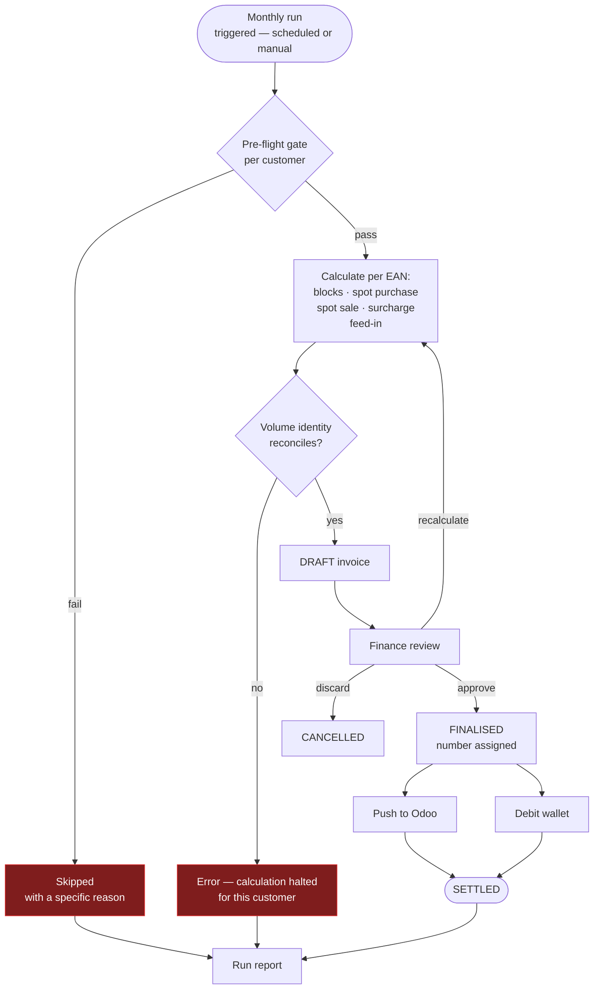
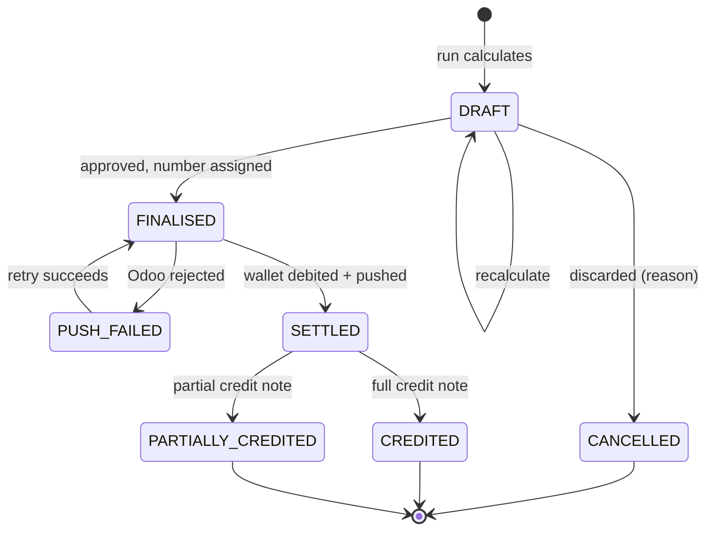

# F10 — Invoicing & Settlement

**Portal:** both · **Priority:** Must · **Phase:** 3 · **Size:** L

---

## 1. Summary

Each month the platform calculates an invoice per customer, broken down per metering point, covering
purchased blocks, day-ahead settlement of the open position, the surcharge and the feed-in credit on
exported volume. The invoice is pushed to Odoo for accounting and settled by debiting the wallet.

The volume basis is **net usage** = consumption − production, per interval per metering point
**[DEC-22]**. Where net usage is negative the interval is an **export**, and **[DEC-44]** takes it out
of the day-ahead leg: it is credited at a per-customer **feed-in tariff** on **line 6**. Unused block
cover continues to settle at the day-ahead price **[DEC-23]** on line 2's sale leg. Purchase, sale and
feed-in are **three separate lines, never netted against each other** — the three volumes occur at
different times and now at three different prices.

> **Two unit systems, deliberately. [DEC-35], [DEC-44].** Market prices — block prices and day-ahead —
> are **€/MWh**. The two per-customer rates, surcharge and feed-in tariff, are **€/kWh**, applied to
> kWh volumes with **no conversion**. Lines 4 and 6 therefore carry no `/1000` where every other line
> does. Both rate columns need **7 decimal places** to keep the granularity the platform had before
> the unit changed — [Invoice calculation](../50-calculations/03-invoice-calculation.md) §6.1.

The arithmetic is specified in [Invoice calculation](../50-calculations/03-invoice-calculation.md).
This document covers the process, the states and the controls around it.

> **Deferred scope — two of the six line categories are not implemented.**
>
> **Imbalance, line 3 — [DEC-25].** Out of scope. PVNed `A12` documents are stored but never turned
> into charges **[F02]**. This moots [AS-18] and the allocation-key question, and removes the
> requirement to state an allocation method in the customer contract.
>
> **Energiebelasting, line 5 — [DEC-24].** Out of scope *for now*. `IEnergyTaxCalculator` and the
> `billing.energy_tax_tariff` table stay in the model, **unpopulated**, so the calculation drops in
> rather than being retrofitted through the invoice engine. ⚠ **EB is a legal obligation, not a
> feature: it must be reopened before a single invoice is issued to a real customer.**
>
> **The January annual true-up goes with it.** Tier crossings were its principal reason to exist, so
> it is deferred alongside EB, keeping only a residual role for late metering corrections — see §4.
>
> The true-up requirements **F10-R27..R33** stay in their table with their IDs and a `Deferred` tag.
> Imbalance deferred no numbered requirement — it changes the wording of **F10-R05** and **F10-R08**
> and removes one pre-flight check. Nothing is deleted and nothing is renumbered.
>
> **Size changed: XL → L.** The degressive tax engine, the imbalance allocation and the annual true-up
> were three of the four things that made this XL. It returns to **XL** when [DEC-24] is reopened. The
> tag is not a claim that the work disappeared — only that it moved.

> **Added scope — [DEC-44] adds a sixth line category.** Feed-in on exported volume is **line 6**,
> settled at a per-customer feed-in tariff rather than at day-ahead. It takes the next free line
> number; nothing is renumbered, and the reserved 3 and 5 stay reserved. New requirements
> **F10-R39..R42**, one new pre-flight check, a new reference-data dependency on
> [F09](F09-surcharges.md), and a **changed volume identity** in F10-R08. The size tag stays **L**:
> the new line is one more application of machinery that already exists, unlike the tax engine.

> **Readiness.** [OQ-14] and [OQ-15] are closed *by deferral* ([DEC-24], [DEC-25]). [OQ-35] is closed
> by **[DEC-44]** — the raw day-ahead price, no spread, on both legs. [OQ-17] is now closed on its
> first half: **[DEC-26]** makes all prices, balances and reservations VAT-exclusive with VAT added at
> invoice level, and **[DEC-64]** fixes the rate at **21% on every line category, with no exemptions
> and no reverse-charge cases**, closing [OQ-82]. **[OQ-83] remains open** — whether `INVOICE_DEBIT`
> settles the VAT-exclusive subtotal or the VAT-inclusive total. Settle it before wallet settlement is
> built: a reservation sized ex-VAT under-covers an inclusive debit by the VAT rate **[F06]**, and
> **[DEC-41]** removed the buffer that would have absorbed it.
>
> One question is **newly open and owned here**: **[DEC-44] does not say what applies when a customer
> exports and no feed-in tariff resolves** — zero, or day-ahead as a fallback. Both are defensible and
> they differ in money. It is described in [F09](F09-surcharges.md) §11.1 and needs a decision ID of
> its own.

## 2. User stories

| As a… | I want to… | So that… |
| --- | --- | --- |
| Finance | run the monthly invoice calculation for all customers | invoicing is one action, not fifty |
| Finance | see which customers could not be calculated and why | I can fix the cause instead of hunting |
| Finance | review a draft invoice line by line before it goes out | errors are caught before the customer sees them |
| Finance | recalculate a draft after fixing data | I don't have to start the run over |
| Finance | finalise and push to Odoo | accounting has what it needs |
| Finance | issue a credit note | a mistake can be corrected properly |
| ~~Finance~~ | ~~run the January true-up~~ — deferred with energiebelasting **[DEC-24]** | ~~the year's tax is settled correctly~~ |
| Customer user | see my invoices with a per-EAN breakdown | I can check and approve the charge |
| Customer user | see what I was credited for the energy I exported, and at what rate | the feed-in line is verifiable too **[DEC-44]** |
| Customer user | trace an invoice line back to a trade or to my consumption | I can verify it myself |
| Customer user | download a PDF | I can file it |

## 3. Invoice run

### 3.1 Pre-flight gate

A customer is only calculated when **all** of these hold. Each failure produces a named reason, and
the run continues with the other customers.

| Check | Failure reason |
| --- | --- |
| Every delivery date in the month has interval data for every active metering point, **in both directions** — consumption and production, since the basis is net usage **[DEC-22]** | `MISSING_METERING_DATA` |
| No metering point is in `PARTIAL` state for the month | `INCOMPLETE_METERING_DATA` |
| A day-ahead price exists for every interval of the month | `MISSING_DAY_AHEAD_PRICE` |
| A surcharge resolves (or the global default exists) | `MISSING_SURCHARGE` — warning only |
| A feed-in tariff resolves for every interval in which the metering point exported **[DEC-44]** | `MISSING_FEED_IN_TARIFF` — **hard skip where there is export**, warning only where there is none. See F10-R39 |
| No trade for the period is still in a non-terminal state | `OPEN_TRADE_IN_PERIOD` — warning only |

**One check was added, and it is asymmetric with `MISSING_SURCHARGE` on purpose.** A missing surcharge
bills nothing and costs the customer nothing, so it is a warning. A missing feed-in tariff would value
exported energy at zero — and whether zero is the right answer is **not decided by [DEC-44]**
([F09](F09-surcharges.md) §11.1). Until it is, the run refuses rather than defaults, but only for the
customers where the difference is real: no export in the month means no volume and no money at stake.

**Two checks were removed, and by which decision:**

| Removed check | Removed by | Why |
| --- | --- | --- |
| `MISSING_IMBALANCE_DATA` | **[DEC-25]** | Imbalance produces no charge, so its absence cannot make an invoice wrong |
| `MISSING_TAX_TARIFF` | **[DEC-24]** | No tariff is loaded and none is used. The check returns with the line |

Neither reason code is repurposed. Both come back unchanged when their decision is reopened.

**Provisional data does not block the run.** Waiting for every date to reach `FINAL` would push
invoicing past the middle of the following month. Invoicing on provisional data is the intended
design — but the invoice must state which of its dates were provisional. ⚠ The correction path for
those dates was the annual true-up, which **[DEC-24]** defers: until it returns, a late correction
leaves a finalised invoice flagged `AFFECTED_BY_CORRECTION` **[F02-R20]** with no automatic
settlement of the delta. Corrections accumulate; they are not lost, but nor are they cleared.

## 4. Functional requirements

### Calculation

| ID | Requirement | MoSCoW |
| --- | --- | :--: |
| F10-R01 | The platform can run monthly invoicing for all customers, a subset, or a single customer. | Must |
| F10-R02 | The run is scheduled (default: the 5th of the following month) and can also be started manually. | Must |
| F10-R03 | The pre-flight gate in §3.1 runs per customer; failures skip that customer with a reason and never abort the whole run. | Must |
| F10-R04 | An invoice contains one section per metering point active during the period. | Must |
| F10-R05 | Line categories per section: **1** block energy, **2** spot settlement — presented as a **purchase line and a separate sale line, never netted [DEC-23]**, the sale leg carrying **unused block cover only [DEC-44]** — **4** surcharge, and **6** feed-in on exported volume **[DEC-44]**, all computed as specified in [Invoice calculation](../50-calculations/03-invoice-calculation.md). Category **3** imbalance is deferred **[DEC-25]** and category **5** energiebelasting is deferred **[DEC-24]**; their numbers are reserved, not reused, and feed-in takes the next free number rather than a reserved one. | Must |
| F10-R06 | Every line stores the inputs used: volume, unit price **with its unit — €/MWh for lines 1 and 2, €/kWh for lines 4 and 6 [DEC-35], [DEC-44]** — the rate's source and version, and links to the causing objects. | Must |
| F10-R07 | Block lines link to their trade; spot and feed-in lines link to the underlying interval range. | Must |
| F10-R08 | The engine asserts the volume identity `Σ block + Σ spot purchases − Σ unused cover − Σ feed-in volume = net usage` per metering point, to a tolerance of 0.001 MWh, and **fails the calculation** if it does not hold. Net usage is `Σ consumption − Σ production` over the same intervals **[DEC-22]**; the sale term splits in two under **[DEC-44]**; the identity carries no imbalance term because imbalance contributes no volume **[DEC-25]**. The authoritative statement and its proof are in [Invoice calculation](../50-calculations/03-invoice-calculation.md) §11.1. | Must |
| F10-R09 | The invoice records the data state of every delivery date it covers, and shows a prominent notice when any is not `FINAL`. | Must |
| F10-R10 | A run produces a report: invoiced, skipped with reasons, failed with errors, totals. | Must |
| F10-R11 | A run is repeatable: re-running for a period recalculates drafts and never touches finalised invoices. | Must |
| F10-R12 | Calculation is deterministic — same inputs, same outputs — and the input versions are recorded so a past result can be reproduced. | Must |

### Review and finalisation

| ID | Requirement | MoSCoW |
| --- | --- | :--: |
| F10-R13 | Finance can open a draft and inspect every line with its inputs. | Must |
| F10-R14 | Finance can recalculate a draft after upstream data is corrected. | Must |
| F10-R15 | Finance can discard a draft with a reason. | Must |
| F10-R16 | Finalising assigns a sequential, gapless invoice number per legal entity per year. | Must |
| F10-R17 | A finalised invoice is immutable. Corrections go through a credit note. | Must |
| F10-R18 | Finalisation renders a PDF and stores it immutably. | Must |
| F10-R19 | Finalisation triggers the Odoo push and the wallet debit; both are retried independently and their statuses are visible. | Must |
| F10-R20 | Finance can issue a full or partial credit note against a finalised invoice, with a mandatory reason; it credits the wallet and is pushed to Odoo. | Must |
| F10-R21 | Bulk finalisation of reviewed drafts is possible, with a confirmation showing the total value. | Should |
| F10-R22 | An invoice that references a metering date later corrected is flagged `AFFECTED_BY_CORRECTION` **[F02-R20]** and listed for the true-up. ⚠ The **capture** side stays Must under **[DEC-24]** — flags must still be set and must accumulate — but the **settlement** side is deferred with F10-R27…R33, so flagged invoices have no live correction path until the true-up returns. | Must |

### Settlement

| ID | Requirement | MoSCoW |
| --- | --- | :--: |
| F10-R23 | Finalisation debits the wallet with a single `INVOICE_DEBIT` entry linked to the invoice. Whether that entry carries the VAT-**exclusive** subtotal or the VAT-**inclusive** total is **open — [OQ-83]**, left open explicitly by **[DEC-64]** — and must be answered before this is built. The wallet itself is VAT-exclusive **[DEC-26]**, **[F06-R02]**, and **[DEC-64]** now makes the gap exactly 21% of the subtotal on every invoice. | Must |
| F10-R24 | If the balance is insufficient, the debit still applies, the wallet may go negative, an alert is raised, trading is blocked and the customer is notified **[OQ-19]**. | Must |
| F10-R25 | A credit note creates an `INVOICE_CREDIT` entry. | Must |
| F10-R26 | Invoice payment state is derived from the wallet, not tracked separately. | Must |

### Annual true-up — deferred by [DEC-24]

**Deferred, not deleted.** Degressive energiebelasting tiers were the principal reason this process
existed; with EB out of scope **[DEC-24]** the true-up is deferred alongside it, keeping only its
residual role of correcting late metering data. Every requirement below keeps its ID and its place.
All were **Must** except F10-R33, which was **Should**. They are reinstated unchanged when EB is
reopened — which must happen before the first invoice to a real customer.

What remains unhandled meanwhile is stated plainly in §3.1: corrections arriving after finalisation
flag the invoice **[F02-R20]** and accumulate. There is no settlement path for them while this
section is deferred, and that is a known, accepted gap for the PoC — not an oversight.

| ID | Requirement | MoSCoW |
| --- | --- | :--: |
| F10-R27 | Each January the platform can run an annual true-up for the previous calendar year, per customer. **Deferred [DEC-24]**. | Deferred |
| F10-R28 | The run is gated on all of the previous year's delivery dates being `FINAL` for the customer; a customer failing the gate is skipped with a reason. **Deferred [DEC-24]**. | Deferred |
| F10-R29 | The true-up recomputes energiebelasting on the final full-year volume per EAN and compares it with the sum already invoiced. **Deferred [DEC-24]** — this is the EB calculation itself. | Deferred |
| F10-R30 | It also recomputes every volume-driven component whose inputs changed, and includes those deltas. **Deferred [DEC-24]** — this is the residual late-metering-correction role, deferred with the process that carried it. | Deferred |
| F10-R31 | The result is a correction invoice or credit note carrying only the deltas, with a supporting statement showing original vs. recomputed per component per EAN. **Deferred [DEC-24]**. | Deferred |
| F10-R32 | Monthly invoices for the year are not modified. **Deferred [DEC-24]** — moot while no true-up runs; the immutability rule itself holds regardless **[F10-R17]**. | Deferred |
| F10-R33 | A zero delta produces a statement, not an invoice. **Deferred [DEC-24]**. | Deferred |

### Presentation

| ID | Requirement | MoSCoW |
| --- | --- | :--: |
| F10-R34 | Customers see their invoices with per-EAN sections and can download the PDF. | Must |
| F10-R35 | Each line offers a drill-down: block lines to the trade, spot and feed-in lines to the interval data. The tax-line drill-down to the tier breakdown is deferred with the line itself **[DEC-24]**; the spot drill-down shows consumption, production and the derived net usage **[DEC-22]**, and the feed-in drill-down shows the exporting intervals only, with the rate that applied to each **[DEC-44]**. | Should |
| F10-R36 | Customers can export invoice detail as CSV. | Should |
| F10-R37 | An invoice overview shows the last 24 months with amounts and states. | Should |
| F10-R38 | The invoice presents a **VAT-exclusive subtotal**, the VAT amount per rate group, and the VAT-inclusive total. Every price feeding it is VAT-exclusive **[DEC-26]**. **The rate is 21% on every line category, with no exemptions and no reverse-charge cases [DEC-64]**, closing [OQ-82] — so there is one rate group today. Keep the per-group *shape* so a second group is data rather than a refactor: **[DEC-64]** is recorded as stated and reopens for any customer outside the standard rate, before their first invoice. | Must |
| F10-R39 | A metering point that exported in the month and for which **no feed-in tariff resolves** causes the customer to be **skipped** with `MISSING_FEED_IN_TARIFF`; where there was no export the same condition is a warning only. This is interim behaviour pending a decision on the fallback, which **[DEC-44]** does not supply — see [F09](F09-surcharges.md) §11.1. The engine must not default to zero or to day-ahead on its own. | Must |
| F10-R40 | The feed-in line shows the exported volume as a negative kWh figure, the applied **€/kWh** rate snapshotted from the tariff in force for those intervals, and the resulting credit. A mid-month tariff change produces **two lines, never a blended rate** **[DEC-44]**, **[F09-R15]**. | Must |
| F10-R41 | Exported volume `Σ max(−U, 0)` is a metered figure in its own right and is printed in the section header alongside gross consumption, production and net usage, because the volume identity in F10-R08 is stated against it **[DEC-44]**. | Must |
| F10-R42 | A metering point that exported in the month but resolves a feed-in tariff of **exactly zero** is invoiced with a zero-amount feed-in line, not with the line omitted — a configured zero is a deliberate statement and must be visible as one **[F09]**. | Must |

## 5. Business rules

1. **Finalised invoices are immutable.** Every correction is a new document.
2. **Numbering is gapless and sequential** per legal entity per year — a legal requirement, and the
   reason a discarded draft never consumes a number.
3. **The volume identity must hold.** Blocks plus spot purchases, minus unused cover, minus feed-in
   volume, equals **net usage** **[DEC-22]**, **[DEC-44]**. It is asserted, printed on the invoice,
   and treated as a hard failure — it is the cheapest possible detector of a coverage or calendar bug.
   The formula and its proof live in
   [Invoice calculation](../50-calculations/03-invoice-calculation.md) §11.1 and are not restated
   here; an identity written down twice is an identity that will eventually disagree with itself.
4. **Every line is reconstructable** from stored inputs, without re-reading current reference data.
5. **Provisional data is disclosed**, never hidden.
6. ~~**The true-up corrects; it does not replace.**~~ **Deferred by [DEC-24]** along with the process
   it governs. The rule returns with §4's requirements.
7. **Odoo receives finalised documents only.** Drafts never leave the platform.
8. **Wallet settlement and Odoo push are independent.** One failing must not roll back the other; both
   are retried and monitored.
9. **Purchases, sales and feed-in are never netted [DEC-23], [DEC-44].** Uncovered volume, unused
   block cover and physical export occur at different times and at three different prices. One line
   each, all shown, even when one of them is zero.
10. **Prices in, VAT out [DEC-26], [DEC-64].** Every price entering the calculation is VAT-exclusive.
    VAT is applied once, at invoice level, over the subtotal, at **21% on every line category** —
    including the negative amounts on the sale and feed-in lines. A credit line is not an exception to
    a rate.
11. **Market prices are €/MWh; customer rates are €/kWh [DEC-35], [DEC-44].** The unit belongs to the
    field, is stored with the line, and is printed on the invoice. Lines 4 and 6 carry no conversion
    factor and no other line may omit one.

## 6. Invoice state machine

## 7. Screens

| Screen | Mockup |
| --- | --- |
| Customer invoice detail | [`invoice-detail.svg`](../60-mockups/invoice-detail.svg) |
| Employee invoice run dashboard | [`employee-invoice-run.svg`](../60-mockups/employee-invoice-run.svg) |

## 8. Data

| Entity | Purpose |
| --- | --- |
| `invoice_run` | period, scope, trigger, state, counts, report |
| `invoice` | customer, period, number, state, totals, PDF reference, Odoo reference |
| `invoice_section` | Per metering point |
| `invoice_line` | category **(1, 2, 4, 6 — 3 and 5 reserved)**, description, volume, unit price **with its unit**, amount, rate source and version, links |
| `invoice_data_state` | Per delivery date covered: the data state at calculation time |
| `credit_note` | Links to the original invoice, reason, lines |

## 9. Edge cases

| Case | Behaviour |
| --- | --- |
| Customer joined mid-month | Only their valid period is invoiced; the section shows the partial period |
| EAN transferred between customers mid-month | Each customer's invoice covers only their own period; combined volumes never cross |
| Zero consumption for an EAN | Section still appears with zero-volume lines, so the customer sees it was considered |
| Block covers a month with no consumption data | Blocked by the pre-flight gate |
| Negative invoice total (heavy surplus at high prices) | Produced as a credit note rather than an invoice with a negative total. More likely under **[DEC-22]**, since a site with large production can be net long for a whole month. **[DEC-44]** makes it slightly *less* likely where the feed-in tariff sits below day-ahead, and more likely where it sits above |
| Metering point net long for the whole month | The sale and feed-in lines carry the volume **[DEC-23]**, **[DEC-44]**; the purchase line is present with zero volume, because a line that is absent looks like a line that was forgotten |
| Metering point exported but holds no blocks | Line 1 is absent, line 2's sale leg is zero, and the whole export sits on line 6 at the feed-in tariff. The volume identity still holds: `0 + purchase − 0 − feedIn = net usage` |
| Feed-in tariff changed mid-month | Two feed-in lines with their own volumes and rates **[F10-R40]**, never a blend |
| Feed-in tariff resolves to zero | Zero-amount line 6 is shown **[F10-R42]**; a configured zero is a statement and must be visible |
| No feed-in tariff resolves and the month has export | Pre-flight skip `MISSING_FEED_IN_TARIFF` **[F10-R39]** — ⚠ interim behaviour, because **[DEC-44]** does not decide the fallback |
| Surcharge rate still stored in €/MWh after **[DEC-35]** | Not an edge case to handle at invoice time — it is a migration defect. **[F09-R12]** converts on migration and **[F09]** §7 stops on an implausible rate rather than invoicing 1000× the intended amount |
| Correction arrives between finalisation and the Odoo push | Push proceeds; the invoice is flagged `AFFECTED_BY_CORRECTION`. The true-up that would clear the flag is deferred **[DEC-24]**, so the flag persists until it returns |
| Odoo rejects the push | State `PUSH_FAILED`, retried with backoff, visible on the dashboard; the wallet debit is unaffected |
| Two runs started for the same period concurrently | Second is refused; runs are exclusive per period |
| ~~Energiebelasting tariff for the year not loaded~~ | ~~Pre-flight failure `MISSING_TAX_TARIFF`~~ — check removed by **[DEC-24]**; no tariff is loaded and none is used |
| ~~Imbalance data missing for the month~~ | ~~Pre-flight failure `MISSING_IMBALANCE_DATA`~~ — check removed by **[DEC-25]**; `A12` is stored but never charged |
| Customer closed mid-year | Final invoice on closure. The true-up covering their partial year is deferred **[DEC-24]** |

## 10. Out of scope

- **Energiebelasting (line 5)** and the **January annual true-up** — deferred by **[DEC-24]**, to be
  reopened before the first invoice to a real customer.
- **Imbalance (line 3)** — out of scope by **[DEC-25]**.
- Payment terms, dunning, receivables ageing (Odoo's job) **[AS-12]**.
- Network/transport cost billing **[OQ-18]**.
- Gas invoicing **[OQ-01]**.
- Consolidated invoicing across group entities.

## 11. Dependencies

| Depends on | Why |
| --- | --- |
| [F02](F02-metering-data-ingestion.md) | Volumes — consumption **and production**, since the basis is net usage **[DEC-22]**. Imbalance is stored but not charged **[DEC-25]** |
| [F05](F05-energy-block-trading.md) | Blocks |
| [F06](F06-wallet-and-ledger.md) | Settlement |
| [F08](F08-day-ahead-prices.md) | Spot prices — **raw, no spread [DEC-44]**, arriving 18:00 Europe/Amsterdam **[DEC-36]** |
| [F09](F09-surcharges.md) | Surcharge rates **and feed-in tariffs [DEC-44]** — both €/kWh **[DEC-35]** |
| [Odoo integration](../30-integrations/04-odoo-accounting.md) | Push |
| [Invoice calculation](../50-calculations/03-invoice-calculation.md) | The arithmetic |

## 12. Open questions

| Ref | Question |
| --- | --- |
| ~~[OQ-13]~~ | ~~Surplus settlement policy~~ **Closed by [DEC-23]**, then **narrowed by [DEC-44]** — day-ahead applies to *unused block cover* only, on a separate sale line, never netted. Physical export settles at the feed-in tariff on line 6 |
| [OQ-14] | Energiebelasting tariffs, credits and exemptions. **Closed by deferral [DEC-24]** — and it must be **reopened before any invoice is issued to a real customer**. EB is a legal obligation |
| ~~[OQ-15]~~ | ~~Imbalance allocation to EANs~~ **Closed by [DEC-25]** — imbalance is out of scope, so there is nothing to allocate |
| [OQ-17] | VAT treatment. **Closed on (a) by [DEC-26] + [DEC-64]** — all prices, balances and reservations are VAT-exclusive, and the rate is 21% on every line category with no exemptions and no reverse charge. **(b) is still open as [OQ-83]** — whether `INVOICE_DEBIT` settles the subtotal or the total |
| ~~[OQ-18]~~ | ~~Network/transport costs in scope?~~ **Closed by [DEC-37]** — out of scope; the DSO bills grootverbruik customers directly |
| [OQ-19] | Wallet behaviour on insufficient funds |
| ~~[OQ-35]~~ | ~~Raw day-ahead price or price plus a spread?~~ **Closed by [DEC-44]** — the raw price, no spread, on both legs of line 2 |
| ~~[OQ-37]~~ | ~~Who owns invoice numbering — the platform or Odoo?~~ **Closed by [DEC-45]** — the platform; gapless sequential numbering per legal entity per year |
| ~~[OQ-38]~~ | ~~Is the invoice PDF generated by the platform or by Odoo?~~ **Closed by [DEC-46]** — the platform generates it |
| ~~[OQ-39]~~ | ~~Are invoices emailed to customers, or portal-only?~~ **Closed by [DEC-47]** — both, which raises deliverability to a requirement **[DEC-48]** |
| ~~[OQ-82]~~ | ~~VAT rate per line category, exemptions, reverse charge~~ **Closed by [DEC-64]** — 21%, every category, none of either. ⚠ Reopens for any customer outside the standard rate, before their first invoice |
| [OQ-83] | Does the wallet `INVOICE_DEBIT` settle the ex-VAT subtotal or the VAT-inclusive total? **Open**, and explicitly left open by **[DEC-64]**. Must be answered before wallet settlement is built — **[F10-R23]** |
| *(unnumbered)* | When a customer exports but no feed-in tariff resolves, is the export valued at zero or at day-ahead? **Open — needs a decision against [DEC-44]**, which does not answer it. Interim behaviour: skip the customer **[F10-R39]**. See [F09](F09-surcharges.md) §11.1 |
