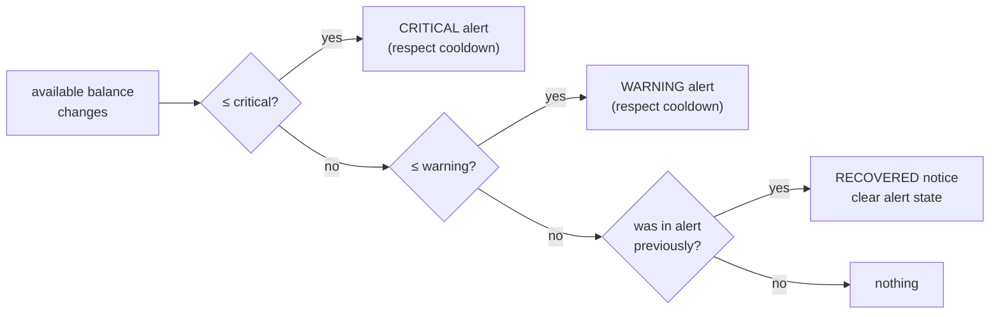

# F11 — Notifications & Wallet Alerts

**Portal:** both · **Priority:** Should (wallet alerts: Must) · **Phase:** 3 · **Size:** M

---

## 1. Summary

Two distinct jobs sit under one feature.

**Event notifications** tell someone that something happened — an offer arrived, a trade confirmed, an
invoice was issued. The offer notification is the time-critical one: a 30-minute window that the
customer doesn't know about is a wasted trade for both sides.

**Wallet threshold alerts** are rule-driven rather than event-driven. Configurable minimums, global
and per customer, warn a customer as their balance approaches or falls below a level, so a trade is
never blocked by a surprise.

## 2. Who receives a customer notification

A customer company has several accounts, any of which may act **[DEC-16]**. So "notify the customer"
has to mean something specific.

| Event class | Recipients | Why |
| --- | --- | --- |
| **Offer received, offer expiring, offer withdrawn** | **All active accounts** | Any of them may accept, and the window is short. Notifying only the requester means a 30-minute offer dies because one person is in a meeting **[OQ-81]** |
| Trade confirmed, declined, failed, rejected, expired | All active accounts | Everyone who could have acted should know the outcome |
| Wallet threshold and negative-balance alerts | All active accounts | It blocks everyone's trading |
| Top-up succeeded or failed | **The initiating account**, plus all accounts for a bank deposit | A personal action gets a personal confirmation |
| Invoice issued, credit note, annual true-up | All active accounts, and any finance mailbox configured for the company | Finance is often not the person who trades |

**The default is all active accounts.** Narrowing it is a per-account preference **[F11-R12]**, and
critical notifications cannot be switched off.

`INVITED` and `DEACTIVATED` accounts are never notified.

## 3. Notification catalogue

| Event | Recipient | Channels | Urgency |
| --- | --- | --- | --- |
| Offer received | Customer | In-app + email | **Immediate** |
| Offer expiring soon (configurable, default 5 min left) | Customer | In-app + email | **Immediate** |
| Offer expired | Customer, trader | In-app + email | Normal |
| Offer withdrawn by PeakPower | Customer | In-app + email | Immediate |
| Trade request declined | Customer | In-app + email | Normal |
| Trade confirmed | Customer | In-app + email | Normal |
| Trade failed | Customer | In-app + email | **Immediate** |
| Top-up succeeded | Customer | In-app + email | Normal |
| Top-up failed | Customer | In-app + email | Normal |
| Bank deposit registered | Customer | In-app + email | Normal |
| Wallet approaching minimum | Customer | In-app + email | Normal |
| Wallet below minimum | Customer | In-app + email | **Immediate** |
| Wallet negative | Customer, finance | In-app + email | **Immediate** |
| Invoice issued | Customer | In-app + email | Normal |
| Credit note issued | Customer | In-app + email | Normal |
| Annual true-up available | Customer | In-app + email | Normal |
| New trade request | Traders | In-app + email | **Immediate** |
| Trade unconfirmed too long | Traders | In-app | **Immediate** |
| Metering data missing | Employees | In-app + email digest | Normal |
| Integration failing | Employees | In-app + email | **Immediate** |
| Invoice run finished | Finance | In-app + email | Normal |

## 4. Wallet threshold rules

```
wallet_threshold_rule
  ├─ scope             GLOBAL | CUSTOMER
  ├─ scope_id
  ├─ warning_amount    warn at or below this available balance
  ├─ critical_amount   urgent at or below this
  ├─ evaluation        ON_CHANGE + DAILY
  └─ cooldown_hours    suppress repeats, default 24
```

Resolution is most-specific-wins: a customer rule overrides the global rule; absent both, no alerts.

Rules are evaluated **on every balance change** and **once daily**, so both a sudden drop and a slow
drift are caught.



## 5. Functional requirements

| ID | Requirement | MoSCoW |
| --- | --- | :--: |
| F11-R01 | Every event in §3 raises a notification to the recipients defined in §2. | Must |
| F11-R02 | Offer, trade-outcome and wallet-critical notifications go to **every active account** of the company, not only the account that raised the request **[OQ-81]**. | Must |
| F11-R03 | Notifications appear in an in-app notification centre with unread counts, and are marked read on open. | Must |
| F11-R04 | Email notifications are sent for events marked as such, rendered from templates with the customer's language **[AS-19]**. | Must |
| F11-R05 | Immediate-urgency notifications are dispatched without batching or digesting. | Must |
| F11-R06 | Offer notifications include price, volume, total value and the deadline as an absolute local time as well as a duration. | Must |
| F11-R07 | Every notification deep-links to the object it concerns. | Must |
| F11-R08 | Threshold rules can be configured globally and per customer, warning and critical, by an authorised employee. | Must |
| F11-R09 | Threshold rules are evaluated on balance change and daily, with a cooldown to prevent flapping. | Must |
| F11-R10 | A recovery notice is sent when a wallet returns above the warning level. | Must |
| F11-R11 | Notification delivery attempts and outcomes are logged; failures are retried and visible to employees. | Must |
| F11-R12 | Customers can choose which non-critical emails they receive. Offer, trade-failed and wallet-critical emails are **not** optional. | Should |
| F11-R13 | A company can have additional notification-only email addresses (e.g. a shared finance mailbox) that are not accounts and cannot sign in. | Should |
| F11-R14 | An in-app notification is marked read per account, not per company — one colleague reading it does not clear it for everyone. | Must |
| F11-R15 | Employees can see the notification history for a customer, to answer "did we tell them?". | Should |
| F11-R16 | An employee can resend a notification. | Should |
| F11-R17 | Browser push for offer notifications. | Could |
| F11-R18 | Webhooks so a customer's own systems can subscribe to events. | Could |

## 6. Business rules

1. **Critical notifications are not opt-out.** A customer cannot unsubscribe from an offer alert or a
   trade failure.
2. **Deadlines are shown both ways** — "expires at 14:32" and "in 27 minutes". A relative time alone
   is useless in an email read twenty minutes later.
3. **Cooldown prevents noise**, but a *state change* (warning → critical) always sends, cooldown or
   not.
4. **No sensitive figures beyond what the recipient may already see.** Emails carry amounts because
   the recipient is the account holder; they never carry credentials or tokens.
5. **Delivery is at-least-once and logged.** A missed offer notification is a commercial loss, so the
   dispatcher retries and records.
6. **Language follows the customer's preference**, falling back to Dutch.

## 7. Data

| Entity | Purpose |
| --- | --- |
| `notification` | recipient, type, payload, created_at, read_at, deep link |
| `notification_delivery` | channel, attempt, status, provider id, error |
| `notification_preference` | Per user, per type, per channel |
| `wallet_threshold_rule` | Scope, thresholds, cooldown |
| `wallet_alert_state` | Current alert level per wallet, last sent, for cooldown and recovery |

## 8. Edge cases

| Case | Behaviour |
| --- | --- |
| Email bounces | Recorded; repeated bounces flag the address and alert employees |
| Offer expires before the email is delivered | Email still sent; content reflects the expired state when opened via the deep link |
| Balance oscillates around the threshold | Cooldown suppresses repeats; level changes still send |
| An account has no email address | Impossible — email is mandatory **[F01-R11]** |
| A company has one account and that person is away | The offer expires unanswered. Employees are prompted at onboarding to create a second account |
| One colleague reads an in-app notification | It stays unread for the others **[F11-R14]** |
| Threshold set above the current balance | Fires immediately on the next evaluation — intended |
| Bulk event (invoice run for 50 customers) | Notifications queued and rate-limited; no provider throttling |
| Email provider outage | Queued and retried; in-app notifications are unaffected |

## 9. Out of scope

- SMS and WhatsApp.
- Marketing or newsletter email.
- Per-user quiet hours (critical notifications would have to override them anyway).

## 10. Dependencies

| Depends on | Why |
| --- | --- |
| [F05](F05-energy-block-trading.md) | Trade events |
| [F06](F06-wallet-and-ledger.md) | Balance changes |
| [F10](F10-invoicing-and-settlement.md) | Invoice events |
| Email provider | Transactional email — **[OQ-40]** |

## 11. Open questions

| Ref | Question |
| --- | --- |
| [OQ-40] | Which transactional email provider, and is a dedicated sending domain with SPF/DKIM/DMARC available? |
| [OQ-41] | Default warning and critical thresholds — a fixed amount, or derived from recent trading volume? |
