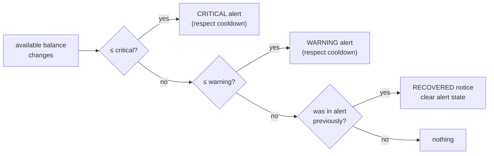

# F11 — Notifications & Wallet Alerts

**Portal:** both · **Priority:** Should (wallet alerts, approval notifications and invoice email: Must) · **Phase:** 3 · **Size:** M

---

## 1. Summary

Two distinct jobs sit under one feature.

**Event notifications** tell someone that something happened — an offer arrived, a trade confirmed, an
invoice was issued. The offer notification is the time-critical one: a 30-minute window that the
customer doesn't know about is a wasted trade for both sides.

**Wallet threshold alerts** are rule-driven rather than event-driven. Fixed minimum amounts
**[DEC-49]**, global and per customer, warn a customer as their balance approaches or falls below a
level, so a trade is never blocked by a surprise.

Four decisions changed this feature's weight rather than its shape:

| Decision | Effect here |
| --- | --- |
| **[DEC-63]** | **Every active account** is notified when an offer arrives. Closes [OQ-81] and confirms the design in §2 — a 30-minute offer must not die because one person is in a meeting, and any active account may accept **[DEC-18]** |
| **[DEC-47]** | Invoices are **both emailed and available in the portal**. Closes [OQ-39], and **raises deliverability from a convenience to a requirement** **[F11-R22]** |
| **[DEC-48]** | **SendGrid** is the transactional email provider. Closes [OQ-40]. ⚠ A **dedicated sending domain with SPF, DKIM and DMARC** is still needed and is a **lead-time item** **[F11-R24]** |
| **[DEC-33]** | Four-eyes approval adds two notification classes that did not exist: **approval-required**, to the accounts that could approve, and **approval-decided** **[F11-R19..R21]**. The approval rules are [F05](F05-energy-block-trading.md) §3.2's, not this document's |

## 2. Who receives a customer notification

A customer company has several accounts, any of which may act **[DEC-16]**. So "notify the customer"
has to mean something specific.

| Event class | Recipients | Why |
| --- | --- | --- |
| **Offer received, offer expiring, offer withdrawn** | **All active accounts** | Any of them may accept, and the window is short. Notifying only the requester means a 30-minute offer dies because one person is in a meeting. **Decided: [DEC-63]** closes [OQ-81] in favour of every active account |
| **Approval required** on a trade above the four-eyes threshold **[DEC-33]** | **Every active account except the acceptor** | They are exactly the accounts that *could* approve **[F05-R59]**. The acceptor is excluded because they cannot approve their own acceptance, and asking them to would teach the whole company to ignore the alert |
| **Approval given, approval refused, expired unapproved** | All active accounts | An outcome that moves money — a refusal or an expiry releases the reservation **[F05-R62]**, **[F05-R63]** — and the acceptor in particular has to learn what became of their commitment |
| Trade confirmed, declined, failed, rejected, expired | All active accounts | Everyone who could have acted should know the outcome |
| Wallet threshold and negative-balance alerts | All active accounts | It blocks everyone's trading |
| Top-up succeeded or failed | **The initiating account**, plus all accounts for a bank deposit | A personal action gets a personal confirmation |
| Invoice issued, credit note, annual true-up | All active accounts, and any finance mailbox configured for the company | Finance is often not the person who trades. **[DEC-47]** makes this channel obligatory rather than convenient: the invoice is emailed *and* in the portal |

**The default is all active accounts.** Narrowing it is a per-account preference **[F11-R12]**, and
critical notifications cannot be switched off.

`INVITED` and `DEACTIVATED` accounts are never notified.

## 3. Notification catalogue

| Event | Recipient | Channels | Urgency |
| --- | --- | --- | --- |
| Offer received | Customer | In-app + email | **Immediate** |
| Offer expiring soon (configurable, default 5 min left) | Customer | In-app + email | **Immediate** |
| Offer expired | Customer, trader | In-app + email | Normal |
| Offer withdrawn by PeakPower | Customer | In-app + email | Immediate |
| Trade request declined | Customer | In-app + email | Normal |
| **Approval required** — trade accepted above the four-eyes threshold **[DEC-33]** | Customer — every active account **except the acceptor** | In-app + email | **Immediate** |
| **Approval reminder** — 5 minutes left, same window **[F05-R61]** | Customer — the same set | In-app + email | **Immediate** |
| **Approval given** | Customer — all active accounts | In-app + email | Normal |
| **Approval refused** — reservation released **[F05-R63]** | Customer — all active accounts | In-app + email | **Immediate** |
| **Expired unapproved** — reservation released **[F05-R62]** | Customer — all active accounts, trader | In-app + email | **Immediate** |
| Trade confirmed | Customer | In-app + email | Normal |
| Trade failed | Customer | In-app + email | **Immediate** |
| Top-up succeeded | Customer | In-app + email | Normal |
| Top-up failed | Customer | In-app + email | Normal |
| Bank deposit registered | Customer | In-app + email | Normal |
| Wallet approaching minimum | Customer | In-app + email | Normal |
| Wallet below minimum | Customer | In-app + email | **Immediate** |
| Wallet negative | Customer, finance | In-app + email | **Immediate** |
| Invoice issued | Customer | In-app + email | Normal |
| Credit note issued | Customer | In-app + email | Normal |
| Annual true-up available | Customer | In-app + email | Normal |
| New trade request | Traders | In-app + email | **Immediate** |
| Trade unconfirmed too long | Traders | In-app | **Immediate** |
| Trade awaiting customer approval **[F05-R66]** | Traders | In-app | Normal |
| Metering data missing | Employees | In-app + email digest | Normal |
| Integration failing | Employees | In-app + email | **Immediate** |
| Invoice run finished | Finance | In-app + email | Normal |

## 4. Wallet threshold rules

```
wallet_threshold_rule
  ├─ scope             GLOBAL | CUSTOMER
  ├─ scope_id
  ├─ warning_amount    fixed EUR amount — warn at or below this available balance   [DEC-49]
  ├─ critical_amount   fixed EUR amount — urgent at or below this                   [DEC-49]
  ├─ evaluation        ON_CHANGE + DAILY
  └─ cooldown_hours    suppress repeats, default 24
```

**Both thresholds are fixed amounts [DEC-49]**, not a function of recent trading volume. This closes
[OQ-41] and is deliberately the simple, predictable answer: a customer can be told their warning level
in euros and it does not move underneath them. The cost is accepted at the extremes — the same figure
is noise for a very large customer and silence for a very small one, which is what the per-customer
scope exists to correct, one customer at a time.

Resolution is most-specific-wins: a customer rule overrides the global rule; absent both, no alerts.

Rules are evaluated **on every balance change** and **once daily**, so both a sudden drop and a slow
drift are caught.



## 5. Functional requirements

| ID | Requirement | MoSCoW |
| --- | --- | :--: |
| F11-R01 | Every event in §3 raises a notification to the recipients defined in §2. | Must |
| F11-R02 | Offer, trade-outcome and wallet-critical notifications go to **every active account** of the company, not only the account that raised the request **[DEC-63]**. | Must |
| F11-R03 | Notifications appear in an in-app notification centre with unread counts, and are marked read on open. | Must |
| F11-R04 | Email notifications are sent for events marked as such, rendered from templates with the customer's language **[AS-19]**. | Must |
| F11-R05 | Immediate-urgency notifications are dispatched without batching or digesting. | Must |
| F11-R06 | Offer notifications include price, volume, total value and the deadline as an absolute local time as well as a duration. | Must |
| F11-R07 | Every notification deep-links to the object it concerns. | Must |
| F11-R08 | Threshold rules can be configured globally and per customer, warning and critical, by an authorised employee. Both are **fixed EUR amounts [DEC-49]**; nothing derives them from trading volume, and no such derivation is configurable. | Must |
| F11-R09 | Threshold rules are evaluated on balance change and daily, with a cooldown to prevent flapping. | Must |
| F11-R10 | A recovery notice is sent when a wallet returns above the warning level. | Must |
| F11-R11 | Notification delivery attempts and outcomes are logged; failures are retried and visible to employees. | Must |
| F11-R12 | Customers can choose which non-critical emails they receive. Offer, trade-failed and wallet-critical emails are **not** optional. | Should |
| F11-R13 | A company can have additional notification-only email addresses (e.g. a shared finance mailbox) that are not accounts and cannot sign in. | Should |
| F11-R14 | An in-app notification is marked read per account, not per company — one colleague reading it does not clear it for everyone. | Must |
| F11-R15 | Employees can see the notification history for a customer, to answer "did we tell them?". | Should |
| F11-R16 | An employee can resend a notification. | Should |
| F11-R17 | Browser push for offer notifications. | Could |
| F11-R18 | Webhooks so a customer's own systems can subscribe to events. | Could |

### Four-eyes approval notifications

New with **[DEC-33]**. **The approval rules are [F05](F05-energy-block-trading.md) §3.2's** — who may
approve, what the clock does, and what happens to the reservation. This section specifies only the
telling, and must not be read as restating the rule.

| ID | Requirement | MoSCoW |
| --- | --- | :--: |
| F11-R19 | On a trade entering `AWAITING_APPROVAL`, **every active account except the acceptor** is notified immediately, in-app and by email **[F05-R65]**. The message carries the trade value, the **acceptor's name and job title** **[DEC-17]**, and the time remaining **both ways** — the absolute local `expires_at` and the duration **(business rule 2)**. It deep-links to the approval screen. | Must |
| F11-R20 | A reminder goes to **the same set** when 5 minutes of the offer window remain **[F05-R65]**. There is no separate approval window to count down — the offer's `expires_at` is the only clock **[F05-R61]**, so the reminder is computed from it and from nothing else. | Must |
| F11-R21 | The outcome of an awaiting-approval trade — **approved**, **refused** **[F05-R63]**, or **expired unapproved** **[F05-R62]** — is notified to **every active account**, naming the deciding account where there is one. Where the reservation was **released**, the notification says so and states the amount, because the customer's available balance has just changed without anyone spending anything. Approval and refusal notifications are **not opt-out** (business rule 1): they are the record of a governance act. | Must |

### Email delivery

| ID | Requirement | MoSCoW |
| --- | --- | :--: |
| F11-R22 | An invoice is **both emailed to the customer and available in the portal** **[DEC-47]**. The email goes to every active account and to any configured finance mailbox **[F11-R13]**, states the invoice number, period and total, and deep-links to the portal copy. ⚠ **Whether the PDF is attached or only linked is not decided.** Attachment is what finance departments expect; a link keeps the document behind authentication. **[DEC-46]** settles who *generates* the PDF — the platform — and not how it is delivered. Decide before the first invoice run; recorded here in prose deliberately, as a live question rather than a numbered one. | Must |
| F11-R23 | **SendGrid is the transactional email provider** **[DEC-48]**, reached through a provider-agnostic port in the same shape as the payment and market-data ports. No SendGrid type appears outside the adapter, so a change of provider stays configuration plus a migration of templates. | Must |
| F11-R24 | Transactional mail is sent from a **dedicated sending domain** with **SPF, DKIM and DMARC** published and aligned, and the domain is warmed before go-live **[DEC-48]**. ⚠ **This is a lead-time item and it now gates money, not only convenience**: **[DEC-47]** puts invoices on the same channel as offer notifications, so a domain in DMARC quarantine means an unread offer *and* an undelivered invoice. Bounce and spam-complaint webhooks are consumed and surfaced **[F11-R11]**. | Must |

## 6. Business rules

1. **Critical notifications are not opt-out.** A customer cannot unsubscribe from an offer alert or a
   trade failure.
2. **Deadlines are shown both ways** — "expires at 14:32" and "in 27 minutes". A relative time alone
   is useless in an email read twenty minutes later.
3. **Cooldown prevents noise**, but a *state change* (warning → critical) always sends, cooldown or
   not.
4. **No sensitive figures beyond what the recipient may already see.** Emails carry amounts because
   the recipient is the account holder; they never carry credentials or tokens.
5. **Delivery is at-least-once and logged.** A missed offer notification is a commercial loss, so the
   dispatcher retries and records. ⚠ Since **[DEC-47]** a missed *invoice* email is a billing dispute,
   which is why **[F11-R24]** treats the sending domain as infrastructure rather than as setup.
6. **Language follows the customer's preference**, falling back to Dutch.
7. **The approver set is computed at send time, not stored** **[DEC-33]**. It is "active accounts of
   the company, minus the acceptor" **[F05-R59]**, evaluated when the notification is dispatched, so an
   account deactivated between acceptance and approval is neither asked nor counted.
8. **Thresholds are amounts, not formulas** **[DEC-49]**. A customer can be told their warning level in
   euros and it stays that number until an employee changes it.

## 7. Data

| Entity | Purpose |
| --- | --- |
| `notification` | recipient, type, payload, created_at, read_at, deep link |
| `notification_delivery` | channel, attempt, status, provider id, error |
| `notification_preference` | Per user, per type, per channel |
| `wallet_threshold_rule` | Scope, thresholds, cooldown |
| `wallet_alert_state` | Current alert level per wallet, last sent, for cooldown and recovery |

## 8. Edge cases

| Case | Behaviour |
| --- | --- |
| Email bounces | Recorded; repeated bounces flag the address and alert employees |
| Offer expires before the email is delivered | Email still sent; content reflects the expired state when opened via the deep link |
| Balance oscillates around the threshold | Cooldown suppresses repeats; level changes still send |
| An account has no email address | Impossible — email is mandatory **[F01-R11]** |
| A company has one account and that person is away | The offer expires unanswered. Employees are prompted at onboarding to create a second account |
| **A company has one active account and a trade needs approval** | There is **nobody to notify** — the approver set is empty once the acceptor is excluded **[F11-R19]**. No notification is sent, and the trade will expire unapproved **[F05-R62]**. The warning that matters was already given **before submission** **[F05-R56]**; this feature must not invent a second one at acceptance, and must not fall back to notifying the acceptor |
| **The acceptor is deactivated while a trade awaits approval** | The approver set is recomputed at send time (business rule 7), so the reminder simply goes to the remaining active accounts. If none remains, the trade expires and **F11-R21** still reports the release |
| **Invoice email hard-bounces** | Recorded and surfaced, and the invoice is **still available in the portal [DEC-47]** — the two channels are deliberately independent. Repeated bounces flag the address and alert employees, because under **[DEC-47]** an undelivered invoice is a billing problem rather than a preference |
| One colleague reads an in-app notification | It stays unread for the others **[F11-R14]** |
| Threshold set above the current balance | Fires immediately on the next evaluation — intended |
| Bulk event (invoice run for 50 customers) | Notifications queued and rate-limited; no provider throttling |
| Email provider outage | Queued and retried; in-app notifications are unaffected |

## 9. Out of scope

- SMS and WhatsApp.
- Marketing or newsletter email.
- Per-user quiet hours (critical notifications would have to override them anyway).

## 10. Dependencies

| Depends on | Why |
| --- | --- |
| [F05](F05-energy-block-trading.md) | Trade events, and the four-eyes approval rules this feature notifies about **[DEC-33]** — §3.2 there is authoritative |
| [F06](F06-wallet-and-ledger.md) | Balance changes |
| [F10](F10-invoicing-and-settlement.md) | Invoice events, now an email obligation **[DEC-47]** |
| **SendGrid** | Transactional email **[DEC-48]**, behind a provider-agnostic port **[F11-R23]** |

## 11. Open questions

| Ref | Question |
| --- | --- |
| ~~[OQ-39]~~ | ~~Are invoices emailed to customers, or portal-only?~~ **Closed by [DEC-47]** — both **[F11-R22]**. Deliverability becomes a requirement |
| ~~[OQ-40]~~ | ~~Which transactional email provider, and is a dedicated sending domain with SPF/DKIM/DMARC available?~~ **Closed on the provider — [DEC-48]: SendGrid** **[F11-R23]**. ⚠ **The sending domain is not a detail of the answer, it is the remaining work**: a dedicated domain with SPF, DKIM and DMARC has to be obtained, published, aligned and warmed, and it has external lead time **[F11-R24]** |
| ~~[OQ-41]~~ | ~~Default warning and critical thresholds — a fixed amount, or derived from recent trading volume?~~ **Closed by [DEC-49]** — fixed amounts **[F11-R08]**. The default *values* are still an operational setting, not a specification item |
| ~~[OQ-81]~~ | ~~When an offer arrives, is every account notified, or only the one that raised the request?~~ **Closed by [DEC-63]** — every active account **[F11-R02]** |
