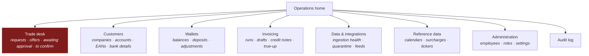

# F12 — Employee Back Office

**Portal:** employee · **Priority:** Must · **Phase:** 1–3 · **Size:** L

---

## 1. Summary

The employee portal is where PeakPower runs the business. It is not a customer portal with extra
buttons: the work is different, the density is different, and the time pressure on the trade desk is
different from anything a customer experiences.

Much of its functionality is specified inside other features — trade pricing in
[F05](F05-energy-block-trading.md), wallet operations in [F06](F06-wallet-and-ledger.md), invoicing
in [F10](F10-invoicing-and-settlement.md). This document covers what is specific to the employee
experience: the operational home, reference data administration, cross-customer search, and
integration health.

## 2. Information architecture

The trade desk is highlighted because it is the only screen with a clock running against it. It gets
its own top-level position and its own alerting, and it must be reachable in one click from anywhere.

## 3. Functional requirements

### Operations home

| ID | Requirement | MoSCoW |
| --- | --- | :--: |
| F12-R01 | The home screen shows live counters: open requests, offers awaiting response (with the soonest expiry), **trades awaiting customer approval (with the soonest expiry) [DEC-33]**, trades awaiting confirmation (with the oldest age), wallets below threshold, failed integrations, invoice drafts pending review. | Must |
| F12-R02 | Each counter links to a filtered working list. | Must |
| F12-R03 | Counters refresh without a page reload. | Must |
| F12-R04 | Items requiring action within a time window are visually ranked by urgency, not by creation order. | Must |
| F12-R05 | The home screen is role-aware: a trader sees the desk first, finance sees invoicing first. | Should |

### Trade desk

| ID | Requirement | MoSCoW |
| --- | --- | :--: |
| F12-R06 | **Four** queues — **To price** (`REQUESTED`), **Awaiting customer** (`OFFERED`, counting down), **Awaiting approval** (`AWAITING_APPROVAL`, counting down on the *same* clock) **[DEC-33]**, **To confirm** (`ACCEPTED`) — visible simultaneously. | Must |
| F12-R07 | New requests appear without a refresh, with an audible or visual cue that can be disabled per user. | Must |
| F12-R08 | Offers under 5 minutes remaining are highlighted; expired ones move out of the queue automatically. | Must |
| F12-R09 | Queues can be filtered by customer, shape, delivery period and value. | Should |
| F12-R10 | The desk shows total value at risk: sum of open offers, **trades awaiting customer approval**, and unconfirmed accepted trades. | Should |
| F12-R34 | The **Awaiting approval** queue shows per trade: customer, value, the account that accepted with their job title, the threshold that was applied, the number of accounts still eligible to approve, and a countdown to the offer's `expires_at`. It is a **watch** queue — no trader action is possible on it, which is the point: an unapproved trade is not yet PeakPower's to execute **[F05-R66]**. | Must |
| F12-R35 | At pricing time the trade detail warns that the request's estimated value is above the customer's effective four-eyes threshold, so the trader can quote a reaction window two people can actually meet **[F05-R58]**. A 30-minute default on a trade needing two signatures is the single most likely cause of a wasted round trip. | Must |
| F12-R36 | The desk flags a customer with **fewer than two active accounts** whose request is above the threshold: they cannot clear the control at all, and the trade will expire unapproved. The flag links to account administration so the trader can raise it with the customer before offering. | Must |
| F12-R37 | The desk **warns when two or more customers have open requests or live offers for the same delivery period and shape** **[DEC-50]**, showing the other customers and the combined volume. It is a signal that concentration is building in one period, not a block — the trader decides what to do with it. Beyond this and the existing soft lock, the desk needs **no** real-time collaboration cues **[DEC-50]**. | Must |

### Cross-customer search

| ID | Requirement | MoSCoW |
| --- | --- | :--: |
| F12-R11 | A single search box resolves company name, KvK, **account name or username**, EAN, trade reference, invoice number, payment reference and wallet reference. | Must |
| F12-R12 | Results are grouped by type and go straight to the object. | Must |
| F12-R13 | Recently viewed objects are offered as shortcuts. | Should |

### Customer accounts

| ID | Requirement | MoSCoW |
| --- | --- | :--: |
| F12-R14 | The customer detail page lists the company's accounts with name, job title, email, phone, status, created-by and last sign-in **[F01-R22]**. | Must |
| F12-R15 | A trader or admin can create an account, edit its details, resend its invitation and deactivate it **[F01-R10..R18]**. | Must |
| F12-R16 | Creating an account warns if the username is already taken, without revealing which company holds it. | Must |
| F12-R17 | Deactivating the last active account of a company requires explicit confirmation and a reason **[F01-R19]**. | Should |
| F12-R18 | A list of stale invitations — `INVITED` for more than 14 days — is available so onboarding does not quietly stall. | Should |

### Reference data

| ID | Requirement | MoSCoW |
| --- | --- | :--: |
| F12-R19 | Admins can manage peak calendars, including the weekday rule, the window and the excluded-date list per year **[DEC-14]**. The screen ships with the **[DEC-19]** answer as its default: weekday rule **Mon–Fri**, window **at or after 08:00 and strictly before 20:00** `Europe/Amsterdam`, and `excluded_dates[]` **empty** — public holidays are not excluded. The exclusion list stays editable so that answer can change without a release, which is the whole point of [DEC-14]. | Must |
| F12-R20 | Admins can load and view energiebelasting tariff tables per commodity per year. Editing an already-used tariff is blocked; a new version is created instead. **Deferred by [DEC-24]** (was Must) — EB is out of scope for now, so no tariff is loaded and the screen is not built. `billing.energy_tax_tariff` stays in the model, unpopulated, so the screen and the calculation return together. | Deferred |
| F12-R21 | Finance can manage surcharges **[F09](F09-surcharges.md)**. | Must |
| F12-R22 | Traders and admins can manage Montel product/ticker mapping **[F04](F04-price-indications.md)**. | Must |
| F12-R23 | Finance and admins can manage wallet threshold rules **[F11](F11-notifications.md)**. | Must |
| F12-R24 | Every reference-data change is audited with before/after values, and shows which future calculations it will affect. | Must |
| F12-R25 | A reference-data change that would affect an already-invoiced period is blocked with an explanation. | Must |
| F12-R38 | Finance and admins can manage **four-eyes thresholds** **[DEC-33]**, **[F05-R50]**: scope (`GLOBAL_DEFAULT` or a specific customer), amount in EUR VAT-exclusive — with an explicit *never require approval* option distinct from leaving it blank — `valid_from`, `valid_to` and a note. Overlapping periods for the same scope are rejected, and a change never affects a trade already accepted **[F05-R54]**. ⚠ **The screen ships with no rows, because [DEC-33] does not state a value.** Until one is in force, acceptance is refused with a configuration error and the operations home raises a reference-data alert **[F05-R53]** — the platform does not guess a default in either direction. | Must |

### Data & integrations

| ID | Requirement | MoSCoW |
| --- | --- | :--: |
| F12-R26 | An ingestion health view shows per metering point: last data date, data state per recent day, and gaps. | Must |
| F12-R27 | A message log lists inbound PVNed messages with status, and allows viewing the raw payload and replaying **[F02-R27]**. | Must |
| F12-R28 | A quarantine view lists series that could not be attached, with a one-click resolve once the EAN is registered. | Must |
| F12-R29 | An integration status panel covers PVNed, Montel, the payment provider, Odoo and email: last success, error counts, current state. | Must |
| F12-R30 | Employees can trigger a manual poll or retry per integration. | Should |

### View-as-customer

| ID | Requirement | MoSCoW |
| --- | --- | :--: |
| F12-R31 | Employees can view the customer portal as a specific customer, **read-only**, with a persistent banner. | Must |
| F12-R32 | Every impersonation session is logged with employee, customer, start and end, and is visible in the customer's own audit view. | Must |
| F12-R33 | No write action is possible while impersonating. | Must |

## 4. Business rules

1. **Read is broad, write is narrow.** Any employee can look; only the right role can change.
2. **Every write names an actor and, where it affects a customer, a reason.**
3. **Reference data cannot be changed retroactively into an invoiced period.**
4. **Impersonation is read-only and always visible** — to the employee, in the audit log, and to the
   customer.
5. **The desk never loses an item.** A state change moves an item between queues; nothing disappears
   without a terminal state.
6. **No employee can approve on a customer's behalf** **[DEC-33]**. There is no override, no
   "approve for customer" and no support workaround. An override would be one pair of eyes wearing
   PeakPower's badge, which is exactly the thing the control exists to prevent. The desk's role is to
   *watch* the awaiting-approval queue, not to clear it.
7. **Density over whitespace.** This is a professional tool used all day. Tables, keyboard
   navigation, and no modal that hides the queue behind it.

## 5. Screens

| Screen | Mockup |
| --- | --- |
| Operations home | [`employee-home.svg`](../60-mockups/employee-home.svg) |
| Customer administration — accounts and bank details | [`employee-customer-admin.svg`](../60-mockups/employee-customer-admin.svg) |
| Trade desk | [`employee-trade-desk.svg`](../60-mockups/employee-trade-desk.svg) |
| Trade detail & pricing | [`employee-trade-detail.svg`](../60-mockups/employee-trade-detail.svg) |
| Wallet administration | [`employee-wallet-admin.svg`](../60-mockups/employee-wallet-admin.svg) |
| Invoice run dashboard | [`employee-invoice-run.svg`](../60-mockups/employee-invoice-run.svg) |
| Ingestion health | [`employee-ingestion-health.svg`](../60-mockups/employee-ingestion-health.svg) |

## 6. Edge cases

| Case | Behaviour |
| --- | --- |
| Two traders open the same request | Both see it; a soft lock shows "being handled by …". Publishing is guarded by state, so the second attempt fails cleanly rather than double-offering. Nothing beyond this lock is required **[DEC-50]** |
| **Two customers request the same delivery period and shape** | Both requests stand; the desk warns and shows the combined volume **[F12-R37]**, **[DEC-50]**. A concentration signal, not a conflict |
| An offer expires while the trader is typing a confirmation | State guard refuses; the screen updates to explain |
| **A trader tries to confirm a trade still awaiting customer approval** | Refused by the state guard **[F05-R66]**. It never appears in "To confirm" in the first place, so this is a stale-tab case rather than a workflow |
| **The awaiting-approval queue is not emptying** | Nothing on the desk can clear it. The trader's only lever is to call the customer, or to quote a longer window next time **[F12-R35]** |
| 200 open requests | Queue paginates and prioritises; the counter shows the true total |
| Employee loses connection | Live updates reconnect and reconcile; nothing is assumed delivered |
| Reference data changed while an invoice run is in progress | The run uses the versions captured at its start |
| **The four-eyes threshold is changed while trades are in flight** | Accepted trades already pinned their threshold version **[F05-R54]**. Trades not yet accepted pick up the new value at acceptance |

## 7. Out of scope

- CRM, pipeline and opportunity management.
- Contract document management.
- Internal chat or task assignment.
- Business intelligence dashboards beyond the operational counters.

## 8. Dependencies

Every other feature. F12 is the operational surface over all of them.

## 9. Open questions

| Ref | Question | Status |
| --- | --- | --- |
| [OQ-09] | Four-eyes approval above a value threshold? | **Closed — [DEC-33]**: yes. Adds a fourth desk queue **[F12-R06]**, **[F12-R34]** and a reference-data screen **[F12-R38]** |
| [OQ-42] | How many concurrent employees, and does the desk need real-time collaboration cues beyond a soft lock? | **Closed — [DEC-50]**: no further cues, **but** a same-period warning is now required **[F12-R37]** |

> [OQ-02] — whether peak excludes public holidays — is **closed**. It does not **[DEC-19]**, and the
> peak-calendar screen **[F12-R19]** ships with an empty exclusion list rather than no exclusion list.

> ⚠ **[DEC-33]** closes [OQ-09] but leaves the threshold *amount* undecided, and **[F12-R38]**
> therefore ships an empty screen. This is not a nice-to-have: with no threshold in force, acceptance
> is refused outright **[F05-R53]**. The value must be set — per customer or globally — before the
> four-eyes state is built. Recorded in prose because it is a live question, not a numbered one.
