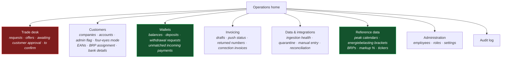

# F12 — Employee Back Office

**Portal:** employee · **Priority:** Must · **Phase:** 1–3 · **Size:** L

> ⚠ **The size is stale.** `L` was set before the 2026-08-19 round. That round removed four
> reference-data screens and added five surfaces (§1.1), one of which — the energiebelasting bracket
> table **[DEC-74]** — is the largest single back-office screen in the set. The net is larger, not
> smaller. Re-sizing and the requirement counts belong to
> [70-delivery/01-roadmap-and-phasing.md](../70-delivery/01-roadmap-and-phasing.md) and
> [README.md](README.md), which are not this document's to change; both are now out of date for F12.

---

## 1. Summary

The employee portal is where PeakPower runs the business. It is not a customer portal with extra
buttons: the work is different, the density is different, and the time pressure on the trade desk is
different from anything a customer experiences.

Much of its functionality is specified inside other features — trade pricing in
[F05](F05-energy-block-trading.md), wallet operations in [F06](F06-wallet-and-ledger.md), invoicing
in [F10](F10-invoicing-and-settlement.md). This document covers what is specific to the employee
experience: the operational home, reference data administration, cross-customer search, and
integration health.

### 1.1 What the 2026-08-19 round did to this surface

More of this document changed than of any other feature, because almost every decision in the round
either moved work **out** of the platform into the bookkeeping program or created a **manual step**
that an employee has to see and act on. Both land here.

| Surface | 2026-08-19 | Driven by |
| --- | --- | --- |
| **Energiebelasting brackets** — tier boundaries and €/kWh rates per calendar year, versioned, editable without a release — plus a **per-customer reduction or exemption** | **Gained.** The biggest new screen in the round | **[DEC-74]** reverses **[DEC-24]** |
| **BRP** reference data — endpoint, credentials, document format — and the assignment of metering points to a BRP | **Gained** | **[DEC-69]** extends **[DEC-21]** |
| **Withdrawal requests** awaiting manual payout | **Gained** | **[DEC-83]** reverses **[DEC-43]** |
| **Unmatched incoming payments** for wallet deposits | **Gained** | **[DEC-106]** amends **[DEC-58]** |
| **Four-eyes mode per customer company**, with its admin accounts | **Gained** (and it replaces a screen, see below) | **[DEC-71]** replaces **[DEC-33]** |
| **Markup percentage** on price indications, default 2% | **Gained** | **[DEC-80]** |
| **Manual entry of reconciliation data** after the correction window | **Gained** | **[DEC-98]** reverses **[DEC-57]**; **[DEC-60]** |
| Four-eyes **threshold** reference-data screen | **Lost.** There is no threshold, so there is no table | **[DEC-71]** |
| Surcharge / topup tariff screens | **Lost.** The platform pushes volume; the bookkeeping program multiplies it by the topup fee | **[DEC-73]** reverses **[DEC-35]** |
| Feed-in tariff maintenance | **Lost.** Export settles raw at the day-ahead price | **[DEC-87]** reverses the second half of **[DEC-44]** |
| Wallet threshold rules | **Lost.** The balance is visible, not monitored | **[DEC-90]** reverses **[DEC-49]** |
| Invoice **numbering** and **PDF generation** controls | **Lost.** Employees review a draft and push it; the bookkeeping program numbers, renders and sends | **[DEC-88]** reverses **[DEC-45]**; **[DEC-89]** reverses **[DEC-46]** |
| Cross-customer same-period warning on the desk | **Lost** | **[DEC-91]** amends **[DEC-50]** |
| Wallet manual adjustment / chargeback path | **Lost.** Chargebacks and reversals are the bookkeeping program's | **[DEC-85]** |

The shape of the change: **reference data shrank, worklists grew.** Three of the four screens removed
were places where an employee typed a number that a calculation later read. Two of the five added are
queues where an employee does something a machine cannot — pay a withdrawal by bank transfer, match a
payment that arrived without its reference. The remaining net cost is real and is not a wash: the
energiebelasting table alone is a versioned, per-year, per-tier editor with a per-customer override,
and it is on the invoice path, so it needs the same "cannot be changed retroactively" guard as the
peak calendar **[F12-R25]**.

## 2. Information architecture

⚠ **Redrawn 2026-08-19.** The previous map named surcharges as reference data, an annual true-up
under invoicing, and wallet adjustments; all three left the platform this round. The diagram below is
the post-round truth. The original is kept in prose immediately underneath rather than as a second
diagram, because two diagrams disagreeing is exactly the failure this note exists to prevent.

What the previous version of this diagram said, and why each part of it is gone: reference data read
*"calendars · surcharges · tickers"* — surcharges left with **[DEC-73]**; invoicing read
*"runs · drafts · credit notes · true-up"* — the annual true-up became a continuous correction
invoice **[DEC-99]** and numbering left with **[DEC-88]**; wallets read
*"balances · deposits · adjustments"* — the manual adjustment path left with **[DEC-85]** and two
worklists arrived in its place **[DEC-83]**, **[DEC-106]**.

The trade desk is highlighted because it is the only screen with a clock running against it. It gets
its own top-level position and its own alerting, and it must be reachable in one click from anywhere.
**Wallets** and **Reference data** are marked as the two branches this round rebuilt: wallets gained
two worklists that did not exist, and reference data lost four tables — four-eyes thresholds,
surcharges, feed-in tariffs, wallet thresholds — and gained three: energiebelasting brackets, BRPs
and the markup percentage.

## 3. Functional requirements

### Operations home

| ID | Requirement | MoSCoW |
| --- | --- | :--: |
| F12-R01 | The home screen shows live counters: open requests, offers awaiting response (with the soonest expiry), **trades awaiting customer approval (with the soonest expiry) ~~[DEC-33]~~ ⚠ Amended 2026-08-19 by [DEC-71]** — the queue stands, but it is fed by the customer company's four-eyes **mode**, not by a threshold — trades awaiting confirmation (with the oldest age), ~~wallets below threshold~~ ⚠ **Reversed 2026-08-19 by [DEC-90]** — there are no wallet thresholds to be below, failed integrations, invoice drafts pending review **[F12-R58]**, **withdrawal requests awaiting payout [DEC-83]**, **unmatched incoming payments [DEC-106]**. | Must |
| F12-R02 | Each counter links to a filtered working list. | Must |
| F12-R03 | Counters refresh without a page reload. | Must |
| F12-R04 | Items requiring action within a time window are visually ranked by urgency, not by creation order. | Must |
| F12-R05 | The home screen is role-aware: a trader sees the desk first, finance sees invoicing first. Under **[DEC-104]** the **operator** role sees integration and job health first — see **[F12-R62]**. | Should |

### Trade desk

| ID | Requirement | MoSCoW |
| --- | --- | :--: |
| F12-R06 | **Four** queues — **To price** (`REQUESTED`), **Awaiting customer** (`OFFERED`, counting down), **Awaiting approval** (`AWAITING_APPROVAL`, counting down on the *same* clock) ~~**[DEC-33]**~~ ⚠ **Amended 2026-08-19 by [DEC-71]** — the queue and its clock are unchanged; what puts a trade in it changes from *value above a threshold* to *the customer company has four-eyes on*, **[DEC-71]**, **To confirm** (`ACCEPTED`) — visible simultaneously. | Must |
| F12-R07 | New requests appear without a refresh, with an audible or visual cue that can be disabled per user. | Must |
| F12-R08 | Offers under 5 minutes remaining are highlighted; expired ones move out of the queue automatically. | Must |
| F12-R09 | Queues can be filtered by customer, shape, delivery period and value. | Should |
| F12-R10 | The desk shows total value at risk: sum of open offers, **trades awaiting customer approval**, and unconfirmed accepted trades. | Should |
| F12-R34 | The **Awaiting approval** queue shows per trade: customer, value, the account that accepted with their job title, ~~the threshold that was applied~~ ⚠ **Amended 2026-08-19 by [DEC-71]** — there is no threshold; the cell shows that the company's **four-eyes mode is on** instead, ~~the number of accounts still eligible to approve~~ ⚠ **Amended 2026-08-19 by [DEC-71]** — the number of **admin** accounts of that company still eligible to approve, since only an admin can, and a countdown to the offer's `expires_at`. It is a **watch** queue — no trader action is possible on it, which is the point: an unapproved trade is not yet PeakPower's to execute **[F05-R66]**. | Must |
| F12-R35 | ~~At pricing time the trade detail warns that the request's estimated value is above the customer's effective four-eyes threshold~~ ⚠ **Amended 2026-08-19 by [DEC-71]** — at pricing time the trade detail shows that the customer company **has four-eyes on**, which under [DEC-71] is true for *every* trade of that company regardless of value, so the trader can quote a reaction window two people can actually meet **[F05-R58]**. A 30-minute default on a trade needing two signatures is the single most likely cause of a wasted round trip. The warning fires **more often** than it did under [DEC-33], not less: with no threshold there is no small trade that skips it. | Must |
| F12-R36 | ~~The desk flags a customer with **fewer than two active accounts** whose request is above the threshold~~ ⚠ **Amended 2026-08-19 by [DEC-71]** — the desk flags a **four-eyes** customer with **fewer than two active admin accounts**: they cannot clear the control at all, and the trade will expire unapproved. [DEC-71] makes this rarer but not impossible — **[F12-R41]** refuses to *enable* four-eyes below two admins, yet an admin can be deactivated afterwards. The flag links to account administration so the trader can raise it with the customer before offering. | Must |
| ~~F12-R37~~ | ~~The desk **warns when two or more customers have open requests or live offers for the same delivery period and shape** **[DEC-50]**, showing the other customers and the combined volume. It is a signal that concentration is building in one period, not a block — the trader decides what to do with it.~~ ⚠ **Reversed 2026-08-19 by [DEC-91]** — retired, not replaced. [DEC-91] amends [DEC-50]: *"It is okay if the customer requests the same period."* The cross-customer same-period warning is withdrawn and nothing takes its place; concentration is not something the desk is asked to surface. **The soft lock on a single request stands** and is the only collaboration cue the desk has — see the edge case in §6 and **[DEC-50]**. | ~~Must~~ Retired |

### Cross-customer search

| ID | Requirement | MoSCoW |
| --- | --- | :--: |
| F12-R11 | A single search box resolves company name, KvK, **account name or username**, EAN, trade reference, invoice number, payment reference and wallet reference. ⚠ **Amended 2026-08-19**: the *invoice number* it searches on is the one **returned by the bookkeeping program** **[DEC-88]** — the platform no longer mints one, so a draft that has not been pushed is findable only by customer and period, and the *payment reference* is the platform-issued deposit reference **[DEC-106]**, which is the key the unmatched-payments worklist **[F12-R56]** matches on. | Must |
| F12-R12 | Results are grouped by type and go straight to the object. | Must |
| F12-R13 | Recently viewed objects are offered as shortcuts. | Should |

### Customer accounts

| ID | Requirement | MoSCoW |
| --- | --- | :--: |
| F12-R14 | The customer detail page lists the company's accounts with name, job title, email, phone, status, created-by and last sign-in **[F01-R22]**. | Must |
| F12-R15 | A trader or admin can create an account, edit its details, resend its invitation and deactivate it **[F01-R10..R18]**. | Must |
| F12-R16 | Creating an account warns if the username is already taken, without revealing which company holds it. | Must |
| F12-R17 | Deactivating the last active account of a company requires explicit confirmation and a reason **[F01-R19]**. | Should |
| F12-R18 | A list of stale invitations — `INVITED` for more than 14 days — is available so onboarding does not quietly stall. | Should |

### Four-eyes administration — new 2026-08-19 **[DEC-71]**

**[DEC-71]** replaces **[DEC-33]**. Four-eyes stops being *"any trade above €X needs a second
signature"* and becomes *"this customer company runs in four-eyes mode"* — a boolean on the company,
no threshold in euros or megawatts, and therefore **no threshold reference table** (see the retired
**[F12-R38]**). The actions in scope are add a bank account, deactivate a bank account, execute a
trade, add a user, and withdraw funds; **deposits are explicitly out of scope**, because a customer
can wire money or use iDEAL on their own and gating a deposit gates nothing.

The one thing the back office must get right here is the boundary: it **configures and observes** the
control; it never **exercises** it. The approver is an **admin account of the customer's own
company** **[DEC-71]**, never a PeakPower employee — see business rule 6.

| ID | Requirement | MoSCoW |
| --- | --- | :--: |
| F12-R39 | The customer detail page shows the company's **four-eyes mode** (on/off) and lists its **admin accounts** — the accounts that can approve or decline — alongside the ordinary account list **[F12-R14]**. An account's **admin** flag is set and cleared here, by a PeakPower employee **[DEC-16]**, **[DEC-71]**. | Must |
| F12-R40 | An employee can **enable** or **disable** four-eyes for a company. The change is audited with actor, timestamp and before/after **[DEC-17]**, and takes effect for actions started after it — a trade already `AWAITING_APPROVAL` is not released by switching the mode off. | Must |
| F12-R41 | Enabling four-eyes for a company with **fewer than two active admin accounts is refused**, with an explanation and a link to account administration. One admin cannot be a second pair of eyes for themselves, so the control would be unsatisfiable and every sensitive action would hang until it expired. | Must |
| F12-R42 | The back office **observes** the four-eyes trail — pending, approved, declined, expired, with both accounts and both timestamps — and offers **no action on it**. There is no approve button, no decline button and no override anywhere in the employee portal **[DEC-71]**, **[F05-R66]**. | Must |
| F12-R43 | Deactivating an admin account that would leave a **four-eyes company with fewer than two active admins** warns explicitly that the company's sensitive actions will start hanging, and requires confirmation and a reason. It is not refused — the account may be a leaver — but it is never silent. It is stricter than **[F12-R17]**, which only guards the *last* account of any company. | Must |

### Reference data

| ID | Requirement | MoSCoW |
| --- | --- | :--: |
| F12-R19 | Admins can manage peak calendars, including the weekday rule, the window and the excluded-date list per year **[DEC-14]**. The screen ships with the **[DEC-19]** answer as its default: weekday rule **Mon–Fri**, window **at or after 08:00 and strictly before 20:00** `Europe/Amsterdam`, and `excluded_dates[]` **empty** — public holidays are not excluded. The exclusion list stays editable so that answer can change without a release, which is the whole point of [DEC-14]. | Must |
| F12-R20 | Admins can load and view energiebelasting tariff tables per commodity per year. Editing an already-used tariff is blocked; a new version is created instead. ~~**Deferred by [DEC-24]** (was Must) — EB is out of scope for now, so no tariff is loaded and the screen is not built. `billing.energy_tax_tariff` stays in the model, unpopulated, so the screen and the calculation return together.~~ ⚠ **Reversed 2026-08-19 by [DEC-74]** — energiebelasting is back in scope and this screen is built. The deferral is withdrawn, the MoSCoW returns to **Must**, and `billing.energy_tax_tariff` is populated rather than left empty. The requirement is **superseded in detail** by **[F12-R44]**…**[F12-R47]**, which say what "tariff table" now means: **brackets**, not a single rate. Kept as the parent row because the audit and retroactivity rules **[F12-R24]**, **[F12-R25]** attach to it. | ~~Deferred~~ **Must** |
| ~~F12-R21~~ | ~~Finance can manage surcharges **[F09](F09-surcharges.md)**.~~ ⚠ **Reversed 2026-08-19 by [DEC-73]** — retired. [DEC-73] reverses [DEC-35]: the platform computes and pushes **volume**, and the bookkeeping program multiplies it by the topup fee. There is no surcharge tariff to maintain, no resolution order to configure and no invoice line 4 to preview. ⚠ The **feed-in tariff**, which [DEC-44] put on the same screens under the same rules, is retired with it by **[DEC-87]** — export settles raw at the day-ahead price and there is no feed-in rate at all. See [F09](F09-surcharges.md), whose owner carries the same reversal. | ~~Must~~ Retired |
| F12-R22 | Traders and admins can manage Montel product/ticker mapping **[F04](F04-price-indications.md)**. Extended 2026-08-19: the same screen carries the **markup percentage** **[F12-R48]**, **[DEC-80]**. | Must |
| ~~F12-R23~~ | ~~Finance and admins can manage wallet threshold rules **[F11](F11-notifications.md)**.~~ ⚠ **Reversed 2026-08-19 by [DEC-90]** — retired. [DEC-90] reverses [DEC-49]: there are no warning or critical balance amounts, because *"the customer can only trade within his balance"*. The balance is **visible**, not **monitored**; the pre-trade check **[DEC-41]** is the only thing that reads it for a decision. `wallet_threshold_rule` and its screen go with it. | ~~Must~~ Retired |
| F12-R24 | Every reference-data change is audited with before/after values, and shows which future calculations it will affect. This now includes the energiebelasting brackets **[F12-R44]**, the per-customer reduction **[F12-R46]**, the markup percentage **[F12-R48]** and BRP configuration **[F12-R49]**. | Must |
| F12-R25 | A reference-data change that would affect an already-invoiced period is blocked with an explanation. ⚠ **Amended 2026-08-19 by [DEC-88]**: "already-invoiced" is no longer a state the platform owns. A period counts as invoiced once its draft has been **pushed and a number returned** by the bookkeeping program **[F12-R59]**. A period whose draft is calculated but not yet pushed is still open, and is recalculated rather than blocked **[F10-R14]**. ⚠ **Cost, recorded**: the guard now depends on an integration having answered. If the push status is unknown, the block is applied — the safe direction — and the reason given says so. | Must |
| ~~F12-R38~~ | ~~Finance and admins can manage **four-eyes thresholds** **[DEC-33]**, **[F05-R50]**: scope (`GLOBAL_DEFAULT` or a specific customer), amount in EUR VAT-exclusive — with an explicit *never require approval* option distinct from leaving it blank — `valid_from`, `valid_to` and a note. Overlapping periods for the same scope are rejected, and a change never affects a trade already accepted **[F05-R54]**. ⚠ The screen ships with no rows, because [DEC-33] does not state a value. Until one is in force, acceptance is refused with a configuration error and the operations home raises a reference-data alert **[F05-R53]** — the platform does not guess a default in either direction.~~ ⚠ **Reversed 2026-08-19 by [DEC-71]** — retired. [DEC-71] replaces [DEC-33] with a **per-company mode and no threshold**, in euros or in megawatts, so there is no threshold table, no scope resolution, no validity periods and no empty-screen problem. Replaced by **[F12-R39]**…**[F12-R42]**. ⚠ This is the one unambiguously *good* piece of news in the round for this document: the screen that could not ship — because [DEC-33] never named a value, so acceptance would have been refused outright **[F05-R53]** — is the screen that no longer needs to exist. | ~~Must~~ Retired |

#### Energiebelasting brackets — new 2026-08-19 **[DEC-74]**

**[DEC-74]** reverses **[DEC-24]**. Energiebelasting is calculated by the platform, per EAN, per
calendar year, on net usage **[DEC-22]**, and the result is **pushed as a ledger entry** to the
bookkeeping program **[DEC-76]**, **[DEC-107]** — the platform does not put it on an invoice line it
numbers itself **[DEC-88]**. What lands in the back office is the data the calculation reads.

The source is explicit about why this is a screen and not a constant: *"we need to be able to change
those prices"*. Rates change by ministerial decision on a calendar-year boundary and the platform
must follow without a release. That is the whole justification for the versioning below.

| ID | Requirement | MoSCoW |
| --- | --- | :--: |
| F12-R44 | Finance and admins can maintain the **energiebelasting bracket table**: per **calendar year**, an ordered set of tiers, each with a **lower bound** and **upper bound** in kWh and a **rate in €/kWh** **[DEC-74]**. The top tier has no upper bound. Rates are held to the precision the published tariff uses, not rounded to cents. | Must |
| F12-R45 | The bracket table is **versioned, never edited in place**. A saved version is immutable; a change creates a new version with a `valid_from` and the acting employee **[DEC-17]**. A version that has been read by a completed calculation can never be altered, only superseded — the same rule **[F12-R20]** always carried. Editing is available **without a release** **[DEC-74]**; that is the point of the screen. | Must |
| F12-R46 | A **per-customer reduction or exemption** can be recorded: no reduction (the default and the ~90% case), a **percentage reduction applied per bracket**, or a full exemption, with `valid_from`, `valid_to`, a mandatory reason and a reference to the ruling or certificate that justifies it. The source names growers as the example. It is per customer, not per EAN, unless the customer detail says otherwise. | Must |
| F12-R47 | Before a bracket version is saved, the screen **validates the table and shows its blast radius**: tiers must be contiguous with no gap and no overlap, bounds ascending, the year fully covered; and the preview names how many customers and EANs the version will affect and from when. A wrong boundary here silently mis-taxes every EAN for a year, which is why this validation is a Must and not a nicety. | Must |
| F12-R48 | Traders and admins can maintain the **markup percentage** applied to a quoted price indication **[DEC-80]**, **[F04-R04]**: a percentage, **default 2%**, settable, versioned like any other reference data, and never a compiled constant. Indications are shown as *quote + markup*, never raw. ⚠ The markup is now the platform's **only** margin instrument — [DEC-73] took the surcharge out — so a wrong value here is a direct margin error with nothing downstream to catch it. ⚠ Which side of the market is marked up (bid per [DEC-80]'s comment, ask per [OQ-23]'s answer) is carried on **[OQ-23]** and must be settled with the ticker symbols before the screen ships. | Must |

#### BRP administration — new 2026-08-19 **[DEC-69]**

**[DEC-69]** turns the metering-data source into configurable reference data. PVNed is the first BRP,
not the only one, and the PVNed webhook and parser become **one adapter behind a port** rather than
the ingestion pipeline itself. Raw-payload persistence, versioning **[DEC-07]** and quarantine stay
BRP-agnostic in the pipeline **[F02](F02-metering-data-ingestion.md)**.

| ID | Requirement | MoSCoW |
| --- | --- | :--: |
| F12-R49 | Admins can add, edit and deactivate a **BRP**: name, **endpoint**, **credentials**, **document format / adapter**, and the direction and trigger of the exchange **[DEC-69]**. Credentials are write-only in the UI — they can be replaced, never read back — and their rotation is audited like any other reference-data change **[F12-R24]**. | Must |
| F12-R50 | A **metering point is assigned to a BRP** **[DEC-69]**, on the EAN detail screen and in bulk from a customer's EAN list. A metering point with no BRP cannot receive data and is listed as a configuration error on the ingestion health view **[F12-R26]**. Reassignment is forward-only and does not rewrite the BRP recorded on already-ingested versions. | Must |
| F12-R51 | The integration status panel **[F12-R29]** is **per BRP**, not a single "PVNed" tile. Adding a BRP adds a tile; it is not a code change to the panel. | Should |

### Data & integrations

| ID | Requirement | MoSCoW |
| --- | --- | :--: |
| F12-R26 | An ingestion health view shows per metering point: last data date, data state per recent day, and gaps. Extended 2026-08-19: it also lists metering points with **no BRP assigned** **[F12-R50]**, which are a configuration error rather than a gap. | Must |
| F12-R27 | A message log lists inbound ~~PVNed~~ **BRP [DEC-69]** messages with status, and allows viewing the raw payload and replaying **[F02-R27]**. ⚠ **Amended 2026-08-19 by [DEC-69]** — the log is filtered by BRP and shows which one a message came from. PVNed is one row in that filter, not the whole log. | Must |
| F12-R28 | A quarantine view lists series that could not be attached, with a one-click resolve once the EAN is registered. | Must |
| F12-R29 | An integration status panel covers ~~PVNed~~ **each configured BRP [DEC-69]**, Montel, ~~the payment provider~~, ~~Odoo~~ **the bookkeeping program [DEC-88]** and email: last success, error counts, current state. ⚠ **Amended 2026-08-19.** Three changes: PVNed becomes one tile per BRP **[F12-R51]**; **no payment provider is chosen [DEC-86]**, so that tile exists only once one is, and the incoming-payment feed it is replaced by is undecided **[OQ-93]**; and Odoo becomes "the bookkeeping program", which under [DEC-88] and **[DEC-89]** is now on the **critical path for issuing an invoice at all** — its tile is a P1 signal, not an informational one. | Must |
| F12-R30 | Employees can trigger a manual poll or retry per integration. | Should |
| F12-R52 | An employee can **enter reconciliation data manually** for a (metering point, period) after the 10-working-day correction window has closed **[DEC-98]**, **[DEC-60]**. ⚠ **[DEC-98] reverses [DEC-57]**: reconciliation data *does* arrive after the window, sometimes as a document on the feed and sometimes as a manual process — *"This can also be a manual process"* — so the window stops being the end of the correction story. Entry reuses the manual-entry path **[F02-R36]**…**[F02-R38]**: whole-day, flagged as manual, with the entering employee and a mandatory reason, and the flag propagates to every downstream figure **[F02-R37]**. A manually entered reconciliation supersedes the prior version and, under **[DEC-99]**, produces a **correction invoice draft for the delta [F12-R60]** — at any time, however late. | Must |

### Withdrawal requests — new 2026-08-19 **[DEC-83]**

**[DEC-83]** reverses **[DEC-43]**. A customer can get money out of the wallet again, and the payout is
a **manual bank transfer** made by an employee — *"Customer asks for withdrawal, we get a message and
pay it out manually"*. There is no payment-provider payout, no automation and, deliberately, **no
invoice** for a withdrawal or a deposit (OQ-68). The platform's job is to make sure the request, the
approval and the debit are all recorded, and that nothing is paid twice.

| ID | Requirement | MoSCoW |
| --- | --- | :--: |
| F12-R53 | A **withdrawal request worklist** shows every request awaiting payout: customer, amount, requested by, requested at, age, the destination **bank account on the customer record [DEC-61]**, current wallet balance, and four-eyes state where the company has it on **[DEC-71]**. It is reachable from a home counter **[F12-R01]**. | Must |
| F12-R54 | An employee **records the payout** after making the bank transfer: value date, the amount actually transferred, the bank reference, and the acting employee **[DEC-17]**. Recording the payout is what debits the wallet **[F06](F06-wallet-and-ledger.md)**; the platform never initiates the transfer itself. ⚠ **Cost, recorded**: the platform's balance is correct only if the employee records what the bank did. A transfer made and not recorded leaves a customer able to spend money that has left the account — the reconciliation guard is the bank feed on the bookkeeping side **[DEC-109]**, not the platform. | Must |
| F12-R55 | A request whose company has four-eyes on and whose **second admin approval is still pending is not payable**: the payout action is disabled and the row states what it is waiting for **[DEC-71]**, **[F12-R42]**. The employee sees the approval state; the employee does not supply it. A **declined** or **expired** request leaves the worklist with that outcome recorded and is never paid. | Must |

### Unmatched incoming payments — new 2026-08-19 **[DEC-106]**

**[DEC-106]** amends **[DEC-58]** and makes bank transfer a first-class deposit route rather than an
out-of-band manual step, because **iDEAL is limited at the bank side** **[DEC-86]**. The platform
issues a **unique payment reference** per deposit intent, the customer quotes it in the payment
description, and the platform matches on it and credits the wallet automatically. This worklist is
for what the automatic match misses.

| ID | Requirement | MoSCoW |
| --- | --- | :--: |
| F12-R56 | An **unmatched incoming payments** worklist shows every received payment the platform could not attribute: value date, amount, payer name, payer IBAN, the raw description, and why the match failed. It is reachable from a home counter **[F12-R01]**. | Must |
| F12-R57 | Matching order, and it is an order, not a set **[DEC-106]**, **[DEC-61]**: **(1)** the **platform-issued payment reference** found in the description — automatic, no worklist row; **(2)** the **payer IBAN** resolving to exactly one customer — the fallback for a customer who omitted the reference; **(3)** anything else — an employee matches it by hand from this worklist, choosing the wallet, with a mandatory reason. An IBAN resolving to **no** customer or to **more than one** goes to the worklist rather than guessing **[F07-R22]**. On a successful match the wallet is credited and the customer is emailed that funds were received **[DEC-106]**. | Must |

### Invoicing — amended 2026-08-19 **[DEC-88]**, **[DEC-89]**

⚠ **The back office stops issuing invoices.** **[DEC-88]** reverses **[DEC-45]** and **[DEC-89]**
reverses **[DEC-46]**: the platform **calculates and pushes a draft**, and the bookkeeping program
checks it, **assigns the number**, **renders the PDF** and **emails it**. Everything in the employee
portal that minted a number, rendered a document or sent a customer email about an invoice is
removed. What remains is review, push, and the status of the push.

| ID | Requirement | MoSCoW |
| --- | --- | :--: |
| F12-R58 | Finance **reviews a calculated draft** — per customer, per period, per EAN, with its lines and the energiebelasting amount **[DEC-74]** — and **pushes** it to the bookkeeping program **[DEC-88]**. Review and recalculation **[F10-R14]** and discard-with-a-reason **[F10-R15]** happen **before** the push; after it, the document is the bookkeeping program's. | Must |
| F12-R59 | The draft shows its **push status** — not pushed, pushing, pushed, failed, with the failure reason — and, once returned, the **invoice number assigned by the bookkeeping program** **[DEC-88]**. The number is stored for display, search **[F12-R11]** and reconciliation, and is **never minted by the platform**. A failed push is retryable and is counted on the operations home **[F12-R01]**. ⚠ **Cost, recorded, because [DEC-45]'s rationale was exactly this**: the customer-facing invoice number now depends on an integration *and* on a human check in another system. A push failure means the customer has no numbered invoice at all, and nothing in this portal can produce one. | Must |
| F12-R60 | A **correction invoice draft** can be produced for the delta at any time, whenever a late metering correction lands **[DEC-99]**, **[DEC-98]** — months after the month it belongs to. It follows the same review-and-push path as any other draft. ⚠ **Amended 2026-08-19 by [DEC-100]** — there is **no materiality threshold**: every difference is handled individually, nothing is netted, batched or waived below an amount. The €25 default is removed rather than configured, so no screen carries it. | Must |
| F12-R61 | Invoice **numbering**, **PDF rendering** and **customer emailing** of an invoice are **absent from the employee portal** **[DEC-88]**, **[DEC-89]**. There is no "finalise", no "generate PDF", no "resend invoice". The portal links to the document in the bookkeeping program instead. Platform-sent email narrows to the platform's own notifications — offers, wallet events, alerts **[DEC-48]**, **[F11](F11-notifications.md)**. | Must |

### Operations & alerting — new 2026-08-19 **[DEC-104]**

| ID | Requirement | MoSCoW |
| --- | --- | :--: |
| F12-R62 | The platform is operated after go-live by a **single named operator — Thinh [DEC-104]**. Operational alerts and job/integration failures route to that one person; there is no rota and no secondary. The operator role sees integration and background-job health first on the home screen **[F12-R05]**. | Must |
| F12-R63 | ⚠ **The single-point-of-failure is recorded, not solved.** With one operator and no rota, a **P1 alert raised while that person is unavailable is not seen by anyone**. The back office mitigates only what a screen can mitigate: every alert is **persistent and visible in the portal**, not fire-and-forget email, so an unacknowledged P1 is still on the operations home when someone next looks; and every alert shows **when it was raised and whether it was acknowledged, by whom**. This is a smaller mitigation than a rota and is not a substitute for one — see [70-delivery/02-risks.md](../70-delivery/02-risks.md), which owns the risk. | Must |

### View-as-customer

| ID | Requirement | MoSCoW |
| --- | --- | :--: |
| F12-R31 | Employees can view the customer portal as a specific customer, **read-only**, with a persistent banner. | Must |
| F12-R32 | Every impersonation session is logged with employee, customer, start and end, and is visible in the customer's own audit view. | Must |
| F12-R33 | No write action is possible while impersonating. | Must |

## 4. Business rules

1. **Read is broad, write is narrow.** Any employee can look; only the right role can change.
2. **Every write names an actor and, where it affects a customer, a reason.**
3. **Reference data cannot be changed retroactively into an invoiced period.** ⚠ **Amended
   2026-08-19 by [DEC-88]** — "invoiced" now means *pushed and numbered by the bookkeeping program*,
   which is a fact the platform learns rather than one it owns **[F12-R25]**, **[F12-R59]**.
4. **Impersonation is read-only and always visible** — to the employee, in the audit log, and to the
   customer.
5. **The desk never loses an item.** A state change moves an item between queues; nothing disappears
   without a terminal state. This now covers the two new worklists: a withdrawal request and an
   unmatched payment each leave their queue only through a recorded terminal outcome — paid,
   declined, expired; matched, returned to sender **[F12-R53]**, **[F12-R56]**.
6. **No employee can approve on a customer's behalf** ~~**[DEC-33]**~~ **[DEC-71]**. There is no
   override, no "approve for customer" and no support workaround. An override would be one pair of
   eyes wearing PeakPower's badge, which is exactly the thing the control exists to prevent. The
   desk's role is to *watch* the awaiting-approval queue, not to clear it. ⚠ **Amended 2026-08-19 by
   [DEC-71]** — the rule is unchanged and, if anything, sharper. The approver is now specifically an
   **admin account of the customer's own company**, so "on a customer's behalf" has a named holder
   rather than being any active account of that company. Employees **configure** the mode
   **[F12-R40]** and **observe** the outcome **[F12-R42]**; that is the entire employee involvement.
7. **Density over whitespace.** This is a professional tool used all day. Tables, keyboard
   navigation, and no modal that hides the queue behind it.
8. **The platform pushes; it does not issue** **[DEC-88]**, **[DEC-89]**, **[DEC-76]**. No invoice
   number, no PDF, no VAT calculation and no customer invoice email originates here. Anything the
   back office shows about a finished invoice is a value the bookkeeping program returned.
9. **Manual money moves are recorded, never initiated** **[DEC-83]**, **[DEC-106]**. The employee
   makes the bank transfer or reads the incoming payment in the bank; the platform records what
   happened and adjusts the wallet. It holds no payment credentials and initiates no payment.
10. **A manual entry never hides that it is manual** **[DEC-60]**. Reconciliation entered by hand
    after the correction window **[F12-R52]** carries the entering employee, the reason and a flag
    that propagates to every downstream figure **[F02-R37]** — including onto the correction invoice
    draft it triggers.

## 5. Screens

| Screen | Mockup | 2026-08-19 |
| --- | --- | --- |
| Operations home | [`employee-home.svg`](../60-mockups/employee-home.svg) | ⚠ Counters changed **[F12-R01]**: the wallets-below-threshold tile is gone **[DEC-90]**; withdrawal requests **[DEC-83]** and unmatched payments **[DEC-106]** are new |
| Customer administration — accounts and bank details | [`employee-customer-admin.svg`](../60-mockups/employee-customer-admin.svg) | ⚠ Gains the **four-eyes mode** toggle and the **admin** flag per account **[F12-R39]**, **[F12-R40]**, and the **BRP assignment** on the EAN list **[F12-R50]** |
| Trade desk | [`employee-trade-desk.svg`](../60-mockups/employee-trade-desk.svg) | ⚠ The same-period warning is removed **[DEC-91]**; the awaiting-approval queue keeps its column but loses the threshold **[F12-R34]** |
| Trade detail & pricing | [`employee-trade-detail.svg`](../60-mockups/employee-trade-detail.svg) | ⚠ The four-eyes banner is now mode-driven, not value-driven **[F12-R35]** |
| Wallet administration | [`employee-wallet-admin.svg`](../60-mockups/employee-wallet-admin.svg) | ⚠ Loses the manual-adjustment action **[DEC-85]** and the threshold rules **[DEC-90]**; gains the two worklists **[F12-R53]**, **[F12-R56]** |
| Invoice run dashboard | [`employee-invoice-run.svg`](../60-mockups/employee-invoice-run.svg) | ⚠ Loses *finalise*, *generate PDF* and *resend* **[F12-R61]**; gains push status and the returned number **[F12-R59]** |
| Ingestion health | [`employee-ingestion-health.svg`](../60-mockups/employee-ingestion-health.svg) | ⚠ Per-BRP rather than PVNed-only **[F12-R51]**; adds unassigned-BRP configuration errors **[F12-R26]** |
| **Energiebelasting brackets** | *No mockup yet* | **New [DEC-74]**. The largest new screen in the round **[F12-R44]**…**[F12-R47]** |
| **BRP administration** | *No mockup yet* | **New [DEC-69]** — **[F12-R49]** |
| **Withdrawal requests** | *No mockup yet* | **New [DEC-83]** — **[F12-R53]**…**[F12-R55]** |
| **Unmatched incoming payments** | *No mockup yet* | **New [DEC-106]** — **[F12-R56]**, **[F12-R57]** |

Four screens have no mockup. The mockup set in [60-mockups](../60-mockups/README.md) is generated
from `screens-employee.mjs` and is that directory's to extend; the seven existing files above also
need the amendments in the right-hand column. Recorded here so the gap is visible rather than
discovered during build. **[DEC-94]** now points the visual identity at the brand guidelines on
peakpower.nl, so the new screens are drawn branded rather than deliberately neutral.

## 6. Edge cases

| Case | Behaviour |
| --- | --- |
| Two traders open the same request | Both see it; a soft lock shows "being handled by …". Publishing is guarded by state, so the second attempt fails cleanly rather than double-offering. Nothing beyond this lock is required **[DEC-50]**, and **[DEC-91]** leaves this lock untouched — it is now the *only* collaboration cue on the desk |
| **Two customers request the same delivery period and shape** | ~~Both requests stand; the desk warns and shows the combined volume **[F12-R37]**, **[DEC-50]**. A concentration signal, not a conflict~~ ⚠ **Amended 2026-08-19 by [DEC-91]** — both requests stand and **nothing is shown**. *"It is okay if the customer requests the same period."* No warning, no combined volume, no concentration signal. The retired **[F12-R37]** was the only requirement that produced one |
| An offer expires while the trader is typing a confirmation | State guard refuses; the screen updates to explain |
| **A trader tries to confirm a trade still awaiting customer approval** | Refused by the state guard **[F05-R66]**. It never appears in "To confirm" in the first place, so this is a stale-tab case rather than a workflow |
| **The awaiting-approval queue is not emptying** | Nothing on the desk can clear it. The trader's only lever is to call the customer, or to quote a longer window next time **[F12-R35]** |
| 200 open requests | Queue paginates and prioritises; the counter shows the true total |
| Employee loses connection | Live updates reconnect and reconcile; nothing is assumed delivered |
| Reference data changed while an invoice run is in progress | The run uses the versions captured at its start |
| ~~**The four-eyes threshold is changed while trades are in flight**~~ | ~~Accepted trades already pinned their threshold version **[F05-R54]**. Trades not yet accepted pick up the new value at acceptance~~ ⚠ **Reversed 2026-08-19 by [DEC-71]** — there is no threshold to change. Replaced by the row below |
| **Four-eyes is switched off while trades are awaiting approval** | The mode change is forward-only **[F12-R40]**. A trade already `AWAITING_APPROVAL` still needs its second admin; switching the mode off does not release it. The alternative — retroactive release — would let one admin clear their own trade by first turning the control off, which is the control defeating itself |
| **A four-eyes company drops below two active admins** | The deactivation is allowed but warned and reasoned **[F12-R43]**; from that moment every sensitive action of that company hangs until it expires. The desk flags the company **[F12-R36]**. Re-enabling is blocked below two admins **[F12-R41]**, so the recovery is to appoint a second admin |
| **A bracket boundary is corrected after invoices for that year were pushed** | Blocked for the pushed periods **[F12-R25]**, allowed forward. The energiebelasting already pushed as a ledger entry is the bookkeeping program's record; correcting it there is **[DEC-107]**'s mapping work, not a platform edit |
| **An EAN transfers between customers mid-year** | Each period gets **50% of each bracket** — a straight half-and-half split of the annual tier boundaries, **not** pro-rata by days **[DEC-74]**, closing [OQ-77]. Worked: a first tier of 0–10 000 kWh at €0,1088/kWh becomes 0–5 000 kWh at €0,1088/kWh for *each* of the two periods. A customer holding the EAN for one month therefore gets the same 5 000 kWh of first-tier volume as one holding it for eleven. That is the answer given; it is not pro-rata and the screen must not present it as if it were |
| **A withdrawal is paid at the bank but not recorded** | The platform's balance is wrong and the customer can spend money that has gone **[F12-R54]**. There is no platform-side detection: the bank feed sits on the bookkeeping side **[DEC-109]**. The only control is that recording the payout and making the transfer are one operator's single task |
| **An incoming payment carries no reference and its IBAN matches two customers** | It goes to the unmatched worklist rather than being credited **[F12-R57]**, **[F07-R22]**. Guessing between two wallets is the one outcome worse than a delay |
| **A payment arrives for a deposit intent that the customer abandoned** | It is still matched on the reference and credited **[DEC-106]**. There is no minimum or maximum deposit **[DEC-84]** and no expiry rule was decided, so money received against a valid reference is money in the wallet |
| **A draft is pushed twice** | The push is idempotent on the platform's draft identifier. If the bookkeeping program returns a second number for the same draft, the platform stores both and raises it as a reconciliation exception — it cannot resolve a duplicate in a system it does not own **[DEC-88]** |
| **The bookkeeping program is unreachable at month-close** | Drafts stay in `failed` and are retried **[F12-R59]**. **No invoice can be issued at all** — this is the cost [DEC-88] and [DEC-89] accepted, and it is why the bookkeeping tile is a P1 signal **[F12-R29]** and why [OQ-69] is now a blocker rather than a detail |
| **A P1 alert fires while the single operator is unavailable** | Nobody is paged. The alert stays on the operations home, unacknowledged and visible, until someone looks **[F12-R63]**, **[DEC-104]**. This is a recorded gap, not a handled case |

## 7. Out of scope

- CRM, pipeline and opportunity management.
- Contract document management.
- Internal chat or task assignment.
- Business intelligence dashboards beyond the operational counters.

## 8. Dependencies

Every other feature. F12 is the operational surface over all of them.

## 9. Open questions

| Ref | Question | Status |
| --- | --- | --- |
| [OQ-09] | Four-eyes approval above a value threshold? | **Closed — [DEC-33]**: yes. Adds a fourth desk queue **[F12-R06]**, **[F12-R34]** and a reference-data screen **[F12-R38]** |
| [OQ-42] | How many concurrent employees, and does the desk need real-time collaboration cues beyond a soft lock? | **Closed — [DEC-50]**: no further cues, **but** a same-period warning is now required **[F12-R37]** |

> [OQ-02] — whether peak excludes public holidays — is **closed**. It does not **[DEC-19]**, and the
> peak-calendar screen **[F12-R19]** ships with an empty exclusion list rather than no exclusion list.

> ⚠ **[DEC-33]** closes [OQ-09] but leaves the threshold *amount* undecided, and **[F12-R38]**
> therefore ships an empty screen. This is not a nice-to-have: with no threshold in force, acceptance
> is refused outright **[F05-R53]**. The value must be set — per customer or globally — before the
> four-eyes state is built. Recorded in prose because it is a live question, not a numbered one.
