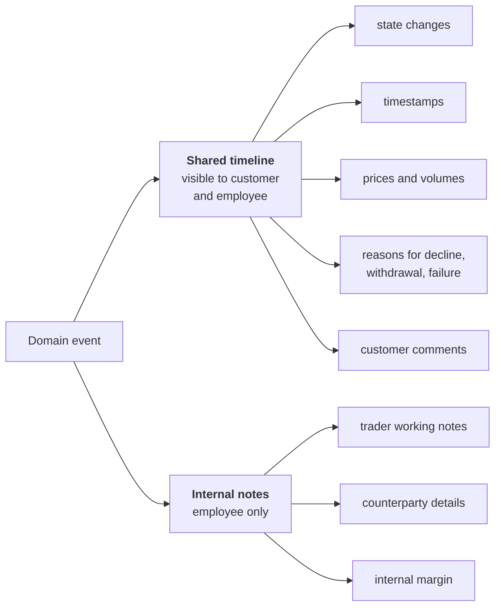

# F15 — Audit Trail & Observability

**Portal:** both · **Priority:** Must · **Phase:** 1–3 · **Size:** M

---

## 1. Summary

Two related but distinct concerns.

**The audit trail** is a product feature. The brief is explicit: the full history of a trade, with
timestamps and comments, must be visible to both the customer and the employee. The same applies to
the wallet ledger. This is not logging — it is user-facing, permanent, and part of what the customer
is buying.

**Observability** is an engineering concern: knowing the platform is healthy, and being able to
diagnose it when it is not.

They are specified together because they share a discipline — record what happened, immutably, with
enough context to reconstruct it later — but they are built with different tools and have different
audiences.

## 2. The audit trail

### 2.1 What is audited

| Domain | Recorded events |
| --- | --- |
| **Trade** | Every state transition with actor, timestamp, reason, price, window, and any comment **[DEC-06]** |
| **Wallet** | Every ledger entry, immutable, with actor and cause **[F06](F06-wallet-and-ledger.md)** |
| **Invoice** | Run, calculation, recalculation, finalisation, push, settlement, credit |
| **Master data** | Customer and metering point creation and change, with before/after |
| **Reference data** | Calendars, tariffs, surcharges, ticker mapping — before/after |
| **Access** | Sign-in, sign-out, failed authorisation, impersonation start/end |
| **Integration** | Message received, processed, failed, replayed |

### 2.2 Shared vs. internal



One event stream, two projections. Nothing that belongs in the shared timeline is ever hidden; the
internal channel exists precisely so the shared one can stay complete and honest.

### 2.3 Functional requirements

| ID | Requirement | MoSCoW |
| --- | --- | :--: |
| F15-R01 | Every trade state change is an immutable event with actor, UTC timestamp, previous and new state, and a reason where applicable. | Must |
| F15-R02 | For a customer-initiated event the actor is the **customer account**: account id, full name and job title, snapshotted as at the moment of the event **[DEC-17]**. Recording only the company is never sufficient. | Must |
| F15-R03 | Attribution survives deactivation and renaming: an event from 2026 still shows the person's name and job title as they were then. | Must |
| F15-R04 | The trade timeline is rendered chronologically for both customer and employee, from the same source. | Must |
| F15-R05 | Reasons for decline, withdrawal and failure always appear in the shared timeline. | Must |
| F15-R06 | Internal notes are stored separately and never exposed to the customer API. | Must |
| F15-R07 | Wallet entries are immutable and every entry names its cause **[F06-R04]** and its actor **[F06-R05]**. | Must |
| F15-R08 | Master and reference data changes record before/after values and the actor. | Must |
| F15-R09 | Impersonation sessions are logged and visible in the customer's own audit view **[F12-R32]**. | Must |
| F15-R10 | Audit records are retained for the full statutory retention period and are not deletable by any application path **[NFR-40](../20-architecture/08-non-functional-requirements.md)**. | Must |
| F15-R11 | Employees can search audit records by customer company, **customer account**, object, actor, type and date range. | Must |
| F15-R12 | A customer can see the audit trail of their own company's activity, including which colleague did what. | Should |
| F15-R13 | Audit records can be exported for a customer or object as CSV/JSON. | Should |
| F15-R14 | The trade timeline is included in the invoice drill-down path, so an invoice line reaches the trade's full history. | Should |

## 3. Observability

### 3.1 Requirements

| ID | Requirement | MoSCoW |
| --- | --- | :--: |
| F15-R15 | All services emit structured logs with a correlation id propagated across HTTP and background jobs. | Must |
| F15-R16 | OpenTelemetry traces and metrics are exported; .NET Aspire provides the local dashboard and the production exporter targets the chosen backend. | Must |
| F15-R17 | Health endpoints (`/health/live`, `/health/ready`) cover the database, the job store and each outbound integration. | Must |
| F15-R18 | Business metrics are emitted alongside technical ones: requests per hour, offer response time, acceptance rate, expiries, ingestion lag, invoice run duration. | Must |
| F15-R19 | Alerts fire on: PVNed silence beyond a threshold, Montel staleness, payment webhook failures, Odoo push failures, ledger reconciliation mismatch, unconfirmed accepted trades, invoice run failure. | Must |
| F15-R20 | Logs never contain personal data beyond identifiers, and never contain tokens, secrets or full payloads with personal data. | Must |
| F15-R21 | Raw inbound payloads are retained in the message store rather than in logs, with access restricted and audited. | Must |
| F15-R22 | A dead-letter view lists jobs that exhausted their retries, with a replay action. | Should |
| F15-R23 | Dashboards cover ingestion, trading funnel, wallet health and integration status. | Should |
| F15-R24 | Synthetic monitoring checks the customer portal login path from outside. | Could |

### 3.2 Correlation

```
inbound request / webhook / scheduled job
        │  correlation-id generated or accepted
        ▼
  application logs ──┐
  domain events ─────┼──► all carry the same correlation-id
  outbound calls ────┤
  background jobs ───┘
```

An operator investigating "the invoice for customer X in August is wrong" should be able to move from
the invoice, to the calculation run, to the interval-data versions it used, to the PVNed messages
that produced them, without leaving the trail.

## 4. Business rules

1. **Append-only, everywhere.** No application path updates or deletes an audit record.
2. **The customer sees the truth.** Anything that affected their money or their position is in their
   timeline.
3. **System actions have an actor too** — `SYSTEM:offer-expiry-job`, not a blank field.
4. **A customer action names a person, not a company.** "Vandersteen Koeling accepted the offer" is
   not an acceptable record when five people could have done it **[DEC-17]**.
5. **UTC in storage, local time in presentation**, always with the zone shown.
6. **Reason strings are mandatory** where the model says so, and are never auto-filled with a
   placeholder.
7. **Secrets never enter logs**, enforced by a redaction filter and checked in review.

## 5. Data

| Entity | Purpose |
| --- | --- |
| `trade_event` | The trade audit stream and state projection source |
| `wallet_entry` | The ledger, itself an audit record |
| `audit_record` | Generic audit for master and reference data, access and admin actions |
| `internal_note` | Employee-only notes, polymorphic to trade/customer/invoice |
| `inbound_message` | Raw payloads with restricted, audited access |

## 6. Edge cases

| Case | Behaviour |
| --- | --- |
| Audit write fails while the business write succeeds | Impossible: the audit write is in the same transaction as the state change |
| Very long trade history | Timeline paginates; the export covers everything |
| A customer account is deactivated after acting | The actor reference still resolves; name and job title were snapshotted on the record |
| Two accounts of one company act on one trade | Both appear, each with their own name and job title **[DEC-18]** |
| An account's job title changes | Past events keep the old title; new events use the new one |
| GDPR erasure request | Personal identifiers are pseudonymised; the financial and trade record is retained under the legal-obligation basis. Procedure in [Security](../20-architecture/07-security.md) |
| Clock skew between services | Timestamps are set by the database, not by application hosts |

## 7. Dependencies

Cross-cutting. Every feature writes to it; F12 and the customer portal read from it.

## 8. Open questions

| Ref | Question |
| --- | --- |
| [OQ-47] | Which observability backend — Azure Monitor / Application Insights, Grafana stack, or something already in use? |
| [OQ-48] | What retention period applies to audit records, and does any financial regulation impose a longer one than the fiscal seven years? |
