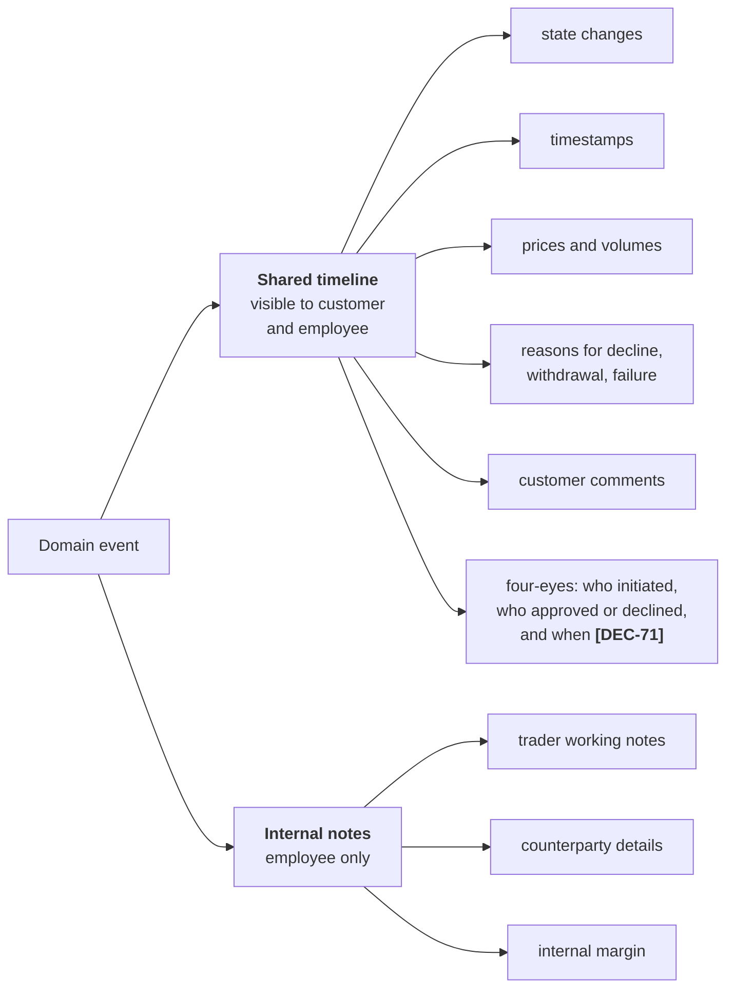

# F15 — Audit Trail & Observability

**Portal:** both · **Priority:** Must · **Phase:** 1–3 · **Size:** M

---

## 1. Summary

Two related but distinct concerns.

**The audit trail** is a product feature. The brief is explicit: the full history of a trade, with
timestamps and comments, must be visible to both the customer and the employee. The same applies to
the wallet ledger. This is not logging — it is user-facing, permanent, and part of what the customer
is buying.

**Observability** is an engineering concern: knowing the platform is healthy, and being able to
diagnose it when it is not.

They are specified together because they share a discipline — record what happened, immutably, with
enough context to reconstruct it later — but they are built with different tools and have different
audiences.

The 2026-08-19 round changed neither shape. It changed what this document is **responsible for**, in
five places.

| Decision | Effect here |
| --- | --- |
| **[DEC-95]** | Retention is the **fiscal seven years** — no financial regulation imposes longer. And the **financial record of record is the bookkeeping program's**: the platform pushes ledger IDs and values and keeps a trail of **actions** — who did what, when — not of accounts. Closes [OQ-48]. Drawn out in §2.4, **[F15-R10]** and **[F15-R27]** |
| **[DEC-71]** | Four-eyes stops being a value threshold on trades and becomes a **per-customer-company mode over five action types**. The trail must name the **initiating admin, the action, the approving or declining admin, and both timestamps** **[F15-R25]**, **[F15-R26]**. **[DEC-17]** — every action records the acting account — is **unchanged**, and is what makes an approval trail possible at all |
| **[DEC-88]**, **[DEC-89]** | Invoice **numbering, rendering and sending leave the platform**. The audit trail for a single customer-facing invoice document is therefore **split across two systems** — §2.4, §3.2, **[F15-R28]** |
| **[DEC-102]** | **No external penetration test is budgeted** before go-live; **[NFR-36]** assumed one. Recorded as residual risk in §3.4, because the audit trail and the alert set are now the only evidence that anything was reached from outside |
| **[DEC-104]** | **One named operator (Thinh), no rota.** Every P1 alert reaches exactly one person and escalates to nobody — a single point of failure, stated as one in §3.3 and made visible after the fact by **[F15-R29]** |

## 2. The audit trail

### 2.1 What is audited

| Domain | Recorded events |
| --- | --- |
| **Trade** | Every state transition with actor, timestamp, reason, price, window, and any comment **[DEC-06]** |
| **Wallet** | Every ledger entry, immutable, with actor and cause **[F06](F06-wallet-and-ledger.md)** |
| **Invoice** | ⚠ **Amended 2026-08-19 by [DEC-88]**, **[DEC-89]**, **[DEC-105]**. Original: *Run, calculation, recalculation, finalisation, push, settlement, credit.* The platform now records the **run**, the **calculation**, any **recalculation or correction run [DEC-99]**, the **push of the draft**, and the **number the bookkeeping program returns**. Finalisation and numbering **[DEC-88]**, rendering and emailing **[DEC-89]** and payment settlement **[DEC-105]** happen in the bookkeeping program and are audited there — §2.4 |
| **Master data** | Customer and metering point creation and change, with before/after |
| **Reference data** | ⚠ **Amended 2026-08-19 by [DEC-73]**, **[DEC-74]**, **[DEC-80]**. Original: *Calendars, tariffs, surcharges, ticker mapping — before/after.* **Surcharges leave the platform [DEC-73]**, so there is no surcharge table left to audit. What replaces them is heavier, not lighter: the **energiebelasting bracket table and the per-customer reduction [DEC-74]**, the **price-indication markup percentage [DEC-80]**, and the **four-eyes mode per customer company [DEC-71]**. Each of these moves money or removes a control by being edited, which is exactly why before/after and actor are not optional |
| **Approvals** | Four-eyes **[DEC-71]**: the initiating admin, the action and the parameters it was initiated with, the approving or declining admin, the decline reason, and both timestamps **[F15-R25]** |
| **Access** | Sign-in, sign-out, failed authorisation, impersonation start/end |
| **Integration** | Message received, processed, failed, replayed |
| **Bookkeeping push** | Every ledger ID and value handed to the bookkeeping program, the response, and the document number returned **[DEC-95]**, **[F15-R27]** |

### 2.2 Shared vs. internal



One event stream, two projections. Nothing that belongs in the shared timeline is ever hidden; the
internal channel exists precisely so the shared one can stay complete and honest.

Four-eyes **[DEC-71]** sits on the shared side without qualification. Both accounts are the
customer's own admins, the control exists for the customer company's benefit rather than PeakPower's,
and a control the controlled party cannot inspect is not a control. The **internal margin** stays
internal even on a trade that went through approval — **[DEC-80]**'s markup is PeakPower's, not a
term of the customer's approval.

### 2.3 Functional requirements

| ID | Requirement | MoSCoW |
| --- | --- | :--: |
| F15-R01 | Every trade state change is an immutable event with actor, UTC timestamp, previous and new state, and a reason where applicable. | Must |
| F15-R02 | For a customer-initiated event the actor is the **customer account**: account id, full name and job title, snapshotted as at the moment of the event **[DEC-17]**. Recording only the company is never sufficient. | Must |
| F15-R03 | Attribution survives deactivation and renaming: an event from 2026 still shows the person's name and job title as they were then. | Must |
| F15-R04 | The trade timeline is rendered chronologically for both customer and employee, from the same source. | Must |
| F15-R05 | Reasons for decline, withdrawal and failure always appear in the shared timeline. | Must |
| F15-R06 | Internal notes are stored separately and never exposed to the customer API. | Must |
| F15-R07 | Wallet entries are immutable and every entry names its cause **[F06-R04]** and its actor **[F06-R05]**. | Must |
| F15-R08 | Master and reference data changes record before/after values and the actor. | Must |
| F15-R09 | Impersonation sessions are logged and visible in the customer's own audit view **[F12-R32]**. | Must |
| F15-R10 | Audit records are retained for the full statutory retention period and are not deletable by any application path **[NFR-40](../20-architecture/08-non-functional-requirements.md)**. ⚠ **Amended 2026-08-19 by [DEC-95]** — the period is now named rather than referred to: **seven years**, the fiscal retention obligation, and no financial regulation imposes longer. Seven years is a **floor, not an expiry**: nothing in the platform deletes an audit record when it passes, and the only permitted alteration remains the GDPR pseudonymisation in §6. | Must |
| F15-R11 | Employees can search audit records by customer company, **customer account**, object, actor, type and date range. | Must |
| F15-R12 | A customer can see the audit trail of their own company's activity, including which colleague did what. | Should |
| F15-R13 | Audit records can be exported for a customer or object as CSV/JSON. | Should |
| F15-R14 | The trade timeline is included in the invoice drill-down path, so an invoice line reaches the trade's full history. | Should |
| F15-R25 | Every action in the four-eyes set **[DEC-71]** — **add a bank account, deactivate a bank account, execute a trade, add a user, withdraw funds** — records the **initiating admin account**, the action and the parameters it was initiated with, the **outcome** (approved, declined, or still undecided), the **deciding admin account**, and **two timestamps**: initiated and decided. Both accounts are snapshotted under **[F15-R02]** and **[F15-R03]**, so the pair still resolves years later. | Must |
| F15-R26 | The two accounts are stored as **two separate fields**, never collapsed into a single "approved" flag. An action whose initiator and decider are the same account is then detectable by query after the fact, not only preventable in code — which is what makes the control auditable rather than merely implemented. A **declined** action keeps its full record, including the decline reason (business rule 6); it is not removed because it never took effect. | Must |
| F15-R27 | Every push to the bookkeeping program is audited as an action: the **ledger ID and value pushed**, the object and period it came from, the actor or job, the timestamp, and the response — **accepted with the returned document number, or the error**. The platform does **not** mirror the bookkeeping program's accounts, journals or postings **[DEC-95]**. | Must |
| F15-R28 | Where a bookkeeping document number has been returned **[DEC-88]**, the audit view shows it beside the calculation and push events, and states plainly that **numbering, rendering and emailing are recorded in the bookkeeping program, not here** **[DEC-89]**. Reconstructing what the customer actually received requires both systems — §2.4. | Must |

### 2.4 The split with the bookkeeping program **[DEC-95]**

**[DEC-95]** draws a line this document did not have before. The platform's audit trail covers
**actions** — who did what, when, to which object, with what result. The **financial record of
record** is the bookkeeping program's: it holds the accounts, the journals, the VAT **[DEC-76]**, the
invoice numbers **[DEC-88]**, the documents **[DEC-89]** and the payment matching **[DEC-105]**. The
platform pushes ledger IDs and values into it and keeps the record of the push, not of the posting.

| Question you may have to answer | Where the record is |
| --- | --- |
| Who requested, priced, accepted, approved or declined a trade, and when | **Platform** — `trade_event`, §2.1 |
| Who added or deactivated a bank account, added a user, or requested a withdrawal — and who approved or declined it | **Platform** — the four-eyes trail **[F15-R25]**, **[DEC-71]** |
| What volume, day-ahead value and energiebelasting **[DEC-74]** the platform calculated for a month, and from which interval-data versions | **Platform** — invoice run and calculation events |
| What was pushed to the bookkeeping program, when, by what, and what came back | **Platform** — **[F15-R27]** |
| Which invoice number the customer's document carries | **Bookkeeping program [DEC-88]**. The platform stores the returned value for display and reconciliation but never mints one |
| What the document looked like, when it was emailed, to whom, and whether it bounced | **Bookkeeping program [DEC-89]** |
| Which accounts the amounts landed on, and what VAT rate was applied | **Bookkeeping program [DEC-76]**, against the chart of accounts that still has to be built **[DEC-107]** |
| Whether a delivery invoice was paid, and how the payment was matched | **Bookkeeping program**, through its own bank feed **[DEC-105]**, **[DEC-109]** |
| Whether a **wallet deposit** arrived and how it was matched to a customer | **Platform** — it issues the payment reference and matches on it **[DEC-106]**; the feed itself is **[OQ-93]** |
| Who was paid a **withdrawal**, by whom, and on whose approval | **Platform** for the request, the approval and the wallet debit **[DEC-83]**; the bank transfer itself is manual and appears in the bookkeeping program's bank feed |

What this costs, recorded rather than assumed away:

- **Two custodians, one story.** A complete account of "what did we charge this customer and what did
  they receive" exists in neither system alone. The join is the correlation id carried on the push
  and the document number carried back **[F15-R28]**; if either is lost, the halves cannot be put
  together by hand at any sensible cost.
- **Retention is only half guaranteed.** **[F15-R10]** binds the platform to seven years. The other
  half of the trail sits under whatever retention the bookkeeping program is configured with, which
  nobody has stated — it belongs to that program's owner and rides on **[OQ-69]**. Seven years is a
  legal obligation on the **business**, not on this codebase, so a shorter setting there is a
  compliance gap even though every platform requirement passes.
- **A push failure is a hole in the customer-facing record, not in ours.** The platform's own trail
  is complete — calculation, attempt, error — while the customer has no numbered invoice at all
  **[DEC-88]**. That asymmetry is why the push failure is alerted as a P1 in **[F15-R19]** rather
  than logged as an integration warning.

## 3. Observability

### 3.1 Requirements

| ID | Requirement | MoSCoW |
| --- | --- | :--: |
| F15-R15 | All services emit structured logs with a correlation id propagated across HTTP and background jobs. | Must |
| F15-R16 | OpenTelemetry traces and metrics are exported; .NET Aspire provides the local dashboard and the production exporter targets the chosen backend. | Must |
| F15-R17 | Health endpoints (`/health/live`, `/health/ready`) cover the database, the job store and each outbound integration. | Must |
| F15-R18 | Business metrics are emitted alongside technical ones: requests per hour, offer response time, acceptance rate, expiries, ingestion lag, invoice run duration. | Must |
| F15-R19 | Alerts fire on: PVNed silence beyond a threshold, Montel staleness, payment webhook failures, Odoo push failures, ledger reconciliation mismatch, unconfirmed accepted trades, invoice run failure. ⚠ **Amended 2026-08-19.** *Odoo push failures* are **P1 and customer-facing** under **[DEC-88]**: a failed draft push means the customer has no numbered invoice at all, so it cannot sit in a background integration queue. *Payment webhook failures* generalise to **failures of the incoming-payment feed, whichever [OQ-93] chooses** — no PSP is committed **[DEC-86]** and bank transfer is a first-class deposit route **[DEC-106]**. *Ledger reconciliation mismatch* is unchanged and means the **wallet's** internal consistency; payment-settlement reconciliation belongs to the bookkeeping program **[DEC-105]** and is not alerted here. **PVNed silence stays** — reconciliation data arriving late **[DEC-98]** does not excuse a silent feed. | Must |
| F15-R20 | Logs never contain personal data beyond identifiers, and never contain tokens, secrets or full payloads with personal data. | Must |
| F15-R21 | Raw inbound payloads are retained in the message store rather than in logs, with access restricted and audited. | Must |
| F15-R22 | A dead-letter view lists jobs that exhausted their retries, with a replay action. | Should |
| F15-R23 | Dashboards cover ingestion, trading funnel, wallet health and integration status. | Should |
| F15-R24 | Synthetic monitoring checks the customer portal login path from outside. | Could |
| F15-R29 | Every alert records its delivery: which rule fired, when, to which destination it was sent, and whether it was acknowledged. With one operator and no rota **[DEC-104]** there is no second recipient and no escalation, so this record is the only evidence that a P1 was ever seen — §3.3. | Must |

### 3.2 Correlation

```
inbound request / webhook / scheduled job
        │  correlation-id generated or accepted
        ▼
  application logs ──┐
  domain events ─────┼──► all carry the same correlation-id
  outbound calls ────┤
  background jobs ───┘
        │
        │  draft invoice pushed, ledger IDs + values  [DEC-88], [F15-R27]
        ▼
┌──────────────── bookkeeping program ──────────────────┐
│  number assigned · document rendered · email sent     │  ← audited there,
│  payment matched from the bank feed  [DEC-105]        │    not in this trail
└───────────────────────────────────────────────────────┘
        │  document number returned, stored against the run  [F15-R28]
        ▼
  platform audit view — shows the number, not the document
```

An operator investigating "the invoice for customer X in August is wrong" should be able to move from
the invoice, to the calculation run, to the interval-data versions it used, to the PVNed messages
that produced them, without leaving the trail.

⚠ **Amended 2026-08-19 by [DEC-88] and [DEC-89].** That investigation no longer *starts* in the
platform. The customer quotes a number the platform did not mint, on a document the platform did not
render or send. The entry point is therefore the stored returned number **[F15-R28]**, which resolves
to the run, and from there the chain above is unchanged. Two failure modes come with the boundary and
are worth naming: a number the platform has never seen (the push failed, or a human raised the
document by hand in the bookkeeping program), and a number that resolves to a run whose values differ
from the document (someone edited the draft before issuing it — **[DEC-88]** puts a manual check in
that path deliberately). Neither is diagnosable from the platform alone; both are diagnosable from the
push record plus the bookkeeping program's own history.

### 3.3 Who receives an alert **[DEC-104]**

Thinh operates the platform after go-live. One named person, no rota, no second line, no out-of-hours
arrangement. This is the staffing decision, and it is recorded here because it decides what an alert
can be relied on to achieve.

| Property | Value today | Consequence |
| --- | --- | --- |
| P1 destination | **One person** | An unavailable operator is an unhandled P1, whatever the alert's severity says |
| Escalation on no acknowledgement | **None** | Nothing re-routes. The alert sits until the same person reads it |
| Out-of-hours and holiday cover | **None** | An overnight PVNed silence or a failed invoice run is found in the morning |
| Alert delivery evidence | **[F15-R29]** | The only after-the-fact proof that a P1 was seen, since there is nobody else who would have noticed |

This is stated, not solved. **[DEC-104]** names an operator; it does not fund a rota, and inventing
one here would be scope this round did not decide. Two things that cost nothing reduce the exposure:
**[F15-R29]** makes an unacknowledged P1 visible, and the alert set **[F15-R19]** must stay small
enough that every alert genuinely means act — a noisy alert set with a single recipient degrades to
no recipient at all. The risk itself belongs in [Risks](../70-delivery/02-risks.md), and it interacts
with **[DEC-103]**: there is no contractual SLA, so the cost of a late response is reputational and
commercial rather than contractual.

### 3.4 Residual risk — no external penetration test **[DEC-102]**

**[NFR-36]** assumed a penetration test before go-live, with findings closed or risk-accepted in
writing. **[DEC-102]** says none is budgeted. The requirement is amended where it lives, in
[Non-functional requirements](../20-architecture/08-non-functional-requirements.md); the consequence
*here* is that **detection replaces assurance**.

| What we still have | What we do not have |
| --- | --- |
| The **Access** audit stream — sign-in, sign-out, failed authorisation, impersonation **[F15-R09]** | Any independent evidence that authentication and authorisation hold against someone trying to break them |
| Restricted and audited access to raw payloads **[F15-R21]** and secret redaction **[F15-R20]** | A tester's confirmation that redaction has no gaps and no path leaks a payload |
| An alert set **[F15-R19]** and a single reader for it **[DEC-104]** | Alerts on authentication and authorisation anomalies — the set is operational, not adversarial, and this round did not decide to extend it |

Two things must not be read into **[DEC-102]**: that the platform was tested and passed, and that the
audit trail substitutes for a test. It does not — a trail tells you what happened after it happened,
which is worth having and is not the same assurance. The gap is carried as a risk in
[Risks](../70-delivery/02-risks.md) and reopens the moment a customer, an insurer or a counterparty
asks for a test report. **[DEC-92]** (MFA mandatory for customer users) and the tenant's Conditional
Access **[DEC-66]** narrow the exposed surface but are not evidence about it either.

## 4. Business rules

1. **Append-only, everywhere.** No application path updates or deletes an audit record.
2. **The customer sees the truth.** Anything that affected their money or their position is in their
   timeline.
3. **System actions have an actor too** — `SYSTEM:offer-expiry-job`, not a blank field.
4. **A customer action names a person, not a company.** "Vandersteen Koeling accepted the offer" is
   not an acceptable record when five people could have done it **[DEC-17]**. **[DEC-17] is
   confirmed unchanged by the 2026-08-19 round**, and it is precisely what makes **[DEC-71]**'s
   four-eyes trail possible: without the acting account on every action there is no way to say that
   two *different* people signed.
5. **UTC in storage, local time in presentation**, always with the zone shown.
6. **Reason strings are mandatory** where the model says so, and are never auto-filled with a
   placeholder.
7. **Secrets never enter logs**, enforced by a redaction filter and checked in review.
8. **An approval names two people, or it is not an approval** **[DEC-71]**. Initiator and decider,
   both admin accounts of the same customer company, both recorded, with a decline recorded as fully
   as an approval and never removed.
9. **The trail ends at the push, and says so** **[DEC-95]**. Where the platform hands a ledger ID and
   a value to the bookkeeping program it records the hand-off and the answer. It does not restate,
   mirror or imply it holds what the other system holds.
10. **Seven years is a floor, not a timer** **[DEC-95]**. Nothing expires an audit record when it
    passes; seven years is the minimum the fiscal obligation requires, and rule 1 still applies after
    it.

## 5. Data

| Entity | Purpose |
| --- | --- |
| `trade_event` | The trade audit stream and state projection source |
| `wallet_entry` | The ledger, itself an audit record |
| `audit_record` | Generic audit for master and reference data, access and admin actions. It also carries the **four-eyes pair for every action outside the trade aggregate** — bank account added or deactivated, user added, withdrawal **[DEC-71]** — and the **bookkeeping-program push events** **[F15-R27]**. The trade's own pair stays on the trade and its `trade_event` stream, where the state machine can enforce it |
| `internal_note` | Employee-only notes, polymorphic to trade/customer/invoice |
| `inbound_message` | Raw payloads with restricted, audited access |

## 6. Edge cases

| Case | Behaviour |
| --- | --- |
| Audit write fails while the business write succeeds | Impossible: the audit write is in the same transaction as the state change |
| Very long trade history | Timeline paginates; the export covers everything |
| A customer account is deactivated after acting | The actor reference still resolves; name and job title were snapshotted on the record |
| Two accounts of one company act on one trade | Both appear, each with their own name and job title **[DEC-18]** |
| An account's job title changes | Past events keep the old title; new events use the new one |
| GDPR erasure request | Personal identifiers are pseudonymised; the financial and trade record is retained under the legal-obligation basis. Procedure in [Security](../20-architecture/07-security.md) |
| Clock skew between services | Timestamps are set by the database, not by application hosts |
| A four-eyes action is **declined** | The decline, its reason, the declining admin and its timestamp are recorded and shown in the shared timeline **[F15-R26]**. The action never took effect; the record is not removed for that reason |
| A four-eyes action is **never decided** | It stays open in the trail with an initiated timestamp and no decision. **[DEC-71]** sets no clock on the non-trade actions, so nothing expires them — only a trade carries `expires_at` and expires unapproved. An indefinitely open bank-account or user request is therefore a legitimate audit state and a queue somebody has to work |
| Four-eyes is switched **off** for a company | The mode change is itself a reference-data change with before/after and actor (§2.1). Past approvals keep their pairs; actions taken afterwards legitimately have one actor and no decider, and the trail must not be read as a missing approval |
| The draft-invoice push fails | The platform's trail is complete — calculation, attempt, error — and the customer-facing record does not exist at all: no number, no document **[DEC-88]**. Alerted as a P1 **[F15-R19]**, not retried silently |
| A P1 fires while the operator is unavailable | Nothing escalates, because there is nobody to escalate to **[DEC-104]**. The delivery record **[F15-R29]** is the evidence of how long it sat |
| A bookkeeping document number is quoted that the platform has never seen | Either the push failed or the document was raised by hand in the bookkeeping program. Resolvable only from the push record plus that program's history — §3.2 |

## 7. Dependencies

Cross-cutting. Every feature writes to it; [F12](F12-employee-back-office.md) and the customer portal
read from it.

Since 2026-08-19 there is one **external** dependency as well: the **bookkeeping program** holds the
other half of the invoice trail **[DEC-88]**, **[DEC-89]**, **[DEC-95]** — §2.4. Its API, version and
retention settings are **[OQ-69]**, which this document now depends on for completeness and not only
for the push itself.

## 8. Open questions

| Ref | Question |
| --- | --- |
| [OQ-47] | Which observability backend — Azure Monitor / Application Insights, Grafana stack, or something already in use? **Still open** — untouched by the 2026-08-19 round. **[F15-R16]** exports OpenTelemetry to "the chosen backend" and cannot be finished until it is chosen. **[DEC-104]** raises the stake slightly: the backend is where the one operator's alerts are defined and delivered |
| ~~[OQ-48]~~ | ~~What retention period applies to audit records, and does any financial regulation impose a longer one than the fiscal seven years?~~ **Closed by [DEC-95]** — **the fiscal seven years, and no**. The same decision moves the **financial record of record into the bookkeeping program**, so this document retains the trail of **actions** and not the accounts — §2.4, **[F15-R10]**, **[F15-R27]**. ⚠ **What it does not close**: the bookkeeping program's own retention setting, which holds the other half of the story and rides on **[OQ-69]** |
| *(no number — a risk, not a question)* | With **[DEC-102]** there is no external penetration test before go-live and **[NFR-36]** is amended accordingly; with **[DEC-104]** every P1 alert reaches one person and escalates to nobody. Both are decided, both are residual risk, and both are recorded here (§3.3, §3.4) so they are not mistaken for open questions someone will answer |
