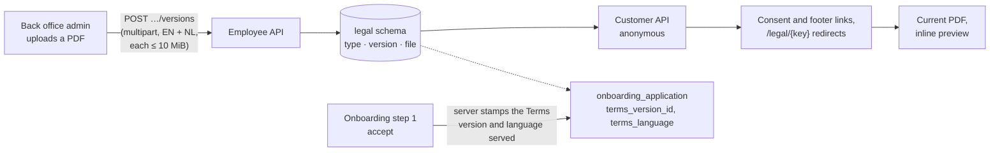

# F16 — Legal Documents

**Portal:** both · **Priority:** Must · **Phase:** 1 · **Size:** S

---

## 1. Summary

PeakPower asks a customer to agree to its **Terms of Use** when an account is created, and publishes a
**Privacy Statement**. Until 2026-10-05 neither existed as a managed document: the consent link went to a
placeholder route **[DEC-126]**, and the only real file was a static PDF baked into the customer portal's
build, so a change meant a web release and left no record of which text a customer had agreed to.

This feature makes both **versioned PDFs** that the back office manages and customers open as links. It is one
decision, **[DEC-174]**, taken from four user decisions. ⚠ **Amended 2026-10-09 by [DEC-177]:** every document is
published **in English and Dutch**: a version is one edition holding an English and a Dutch PDF, both required,
and customers get the PDF in the language they use (R38 to R40).

| Question | Decision |
| --- | --- |
| Which documents | A **fixed list** (Terms of Use, Privacy Statement) that admins can **extend with custom types**. |
| When the Terms change | **Record which Terms of Use version each sign-up accepted.** Existing customers are **not** asked to re-accept. |
| How publishing works | Each upload is a **new immutable version**, effective now or on a chosen date. History is kept, **admins only**, everything audited. |
| Where customers see them | **Links that open the current PDF**, and nothing more: no Legal page, no version history, no version numbers. Only the back office lists and manages the documents and their versions. ⚠ **Amended 2026-10-09 by [DEC-177]:** the link opens the PDF in the customer's language, with the other language (labelled) as the fallback. |

The files live **in Postgres**, in a new platform-reference `legal` schema, so backup, restore and
transactions are the mechanisms the platform already has.

## 2. Functional requirements

### Documents and versions

| ID | Requirement | MoSCoW |
| --- | --- | :--: |
| F16-R01 | The platform keeps **document types** in `legal.document_type`: a stable **key** (`^[a-z0-9]+(-[a-z0-9]+)*$`, at most 64 characters, **immutable**), a **title** (at most 120 characters), **visible to customers**, a **sort order** and a **built-in** flag. The migration seeds two built-in, visible types: `terms-of-use` (*Terms of Use*, sort 10) and `privacy-statement` (*Privacy Statement*, sort 20). | Must |
| F16-R02 | A **built-in** type cannot be hidden from customers and its key never changes; its **title** and sort order can be edited. A **custom** type's title, visibility and sort order can be edited; its key cannot. | Must |
| F16-R03 | ⚠ **Amended 2026-10-09 by [DEC-177] (2), (8): a version is one edition with an English and a Dutch file. The file's `language` (`en` or `nl`), `file_name`, `size_bytes`, `sha256` and bytes are on `legal.document_file`, one row per language, keyed `(version_id, language)`; the version row keeps the number, the dates, the uploader and the note.** Every upload creates a new **document version** (`legal.document_version`, metadata only): a `version_number` (1, 2, 3…, unique per type), `effective_from`, `uploaded_at`, the uploading employee (null for a system import) and an optional **change note** of at most 500 characters. Each language's sanitised `file_name` (at most 200 characters), `size_bytes`, `sha256` and bytes are in a separate `legal.document_file` row, so listing versions never loads a file. | Must |
| F16-R04 | ⚠ **Amended 2026-10-09 by [DEC-177] (7): the check applies to **each of the two files separately** (`fileEn`, `fileNl`); a failure is keyed to that file.** **Content check.** An upload must begin with the magic bytes `%PDF-`; the declared content type and the file extension are **not** evidence. The size is **at least 1 byte and at most 10 MiB** (10 485 760 bytes). A non-PDF, empty or missing file is `422`, keyed `fileEn` or `fileNl`; a file over the limit is `413`. Neither file is stored if either fails. | Must |
| F16-R05 | **Effective-from.** Omitted means **now**. A date (`yyyy-MM-dd`) means **00:00 Europe/Amsterdam** on that date; a date equal to today means now; a date in the past is `422`. All clock and calendar work goes through `IMarketCalendar` / `TimeProvider`. | Must |
| F16-R06 | The **current** version of a type is the version with the highest `version_number` whose `effective_from` is **at or before now**. A type with no such version has **no published document**. | Must |
| F16-R07 | A **scheduled** version has `effective_from` in the future. There is **at most one scheduled version per type**: uploading while one exists is `409`, *withdraw the scheduled version first*. | Must |
| F16-R08 | ⚠ **Amended 2026-10-09 by [DEC-177] (2): the edition is withdrawn as a whole, both files with it.** A scheduled version can be **withdrawn**: a **hard delete** of the version and its files, audited. A version that is **effective can never be changed or deleted**; withdrawing one is `409`. | Must |
| F16-R09 | **Version numbers** are max + 1 per type, allocated under a row lock on the type. A withdrawn scheduled version was the maximum, so its number is reused and a type's numbers have **no gaps**. | Must |
| F16-R10 | ⚠ **Amended 2026-10-09 by [DEC-177] (4): the generated name carries the language of the file served.** The file name is sanitised for display (`[A-Za-z0-9._ -]` kept, the rest collapsed, `.pdf` forced). **Downloads use a generated name**, `PeakPower-{Title words joined by -}-v{n}-en.pdf` or `-nl.pdf`. | Should |
| F16-R11 | An admin can **create a custom document type** with a title, an optional key (derived from the title when absent, accents folded) and *visible to customers* (default yes); it is sorted after the existing types (highest sort order + 10). A missing title or a malformed key is `422`; a key that already exists is `409`. | Must |

### Customer-facing

| ID | Requirement | MoSCoW |
| --- | --- | :--: |
| F16-R12 | ⚠ **Amended 2026-10-09 by [DEC-177] (4): the list item also carries `fileUrls`; `/current` takes `?lang`; the rule is R38.** The **customer API serves legal documents anonymously**, without a token, because people read them before they have an account, and it has **two reads only**: a **slim list** of the visible types in sort order (`key`, `title`, `fileUrl`, `fileUrls`; `fileUrl` is the current PDF's language-less URL, resolved by R38, when a version is published, else null; **`fileUrls`** is `{en, nl}`, each `/api/v1/legal-documents/{key}/current?lang=xx` when the current version has that language, else null; **no version number, no date, no size**) and the **current PDF**, which takes an optional `?lang=en` or `?lang=nl`. A token, if sent, changes nothing. The routes are labelled anonymous in the route table, with a reason that records they serve shared reference data. **There is no history route and no old-version route**: a customer cannot read an earlier version. | Must |
| F16-R13 | **A scheduled version is never exposed on the customer API**: not in the list, not as `/current`. A hidden, unknown or malformed key and an unpublished type's `/current` are all `404`. No customer response carries a version number or an effective date. | Must |
| F16-R14 | ⚠ **Amended 2026-10-09 by [DEC-177] (3), (4): the file served depends on `lang`, so the response says so.** A PDF response is `Content-Type: application/pdf`, `Content-Disposition: inline` with the generated filename, an **`ETag` built from the SHA-256 of the file served** (so it differs per language), `Cache-Control: no-cache` (it always revalidates), `Vary: Accept-Language` whenever `lang` is absent or not `en`/`nl` (the Dutch default included) and `X-Content-Type-Options: nosniff`. `If-None-Match` is honoured with `304`. No rate limit applies: neither host has a rate-limit policy. | Must |
| F16-R15 | ⚠ **Amended 2026-10-09 by [DEC-177] (4): the redirect carries the language.** The old static URL **`GET /peakpower-privacy-policy.pdf`** (and `HEAD`) on the customer host answers **`302`** to `/api/v1/legal-documents/privacy-statement/current?lang=<requested>`, where `<requested>` is the language asked for (`?lang=en` or `?lang=nl` honoured and otherwise R38), not the language served: this redirect reads no data, so the fallback to the other language happens at `/current`. It sends `Vary: Accept-Language` whenever `lang` is absent or not `en`/`nl`. While the web build still ships that file, the static file wins; once it is removed the redirect answers. | Must |
| F16-R15a | ⚠ **Amended 2026-10-09 by [DEC-177] (4): `?lang=` on the short links, resolved by R38; a query parameter, so the route table and the deeper-path `404` are unchanged.** **Short public links** on the customer host, anonymous server redirects that win over the portal's SPA fallback: **`GET /legal/{key}`** answers **`302`** to `/api/v1/legal-documents/{key}/current?lang=<resolved>` when the type is visible and has a published version (`/legal/{key}?lang=nl` asks for Dutch; without `lang` R38 applies, with `Vary: Accept-Language`; the same when `lang` is invalid), and otherwise a plain-text **`404`**, *This document is not available.* (hidden, unpublished, scheduled-only, unknown and malformed alike), never the portal shell. **`GET /legal/user-agreement`** is a legacy alias of the Terms of Use under the same rule. **`/legal`, `/legal/` and any deeper `/legal/...` path** answer the same plain-text `404`, never the portal shell. **`HEAD`** is answered like `GET` on the short links and the old PDF URL. A `lang` other than `en` or `nl` counts as absent. **`user-agreement` is a reserved key**: a custom type cannot take it, explicitly or derived from its title (`422` under `key`). They are not in OpenAPI. | Must |
| F16-R16 | The **customer portal has no legal page**: no `/legal` route, no document page, no *Earlier versions* list. The server answers every `/legal` and `/legal/*` path (F16-R15a), the bare `/legal` and unknown deeper paths with the plain-text `404`, so the portal's router is never reached for them in production, and the dev proxy forwards `/legal` to the API. | Must |
| F16-R17 | ⚠ **Amended 2026-10-09 by [DEC-177] (3): the name is plain text only when the document exists in neither language; when the portal serves the other language it says so (R19).** When the list says a document is **unpublished** (`fileUrl` null and both `fileUrls` null, or the type is not listed), or the list has **not loaded** yet or **failed**, the document's **name is plain text**, not a link, and the sentence stays grammatical (*By creating an account, I agree to the Terms of Use.*). The link appears when the list arrives. The portal never links to a page that does not exist. | Must |
| F16-R18 | The customer nav has **no** legal entry. The sign-in page's small footer line, *Terms of Use · Privacy Statement*, is two links to the current PDFs (plain text where unpublished or not yet loaded). | Should |
| F16-R19 | ⚠ **Amended 2026-10-09 by [DEC-177] (3), (4): the `href` follows the portal's language, and the other language is labelled.** **Consent links** (the onboarding account step's *By creating an account, I agree to the Terms of Use*, the signing page's Terms of Use and Privacy Statement links, and the sign-in footer of F16-R18; the account step has no privacy mention) are `<a>` elements whose `href` is the document's **`fileUrls` entry for the portal's language** (when the list has no `fileUrls`, as from a platform that predates DEC-177, the portal uses the language-less `fileUrl` as it is, without adding `lang`, and shows no fallback label; the platform then picks the file), and the link follows a language switch without a reload. When that language does not exist and the other one is served, the link text says so: *Terms of Use (Dutch)* in English, *Gebruiksvoorwaarden (Engels)* in Dutch. The links have `target="_blank"` and `rel="noopener noreferrer"`; the browser opens the PDF inline, which is the preview. **There are no other legal links anywhere in the customer portal.** | Must |
| F16-R20 | The customer portal's build **ships no PDF**. The documents come from the platform; the static `peakpower-privacy-policy.pdf` and its constant are removed, and a test asserts that no PDF remains in the portal's public folder. | Must |

### Consent recording

| ID | Requirement | MoSCoW |
| --- | --- | :--: |
| F16-R21 | ⚠ **Amended 2026-10-09 by [DEC-177] (5): the server also stamps the language served in the nullable `terms_language`.** `customer.onboarding_application` gains a nullable **`terms_version_id`**, a foreign key to `legal.document_version`. When the applicant accepts at step 1, the **server** stores the **Terms of Use version current at that instant**, or null when none is published (the sign-up still succeeds), and, in the nullable **`terms_language`** (`en` or `nl`, `CHECK`), the **language actually served** by R38's fallback. Both are null when no Terms are published; rows that exist before migration 38 keep `terms_language` null (R40). | Must |
| F16-R22 | ⚠ **Amended 2026-10-09 by [DEC-177] (5): the request gains an optional `language`.** **The client never sends a version.** The request carries `termsAccepted: true` as before **[DEC-171] (5)** and, new, an optional **`language`** (`en` or `nl`), the portal's UI language; the platform decides which version that means and which language it serves (R38). | Must |
| F16-R23 | **Existing customers are not asked to re-accept** when a new version of the Terms takes effect, and no notification is sent **[DEC-174]**. Re-acceptance and notification are out of scope. | Must |
| F16-R24 | ⚠ **Amended 2026-10-09 by [DEC-177] (5): show the language beside the version.** Where the back office shows `TermsAcceptedAt` in an employee view, the **version number** and the **language served** (when recorded) appear beside it. Where it does not, storing the version is enough. | Could |

### Back office

| ID | Requirement | MoSCoW |
| --- | --- | :--: |
| F16-R25 | The back office has a rail item **Legal documents**, visible to **all staff**, placed after *Reference data*. `/legal-documents` is the list and `/legal-documents/:key` the detail. Non-admins see both **read-only**. | Must |
| F16-R26 | ⚠ **Amended 2026-10-09 by [DEC-177] (6): a Languages column.** The **list** shows, per type: document, current version (v*N* and its effective date), **Scheduled** (a badge with the date, or —), a **Languages** column (EN and NL badges for the current version), number of versions, and *Visible to customers* (Yes / No). Each row links to its detail. Admins also get **Add document type** (title, an optional key prefilled from the title and editable until saved, *Visible to customers*). | Must |
| F16-R27 | ⚠ **Amended 2026-10-09 by [DEC-177] (6), and redesigned the same day (as built, see the as-built note in [DEC-177] (6)): the detail page is one column of cards.** From the top: **(a) a header card**: the title as a heading (the topbar's title, the same name, is the page's `h1`), a *Built-in* or *Custom* badge, **one** visibility badge (*Visible to customers* or *Hidden from customers*), one sentence saying what customers see (*Customers see version 2, in effect since …*, *No version is in effect yet, so customers see the name without a link*, or, first, *Hidden: customers can't see this document*), and a meta line with the key (with **Copy**), the sort order, the number of versions and the last upload (date and uploader, or *imported by the system* when nobody uploaded it); **admins** get **Settings** (goes to the Settings card) and **Upload new version** on the right, an **operator** gets the line *Read-only. Admins upload versions and change settings.* instead. **(b) An attention strip, only when customers cannot open the document**: *No version is in effect yet* (admins: *Upload the first version*, unless a version is scheduled, when the upload would be refused) and *This document is hidden from customers* (admins: *Change visibility*, which goes to Settings). A scheduled version is not an attention item. **(c) A summary strip**: what is in effect (version and date, or *None yet*), what is **next** (the scheduled version, its date and the days to go, or *Nothing scheduled*), the languages of the version in effect (EN, NL badges) and whether the public link opens a document. **(d) A card for the version in effect and, when one exists, one for the scheduled version**, the same component: the heading *Version N* with a badge (*In effect* or *Scheduled*), *In effect since …* or *Takes effect on …, 00:00 Amsterdam time*, who uploaded it and when (*Imported by the system, …* when nobody did, never a name that reads as a person), the change note (nothing is printed when there is none), and **one row per language**: the file name, its size, the first eight characters of its **SHA-256** with **Copy** (the whole hash) and **Download PDF** (*Not uploaded*, and no download, for a language a version lacks). The scheduled card has an info edge and, for admins, the footnote *Uploading another version waits until this one takes effect or is withdrawn* (an operator cannot upload, so it is left out) and a quiet **Withdraw version N**, which asks **in place** (*Withdraw version N, due …?*, both PDFs are deleted for good and customers keep seeing version M, or the name without a link) with **focus on Cancel**; a refusal shows inside this card. With no version in effect the first card is compact and does not repeat that nothing is in effect (the header, the strip and the attention strip say it): it tells admins *Upload the first version to give customers a link* and offers **Upload the first version**, points at the scheduled card when one exists, and tells an operator that an admin has to upload. **(e) The upload panel**, closed until **Upload new version** is pressed (R28). **(f) The version history**, one row per version, effective or scheduled, with its badge, *Effective* (one word, so the head stays on one line), who uploaded it, the change note and an English and a Dutch **download button that carries the size** (*EN 200 KB*, and its accessible name starts with those words); there is no size column; the card is left out when the type has no version. **(g) The public links card**: the automatic link (the type's `publicUrl`, R38) and the explicit `?lang=en` and `?lang=nl` links as text, each with **Copy** (clipboard, then the announcement *Link copied*) and **Open** (a new tab); when the type is hidden from customers or nothing is in effect yet, **one banner above the rows** says why they do not open a document yet (hidden first) **[F16-R37]**. **(h) For admins, the Settings card, last**: title, sort order and *Visible to customers* (disabled for a built-in type, **with the reason shown in words**), with **Cancel** and **Save changes** in the card foot, both disabled while nothing changed. **Feedback:** a successful write (upload, withdraw, save) leaves **one green notice at the top that takes focus**; a failure shows **in the block that failed** (the withdraw in the scheduled card, an upload in the panel, a download in the card whose button was pressed, the settings in their card). While it loads the page shows a skeleton that mirrors it; a failed load offers *Try again* and a way back; an unknown key says *Document not found* with a way back to the list. | Must |
| F16-R28 | ⚠ **Amended 2026-10-09 by [DEC-177] (6), (7): two file slots and 22 MiB; redesigned the same day as an on-demand panel.** **Upload new version** (admins) opens a **panel on the detail page, closed until the action is pressed**, headed *Upload version N* (N is one more than the highest number, R09), after the edition cards and before the history; focus moves to its heading. It has **two PDF slots**, *English PDF* (`#legal-file-en`) and *Dutch PDF* (`#legal-file-nl`), both required: each is a drop area over a hidden native file input, takes a picked or dropped file and **checks it at once** (the type, empty, 10 MiB; the sentence appears on that slot), shows the name, the size and *Ready* or the problem, and offers *Replace* and *Remove*. **When does it apply?** is **Now** (today, Amsterdam) or **On a date** (the shared date picker, from tomorrow, *from 00:00 Amsterdam time*); the one `effectiveFrom` the platform reads is unchanged. A change note of at most 500 characters, with the hint that it is for staff and a counter. A **live sentence** says what pressing the button does (*Version 4 replaces version 2 for customers as soon as you publish. It can't be withdrawn.*, or *Version 4 takes over from version 2 on …. You can withdraw it until then.*), and **the button names the action**: *Publish version N now* or *Schedule version N* (busy: *Uploading…*). **Cancel** closes the panel and asks first when a file was chosen or a note typed. The server's `409` / `413` / `422` messages show in the panel (a `422` under the slot or field it is keyed to; a `413` says *A file is larger than the 10 MiB limit*, never the HTTP title, unless the platform's `detail` names the file); the proxy's own HTML `413` gets the same sentence. On success **the panel closes, the page reloads and one green notice at the top says what happened** (*Version 4 is scheduled for …* or *Version 4 is now in effect*) and takes focus. **While a scheduled version exists the header's Upload action is disabled and says why (withdraw it first, or wait until it takes effect), and the panel cannot be opened.** **Leaving the page** by any way (the back link, the rail, the browser's back button; closing the tab gets the browser's own prompt) **asks first while the panel holds a chosen file or a note, or the Settings card has an unsaved edit.** **Focus:** Cancel returns it to the header's Upload action (to Settings when that is disabled); after a `409` it moves to the failure sentence. | Must |
| F16-R29 | ⚠ **Amended 2026-10-09 by [DEC-177] (6): a download asks for one language.** **Downloads go through the signed-in session**, not a plain link: the file of the language chosen (`?lang=en` or `?lang=nl`) is fetched as a blob with the session's credentials and saved under the server's filename, through a temporary object URL that is revoked afterwards. The buttons are the **Download PDF** of each language row on the edition cards and the **EN / NL** buttons of the history; each is named for its version and language, and a failed download shows in the card whose button was pressed. | Must |
| F16-R30 | The back office stays a **fixed 1280 desktop layout [DEC-173]**; this feature adds no responsive rules to it. | Must |

### API, security and audit

| ID | Requirement | MoSCoW |
| --- | --- | :--: |
| F16-R31 | The **employee API** (`/api/v1/legal-documents`): reads need any signed-in employee; **every write needs the `BackOfficeAdmin` policy** (upload, withdraw, create type, edit type). Every type carries a **`publicUrl`**, `{CustomerPortal:BaseUrl}/legal/{key}`, always present (the employee host's existing `CustomerPortal__BaseUrl` setting). Routes are in the API contracts, §3.4. | Must |
| F16-R32 | ⚠ **Amended 2026-10-09 by [DEC-177] (6), (7): two files, 22 MiB.** The upload route accepts `multipart/form-data` (`fileEn`, `fileNl`, `effectiveFrom`, `changeNote`) and carries request-size metadata of **22 MiB**, so two 10 MiB files plus form overhead are accepted by the host; the 10 MiB limit itself is the domain's **[F16-R04]**. It is protected exactly as the other employee `POST`s are (bearer token, so antiforgery does not apply). | Must |
| F16-R33 | ⚠ **Amended 2026-10-09 by [DEC-177] (6): 22 MB.** The **proxy** raises `client_max_body_size` to **22 MB (`22m`) for `location ^~ /api/v1/legal-documents` (no trailing slash) on the admin (employee) host only**; the global limit stays 2 MB and the customer host stays at 2 MB. | Must |
| F16-R34 | ⚠ **Amended 2026-10-09 by [DEC-177] (7): the upload and withdrawal payloads carry `files`.** **Audit.** Upload, withdrawal, type creation and type update each write an `AuditRecord` (`LEGAL_DOCUMENT_UPLOADED`, `LEGAL_DOCUMENT_VERSION_WITHDRAWN`, `LEGAL_DOCUMENT_TYPE_CREATED`, `LEGAL_DOCUMENT_TYPE_UPDATED`) naming the **employee** and the **type key**; a version's record also names the **version number**, the **effective-from** time and `files` (language, file name, size and SHA-256 of each file), a type's its title, visibility and sort order **[F15](F15-audit-and-observability.md)**. | Must |
| F16-R35 | ⚠ **Amended 2026-10-09 by [DEC-177] (8): v1 is seeded in both languages.** **Privacy Statement v1** is imported by an idempotent Migrator seeder, outside the demo-seeding gate, **only when `privacy-statement` has no version**: v1 from an embedded copy of the portal's last static PDF, which is English, **in both languages** (the same bytes, name, size and SHA-256 in the `en` and the `nl` file), effective from 00:00 Amsterdam on the date that file was first committed in the web repository, uploaded by nobody, with the change note *Imported from the customer portal build*. One log line. The **Terms of Use have no version until an admin uploads one.** | Must |
| F16-R36 | ⚠ **Amended 2026-10-09 by [DEC-177] (2), (5): grants cover the file rows by language and the new consent column.** Grants: `app_customer_role` has `SELECT` on the three `legal` tables; `app_employee_role` has `SELECT`, `INSERT` and a column-scoped `UPDATE (title, visible_to_customers, sort_order)` on `document_type` (so the key and the built-in flag cannot change, by grant) and `SELECT`, `INSERT`, `DELETE` on `document_version` and `document_file` (a file row is added and removed only with its version). The write grant that covers `onboarding_application.terms_version_id` covers `terms_language`. The tables carry no `customer_id` and **no row-level security**. | Must |
| F16-R37 | The back office is the **only** place that lists, manages and shows version history; customers see none of it. The **public link** a staff member can copy (the first row of the public links card, R27) is the type's `publicUrl` (F16-R15a), which resolves to a document only while `visibleToCustomers` is true and the type has a current version. | Must |
| F16-R38 | ⚠ **New 2026-10-09 by [DEC-177] (3).** **The language rule.** The language asked for is, in order: the **`lang`** parameter (`en` or `nl`; any other value counts as absent); the first `nl` or `en` in the **`Accept-Language`** header, ranked by quality (highest quality first, ties in the order written, `q=0` never counts, a region ignored (`nl-BE` is Dutch)); then **`nl`** (Dutch). **Fallback:** the language asked for if the version has it, else the other language, else nothing (`404`, or the name as plain text). A document that exists in some language is never a `404`. The same rule serves `/current`, the short links, the old PDF URL, the employee download without a valid `lang` (an explicit `lang` on the download is exact: the version's file in that language, else `404`, with no fallback) and the consent stamp (R21), and the portal. A response whose language a valid `lang` did not name (no `lang`, or an invalid one, the Dutch default included) sends `Vary: Accept-Language`. When the other language is served the portal says so (R19). | Must |
| F16-R39 | ⚠ **New 2026-10-09 by [DEC-177] (2).** **Both languages are required.** Every new version, of every type, is uploaded in **one request with `fileEn` and `fileNl`**, each checked separately (R04): a missing, non-PDF or empty file is `422` keyed `fileEn` or `fileNl`, a file over 10 MiB is `413`, and nothing is stored unless both pass. A language cannot be added to an existing version, which is immutable once effective (R08); the next version carries both. The rule is enforced by the domain and the upload handler, not by the database. | Must |
| F16-R40 | ⚠ **New 2026-10-09 by [DEC-177] (5), (8).** **Existing versions are duplicated into both languages for now.** Migration 38 turns each existing version's single file into an `en` row and inserts an `nl` row with **identical** bytes, name, size and SHA-256, so every version holds both languages from then on. Their consents keep `terms_language` **null** (the single-file era). In production the latest Privacy Statement is English and the Terms of Use is Dutch, so each has a wrong-language copy until admins upload real bilingual versions. The fallback of R38 is built and tested but, after this migration, defensive. | Must |

## 3. Business rules

1. **An effective version is forever.** Once a version is in effect it is never changed or deleted. A mistake
   is corrected by uploading the next version, never by editing the last one. That is what makes a recorded
   `TermsVersionId` mean something.
2. **At most one scheduled version per type**, because two would need an ordering rule between two futures,
   and the only rule worth having is *withdraw it first*.
3. **The server is the authority on time and version.** The effective-from is evaluated by the platform's
   clock in Amsterdam time; the consent version is chosen by the server at the instant of acceptance; neither
   is accepted from a client.
4. **Anonymous reading is the point, and it is bounded.** The customer API exposes the **current** PDF of
   **visible** types and a slim list of links, nothing else: no write route, no history, no old version, no
   version number, no scheduled content. ⚠ **Amended 2026-10-09 by [DEC-177] (3), (4):** language adds a `lang`
   choice between the two files of the current version, nothing more.
5. **No re-acceptance.** A customer who accepted v1 is recorded as having accepted v1. The platform does not
   ask again and does not notify. This is a legal position, recorded in **[DEC-174]**, not an oversight.
6. ⚠ **Amended 2026-10-09 by [DEC-177] (2) — reversed: documents are per platform, not per customer, and in
   English and Dutch.** A version is one edition holding an English and a Dutch PDF, both required (R39), so
   *Terms version 3* names one edition in both languages. A document for one customer company is still a new
   decision. *(Until 2026-10-09 this rule read: "Documents are per platform, not per customer, and in one
   language. One PDF per version. A Dutch and an English pair ... is a new decision.")*
7. **The file is the document.** The platform stores and serves bytes it has verified are a PDF. It does not
   render, scan for content, convert or index them.

## 4. Screens

| Screen | Portal | Notes |
| --- | --- | --- |
| Legal documents — list | Back office | **[F16-R25]**, **[F16-R26]**. *No mockup yet* |
| Legal documents — detail, upload panel and history | Back office | **[F16-R27]**, **[F16-R28]**, **[F16-R29]**. *No mockup; the layout is specified in R27 and R28 (one column of cards, redesigned 2026-10-09), and the web build is the reference* |
| Add document type | Back office | **[F16-R26]**, admin only |
| Public links card | Back office | On the detail page, **[F16-R27]**, **[F16-R37]** |

**The customer portal has no legal screen.** Its legal links sit inside existing screens (the onboarding account step, the signing page, the sign-in page) **[F16-R19]**.

## 5. Edge cases

| Case | Behaviour |
| --- | --- |
| No Terms of Use published at sign-up | `terms_version_id` is null; the sign-up succeeds **[F16-R21]**. It is never filled in later. |
| Terms v2 scheduled for next month | The current version stays v1 until then; sign-ups until then record v1; customers cannot see v2 **[F16-R13]**. |
| Terms v2 takes effect | The same link now opens v2; nothing in the customer portal shows v1 again (staff still can) **[F16-R12]**. |
| An admin schedules a version, then wants a different date | Withdraw it, then upload again; the number is reused **[F16-R08]**, **[F16-R09]**. |
| An admin uploads a PDF dated today | It is effective immediately and cannot be withdrawn **[F16-R05]**, **[F16-R08]**. |
| A scheduled version becomes effective | Nothing runs. The current-version rule is evaluated at read time, so it is current at the moment its time passes **[F16-R06]**. |
| Upload with a `.pdf` name but other content | `422`; the magic bytes decide **[F16-R04]**. |
| A custom type is hidden | It disappears from the customer list, `/current` and `/legal/{key}` answer `404`; the back office still shows it, with the *Hidden from customers* badge, the attention strip and its public links with the banner that they open nothing **[F16-R13]**, **[F16-R27]**, **[F16-R37]**. |
| A link for a document with no published version | The portal shows the name as plain text; `/legal/{key}` answers the short text `404` **[F16-R15a]**, **[F16-R17]**. |
| The portal build still ships the static PDF | The static file wins over the redirect **[F16-R15]**; the web release that removes it hands over to the platform. |
| A bookmarked `/peakpower-privacy-policy.pdf` | `302` to the current Privacy Statement, in the language of R38 **[F16-R15]**. |
| Dutch missing on a legacy version (defensive: migration 38 leaves none) | `/current?lang=nl` serves the English file, `fileUrls.nl` is null, and the portal labels the link *(English)* / *(Engels)* **[F16-R38]**, **[F16-R19]**. |
| The request has no `Accept-Language` header, or none of `nl` and `en` | Dutch **[F16-R38]**. |
| An unknown `lang` (`?lang=fr`) | It counts as absent; the header, then Dutch, decide **[F16-R38]**. |
| A customer switches the portal language after opening the Terms | The link already opened is a snapshot. The links on the page follow the new language at once, and the consent records the language the client sends at *Create account* and the server serves **[F16-R19]**, **[F16-R21]**. |
| An upload with one file missing | The panel asks for the missing slot before anything is sent; if one is sent, `422` keyed to the missing slot and no part is stored **[F16-R39]**, **[F16-R28]**. |
| An admin presses *Upload new version* while a version is scheduled | The action is disabled and says to withdraw that version first or wait until it takes effect; if a scheduled version appears after the panel was opened, the upload is refused (`409`), the page reloads and the panel says why **[F16-R28]**, **[F16-R08]**. |
| A withdraw is refused because the version took effect meanwhile | The refusal shows in the scheduled card; if the reload shows that the card is gone, it shows above the page instead **[F16-R27]**, **[F16-R08]**. |
| A version imported by migration 38 | Its `en` and `nl` files are identical; the consents against it have `terms_language` null **[F16-R40]**. |
| Withdrawing a scheduled version | Both files go with the edition **[F16-R08]**. |

## 6. Out of scope

- **Re-acceptance** when the Terms change, and **notifying** customers of a change **[DEC-174]**.
- **Per-customer** documents. ⚠ **Amended 2026-10-09 by [DEC-177]:** languages are **in scope** (R38 to R40); a bilingual title or change note, and adding a language to an existing version, are not.
- A **customer-facing page, version history or version number**; customers get links to the current PDF only.
- Rendering, virus scanning or text extraction of the uploaded PDF. The first release validates the magic
  bytes and the size only.
- Signing the PDFs, or a customer-visible record of which version they accepted (the version is stored for
  the platform's own evidence).
- The marketing site's legal pages **[F14-R01]**, which may link to the same public URLs.

## 7. Dependencies

[F12](F12-employee-back-office.md) (the screen and the admin policy), [F13](F13-identity-and-access.md) and
[F01](F01-customer-and-metering-points.md) (the onboarding consent that records the version),
[F15](F15-audit-and-observability.md) (the audit records), and [DEC-173] (the responsive customer portal).
Architecture: [database design §3.7](../20-architecture/04-database-design.md),
[API contracts §2.12 and §3.4](../20-architecture/05-api-contracts.md),
[security §6.1](../20-architecture/07-security.md), [deployment §4.6](../20-architecture/09-deployment.md).

## 8. Open questions

None opened by this feature. Two points are recorded as accepted costs of **[DEC-174]** rather than as
questions: that customers are not asked to re-accept, and that the Privacy Statement's first effective date
is the first-commit date of the file the portal carried.
