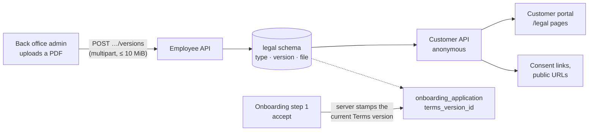

# F16 — Legal Documents

**Portal:** both · **Priority:** Must · **Phase:** 1 · **Size:** S

---

## 1. Summary

PeakPower asks a customer to agree to its **Terms of Use** when an account is created, and publishes a
**Privacy Statement**. Until 2026-10-05 neither existed as a managed document: the consent link went to a
placeholder route **[DEC-126]**, and the only real file was a static PDF baked into the customer portal's
build, so a change meant a web release and left no record of which text a customer had agreed to.

This feature makes both **versioned PDFs** that the back office manages and anyone can read. It is one
decision, **[DEC-174]**, taken from four user decisions:

| Question | Decision |
| --- | --- |
| Which documents | A **fixed list** (Terms of Use, Privacy Statement) that admins can **extend with custom types**. |
| When the Terms change | **Record which Terms of Use version each sign-up accepted.** Existing customers are **not** asked to re-accept. |
| How publishing works | Each upload is a **new immutable version**, effective now or on a chosen date. History is kept, **admins only**, everything audited. |
| Where customers see them | **Public anonymous links** and a **Legal** page in the customer portal. |

The files live **in Postgres**, in a new platform-reference `legal` schema, so backup, restore and
transactions are the mechanisms the platform already has.

## 2. Functional requirements

### Documents and versions

| ID | Requirement | MoSCoW |
| --- | --- | :--: |
| F16-R01 | The platform keeps **document types** in `legal.document_type`: a stable **key** (`^[a-z0-9]+(-[a-z0-9]+)*$`, at most 64 characters, **immutable**), a **title** (at most 120 characters), **visible to customers**, a **sort order** and a **built-in** flag. The migration seeds two built-in, visible types: `terms-of-use` (*Terms of Use*, sort 10) and `privacy-statement` (*Privacy Statement*, sort 20). | Must |
| F16-R02 | A **built-in** type cannot be hidden from customers and its key never changes; its **title** and sort order can be edited. A **custom** type's title, visibility and sort order can be edited; its key cannot. | Must |
| F16-R03 | Every upload creates a new **document version** (`legal.document_version`, metadata only): a `version_number` (1, 2, 3…, unique per type), the sanitised `file_name` (at most 200 characters), `size_bytes`, `sha256`, `effective_from`, `uploaded_at`, the uploading employee (null for a system import) and an optional **change note** of at most 500 characters. The file bytes are in a separate `legal.document_file` row, so listing versions never loads a file. | Must |
| F16-R04 | **Content check.** An upload must begin with the magic bytes `%PDF-`; the declared content type and the file extension are **not** evidence. The size is **at least 1 byte and at most 10 MiB** (10 485 760 bytes). A non-PDF or empty file is `422`; a file over the limit is `413`. | Must |
| F16-R05 | **Effective-from.** Omitted means **now**. A date (`yyyy-MM-dd`) means **00:00 Europe/Amsterdam** on that date; a date equal to today means now; a date in the past is `422`. All clock and calendar work goes through `IMarketCalendar` / `TimeProvider`. | Must |
| F16-R06 | The **current** version of a type is the version with the highest `version_number` whose `effective_from` is **at or before now**. A type with no such version has **no published document**. | Must |
| F16-R07 | A **scheduled** version has `effective_from` in the future. There is **at most one scheduled version per type**: uploading while one exists is `409`, *withdraw the scheduled version first*. | Must |
| F16-R08 | A scheduled version can be **withdrawn**: a **hard delete** of the version and its file, audited. A version that is **effective can never be changed or deleted**; withdrawing one is `409`. | Must |
| F16-R09 | **Version numbers** are max + 1 per type, allocated under a row lock on the type. A withdrawn scheduled version was the maximum, so its number is reused and a type's numbers have **no gaps**. | Must |
| F16-R10 | The file name is sanitised for display (`[A-Za-z0-9._ -]` kept, the rest collapsed, `.pdf` forced). **Downloads use a generated name**, `PeakPower-{Title words joined by -}-v{n}.pdf`. | Should |
| F16-R11 | An admin can **create a custom document type** with a title, an optional key (derived from the title when absent, accents folded) and *visible to customers* (default yes); it is sorted after the existing types (highest sort order + 10). A missing title or a malformed key is `422`; a key that already exists is `409`. | Must |

### Customer-facing

| ID | Requirement | MoSCoW |
| --- | --- | :--: |
| F16-R12 | The **customer API serves legal documents anonymously**, without a token, because people read them before they have an account: the visible types in sort order (key, title, current version or null, `fileUrl`), one type with its **effective versions only**, the **current PDF**, and an **effective version's PDF**. A token, if sent, changes nothing. The routes are labelled anonymous in the route table, with a reason that records they serve shared reference data. | Must |
| F16-R13 | **A scheduled version is never exposed on the customer API**: not in a list, not in a type's version list, not by its number. A hidden, unknown or malformed key, an unpublished type's `/current`, and a scheduled, unknown or non-numeric version number are all `404`. | Must |
| F16-R14 | A PDF response is `Content-Type: application/pdf`, `Content-Disposition: inline` with the generated filename, an **`ETag` built from the SHA-256**, `Cache-Control: no-cache` (it always revalidates) and `X-Content-Type-Options: nosniff`. `If-None-Match` is honoured with `304`. No rate limit applies: neither host has a rate-limit policy. | Must |
| F16-R15 | The old static URL **`GET /peakpower-privacy-policy.pdf`** on the customer host answers **`302`** to `/api/v1/legal-documents/privacy-statement/current`. While the web build still ships that file, the static file wins; once it is removed the redirect answers. | Must |
| F16-R16 | The **customer portal** has an unguarded **Legal** area, working signed out (bare) and signed in (in the shell): `/legal` lists the visible documents (title, current version and effective date, *Open PDF*, *Details*); `/legal/terms-of-use`, `/legal/privacy-statement` and `/legal/:key` (custom types) show the title, *Version N · in effect since <date>*, an *Open PDF* link and an *Earlier versions* list of effective versions. `/legal/user-agreement` remains as an alias of the Terms of Use. | Must |
| F16-R17 | A document with **no published version** shows the *Not published yet* state; an **unknown or hidden key** shows *Document not found* with a link back to `/legal`. | Must |
| F16-R18 | The customer nav's **Account** group gains **Legal documents** (signed in), and the sign-in page carries a small line, *Terms of Use · Privacy Statement*, linking to the two pages. | Should |
| F16-R19 | **Consent links** (the onboarding account step's *By creating an account, I agree to the Terms of Use*, and the signing page's Terms of Use and Privacy Statement links; the account step has no privacy mention) go **straight to the current PDF** when that document is published, and to its `/legal/...` page otherwise. They open in a new tab (`rel="noopener noreferrer"`). The link exists before the list has loaded and falls back to the page URL until it does. | Must |
| F16-R20 | The customer portal's build **ships no PDF**. The documents come from the platform; the static `peakpower-privacy-policy.pdf` and its constant are removed, and a test asserts that no PDF remains in the portal's public folder. | Must |

### Consent recording

| ID | Requirement | MoSCoW |
| --- | --- | :--: |
| F16-R21 | `customer.onboarding_application` gains a nullable **`terms_version_id`**, a foreign key to `legal.document_version`. When the applicant accepts at step 1, the **server** stores the **Terms of Use version current at that instant**, or null when none is published (the sign-up still succeeds). | Must |
| F16-R22 | **The client never sends a version.** The request carries `termsAccepted: true` as before **[DEC-171] (5)**; the platform decides which version that means. | Must |
| F16-R23 | **Existing customers are not asked to re-accept** when a new version of the Terms takes effect, and no notification is sent **[DEC-174]**. Re-acceptance and notification are out of scope. | Must |
| F16-R24 | Where the back office shows `TermsAcceptedAt` in an employee view, the **version number** appears beside it. Where it does not, storing the version is enough. | Could |

### Back office

| ID | Requirement | MoSCoW |
| --- | --- | :--: |
| F16-R25 | The back office has a rail item **Legal documents**, visible to **all staff**, placed after *Reference data*. `/legal-documents` is the list and `/legal-documents/:key` the detail. Non-admins see both **read-only**. | Must |
| F16-R26 | The **list** shows, per type: document, current version (v*N* and its effective date), **Scheduled** (a badge with the date, or —), number of versions, and *Visible to customers* (Yes / No). Each row links to its detail. Admins also get **Add document type** (title, an optional key prefilled from the title and editable until saved, *Visible to customers*). | Must |
| F16-R27 | The **detail page** shows the title, the key and a *Built-in* or *Custom* badge; for admins, edit title, *Visible to customers* (disabled for a built-in type, **with the reason shown in words**) and sort order; a **current version card** (v*N*, effective since, size, uploaded by and when, the change note, **Download**); a **scheduled version card** when one exists (the effective date, **Download**, and for admins **Withdraw** behind a confirmation); and a **version history** of every version, effective or scheduled, with **Download**. | Must |
| F16-R28 | **Upload new version** (admins): a PDF input with client-side checks of the type and the 10 MiB size, an **Effective from** date defaulting to today with a minimum of today, a change note of at most 500 characters, a busy state, and the server's `409` / `413` / `422` messages shown inline (the proxy's own HTML `413` gets the same sentence). On success the page reloads, the form resets and the result is announced. **While a scheduled version exists the upload is disabled, with the reason: the scheduled version must be withdrawn first.** | Must |
| F16-R29 | **Downloads go through the signed-in session**, not a plain link: the file is fetched as a blob with the session's credentials and saved under the server's filename, through a temporary object URL that is revoked afterwards. | Must |
| F16-R30 | The back office stays a **fixed 1280 desktop layout [DEC-173]**; this feature adds no responsive rules to it. | Must |

### API, security and audit

| ID | Requirement | MoSCoW |
| --- | --- | :--: |
| F16-R31 | The **employee API** (`/api/v1/legal-documents`): reads need any signed-in employee; **every write needs the `BackOfficeAdmin` policy** (upload, withdraw, create type, edit type). Routes are in the API contracts, §3.4. | Must |
| F16-R32 | The upload route accepts `multipart/form-data` (`file`, `effectiveFrom`, `changeNote`) and carries request-size metadata of **12 MiB**, so a 10 MiB file plus form overhead is accepted by the host; the 10 MiB limit itself is the domain's **[F16-R04]**. It is protected exactly as the other employee `POST`s are (bearer token, so antiforgery does not apply). | Must |
| F16-R33 | The **proxy** raises `client_max_body_size` to **12 MB for `/api/v1/legal-documents/` on the admin (employee) host only**; the global limit stays 2 MB and the customer host stays at 2 MB. | Must |
| F16-R34 | **Audit.** Upload, withdrawal, type creation and type update each write an `AuditRecord` (`LEGAL_DOCUMENT_UPLOADED`, `LEGAL_DOCUMENT_VERSION_WITHDRAWN`, `LEGAL_DOCUMENT_TYPE_CREATED`, `LEGAL_DOCUMENT_TYPE_UPDATED`) naming the **employee** and the **type key**; a version's record also names the **version number** and the **effective-from** time, a type's its title, visibility and sort order **[F15](F15-audit-and-observability.md)**. | Must |
| F16-R35 | **Privacy Statement v1** is imported by an idempotent Migrator seeder, outside the demo-seeding gate, **only when `privacy-statement` has no version**: v1 from an embedded copy of the portal's last static PDF, effective from 00:00 Amsterdam on the date that file was first committed in the web repository, uploaded by nobody, with the change note *Imported from the customer portal build*. One log line. The **Terms of Use have no version until an admin uploads one.** | Must |
| F16-R36 | Grants: `app_customer_role` has `SELECT` on the three `legal` tables; `app_employee_role` has `SELECT`, `INSERT` and a column-scoped `UPDATE (title, visible_to_customers, sort_order)` on `document_type` (so the key and the built-in flag cannot change, by grant) and `SELECT`, `INSERT`, `DELETE` on `document_version` and `document_file`. The tables carry no `customer_id` and **no row-level security**. | Must |

## 3. Business rules

1. **An effective version is forever.** Once a version is in effect it is never changed or deleted. A mistake
   is corrected by uploading the next version, never by editing the last one. That is what makes a recorded
   `TermsVersionId` mean something.
2. **At most one scheduled version per type**, because two would need an ordering rule between two futures,
   and the only rule worth having is *withdraw it first*.
3. **The server is the authority on time and version.** The effective-from is evaluated by the platform's
   clock in Amsterdam time; the consent version is chosen by the server at the instant of acceptance; neither
   is accepted from a client.
4. **Anonymous reading is the point, and it is bounded.** The customer API exposes **effective** versions of
   **visible** types and nothing else; it has no write route and no listing of scheduled content.
5. **No re-acceptance.** A customer who accepted v1 is recorded as having accepted v1. The platform does not
   ask again and does not notify. This is a legal position, recorded in **[DEC-174]**, not an oversight.
6. **Documents are per platform, not per customer, and in one language.** One PDF per version. A Dutch and an
   English pair, or a document for one customer company, is a new decision.
7. **The file is the document.** The platform stores and serves bytes it has verified are a PDF. It does not
   render, scan for content, convert or index them.

## 4. Screens

| Screen | Portal | Notes |
| --- | --- | --- |
| Legal documents — list | Back office | **[F16-R25]**, **[F16-R26]**. *No mockup yet* |
| Legal documents — detail, upload and history | Back office | **[F16-R27]**, **[F16-R28]**, **[F16-R29]**. *No mockup yet* |
| Add document type | Back office | **[F16-R26]**, admin only |
| Legal | Customer portal | `/legal` — **[F16-R16]** |
| A document | Customer portal | `/legal/terms-of-use`, `/legal/privacy-statement`, `/legal/:key` — **[F16-R16]**, **[F16-R17]** |

The customer pages follow the responsive conventions of **[DEC-173]**: no horizontal scroll at 375 px,
full-width cards, 44 px targets.

## 5. Edge cases

| Case | Behaviour |
| --- | --- |
| No Terms of Use published at sign-up | `terms_version_id` is null; the sign-up succeeds **[F16-R21]**. It is never filled in later. |
| Terms v2 scheduled for next month | The current version stays v1 until then; sign-ups until then record v1; customers cannot see v2 **[F16-R13]**. |
| An admin schedules a version, then wants a different date | Withdraw it, then upload again; the number is reused **[F16-R08]**, **[F16-R09]**. |
| An admin uploads a PDF dated today | It is effective immediately and cannot be withdrawn **[F16-R05]**, **[F16-R08]**. |
| A scheduled version becomes effective | Nothing runs. The current-version rule is evaluated at read time, so it is current at the moment its time passes **[F16-R06]**. |
| Upload with a `.pdf` name but other content | `422`; the magic bytes decide **[F16-R04]**. |
| A custom type is hidden | It disappears from the customer list and its customer routes answer `404`; the back office still shows it **[F16-R13]**. |
| The portal build still ships the static PDF | The static file wins over the redirect **[F16-R15]**; the web release that removes it hands over to the platform. |
| A bookmarked `/peakpower-privacy-policy.pdf` | `302` to the current Privacy Statement **[F16-R15]**. |

## 6. Out of scope

- **Re-acceptance** when the Terms change, and **notifying** customers of a change **[DEC-174]**.
- **Per-customer** documents and **languages**.
- Rendering, virus scanning or text extraction of the uploaded PDF. The first release validates the magic
  bytes and the size only.
- Signing the PDFs, or a customer-visible record of which version they accepted (the version is stored for
  the platform's own evidence).
- The marketing site's legal pages **[F14-R01]**, which may link to the same public URLs.

## 7. Dependencies

[F12](F12-employee-back-office.md) (the screen and the admin policy), [F13](F13-identity-and-access.md) and
[F01](F01-customer-and-metering-points.md) (the onboarding consent that records the version),
[F15](F15-audit-and-observability.md) (the audit records), and [DEC-173] (the responsive customer portal).
Architecture: [database design §3.7](../20-architecture/04-database-design.md),
[API contracts §2.12 and §3.4](../20-architecture/05-api-contracts.md),
[security §6.1](../20-architecture/07-security.md), [deployment §4.6](../20-architecture/09-deployment.md).

## 8. Open questions

None opened by this feature. Two points are recorded as accepted costs of **[DEC-174]** rather than as
questions: that customers are not asked to re-accept, and that the Privacy Statement's first effective date
is the first-commit date of the file the portal carried.
