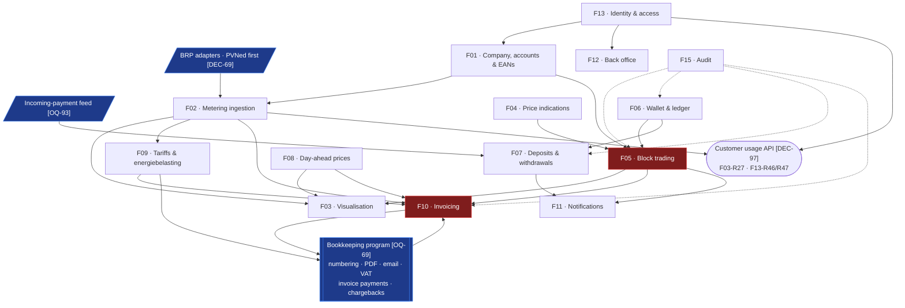

# Feature Index

Fifteen features, each specified in its own document with user stories, numbered functional
requirements, business rules and edge cases.

**Requirement IDs** are stable: `F05-R12` is requirement 12 of feature F05, and can be referenced from
a backlog item, a test, or a change request. A requirement that stops being true is **struck, not
deleted, and never renumbered** — 50 of them were struck on 2026-08-19 and every one of them still
resolves.

> ⚠ **Two filenames deliberately lie, and that is cheaper than the alternative.**
> `F09-surcharges.md` now contains **F09 — Tariffs & Energiebelasting**: **[DEC-73]** takes the
> surcharge out of the platform and **[DEC-74]** puts energiebelasting back in, but the file keeps its
> name so the fourteen inbound links to it still resolve. `F07-wallet-topup-and-payments.md` covers
> deposits **and withdrawals** **[DEC-83]**. Judge a feature by the H1 in its file, not by its path.

---

## The list

| # | Feature | Portal | MoSCoW | Phase | Size |
| --- | --- | --- | :--: | :--: | :--: |
| [F01](F01-customer-and-metering-points.md) | Customer, Accounts & Metering Points | Both | **Must** | 1 | M |
| [F02](F02-metering-data-ingestion.md) | Metering Data Ingestion | Platform | **Must** | 1 | L |
| [F03](F03-consumption-visualisation.md) | Consumption & Production Visualisation | Customer | **Must** | 1–2 | L |
| [F04](F04-price-indications.md) | Price Indications (Montel) | Customer | **Must** | 2 | M |
| [F05](F05-energy-block-trading.md) | Energy Block Trading | Both | **Must** | 2 | XL |
| [F06](F06-wallet-and-ledger.md) | Wallet & Ledger | Both | **Must** | 2 | L |
| [F07](F07-wallet-topup-and-payments.md) | Wallet Top-up & Payments | Customer | **Must** | 2 | L |
| [F08](F08-day-ahead-prices.md) | Day-Ahead Prices | Platform | **Must** | 3 | S |
| [F09](F09-surcharges.md) | Tariffs & Energiebelasting | Employee | **Must** | 3 | L |
| [F10](F10-invoicing-and-settlement.md) | Invoicing & Settlement | Both | **Must** | 3 | L |
| [F11](F11-notifications.md) | Notifications | Both | **Should** | 2–3 | M |
| [F12](F12-employee-back-office.md) | Employee Back Office | Employee | **Must** | 1–3 | L |
| [F13](F13-identity-and-access.md) | Identity & Access | Both | **Must** | 1 | M |
| [F14](F14-public-website.md) | Public Website | Public | **Could** | 4 | S |
| [F15](F15-audit-and-observability.md) | Audit Trail & Observability | Both | **Must** | 1–3 | M |

Sizes are relative, for sequencing only: **S** ≈ 1 sprint or less, **M** ≈ 1–2, **L** ≈ 2–4,
**XL** ≈ 4+ with meaningful unknowns.

**The customer usage API [DEC-97] is not a sixteenth feature.** It is a second read surface over data
that already exists, split across the two features that own its halves: the data and the scoping in
[F03](F03-consumption-visualisation.md) (**F03-R27**), the unattended credential and the
company-scoped authorisation in [F13](F13-identity-and-access.md) (**F13-R46**, **F13-R47**). It gets
its own bar in the [roadmap](../70-delivery/01-roadmap-and-phasing.md) (`p1g`) because it is
schedulable work; it does not get its own number because it introduces no new domain.

> **F10 moved XL → L** on 2026-08-11. **[DEC-24]** defers energiebelasting and the annual true-up,
> **[DEC-25]** takes imbalance out of scope, and those were three of the four things that made
> invoicing XL. It returns to **XL** when [DEC-24] is reopened — which must happen before the first
> invoice to a real customer, because energiebelasting is a legal obligation. No other size or phase
> tag changed in that round: F13 shifts scope under **[DEC-20]** without shrinking, and F14 loses one
> **Could** under **[DEC-27]** without changing size.
>
> ⚠ **Amended 2026-08-19 by [DEC-74].** [DEC-24] *was* reopened, and F10 did **not** return to XL —
> because the work did not land there. Energiebelasting is specified in **F09-R18…R27**, not in F10;
> what F10 gains is one input to a document it already assembles. F10 stays **L**, and the growth
> the 2026-08-11 note predicted shows up as **F09 M → L** instead. F10 also *sheds* twelve
> requirements in the same round (see the retirement register below), so its net movement is −3.

> **F09 moved S → M** in the second round of 2026-08-11, and it is the only size change there.
> **[DEC-44]** makes feed-in its own invoice line category, settled at a per-customer **feed-in
> tariff** — so F09 now owns **two** rate tables of identical shape rather than one, and its
> requirement count went from 10 to 17. F10 keeps **L** despite gaining line 6: the line is new, but
> the reference data behind it lives in F09. F05 keeps **XL**, which its 19 new requirements for
> four-eyes approval **[DEC-33]** do nothing to challenge.
>
> ⚠ **Amended 2026-08-19.** Both of F09's rate tables are gone — the surcharge with **[DEC-73]**, the
> feed-in tariff with **[DEC-87]** — and all seventeen of those requirements are struck. **F09 moves
> M → L anyway**, on ten requirements rather than seventeen, because what replaced two flat
> per-customer rates is a **degressive bracket ladder**: versioned per commodity per calendar year,
> resolved per metering point then per customer then to the standard table with **no fallback to
> zero**, computed by cumulative year-to-date delta so a boundary is crossed once a year rather than
> once a month, split **50% of each bracket** on a mid-year EAN transfer **[DEC-74]**, and snapshotted
> on every push. The roadmap prices it at a **35-day critical bar** (`p3f`) against 21 days for
> day-ahead. Fewer requirements, more work — which is the whole reason size is not a row count.

> **F07 moved M → L on 2026-08-19**, and it is the feature that grew most in proportion: 22 live
> requirements to 33, with thirteen new IDs. **[DEC-106]** makes bank transfer a **first-class deposit
> method** rather than an instruction sheet — the platform issues a unique payment reference per
> deposit intent, consumes an incoming-payment feed, matches on that reference and credits the wallet,
> with **[DEC-61]**'s IBAN match demoted to the fallback. **[DEC-83]** adds a withdrawal path that
> did not exist at all, reversing **[DEC-43]**. The reason neither is optional: **[DEC-86]** picks no
> PSP and records that **iDEAL is limited at the bank side**, so iDEAL is the fast deposit route and
> not the large one, and a trading wallet needs the large one.

## Dependency graph



The two red nodes are still the critical path: **block trading** and **invoicing** carry the most
requirements and the most state. Four edges changed on 2026-08-19 and each of them is a decision, not
a redraw:

| Edge | Change | Why |
| --- | --- | --- |
| `F06 → F10` | **removed** | **[DEC-77]** reverses **[AS-12]**: the wallet funds trading only, and no delivery invoice is ever settled from it. Invoicing and the wallet are now two money paths that do not touch |
| `F06 → F11` | **removed** | **[DEC-90]** reverses **[DEC-49]**: there are no balance thresholds and no low-balance alerts, so the wallet has nothing to notify about. **F11-R08…R10** are struck |
| `F07 → F11`, `F05 → F11` | **added** | What F11 still carries: deposit-received email **[DEC-106]**, withdrawal request and payout **[DEC-83]**, and offers — narrowed by **[DEC-111]** to the requester plus, under four-eyes, both admins |
| `F09 → F10` | **kept, inverted in content** | F09 no longer feeds invoicing a **surcharge rate** **[DEC-73]**; it feeds it an **energiebelasting amount** **[DEC-74]**, and pushes the same amount to the bookkeeping program as a ledger entry **[DEC-76]**, **[DEC-88]** |

Three nodes are new, and all three are outside the platform:

- **BRP adapters** sit in front of F02 rather than inside it. **[DEC-69]** makes the metering-data
  source configurable reference data — credentials, endpoint, document format, adapter — with PVNed
  as the first adapter behind a port. Raw-payload persistence, versioning **[DEC-07]** and quarantine
  stay BRP-agnostic in the pipeline. Only the PVNed adapter is built; the seam is the deliverable.
- **The bookkeeping program** is now load-bearing in both directions. It receives draft invoices and
  ledger entries **[DEC-88]**; it returns the invoice **number**, which the platform stores and shows
  but never mints. It also owns the PDF and the email **[DEC-89]**, VAT per ledger account
  **[DEC-76]**, invoice payment matching and chargebacks **[DEC-85]**, and PSP settlement
  reconciliation **[DEC-105]**. ⚠ The cost **[DEC-45]** warned about is now real: a push failure
  means the customer has no numbered invoice at all.
- **The incoming-payment feed** is what makes **[DEC-106]** work. The platform cannot match a wire
  transfer on a reference it issued without a feed to match it in, and **[OQ-93]** has not chosen one.

⚠ **The bookkeeping node is the only node on this graph nobody has named.** **[OQ-69]** is the single
🔴 P1 on the register and a **phase 0** dependency: it is not work the team can do, and until it is
answered no customer invoice can be issued at all — not late, not unnumbered, *not at all*. See
[Roadmap §2.1](../70-delivery/01-roadmap-and-phasing.md).

## Phasing

| Phase | Theme | Features | Outcome |
| --- | --- | --- | --- |
| **0** | *Unblock* | — | Two dependencies on people outside the team: **Entra tenant access** **[DEC-66]** and **name the bookkeeping program** **[OQ-69]**, the latter blocking phase 3 outright. **[DEC-107]** attaches work to the second: the chart of accounts and the tax-code mapping **do not exist and must be built**, now carrying an energiebelasting ledger account **[DEC-74]** and a VAT rate per account **[DEC-76]** |
| **1** | *See your data* | F13, F01, F02, F03 (read-only), the **customer usage API**, F12 (admin subset), F15 | Accurate interval data per EAN, scoped to one customer company on every query. No money moves. The PoC has **no sign-in** **[DEC-20]**, so what this phase proves is tenancy isolation and the ingestion pipeline. F02 is built as a **BRP port with one PVNed adapter** **[DEC-69]**, configured as a `brp` row rather than hard-wired. F01 ships the **admin flag** on a customer account **[DEC-71]** and a **bank account that can be deactivated but never edited** — the flag is phase 1 even though what reads it is phase 2, because retrofitting a role onto live accounts is worse than shipping an unused column. Production expectation is **declared by the customer at onboarding** **[DEC-112]**. MFA for customer users is **mandatory** and the platform **verifies the claim** **[DEC-92]**. The usage API carries **net usage and nothing priced** **[DEC-97]**, **[DEC-81]** |
| **2** | *Trade* | F06, F07 (deposits **and** withdrawals), F04, F05, F03 (block overlay), **F11 (offer + approval notifications)**, F12 (trade desk) | The full request → offer → accept → confirm loop at **0,01 MW granularity [DEC-70]**, with the reservation and its debit taken **VAT-inclusive [DEC-78]**. **Four-eyes is a per-company mode with no threshold [DEC-71]**, covering five actions across three features — add a bank account, deactivate a bank account, execute a trade, add a user, withdraw funds; **deposits are explicitly out** because a customer can wire money on their own. **Short selling [DEC-72]** goes last and is gated on **[OQ-94]**. Wallet money is **test money only** until the client-money question is answered **[DEC-28]** |
| **3** | *Settle* | F08 (+ backfill), F09, F10, rest of F11, F12 (invoice run, bracket admin) | **Three invoice lines, not four**: line 4 (surcharge) leaves with **[DEC-73]**, line 6 (feed-in) leaves with **[DEC-87]**, and line 5 (**energiebelasting**) comes back with **[DEC-74]**. What is built is lines **1, 2 and 5** — block energy, the day-ahead leg now carrying **export as well as unused block cover** at the raw price **[DEC-23]**, **[DEC-87]**, and energiebelasting. The platform **pushes drafts and ledger entries** **[DEC-88]**; numbering, the PDF, the email and VAT are the bookkeeping program's **[DEC-89]**, **[DEC-76]**. Corrections are **continuous, not annual** **[DEC-99]**, on reconciliation data that **does** arrive after the 10-working-day window **[DEC-98]**, with **no materiality threshold** **[DEC-100]**. Backfill depth is no longer a cliff **[DEC-75]** |
| **4** | *Polish* | F14, remaining Should/Could items | Public site — no price teaser **[DEC-27]**, **no CMS: content is files in the repository [DEC-93]**, branded from the existing guidelines at peakpower.nl **[DEC-94]**. Self-service onboarding, reporting |

Rationale for the order in [Roadmap & phasing](../70-delivery/01-roadmap-and-phasing.md), whose gantt
is the authority on sequencing within a phase.

> ~~⚠ **F11 is tagged phase 3 in the table above and is partly needed in phase 2.** **[DEC-63]**
> requires every active account to be notified when an offer arrives, and **[DEC-33]** adds an
> approval that a second person must be told about inside the same reaction window — a four-eyes
> trade whose approver is never notified simply expires. The phase tag on F11 and the phase-2 scope
> in the roadmap disagree, and that needs resolving deliberately: either move F11's offer and
> approval notifications to phase 2, or split F11 in two. Recorded here rather than decided.~~
>
> ✅ **Resolved 2026-08-19 by tagging F11 phase 2–3**, which is the first of the two options the
> roadmap named and matches the bars it already draws: `p2g` (offer + approval notifications) in
> phase 2, `p3d` (the rest) in phase 3. Nothing about F11's scope changed here — the index was simply
> disagreeing with the schedule. ⚠ **The reason it cannot slip has changed shape, not gone away.**
> **[DEC-111]** reverses **[DEC-63]**: an offer no longer notifies every active account, only the
> requester plus, under four-eyes **[DEC-71]**, both admins. That is *less* work and *more* risk in
> one change — a 30-minute offer can now die because one named person is in a meeting, and
> **[DEC-18]** still lets any account accept. The phase-2 half of F11 is therefore not optional
> whatever the feature-level **Should** tag says.

> **The biggest technical unknown did not go away, and it changed hands.** [DEC-21] unblocks Phase 1
> without a vendor dependency, but the real PVNed endpoint, authentication, acknowledgement format
> and retry behaviour stay unvalidated, and risk R-01 is deferred rather than closed. **[DEC-69]**
> does not close it either — a port with one adapter is still one integration — but it does mean the
> unknown is contained behind an interface, and the ordering argument gets stronger: build the seam
> while there is exactly one adapter to check it against. Whichever phase first meets the real feed
> inherits the risk.

## Requirement count by feature

Counted from the requirement tables themselves on 2026-08-19: a row is **live** unless its ID is
struck through, and its MoSCoW is the live half of the tag where a row was re-tagged
(`~~Deferred~~ **Must**` counts as Must).

| Feature | Must | Should | Could | Deferred | Live | Retired | Δ live |
| --- | --: | --: | --: | --: | --: | --: | --: |
| F01 | 44 | 7 | 2 | — | 53 | 1 | **+12** |
| F02 | 43 | 4 | 0 | — | 47 | 0 | +9 |
| F03 | 18 | 7 | 2 | — | 27 | 0 | +2 |
| F04 | 17 | 1 | 1 | — | 19 | 2 | +3 |
| F05 | 63 | 7 | 0 | — | 70 | 1 | +2 |
| F06 | 34 | 2 | 0 | — | 36 | 4 | +7 |
| F07 | 30 | 3 | 0 | — | 33 | 2 | **+11** |
| F08 | 14 | 2 | 1 | — | 17 | 1 | +4 |
| F09 | 10 | 0 | 0 | — | 10 | 17 | **−7** |
| F10 | 34 | 5 | 0 | — | 39 | 12 | **−3** |
| F11 | 21 | 3 | 3 | — | 27 | 5 | +3 |
| F12 | 51 | 8 | 0 | — | 59 | 4 | **+21** |
| F13 | 44 | 2 | 1 | — | 47 | 0 | +7 |
| F14 | 6 | 2 | 2 | 1 | 11 | 1 | +1 |
| F15 | 23 | 5 | 1 | — | 29 | 0 | +5 |
| **Total** | **452** | **58** | **13** | **1** | **524** | **50** | **+77** |

> These counts are derived from the requirement tables themselves, not maintained by hand — the
> stakeholder site parses them from the same source, so the two can never disagree.

**Δ is against the 447 live requirements recorded before the 2026-08-19 decision round.** The
arithmetic closes exactly:

```
447 live before
 −  50 retired this round      (0 had been retired before it; the register below lists all 50)
 + 127 new rows written        (F01-R42…R54, F02-R39…R47, F03-R26…R27, F04-R17…R21,
                                F05-R69, R70, R73, F06-R30…R40, F07-R23…R35, F08-R14…R18,
                                F09-R18…R27, F10-R43…R51, F11-R25…R32, F12-R39…R63,
                                F13-R41…R47, F14-R11…R12, F15-R25…R29)
 = 524 live
```

**All fifteen features moved** — the first round in which none stood still. Two shrank, **F09 by 7**
and **F10 by 3**, and both shrank while getting *harder*, which is this round's signature: F09 traded
seventeen flat-rate requirements for ten bracket-calculation ones, F10 traded twelve
invoicing-mechanics requirements for nine integration ones. **F12 grew most in absolute terms (+21)**
because almost every decision that lands anywhere lands a screen in the back office as well. **Four
features retired nothing at all** — F02, F03, F13 and F15: a BRP port **[DEC-69]**, mandatory MFA
verification **[DEC-92]** and a usage surface **[DEC-97]** are additions to work that was already
correct, not corrections of it.

⚠ **Two IDs are cited but not yet written: `F05-R71` and `F05-R72`.** They are referenced from
[F05](F05-energy-block-trading.md) §3.2 and §4 (**F05-R28** reads the four-eyes company flag through
**F05-R71**) and from [Database design §3.6](../20-architecture/04-database-design.md), but no row
defines them, which is why 127 rows were written against 129 numbers claimed. The numbers are
**reserved, not free** — writing the rows is F05's to finish, and nothing may reuse R71 or R72.

The three clusters that account for over half of the new rows:

| Decision cluster | New rows | Where |
| --- | --: | --- |
| **[DEC-71]** four-eyes as a per-customer-company mode, with the acting-account trail **[DEC-17]** it needs to mean anything | 23 | F01-R42/R44/R47/R48/R49, F06-R34/R36/R37, F07-R30/R32/R33, F11-R26/R27, F12-R39/R40/R42/R53/R55, F13-R41/R42/R44, F15-R25, F09-R27 |
| **[DEC-74]** energiebelasting brackets, with the ledger push **[DEC-76]** and the net-usage base **[DEC-22]** | 13 | F09-R18…R25, F10-R43/R47, F12-R44/R45/R58 |
| **[DEC-106]** matched bank-transfer deposits, **[DEC-83]** withdrawals, **[DEC-84]** no min/max | 12 | F06-R33/R35/R38, F07-R27/R28/R31, F01-R45/R46, F11-R28/R29/R30, F12-R57 |

Then, in order: the **bookkeeping hand-off** (**[DEC-88]**, **[DEC-89]**, **[DEC-77]**, **[DEC-105]**,
**[DEC-109]**) at 12 rows; the **BRP port** (**[DEC-69]**, **[DEC-07]**) at 7; **continuous
corrections** (**[DEC-99]**, **[DEC-98]**) at 7; and the **indication markup and display limits**
(**[DEC-80]**, **[DEC-81]**) at 7. Twenty of the 127 new rows cite no decision at all — they are the
supporting mechanics a decision implies but does not state, mostly deposit-intent lifecycle in F07 and
screens in F12.

### Retired on 2026-08-19

Fifty requirements were struck. Every ID stays in its table, readable, with the decision that removed
it and a pointer to what replaced it. Nothing was renumbered.

| Retired by | Requirements | What replaced them |
| --- | --- | --- |
| **[DEC-73]** surcharge leaves the platform | F09-R01…R13, F09-R17, F12-R21 — **15** | Nothing in the platform. The bookkeeping program multiplies pushed volume by the topup fee. The *shape* of the reference table survives in **F09-R20** |
| **[DEC-87]** no feed-in tariff | F09-R14…R16, F08-R13, F10-R39, F10-R40, F10-R42 — **7** | Export is credited at the **raw day-ahead price** for the interval **[DEC-23]**, on the same line 2 as unused block cover. `MISSING_FEED_IN_TARIFF` and its skip are gone |
| **[DEC-77]** the wallet funds trading only | F06-R11, F10-R19, F10-R23…R26 — **6** | Two separated money paths. The `INVOICE_DEBIT` entry type is removed; delivery amounts go to the bookkeeping program **[DEC-88]** and are paid to the bank |
| **[DEC-90]** no balance thresholds | F11-R08…R10, F12-R23 — **4** | Nothing. The balance is visible, not monitored; the pre-trade check **[DEC-41]** is the only thing that reads it for a decision |
| **[DEC-85]** chargebacks leave | F06-R26, F06-R27 — **2** | The bookkeeping program. The manual-adjustment-with-a-reason path is gone |
| **[DEC-99]** continuous corrections | F10-R28, F10-R30 — **2** | A correction invoice for the delta, at any time **F10-R49** — the annual true-up's mechanism, made continuous |
| **[DEC-89]** the bookkeeping program generates and sends | F10-R18, F11-R22 — **2** | **F10-R46**, **F11-R31**: the platform keeps the calculated data and shows it in the portal against the returned number |
| **[DEC-81]** no history, no export | F04-R09, F04-R13 — **2** | **F04-R20**: the current curve only, on authenticated surfaces, never exported |
| **[DEC-88]** the bookkeeping program numbers | F10-R16 — **1** | **F10-R44**, **F10-R45**: push a draft, store the number that comes back, never mint one |
| **[DEC-72]** short selling permitted | F05-R10 — **1** | **F05-R69**: the sell path stops validating against confirmed holdings. Gated on **[OQ-94]** |
| **[DEC-68]** gas out of scope | F01-R28 — **1** | **F01-R52**. **[DEC-15]**'s `commodity` discriminator stays — cheap now, expensive to retrofit |
| **[DEC-83]** withdrawals exist | F06-R29 — **1** | **F06-R35**: the requirement that *no* code path moves money out of a wallet is exactly what a withdrawal is |
| **[DEC-84]** no min/max deposit | F07-R02 — **1** | Nothing. The €100 / €250 000 defaults are removed, not configured |
| **[DEC-106]** matched bank transfer | F07-R19 — **1** | **F07-R27**: a platform-issued reference per deposit intent, matched against an incoming-payment feed |
| **[DEC-111]** narrower offer notification | F11-R02 — **1** | **F11-R25**: the requester, plus both admins under four-eyes |
| **[DEC-91]** no same-period warning | F12-R37 — **1** | Nothing. **[DEC-50]**'s soft lock on a single request stands |
| **[DEC-71]** four-eyes has no threshold | F12-R38 — **1** | **F12-R42**: a per-company checkbox, not a versioned amount |
| **[DEC-93]** no CMS | F14-R05 — **1** | **F14-R11**: content is files in the repository, changed by release |

### Deferred

**Deferred** is a fourth MoSCoW state, added on 2026-08-11 by the decisions in
[Assumptions & decisions](../00-overview/04-assumptions-and-decisions.md). A deferred requirement
keeps its ID, its wording and its place in the table, and carries the decision that deferred it.

| Deferred by | Requirements | Returns when |
| --- | --- | --- |
| ~~**[DEC-24]** energiebelasting out of scope~~ | ~~F10-R27…R33 (the annual true-up), F12-R20 (tariff admin)~~ | ⚠ **Lifted 2026-08-19 by [DEC-74]**, which reverses **[DEC-24]**. **F12-R20** is live and is the bracket-table screen **F09-R25** requires. **F10-R27…R33** are live: the annual true-up's residual role — correcting late metering data — is now **continuous correction invoicing** **[DEC-99]**, on reconciliation data that does arrive **[DEC-98]**, with no materiality threshold **[DEC-100]** |
| **[DEC-27]** no public price display | F14-R09 (public price teaser) | A new decision, not merely a permissive licence. **[DEC-81]** narrows the surrounding rule further rather than loosening it |

**The Deferred column is down from nine to one.** Eight of the nine deferrals were **[DEC-24]**'s and
all eight are lifted; **F14-R09** is the only requirement still parked, and it is parked on a product
decision rather than on a licence.

**[DEC-25]** removes imbalance from the invoice without deferring a numbered requirement: it changes
the wording of F10-R05 and F10-R08 and removes the `MISSING_IMBALANCE_DATA` pre-flight check. That
still holds — **[OQ-15]**'s confirmation on 2026-08-19 ("we take the full imbalance risk") is
PeakPower absorbing the cost, not the platform calculating it.

## Open questions by feature

Sixteen questions are open after 2026-08-19, plus **[OQ-23]** as a ⏸ partial. Below is where each one
attaches, read from each feature's own *Open questions* section. Five open questions attach to **no**
feature — **[OQ-50]** (Azure confirmed), **[OQ-53]** (metering-point count), **[OQ-54]** (read
replica), **[OQ-57]** (Hangfire dashboard exposure) and **[OQ-62]** (single region vs warm
secondary) — because they are platform and deployment questions; they live in
[Architecture](../20-architecture/09-deployment.md) and the
[register](../80-open-questions.md).

| Feature | Open | What it blocks |
| --- | --- | --- |
| F01 | **[OQ-93]** | Nothing here directly. It lands on F01 because the registered bank account's second job — the **fallback** match for a transfer whose reference is missing **[DEC-61]** — only exists if a feed arrives at all |
| F02 | **[OQ-20]**, **[OQ-65]** | Both predate this round and both are PVNed document questions: the `TimeInterval` / `MeasurementPeriode` conflict, and the nine documentation inconsistencies. **[DEC-69]** does not touch either — a port does not resolve a payload ambiguity |
| F03 | **[OQ-95]** | The transport of the customer usage API — HTTP, file/FTP, or both. 🟡, and neither answer changes the data or the scoping, only where the work lands. If it is unanswered when `p1g` starts, the bar moves to phase 2 rather than being guessed |
| F04 | **[OQ-23]** ⏸ | Blocking for the price board: the six Montel ticker symbols were never supplied, so `montel_ticker` is empty for all six product rows. It also carries the **bid-vs-ask** wording — **[DEC-80]**'s two sources disagree, the comment says *bid* and governs, and that must be confirmed with the symbols |
| F05 | **[OQ-94]** | The short-selling bar (`p2h`). **[DEC-72]** permits the sell; the prepaid wallet **[AS-11]** does not cover a promise to deliver and the balance check **[DEC-41]** does not bound it. Cheap to build, not safe to open |
| F06 | **[OQ-93]**, **[OQ-94]** | The wallet is where both land as money: the deposit credit and the short exposure |
| F07 | **[OQ-93]** | The bank-transfer deposit route outright. CAMT.053 import, a PSP webhook, or a SEPA-instant push — the platform cannot match a wire on a reference without a feed to match it in |
| F08 | — | Clean. **[DEC-75]** closed the backfill half of **[OQ-16]**, **[DEC-87]** closed **[OQ-86]** by removing the tariff that could fail to resolve |
| F09 | **[OQ-96]** | Whether the *vermindering* — the fixed annual reduction on energiebelasting — applies, and to which connections. It is a fixed annual credit **per connection**, so it changes the amount on every affected invoice. **[OQ-14]** closed on scope and brackets and handed this residual on |
| F10 | **[OQ-92]**, **[OQ-96]** | **[OQ-92]**: are the hedge and the day-ahead delivery one invoice document or two? Under **[DEC-88]** the bookkeeping program numbers whatever it is sent, so the answer decides how many drafts get pushed per customer per month. **[OQ-96]** reaches F10 through the line-5 amount |
| F11 | **[OQ-92]**, **[OQ-93]** | Which documents and which events there are to notify about |
| F12 | — | Its own section carries none. ⚠ It is nonetheless the feature most exposed to **[OQ-69]**: the invoice run dashboard, the ledger-entry screens and the push-failure queue all assume a named program |
| F13 | **[OQ-89]**, **[OQ-95]** | **[OQ-89]**: the break-glass time box and reachable function set, both of which must be set before it is first enabled **[DEC-53]**. **[OQ-95]**: the usage API needs an **unattended credential** per company, which interactive OIDC does not cover |
| F14 | — | **[DEC-93]** and **[DEC-94]** closed both of its own questions on the same day |
| F15 | **[OQ-47]** | The observability backend. Untouched by this round |

⚠ **[OQ-69] is the only 🔴 and it appears in no feature's table.** It is a phase 0 dependency, not a
feature question — but **[DEC-88]**, **[DEC-89]**, **[DEC-105]**, **[DEC-108]** and **[DEC-109]** all
move work into that program and **[DEC-74]** and **[DEC-76]** add to it, so F09, F10, F12 and F15 all
depend on an answer that none of them can give. It is tracked in
[Roadmap §2.1](../70-delivery/01-roadmap-and-phasing.md) with an owner and a date.

⚠ **Three feature files still show pre-round status in their own *Open questions* section** and are
the reason to read this table rather than theirs: **F05** still shows **[OQ-29]** open (closed by
**[DEC-82]** — a block runs to the end of its delivery period whatever happens to the contract),
**F10** still shows **[OQ-19]** and **[OQ-83]** open (closed by **[DEC-77]** and **[DEC-78]**), and
**F12** still shows **[OQ-09]** and **[OQ-42]** answered by **[DEC-33]** and **[DEC-50]** rather than
by **[DEC-71]** and **[DEC-91]**. The [register](../80-open-questions.md) and this index agree; those
three sections have not caught up.

## Feature template

Each document follows the same structure, so they can be read in any order:

1. **Summary** — one paragraph
2. **User stories** — as-a / I-want / so-that
3. **Functional requirements** — numbered, testable, MoSCoW-tagged
4. **Business rules** — invariants that hold regardless of interface
5. **Screens** — links to mockups
6. **Data** — the entities involved
7. **Edge cases & failure modes** — the ones that will actually happen
8. **Out of scope**
9. **Dependencies**
10. **Open questions**
