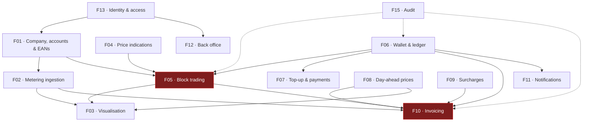

# Feature Index

Fifteen features, each specified in its own document with user stories, numbered functional
requirements, business rules and edge cases.

**Requirement IDs** are stable: `F05-R12` is requirement 12 of feature F05, and can be referenced from
a backlog item, a test, or a change request.

---

## The list

| # | Feature | Portal | MoSCoW | Phase | Size |
| --- | --- | --- | :--: | :--: | :--: |
| [F01](F01-customer-and-metering-points.md) | Customer company, accounts & metering points | Both | **Must** | 1 | M |
| [F02](F02-metering-data-ingestion.md) | Metering data ingestion (PVNed) | Platform | **Must** | 1 | L |
| [F03](F03-consumption-visualisation.md) | Consumption & production visualisation | Customer | **Must** | 1 | L |
| [F04](F04-price-indications.md) | Price indications (Montel) | Customer | **Must** | 2 | M |
| [F05](F05-energy-block-trading.md) | Energy block trading | Both | **Must** | 2 | XL |
| [F06](F06-wallet-and-ledger.md) | Wallet & ledger | Both | **Must** | 2 | L |
| [F07](F07-wallet-topup-and-payments.md) | Wallet top-up & payments | Customer | **Must** | 2 | M |
| [F08](F08-day-ahead-prices.md) | Day-ahead prices | Platform | **Must** | 3 | S |
| [F09](F09-surcharges.md) | Surcharges ("topups") | Employee | **Must** | 3 | S |
| [F10](F10-invoicing-and-settlement.md) | Invoicing & settlement | Both | **Must** | 3 | XL |
| [F11](F11-notifications.md) | Notifications & wallet alerts | Both | **Should** | 3 | M |
| [F12](F12-employee-back-office.md) | Employee back office | Employee | **Must** | 1–3 | L |
| [F13](F13-identity-and-access.md) | Identity & access | Both | **Must** | 1 | M |
| [F14](F14-public-website.md) | Public website | Public | **Could** | 4 | S |
| [F15](F15-audit-and-observability.md) | Audit trail & observability | Both | **Must** | 1–3 | M |

Sizes are relative, for sequencing only: **S** ≈ 1 sprint or less, **M** ≈ 1–2, **L** ≈ 2–4,
**XL** ≈ 4+ with meaningful unknowns.

## Dependency graph

The two red nodes are the critical path: **block trading** and **invoicing** carry the most
requirements, the most state, and the most open questions.

## Phasing

| Phase | Theme | Features | Outcome |
| --- | --- | --- | --- |
| **1** | *See your data* | F13, F01, F02, F03 (read-only), F12 (admin subset), F15 | Customers log in and see accurate interval data per EAN. No money moves. This phase proves the PVNed integration, which is the biggest technical unknown. |
| **2** | *Trade* | F04, F06, F07, F05, F03 (block overlay) | The full request → offer → accept → confirm loop with real money in the wallet. |
| **3** | *Settle* | F08, F09, F10, F11 | Monthly invoicing, day-ahead settlement, wallet deduction, Odoo push, alerts. |
| **4** | *Polish* | F14, remaining Should/Could items | Public site, self-service onboarding, reporting. |

Rationale for the order in [Roadmap & phasing](../70-delivery/01-roadmap-and-phasing.md).

## Requirement count by feature

| Feature | Must | Should | Could | Total |
| --- | --: | --: | --: | --: |
| F01 | 28 | 8 | 2 | 38 |
| F02 | 24 | 4 | 0 | 28 |
| F03 | 16 | 7 | 2 | 25 |
| F04 | 11 | 1 | 2 | 14 |
| F05 | 42 | 7 | 0 | 49 |
| F06 | 25 | 3 | 0 | 28 |
| F07 | 15 | 3 | 1 | 19 |
| F08 | 8 | 2 | 1 | 11 |
| F09 | 7 | 2 | 1 | 10 |
| F10 | 32 | 5 | 0 | 37 |
| F11 | 12 | 4 | 2 | 18 |
| F12 | 26 | 7 | 0 | 33 |
| F13 | 25 | 3 | 1 | 29 |
| F14 | 5 | 2 | 3 | 10 |
| F15 | 18 | 5 | 1 | 24 |
| **Total** | **294** | **63** | **16** | **373** |

> These counts are derived from the requirement tables themselves, not maintained by hand — the
> stakeholder site parses them from the same source, so the two can never disagree.

## Feature template

Each document follows the same structure, so they can be read in any order:

1. **Summary** — one paragraph
2. **User stories** — as-a / I-want / so-that
3. **Functional requirements** — numbered, testable, MoSCoW-tagged
4. **Business rules** — invariants that hold regardless of interface
5. **Screens** — links to mockups
6. **Data** — the entities involved
7. **Edge cases & failure modes** — the ones that will actually happen
8. **Out of scope**
9. **Dependencies**
10. **Open questions**
