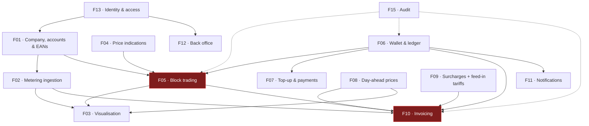

# Feature Index

Fifteen features, each specified in its own document with user stories, numbered functional
requirements, business rules and edge cases.

**Requirement IDs** are stable: `F05-R12` is requirement 12 of feature F05, and can be referenced from
a backlog item, a test, or a change request.

---

## The list

| # | Feature | Portal | MoSCoW | Phase | Size |
| --- | --- | --- | :--: | :--: | :--: |
| [F01](F01-customer-and-metering-points.md) | Customer company, accounts & metering points | Both | **Must** | 1 | M |
| [F02](F02-metering-data-ingestion.md) | Metering data ingestion (PVNed) | Platform | **Must** | 1 | L |
| [F03](F03-consumption-visualisation.md) | Consumption & production visualisation | Customer | **Must** | 1 | L |
| [F04](F04-price-indications.md) | Price indications (Montel) | Customer | **Must** | 2 | M |
| [F05](F05-energy-block-trading.md) | Energy block trading | Both | **Must** | 2 | XL |
| [F06](F06-wallet-and-ledger.md) | Wallet & ledger | Both | **Must** | 2 | L |
| [F07](F07-wallet-topup-and-payments.md) | Wallet top-up & payments | Customer | **Must** | 2 | M |
| [F08](F08-day-ahead-prices.md) | Day-ahead prices | Platform | **Must** | 3 | S |
| [F09](F09-surcharges.md) | Surcharges ("topups") **& feed-in tariffs** | Employee | **Must** | 3 | M |
| [F10](F10-invoicing-and-settlement.md) | Invoicing & settlement | Both | **Must** | 3 | L |
| [F11](F11-notifications.md) | Notifications & wallet alerts | Both | **Should** | 3 | M |
| [F12](F12-employee-back-office.md) | Employee back office | Employee | **Must** | 1–3 | L |
| [F13](F13-identity-and-access.md) | Identity & access | Both | **Must** | 1 | M |
| [F14](F14-public-website.md) | Public website | Public | **Could** | 4 | S |
| [F15](F15-audit-and-observability.md) | Audit trail & observability | Both | **Must** | 1–3 | M |

Sizes are relative, for sequencing only: **S** ≈ 1 sprint or less, **M** ≈ 1–2, **L** ≈ 2–4,
**XL** ≈ 4+ with meaningful unknowns.

> **F10 moved XL → L** on 2026-08-11. **[DEC-24]** defers energiebelasting and the annual true-up,
> **[DEC-25]** takes imbalance out of scope, and those were three of the four things that made
> invoicing XL. It returns to **XL** when [DEC-24] is reopened — which must happen before the first
> invoice to a real customer, because energiebelasting is a legal obligation. No other size or phase
> tag changed in that round: F13 shifts scope under **[DEC-20]** without shrinking, and F14 loses one
> **Could** under **[DEC-27]** without changing size.

> **F09 moved S → M** in the second round of 2026-08-11, and it is the only size change there.
> **[DEC-44]** makes feed-in its own invoice line category, settled at a per-customer **feed-in
> tariff** — so F09 now owns **two** rate tables of identical shape rather than one, and its
> requirement count went from 10 to 17. F10 keeps **L** despite gaining line 6: the line is new, but
> the reference data behind it lives in F09. F05 keeps **XL**, which its 19 new requirements for
> four-eyes approval **[DEC-33]** do nothing to challenge.

## Dependency graph

The two red nodes are the critical path: **block trading** and **invoicing** carry the most
requirements and the most state. Invoicing carried the most open questions too, until [DEC-23],
[DEC-24] and [DEC-25] closed three of them — two of those by deferral, which moves the work rather
than removing it. Block trading has since pulled further ahead on requirement count: [DEC-33] added
19 to F05 alone, which is more than the whole of F09 and F08 together.

## Phasing

| Phase | Theme | Features | Outcome |
| --- | --- | --- | --- |
| **1** | *See your data* | F13, F01, F02, F03 (read-only), F12 (admin subset), F15 | Accurate interval data per EAN, scoped to one customer company on every query. No money moves. The PoC has **no sign-in** **[DEC-20]**, so what this phase proves is tenancy isolation and the ingestion pipeline — **not** the PVNed integration itself, which runs on generated data **[DEC-21]**. Now also carries the **break-glass** path **[DEC-53]** and the **production expectation** on a metering point **[DEC-65]**. |
| **2** | *Trade* | F04, F06, F07, F05, F03 (block overlay), **part of F11** | The full request → offer → accept → confirm loop, plus **four-eyes approval above a threshold [DEC-33]**. Wallet money is **test money only** until the client-money question is answered **[DEC-28]**. |
| **3** | *Settle* | F08, F09, F10, rest of F11 | Monthly invoicing, day-ahead settlement of uncovered volume and of **unused block cover** **[DEC-23]**, **feed-in on exported volume at its own line and its own tariff [DEC-44]**, wallet deduction, Odoo push, alerts. Without energiebelasting, imbalance or the annual true-up **[DEC-24, DEC-25]**. |
| **4** | *Polish* | F14, remaining Should/Could items | Public site (no price teaser **[DEC-27]**), self-service onboarding, reporting. |

Rationale for the order in [Roadmap & phasing](../70-delivery/01-roadmap-and-phasing.md).

> ⚠ **F11 is tagged phase 3 in the table above and is partly needed in phase 2.** **[DEC-63]**
> requires every active account to be notified when an offer arrives, and **[DEC-33]** adds an
> approval that a second person must be told about inside the same reaction window — a four-eyes
> trade whose approver is never notified simply expires. The phase tag on F11 and the phase-2 scope
> in the roadmap disagree, and that needs resolving deliberately: either move F11's offer and
> approval notifications to phase 2, or split F11 in two. Recorded here rather than decided.

> **The biggest technical unknown did not go away.** [DEC-21] unblocks Phase 1 without a vendor
> dependency, but the real PVNed endpoint, authentication, acknowledgement format and retry behaviour
> stay unvalidated, and risk R-01 is deferred rather than closed. Whichever phase first meets the real
> feed inherits that risk.

## Requirement count by feature

| Feature | Must | Should | Could | Deferred | Total | Δ |
| --- | --: | --: | --: | --: | --: | --: |
| F01 | 32 | 7 | 2 | — | 41 | +3 |
| F02 | 34 | 4 | 0 | — | 38 | +7 |
| F03 | 16 | 7 | 2 | — | 25 | — |
| F04 | 13 | 1 | 2 | — | 16 | — |
| F05 | 61 | 7 | 0 | — | 68 | **+19** |
| F06 | 26 | 3 | 0 | — | 29 | +1 |
| F07 | 18 | 3 | 1 | — | 22 | +3 |
| F08 | 10 | 2 | 1 | — | 13 | +2 |
| F09 | 13 | 3 | 1 | — | 17 | +7 |
| F10 | 31 | 4 | 0 | 7 | 42 | +4 |
| F11 | 18 | 4 | 2 | — | 24 | +6 |
| F12 | 30 | 7 | 0 | 1 | 38 | +5 |
| F13 | 37 | 2 | 1 | — | 40 | +8 |
| F14 | 5 | 2 | 2 | 1 | 10 | — |
| F15 | 18 | 5 | 1 | — | 24 | — |
| **Total** | **362** | **61** | **15** | **9** | **447** | **+65** |

> These counts are derived from the requirement tables themselves, not maintained by hand — the
> stakeholder site parses them from the same source, so the two can never disagree.

**Δ is against the 382 recorded before the second decision round on 2026-08-11.** Eleven of the
fifteen features grew; four are untouched. F01, F02, F05, F06, F07, F08, F09, F10, F11, F12 and F13
gained requirements, F05 by nearly forty per cent on its own. Nothing was renumbered and nothing was
deleted, so every added requirement sits at the end of its feature's sequence:
`F01-R39..R41`, `F02-R32..R38`, `F05-R50..R68`, `F06-R29`, `F07-R20..R22`, `F08-R12..R13`,
`F09-R11..R17`, `F10-R39..R42`, `F11-R19..R24`, `F12-R34..R38`, `F13-R33..R40`. A few existing
requirements changed MoSCoW tag where a decision made them non-optional — F01 and F13 each moved one
from *Should* to *Must* — which is why a feature's Δ and its count of new IDs are not always the same
arithmetic.

**Deferred** is a fourth MoSCoW state, added on 2026-08-11 by the decisions in
[Assumptions & decisions](../00-overview/04-assumptions-and-decisions.md). A deferred requirement
keeps its ID, its wording and its place in the table, and carries the decision that deferred it.
Nothing is deleted and nothing is renumbered, so a backlog item or a test that cites `F10-R29` still
resolves.

| Deferred by | Requirements | Returns when |
| --- | --- | --- |
| **[DEC-24]** energiebelasting out of scope | F10-R27..R33 (the annual true-up), F12-R20 (tariff admin) | EB is reopened — mandatory before the first invoice to a real customer |
| **[DEC-27]** no public price display | F14-R09 (public price teaser) | A new decision, not merely a permissive licence |

**[DEC-25]** removes imbalance from the invoice without deferring a numbered requirement: it changes
the wording of F10-R05 and F10-R08 and removes the `MISSING_IMBALANCE_DATA` pre-flight check.

**Nothing has been deferred since.** The second round of 2026-08-11 added requirements and changed
existing ones; it deferred none, so the *Deferred* column is unchanged at nine.

The first round **added** nine requirements: F02-R29..R31 (generated and mock PVNed data,
**[DEC-21]**), F04-R15..R16 (no public display, no customer export, **[DEC-27]**), F10-R38 (VAT at
invoice level, **[DEC-26]**) and F13-R30..R32 (the tenancy context pipeline and the Entra claim
mapping, **[DEC-20]**).

The second round added **sixty-five more**, and three decisions account for over half of them:

| Decision | What it added | Where |
| --- | --- | --- |
| **[DEC-33]** four-eyes approval | An `AWAITING_APPROVAL` state, a terminal `APPROVAL_REFUSED`, an approver distinct from the acceptor, a reservation with three exits, customer-flow warnings at three points, and a threshold admin screen | F05-R50..R68, F12-R38 |
| **[DEC-44]** feed-in as its own line category | A second per-customer rate table with the surcharge's shape, a `MISSING_FEED_IN_TARIFF` pre-flight check, a per-interval rate application and a re-derived volume identity | F09-R14..R17, F10-R39..R42 |
| **[DEC-53]** break-glass | Platform-held password hashes for named employee accounts, time-boxed enablement, an off-provider second factor, alerting on every attempt, a bounded function set, scheduled rehearsal and its own lockout | F13-R33..R40 |

The rest follow the same pattern — a decision that changes specified work leaves numbered
requirements behind it: **[DEC-35]** the €/kWh unit, its 7-decimal precision and the divide-by-1000
migration (F09-R11..R13); **[DEC-65]** the production expectation with its provenance and its
completeness test (F01-R39..R41, F02-R32); the approval notifications **[DEC-33]** needs, then
emailed invoices **[DEC-47]** over SendGrid **[DEC-48]** on a dedicated sending domain
(F11-R19..R24); **[DEC-43]** the requirement that *no* code path moves money out of a wallet
(F06-R29); **[DEC-58]** and **[DEC-61]** the iDEAL-only surface and IBAN matching (F07-R20..R22); and
**[DEC-44]** the raw-price and two-volumes rules on the day-ahead side (F08-R12..R13).

## Feature template

Each document follows the same structure, so they can be read in any order:

1. **Summary** — one paragraph
2. **User stories** — as-a / I-want / so-that
3. **Functional requirements** — numbered, testable, MoSCoW-tagged
4. **Business rules** — invariants that hold regardless of interface
5. **Screens** — links to mockups
6. **Data** — the entities involved
7. **Edge cases & failure modes** — the ones that will actually happen
8. **Out of scope**
9. **Dependencies**
10. **Open questions**
