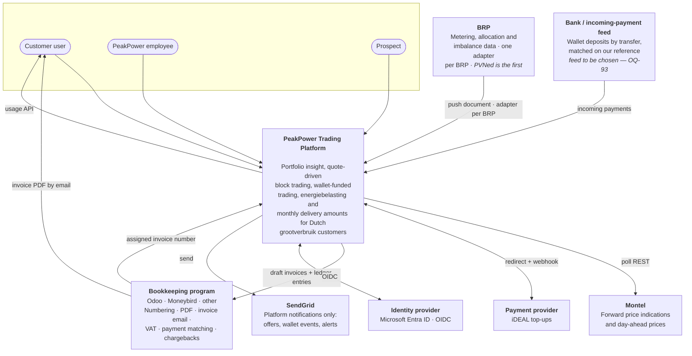
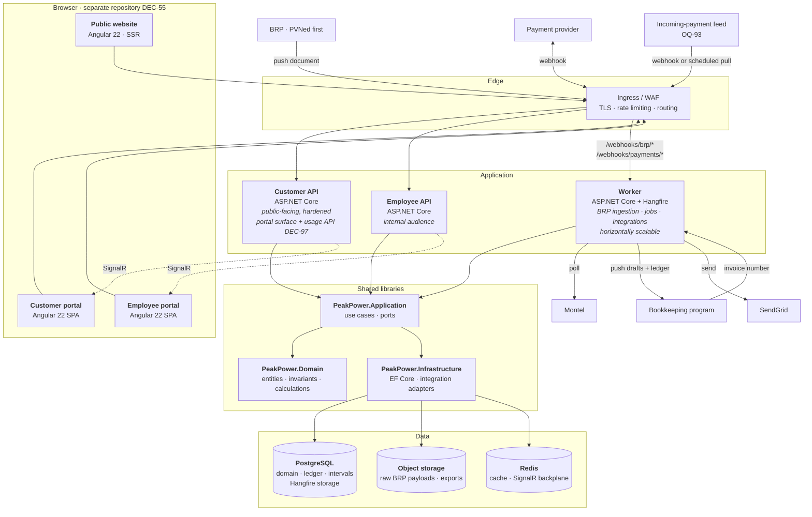
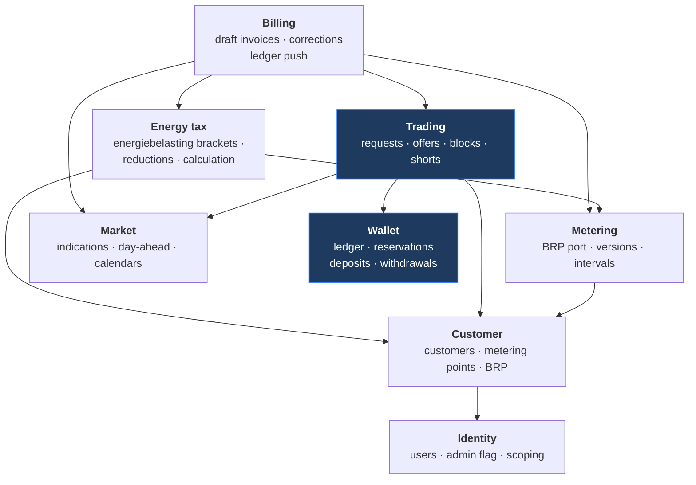

# Architecture Overview

---

## 1. Shape of the system

A **modular monolith** in the domain layer **[DEC-01]**, deployed as three .NET hosts (two APIs and a
worker) behind three **Angular 22** applications **[DEC-54]**, on one PostgreSQL database,
orchestrated locally by .NET Aspire and in production by Azure Container Apps.

**One system, two repositories [DEC-55].** The .NET and Angular code live apart, with separate
pipelines and a published OpenAPI client between them. That is a delivery boundary, not an
architectural one — the container diagram below is unchanged by it — but it does change what "one
command brings up the system" costs to keep true. See
[Solution structure](02-solution-structure.md) §1.2, §4.3 and §5.1.

The reasoning: the hard problems here are transactional, not scale-related. A wallet reservation and
a trade state change must commit together; an invoice must read a consistent snapshot of intervals,
blocks, prices and tariffs — after **[DEC-73]** and **[DEC-74]** the tariff in that sentence is the
energiebelasting bracket table, not a surcharge table, and the requirement is unchanged by the
substitution. Distributing those across service boundaries buys nothing and costs
correctness. The module seams are drawn where a future extraction would be natural, and the volume
projections ([NFR](08-non-functional-requirements.md)) show a single database handling the load for
years.

**Still three hosts after 2026-08-19 [DEC-97].** Customers get programmatic access to their own usage
data. That surface is **added to the customer API host**, not given a host of its own, and **[DEC-02]**
(separate customer and employee APIs) is unchanged. The reason is that [DEC-02] splits by *audience*
and hardening profile, not by protocol: a usage client is the same audience as the portal — the same
customer company, the same `customer_id` scoping, the same public-internet threat model — so a third
host would duplicate the customer API's hardening for no new audience. What genuinely differs is the
credential (machine-to-machine rather than interactive OIDC) and the shape of the traffic, and both are
concerns *inside* one host: a separate route prefix, its own scopes, and rate limits applied per
credential rather than per user. See [API contracts](05-api-contracts.md) and
[Security](07-security.md).

Cost, stated plainly: the public-facing host now carries interactive and programmatic traffic
together, so a customer pulling a year of intervals can compete with the trade desk for the same
instances. The mitigations are per-credential rate limits and a bounded page size, not a fourth
container. Whether the usage data is delivered over that API, over file/FTP, or both is **[OQ-95]**;
FTP would be a worker job writing to object storage, not another host either.

## 2. Context (C4 level 1)

**What changed on 2026-08-19, and why the context got busier rather than simpler:**

| Element | Before | Now | Driver |
| --- | --- | --- | --- |
| Metering source | **PVNed**, hard-wired | **BRP** — reference data with credentials, endpoint, document format and an adapter; PVNed is the first instance, not the only one | **[DEC-69]**, extending **[DEC-21]** |
| Odoo | Fire-and-forget sink for invoices | **Bookkeeping program** with a **return path**: it owns numbering and returns the assigned number; it renders the PDF and emails it to the customer | **[DEC-88]**, **[DEC-89]** |
| SendGrid | Notifications **and** invoices | Platform notifications only — offers, wallet events, alerts, "funds received" | **[DEC-89]** narrowing **[DEC-48]** |
| Payment surface | iDEAL only | iDEAL **plus** a modelled bank transfer with a platform-issued reference and an **incoming-payment feed** the platform consumes | **[DEC-106]** amending **[DEC-58]**; the feed itself is **[OQ-93]** |
| Customer edge | Portal only | Portal **plus** a usage API on the same host | **[DEC-97]** |

The bookkeeping arrow is now bidirectional, and that is the single most consequential change on this
diagram. ⚠ Under **[DEC-88]** a push failure does not merely delay a report — the customer has **no
numbered invoice at all**, because the platform never mints one. The integration moved from
"nice to have, retry tomorrow" to a hard dependency of the monthly cycle, which is why **[OQ-69]**
(bookkeeping version and API) is re-prioritised to 🔴 P1 in [Open questions](../80-open-questions.md).

## 3. Containers (C4 level 2)

Three things left this diagram on 2026-08-19 and one arrived:

| Change | Detail |
| --- | --- |
| **No PDF renderer** | There is no invoice-rendering component and no PDF in object storage. **[DEC-89]** moves rendering *and* sending to the bookkeeping program; object storage now holds raw BRP payloads and whatever exports a job writes. This removes a rendering library, a font/asset pipeline and a document-retention path from the platform |
| **No invoice email path** | The SendGrid edge carries platform notifications only — offer raised, offer expiring, funds received **[DEC-106]**, ingestion alerts. The invoice email is the bookkeeping program's **[DEC-89]** |
| **Wallet ↔ invoice edge gone** | Delivery amounts no longer settle from the wallet **[DEC-77]**; see §4 and §8 |
| **Incoming-payment ingress arrived** | A third public ingress path for wallet deposits by bank transfer **[DEC-106]**. The platform issues a unique payment reference per deposit intent, matches the incoming payment on it, credits the wallet and emails the customer. ⚠ Whether that ingress is a webhook (PSP or SEPA-instant push) or a scheduled CAMT.053 import is **[OQ-93]** — the diagram shows both shapes because the transport is undecided, and the port is written so the answer swaps an adapter rather than a container |

The generalisation of the metering ingress is **[DEC-69]**: `/webhooks/pvned` becomes
`/webhooks/brp/*` — one route per BRP, identified by the credential that authenticated, never by a
field in the payload — and the parser, the validation and the credential check live in a **per-BRP
adapter behind one port**. Raw-payload persistence, versioning **[DEC-07]** and quarantine stay in the
pipeline because they are BRP-agnostic. See [PVNed integration](../30-integrations/01-pvned-timeseries.md)
for the first adapter and [F02](../10-features/F02-metering-data-ingestion.md) for the pipeline.

### 3.1 Why the webhooks land on the worker

⚠ **Amended 2026-08-19 by [DEC-69] and [DEC-106].** Original text, still true in substance:
*"PVNed pushes and payment callbacks are ingestion, not user traffic. Routing them to the worker keeps
the customer API free of a public endpoint that a third party can drive, lets ingestion scale
independently of user load, and means a burst of PVNed traffic cannot degrade the portal. The worker
still exposes only those two paths publicly; everything else it does is scheduled or queued."*

Now read: **BRP** pushes **[DEC-69]**, payment callbacks and the **incoming-payment feed**
**[DEC-106]** are ingestion, not user traffic. The same three reasons hold, and a fourth is added by
the BRP port: a misbehaving or newly onboarded BRP is contained to one adapter and one route, and
cannot take the portal down with it.

The worker exposes **two** path families publicly — `/webhooks/brp/*` and `/webhooks/payments/*` —
and nothing else; everything else it does is scheduled or queued. The incoming-payment ingress
**[DEC-106]** sits inside the payments family rather than beside it, because a PSP callback and a
bank push are the same kind of thing arriving from different senders. ⚠ If **[OQ-93]** resolves to a
CAMT.053 file import there is no new route at all: it becomes a scheduled job reading files from
object storage, which is the cheaper of the two outcomes and the one to prefer if the choice is
otherwise even.

### 3.2 Container responsibilities

| Container | Owns | Scaling | Public? |
| --- | --- | --- | --- |
| **Customer API** | Customer-facing use cases, strict `customer_id` scoping, the customer **usage API** surface **[DEC-97]** — machine credentials, own scopes, per-credential rate limits — and the **four-eyes approval queue** **[DEC-71]**, because the second pair of eyes is another **admin of the same customer company**, not a PeakPower employee | 2+ instances | Yes, hardened |
| **Employee API** | Back-office use cases, cross-customer reads, manual withdrawal payout **[DEC-83]**, energiebelasting bracket and reduction maintenance **[DEC-74]** | 2 instances | Restricted (IP allow-list or private ingress) |
| **Worker** | BRP ingestion webhooks **[DEC-69]**, the incoming-payment ingress **[DEC-106]**, Hangfire jobs, outbound integrations including the draft-invoice push and the invoice-number return path **[DEC-88]** | 2+ instances, scales on queue depth | Only `/webhooks/*` |
| **Customer portal** | Angular 22 SPA **[DEC-54]** | Static hosting / CDN | Yes |
| **Employee portal** | Angular 22 SPA **[DEC-54]** | Static hosting | Restricted |
| **Public website** | Angular 22 SSR **[DEC-54]** | Static / CDN | Yes |

## 4. Module map

⚠ **Amended 2026-08-19 by [DEC-73] and [DEC-74].** It was *seven* modules. It is now **eight**, and the
change is a swap of contents rather than growth: the **surcharge/topup** concern left the Billing
module **[DEC-73]** and an **Energy tax** module arrived **[DEC-74]**. Within the shared domain, eight
modules with explicit dependencies:

**What moved, and what it cost:**

| Module | Change | Driver |
| --- | --- | --- |
| **Billing** | Loses `surcharges` — the €/kWh topup fee, its tariff table and its resolution order are not computed here. The platform pushes **volume** and the bookkeeping program multiplies. Loses invoice numbering, PDF and email **[DEC-88]**, **[DEC-89]**. Gains `corrections`: a late metering correction produces a correction draft at any time, so the module is no longer a monthly gate that closes **[DEC-99]** | **[DEC-73]**, **[DEC-88]**, **[DEC-89]**, **[DEC-99]** |
| **Energy tax** (new) | Versioned bracket reference data (tier boundaries and €/kWh per year), a per-customer reduction or exemption, calculation per EAN per calendar year on net usage **[DEC-22]**, and a **ledger push** of the result. Depends on Customer (the reduction) and Metering (the volume); Billing depends on it, not the reverse — the tax is computed whether or not a draft invoice is being assembled | **[DEC-74]** |
| **Wallet** | `payments` splits into `deposits` (iDEAL **and** reference-matched bank transfer **[DEC-106]**) and `withdrawals` (**[DEC-83]**, manual payout). No `INVOICE_DEBIT` entry type any more **[DEC-77]** | **[DEC-77]**, **[DEC-83]**, **[DEC-106]** |
| **Trading** | Sell no longer validates against confirmed holdings — a short position is permitted **[DEC-72]** | **[DEC-72]** |
| **Metering** | The PVNed webhook, parser and validation become **one adapter behind a BRP port**; a metering point is assigned to a BRP | **[DEC-69]** |
| **Identity** | Customer accounts carry an **admin** flag — two levels, existing only to make four-eyes expressible | **[DEC-71]** qualifying **[DEC-16]** |

⚠ **The `BILLING --> WALLET` edge is gone.** It was there because an invoice was settled by debiting
the wallet **[AS-12]**. Under **[DEC-77]** the wallet funds trading only and delivery amounts are paid
to the bank, so Billing has no reason to read or write the ledger. See §8.

⚠ **Cost of the new module, stated:** eight modules mean one more acyclic-dependency rule to enforce
and one more application-service interface to keep honest. The alternative — energiebelasting as a
folder inside Billing — was rejected because the tax has its own reference data with its own editing
lifecycle **[DEC-74]** and its own ledger push, and because it is calculated on volumes regardless of
whether an invoice draft exists. ⚠ **[OQ-96]** (does the *vermindering* apply?) sits squarely in this
module and changes the amount it computes, not its shape.

**Rules between modules:**

1. Dependencies point one way only; the graph is acyclic and is enforced by an architecture test.
2. A module exposes an application-service interface; other modules never reach into its entities or
   its tables.
3. Cross-module reads that need to be transactional go through the owning module's service.
4. Cross-module reactions that do not need to be transactional go through in-process domain events.

**Trading** and **Wallet** are highlighted because they share transactions. They live in separate
modules but in the same database and the same transaction scope — which is exactly the property
[DEC-01] is protecting. **[DEC-77]** sharpens the claim rather than weakening it: now that Billing no
longer settles from the ledger, Trading is the **only** module that shares a transaction with Wallet,
so the one place [DEC-01] is load-bearing is also the one place it is exercised.

## 5. Key architectural decisions

| # | Decision | Consequence |
| --- | --- | --- |
| [DEC-01] | Modular monolith, three hosts | One transaction spans trading and wallet. Extraction later along module seams. |
| [DEC-02] | Separate customer and employee APIs | Two audiences, two hardening profiles, one domain library. |
| [DEC-03] | Ingestion decoupled: store raw → ack → queue | The pushing BRP gets a fast 200 **[DEC-69]**; parsing failures never trigger redelivery. Generalising from PVNed to any BRP costs nothing here, because the raw store and the ack precede the parser. |
| [DEC-04] | Append-only ledger, materialised balance | Auditable history, O(1) balance reads, reconciliation job as the safety net. |
| [DEC-06] | Trade state as an event stream | The audit trail is the model, not a byproduct. |
| [DEC-07] | Versioned interval data | "What did we invoice on?" is answerable. |
| [DEC-08] | UTC storage, Amsterdam business calendar | DST correctness in one place. |
| [DEC-09] | PostgreSQL only, partitioned interval tables | No second datastore to operate at this volume. |
| [DEC-10] | Hangfire on PostgreSQL | Scheduling, retries and a dashboard without extra infrastructure. |
| [DEC-33] | ⚠ **Reversed 2026-08-19 by [DEC-71].** ~~Four-eyes approval above a value threshold~~ | ~~A thirteenth state and a fourteenth transition; the reservation is held *across* approval, not taken at it.~~ The threshold reference table is not built; the extra state and transition survive under [DEC-71], the trigger does not. |
| [DEC-55] | Separate .NET and Angular repositories | Two pipelines, a published OpenAPI client between them, and "one command starts everything" as a maintained property rather than a free one. |
| [DEC-69] | Metering ingestion is a **BRP port with per-BRP adapters**; PVNed is the first | An interface seam and a `brp` table now, so a second BRP is additive. Credentials, endpoint and document format become reference data; the parser stops being the pipeline. |
| [DEC-71] | **Four-eyes is a per-customer-company mode**, no threshold | Approval is a company setting, not a value comparison. Customer accounts gain an `admin` flag — the smallest role model that makes the control expressible. Approval lives on the customer API, not the employee API. |
| [DEC-72] | Short selling permitted | The sell path drops the holdings check. ⚠ The prepaid wallet no longer bounds the risk it takes, because a short is a promise to deliver rather than a spend — **[OQ-94]**. |
| [DEC-73] / [DEC-74] | Surcharges out, **energiebelasting** in | The module map swaps a concern rather than shrinking: no topup tariff resolution, but versioned brackets, per-customer reductions and a ledger push. |
| [DEC-77] | The wallet funds **trading only** | Billing no longer depends on Wallet. Two money paths that were one: reserve-and-debit inside the wallet, and a delivery amount pushed to the bookkeeping program and paid to the bank. |
| [DEC-88] / [DEC-89] | The bookkeeping program owns **numbering, PDF and email**; the platform pushes drafts | The integration gains a **return path** (the assigned number) and becomes a hard dependency of the monthly cycle. No renderer, no document store, no invoice mail path in the platform. |
| [DEC-97] | Customer **usage API** as a surface on the customer API, not a third host | One more hardening profile avoided; interactive and programmatic traffic share instances, so rate limits move per credential. [DEC-02] unchanged. |
| [DEC-106] | **Incoming-payment ingress** for wallet deposits, matched on a platform-issued reference | A third inbound path and a matching job the platform owns end to end. ⚠ The feed is **[OQ-93]**; the port is written so the answer swaps an adapter. |

## 6. Cross-cutting concerns

| Concern | Approach |
| --- | --- |
| **Tenancy isolation** | `customer_id` global query filter in EF Core, sourced from the token, plus row-level policy as defence in depth. [Security](07-security.md) |
| **Time** | One `IMarketCalendar` service owns interval ↔ timestamp, `Pos` mapping, peak evaluation, working days. Nothing else does date arithmetic. |
| **Money** | One `Money` value type; `numeric(18,6)` storage; explicit rounding only at defined boundaries **[DEC-12]**. Every stored and pushed amount is **ex-VAT** — the platform computes no VAT at all, the bookkeeping program applies a rate per ledger account **[DEC-76]**. The single exception is the trade reservation and its debit, grossed up at the **[DEC-64]** rate so that a reservation covers the debit it will become **[DEC-78]**. |
| **Four-eyes** | A per-customer-company mode **[DEC-71]**, evaluated in the application layer on five actions: add bank account, deactivate bank account, execute trade, add user, withdraw. Deposits are out of scope by decision. The approver must be a **different admin of the same company**, and **[DEC-17]** (every action records the acting account) is what makes the approval trail meaningful. |
| **Idempotency** | Every inbound integration keyed on a natural external id; every job safe to run twice. The deposit path adds a platform-issued **payment reference** as that key **[DEC-106]**, with IBAN matching **[DEC-61]** as the fallback when the customer omits it; the draft-invoice push is keyed so a retry cannot produce two numbered invoices **[DEC-88]**. |
| **Concurrency** | Row-level locks on wallet and trade; optimistic concurrency elsewhere. |
| **Real-time** | SignalR for the trade desk and offer countdowns, Redis backplane across instances. |
| **Validation** | FluentValidation at the application boundary; invariants in the domain. |
| **Errors** | RFC 7807 problem details; no internal detail leaked to the customer API. |

## 7. Technology choices

| Layer | Choice | Note |
| --- | --- | --- |
| Backend | .NET 10 / C# | Stated preference |
| Web framework | ASP.NET Core Minimal APIs | Thin transport over application services |
| ORM | EF Core 10 + Dapper for reporting queries | EF for writes, Dapper where a hand-tuned interval query is clearer |
| Database | PostgreSQL 17 | **[DEC-09]** |
| Jobs | Hangfire + PostgreSQL storage | **[DEC-10]** |
| Orchestration (local) | .NET Aspire | Stated preference. Starts front-ends it does not contain **[DEC-55]** — [Solution structure](02-solution-structure.md) §4.3 |
| Frontend | **Angular 22**, standalone components, signals | **[DEC-54]** — all three applications on one version |
| Repositories | Two: `peakpower-platform` (.NET) and `peakpower-web` (Angular) | **[DEC-55]**, closing [OQ-51] |
| UI components | To decide — **[OQ-49]**, component-library half only | **[DEC-54]** settles the framework version. ⚠ **Amended 2026-08-19 by [DEC-79]:** ~~Expect **[DEC-39]**'s free-or-in-house constraint to apply here too~~ — the licence constraint is gone here as well, so a paid component library is admissible and the choice is on fit and support |
| Charts | ⚠ **Reversed 2026-08-19 by [DEC-79]:** ~~**Open-source and free, or written in-house [DEC-39]**~~ — **a commercial licence is acceptable**; the specific library still to decide | ~~Commercial licences are excluded.~~ "The chart is the product", so the phase-0 spike stays, but it now judges the full field on **fit** rather than on licence cost. This makes building custom much less likely and removes a schedule risk; it adds a recurring licence line and a vendor dependency in the one place the product is most visible **[OQ-22]** |
| Email | **SendGrid** | **[DEC-48]**. ⚠ **Amended 2026-08-19 by [DEC-89]:** it carries ~~offer notifications *and* invoices **[DEC-47]**~~ **platform notifications only** — offers, wallet events, "funds received" **[DEC-106]**, ingestion alerts. The invoice email is sent by the bookkeeping program. Deliverability is still a requirement, and the dedicated sending domain with SPF, DKIM and DMARC is still a lead-time item, but a bounce no longer means an unpaid invoice |
| Real-time | SignalR | First-class in ASP.NET Core |
| SOAP | `System.ServiceModel` / hand-rolled `XmlReader` | The inbound document is simple enough that a hand-written reader with XSD validation is more predictable than generated clients. ⚠ Under **[DEC-69]** this is a property of the **PVNed adapter**, not of ingestion: another BRP may push JSON, CSV or a file drop, and the port does not care |
| Bookkeeping client | Typed HTTP client behind an `IBookkeepingGateway` port | **[DEC-88]**, **[DEC-89]**. Push draft invoice and ledger entries, read back the assigned number. Odoo is the assumed first implementation; the version and API are **[OQ-69]** and are now blocking rather than informational |
| PDF rendering | **None** | ⚠ **Removed 2026-08-19 by [DEC-89].** No rendering library, no headless browser, no font pipeline, no document store. Branding of the invoice moves out of platform control, which is the price paid |
| Observability | OpenTelemetry | Backend per **[OQ-47]** |
| Cloud | Azure Container Apps | Aspire's smoothest target; not a lock-in — see [Deployment](09-deployment.md) |

## 8. What this architecture optimises for

**Correctness over throughput.** Money paths take locks. Invoicing is deterministic and reproducible.
Data is versioned rather than overwritten.

**Reversibility.** The module graph, the provider-agnostic integrations and the container split mean
most decisions here can be revisited without a rewrite. The ones that cannot — the ledger model, the
interval versioning, the time handling — are the ones specified in the most detail, deliberately.
2026-08-19 paid this off twice: **[DEC-69]** turned the metering source into an adapter behind a port
and **[DEC-86]** kept the payment provider undecided behind one, and neither cost a rewrite. It also
spent it once — **[DEC-88]** and **[DEC-89]** hand invoice numbering and rendering to an external
system, and getting them back would mean rebuilding what was deleted.

**Decoupling where the coupling was accidental.** The wallet and the invoice used to share a
mechanism: an invoice was settled by debiting the wallet **[AS-12]**, so Billing depended on Wallet
and every invoicing question dragged a ledger question behind it — partial settlement, negative
balances, the order of debits. **[DEC-77]** cuts that edge. The wallet funds **trading** only:
reservation on request, debit on execution, inside one module and one transaction, and the prepaid
balance is exactly what makes **[AS-11]** (never negative) hold without a credit concept. Delivery —
day-ahead, export **[DEC-87]** and energiebelasting **[DEC-74]** — is pushed to the bookkeeping
program and paid to the bank, and never touches the ledger. Two paths that behave differently are now
modelled differently. ⚠ The cost is that the platform loses its lever: it can no longer stop delivery
because a wallet is empty, and unpaid delivery invoices are a collections problem in the bookkeeping
program rather than a balance check here.

**Operability by a small team.** One database, one job framework, one cloud service type, one local
`dotnet run`. Every additional moving part has to justify itself against the cost of a small team
carrying it at 3am. ⚠ **[DEC-104]** makes "small team" literal: **Thinh operates the platform after
go-live, alone, with no rota.** That is the strongest possible argument for the choices in §9, and it
is also a single point of failure for P1 alerts — recorded as a risk in
[Risks](../70-delivery/02-risks.md), not solved here. It also means alert volume is a design
constraint: **[DEC-90]** removed wallet balance monitoring precisely because nobody was going to act
on it.

## 9. Deliberately not done

| Not doing | Why |
| --- | --- |
| Microservices | No scale or team-autonomy pressure; transactional coupling argues against **[DEC-01]** |
| Event sourcing across the domain | Used only for trade state, where the audit trail is a product requirement **[DEC-06]** |
| CQRS with separate read stores | Materialised rollups in the same database are sufficient |
| A message broker | Hangfire covers queueing; a broker would be a second thing to operate |
| A separate time-series database | Volume does not warrant it **[DEC-09]** |
| GraphQL | Two known clients, both ours |
| Kubernetes | Container Apps gives the useful parts without the operational surface |
| A monorepo | Reversed by **[DEC-55]**. The cost moves to a client-publishing step and a maintained dev-up path, both specified in [Solution structure](02-solution-structure.md) |
| ~~A commercial charting library~~ | ⚠ **Reversed 2026-08-19 by [DEC-79].** ~~Excluded by **[DEC-39]** — free, open-source, or built here.~~ A commercial licence is now acceptable; the spike judges fit, not licence cost **[OQ-22]** |
| Invoice numbering, PDF rendering and invoice email | Owned by the bookkeeping program **[DEC-88]**, **[DEC-89]**. The platform pushes a draft and stores the number that comes back. ⚠ This is a dependency, not a saving: without the integration there is no numbered invoice at all |
| A surcharge / topup engine | Left the platform **[DEC-73]**. The platform pushes **volume**; the bookkeeping program multiplies it by the topup fee. The platform's only margin instrument is the spread on the price it quotes **[DEC-80]** |
| VAT computation | The platform is ex-VAT throughout **[DEC-76]**; the bookkeeping program applies a rate per ledger account. The **[DEC-64]** rate survives only to gross up a trade reservation **[DEC-78]** |
| Invoice payment matching, chargebacks and settlement reconciliation | Bookkeeping program **[DEC-85]**, **[DEC-105]**, **[DEC-109]**. The one payment the platform *does* match is a **wallet deposit**, on a reference it issued **[DEC-106]** — a deliberate, narrow exception |
| A four-eyes threshold table | Never built **[DEC-71]** replacing **[DEC-33]**. Four-eyes is a boolean on the customer company; no euro or megawatt comparison, no reference data, no per-action tuning |
| Wallet balance thresholds and low-balance alerts | Removed by **[DEC-90]**. The balance is visible; it is not monitored. The pre-trade check **[DEC-41]** is the only thing that reads it for a decision |
| A CMS | **[DEC-93]** — public-website content is files in the repository, so a copy change is a release. Removes an editor, a database and an authenticated public-facing surface |
| An on-call rota | **[DEC-104]** — one named operator. Not an architectural choice so much as an architectural constraint: it caps how many independently failing parts this design may contain |

## 10. Open questions

Post-2026-08-19. The licence half of [OQ-22] reopened rather than closed, and four questions from this
round land on this document because each one decides a container, a port or an ingress.

| Ref | P | Question | What it blocks here |
| --- | :--: | --- | --- |
| [OQ-22] | 🟠 | Charting library. ⚠ **The [DEC-39] half-closure is withdrawn by [DEC-79]** — a commercial licence is acceptable, so the field is wider than it was, not narrower. **Which** library, or whether to build, still needs the phase-0 spike | The front-end dependency set and a possible recurring licence cost |
| [OQ-47] | 🟡 | Observability backend | Nothing structural; the OpenTelemetry seam is in place either way. Sharper under **[DEC-104]** — one operator means alerting quality matters more than dashboard breadth |
| [OQ-49] | 🟡 | Angular component library. **[DEC-54]** answers the framework version (Angular 22); the library is still open, and **[DEC-79]** removes the licence constraint here too | Front-end scaffolding |
| [OQ-50] | 🟡 | Is Azure confirmed, or must the design stay portable to another cloud? | Container Apps vs a portable target — see [Deployment](09-deployment.md) |
| [OQ-69] | 🔴 | Which bookkeeping program, which version, which API? ⚠ **Re-prioritised to P1 this round.** **[DEC-88]**, **[DEC-89]**, **[DEC-105]**, **[DEC-108]** and **[DEC-109]** all moved work into it, and **[DEC-74]** and **[DEC-76]** added to it | The invoice cannot be issued at all without this integration. It is now on the critical path of the monthly cycle |
| [OQ-93] | 🟠 | Which incoming-payment feed — CAMT.053 import, PSP webhook, or SEPA-instant push? | The shape of the third inbound ingress **[DEC-106]**: a webhook route on the worker, or a scheduled job reading files from object storage. Blocks the bank-transfer deposit route |
| [OQ-94] | 🟠 | What collateral or exposure limit applies to a short position? | **[DEC-72]** opens short selling and the prepaid wallet does not bound the risk, so the pre-trade check **[DEC-41]** stops being a complete control. Needed before the sell path opens |
| [OQ-95] | 🟡 | Is customer usage delivered over an API, over file/FTP, or both? | **[DEC-97]** is a surface on the customer API; FTP would add a worker job and an export store instead. Neither adds a host |
| [OQ-96] | 🟠 | Does the *vermindering* apply, and to which connections? | The Energy tax module's amount, not its shape **[DEC-74]** |

Closed for this document by the 2026-08-19 round: **[OQ-85]** (four-eyes threshold — there is none,
**[DEC-71]**), **[OQ-90]** (invoice attached or linked — no longer the platform's question,
**[DEC-89]**), **[OQ-07]** (is a payment feed in scope — yes, for wallet deposits only, **[DEC-106]**),
**[OQ-63]** (who operates — **[DEC-104]**). The full register is
[Open questions](../80-open-questions.md).
