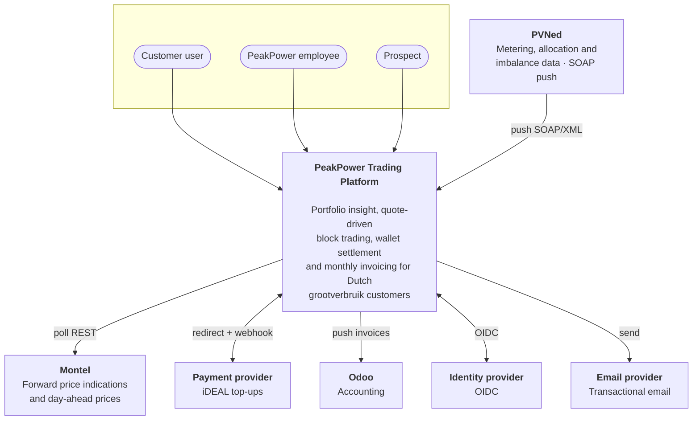
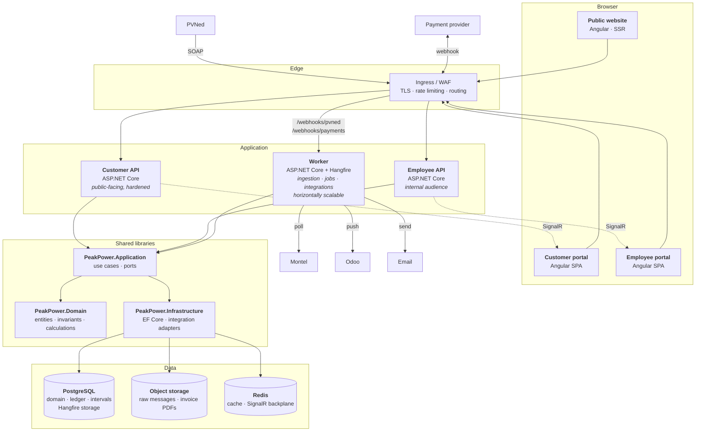
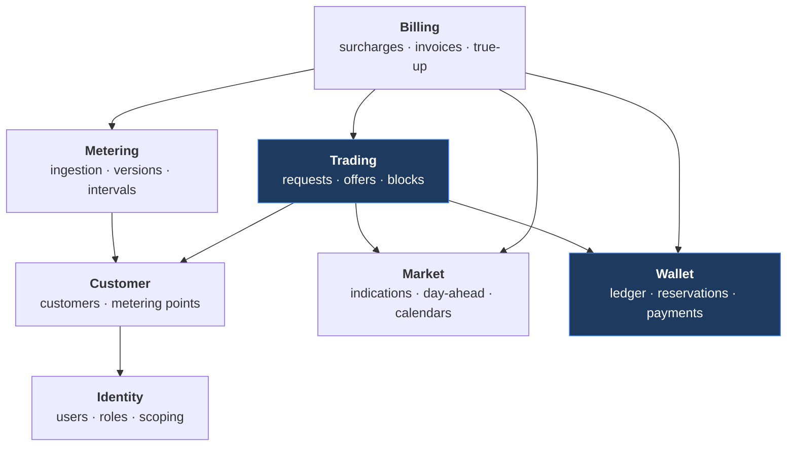

# Architecture Overview

---

## 1. Shape of the system

A **modular monolith** in the domain layer **[DEC-01]**, deployed as three .NET hosts (two APIs and a
worker) behind three Angular applications, on one PostgreSQL database, orchestrated locally by .NET
Aspire and in production by Azure Container Apps.

The reasoning: the hard problems here are transactional, not scale-related. A wallet reservation and
a trade state change must commit together; an invoice must read a consistent snapshot of intervals,
blocks, prices and tariffs. Distributing those across service boundaries buys nothing and costs
correctness. The module seams are drawn where a future extraction would be natural, and the volume
projections ([NFR](08-non-functional-requirements.md)) show a single database handling the load for
years.

## 2. Context (C4 level 1)

## 3. Containers (C4 level 2)

### 3.1 Why the webhooks land on the worker

PVNed pushes and payment callbacks are ingestion, not user traffic. Routing them to the worker keeps
the customer API free of a public endpoint that a third party can drive, lets ingestion scale
independently of user load, and means a burst of PVNed traffic cannot degrade the portal.

The worker still exposes only those two paths publicly; everything else it does is scheduled or
queued.

### 3.2 Container responsibilities

| Container | Owns | Scaling | Public? |
| --- | --- | --- | --- |
| **Customer API** | Customer-facing use cases, strict `customer_id` scoping | 2+ instances | Yes, hardened |
| **Employee API** | Back-office use cases, cross-customer reads | 2 instances | Restricted (IP allow-list or private ingress) |
| **Worker** | Ingestion webhooks, Hangfire jobs, outbound integrations | 2+ instances, scales on queue depth | Only `/webhooks/*` |
| **Customer portal** | Angular SPA | Static hosting / CDN | Yes |
| **Employee portal** | Angular SPA | Static hosting | Restricted |
| **Public website** | Angular SSR | Static / CDN | Yes |

## 4. Module map

Within the shared domain, seven modules with explicit dependencies:

**Rules between modules:**

1. Dependencies point one way only; the graph is acyclic and is enforced by an architecture test.
2. A module exposes an application-service interface; other modules never reach into its entities or
   its tables.
3. Cross-module reads that need to be transactional go through the owning module's service.
4. Cross-module reactions that do not need to be transactional go through in-process domain events.

**Trading** and **Wallet** are highlighted because they share transactions. They live in separate
modules but in the same database and the same transaction scope — which is exactly the property
[DEC-01] is protecting.

## 5. Key architectural decisions

| # | Decision | Consequence |
| --- | --- | --- |
| [DEC-01] | Modular monolith, three hosts | One transaction spans trading and wallet. Extraction later along module seams. |
| [DEC-02] | Separate customer and employee APIs | Two audiences, two hardening profiles, one domain library. |
| [DEC-03] | Ingestion decoupled: store raw → ack → queue | PVNed gets a fast 200; parsing failures never trigger redelivery. |
| [DEC-04] | Append-only ledger, materialised balance | Auditable history, O(1) balance reads, reconciliation job as the safety net. |
| [DEC-06] | Trade state as an event stream | The audit trail is the model, not a byproduct. |
| [DEC-07] | Versioned interval data | "What did we invoice on?" is answerable. |
| [DEC-08] | UTC storage, Amsterdam business calendar | DST correctness in one place. |
| [DEC-09] | PostgreSQL only, partitioned interval tables | No second datastore to operate at this volume. |
| [DEC-10] | Hangfire on PostgreSQL | Scheduling, retries and a dashboard without extra infrastructure. |

## 6. Cross-cutting concerns

| Concern | Approach |
| --- | --- |
| **Tenancy isolation** | `customer_id` global query filter in EF Core, sourced from the token, plus row-level policy as defence in depth. [Security](07-security.md) |
| **Time** | One `IMarketCalendar` service owns interval ↔ timestamp, `Pos` mapping, peak evaluation, working days. Nothing else does date arithmetic. |
| **Money** | One `Money` value type; `numeric(18,6)` storage; explicit rounding only at defined boundaries **[DEC-12]**. |
| **Idempotency** | Every inbound integration keyed on a natural external id; every job safe to run twice. |
| **Concurrency** | Row-level locks on wallet and trade; optimistic concurrency elsewhere. |
| **Real-time** | SignalR for the trade desk and offer countdowns, Redis backplane across instances. |
| **Validation** | FluentValidation at the application boundary; invariants in the domain. |
| **Errors** | RFC 7807 problem details; no internal detail leaked to the customer API. |

## 7. Technology choices

| Layer | Choice | Note |
| --- | --- | --- |
| Backend | .NET 10 / C# | Stated preference |
| Web framework | ASP.NET Core Minimal APIs | Thin transport over application services |
| ORM | EF Core 10 + Dapper for reporting queries | EF for writes, Dapper where a hand-tuned interval query is clearer |
| Database | PostgreSQL 17 | **[DEC-09]** |
| Jobs | Hangfire + PostgreSQL storage | **[DEC-10]** |
| Orchestration (local) | .NET Aspire | Stated preference |
| Frontend | Angular 20, standalone components, signals | Stated preference |
| UI components | To decide — **[OQ-49]** | |
| Charts | To decide — **[OQ-22]** | The chart is the product; this deserves a spike |
| Real-time | SignalR | First-class in ASP.NET Core |
| SOAP | `System.ServiceModel` / hand-rolled `XmlReader` | The inbound document is simple enough that a hand-written reader with XSD validation is more predictable than generated clients |
| Observability | OpenTelemetry | Backend per **[OQ-47]** |
| Cloud | Azure Container Apps | Aspire's smoothest target; not a lock-in — see [Deployment](09-deployment.md) |

## 8. What this architecture optimises for

**Correctness over throughput.** Money paths take locks. Invoicing is deterministic and reproducible.
Data is versioned rather than overwritten.

**Reversibility.** The module graph, the provider-agnostic integrations and the container split mean
most decisions here can be revisited without a rewrite. The ones that cannot — the ledger model, the
interval versioning, the time handling — are the ones specified in the most detail, deliberately.

**Operability by a small team.** One database, one job framework, one cloud service type, one local
`dotnet run`. Every additional moving part has to justify itself against the cost of a small team
carrying it at 3am.

## 9. Deliberately not done

| Not doing | Why |
| --- | --- |
| Microservices | No scale or team-autonomy pressure; transactional coupling argues against **[DEC-01]** |
| Event sourcing across the domain | Used only for trade state, where the audit trail is a product requirement **[DEC-06]** |
| CQRS with separate read stores | Materialised rollups in the same database are sufficient |
| A message broker | Hangfire covers queueing; a broker would be a second thing to operate |
| A separate time-series database | Volume does not warrant it **[DEC-09]** |
| GraphQL | Two known clients, both ours |
| Kubernetes | Container Apps gives the useful parts without the operational surface |

## 10. Open questions

| Ref | Question |
| --- | --- |
| [OQ-22] | Charting library |
| [OQ-47] | Observability backend |
| [OQ-49] | Angular component library |
| [OQ-50] | Is Azure confirmed, or must the design stay portable to another cloud? |
