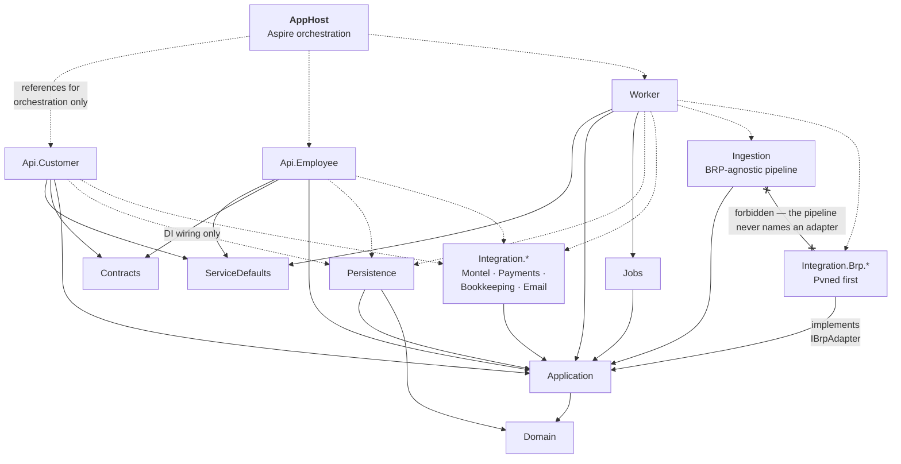

# Solution Structure

The .NET solution layout, the Angular workspace, and the Aspire orchestration that makes the whole
thing runnable with one command — **across two repositories [DEC-55]**.

---

## 1. Repository layout — two repositories [DEC-55]

**[DEC-55] reverses the monorepo assumption this document was written against**, and closes
**[OQ-51]**. .NET and Angular live in separate repositories with separate pipelines and separate
version histories. Three properties that a monorepo gave away free now have to be built and
maintained on purpose — §1.2, §4.3 and §5.1. None of them is hard; all of them are silent when
skipped.

### 1.1 What lives where

```
peakpower-platform/                             # repository 1 — .NET
├── PeakPower.sln
├── Directory.Build.props            # shared: nullable, warnings-as-errors, analyzers
├── Directory.Packages.props         # central package version management
│
├── src/
│   ├── Hosts/
│   │   ├── PeakPower.AppHost/                  # .NET Aspire orchestrator
│   │   ├── PeakPower.ServiceDefaults/          # OTel, health checks, resilience
│   │   ├── PeakPower.Api.Customer/             # portal BFF + customer usage API  [DEC-97]
│   │   ├── PeakPower.Api.Employee/             # back-office API
│   │   ├── PeakPower.Worker/                   # Hangfire host + BRP ingestion webhooks
│   │   ├── PeakPower.Migrator/                 # runs migrations to completion  [§4]
│   │   └── PeakPower.DevStubs/                 # development only  [§4.1]
│   │
│   ├── Core/
│   │   ├── PeakPower.Domain/                   # entities, value objects, invariants
│   │   ├── PeakPower.Application/              # use cases, ports, DTOs
│   │   └── PeakPower.Contracts/                # API request/response contracts
│   │
│   └── Infrastructure/
│       ├── PeakPower.Persistence/              # EF Core, migrations, repositories
│       ├── PeakPower.Infrastructure.Time/      # IMarketCalendar — the ONLY source of "now"
│       ├── PeakPower.Infrastructure.Web/       # the ONE context-provider assembly
│       ├── PeakPower.Infrastructure.Identity/  # IPasswordHasher, ITokenIssuer  [DEC-113] [DEC-117]
│       ├── PeakPower.Infrastructure.Email/     # IEmailSender — console sink in slice 1
│       ├── PeakPower.Ingestion/                # BRP-agnostic pipeline: raw persistence,
│       │                                       # versioning [DEC-07], quarantine  [DEC-69]
│       ├── PeakPower.Integration.Brp.Pvned/    # first BRP adapter — was
│       │                                       # Integration.Pvned  [DEC-69]
│       ├── PeakPower.Integration.Montel/       # wraps PeakPower's own Montel service [DEC-96]
│       ├── PeakPower.Integration.Payments/     # PSP port (unchosen [DEC-86]) + bank-transfer
│       │                                       # reference matching  [DEC-106]
│       ├── PeakPower.Integration.Bookkeeping/  # draft invoices + ledger push; was
│       │                                       # Integration.Odoo  [DEC-88] [DEC-107] [OQ-69]
│       ├── PeakPower.Integration.Email/        # SendGrid — platform notifications only,
│       │                                       # no invoice mail  [DEC-48] [DEC-89]
│       └── PeakPower.Jobs/                     # Hangfire job definitions
│
├── tests/
│   ├── PeakPower.Domain.Tests/                 # unit, incl. property-based
│   ├── PeakPower.Application.Tests/
│   ├── PeakPower.Integration.Tests/            # Testcontainers + real Postgres
│   ├── PeakPower.Architecture.Tests/           # module dependency rules
│   └── PeakPower.AppHost.Tests/                # the orchestration graph itself
│
├── dev-up                                      # one command; repository root, NOT under src/
├── tools/verify-*.sh                           # five guards, run BY HAND — there is no CI
│
├── artifacts/openapi/                          # emitted at build: customer.json, employee.json
└── deploy/
    ├── infra/                                  # Bicep / Terraform — the whole estate
    └── pipelines/
```

**What the 2026-08-19 round did to that list.** Four projects change and one never gets written. The
net effect is that the platform sheds invoicing mechanics and gains an ingestion seam:

| Project | Change | Why |
| --- | --- | --- |
| `PeakPower.Ingestion` | **New** | **[DEC-69]** makes the BRP configurable reference data. Raw-payload persistence, versioning **[DEC-07]** and quarantine are BRP-agnostic and belong to the pipeline, not to PVNed. Cost: one interface seam and a `brp` table now, so that a second adapter is additive later |
| `PeakPower.Integration.Pvned` → `PeakPower.Integration.Brp.Pvned` | **Renamed and narrowed** | **[DEC-69]**. It keeps the PVNed webhook, parser and format-specific validation, and loses everything a second BRP would also need. The `Brp.` segment is what makes an architecture test able to say "the pipeline may not reference any adapter" (§3) |
| ~~`PeakPower.Integration.Surcharges`~~ | **Never written** | ⚠ **Reversed 2026-08-19 by [DEC-73]** — the surcharge tariff table and its resolution order leave the platform. The platform pushes **volume**; the bookkeeping program multiplies it by the topup fee |
| ~~PDF rendering package~~ (QuestPDF or equivalent) | **Never taken** | ⚠ **Reversed 2026-08-19 by [DEC-89]** — the bookkeeping program renders and emails the invoice. No PDF library enters `Directory.Packages.props`, and no project exists to hold one. §7 makes that a standing rule rather than an omission |
| `PeakPower.Integration.Odoo` → `PeakPower.Integration.Bookkeeping` | **Renamed** | **[DEC-88]**, **[DEC-89]**, **[DEC-105]**, **[DEC-108]**, **[DEC-109]** all move work into a program the source names as "Odoo or Moneybird or another program". The concrete adapter is still Odoo-first; the project name stops pretending the choice is made. **[OQ-69]** now gates the first invoice rather than a nice-to-have — see §8 |
| `PeakPower.Api.Customer` | **Grew** | **[DEC-97]** puts a customer usage API in scope. It is a second surface on the same host, not a fourth host: same Entra tenant, same company scoping, same rate limiting, one deployment. A separate host would double the auth and deploy surface for one read model. If **[OQ-95]** lands on file/FTP instead of HTTP, the export job goes in `PeakPower.Jobs` and the API surface stays as it is |

`PeakPower.Migrator` and `PeakPower.DevStubs` were always in §4 and never in this tree; they are listed
now so the two agree.

```
peakpower-web/                                  # repository 2 — Angular 22  [DEC-54]
├── package.json                                # one npm workspace, three apps + one library
├── angular.json
├── .npmrc                                      # private feed for @peakpower-nl/api-client-*
│
├── apps/
│   ├── customer-portal/                        # Angular 22 SPA
│   ├── employee-portal/                        # Angular 22 SPA
│   └── public-site/                            # Angular 22 SSR
├── libs/
│   └── shared-ui/                              # design tokens, layout, pipes, chart wrappers
├── e2e/                                        # Playwright  [see §6]
└── tools/dev-up.*                              # starts the platform repo's AppHost  [§4.3]
```

The specification set (this repository) is a third repository and always was; **[DEC-55]** does not
change it.

⚠ **Amended 2026-09-03. Four infrastructure projects and one test project were missing, and one
of them is named by architecture fact 5.**

- **`Infrastructure.Time`** is required *by name*: the fact is "no type **outside
  `PeakPower.Infrastructure.Time`** reads the system clock", which cannot be written without the
  project existing.
- **`Infrastructure.Web`** is the one context-provider assembly architecture fact 6 allow-lists —
  nothing else may depend on `HttpContext` or `IHttpContextAccessor`.
- **`Infrastructure.Identity`** and **`Infrastructure.Email`** hold the `IPasswordHasher`,
  `ITokenIssuer` and `IEmailSender` adapters, which have no business inside the persistence project.
- **`AppHost.Tests`** exists and is not in any earlier list.

Counted against the solution file rather than against this tree: **thirteen source projects and five
test projects, eighteen in all.** The tree above still names five source projects that slice 1 did
not build — `Worker`, `DevStubs`, `Ingestion`, `Integration.Brp.Pvned`, `Integration.Montel`,
`Integration.Payments`, `Integration.Bookkeeping`, `Integration.Email` and `Jobs` — and they are
kept because they are later slices' work, not because they exist. The count above is of what does.

⚠ **`dev-up` lives at the repository root**, not under `src/`, and there is **no CI in slice 1**:
the five `tools/verify-*.sh` guards are run by hand, by whoever remembers. That is a stated
limitation rather than an oversight — see §6.

### 1.2 Why `deploy/` stays with .NET, and the E2E suite moves

| Artefact | Repository | Reason |
| --- | --- | --- |
| `deploy/infra` | platform | One Azure estate, one source of truth. Splitting IaC across two repositories means two plans racing for one environment, which is worse than either half being inconvenient. The web pipeline consumes its outputs — Static Web App names, Front Door routes — it does not own them **[DEC-56]** |
| `deploy/pipelines` | both | Each repository owns its own build and deploy pipeline; only the *infrastructure* definition is single-homed |
| Playwright E2E | web | The suite drives the browser and asserts on rendered UI. It has to live where the UI it targets is versioned; it runs against a deployed environment, not against a local solution — §6 |
| OpenAPI documents | platform, published to web | §5.1 |

## 2. Project dependencies



**The rule that matters:** `Domain` references nothing. `Application` references only `Domain` and
defines *ports* (interfaces) that infrastructure implements. Hosts reference infrastructure solely to
register it in DI at composition root. An architecture test enforces this.

**The rule [DEC-69] adds:** `Ingestion` depends on the `IBrpAdapter` port in `Application` and on no
adapter assembly. Adapters are selected at the composition root from the `brp` reference row on the
metering point. This is the whole cost of "PVNed is the first BRP, not the only one" — one interface,
one lookup, and an architecture test that fails the build if the pipeline ever reaches for a PVNed
type directly (§3). Without the test the seam closes again within two sprints, silently.

## 3. Module organisation inside Domain and Application

Modules are folders with an enforced dependency graph, not separate projects — the boundary is
maintained by tests rather than by compilation, which keeps refactoring cheap while the domain is
still moving.

```
PeakPower.Domain/
├── Common/                    # Money, MW, MWh, DateRange, EanCode, Result,
│                              # VatRate — one reference rate, read by the trade
│                              # reservation only                             [DEC-78]
├── Identity/                  # Account, IsAdmin                             [DEC-71]
├── Customers/                 # Customer (FourEyesEnabled [DEC-71]), MeteringPoint,
│                              # MeteringPointLabel, ProductionExpectation    [DEC-112]
├── Metering/                  # Brp [DEC-69], IntervalDataVersion, IntervalReading, DataState
├── Market/                    # PeakCalendar, PriceIndication (quote + markup [DEC-80]),
│                              # DayAheadPrice
├── Trading/                   # TradeRequest, Offer, Block, BlockAllocation, TradeEvent,
│                              # FourEyesApproval                             [DEC-71]
├── Wallet/                    # Wallet, WalletEntry, Reservation, Payment,
│                              # DepositIntent [DEC-106], WithdrawalRequest   [DEC-83]
└── Billing/                   # EnergyTaxBracket, EnergyTaxReduction [DEC-74],
                               # Invoice (draft until numbered [DEC-88]), InvoiceLine,
                               # LedgerEntry [DEC-107], Correction            [DEC-99]
```

**What moved on 2026-08-19, and why.** Six of the nine folders changed. Nothing was renumbered and
nothing was deleted from the record — the withdrawn types are listed here so the reason survives the
commit that removes the file:

| Module | Change | Driver |
| --- | --- | --- |
| `Identity/`, `Customers/` | `Account` gains an `IsAdmin` flag and `Customer` gains `FourEyesEnabled` | **[DEC-71]**. ⚠ **Qualifies [DEC-16]** (all accounts identical). Exactly two levels, and the role model exists *only* to make four-eyes expressible — anything richer is scope this round did not buy |
| `Trading/` | ~~`FourEyesThreshold`~~ ⚠ **Reversed 2026-08-19 by [DEC-71]** (was **[DEC-33]**). ~~`FourEyesPolicy`~~ becomes `FourEyesApproval` on the action | **[DEC-71]** closes **[OQ-85]**: there is no threshold, in euros or megawatts, so the threshold reference table is not built and no reference-data screen carries it. Four-eyes is a **per-customer-company mode**; the approving account must be a *different admin of the same company* |
| `Trading/` | The sell path stops validating against confirmed holdings for the period | **[DEC-72]** ⚠ reverses **[DEC-34]**. A short is a promise to deliver, not a spend, so **[AS-11]**'s prepaid wallet does not bound it and **[DEC-41]**'s balance check does not either. No collateral type is modelled because none is decided — **[OQ-94]** |
| `Metering/` | `Brp` is new: credentials, endpoint, document format, adapter key. `MeteringPoint` carries the assignment | **[DEC-69]**. It sits in `Metering/` rather than `Customers/` because it is an ingestion concept; the arch test below already forbids `Metering` → `Trading`/`Billing`/`Wallet`, and this adds no new edge |
| `Customers/` | `ProductionExpectation` gets an owner and a moment: the customer declares it at onboarding | **[DEC-112]**. SJV and profile fractions are a sanity check, not the source. Default stays `UNKNOWN`, still treated as `EXPECTED` for completeness alerting **[F02-R32]** |
| `Wallet/` | `DepositIntent` (platform-issued payment reference) and `WithdrawalRequest` are new. The `INVOICE_DEBIT` entry type goes | **[DEC-106]** makes bank transfer a first-class deposit route with a reference the platform matches on; **[DEC-83]** ⚠ reverses **[DEC-43]** and gives withdrawals a request → approval → manual payout trail. **[DEC-77]** ⚠ reverses **[AS-12]**: the wallet funds trading only, so nothing invoiced is ever debited from it |
| `Billing/` | ~~`Surcharge`~~ ⚠ **Reversed 2026-08-19 by [DEC-73]** | The platform's only margin instrument is the spread on the price it quotes **[DEC-80]**. Volume is pushed; the bookkeeping program multiplies by the topup fee. Closes **[OQ-36]** |
| `Billing/` | ~~`FeedInTariff`~~ ⚠ **Reversed 2026-08-19 by [DEC-87]** (was **[DEC-44]**) | Export is credited raw at the day-ahead price, exactly as surplus is under **[DEC-23]**. `MISSING_FEED_IN_TARIFF` and the month-skip it caused are removed with the type. Closes **[OQ-86]** |
| `Billing/` | `EnergyTaxBracket` + `EnergyTaxReduction` are new; `IEnergyTaxCalculator` is implemented rather than left as a stub | **[DEC-74]** ⚠ reverses **[DEC-24]**. Versioned, editable tier boundaries and €/kWh rates per year, a per-customer reduction or exemption for the minority, calculation per EAN per calendar year on net usage **[DEC-22]**, and a ledger push. Mid-year transfer splits **50% of each bracket** per period **[OQ-77]** — half-and-half, not pro-rata by days. The *vermindering* is not modelled because it is not decided: **[OQ-96]** |
| `Billing/` | ~~`TaxTariff`~~ (per-line VAT) is withdrawn; a single `VatRate` moves to `Common/` | **[DEC-76]** — the platform computes **no VAT at all**; it pushes ex-VAT amounts against a ledger account and the bookkeeping program applies that account's rate. ⚠ **[DEC-64]** survives only as the reference rate, because **[DEC-78]** grosses a trade reservation up by it. `Common/` avoids a `Wallet` → `Billing` edge for one scalar |
| `Billing/` | ~~`TrueUp`~~ becomes `Correction` | **[DEC-99]**: corrections arrive months later and the platform invoices the difference whenever they do, so the annual true-up's mechanism becomes continuous. **[DEC-100]** removes the materiality threshold — every difference is handled individually, so there is no netting or waiver rule to model |

```csharp
// PeakPower.Architecture.Tests
[Fact]
public void Modules_respect_the_dependency_graph()
{
    var result = Types.InAssembly(typeof(Customer).Assembly)
        .That().ResideInNamespace("PeakPower.Domain.Metering")
        .ShouldNot().HaveDependencyOnAny(
            "PeakPower.Domain.Trading",
            "PeakPower.Domain.Billing",
            "PeakPower.Domain.Wallet")
        .GetResult();

    result.IsSuccessful.ShouldBeTrue(
        string.Join(", ", result.FailingTypeNames ?? []));
}

[Fact]
public void Domain_depends_on_nothing_outside_itself()
{
    Types.InAssembly(typeof(Customer).Assembly)
        .ShouldNot().HaveDependencyOnAny("Microsoft.EntityFrameworkCore", "Hangfire", "System.Net.Http")
        .GetResult().IsSuccessful.ShouldBeTrue();
}

// [DEC-69] — the seam that makes a second BRP additive rather than a rewrite.
[Fact]
public void The_ingestion_pipeline_never_names_a_BRP_adapter()
{
    Types.InAssembly(typeof(IngestionPipeline).Assembly)
        .ShouldNot().HaveDependencyOn("PeakPower.Integration.Brp")   // matches Brp.Pvned and any successor
        .GetResult().IsSuccessful.ShouldBeTrue(
            customMessage: "adapters are resolved from the metering point's brp row at the composition root");
}
```

## 4. Aspire AppHost

One command starts everything: Postgres, Redis, storage emulator, all three .NET hosts, all three
Angular dev servers, and the identity provider if self-hosted. **Under [DEC-55] the AppHost starts
three front-ends it does not contain** — §4.3.

```csharp
// PeakPower.AppHost/Program.cs
var builder = DistributedApplication.CreateBuilder(args);

// ── Infrastructure ────────────────────────────────────────────────────
// The superuser password is PINNED, not generated — see the amendment note below.
var postgresPassword = builder.AddParameter(
    "postgres-password", "dev_only_postgres_password", secret: true);

var postgres = builder.AddPostgres("postgres", password: postgresPassword)
    .WithImageTag("17")
    .WithDataVolume("peakpower-postgres-data")   // survives restarts
    .WithHostPort(5432)                          // every host port is pinned
    .WithPgAdmin(pgAdmin => pgAdmin.WithHostPort(5050));

var appDb     = postgres.AddDatabase("peakpower");
var hangfireDb = postgres.AddDatabase("hangfire");

var redis   = builder.AddRedis("redis");
var storage = builder.AddAzureStorage("storage").RunAsEmulator();
var blobs   = storage.AddBlobs("documents");

// ── Migrations run to completion before the APIs start ────────────────
var migrator = builder.AddProject<Projects.PeakPower_Migrator>("migrator")
    .WithReference(appDb)
    .WaitFor(appDb)
    // DOTNET_ENVIRONMENT, not ASPNETCORE_ENVIRONMENT. The Migrator is a GENERIC host and never
    // reads the ASPNETCORE_ prefix; setting the wrong one looks right and does nothing.
    .WithEnvironment("DOTNET_ENVIRONMENT", "Development");

// ── Application hosts ─────────────────────────────────────────────────
var customerApi = builder.AddProject<Projects.PeakPower_Api_Customer>("customer-api")
    .WithReference(appDb).WithReference(redis).WithReference(blobs)
    .WaitForCompletion(migrator);

var employeeApi = builder.AddProject<Projects.PeakPower_Api_Employee>("employee-api")
    .WithReference(appDb).WithReference(redis).WithReference(blobs)
    .WaitForCompletion(migrator);

var worker = builder.AddProject<Projects.PeakPower_Worker>("worker")
    .WithReference(appDb).WithReference(hangfireDb)
    .WithReference(redis).WithReference(blobs)
    .WaitForCompletion(migrator);

// ── Frontends — in a different repository  [DEC-55] ───────────────────
// Resolved, not assumed: config first, sibling checkout second, fail loudly third.
var webRoot = builder.Configuration["PEAKPOWER_WEB_PATH"]
              ?? Path.GetFullPath("../../../../peakpower-web");

if (Directory.Exists(webRoot))
{
    builder.AddJavaScriptApp("customer-portal", webRoot, "start:customer-portal")
        .WithReference(customerApi)
        .WithHttpEndpoint(env: "PORT", port: 4200)
        .WithExternalHttpEndpoints();

    builder.AddJavaScriptApp("employee-portal", webRoot, "start:employee-portal")
        .WithReference(employeeApi)
        .WithHttpEndpoint(env: "PORT", port: 4300)
        .WithExternalHttpEndpoints();
}
else if (args.Contains("--backend-only"))
{
    // Backend-only is a legitimate mode; SILENTLY backend-only is not. Saying it out loud is
    // the whole point of the branch.
    builder.Configuration["PeakPower:FrontEnds"] = "disabled";
}
else
{
    throw new InvalidOperationException(
        $"peakpower-web not found at '{webRoot}'. Clone it beside this repository, set " +
        "PEAKPOWER_WEB_PATH, or run with --backend-only.");
}

// ── Local stand-ins for third parties ─────────────────────────────────
if (builder.Environment.IsDevelopment())
{
    builder.AddProject<Projects.PeakPower_DevStubs>("dev-stubs")
        .WithReference(worker);   // fake BRP pusher [DEC-69], Montel, PSP, bookkeeping
}

builder.Build().Run();
```

```bash
./dev-up                    # the supported entry point — repository root
dotnet run --project src/Hosts/PeakPower.AppHost
```

> ⚠ **Amended 2026-09-03, verified by running the stack rather than by reading it.** Seven things
> were wrong; four of them were found only because `./dev-up` was actually executed, and none of
> them is visible to a test suite whose fixtures seed themselves.
>
> 1. **`AddNpmApp` no longer exists.** `Aspire.Hosting.NodeJs` is frozen at 9.5.2; the current
>    package is `Aspire.Hosting.JavaScript`, which exposes `AddJavaScriptApp`, `AddNodeApp` and
>    `AddViteApp`. The signature is
>    `AddJavaScriptApp(string name, string appDirectory, string runScriptName = "dev")`.
> 2. **The directory was wrong.** The workspace declares exactly **one** `package.json`, at the
>    root, so there is no script to run inside `apps/<name>`. The call passes the workspace root
>    and a per-app script name instead — which is why `package.json` defines
>    `start:customer-portal` and `start:employee-portal` at the root rather than `start` in each
>    app.
> 3. **`public-site` is not built in slice 1** and its resource is dropped until it is.
> 4. **The `--backend-only` flag was promised and nothing implemented it.** The `else` branch threw
>    while naming a flag no code read. It is now a real gate.
> 5. **The postgres superuser password is PINNED, not generated.** A generated password plus a
>    named data volume is a trap by construction: Postgres reads `POSTGRES_PASSWORD` **only** when
>    it initialises an empty data directory, so the volume remembers the first password forever and
>    every later value is rejected on every connection. The failure has no diagnostic anywhere a
>    developer looks — the migrator, both APIs and both front ends all `WaitFor` the database's
>    health check, so every one of them sits in *Waiting* indefinitely while the only evidence is a
>    line inside the container's own log. Pinning removes the failure instead of reporting it.
>    Hardcoding is deliberate and bounded: slice 1 has no deployment, nothing here is reachable from
>    outside localhost, and the same reasoning already applies to the RLS login passwords
>    **[OQ-102]**.
> 6. **Every host port is pinned** — postgres **5432**, pgAdmin **5050**, customer-api **5101**,
>    employee-api **5102**, customer-portal **4200**, employee-portal **4300**. Aspire otherwise
>    assigns a fresh host port per run, which makes a bookmark, a saved pgAdmin connection or an
>    E2E base URL wrong as soon as the stack restarts. (`docker ps` still shows a random port
>    because Aspire proxies; `localhost:5432` is the stable address.)
> 7. **The Migrator needs `DOTNET_ENVIRONMENT=Development`.** It is a generic host
>    (`Host.CreateApplicationBuilder`) and never reads the `ASPNETCORE_` prefix the two APIs are
>    given, and Aspire launches projects with `--no-launch-profile`, so nothing had ever set it.
>    **Consequence, and it is the largest of the seven: the demo seed had never once run, on any
>    `dev-up`.** The Production gate declined correctly on every single run. The symptom was not an
>    error — migrations applied, every resource went green, and `dev-up` handed over an **empty
>    schema**, so the six demo companies, their connections and the unclaimed EAN pool the whole
>    demo is built around were simply absent. The gate was right; nothing had ever told it this is
>    a developer's machine.
>
> **`dev-up` also carries a watchdog** for a data volume left over from before the password was
> pinned. It watches the postgres container's log for `password authentication failed for user`,
> prints the remedy with the exact `docker volume rm` command, and stops the host. It lives in
> `dev-up` rather than in the AppHost because the AppHost is what hangs, and because a hosted
> service registered on `DistributedApplicationBuilder.Services` **never starts** — established by
> build marker, not assumed, and the C# attempt was deleted rather than left in: a guard that
> provably never fires is worse than none, because it reads as coverage.
>
> **Aspire is also no longer a `dotnet workload`.** It is the `aspire.cli` global tool plus the
> `Aspire.AppHost.Sdk` NuGet package, currently **13.5.3**. Install with
> `dotnet tool install -g aspire.cli`.

### 4.1 Why the dev stubs matter

Most of the integrations are third parties PeakPower does not control, and at least one (PVNed) may
not offer a usable test environment — **[OQ-05]** is still open on that, and **[DEC-69]** does not
close it. A `DevStubs` project that can push a realistic `TimeSeriesDocument` on demand — including
corrections, DST days and malformed payloads — is what makes
[F02](../10-features/F02-metering-data-ingestion.md) testable at all. It is not a nice to have; it is
on the critical path for phase 1.

It should be able to generate:

- a normal 96-interval day for a set of EANs, with a plausible load shape;
- 92- and 100-interval DST days;
- a correction that supersedes a previous document;
- reconciliation data arriving after the 10-working-day window **[DEC-98]**, which is what makes a
  late correction invoice **[DEC-99]** reproducible locally instead of only in production;
- an imbalance report matching the supplied sample;
- deliberately invalid documents for each validation rule.

It pushes **as a configured BRP**, not as "PVNed" **[DEC-69]** — the stub authenticates against a
`brp` row and its document is routed through the adapter that row names. A stub wired straight into
the pipeline would test the pipeline and leave the seam unexercised, which is the failure mode where
the second adapter turns out to be a rewrite.

### 4.2 ServiceDefaults

Shared by all three hosts: OpenTelemetry (traces, metrics, logs), health check endpoints, HTTP
resilience handlers with standard retry and circuit-breaker policies, and service discovery.

### 4.3 One command, across two repositories — [DEC-55]

**"One command brings up the whole system" was free in a monorepo. It is now a maintained property**,
and it is worth maintaining: it is the thing that makes a new developer productive on day one and
makes the dev stubs (§4.1) usable at all.

| Option | Verdict |
| --- | --- |
| **Sibling checkout, path from configuration** | **Chosen.** `PEAKPOWER_WEB_PATH`, defaulting to `../peakpower-web`. Zero coupling between the repositories, no pinned commit, and each side is free to move. Costs one convention that has to be written down — which is what this section is |
| Git submodule | Rejected. It pins the web repository to a commit inside the .NET repository, which reintroduces exactly the coupling **[DEC-55]** removes, and does it in the form developers are worst at operating |
| Front-ends as prebuilt container images in the AppHost | Rejected for development — no hot reload, and a stale image is indistinguishable from a bug. Kept as the option for *demo* environments, where a pinned version is the point |

Three rules make it hold:

1. **`dev-up` exists in both repositories and does the same thing.** In `peakpower-platform` it checks
   for the sibling checkout and runs the AppHost; in `peakpower-web` it does the same in reverse and
   then `npm start`. Whichever repository a developer cloned first, one command works.
2. **A missing sibling fails loudly.** The AppHost throws with the path it looked in and the two ways
   to fix it. Backend-only is an explicit `--backend-only` flag, never an accident — an AppHost that
   silently starts three of six resources is how an afternoon disappears.
3. **The AppHost never builds the front-ends.** `AddNpmApp` runs `npm start` in a tree it does not
   own; installing dependencies and generating clients belong to the web repository's own scripts.

```bash
# either repository, same result
./dev-up
```

## 5. Angular workspace — Angular 22 [DEC-54]

Three applications and one shared library, in `peakpower-web` **[DEC-55]**. **Angular 22 for all
three [DEC-54]** — one version across the workspace, upgraded together; three applications on three
versions of the framework is three sets of migration notes for one team.

```
peakpower-web/
├── libs/shared-ui/              # design tokens (from peakpower.nl [DEC-94]), layout, table,
│                                # form controls, money & energy pipes, auth interceptor,
│                                # chart wrappers — the wrapped library may be commercial [DEC-79]
├── apps/customer-portal/
│   └── src/app/
│       ├── core/                # auth (MFA required [DEC-92]), http, error handling, signalr
│       ├── features/
│       │   ├── dashboard/  metering-points/  consumption/
│       │   ├── prices/          # current curve only, no history, no export  [DEC-81]
│       │   ├── trading/         # buy and sell; sell is not holdings-checked  [DEC-72]
│       │   ├── wallet/          # iDEAL + bank transfer with the issued reference [DEC-106],
│       │   │                    # withdrawal requests [DEC-83], four-eyes approvals [DEC-71]
│       │   └── invoices/        # calculated data + the number the bookkeeping program
│       │                        # returned; no PDF from the platform  [DEC-88] [DEC-89]
│       └── shared/
├── apps/employee-portal/
│   └── src/app/features/
│       ├── home/  trade-desk/  customers/  data-health/  admin/
│       ├── wallets/             # deposits, matched bank transfers, withdrawal payouts
│       ├── invoicing/           # review and push drafts; the number comes back  [DEC-88]
│       └── reference-data/      # BRPs [DEC-69], energiebelasting brackets and per-customer
│                                # reductions [DEC-74], price markup % [DEC-80], ledger
│                                # accounts and tax codes  [DEC-107]
└── apps/public-site/            # SSR, content as files in the repository — no CMS  [DEC-93]
```

⚠ Two reference-data screens the earlier rounds implied are **not** built: the surcharge tariff table
(⚠ **Reversed 2026-08-19 by [DEC-73]**) and the four-eyes threshold table (⚠ **Reversed 2026-08-19 by
[DEC-71]** — four-eyes is a flag on the customer company, edited on the customer screen, not a
reference table).

Conventions: standalone components throughout, signals for state, lazy-loaded feature routes,
strictly typed reactive forms, and generated API clients — now consumed as a published package
rather than generated in place, §5.1.

**[DEC-54] settles the framework version and not the component library.** [OQ-49]'s second half is
still open. ~~**[DEC-39]** — open-source and free, or built in-house — is the constraint to expect
there too.~~ ⚠ **Reversed 2026-08-19 by [DEC-79]**: a commercial licence is acceptable and the
library is judged on fit. This widens the shortlist for both the charting spike and the component
library, and it moves the question from engineering to procurement — a per-seat or per-build licence
has to be bought, held somewhere a build agent can read it, and renewed. §7 carries the rule.

### 5.1 The OpenAPI client now crosses a repository boundary — [DEC-55]

This is the consequence of **[DEC-55]** with real cost attached, because it removes a property this
document previously claimed outright: *"a backend contract change breaks the frontend build rather
than production"*. In one repository that was true by construction — one commit, one build, one
failure. Across two it is **false by default**: the .NET repository can merge a breaking contract
change and stay green, and the web repository will keep building against the client it already has
until someone bumps it.

**The pipeline step that replaces the property:**

| Step | Where | What |
| --- | --- | --- |
| 1 · Emit | platform CI | The two OpenAPI documents are produced at build time into `artifacts/openapi/`. The existing contract-snapshot test (§6) already fails the build on an unreviewed change |
| 2 · Generate | platform CI | `@peakpower-nl/api-client-customer` and `@peakpower-nl/api-client-employee` are generated from those documents |
| 3 · Publish | platform CI, on merge to `main` | Both packages published to a private feed (Azure Artifacts or GitHub Packages), versioned `<api-version>-<build>` with semver rules: a breaking OpenAPI change is a **major** |
| 4 · Consume | web repo | `npm install` from the lockfile. A version bump is a normal, reviewable pull request that either compiles or does not |

⚠ **Amended 2026-09-03 by [DEC-116] and [OQ-100].** The scope is **`@peakpower-nl/`**, not
`@peakpower/` — GitHub Packages requires the scope to match the owner, and the organisation exists as
`peakpower-nl`. The feed is **GitHub Packages**. And **none of the four steps above runs in slice 1**:
there is **no CI in either repository**, so "platform CI" describes nobody. What shipped is the
Alternative below, minus the automation: the clients are committed npm **workspace packages**, which
resolve by the `name` field rather than by registry scope, so every import works with no registry and
keeps working unchanged the day they are published. The property step 1 was there to protect is held
by a **staleness check** that regenerates and fails on a non-empty diff — and it is real only because
it runs inside the web workspace's own `npm test`, not as a script somebody remembers.

**Alternative, if a private package feed is not available:** generate the clients in platform CI and
open an automated pull request that commits them into `peakpower-web`. It is uglier and it works —
the generated code is reviewable in the diff, and the bump is still a pull request. What is **not**
acceptable is each developer generating clients locally: that is a build that differs per machine.

**Restoring the safety net.** Three cheap mechanisms, because none of them alone is the monorepo:

1. **Semver is enforced, not advisory.** A breaking OpenAPI diff bumps the major version, so a
   consuming build cannot pick it up silently.
2. **A nightly integration build** in `peakpower-web` compiles the applications against the *latest*
   published client and runs the E2E suite against a Dev environment built from both `main`s. It is
   allowed to fail; it is not allowed to fail unnoticed.
3. **The E2E suite is the backstop** (§6), and it is the reason the suite lives with the UI rather
   than with the API.

⚠ **The window between merge and bump is real and cannot be engineered away** — it can only be made
short and visible. That is the price of **[DEC-55]** and it should be paid knowingly rather than
discovered in production.

## 6. Testing strategy

| Layer | What | Tooling |
| --- | --- | --- |
| **Domain unit** | Invariants, state transitions, block maths, ledger arithmetic | xUnit + **Shouldly 4.3.0** **[DEC-118]** |
| **Property-based** | Calendar arithmetic (DST, peak counts, interval counts), allocation rounding, ledger balance identity | FsCheck |
| **Application** | Use cases against in-memory ports | xUnit + NSubstitute |
| **Persistence** | Real PostgreSQL, real migrations, constraint behaviour | Testcontainers |
| **Integration** | Ingestion end-to-end with sample payloads; webhook idempotency; the same document routed through the BRP adapter its `brp` row names **[DEC-69]**; bank-transfer deposit matched on the issued reference **[DEC-106]** | Testcontainers + WireMock |
| **Architecture** | Module graph, domain purity, no `DateTime.Now` outside the calendar service, **and the ingestion pipeline naming no BRP adapter [DEC-69]** | NetArchTest |
| **API contract** | OpenAPI snapshot to catch breaking changes — **and the trigger for the client publish [DEC-55]**, §5.1 | Verify |
| **Cross-repo client** | ~~Applications compile against the *latest published* client, nightly~~ ⚠ **Corrected 2026-09-03: there is nothing published and no nightly, because there is no CI and no registry [DEC-116].** What exists instead is a **staleness check** — regenerate the client from the committed `artifacts/openapi/customer.json`, fail if the diff is non-empty — and the thing that makes it real is that it runs inside the web workspace's own `npm test`, not as a script somebody remembers. It bites: renaming an enum member in the platform's frozen contract without regenerating turns `test:workspace` red **while all 491 customer-portal tests stay green**, because they type against the stale schema and mock HTTP | npm + tsc |
| **E2E** | ~~Login with MFA **[DEC-92]**~~ (⚠ there is no MFA — **[DEC-119]**), login, request a trade, accept an offer, **approve it as a second admin account of the same company with four-eyes on [DEC-71]**, view the ledger, raise a withdrawal request **[DEC-83]**. Lives in `peakpower-web` **[DEC-55]**, runs against a deployed environment | Playwright |
| **Frontend unit** | Components, pipes, signal stores | Vitest |

> ⚠ **Pin Shouldly 4.3.0. FluentAssertions may not be used, at any version** (added 2026-09-03,
> **[DEC-118]**). FluentAssertions 8.10.0 ships an **Xceed Software Community License Agreement,
> "for Non-Commercial Use"**, where non-commercial means use whose primary objective is not
> commercial advantage. PeakPower is a commercial trading platform, so 8.x would need a paid Xceed
> licence, and 7.2.0 — the last `Apache-2.0` release — is the end of that line. **Shouldly 4.3.0 is
> Apache-2.0 and actively maintained**, so it replaces the library outright rather than pinning a
> frozen branch. The table was written when FluentAssertions was still open source.
>
> ⚠ **Shouldly's `ShouldContain` is case-insensitive by default.** That has already let three
> assertions in this codebase pass against the wrong value — including one in a guard written
> specifically to catch silent no-ops. An assertion on a key, a property name or a wire token must
> say `Case.Sensitive` or read the structured value rather than the rendered body.

> ⚠ **There is no CI in slice 1, in either repository** (added 2026-09-03). Neither
> `peakpower-platform` nor `peakpower-web` has a `.github/` directory. On the platform side the five
> `tools/verify-*.sh` guards — `verify-aspire-api`, `verify-build-settings`, `verify-migrator`,
> `verify-repositories`, `verify-solution-layout` — are run **by hand**, by whoever remembers, and
> nothing fails a merge if they are not. On the web side the picture is better and deliberately so:
> the cross-repo staleness check was moved *into* `npm test` precisely because a guard nobody runs
> is not a guard. Both repositories are published privately under the **`peakpower-nl`**
> organisation and pushed; **no CI, no package registry, no deployment** is a slice-1 scope
> decision, and it is what makes the two dev-up defects above discoverable only by running the
> stack.

### 6.1 Tests that must exist before phase 2 ships

These are the ones where a bug is expensive and silent:

1. Accepting the same offer twice creates exactly one reservation.
2. Accepting at the instant of expiry produces exactly one deterministic outcome.
3. A failed trade releases exactly the reserved amount, no more, no less.
4. Ledger balance always equals the sum of entry deltas, after any sequence of operations.
5. Available balance never goes negative through a customer action.
6. Block allocations sum exactly to the block power for any split and any rounding — **at 0,01 MW
   granularity** **[DEC-70]**, which is ten times finer than the case originally written and brings
   the non-whole-MW tail back.
7. Peak interval counts match the reference table for every month of three years.
8. A day with 92 or 100 intervals is stored, aggregated and charted correctly.
9. **The accepting account cannot approve its own acceptance** ~~**[DEC-33]**~~ ⚠ **Amended
   2026-08-19 by [DEC-71]**, **[F05-R59]**. The test now has three cases, because the rule is a
   per-company mode rather than a value threshold: with four-eyes **off** the trade executes on one
   account; with it **on**, the accepting account's own approval is refused, and approval by a
   **non-admin** account of the same company is refused. In every refusal the trade stays in
   `AWAITING_APPROVAL` and **no reservation is settled** — because the failure mode is not an error
   message, it is a large trade that quietly went through on one person's say-so. Requested by
   [F05](../10-features/F05-energy-block-trading.md) §3.2.
10. **A trade left in `AWAITING_APPROVAL` at `expires_at` expires and releases its reservation in
    full** **[F05-R62]**. The same shape as test 3, on the state that did not exist when test 3 was
    written — and the one that leaks money silently if the expiry job's filter or the partial index
    misses it ([Database design §3.4.1](04-database-design.md)).
11. ~~**The surcharge is charged per kWh with no `/1000`** **[DEC-35]**. A rate agreed before the unit
    change invoices to the same money after it: €4.50/MWh and €0.0045/kWh produce the identical
    amount on the identical volume. An engine that keeps the divisor bills a thousandth of the
    correct figure and looks entirely plausible doing it.~~ ⚠ **Reversed 2026-08-19 by [DEC-73]** —
    there is no surcharge in the platform to test. Replaced by test 14: the same money-by-a-factor-of-
    a-thousand failure now lives in the energiebelasting calculator, which is the only €/kWh rate
    left.
12. ~~**The migration divides, it does not reinterpret** **[F09-R12]**. Run against a dataset seeded
    with pre-**[DEC-35]** €/MWh rates, asserting both the value and the surviving precision:
    `4.5500` → `0.0045500`, not `0.0046` and not `4.5500000`.~~ ⚠ **Retired 2026-08-19 by
    [DEC-73]** — the surcharge tariff table never ships, so there is no unit migration to run and
    **[F09-R12]** has nothing to migrate. Nothing replaces it.
13. ~~**A month with export and no resolving feed-in tariff is skipped, never valued at zero**
    **[DEC-44]**, **[F10-R39]**. The fallback is an open question **[F09]** §11.1; this test is what
    stops it being answered by accident, in code, by whoever writes the resolver first.~~ ⚠
    **Reversed 2026-08-19 by [DEC-87]** — there is no feed-in tariff to fail to resolve. Replaced by
    test 15: export is credited at the day-ahead price for the interval, raw.
14. **Energiebelasting is charged per kWh, and a mid-year transfer gets 50% of each bracket**
    **[DEC-74]**, **[OQ-77]**. Two assertions in one place because they fail the same way. First,
    the rate is €/kWh with no `/1000` — an engine that keeps a divisor bills a thousandth of the
    correct figure and looks entirely plausible doing it. Second, an EAN that changes customer on
    17 August gives **each** period half of every annual tier boundary — a straight half-and-half
    split, not a pro-rata by days, and not the full brackets twice. The second bug reads as a
    rounding difference on one invoice and as tens of thousands of euros across a portfolio.
15. **Export is credited at the day-ahead price for the interval, raw** **[DEC-87]**, **[DEC-23]**.
    No topup, no feed-in fee, no spread. The test asserts the credited amount equals
    `volume × day_ahead_price` to the stored precision, and that no tariff lookup happens at all.
16. **A sell is accepted without a holdings check, and refused for nothing else** **[DEC-72]**. The
    customer holds nothing for the period and the sell goes through. ⚠ The test also **documents the
    hole**: no collateral or exposure limit is asserted, because none is decided — **[OQ-94]**. It
    is written as a failing-by-design assertion the day OQ-94 is answered.
17. **A bank-transfer deposit credits the wallet exactly once for its reference** **[DEC-106]**. The
    same payment replayed on the feed, and two payments carrying the same reference, both resolve to
    one credit. IBAN matching **[DEC-61]** is the fallback when the reference is missing, and a
    payment matching neither is held, never credited to the nearest customer.

Tests 9–17 come from the second and third decision rounds. They earn their place the same way the
first eight do: each one fails silently in production and shows up as money.

## 7. Coding standards

| Rule | Rationale |
| --- | --- |
| `<Nullable>enable</Nullable>`, `<TreatWarningsAsErrors>true</TreatWarningsAsErrors>` | Cheap correctness |
| No `DateTime.Now` / `DateTime.UtcNow` outside `IClock`; no date arithmetic outside `IMarketCalendar` | Enforced by an architecture test. This is the single highest-value rule in the codebase |
| `decimal` for all money and energy; `double` banned in domain code | **[AS-20]** |
| Value objects for `Money`, `Mw`, `MWh`, `EanCode`, `DateRange` | Makes unit and currency errors compile-time failures |
| `Result<T>` for expected failures; exceptions only for the unexpected | Business rejections are not exceptional |
| Async everywhere, `CancellationToken` threaded through | |
| Central package management | One version of everything |
| **Packages are judged on fit, not on licence cost. A commercial licence is acceptable** | ~~**[DEC-39]** — open-source and free, or in-house~~ ⚠ **Reversed 2026-08-19 by [DEC-79]**. What replaces the old rule is not "anything goes": a paid package needs a licence bought before the spike ends, a key the build agent can read from Key Vault rather than a developer's machine, and a renewal date someone owns. The rule that survives unchanged is that no package may be used under a licence whose terms have not been read |
| **No PDF rendering package, in any project** | **[DEC-89]** — the bookkeeping program renders and emails the invoice **[DEC-88]**, so nothing on the invoice path needs one. This is written as a standing rule rather than left as an omission because a PDF library is exactly the dependency that arrives quietly for something small and takes invoice branding back into the platform with it. ⚠ One caller survives the round untouched: **[F06-R22]** offers the wallet ledger as CSV **and PDF**. Under this rule that export is CSV-only unless someone re-opens the dependency on purpose, with the licence and the renewal owner from the row above |

## 8. Open questions

| Ref | Question |
| --- | --- |
| [OQ-49] | Angular component library. **Half-closed:** **[DEC-54]** settles the framework at **Angular 22**; the component library is still open. ⚠ **Amended 2026-08-19:** ~~**[DEC-39]**'s free-or-in-house constraint should be expected to apply here too~~ — **[DEC-79]** reverses it, so a commercial library is in scope for both this and the charting spike, and the shortlist is wider than it was |
| ~~[OQ-51]~~ | ~~Monorepo for both .NET and Angular, or separate repositories?~~ **Closed by [DEC-55]** — separate repositories. The three consequences are designed for in §1.2, §4.3 and §5.1 |
| ~~[OQ-52]~~ | ~~Does PeakPower have existing .NET conventions or shared libraries to align with — in particular the existing Montel implementation?~~ **Closed by [DEC-96]** — there are conventions, and there is a Montel service Luka built. `PeakPower.Integration.Montel` wraps that service rather than the Montel API. ⚠ The estimate is not firm until its shape and location have been read, which is work, not a question |
| [OQ-05] | Does PVNed offer a usable test environment? Still open, and **[DEC-69]** does not close it — a configurable BRP changes who the adapter talks to, not whether the first one has a sandbox. `DevStubs` (§4.1) remains the mitigation |
| [OQ-69] | Which bookkeeping program, which version, which API? ⚠ **Re-prioritised to 🔴 P1 on 2026-08-19.** **[DEC-88]**, **[DEC-89]**, **[DEC-105]**, **[DEC-108]** and **[DEC-109]** move numbering, the PDF, the email, payment matching and customer records into that program, and **[DEC-74]** and **[DEC-107]** add the energiebelasting ledger account to it. `PeakPower.Integration.Bookkeeping` cannot be written against an unnamed target, and without it **no customer invoice can be issued at all** |
| [OQ-93] | Which incoming-payment feed does the platform consume for wallet deposits — CAMT.053 import, a PSP webhook, or a SEPA-instant push? It decides what `PeakPower.Integration.Payments` contains, and it blocks the bank-transfer deposit route **[DEC-106]** |
| [OQ-95] | Is customer usage delivered over an API, over file/FTP, or both **[DEC-97]**? HTTP costs a surface on `PeakPower.Api.Customer`; FTP costs a scheduled export in `PeakPower.Jobs` and a place to put the files. Both is both. Nothing else in the layout moves either way |
| [OQ-94] | What collateral or exposure limit applies to a short position **[DEC-72]**? It decides whether `Domain/Trading` gains an exposure concept or the sell path stays as thin as it is today. Test 16 (§6.1) is written to fail the day this is answered |
| ~~*(new, from **[DEC-55]**)*~~ | ~~Which private package feed hosts `@peakpower/api-client-*` — Azure Artifacts or GitHub Packages?~~ **Closed by [DEC-116]** — GitHub Packages, and the scope is `@peakpower-nl/` because GitHub Packages requires the scope to match the owner (`[OQ-100]`, resolved). ⚠ **Publishing is out of scope for slice 1**, so the fallback is what shipped: committed npm **workspace packages**, which resolve by the `name` field rather than by registry scope, so every import works today with no registry and keeps working unchanged the day they are published |
