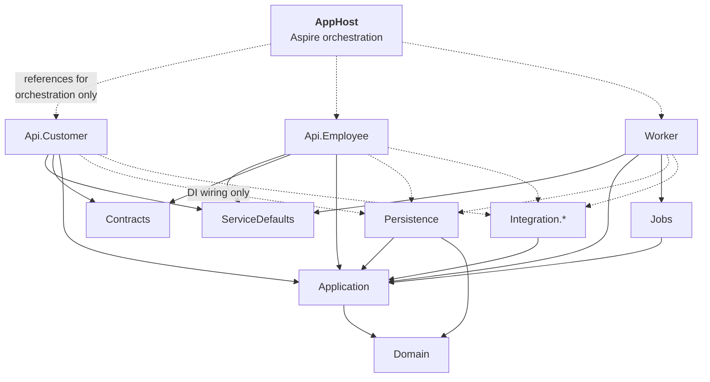

# Solution Structure

The .NET solution layout, the Angular workspaces, and the Aspire orchestration that makes the whole
thing runnable with one command.

---

## 1. Repository layout

```
peakpower/
├── PeakPower.sln
├── Directory.Build.props            # shared: nullable, warnings-as-errors, analyzers
├── Directory.Packages.props         # central package version management
│
├── src/
│   ├── Hosts/
│   │   ├── PeakPower.AppHost/                  # .NET Aspire orchestrator
│   │   ├── PeakPower.ServiceDefaults/          # OTel, health checks, resilience
│   │   ├── PeakPower.Api.Customer/             # customer-facing API
│   │   ├── PeakPower.Api.Employee/             # back-office API
│   │   └── PeakPower.Worker/                   # Hangfire host + ingestion webhooks
│   │
│   ├── Core/
│   │   ├── PeakPower.Domain/                   # entities, value objects, invariants
│   │   ├── PeakPower.Application/              # use cases, ports, DTOs
│   │   └── PeakPower.Contracts/                # API request/response contracts
│   │
│   ├── Infrastructure/
│   │   ├── PeakPower.Persistence/              # EF Core, migrations, repositories
│   │   ├── PeakPower.Integration.Pvned/
│   │   ├── PeakPower.Integration.Montel/
│   │   ├── PeakPower.Integration.Payments/
│   │   ├── PeakPower.Integration.Odoo/
│   │   ├── PeakPower.Integration.Email/
│   │   └── PeakPower.Jobs/                     # Hangfire job definitions
│   │
│   └── Web/
│       ├── customer-portal/                    # Angular workspace
│       ├── employee-portal/                    # Angular workspace
│       ├── public-site/                        # Angular workspace (SSR)
│       └── shared-ui/                          # shared Angular library
│
├── tests/
│   ├── PeakPower.Domain.Tests/                 # unit, incl. property-based
│   ├── PeakPower.Application.Tests/
│   ├── PeakPower.Integration.Tests/            # Testcontainers + real Postgres
│   ├── PeakPower.Architecture.Tests/           # module dependency rules
│   └── PeakPower.E2E.Tests/                    # Playwright
│
├── specs/                                      # this specification set
└── deploy/
    ├── infra/                                  # Bicep / Terraform
    └── pipelines/
```

## 2. Project dependencies



**The rule that matters:** `Domain` references nothing. `Application` references only `Domain` and
defines *ports* (interfaces) that infrastructure implements. Hosts reference infrastructure solely to
register it in DI at composition root. An architecture test enforces this.

## 3. Module organisation inside Domain and Application

Modules are folders with an enforced dependency graph, not separate projects — the boundary is
maintained by tests rather than by compilation, which keeps refactoring cheap while the domain is
still moving.

```
PeakPower.Domain/
├── Common/                    # Money, MW, MWh, DateRange, EanCode, Result
├── Identity/
├── Customers/                 # Customer, MeteringPoint, MeteringPointLabel
├── Metering/                  # IntervalDataVersion, IntervalReading, DataState
├── Market/                    # PeakCalendar, PriceIndication, DayAheadPrice
├── Trading/                   # TradeRequest, Offer, Block, BlockAllocation, TradeEvent
├── Wallet/                    # Wallet, WalletEntry, Reservation, Payment
└── Billing/                   # Surcharge, Invoice, InvoiceLine, TaxTariff, TrueUp
```

```csharp
// PeakPower.Architecture.Tests
[Fact]
public void Modules_respect_the_dependency_graph()
{
    var result = Types.InAssembly(typeof(Customer).Assembly)
        .That().ResideInNamespace("PeakPower.Domain.Metering")
        .ShouldNot().HaveDependencyOnAny(
            "PeakPower.Domain.Trading",
            "PeakPower.Domain.Billing",
            "PeakPower.Domain.Wallet")
        .GetResult();

    result.IsSuccessful.Should().BeTrue(
        because: string.Join(", ", result.FailingTypeNames ?? []));
}

[Fact]
public void Domain_depends_on_nothing_outside_itself()
{
    Types.InAssembly(typeof(Customer).Assembly)
        .ShouldNot().HaveDependencyOnAny("Microsoft.EntityFrameworkCore", "Hangfire", "System.Net.Http")
        .GetResult().IsSuccessful.Should().BeTrue();
}
```

## 4. Aspire AppHost

One command starts everything: Postgres, Redis, storage emulator, all three .NET hosts, all three
Angular dev servers, and the identity provider if self-hosted.

```csharp
// PeakPower.AppHost/Program.cs
var builder = DistributedApplication.CreateBuilder(args);

// ── Infrastructure ────────────────────────────────────────────────────
var postgres = builder.AddPostgres("postgres")
    .WithDataVolume()                 // survives restarts
    .WithPgAdmin();

var appDb     = postgres.AddDatabase("peakpower");
var hangfireDb = postgres.AddDatabase("hangfire");

var redis   = builder.AddRedis("redis");
var storage = builder.AddAzureStorage("storage").RunAsEmulator();
var blobs   = storage.AddBlobs("documents");

// ── Migrations run to completion before the APIs start ────────────────
var migrator = builder.AddProject<Projects.PeakPower_Migrator>("migrator")
    .WithReference(appDb)
    .WaitFor(appDb);

// ── Application hosts ─────────────────────────────────────────────────
var customerApi = builder.AddProject<Projects.PeakPower_Api_Customer>("customer-api")
    .WithReference(appDb).WithReference(redis).WithReference(blobs)
    .WaitForCompletion(migrator);

var employeeApi = builder.AddProject<Projects.PeakPower_Api_Employee>("employee-api")
    .WithReference(appDb).WithReference(redis).WithReference(blobs)
    .WaitForCompletion(migrator);

var worker = builder.AddProject<Projects.PeakPower_Worker>("worker")
    .WithReference(appDb).WithReference(hangfireDb)
    .WithReference(redis).WithReference(blobs)
    .WaitForCompletion(migrator);

// ── Frontends ─────────────────────────────────────────────────────────
builder.AddNpmApp("customer-portal", "../../Web/customer-portal", "start")
    .WithReference(customerApi)
    .WithHttpEndpoint(env: "PORT")
    .WithExternalHttpEndpoints();

builder.AddNpmApp("employee-portal", "../../Web/employee-portal", "start")
    .WithReference(employeeApi)
    .WithHttpEndpoint(env: "PORT")
    .WithExternalHttpEndpoints();

builder.AddNpmApp("public-site", "../../Web/public-site", "start")
    .WithHttpEndpoint(env: "PORT")
    .WithExternalHttpEndpoints();

// ── Local stand-ins for third parties ─────────────────────────────────
if (builder.Environment.IsDevelopment())
{
    builder.AddProject<Projects.PeakPower_DevStubs>("dev-stubs")
        .WithReference(worker);   // fake PVNed pusher, Montel, PSP, Odoo
}

builder.Build().Run();
```

```bash
dotnet run --project src/Hosts/PeakPower.AppHost
```

### 4.1 Why the dev stubs matter

Three of the four integrations are third parties PeakPower does not control, and at least one
(PVNed) may not offer a usable test environment **[OQ-05]**. A `DevStubs` project that can push a
realistic `TimeSeriesDocument` on demand — including corrections, DST days and malformed payloads —
is what makes [F02](../10-features/F02-metering-data-ingestion.md) testable at all. It is not a nice
to have; it is on the critical path for phase 1.

It should be able to generate:

- a normal 96-interval day for a set of EANs, with a plausible load shape;
- 92- and 100-interval DST days;
- a correction that supersedes a previous document;
- an imbalance report matching the supplied sample;
- deliberately invalid documents for each validation rule.

### 4.2 ServiceDefaults

Shared by all three hosts: OpenTelemetry (traces, metrics, logs), health check endpoints, HTTP
resilience handlers with standard retry and circuit-breaker policies, and service discovery.

## 5. Angular workspaces

Three applications and one shared library.

```
Web/
├── shared-ui/                   # design tokens, layout, table, form controls,
│                                # money & energy pipes, chart wrappers, auth interceptor
├── customer-portal/
│   └── src/app/
│       ├── core/                # auth, http, error handling, signalr
│       ├── features/
│       │   ├── dashboard/  metering-points/  consumption/
│       │   ├── prices/     trading/          wallet/        invoices/
│       └── shared/
├── employee-portal/
│   └── src/app/features/
│       ├── home/  trade-desk/  customers/  wallets/
│       ├── invoicing/  data-health/  reference-data/  admin/
└── public-site/                 # SSR
```

Conventions: standalone components throughout, signals for state, lazy-loaded feature routes,
strictly typed reactive forms, generated API clients from the OpenAPI documents (so a backend
contract change breaks the frontend build rather than production).

## 6. Testing strategy

| Layer | What | Tooling |
| --- | --- | --- |
| **Domain unit** | Invariants, state transitions, block maths, ledger arithmetic | xUnit + FluentAssertions |
| **Property-based** | Calendar arithmetic (DST, peak counts, interval counts), allocation rounding, ledger balance identity | FsCheck |
| **Application** | Use cases against in-memory ports | xUnit + NSubstitute |
| **Persistence** | Real PostgreSQL, real migrations, constraint behaviour | Testcontainers |
| **Integration** | Ingestion end-to-end with sample payloads; webhook idempotency | Testcontainers + WireMock |
| **Architecture** | Module graph, domain purity, no `DateTime.Now` outside the calendar service | NetArchTest |
| **API contract** | OpenAPI snapshot to catch breaking changes | Verify |
| **E2E** | Login, request a trade, accept an offer, view the ledger | Playwright |
| **Frontend unit** | Components, pipes, signal stores | Vitest |

### 6.1 Tests that must exist before phase 2 ships

These are the ones where a bug is expensive and silent:

1. Accepting the same offer twice creates exactly one reservation.
2. Accepting at the instant of expiry produces exactly one deterministic outcome.
3. A failed trade releases exactly the reserved amount, no more, no less.
4. Ledger balance always equals the sum of entry deltas, after any sequence of operations.
5. Available balance never goes negative through a customer action.
6. Block allocations sum exactly to the block power for any split and any rounding.
7. Peak interval counts match the reference table for every month of three years.
8. A day with 92 or 100 intervals is stored, aggregated and charted correctly.

## 7. Coding standards

| Rule | Rationale |
| --- | --- |
| `<Nullable>enable</Nullable>`, `<TreatWarningsAsErrors>true</TreatWarningsAsErrors>` | Cheap correctness |
| No `DateTime.Now` / `DateTime.UtcNow` outside `IClock`; no date arithmetic outside `IMarketCalendar` | Enforced by an architecture test. This is the single highest-value rule in the codebase |
| `decimal` for all money and energy; `double` banned in domain code | **[AS-20]** |
| Value objects for `Money`, `Mw`, `MWh`, `EanCode`, `DateRange` | Makes unit and currency errors compile-time failures |
| `Result<T>` for expected failures; exceptions only for the unexpected | Business rejections are not exceptional |
| Async everywhere, `CancellationToken` threaded through | |
| Central package management | One version of everything |

## 8. Open questions

| Ref | Question |
| --- | --- |
| [OQ-49] | Angular component library |
| [OQ-51] | Monorepo for both .NET and Angular, or separate repositories? |
| [OQ-52] | Does PeakPower have existing .NET conventions or shared libraries to align with — in particular the existing Montel implementation? |
