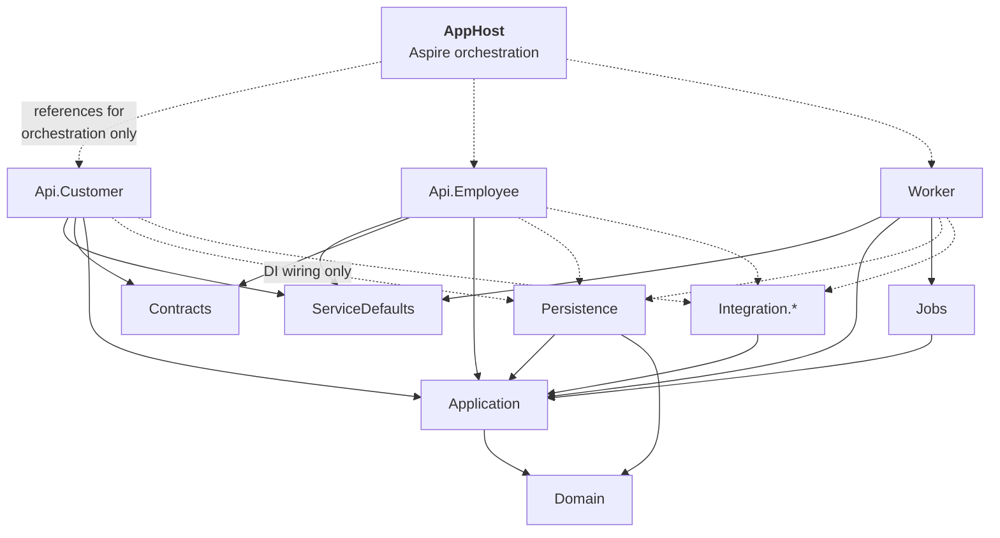

# Solution Structure

The .NET solution layout, the Angular workspace, and the Aspire orchestration that makes the whole
thing runnable with one command — **across two repositories [DEC-55]**.

---

## 1. Repository layout — two repositories [DEC-55]

**[DEC-55] reverses the monorepo assumption this document was written against**, and closes
**[OQ-51]**. .NET and Angular live in separate repositories with separate pipelines and separate
version histories. Three properties that a monorepo gave away free now have to be built and
maintained on purpose — §1.2, §4.3 and §5.1. None of them is hard; all of them are silent when
skipped.

### 1.1 What lives where

```
peakpower-platform/                             # repository 1 — .NET
├── PeakPower.sln
├── Directory.Build.props            # shared: nullable, warnings-as-errors, analyzers
├── Directory.Packages.props         # central package version management
│
├── src/
│   ├── Hosts/
│   │   ├── PeakPower.AppHost/                  # .NET Aspire orchestrator
│   │   ├── PeakPower.ServiceDefaults/          # OTel, health checks, resilience
│   │   ├── PeakPower.Api.Customer/             # customer-facing API
│   │   ├── PeakPower.Api.Employee/             # back-office API
│   │   └── PeakPower.Worker/                   # Hangfire host + ingestion webhooks
│   │
│   ├── Core/
│   │   ├── PeakPower.Domain/                   # entities, value objects, invariants
│   │   ├── PeakPower.Application/              # use cases, ports, DTOs
│   │   └── PeakPower.Contracts/                # API request/response contracts
│   │
│   └── Infrastructure/
│       ├── PeakPower.Persistence/              # EF Core, migrations, repositories
│       ├── PeakPower.Integration.Pvned/
│       ├── PeakPower.Integration.Montel/
│       ├── PeakPower.Integration.Payments/
│       ├── PeakPower.Integration.Odoo/
│       ├── PeakPower.Integration.Email/        # SendGrid  [DEC-48]
│       └── PeakPower.Jobs/                     # Hangfire job definitions
│
├── tests/
│   ├── PeakPower.Domain.Tests/                 # unit, incl. property-based
│   ├── PeakPower.Application.Tests/
│   ├── PeakPower.Integration.Tests/            # Testcontainers + real Postgres
│   └── PeakPower.Architecture.Tests/           # module dependency rules
│
├── artifacts/openapi/                          # emitted at build: customer.json, employee.json
└── deploy/
    ├── infra/                                  # Bicep / Terraform — the whole estate
    └── pipelines/
```

```
peakpower-web/                                  # repository 2 — Angular 22  [DEC-54]
├── package.json                                # one npm workspace, three apps + one library
├── angular.json
├── .npmrc                                      # private feed for @peakpower/api-client-*
│
├── apps/
│   ├── customer-portal/                        # Angular 22 SPA
│   ├── employee-portal/                        # Angular 22 SPA
│   └── public-site/                            # Angular 22 SSR
├── libs/
│   └── shared-ui/                              # design tokens, layout, pipes, chart wrappers
├── e2e/                                        # Playwright  [see §6]
└── tools/dev-up.*                              # starts the platform repo's AppHost  [§4.3]
```

The specification set (this repository) is a third repository and always was; **[DEC-55]** does not
change it.

### 1.2 Why `deploy/` stays with .NET, and the E2E suite moves

| Artefact | Repository | Reason |
| --- | --- | --- |
| `deploy/infra` | platform | One Azure estate, one source of truth. Splitting IaC across two repositories means two plans racing for one environment, which is worse than either half being inconvenient. The web pipeline consumes its outputs — Static Web App names, Front Door routes — it does not own them **[DEC-56]** |
| `deploy/pipelines` | both | Each repository owns its own build and deploy pipeline; only the *infrastructure* definition is single-homed |
| Playwright E2E | web | The suite drives the browser and asserts on rendered UI. It has to live where the UI it targets is versioned; it runs against a deployed environment, not against a local solution — §6 |
| OpenAPI documents | platform, published to web | §5.1 |

## 2. Project dependencies



**The rule that matters:** `Domain` references nothing. `Application` references only `Domain` and
defines *ports* (interfaces) that infrastructure implements. Hosts reference infrastructure solely to
register it in DI at composition root. An architecture test enforces this.

## 3. Module organisation inside Domain and Application

Modules are folders with an enforced dependency graph, not separate projects — the boundary is
maintained by tests rather than by compilation, which keeps refactoring cheap while the domain is
still moving.

```
PeakPower.Domain/
├── Common/                    # Money, MW, MWh, DateRange, EanCode, Result
├── Identity/
├── Customers/                 # Customer, MeteringPoint, MeteringPointLabel
├── Metering/                  # IntervalDataVersion, IntervalReading, DataState
├── Market/                    # PeakCalendar, PriceIndication, DayAheadPrice
├── Trading/                   # TradeRequest, Offer, Block, BlockAllocation, TradeEvent,
│                              # FourEyesThreshold, FourEyesPolicy            [DEC-33]
├── Wallet/                    # Wallet, WalletEntry, Reservation, Payment
└── Billing/                   # Surcharge, FeedInTariff [DEC-44], Invoice, InvoiceLine,
                               # TaxTariff, TrueUp
```

```csharp
// PeakPower.Architecture.Tests
[Fact]
public void Modules_respect_the_dependency_graph()
{
    var result = Types.InAssembly(typeof(Customer).Assembly)
        .That().ResideInNamespace("PeakPower.Domain.Metering")
        .ShouldNot().HaveDependencyOnAny(
            "PeakPower.Domain.Trading",
            "PeakPower.Domain.Billing",
            "PeakPower.Domain.Wallet")
        .GetResult();

    result.IsSuccessful.Should().BeTrue(
        because: string.Join(", ", result.FailingTypeNames ?? []));
}

[Fact]
public void Domain_depends_on_nothing_outside_itself()
{
    Types.InAssembly(typeof(Customer).Assembly)
        .ShouldNot().HaveDependencyOnAny("Microsoft.EntityFrameworkCore", "Hangfire", "System.Net.Http")
        .GetResult().IsSuccessful.Should().BeTrue();
}
```

## 4. Aspire AppHost

One command starts everything: Postgres, Redis, storage emulator, all three .NET hosts, all three
Angular dev servers, and the identity provider if self-hosted. **Under [DEC-55] the AppHost starts
three front-ends it does not contain** — §4.3.

```csharp
// PeakPower.AppHost/Program.cs
var builder = DistributedApplication.CreateBuilder(args);

// ── Infrastructure ────────────────────────────────────────────────────
var postgres = builder.AddPostgres("postgres")
    .WithDataVolume()                 // survives restarts
    .WithPgAdmin();

var appDb     = postgres.AddDatabase("peakpower");
var hangfireDb = postgres.AddDatabase("hangfire");

var redis   = builder.AddRedis("redis");
var storage = builder.AddAzureStorage("storage").RunAsEmulator();
var blobs   = storage.AddBlobs("documents");

// ── Migrations run to completion before the APIs start ────────────────
var migrator = builder.AddProject<Projects.PeakPower_Migrator>("migrator")
    .WithReference(appDb)
    .WaitFor(appDb);

// ── Application hosts ─────────────────────────────────────────────────
var customerApi = builder.AddProject<Projects.PeakPower_Api_Customer>("customer-api")
    .WithReference(appDb).WithReference(redis).WithReference(blobs)
    .WaitForCompletion(migrator);

var employeeApi = builder.AddProject<Projects.PeakPower_Api_Employee>("employee-api")
    .WithReference(appDb).WithReference(redis).WithReference(blobs)
    .WaitForCompletion(migrator);

var worker = builder.AddProject<Projects.PeakPower_Worker>("worker")
    .WithReference(appDb).WithReference(hangfireDb)
    .WithReference(redis).WithReference(blobs)
    .WaitForCompletion(migrator);

// ── Frontends — in a different repository  [DEC-55] ───────────────────
// Resolved, not assumed: config first, sibling checkout second, fail loudly third.
var webRoot = builder.Configuration["PEAKPOWER_WEB_PATH"]
              ?? Path.GetFullPath("../../../../peakpower-web");

if (Directory.Exists(webRoot))
{
    builder.AddNpmApp("customer-portal", $"{webRoot}/apps/customer-portal", "start")
        .WithReference(customerApi)
        .WithHttpEndpoint(env: "PORT")
        .WithExternalHttpEndpoints();

    builder.AddNpmApp("employee-portal", $"{webRoot}/apps/employee-portal", "start")
        .WithReference(employeeApi)
        .WithHttpEndpoint(env: "PORT")
        .WithExternalHttpEndpoints();

    builder.AddNpmApp("public-site", $"{webRoot}/apps/public-site", "start")
        .WithHttpEndpoint(env: "PORT")
        .WithExternalHttpEndpoints();
}
else
{
    // Backend-only is a legitimate mode; silently backend-only is not.
    throw new InvalidOperationException(
        $"peakpower-web not found at '{webRoot}'. Clone it beside this repository, set " +
        "PEAKPOWER_WEB_PATH, or run with --backend-only.");
}

// ── Local stand-ins for third parties ─────────────────────────────────
if (builder.Environment.IsDevelopment())
{
    builder.AddProject<Projects.PeakPower_DevStubs>("dev-stubs")
        .WithReference(worker);   // fake PVNed pusher, Montel, PSP, Odoo
}

builder.Build().Run();
```

```bash
dotnet run --project src/Hosts/PeakPower.AppHost
```

### 4.1 Why the dev stubs matter

Three of the four integrations are third parties PeakPower does not control, and at least one
(PVNed) may not offer a usable test environment **[OQ-05]**. A `DevStubs` project that can push a
realistic `TimeSeriesDocument` on demand — including corrections, DST days and malformed payloads —
is what makes [F02](../10-features/F02-metering-data-ingestion.md) testable at all. It is not a nice
to have; it is on the critical path for phase 1.

It should be able to generate:

- a normal 96-interval day for a set of EANs, with a plausible load shape;
- 92- and 100-interval DST days;
- a correction that supersedes a previous document;
- an imbalance report matching the supplied sample;
- deliberately invalid documents for each validation rule.

### 4.2 ServiceDefaults

Shared by all three hosts: OpenTelemetry (traces, metrics, logs), health check endpoints, HTTP
resilience handlers with standard retry and circuit-breaker policies, and service discovery.

### 4.3 One command, across two repositories — [DEC-55]

**"One command brings up the whole system" was free in a monorepo. It is now a maintained property**,
and it is worth maintaining: it is the thing that makes a new developer productive on day one and
makes the dev stubs (§4.1) usable at all.

| Option | Verdict |
| --- | --- |
| **Sibling checkout, path from configuration** | **Chosen.** `PEAKPOWER_WEB_PATH`, defaulting to `../peakpower-web`. Zero coupling between the repositories, no pinned commit, and each side is free to move. Costs one convention that has to be written down — which is what this section is |
| Git submodule | Rejected. It pins the web repository to a commit inside the .NET repository, which reintroduces exactly the coupling **[DEC-55]** removes, and does it in the form developers are worst at operating |
| Front-ends as prebuilt container images in the AppHost | Rejected for development — no hot reload, and a stale image is indistinguishable from a bug. Kept as the option for *demo* environments, where a pinned version is the point |

Three rules make it hold:

1. **`dev-up` exists in both repositories and does the same thing.** In `peakpower-platform` it checks
   for the sibling checkout and runs the AppHost; in `peakpower-web` it does the same in reverse and
   then `npm start`. Whichever repository a developer cloned first, one command works.
2. **A missing sibling fails loudly.** The AppHost throws with the path it looked in and the two ways
   to fix it. Backend-only is an explicit `--backend-only` flag, never an accident — an AppHost that
   silently starts three of six resources is how an afternoon disappears.
3. **The AppHost never builds the front-ends.** `AddNpmApp` runs `npm start` in a tree it does not
   own; installing dependencies and generating clients belong to the web repository's own scripts.

```bash
# either repository, same result
./dev-up
```

## 5. Angular workspace — Angular 22 [DEC-54]

Three applications and one shared library, in `peakpower-web` **[DEC-55]**. **Angular 22 for all
three [DEC-54]** — one version across the workspace, upgraded together; three applications on three
versions of the framework is three sets of migration notes for one team.

```
peakpower-web/
├── libs/shared-ui/              # design tokens, layout, table, form controls,
│                                # money & energy pipes, chart wrappers, auth interceptor
├── apps/customer-portal/
│   └── src/app/
│       ├── core/                # auth, http, error handling, signalr
│       ├── features/
│       │   ├── dashboard/  metering-points/  consumption/
│       │   ├── prices/     trading/          wallet/        invoices/
│       └── shared/
├── apps/employee-portal/
│   └── src/app/features/
│       ├── home/  trade-desk/  customers/  wallets/
│       ├── invoicing/  data-health/  reference-data/  admin/
└── apps/public-site/            # SSR
```

Conventions: standalone components throughout, signals for state, lazy-loaded feature routes,
strictly typed reactive forms, and generated API clients — now consumed as a published package
rather than generated in place, §5.1.

**[DEC-54] settles the framework version and not the component library.** [OQ-49]'s second half is
still open, and **[DEC-39]** — open-source and free, or built in-house — is the constraint to expect
there too.

### 5.1 The OpenAPI client now crosses a repository boundary — [DEC-55]

This is the consequence of **[DEC-55]** with real cost attached, because it removes a property this
document previously claimed outright: *"a backend contract change breaks the frontend build rather
than production"*. In one repository that was true by construction — one commit, one build, one
failure. Across two it is **false by default**: the .NET repository can merge a breaking contract
change and stay green, and the web repository will keep building against the client it already has
until someone bumps it.

**The pipeline step that replaces the property:**

| Step | Where | What |
| --- | --- | --- |
| 1 · Emit | platform CI | The two OpenAPI documents are produced at build time into `artifacts/openapi/`. The existing contract-snapshot test (§6) already fails the build on an unreviewed change |
| 2 · Generate | platform CI | `@peakpower/api-client-customer` and `@peakpower/api-client-employee` are generated from those documents |
| 3 · Publish | platform CI, on merge to `main` | Both packages published to a private feed (Azure Artifacts or GitHub Packages), versioned `<api-version>-<build>` with semver rules: a breaking OpenAPI change is a **major** |
| 4 · Consume | web repo | `npm install` from the lockfile. A version bump is a normal, reviewable pull request that either compiles or does not |

**Alternative, if a private package feed is not available:** generate the clients in platform CI and
open an automated pull request that commits them into `peakpower-web`. It is uglier and it works —
the generated code is reviewable in the diff, and the bump is still a pull request. What is **not**
acceptable is each developer generating clients locally: that is a build that differs per machine.

**Restoring the safety net.** Three cheap mechanisms, because none of them alone is the monorepo:

1. **Semver is enforced, not advisory.** A breaking OpenAPI diff bumps the major version, so a
   consuming build cannot pick it up silently.
2. **A nightly integration build** in `peakpower-web` compiles the applications against the *latest*
   published client and runs the E2E suite against a Dev environment built from both `main`s. It is
   allowed to fail; it is not allowed to fail unnoticed.
3. **The E2E suite is the backstop** (§6), and it is the reason the suite lives with the UI rather
   than with the API.

⚠ **The window between merge and bump is real and cannot be engineered away** — it can only be made
short and visible. That is the price of **[DEC-55]** and it should be paid knowingly rather than
discovered in production.

## 6. Testing strategy

| Layer | What | Tooling |
| --- | --- | --- |
| **Domain unit** | Invariants, state transitions, block maths, ledger arithmetic | xUnit + FluentAssertions |
| **Property-based** | Calendar arithmetic (DST, peak counts, interval counts), allocation rounding, ledger balance identity | FsCheck |
| **Application** | Use cases against in-memory ports | xUnit + NSubstitute |
| **Persistence** | Real PostgreSQL, real migrations, constraint behaviour | Testcontainers |
| **Integration** | Ingestion end-to-end with sample payloads; webhook idempotency | Testcontainers + WireMock |
| **Architecture** | Module graph, domain purity, no `DateTime.Now` outside the calendar service | NetArchTest |
| **API contract** | OpenAPI snapshot to catch breaking changes — **and the trigger for the client publish [DEC-55]**, §5.1 | Verify |
| **Cross-repo client** | Applications compile against the *latest published* client, nightly, not only against the pinned one **[DEC-55]** | npm + tsc |
| **E2E** | Login, request a trade, accept an offer, **approve it as a second account**, view the ledger. Lives in `peakpower-web` **[DEC-55]**, runs against a deployed environment | Playwright |
| **Frontend unit** | Components, pipes, signal stores | Vitest |

### 6.1 Tests that must exist before phase 2 ships

These are the ones where a bug is expensive and silent:

1. Accepting the same offer twice creates exactly one reservation.
2. Accepting at the instant of expiry produces exactly one deterministic outcome.
3. A failed trade releases exactly the reserved amount, no more, no less.
4. Ledger balance always equals the sum of entry deltas, after any sequence of operations.
5. Available balance never goes negative through a customer action.
6. Block allocations sum exactly to the block power for any split and any rounding.
7. Peak interval counts match the reference table for every month of three years.
8. A day with 92 or 100 intervals is stored, aggregated and charted correctly.
9. **The accepting account cannot approve its own acceptance** **[DEC-33]**, **[F05-R59]**. The
   attempt is refused with a specific error, the trade stays in `AWAITING_APPROVAL`, and **no
   reservation is settled** — because the failure mode is not an error message, it is a large trade
   that quietly went through on one person's say-so. Requested by
   [F05](../10-features/F05-energy-block-trading.md) §3.2.
10. **A trade left in `AWAITING_APPROVAL` at `expires_at` expires and releases its reservation in
    full** **[F05-R62]**. The same shape as test 3, on the state that did not exist when test 3 was
    written — and the one that leaks money silently if the expiry job's filter or the partial index
    misses it ([Database design §3.4.1](04-database-design.md)).
11. **The surcharge is charged per kWh with no `/1000`** **[DEC-35]**. A rate agreed before the unit
    change invoices to the same money after it: €4.50/MWh and €0.0045/kWh produce the identical
    amount on the identical volume. An engine that keeps the divisor bills a thousandth of the
    correct figure and looks entirely plausible doing it.
12. **The migration divides, it does not reinterpret** **[F09-R12]**. Run against a dataset seeded
    with pre-**[DEC-35]** €/MWh rates, asserting both the value and the surviving precision:
    `4.5500` → `0.0045500`, not `0.0046` and not `4.5500000`.
13. **A month with export and no resolving feed-in tariff is skipped, never valued at zero**
    **[DEC-44]**, **[F10-R39]**. The fallback is an open question **[F09]** §11.1; this test is what
    stops it being answered by accident, in code, by whoever writes the resolver first.

Tests 9–13 are new with the second-round decisions. They earn their place the same way the first
eight do: each one fails silently in production and shows up as money.

## 7. Coding standards

| Rule | Rationale |
| --- | --- |
| `<Nullable>enable</Nullable>`, `<TreatWarningsAsErrors>true</TreatWarningsAsErrors>` | Cheap correctness |
| No `DateTime.Now` / `DateTime.UtcNow` outside `IClock`; no date arithmetic outside `IMarketCalendar` | Enforced by an architecture test. This is the single highest-value rule in the codebase |
| `decimal` for all money and energy; `double` banned in domain code | **[AS-20]** |
| Value objects for `Money`, `Mw`, `MWh`, `EanCode`, `DateRange` | Makes unit and currency errors compile-time failures |
| `Result<T>` for expected failures; exceptions only for the unexpected | Business rejections are not exceptional |
| Async everywhere, `CancellationToken` threaded through | |
| Central package management | One version of everything |

## 8. Open questions

| Ref | Question |
| --- | --- |
| [OQ-49] | Angular component library. **Half-closed:** **[DEC-54]** settles the framework at **Angular 22**; the component library is still open, and **[DEC-39]**'s free-or-in-house constraint should be expected to apply here too |
| ~~[OQ-51]~~ | ~~Monorepo for both .NET and Angular, or separate repositories?~~ **Closed by [DEC-55]** — separate repositories. The three consequences are designed for in §1.2, §4.3 and §5.1 |
| [OQ-52] | Does PeakPower have existing .NET conventions or shared libraries to align with — in particular the existing Montel implementation? |
| *(new, from **[DEC-55]**)* | Which private package feed hosts `@peakpower/api-client-*` — Azure Artifacts or GitHub Packages? The fallback (generated-and-committed, §5.1) needs no feed, so this gates the preferred path only |
