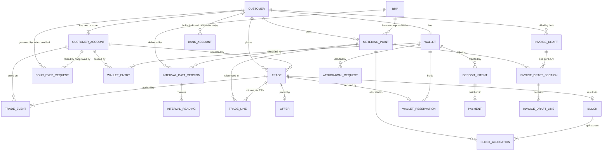

# Domain Model

Aggregates, entities, value objects and the invariants that hold them together.

---

## 1. Aggregate map



⚠ **Amended 2026-08-19.** Four things left this diagram and four arrived.

| Change | Driver |
| --- | --- |
| `SURCHARGE` removed — the platform pushes volume, the bookkeeping program multiplies by the topup fee | **[DEC-73]** reverses **[DEC-35]** |
| `FOUR_EYES_THRESHOLD` removed — four-eyes is a per-company on/off mode, not a value comparison | **[DEC-71]** replaces **[DEC-33]** |
| `INVOICE` → `INVOICE_DRAFT`, and `CREDIT_NOTE` removed — the platform calculates and pushes a draft; the bookkeeping program numbers it, renders it, sends it and credits it | **[DEC-88]**, **[DEC-89]**, **[DEC-99]** |
| `PAYMENT` no longer funds the wallet directly; it is matched **to a `DEPOSIT_INTENT`** on a platform-issued reference | **[DEC-106]** amends **[DEC-58]** |
| `BANK_ACCOUNT` promoted from a property of `CUSTOMER` to a collection, because it is now immutable once added | **[DEC-61]**, **[DEC-71]** |
| `BRP` added as reference data with metering points and delivered documents hanging off it | **[DEC-69]** |
| `DEPOSIT_INTENT` and `WITHDRAWAL_REQUEST` added to the wallet | **[DEC-106]**, **[DEC-83]** |
| `FOUR_EYES_REQUEST` added for the four non-trade actions that four-eyes governs | **[DEC-71]** |

### 1.1 Aggregate roots and boundaries

| Aggregate root | Contains | Transaction boundary rationale |
| --- | --- | --- |
| **Customer** (company) | metering points, labels, **accounts**, **bank accounts** | Master data changes together. The four-eyes mode and the admin flags that make it satisfiable must be checked against each other under one lock **[DEC-71]** |
| **Wallet** | entries, reservations, **deposit intents**, **withdrawal requests** | Balance invariants require a single lock. A deposit match and a withdrawal payout both move the balance, so they commit inside the wallet **[DEC-106]**, **[DEC-83]** |
| **Trade** | lines, offer, events | State machine and audit must be atomic |
| **Block** | allocations | Allocation sum invariant |
| **IntervalDataVersion** | readings | A document applies whole or not at all **[F02-R13]** |
| **InvoiceDraft** | sections, lines | Totals must be consistent with lines. ⚠ **Amended 2026-08-19 by [DEC-88]/[DEC-89]** — it is a *draft*: the platform never mints a number, never renders a PDF and never sends an email. The number the bookkeeping program returns is stored for display and reconciliation only |
| **PeakCalendar** | excluded dates | Referenced by version, never mutated in place |
| **Brp** | credentials, endpoint, document format | Reference data **[DEC-69]**. A metering point is assigned to one. Referenced by id, never mutated in a way that restates a past document |
| **FourEyesRequest** | decisions | The approval record for the four non-trade actions **[DEC-71]**. Small and short-lived; the acting and approving account ids are its whole point **[DEC-17]** |
| ~~**FourEyesThreshold**~~ | ~~—~~ | ~~Reference data **[DEC-33]**. Referenced by version, never mutated in place, so a threshold change cannot restate a past trade~~ ⚠ **Reversed 2026-08-19 by [DEC-71]** — there is no threshold in euros or in megawatts, so there is no reference data to version. Replaced by `Customer.FourEyesEnabled`, a single boolean. **[OQ-85] closed** |

**Trade and Wallet are separate aggregates that commit together.** Accepting an offer changes both.
This is the one place where the "one aggregate per transaction" guideline is deliberately broken,
and it is the main reason for **[DEC-01]**: the alternative — eventual consistency between a trade
and the money securing it — would mean a customer could briefly hold an accepted trade with no funds
behind it.

**The wallet now funds trading and nothing else** **[DEC-77]**. ⚠ **[AS-12] reversed** — an invoice
is no longer settled by deducting from the wallet. Delivery money (day-ahead, export,
energiebelasting) leaves the platform as a draft invoice **[DEC-88]** and is paid to the bank; it
never touches a wallet entry. The practical gain is that **[AS-11]** — no negative balance — holds
without a credit concept, because the only thing that can debit the wallet is a trade the customer
could already afford, or a withdrawal they asked for **[DEC-83]**.

## 2. Value objects

```csharp
public readonly record struct Money(decimal Amount, Currency Currency)
{
    public static Money Euro(decimal a) => new(a, Currency.EUR);
    public Money Add(Money o)  => Same(o) ? this with { Amount = Amount + o.Amount } : throw new CurrencyMismatch();
    public Money Round2()      => this with { Amount = Math.Round(Amount, 2, MidpointRounding.AwayFromZero) };
}

public readonly record struct Mw(decimal Value)
{
    /// Smallest tradable quantity and the step between quantities  [DEC-70].
    public const decimal TradeIncrement = 0.01m;

    public MWh OverIntervals(int count) => new(Value * count * 0.25m);

    /// A requested or allocated power must be a positive whole multiple of 0.01 MW  [DEC-70].
    public bool IsTradable => Value >= TradeIncrement
                           && decimal.Remainder(Value, TradeIncrement) == 0m;
}

public readonly record struct MWh(decimal Value)
{
    public kWh ToKwh()               => new(Value * 1000m);
    public Money At(PricePerMwh p)   => Money.Euro(Value * p.Value);
}

/// Who performed an action. Immutable, and snapshotted at the moment it happened  [DEC-17].
public readonly record struct Actor
{
    public ActorType Type { get; init; }        // Customer | Employee | System
    public string Id { get; init; }             // account id, employee id, or "SYSTEM:offer-expiry-job"
    public string DisplayName { get; init; }    // "J. de Vries"
    public string? JobTitle { get; init; }      // "Energy Manager" — customers only, as at the time

    public static Actor Customer(CustomerAccount a) =>
        new() { Type = ActorType.Customer, Id = a.Id.ToString(),
                DisplayName = a.FullName, JobTitle = a.JobTitle };

    public static Actor System(string job) =>
        new() { Type = ActorType.System, Id = $"SYSTEM:{job}", DisplayName = job };
}

/// Four-eyes is a mode, not a comparison  [DEC-71]. The only input is the
/// customer company's own flag, so the "policy" is one boolean and there is
/// nothing to resolve, version or pin a threshold from.
public readonly record struct FourEyesMode(bool Enabled)
{
    public bool RequiresApproval => Enabled;      // no amount, no shape, no period
}

/// The reference a customer must quote on a bank transfer so the platform can
/// match the incoming payment to their wallet  [DEC-106]. Unique per deposit
/// intent, never reused, and readable enough to be retyped into a bank screen.
public readonly record struct PaymentReference
{
    public string Value { get; }                  // e.g. "PP-7QK4-2M8D"
    private PaymentReference(string v) => Value = v;

    public static PaymentReference Issue(IReferenceGenerator g) => new(g.Next());

    public static Result<PaymentReference> Parse(string input)
    {
        var s = new string(input.Where(char.IsLetterOrDigit).ToArray()).ToUpperInvariant();
        return Format.IsMatch(s) ? Result.Ok(new PaymentReference(s))
                                 : Result.Fail<PaymentReference>("Not a payment reference");
    }
}

public readonly record struct Iban
{
    public string Value { get; }
    private Iban(string v) => Value = v;

    public static Result<Iban> Create(string input)
    {
        var s = new string(input.Where(char.IsLetterOrDigit).ToArray()).ToUpperInvariant();
        if (s.Length < 15 || s.Length > 34)   return Result.Fail<Iban>("IBAN length is not valid");
        if (!ExpectedLengthFor(s[..2], out var len)) return Result.Fail<Iban>("Unknown IBAN country");
        if (s.Length != len)                  return Result.Fail<Iban>($"An IBAN for {s[..2]} has {len} characters");
        if (Mod97(s) != 1)                    return Result.Fail<Iban>("IBAN checksum is invalid");
        return Result.Ok(new Iban(s));
    }
}

public readonly record struct EanCode
{
    public string Value { get; }
    private EanCode(string v) => Value = v;

    public static Result<EanCode> Create(string input)
    {
        var digits = new string(input.Where(char.IsDigit).ToArray());
        if (digits.Length != 18)          return Result.Fail<EanCode>("EAN must be 18 digits");
        if (!HasValidCheckDigit(digits))  return Result.Fail<EanCode>("EAN check digit is invalid");
        return Result.Ok(new EanCode(digits));
    }
}

/// Half-open [Start, End) in Europe/Amsterdam.
public readonly record struct DeliveryPeriod(PeriodType Type, DateOnly Start, DateOnly End)
{
    public static DeliveryPeriod Month(int y, int m)   => …;
    public static DeliveryPeriod Quarter(int y, int q) => …;
    public static DeliveryPeriod Year(int y)           => …;
}
```

Why these exist: `Money.Add` cannot silently mix currencies, `Mw.OverIntervals` is the only route to
a volume so the 0.25 factor lives in one place, and `EanCode` cannot be constructed invalid. Each one
removes a class of bug rather than a line of code.

**On `Mw.TradeIncrement`.** ⚠ **Reversed 2026-08-19 by [DEC-70]** — **[DEC-32]** set the minimum and
the increment at 0,1 MW; both are now 0,01 MW, ten times finer. The constant is on the value object
rather than in a validator so the trade wizard, the API contract and the allocation rounding read the
same number. Cost: every per-EAN allocation is now a multiple of 0,01 MW, so the largest-remainder
split in `IBlockVolumeCalculator` distributes a tail that is ten times smaller and ten times more
frequent. Nothing about the algorithm changes; the residue does.

### 2.1 Superseded value objects

Kept readable because trades accepted before 2026-08-19 were pinned against them.

```csharp
// ⚠ Reversed 2026-08-19 by [DEC-71]. Replaced by FourEyesMode above.
// There is no threshold, in euros or in megawatts, so there is no reference
// data to resolve, no version to pin and no "most specific scope wins" order.
//
// /// The four-eyes rule as resolved reference data, most specific scope wins  [DEC-33].
// /// A null Threshold is an explicit "this scope never needs a second approver" —
// /// it is not the same as no row, which is a configuration error.
// public readonly record struct FourEyesPolicy(FourEyesThresholdVersionId Version, Money? Threshold)
// {
//     public bool RequiresApproval(Money tradeValue) =>
//         Threshold is { } t && tradeValue.Amount > t.Amount;    // strictly greater than
// }
```

| Removed | Replaced by | Driver |
| --- | --- | --- |
| `FourEyesPolicy`, `FourEyesThresholdVersionId` | `FourEyesMode`, backed by `Customer.FourEyesEnabled` | **[DEC-71]** |
| `SurchargeRate`, `SurchargeScope` | — nothing. The platform pushes volume; the bookkeeping program multiplies it by the topup fee | **[DEC-73]** |
| `FeedInTariff` | — nothing. Export is credited at the day-ahead price for the interval, raw | **[DEC-87]** |
| `VatRate` as a computed value | The constant 21% **[DEC-64]**, used for one thing only: grossing up a trade reservation **[DEC-78]** | **[DEC-76]** |

## 3. The Customer aggregate

A customer **is a company**. Accounts are entities inside it, not a separate aggregate, because an
account only ever exists in the context of one company and the two change together.

```csharp
public sealed class Customer : AggregateRoot
{
    public CustomerId Id { get; }
    public string LegalName { get; private set; }
    public string? TradeName { get; private set; }
    public KvkNumber Kvk { get; private set; }
    public VatNumber? Vat { get; private set; }
    public Address BillingAddress { get; private set; }
    public Address? VisitingAddress { get; private set; }
    public ContactDetails PrimaryContact { get; private set; }
    public CustomerStatus Status { get; private set; }
    public Locale Locale { get; private set; }

    // ── four-eyes mode  [DEC-71] ────────────────────────────────────
    public bool FourEyesEnabled { get; private set; }
    public Result EnableFourEyes(Actor by);      // guard: ≥ 2 active admin accounts  (C8)
    public Result DisableFourEyes(Actor by);     // itself a sensitive action; see §3.2

    // public BankAccount Bank { get; private set; }   // Iban + Bic + holder name
    //   ⚠ Amended 2026-08-19 by [DEC-61]/[DEC-71]. A bank account is immutable once added:
    //   it can be added and deactivated, never edited, so it cannot be a single mutable
    //   property. A customer may hold more than one at a time.
    private readonly List<BankAccount> _bankAccounts = [];
    public IReadOnlyList<BankAccount> BankAccounts => _bankAccounts;
    public IEnumerable<BankAccount> ActiveBankAccounts => _bankAccounts.Where(b => b.IsActive);

    public Result<BankAccount> AddBankAccount(Iban iban, Bic? bic, string holderName, Actor by);
    public Result DeactivateBankAccount(BankAccountId id, Actor by, string? reason);
    //   There is deliberately no EditBankAccount. Correcting a typo means adding the right
    //   account and deactivating the wrong one, which leaves both visible in the audit trail.

    private readonly List<CustomerAccount> _accounts = [];
    public IReadOnlyList<CustomerAccount> Accounts => _accounts;
    public IEnumerable<CustomerAccount> ActiveAccounts => _accounts.Where(a => a.IsActive);
    public IEnumerable<CustomerAccount> ActiveAdmins => ActiveAccounts.Where(a => a.IsAdmin);

    private readonly List<MeteringPoint> _meteringPoints = [];
    public IReadOnlyList<MeteringPoint> MeteringPoints => _meteringPoints;

    public Result<CustomerAccount> AddAccount(Username u, PersonName n, string? jobTitle,
                                              string email, string? phone, bool isAdmin, Actor by);
    public Result DeactivateAccount(CustomerAccountId id, Actor by, string? reason);
    public Result GrantAdmin(CustomerAccountId id, Actor by);
    public Result RevokeAdmin(CustomerAccountId id, Actor by);   // guard: not the second-to-last (C9)

    /// The whole of the approver rule  [DEC-71]: a different admin of the same company.
    public bool CanApproveFor(CustomerAccountId requester, CustomerAccountId approver) =>
        FourEyesEnabled
        && requester != approver
        && ActiveAdmins.Any(a => a.Id == approver)
        && ActiveAdmins.Any(a => a.Id == requester);
}

public sealed class CustomerAccount : Entity
{
    public CustomerAccountId Id { get; }
    public CustomerId CustomerId { get; }
    public Username Username { get; }              // immutable after creation
    public PersonName Name { get; private set; }   // first + last
    public string? JobTitle { get; private set; }  // "role in the company" — descriptive only
    public string Email { get; private set; }
    public string? Phone { get; private set; }
    public AccountStatus Status { get; private set; }   // PendingApproval | Invited | Active | Deactivated
    // ⚠ Retired 2026-09-03 by [DEC-119]: the platform owns identity outright, so there is no
    //   external subject to hold. Always null; nothing reads or writes it. Dropped after slice 1.
    public ExternalSubjectId? SubjectId { get; private set; }  // was: set when the invitation is accepted

    // ⚠ Added 2026-09-03. The platform holds the credential [DEC-113] and revokes a stateless
    //   token by comparing the stamp on every request [DEC-117], [F01-R16].
    public string? PasswordHash { get; private set; }          // Argon2id; null until a credential is set
    public Guid SecurityStamp { get; private set; }            // bumped by every mutator, and by reset
    public DateTimeOffset? LastLoginAt { get; private set; }

    /// ⚠ Amended 2026-08-19 by [DEC-71], which qualifies [DEC-16]. The one and only
    /// privilege bit on an account. It grants nothing on its own: it decides who may
    /// raise and who may approve a four-eyes action, and nothing else branches on it.
    public bool IsAdmin { get; private set; }

    public bool IsActive => Status == AccountStatus.Active;
    public string FullName => $"{Name.First} {Name.Last}";
    // No permission or role property beyond IsAdmin. Still by design  [DEC-16], see §10.
}

/// Immutable once added  [DEC-61], [DEC-71]. There is no setter on any field.
public sealed class BankAccount : Entity
{
    public BankAccountId Id { get; }
    public CustomerId CustomerId { get; }
    public Iban Iban { get; }
    public Bic? Bic { get; }
    public string HolderName { get; }
    public DateTimeOffset AddedAt { get; }
    public Actor AddedBy { get; }
    public DateTimeOffset? DeactivatedAt { get; private set; }   // the only mutation there is
    public Actor? DeactivatedBy { get; private set; }
    public string? DeactivationReason { get; private set; }

    public bool IsActive => DeactivatedAt is null;
}

/// An entity of the Customer aggregate (§1.1), carried here because both properties
/// added on 2026-08-19 are master data the customer owns.
public sealed class MeteringPoint : Entity
{
    public MeteringPointId Id { get; }
    public CustomerId CustomerId { get; }
    public EanCode Ean { get; }
    public Commodity Commodity { get; }             // Electricity only, for now  [DEC-68], [DEC-15]
    public BrpId BrpId { get; private set; }        // exactly one at a time  [DEC-69], see §6
    public string? Label { get; private set; }
    public DateOnly ContractStart { get; private set; }
    public DateOnly? ContractEnd { get; private set; }

    /// ⚠ Amended 2026-08-19 by [DEC-112]. Customer-declared at onboarding, not derived.
    /// SJV and profile fractions are a sanity check on the declaration, never its source.
    /// Defaults to Unknown, and Unknown is treated as Expected for completeness
    /// alerting  [F02-R32]. A change applies forward only  [F01-R41].
    public ProductionExpectation ProductionExpectation { get; private set; }
    public Actor? ExpectationDeclaredBy { get; private set; }
    public DateTimeOffset? ExpectationDeclaredAt { get; private set; }
}

// The database spelling is normative: NEVER, not NOT_EXPECTED. Corrected 2026-09-03.
public enum ProductionExpectation { Unknown = 0, Expected = 1, Never = 2 }
```

### 3.1 Invariants

| # | Invariant | Enforced |
| --- | --- | --- |
| C1 | A customer has **at least one** account once it reaches `ACTIVE` | Guard on status transition |
| C2 | Usernames are unique **platform-wide**, not merely within a company | Unique index; checked by the application service across customers |
| C3 | `Username` is immutable after creation | `init`-only, no setter |
| C4 | An account is deactivated, never removed, so historical actors stay resolvable | No delete path |
| C5 | `JobTitle` grants nothing — no code branches on it. ⚠ **Amended 2026-08-19 by [DEC-71]**: `IsAdmin` is now the one thing code *does* branch on, and `JobTitle` stays purely descriptive | Enforced by review and by there being no permission type to branch to other than `IsAdmin` |
| C6 | The IBAN is structurally valid and passes mod-97 | `Iban.Create` is the only constructor |
| C7 | An account belongs to exactly one customer and cannot be moved | No setter for `CustomerId` |
| C8 | Four-eyes cannot be **enabled** while the company has fewer than **two active admin accounts**, because the rule would then be unsatisfiable and every sensitive action would deadlock **[DEC-71]** | Guard in `EnableFourEyes`, evaluated under the aggregate lock |
| C9 | While four-eyes is on, the **second-to-last active admin cannot be deactivated** and their admin flag cannot be revoked — the company may not fall below two | Guard in `DeactivateAccount` and `RevokeAdmin`; the same count as C8, checked on the way down |
| C10 | An approver is an **active admin of the same company** and is **not** the account that raised the action **[DEC-71]** | `Customer.CanApproveFor`, called with ids taken from the token, never from the request body **[DEC-17]** |
| C11 | A bank account is **immutable once added**. It may be added and deactivated; it may never be edited **[DEC-61]**, **[DEC-71]** | No setters; there is no `EditBankAccount` method to call |
| C12 | A deactivated bank account is never reactivated and never removed, so a past withdrawal payout stays resolvable to the account it went to | `DeactivatedAt` is write-once; no delete path |
| C13 | `ProductionExpectation` is set by a declaration with an actor and a timestamp, never inferred from SJV or from observed production **[DEC-112]** | Only the declaration method writes it; the SJV comparison is a report, not a writer |

### 3.2 Four-eyes, and what it governs

**[DEC-71]** replaces **[DEC-33]**. Four-eyes is a **per-customer-company mode with no threshold**:
either the company has it on and every action in the table below needs a second admin, or it has it
off and none of them do. **[OQ-85] is closed** — there is no amount, in euros or in megawatts, at
which the rule starts.

| Action | Where the approval lives | Why there |
| --- | --- | --- |
| Execute a trade | **In the `Trade` aggregate**, as the `AwaitingApproval` state (§4) | Money is reserved at acceptance and must stay reserved across the approval. A separate record would leave the reservation orphaned from the thing it secures — see §10 |
| Add a bank account | `FourEyesRequest` | Nothing is reserved and nothing expires; the request is the whole state |
| Deactivate a bank account | `FourEyesRequest` | Same |
| Add a user | `FourEyesRequest` | Same |
| Withdraw funds | `FourEyesRequest`, linked to the `WithdrawalRequest` (§5.3) | The wallet debit happens on payout, not on request, so there is no reservation to carry **[DEC-83]** |

**Deposits are explicitly out of scope** and this is deliberate, not an omission: a customer can
transfer money to PeakPower or use iDEAL on their own initiative, so gating a deposit gates nothing
**[DEC-71]**.

```csharp
public sealed class FourEyesRequest : AggregateRoot
{
    public FourEyesRequestId Id { get; }
    public CustomerId CustomerId { get; }
    // ⚠ Corrected 2026-09-03 to the five arms the database defines. `Trade` was missing, and
    //   `Withdraw` is spelled `Withdrawal` — the database spelling is normative in both cases,
    //   and WITHDRAWAL is what the CHECK constraint in customer.approval_request accepts.
    public FourEyesAction Action { get; }        // AddBankAccount | DeactivateBankAccount
                                                 // | AddUser | Trade | Withdrawal
    public string SubjectRef { get; }            // the id of the thing being acted on
    public string PayloadJson { get; }           // the proposed change, frozen at request time
    public CustomerAccountId RequestedByAccountId { get; }
    public DateTimeOffset RequestedAt { get; }
    public FourEyesState State { get; private set; }   // Pending | Approved | Declined
    public CustomerAccountId? DecidedByAccountId { get; private set; }
    public DateTimeOffset? DecidedAt { get; private set; }
    public string? DeclineReason { get; private set; }

    public Result Approve(Actor by, Customer customer);   // guard: customer.CanApproveFor(...)
    public Result Decline(Actor by, Customer customer, string reason);   // reason mandatory
}
```

| # | Invariant | Enforced |
| --- | --- | --- |
| C14 | A request is raised only when the company's `FourEyesEnabled` is **true at that moment**; turning the mode off later does not retroactively execute or void pending requests | Guard at creation; pending requests are decided or cancelled explicitly |
| C15 | `Approve` and `Decline` both go through `Customer.CanApproveFor`, so C10 holds for all four actions with one implementation | One call site per transition |
| C16 | The payload is frozen at request time and the approval applies **that** payload, not whatever the form holds at approval time | `PayloadJson` is `init`-only |
| C17 | A request is decided at most once | State guard, terminal `Approved` and `Declined` |
| C18 | `Decline` requires a non-empty reason | Guard in the method, matching `T5` |

⚠ **One gap, recorded rather than closed silently.** `DisableFourEyes` is not in **[DEC-71]**'s list
of five actions, and as the model stands one admin can therefore switch the mode off and then act
alone. Whether disabling the mode should itself need a second admin is not decided — it is carried
with the **[DEC-71]** source tension (OQ-09's comment and OQ-85's answer list different action sets,
and the ledger asks for both to be confirmed at the next session). The model does not assume an
answer; `DisableFourEyes` is an ordinary admin action today.

## 4. The Trade aggregate

The most involved part of the model.

```csharp
public sealed class Trade : AggregateRoot
{
    public TradeId Id { get; }
    public CustomerId CustomerId { get; }
    public TradeDirection Direction { get; }        // Buy | Sell
    public BlockShape Shape { get; }                // Base | Peak
    public DeliveryPeriod Period { get; }
    public PeakCalendarVersionId CalendarVersion { get; }   // pinned at creation
    public TradeState State { get; private set; }
    public CustomerAccountId RequestedByAccountId { get; }  // denormalised for listing  [F05-R42]

    // ── four-eyes  [DEC-71], replacing [DEC-33] ─────────────────────
    public CustomerAccountId? AcceptedByAccountId { get; private set; }   // set by Accept
    public CustomerAccountId? ApprovedByAccountId { get; private set; }   // set by Approve
    public bool FourEyesApplied { get; private set; }   // the company's mode, pinned at acceptance
    // public FourEyesThresholdVersionId? ThresholdVersion { get; private set; }  // pinned at acceptance
    // public Money? ThresholdApplied { get; private set; }        // the amount compared against
    //   ⚠ Reversed 2026-08-19 by [DEC-71]. There is no threshold, so there is nothing to
    //   compare against and no reference-data version to pin. What is pinned instead is the
    //   single fact that decided the branch: was the company's four-eyes mode on at the
    //   instant of acceptance. Both fields are dropped, not repurposed.

    private readonly List<TradeLine> _lines = [];
    public IReadOnlyList<TradeLine> Lines => _lines;

    private readonly List<TradeEvent> _events = [];
    public IReadOnlyList<TradeEvent> Events => _events;

    public Offer? Offer { get; private set; }
    public Mw TotalPower => new(_lines.Sum(l => l.Power.Value));

    // ── transitions ──────────────────────────────────────────────────
    public Result Submit(Actor by, string? comment, PriceIndicationSnapshot? indication);
    public Result Cancel(Actor by);
    public Result MakeOffer(Actor by, PricePerMwh price, TimeSpan window, IClock clock);
    public Result Decline(Actor by, string reason);
    public Result WithdrawOffer(Actor by, string reason);
    public Result Accept(Actor by, IClock clock, FourEyesMode mode);
                                                           // guard: now < ExpiresAt
                                                           // → Accepted, or AwaitingApproval  [DEC-71]
    public Result Reject(Actor by, string? reason);
    public Result Expire(IClock clock);                    // from Offered *or* AwaitingApproval
    public Result Approve(Actor by, IClock clock, Customer customer);
                                                           // guard: now < ExpiresAt
                                                           //  and  customer.CanApproveFor(
                                                           //          AcceptedByAccountId, by.Id)
    public Result RefuseApproval(Actor by, string? reason); // terminal — ApprovalRefused
    public Result Confirm(Actor by, string? externalRef, PricePerMwh? actualMarketPrice);
    public Result Fail(Actor by, string reason);           // reason mandatory
}
```

### 4.1 Invariants

| # | Invariant | Enforced |
| --- | --- | --- |
| T1 | At least one line; every line has power > 0. ⚠ **Amended 2026-08-19 by [DEC-70]**: every line power is a whole multiple of **0,01 MW** and the trade total is at least **0,01 MW** | Constructor and `AddLine`, via `Mw.IsTradable` |
| T2 | All lines reference metering points of the owning customer | Application service, checked against the token's `customer_id` |
| T2a | A customer `Actor` on any transition belongs to the owning customer — **any** of its accounts, not only the requester **[DEC-18]** | Application service, checked against the token's `account_id` and `customer_id` |
| T3 | `TotalPower` = Σ line power, exactly | Computed, never stored independently |
| T4 | State transitions follow the machine in [F05](../10-features/F05-energy-block-trading.md) §3; any other is rejected | `Result` failure, never an exception |
| T5 | `Decline`, `WithdrawOffer` and `Fail` require a non-empty reason | Guard in the method |
| T6 | `Accept` is only valid while `now < Offer.ExpiresAt` | Server clock **[DEC-13]** |
| T7 | Every transition appends exactly one `TradeEvent` | Single private `Transition()` helper |
| T8 | Terminal states admit no further transitions | State machine table |
| T9 | `CalendarVersion` is set at creation and never changes | `init`-only |
| T10 | `Approve` is rejected when the acting account equals `AcceptedByAccountId`. ⚠ **Amended 2026-08-19 by [DEC-71]**: it is now also rejected when the acting account is **not an active admin** of the owning company. Four eyes is still two account *ids* — the admin flag narrows *which* ids qualify, it does not turn the check into a permission lookup **[DEC-16]**, **[DEC-71]** | Guard in `Approve` delegating to `Customer.CanApproveFor`; the acting account comes from the token, never the body |
| T11 | A trade in `AwaitingApproval` holds an **active reservation for the full trade value**, created by `Accept` and never re-created by `Approve` | Reservation is taken in the accept transaction, exactly as for `Accepted` |
| T12 | Leaving `AwaitingApproval` other than by `Approve` releases that reservation in the **same** transaction | `Expire` and `RefuseApproval` both call `ReleaseReservation` |
| T13 | `Approve` is only valid while `now < Offer.ExpiresAt`. **One clock governs the whole customer response** — there is no separate approval window **[DEC-13]**, **[DEC-71]** | Same guard and same job as `Accept` |
| ~~T14~~ | ~~`ThresholdVersion` and `ThresholdApplied` are set by `Accept` and never change~~ ⚠ **Reversed 2026-08-19 by [DEC-71]** — there is no threshold to pin. Replaced by **T18** | ~~Pinned like `CalendarVersion`, for the same reason~~ |
| T15 | A `Sell` is **not** validated against confirmed holdings for the period. ⚠ **[DEC-34] reversed by [DEC-72]** — short selling is permitted, the motivating case being a customer with solar production selling expected surplus | No holdings check exists in the sell path. See the exposure note below |
| T16 | The amount reserved on `Accept`, and later debited on `Confirm`, is **VAT-inclusive**: `volume × price × (1 + 21%)` **[DEC-78]**, **[DEC-64]**. Prices stay quoted and stored **ex-VAT** **[DEC-26]**, **[DEC-76]** | One helper, `Offer.TotalValueGross`, used by both `Reserve` and the debit. Nothing else grosses up |
| T17 | The reservation covers **100%** of that gross value — there is no buffer and no partial cover **[DEC-41]** | `Reserve` refuses when `AvailableBalance` is short (W3) |
| T18 | `FourEyesApplied` is set by `Accept` from the company's mode at that instant and never changes. Turning the mode off while a trade sits in `AwaitingApproval` does **not** release it | Pinned like `CalendarVersion`, for the same reason: the branch must be reconstructable years later |

**What T15 costs, stated plainly.** The wallet is prepaid **[AS-11]** and the balance check
**[DEC-41]** bounds a *buy*, because a buy is a spend. A **short is a promise to deliver**, not a
spend, so nothing in the model bounds it: a customer with €100 in the wallet can sell a block they
have no production to cover, and the loss if the market moves against them is unbounded and lands on
PeakPower. No collateral rule, margin call or position limit is decided. This is registered as
**[OQ-94]** and it blocks the sell path opening to customers — the aggregate permits the transition,
the product must not until OQ-94 is answered.

### 4.2 State transition table

Encoded as data so it is testable exhaustively, not as a `switch` statement. **[DEC-33]** took the
set from ten tuples to **fourteen** and from eleven states to thirteen; **[DEC-71]** keeps every one
of those tuples and changes only *why* the branch is taken. The full set is restated rather than
appended to, because the exhaustive test asserts the whole of it:

```csharp
private static readonly FrozenSet<(TradeState From, TradeAction Action, TradeState To)> Allowed =
[
    (Draft,            Submit,         Requested),
    (Requested,        Cancel,         Cancelled),
    (Requested,        MakeOffer,      Offered),
    (Requested,        Decline,        Declined),
    (Offered,          Accept,         Accepted),          // four-eyes off  [DEC-71]
    (Offered,          Accept,         AwaitingApproval),  // four-eyes on   [DEC-71]
    (Offered,          Reject,         Rejected),
    (Offered,          Expire,         Expired),
    (Offered,          Withdraw,       Withdrawn),
    (AwaitingApproval, Approve,        Accepted),          // [DEC-71]
    (AwaitingApproval, RefuseApproval, ApprovalRefused),   // [DEC-71]  terminal
    (AwaitingApproval, Expire,         Expired),           // [DEC-71]  reservation released
    (Accepted,         Confirm,        Confirmed),
    (Accepted,         Fail,           Failed),
];
```

13 states × 12 actions × 13 states = 2 028 combinations, of which exactly these 14 are permitted.
The test enumerates the whole cross-product and asserts membership, so a new state or action cannot
be added without the test being updated deliberately.

**Two tuples share `(Offered, Accept)`.** The set is a *containment* check, not a function, so this
does not make it ambiguous: the domain method computes its destination first and then asks whether
that destination is reachable. The destination is decided by one pure guard, evaluated inside the
accept transaction against the offer's total value:

```csharp
// ⚠ Reversed 2026-08-19 by [DEC-71]. Was:
//   var destination = policy.RequiresApproval(offer.TotalValue)
//       ? TradeState.AwaitingApproval : TradeState.Accepted;
var destination = mode.RequiresApproval           // == customer.FourEyesEnabled
    ? TradeState.AwaitingApproval
    : TradeState.Accepted;
```

The guard no longer reads the offer at all. ⚠ **Amended 2026-08-19 by [DEC-71]**: the branch is
decided by the company's mode, not by the value of the trade, so `offer.TotalValue` is not an input
to it. What is pinned on the trade is `FourEyesApplied` — the mode as it stood at that instant — so
the branch stays deterministic and reconstructable years later for the same reason `CalendarVersion`
is pinned.

**What this simplification buys and costs.** It removes an entire versioned reference table, its
resolution order and the "null threshold means never" special case that **[DEC-33]** needed. It costs
proportionality: a company with four-eyes on needs a second admin for a €50 trade and for a €500 000
one alike. That is what the source asked for and **[OQ-85]** is closed on it.

## 5. The Wallet aggregate

```csharp
public sealed class Wallet : AggregateRoot
{
    public WalletId Id { get; }
    public CustomerId CustomerId { get; }
    public Currency Currency { get; }

    public Money SettledBalance  { get; private set; }
    public Money ReservedAmount  { get; private set; }
    public Money AvailableBalance => SettledBalance.Subtract(ReservedAmount);

    // ⚠ Reversed 2026-08-19 by [DEC-90]. There was warning and critical threshold state here
    // [DEC-49]; there is none now. The balance is visible, it is not monitored, and the
    // pre-trade check [DEC-41] is the only thing that reads it to make a decision.
    // public Money WarningThreshold  { get; private set; }
    // public Money CriticalThreshold { get; private set; }

    public long LastSequence { get; private set; }

    public Result<WalletEntry> Credit(Money amount, EntryType type, EntryCause cause, Actor by, string description);
    public Result<WalletEntry> Debit (Money amount, EntryType type, EntryCause cause, Actor by, string description);

    /// The reserved amount is VAT-inclusive  [DEC-78]: the caller passes
    /// offer.TotalValueGross, never the ex-VAT price × volume.
    public Result<Reservation> Reserve(Money grossAmount, TradeId trade, Actor by);
    public Result              SettleReservation(ReservationId id, Actor by);
    public Result              ReleaseReservation(ReservationId id, Actor by, string reason);

    // ── deposits  [DEC-106] ──────────────────────────────────────────
    public Result<DepositIntent> OpenDepositIntent(DepositMethod method, Money? expected,
                                                   Actor by, IReferenceGenerator refs);
    public Result<WalletEntry>   MatchDeposit(PaymentReference reference, Money received,
                                              BankTransactionRef bankRef, Actor by);
    public Result<WalletEntry>   MatchDepositByIban(Iban payerIban, Money received,
                                                    BankTransactionRef bankRef, Actor by);

    // ── withdrawals  [DEC-83] ────────────────────────────────────────
    public Result<WithdrawalRequest> RequestWithdrawal(Money amount, BankAccountId to, Actor by);
    public Result                    ApproveWithdrawal(WithdrawalRequestId id, Actor by, Customer c);
    public Result                    DeclineWithdrawal(WithdrawalRequestId id, Actor by, string reason);
    public Result<WalletEntry>       RecordWithdrawalPaid(WithdrawalRequestId id,
                                                          BankTransactionRef bankRef, Actor by);
}
```

### 5.1 Invariants

| # | Invariant | Note |
| --- | --- | --- |
| W1 | `SettledBalance` = Σ settled deltas of all entries | Verified by the reconciliation job **[F06-R09]** |
| W2 | `ReservedAmount` = Σ amounts of `ACTIVE` reservations | Same |
| W3 | `AvailableBalance` ≥ 0 after any customer-initiated operation | `Reserve`, `Debit` and `RequestWithdrawal` refuse otherwise **[AS-11]** |
| ~~W4~~ | ~~`SettledBalance` may go negative **only** via `INVOICE_DEBIT`~~ ⚠ **Reversed 2026-08-19 by [DEC-77]**, which reverses **[AS-12]**. Replaced by **W10**: the balance never goes negative at all, because the wallet is never asked to cover an invoice. **[OQ-19] closed** | ~~Entry type gate **[OQ-19]**~~ |
| W5 | Every balance change produces exactly one entry | No path bypasses `Credit`/`Debit` |
| W6 | Sequence numbers are contiguous and monotonic per wallet | Assigned under the row lock |
| W7 | Entries are never modified or removed | Append-only, enforced in the database too |
| W8 | A reservation is settled or released exactly once | State guard |
| W9 | Reservation amounts are positive and never partially applied | Guard |
| W10 | `SettledBalance` is **never negative**, by any path. There is no entry type that may take it below zero | The `INVOICE_DEBIT` type is gone **[DEC-77]**; the manual-adjustment path is gone **[DEC-85]**; a withdrawal is bounded by `AvailableBalance` |
| W11 | A reservation amount is the **gross**, VAT-inclusive value of the offer **[DEC-78]**, and the debit on `SettleReservation` equals it to the cent | One helper computes both. ⚠ Sized ex-VAT, a reservation would under-cover its own debit by 21%, and **[DEC-41]** deliberately has no buffer to absorb the gap |
| W12 | A `PaymentReference` is unique platform-wide and belongs to exactly one deposit intent | Unique index; issued by the platform, never supplied by the customer **[DEC-106]** |
| W13 | A deposit intent is matched **at most once**. A second payment quoting the same reference is quarantined for an employee, never auto-credited twice | State guard on the intent, plus a unique constraint on `BankTransactionRef` |
| W14 | A deposit credit equals the amount **actually received**, not the amount the intent expected. There is no minimum and no maximum **[DEC-84]** | `MatchDeposit` takes the received amount; the expected amount is a hint for matching, never a validation |
| W15 | A withdrawal is paid to an **active bank account of the same customer** **[DEC-61]**, and the payout debit is recorded only when an employee confirms the transfer left the bank | `RecordWithdrawalPaid` requires a `BankTransactionRef`; the money leaves before the ledger says so, never after |
| W16 | While four-eyes is on, a withdrawal cannot reach `Approved` without a **different admin** deciding it **[DEC-71]**, **[DEC-83]** | `ApproveWithdrawal` delegates to `Customer.CanApproveFor` (C10) |
| W17 | No wallet balance threshold exists and no low-balance alert is raised ⚠ **[DEC-49] reversed by [DEC-90]** | There is no threshold field to compare against |

### 5.2 Entry shape

```csharp
public sealed record WalletEntry
{
    public long Sequence { get; init; }
    public EntryType Type { get; init; }
    public Money SettledDelta  { get; init; }     // 0 for reservation entries
    public Money ReservedDelta { get; init; }     // 0 for settlement entries
    public Money SettledAfter  { get; init; }     // snapshot
    public Money ReservedAfter { get; init; }
    public Money AvailableAfter{ get; init; }
    public EntryCause Cause { get; init; }        // typed link: Trade | Deposit | Withdrawal
    public Actor CreatedBy { get; init; }
    public string Description { get; init; }
    public DateTimeOffset CreatedAt { get; init; }
}

public enum EntryType
{
    DepositCredit,          // [DEC-106] / iDEAL [DEC-58]
    TradeReservation,
    TradeReservationRelease,
    TradeDebit,             // gross, VAT-inclusive  [DEC-78]
    WithdrawalDebit,        // [DEC-83]
    // INVOICE_DEBIT,       ⚠ Removed 2026-08-19 by [DEC-77], reversing [AS-12]. The wallet
    //                        funds trading only; delivery invoices are paid to the bank.
}
```

Storing all three "after" balances makes the ledger self-describing: a row can be rendered without
replaying anything, and a mismatch is detectable by comparing consecutive rows.

⚠ **Amended 2026-08-19.** `EntryCause` loses two of its four arms.

| Arm | Fate | Driver |
| --- | --- | --- |
| `Trade` | Stays. Reservation, release and debit | — |
| `Payment` → `Deposit` | Renamed and narrowed: a deposit credit now always points at a `DepositIntent`, never at a bare payment | **[DEC-106]** |
| `Withdrawal` | New | **[DEC-83]** |
| ~~`Invoice`~~ | Removed. No invoice ever debits the wallet | **[DEC-77]** reverses **[AS-12]** |
| ~~`Manual`~~ | Removed. Chargebacks, reversals and manual adjustments-with-a-reason are handled in the bookkeeping program | **[DEC-85]** closes **[OQ-33]** |

### 5.3 Deposit intent and withdrawal request

```csharp
/// A customer's stated intention to put money in, and the reference that lets the
/// platform recognise the money when it arrives  [DEC-106].
public sealed class DepositIntent : Entity
{
    public DepositIntentId Id { get; }
    public WalletId WalletId { get; }
    public DepositMethod Method { get; }          // Ideal | BankTransfer
    public PaymentReference Reference { get; }    // platform-issued, unique, never reused
    public Money? ExpectedAmount { get; }         // a hint for matching — no minimum, no
                                                  // maximum  [DEC-84]
    public DepositIntentState State { get; private set; }   // Open | Matched | Abandoned
    public Money? ReceivedAmount { get; private set; }
    public BankTransactionRef? MatchedTo { get; private set; }
    public DateTimeOffset? MatchedAt { get; private set; }
}

/// [DEC-83]. Paid out manually by an employee; the platform records the request,
/// the decision and the debit, and never moves money itself.
public sealed class WithdrawalRequest : Entity
{
    public WithdrawalRequestId Id { get; }
    public WalletId WalletId { get; }
    public Money Amount { get; }
    public BankAccountId ToBankAccountId { get; }             // active, same customer  (W15)
    public CustomerAccountId RequestedByAccountId { get; }
    public DateTimeOffset RequestedAt { get; }
    public WithdrawalState State { get; private set; }
        // Requested → AwaitingApproval? → Approved → Paid
        //                              ↘ Declined
    public FourEyesRequestId? ApprovalRef { get; private set; }   // set when four-eyes is on
    public CustomerAccountId? DecidedByAccountId { get; private set; }
    public BankTransactionRef? PaidWith { get; private set; }
    public DateTimeOffset? PaidAt { get; private set; }
}
```

**How a bank-transfer deposit lands.** ⚠ **[DEC-106] amends [DEC-58]** — bank transfer is a
first-class deposit route, not an out-of-band manual step, and the recorded reason is that iDEAL is
limited at the bank side **[DEC-86]**.

1. The customer opens a deposit intent in the portal and chooses bank transfer.
2. The platform issues a unique `PaymentReference` and shows it as the payment description to quote.
3. The payment arrives on the incoming-payment feed. The platform matches on the reference, credits
   the wallet in one transaction with the intent transition, and emails the customer that the funds
   were received.
4. If the customer omitted the reference, the platform falls back to matching on the payer's IBAN
   against the customer's registered bank account **[DEC-61]**. If neither matches, the payment is
   quarantined for an employee — it is never credited to a guess.

**No invoice is raised for a deposit or a withdrawal** **[DEC-83]**, **[DEC-106]**. The bookkeeping
program learns about both from its own bank feed, not from the platform **[DEC-109]**.

⚠ **Which feed the platform consumes is not decided** — CAMT.053 import, a PSP webhook or a
SEPA-instant push. Registered as **[OQ-93]**; step 3 above cannot be built until it is answered.
The intent, the reference and the matching rules are feed-independent and can be built now.

## 6. Metering aggregate

```csharp
public sealed class IntervalDataVersion : AggregateRoot
{
    public MeteringPointId MeteringPointId { get; }
    public DateOnly DeliveryDate { get; }            // Amsterdam calendar day
    public FlowDirection Direction { get; }          // Consumption | Production
    public string DocumentIdentification { get; }    // PVNed GUID
    public DateTimeOffset DocumentCreatedAt { get; }
    public DateTimeOffset ReceivedAt { get; }        // ordering key [F02-R17]
    public bool IsCurrent { get; private set; }
    public IReadOnlyList<IntervalReading> Readings { get; }
}
```

| # | Invariant |
| --- | --- |
| M1 | Reading count equals the expected interval count for that date (96 / 92 / 100) |
| M2 | `Pos` values are contiguous from 1 with no gaps or duplicates |
| M3 | Quantities are non-negative (PVNed sends unsigned values) |
| M4 | Exactly one version is `IsCurrent` per (metering point, date, direction) |
| M5 | Supersession sets the previous current to false in the same transaction |
| M6 | A version is immutable once written |

## 7. Block aggregate

```csharp
public sealed class Block : AggregateRoot
{
    public BlockId Id { get; }
    public TradeId SourceTradeId { get; }
    public TradeDirection Direction { get; }
    public BlockShape Shape { get; }
    public DeliveryPeriod Period { get; }
    public PeakCalendarVersionId CalendarVersion { get; }
    public Mw Power { get; }
    public PricePerMwh Price { get; }
    public IReadOnlyList<BlockAllocation> Allocations { get; }
}
```

| # | Invariant |
| --- | --- |
| B1 | Σ allocation power = `Power`, **exactly** — no floating-point drift, no tolerance |
| B2 | Every allocation power > 0 |
| B3 | A block is created only from a `CONFIRMED` trade |
| B4 | A block is immutable; unwinding is a new `SELL` trade |
| B5 | `CalendarVersion` is inherited from the trade |

## 8. Domain services

| Service | Responsibility |
| --- | --- |
| `IMarketCalendar` | Interval ↔ timestamp, `Pos` mapping, `IsPeakInterval`, interval count per date, working days, delivery-period expansion. **The only place date arithmetic happens.** |
| `IBlockVolumeCalculator` | Block → total MWh, per-metering-point split, largest-remainder rounding |
| `IPositionCalculator` | Per-interval consumption, block volume, net position, coverage |
| `IInvoiceCalculator` | Full invoice from positions, prices, tariffs and surcharges |
| `IEnergyTaxCalculator` | Cumulative tiered tax with the YTD-delta method. ⚠ **Interface retained, not implemented — [DEC-24]** defers energiebelasting. Keep the seam so the calculation drops in rather than being retrofitted through the invoice engine; energiebelasting is a legal obligation and must return before a real customer is invoiced |

## 9. Domain events

In-process, published after a successful commit, handled asynchronously.

| Event | Handled by |
| --- | --- |
| `TradeOffered` | Notifications, SignalR push |
| `TradeAwaitingApproval` | Notifications to **every active account except the acceptor**, SignalR push to the desk **[DEC-33]** |
| `TradeApproved` | SignalR push to the trade desk — the trade has entered "to confirm" |
| `TradeApprovalRefused` | Notifications, SignalR push |
| `TradeAccepted` | SignalR push to the trade desk |
| `TradeConfirmed` | Block creation, notifications, chart cache invalidation |
| `TradeFailed` | Notifications |
| `WalletBalanceChanged` | Threshold rule evaluation **[F11](../10-features/F11-notifications.md)** |
| `IntervalDataVersionSuperseded` | Rollup rebuild, invoice-correction flagging |
| `InvoiceFinalised` | Odoo push, wallet debit, notification |
| `DayAheadPricesPublished` | Coverage cache invalidation |

**Published after commit, not during.** A handler must never be able to roll back the transaction
that caused it, and a failed notification must never undo a confirmed trade.

## 10. Notes on modelling choices

**Why `Trade` and `Block` are separate.** A trade is a negotiation with a history; a block is a
position with a volume. Most trades never become blocks. Merging them would mean carrying eleven
negotiation states on an entity whose main job is to answer "how much power do I have at 14:15 on 12
August".

**Why the approval state sits *after* acceptance, not before.** **[DEC-33]** requires a second pair
of eyes above a value threshold; it does not say where. The obvious alternative — a first account
"endorses" the offer and a second then accepts it — was rejected for three reasons. First, **the
money**: nothing is reserved until acceptance, so an endorsement pending for twenty minutes has no
claim on the balance, and an invoice debit or a second trade could empty it underneath. The control
would then fail at the last step for reasons that have nothing to do with governance. Second, **the
clock**: it would make answering an offer a two-step act, so **[DEC-13]**'s single guard would have
to be evaluated twice with two different meanings. Third, **what acceptance means**: today accepting
is the one atomic instant at which the customer commits and the money moves. Splitting it would
create a state in which the company has effectively said yes and nothing is held.

Placing the state after acceptance keeps all three properties. `Accept` still reserves, still in one
transaction, still under one clock; `AwaitingApproval` is simply an accepted trade that PeakPower may
not act on yet. And because `Approve` lands in `Accepted`, **`Accepted` keeps its meaning — fully
committed by the customer — and the trader's side of the machine is unchanged**: an unapproved trade
never reaches the "to confirm" queue, so there is no path by which PeakPower executes against an
un-approved commitment.

**Why `TradeEvent` rather than an audit table.** The brief requires the history to be a visible
product surface for both audiences. Making it the model's source of state — and projecting the
current state from it — means the audit cannot drift from reality **[DEC-06]**.

**Why allocations are on the block, not the trade.** Trade lines are the *request*; block allocations
are the *result*. They usually match, but the trader may confirm a different total, and keeping them
separate makes that visible rather than destructive.

**Why the calendar version is pinned.** **[DEC-19]** settles the peak-hour definition — Mon–Fri,
`08:00 ≤ t < 20:00` Europe/Amsterdam, holidays included, so the exclusion list is empty — but the
definition remains reference data **[DEC-14]** and could still change. Pinning means a calendar
correction in 2027 cannot silently restate a 2026 trade's volume.
