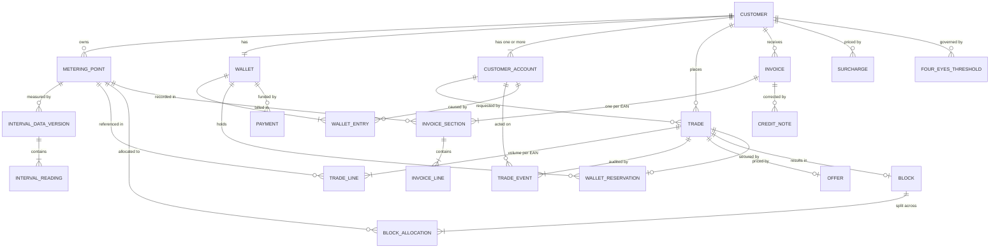

# Domain Model

Aggregates, entities, value objects and the invariants that hold them together.

---

## 1. Aggregate map



### 1.1 Aggregate roots and boundaries

| Aggregate root | Contains | Transaction boundary rationale |
| --- | --- | --- |
| **Customer** (company) | metering points, labels, **accounts** | Master data changes together |
| **Wallet** | entries, reservations | Balance invariants require a single lock |
| **Trade** | lines, offer, events | State machine and audit must be atomic |
| **Block** | allocations | Allocation sum invariant |
| **IntervalDataVersion** | readings | A document applies whole or not at all **[F02-R13]** |
| **Invoice** | sections, lines | Totals must be consistent with lines |
| **PeakCalendar** | excluded dates | Referenced by version, never mutated in place |
| **FourEyesThreshold** | — | Reference data **[DEC-33]**. Referenced by version, never mutated in place, so a threshold change cannot restate a past trade |

**Trade and Wallet are separate aggregates that commit together.** Accepting an offer changes both.
This is the one place where the "one aggregate per transaction" guideline is deliberately broken,
and it is the main reason for **[DEC-01]**: the alternative — eventual consistency between a trade
and the money securing it — would mean a customer could briefly hold an accepted trade with no funds
behind it.

## 2. Value objects

```csharp
public readonly record struct Money(decimal Amount, Currency Currency)
{
    public static Money Euro(decimal a) => new(a, Currency.EUR);
    public Money Add(Money o)  => Same(o) ? this with { Amount = Amount + o.Amount } : throw new CurrencyMismatch();
    public Money Round2()      => this with { Amount = Math.Round(Amount, 2, MidpointRounding.AwayFromZero) };
}

public readonly record struct Mw(decimal Value)
{
    public MWh OverIntervals(int count) => new(Value * count * 0.25m);
}

public readonly record struct MWh(decimal Value)
{
    public kWh ToKwh()               => new(Value * 1000m);
    public Money At(PricePerMwh p)   => Money.Euro(Value * p.Value);
}

/// Who performed an action. Immutable, and snapshotted at the moment it happened  [DEC-17].
public readonly record struct Actor
{
    public ActorType Type { get; init; }        // Customer | Employee | System
    public string Id { get; init; }             // account id, employee id, or "SYSTEM:offer-expiry-job"
    public string DisplayName { get; init; }    // "J. de Vries"
    public string? JobTitle { get; init; }      // "Energy Manager" — customers only, as at the time

    public static Actor Customer(CustomerAccount a) =>
        new() { Type = ActorType.Customer, Id = a.Id.ToString(),
                DisplayName = a.FullName, JobTitle = a.JobTitle };

    public static Actor System(string job) =>
        new() { Type = ActorType.System, Id = $"SYSTEM:{job}", DisplayName = job };
}

/// The four-eyes rule as resolved reference data, most specific scope wins  [DEC-33].
/// A null Threshold is an explicit "this scope never needs a second approver" —
/// it is not the same as no row, which is a configuration error.
public readonly record struct FourEyesPolicy(FourEyesThresholdVersionId Version, Money? Threshold)
{
    public bool RequiresApproval(Money tradeValue) =>
        Threshold is { } t && tradeValue.Amount > t.Amount;    // strictly greater than
}

public readonly record struct Iban
{
    public string Value { get; }
    private Iban(string v) => Value = v;

    public static Result<Iban> Create(string input)
    {
        var s = new string(input.Where(char.IsLetterOrDigit).ToArray()).ToUpperInvariant();
        if (s.Length < 15 || s.Length > 34)   return Result.Fail<Iban>("IBAN length is not valid");
        if (!ExpectedLengthFor(s[..2], out var len)) return Result.Fail<Iban>("Unknown IBAN country");
        if (s.Length != len)                  return Result.Fail<Iban>($"An IBAN for {s[..2]} has {len} characters");
        if (Mod97(s) != 1)                    return Result.Fail<Iban>("IBAN checksum is invalid");
        return Result.Ok(new Iban(s));
    }
}

public readonly record struct EanCode
{
    public string Value { get; }
    private EanCode(string v) => Value = v;

    public static Result<EanCode> Create(string input)
    {
        var digits = new string(input.Where(char.IsDigit).ToArray());
        if (digits.Length != 18)          return Result.Fail<EanCode>("EAN must be 18 digits");
        if (!HasValidCheckDigit(digits))  return Result.Fail<EanCode>("EAN check digit is invalid");
        return Result.Ok(new EanCode(digits));
    }
}

/// Half-open [Start, End) in Europe/Amsterdam.
public readonly record struct DeliveryPeriod(PeriodType Type, DateOnly Start, DateOnly End)
{
    public static DeliveryPeriod Month(int y, int m)   => …;
    public static DeliveryPeriod Quarter(int y, int q) => …;
    public static DeliveryPeriod Year(int y)           => …;
}
```

Why these exist: `Money.Add` cannot silently mix currencies, `Mw.OverIntervals` is the only route to
a volume so the 0.25 factor lives in one place, and `EanCode` cannot be constructed invalid. Each one
removes a class of bug rather than a line of code.

## 3. The Customer aggregate

A customer **is a company**. Accounts are entities inside it, not a separate aggregate, because an
account only ever exists in the context of one company and the two change together.

```csharp
public sealed class Customer : AggregateRoot
{
    public CustomerId Id { get; }
    public string LegalName { get; private set; }
    public string? TradeName { get; private set; }
    public KvkNumber Kvk { get; private set; }
    public VatNumber? Vat { get; private set; }
    public BankAccount Bank { get; private set; }        // Iban + Bic + holder name
    public Address BillingAddress { get; private set; }
    public Address? VisitingAddress { get; private set; }
    public ContactDetails PrimaryContact { get; private set; }
    public CustomerStatus Status { get; private set; }
    public Locale Locale { get; private set; }

    private readonly List<CustomerAccount> _accounts = [];
    public IReadOnlyList<CustomerAccount> Accounts => _accounts;
    public IEnumerable<CustomerAccount> ActiveAccounts => _accounts.Where(a => a.IsActive);

    public Result<CustomerAccount> AddAccount(Username u, PersonName n, string? jobTitle,
                                              string email, string? phone, Actor by);
    public Result DeactivateAccount(CustomerAccountId id, Actor by, string? reason);
}

public sealed class CustomerAccount : Entity
{
    public CustomerAccountId Id { get; }
    public CustomerId CustomerId { get; }
    public Username Username { get; }              // immutable after creation
    public PersonName Name { get; private set; }   // first + last
    public string? JobTitle { get; private set; }  // "role in the company" — descriptive only
    public string Email { get; private set; }
    public string? Phone { get; private set; }
    public AccountStatus Status { get; private set; }   // Invited | Active | Deactivated
    public ExternalSubjectId? SubjectId { get; private set; }  // set when the invitation is accepted
    public DateTimeOffset? LastLoginAt { get; private set; }

    public bool IsActive => Status == AccountStatus.Active;
    public string FullName => $"{Name.First} {Name.Last}";
    // No permission or role property. By design  [DEC-16].
}
```

### 3.1 Invariants

| # | Invariant | Enforced |
| --- | --- | --- |
| C1 | A customer has **at least one** account once it reaches `ACTIVE` | Guard on status transition |
| C2 | Usernames are unique **platform-wide**, not merely within a company | Unique index; checked by the application service across customers |
| C3 | `Username` is immutable after creation | `init`-only, no setter |
| C4 | An account is deactivated, never removed, so historical actors stay resolvable | No delete path |
| C5 | `JobTitle` grants nothing — no code branches on it | Enforced by review and by there being no permission type to branch to |
| C6 | The IBAN is structurally valid and passes mod-97 | `Iban.Create` is the only constructor |
| C7 | An account belongs to exactly one customer and cannot be moved | No setter for `CustomerId` |

## 4. The Trade aggregate

The most involved part of the model.

```csharp
public sealed class Trade : AggregateRoot
{
    public TradeId Id { get; }
    public CustomerId CustomerId { get; }
    public TradeDirection Direction { get; }        // Buy | Sell
    public BlockShape Shape { get; }                // Base | Peak
    public DeliveryPeriod Period { get; }
    public PeakCalendarVersionId CalendarVersion { get; }   // pinned at creation
    public TradeState State { get; private set; }
    public CustomerAccountId RequestedByAccountId { get; }  // denormalised for listing  [F05-R42]

    // ── four-eyes  [DEC-33] ─────────────────────────────────────────
    public CustomerAccountId? AcceptedByAccountId { get; private set; }   // set by Accept
    public CustomerAccountId? ApprovedByAccountId { get; private set; }   // set by Approve
    public FourEyesThresholdVersionId? ThresholdVersion { get; private set; } // pinned at acceptance
    public Money? ThresholdApplied { get; private set; }                  // the amount compared against

    private readonly List<TradeLine> _lines = [];
    public IReadOnlyList<TradeLine> Lines => _lines;

    private readonly List<TradeEvent> _events = [];
    public IReadOnlyList<TradeEvent> Events => _events;

    public Offer? Offer { get; private set; }
    public Mw TotalPower => new(_lines.Sum(l => l.Power.Value));

    // ── transitions ──────────────────────────────────────────────────
    public Result Submit(Actor by, string? comment, PriceIndicationSnapshot? indication);
    public Result Cancel(Actor by);
    public Result MakeOffer(Actor by, PricePerMwh price, TimeSpan window, IClock clock);
    public Result Decline(Actor by, string reason);
    public Result WithdrawOffer(Actor by, string reason);
    public Result Accept(Actor by, IClock clock, FourEyesPolicy policy);
                                                           // guard: now < ExpiresAt
                                                           // → Accepted, or AwaitingApproval  [DEC-33]
    public Result Reject(Actor by, string? reason);
    public Result Expire(IClock clock);                    // from Offered *or* AwaitingApproval
    public Result Approve(Actor by, IClock clock);         // guard: now < ExpiresAt
                                                           //  and  by.Id != AcceptedByAccountId
    public Result RefuseApproval(Actor by, string? reason); // terminal — ApprovalRefused
    public Result Confirm(Actor by, string? externalRef, PricePerMwh? actualMarketPrice);
    public Result Fail(Actor by, string reason);           // reason mandatory
}
```

### 4.1 Invariants

| # | Invariant | Enforced |
| --- | --- | --- |
| T1 | At least one line; every line has power > 0 | Constructor and `AddLine` |
| T2 | All lines reference metering points of the owning customer | Application service, checked against the token's `customer_id` |
| T2a | A customer `Actor` on any transition belongs to the owning customer — **any** of its accounts, not only the requester **[DEC-18]** | Application service, checked against the token's `account_id` and `customer_id` |
| T3 | `TotalPower` = Σ line power, exactly | Computed, never stored independently |
| T4 | State transitions follow the machine in [F05](../10-features/F05-energy-block-trading.md) §3; any other is rejected | `Result` failure, never an exception |
| T5 | `Decline`, `WithdrawOffer` and `Fail` require a non-empty reason | Guard in the method |
| T6 | `Accept` is only valid while `now < Offer.ExpiresAt` | Server clock **[DEC-13]** |
| T7 | Every transition appends exactly one `TradeEvent` | Single private `Transition()` helper |
| T8 | Terminal states admit no further transitions | State machine table |
| T9 | `CalendarVersion` is set at creation and never changes | `init`-only |
| T10 | `Approve` is rejected when the acting account equals `AcceptedByAccountId`. **Four eyes is two account ids, not a permission** — there is no role to check **[DEC-16]**, **[DEC-33]** | Guard in `Approve`; the acting account comes from the token, never the body |
| T11 | A trade in `AwaitingApproval` holds an **active reservation for the full trade value**, created by `Accept` and never re-created by `Approve` | Reservation is taken in the accept transaction, exactly as for `Accepted` |
| T12 | Leaving `AwaitingApproval` other than by `Approve` releases that reservation in the **same** transaction | `Expire` and `RefuseApproval` both call `ReleaseReservation` |
| T13 | `Approve` is only valid while `now < Offer.ExpiresAt`. **One clock governs the whole customer response** — there is no separate approval window **[DEC-13]**, **[DEC-33]** | Same guard and same job as `Accept` |
| T14 | `ThresholdVersion` and `ThresholdApplied` are set by `Accept` and never change | Pinned like `CalendarVersion`, for the same reason |

### 4.2 State transition table

Encoded as data so it is testable exhaustively, not as a `switch` statement. **[DEC-33]** takes the
set from ten tuples to **fourteen** and from eleven states to thirteen; the full set is restated
rather than appended to, because the exhaustive test asserts the whole of it:

```csharp
private static readonly FrozenSet<(TradeState From, TradeAction Action, TradeState To)> Allowed =
[
    (Draft,            Submit,         Requested),
    (Requested,        Cancel,         Cancelled),
    (Requested,        MakeOffer,      Offered),
    (Requested,        Decline,        Declined),
    (Offered,          Accept,         Accepted),          // value ≤ threshold
    (Offered,          Accept,         AwaitingApproval),  // value > threshold   [DEC-33]
    (Offered,          Reject,         Rejected),
    (Offered,          Expire,         Expired),
    (Offered,          Withdraw,       Withdrawn),
    (AwaitingApproval, Approve,        Accepted),          // [DEC-33]
    (AwaitingApproval, RefuseApproval, ApprovalRefused),   // [DEC-33]  terminal
    (AwaitingApproval, Expire,         Expired),           // [DEC-33]  reservation released
    (Accepted,         Confirm,        Confirmed),
    (Accepted,         Fail,           Failed),
];
```

13 states × 12 actions × 13 states = 2 028 combinations, of which exactly these 14 are permitted.
The test enumerates the whole cross-product and asserts membership, so a new state or action cannot
be added without the test being updated deliberately.

**Two tuples share `(Offered, Accept)`.** The set is a *containment* check, not a function, so this
does not make it ambiguous: the domain method computes its destination first and then asks whether
that destination is reachable. The destination is decided by one pure guard, evaluated inside the
accept transaction against the offer's total value:

```csharp
var destination = policy.RequiresApproval(offer.TotalValue)
    ? TradeState.AwaitingApproval
    : TradeState.Accepted;
```

`policy` is the effective **[DEC-33]** threshold resolved at that instant and then pinned on the
trade, so the branch is deterministic and reconstructable years later.

## 5. The Wallet aggregate

```csharp
public sealed class Wallet : AggregateRoot
{
    public WalletId Id { get; }
    public CustomerId CustomerId { get; }
    public Currency Currency { get; }

    public Money SettledBalance  { get; private set; }
    public Money ReservedAmount  { get; private set; }
    public Money AvailableBalance => SettledBalance.Subtract(ReservedAmount);

    public long LastSequence { get; private set; }

    public Result<WalletEntry> Credit(Money amount, EntryType type, EntryCause cause, Actor by, string description);
    public Result<WalletEntry> Debit (Money amount, EntryType type, EntryCause cause, Actor by, string description);
    public Result<Reservation> Reserve(Money amount, TradeId trade, Actor by);
    public Result              SettleReservation(ReservationId id, Actor by);
    public Result              ReleaseReservation(ReservationId id, Actor by, string reason);
}
```

### 5.1 Invariants

| # | Invariant | Note |
| --- | --- | --- |
| W1 | `SettledBalance` = Σ settled deltas of all entries | Verified by the reconciliation job **[F06-R09]** |
| W2 | `ReservedAmount` = Σ amounts of `ACTIVE` reservations | Same |
| W3 | `AvailableBalance` ≥ 0 after any customer-initiated operation | `Reserve` and `Debit` refuse otherwise **[AS-11]** |
| W4 | `SettledBalance` may go negative **only** via `INVOICE_DEBIT` | Entry type gate **[OQ-19]** |
| W5 | Every balance change produces exactly one entry | No path bypasses `Credit`/`Debit` |
| W6 | Sequence numbers are contiguous and monotonic per wallet | Assigned under the row lock |
| W7 | Entries are never modified or removed | Append-only, enforced in the database too |
| W8 | A reservation is settled or released exactly once | State guard |
| W9 | Reservation amounts are positive and never partially applied | Guard |

### 5.2 Entry shape

```csharp
public sealed record WalletEntry
{
    public long Sequence { get; init; }
    public EntryType Type { get; init; }
    public Money SettledDelta  { get; init; }     // 0 for reservation entries
    public Money ReservedDelta { get; init; }     // 0 for settlement entries
    public Money SettledAfter  { get; init; }     // snapshot
    public Money ReservedAfter { get; init; }
    public Money AvailableAfter{ get; init; }
    public EntryCause Cause { get; init; }        // typed link: Trade | Invoice | Payment | Manual
    public Actor CreatedBy { get; init; }
    public string Description { get; init; }
    public DateTimeOffset CreatedAt { get; init; }
}
```

Storing all three "after" balances makes the ledger self-describing: a row can be rendered without
replaying anything, and a mismatch is detectable by comparing consecutive rows.

## 6. Metering aggregate

```csharp
public sealed class IntervalDataVersion : AggregateRoot
{
    public MeteringPointId MeteringPointId { get; }
    public DateOnly DeliveryDate { get; }            // Amsterdam calendar day
    public FlowDirection Direction { get; }          // Consumption | Production
    public string DocumentIdentification { get; }    // PVNed GUID
    public DateTimeOffset DocumentCreatedAt { get; }
    public DateTimeOffset ReceivedAt { get; }        // ordering key [F02-R17]
    public bool IsCurrent { get; private set; }
    public IReadOnlyList<IntervalReading> Readings { get; }
}
```

| # | Invariant |
| --- | --- |
| M1 | Reading count equals the expected interval count for that date (96 / 92 / 100) |
| M2 | `Pos` values are contiguous from 1 with no gaps or duplicates |
| M3 | Quantities are non-negative (PVNed sends unsigned values) |
| M4 | Exactly one version is `IsCurrent` per (metering point, date, direction) |
| M5 | Supersession sets the previous current to false in the same transaction |
| M6 | A version is immutable once written |

## 7. Block aggregate

```csharp
public sealed class Block : AggregateRoot
{
    public BlockId Id { get; }
    public TradeId SourceTradeId { get; }
    public TradeDirection Direction { get; }
    public BlockShape Shape { get; }
    public DeliveryPeriod Period { get; }
    public PeakCalendarVersionId CalendarVersion { get; }
    public Mw Power { get; }
    public PricePerMwh Price { get; }
    public IReadOnlyList<BlockAllocation> Allocations { get; }
}
```

| # | Invariant |
| --- | --- |
| B1 | Σ allocation power = `Power`, **exactly** — no floating-point drift, no tolerance |
| B2 | Every allocation power > 0 |
| B3 | A block is created only from a `CONFIRMED` trade |
| B4 | A block is immutable; unwinding is a new `SELL` trade |
| B5 | `CalendarVersion` is inherited from the trade |

## 8. Domain services

| Service | Responsibility |
| --- | --- |
| `IMarketCalendar` | Interval ↔ timestamp, `Pos` mapping, `IsPeakInterval`, interval count per date, working days, delivery-period expansion. **The only place date arithmetic happens.** |
| `IBlockVolumeCalculator` | Block → total MWh, per-metering-point split, largest-remainder rounding |
| `IPositionCalculator` | Per-interval consumption, block volume, net position, coverage |
| `IInvoiceCalculator` | Full invoice from positions, prices, tariffs and surcharges |
| `IEnergyTaxCalculator` | Cumulative tiered tax with the YTD-delta method. ⚠ **Interface retained, not implemented — [DEC-24]** defers energiebelasting. Keep the seam so the calculation drops in rather than being retrofitted through the invoice engine; energiebelasting is a legal obligation and must return before a real customer is invoiced |

## 9. Domain events

In-process, published after a successful commit, handled asynchronously.

| Event | Handled by |
| --- | --- |
| `TradeOffered` | Notifications, SignalR push |
| `TradeAwaitingApproval` | Notifications to **every active account except the acceptor**, SignalR push to the desk **[DEC-33]** |
| `TradeApproved` | SignalR push to the trade desk — the trade has entered "to confirm" |
| `TradeApprovalRefused` | Notifications, SignalR push |
| `TradeAccepted` | SignalR push to the trade desk |
| `TradeConfirmed` | Block creation, notifications, chart cache invalidation |
| `TradeFailed` | Notifications |
| `WalletBalanceChanged` | Threshold rule evaluation **[F11](../10-features/F11-notifications.md)** |
| `IntervalDataVersionSuperseded` | Rollup rebuild, invoice-correction flagging |
| `InvoiceFinalised` | Odoo push, wallet debit, notification |
| `DayAheadPricesPublished` | Coverage cache invalidation |

**Published after commit, not during.** A handler must never be able to roll back the transaction
that caused it, and a failed notification must never undo a confirmed trade.

## 10. Notes on modelling choices

**Why `Trade` and `Block` are separate.** A trade is a negotiation with a history; a block is a
position with a volume. Most trades never become blocks. Merging them would mean carrying eleven
negotiation states on an entity whose main job is to answer "how much power do I have at 14:15 on 12
August".

**Why the approval state sits *after* acceptance, not before.** **[DEC-33]** requires a second pair
of eyes above a value threshold; it does not say where. The obvious alternative — a first account
"endorses" the offer and a second then accepts it — was rejected for three reasons. First, **the
money**: nothing is reserved until acceptance, so an endorsement pending for twenty minutes has no
claim on the balance, and an invoice debit or a second trade could empty it underneath. The control
would then fail at the last step for reasons that have nothing to do with governance. Second, **the
clock**: it would make answering an offer a two-step act, so **[DEC-13]**'s single guard would have
to be evaluated twice with two different meanings. Third, **what acceptance means**: today accepting
is the one atomic instant at which the customer commits and the money moves. Splitting it would
create a state in which the company has effectively said yes and nothing is held.

Placing the state after acceptance keeps all three properties. `Accept` still reserves, still in one
transaction, still under one clock; `AwaitingApproval` is simply an accepted trade that PeakPower may
not act on yet. And because `Approve` lands in `Accepted`, **`Accepted` keeps its meaning — fully
committed by the customer — and the trader's side of the machine is unchanged**: an unapproved trade
never reaches the "to confirm" queue, so there is no path by which PeakPower executes against an
un-approved commitment.

**Why `TradeEvent` rather than an audit table.** The brief requires the history to be a visible
product surface for both audiences. Making it the model's source of state — and projecting the
current state from it — means the audit cannot drift from reality **[DEC-06]**.

**Why allocations are on the block, not the trade.** Trade lines are the *request*; block allocations
are the *result*. They usually match, but the trader may confirm a different total, and keeping them
separate makes that visible rather than destructive.

**Why the calendar version is pinned.** **[DEC-19]** settles the peak-hour definition — Mon–Fri,
`08:00 ≤ t < 20:00` Europe/Amsterdam, holidays included, so the exclusion list is empty — but the
definition remains reference data **[DEC-14]** and could still change. Pinning means a calendar
correction in 2027 cannot silently restate a 2026 trade's volume.
