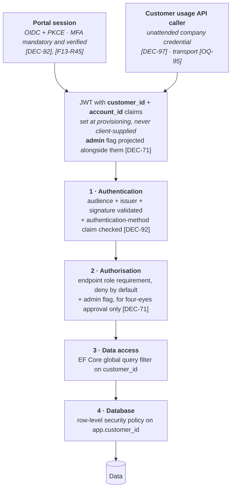

# Security

---

## 1. Threat model

What is actually worth protecting here, and from whom.

| Asset | Threat | Impact | Primary control |
| --- | --- | --- | --- |
| **Customer wallet balances** | Unauthorised movement, replay, race | Direct financial loss | Transactional integrity, idempotency, append-only ledger, reconciliation |
| **Cross-customer data** | Broken tenancy isolation | Competitor sees another's consumption and trading position — commercially serious and a GDPR breach | Token-derived `customer_id`, global query filter, row-level security, `404` not `403` |
| **Attribution integrity** | An action recorded against the wrong person, or against nobody | A trade cannot be traced to who authorised it; disputes become unresolvable | `account_id` from the token only; snapshot of name and job title on every event; accounts deactivated, never deleted |
| **Trade offers** | Manipulation of price or expiry | Financial loss, dispute | Server-side clock, state guards, immutable audit |
| **PVNed webhook** | Forged or replayed metering data | Wrong invoices across the whole customer base | Endpoint authentication, payload retention, versioning, anomaly detection |
| ⚠ **Amended 2026-08-19 by [DEC-69]** — read the row above as **BRP webhooks**, plural | A credential for BRP A used to post documents attributed to BRP B | Same impact, reached without stealing the right credential | The BRP is identified **by the credential that authenticated**, never by a field in the payload; one credential set per BRP, rotated per BRP — §4.1 |
| **Payment webhook** | Forged credit | Free money | Signature verification, idempotency, provider-side reconciliation |
| **Incoming-payment feed [DEC-106]** | A forged, replayed or altered credit line matching an open deposit intent | **A forged match credits real money.** The wallet is spendable on a trade the same second, no invoice is raised for a deposit **[F07-R27]** so there is no second document the fraud has to survive, and the withdrawal path **[DEC-83]** is a route back out to a bank account | Feed authentication (transport-dependent — **[OQ-93]**), idempotency on the **bank transaction id [F07-R25]**, amount taken from the feed and never from the intent, debit lines never actioned, unmatched queue rather than best-effort crediting — §4.3 |
| **Customer usage API [DEC-97]** | An unattended credential used to read another company's usage | Same impact as any tenancy break, reached by a caller with no human at the keyboard to notice | Same `customer_id` scope and same global query filter as the portal **[F13-R46]**; no priced data on the surface at all **[F13-R47]**; per-company rate limiting — §6.1 |
| **The bookkeeping push and its response [DEC-88]**, **[DEC-89]** | A tampered or spoofed response that returns an invoice number bound to the wrong draft | The platform displays a number it did not mint against amounts it did **[DEC-88]**; reconciliation between the two systems silently diverges | Mutual authentication, response bound to the pushed draft by external reference, a returned number never overwritten silently, every push and response audited — §5 |
| **The four-eyes approval path [DEC-71]** | Self-approval, or the admin flag set from a request | The one control over adding a bank account, executing a trade and withdrawing funds is bypassed by the person it exists to check | The approving `account_id` comes from the token and must differ from the requesting one; the admin flag is platform data set by a PeakPower employee **[DEC-16]**, never client-supplied — §3.3 |
| **Invoices** | Tampering post-finalisation | Fiscal and legal exposure | Immutability, gapless numbering, audit |
| ⚠ **Amended 2026-08-19 by [DEC-88]**, **[DEC-89]** | The platform no longer finalises, numbers or renders an invoice, so *this* row's threat largely moves with the document | The asset the platform still holds is the **calculated** invoice data and the number returned to it | Immutability and audit stay. **Gapless numbering leaves** — it is the bookkeeping program's property now, and the platform cannot assert it. §5, §9 |
| **Personal data** | Exfiltration | GDPR, reputation | Minimisation, encryption, access control, audit |
| **Employee accounts** | Credential compromise | Insider-level access to everything | MFA, least privilege, session limits, audit |
| **Customer accounts** | Credential compromise | Trading and withdrawal on someone else's money | ⚠ **Strengthened 2026-08-19 by [DEC-92]** — MFA is **mandatory** for customer users and the platform verifies the authentication-method claim rather than trusting the tenant **[F13-R45]**. Previously this row had no platform-side control at all — §3.1 |
| **Break-glass credentials [DEC-53]** | Theft of the hash, or misuse of the account by its holder | Authenticated employee access that bypasses the identity provider entirely | Named accounts only, disabled by default, Argon2id + peppered hashes, an independent second factor, alert on **every** use — §3.2 |

The two that keep the design honest are **wallet integrity** and **tenancy isolation**. Almost every
architectural rule in this set traces back to one of them.

⚠ **What the 2026-08-19 round did to the shape of this table.** The platform gave up invoicing
mechanics — numbering **[DEC-88]**, the PDF and its email **[DEC-89]**, VAT **[DEC-76]**, surcharges
**[DEC-73]**, chargebacks **[DEC-85]** and invoice payment matching **[DEC-109]** — and every one of
those was an asset with a control in it. It gained, in the same round, a path that **credits real
money on a match the platform makes itself [DEC-106]**, a path that **pays real money out by hand
[DEC-83]**, a second unattended read surface **[DEC-97]**, a second inbound credential population
**[DEC-69]**, and an intra-company approval control **[DEC-71]**. The net is not a smaller attack
surface. It is a differently-shaped one, weighted further towards **money movement** and away from
**document integrity**, and the controls above have moved with it.

⚠ **One exposure in this table has no control and is not the platform's to fix.** **[DEC-72]** permits
short selling. A short is a promise to deliver rather than a spend, so the prepaid rule **[AS-11]**
and the pre-trade balance check **[DEC-41]** — the two things that bound every other way a customer
can lose PeakPower money — do not bound it. No collateral or exposure limit is decided; it is
**[OQ-94]**, and it blocks the sell path rather than being mitigated here.

## 2. Tenancy isolation

Four layers. Any one of them failing should not expose data. **The layers themselves are unchanged by
the 2026-08-19 round** — what changed is that two caller populations now enter at the top instead of
one **[DEC-97]**, and that layer 2 has something to decide **[DEC-71]**.



```csharp
// Layer 3 — applied to every customer-owned entity, not opted into per query.
// The usage API [DEC-97] runs behind this same filter. It is a second caller
// population, never a second data path — no separate DbContext, no bypass.
protected override void OnModelCreating(ModelBuilder b)
{
    b.Entity<MeteringPoint>() .HasQueryFilter(x => x.CustomerId == _context.CustomerId);
    b.Entity<Trade>()         .HasQueryFilter(x => x.CustomerId == _context.CustomerId);
    b.Entity<Invoice>()       .HasQueryFilter(x => x.CustomerId == _context.CustomerId);
    b.Entity<Wallet>()        .HasQueryFilter(x => x.CustomerId == _context.CustomerId);
    b.Entity<DepositIntent>() .HasQueryFilter(x => x.CustomerId == _context.CustomerId); // [DEC-106]
    b.Entity<IntervalUsage>() .HasQueryFilter(x => x.CustomerId == _context.CustomerId); // [DEC-97]
}
```

⚠ **`Invoice` stays in that list under [DEC-88] and [DEC-89].** The platform no longer numbers,
renders or sends the document, but it keeps the **calculated** invoice data and the number returned to
it, shows both in the portal, and that data is as customer-scoped as it ever was. Losing the numbering
does not loosen the filter.

```sql
-- Layer 4 — the customer API connects as app_customer_role
SET LOCAL app.customer_id = '…';   -- set from the validated token, per request, per transaction
```

**Rules:**

1. `customer_id` is read from the token, never from a route, query string, body or header.
2. The customer API has **no** endpoint that accepts a customer identifier.
3. `account_id` is likewise read only from the token, and is used **for attribution, never for
   authorisation** — every account of a company has the same rights **[DEC-16]**. A client cannot
   name a colleague as the actor of its own request.
   ⚠ **Amended 2026-08-19 by [DEC-71].** The first and last clauses stand exactly as written:
   `account_id` still comes only from the token, and a client still cannot name a colleague. The
   middle clause — *never for authorisation* — is no longer literally true. Exactly one authorisation
   decision now reads the account: **may this account approve or refuse a four-eyes action?**, decided
   by an **admin** flag **[F13-R41]**. That is one bit, it is used for nothing else, and §3.3 says
   what it costs.
4. On every request, `account_id` is verified to belong to `customer_id` and to be `ACTIVE`. A
   mismatch is rejected and alerted — it means either a misconfigured claim mapping or an attack.
5. `IgnoreQueryFilters()` is banned in the customer API — enforced by an architecture test.
6. A request for an object belonging to another customer returns **`404`**, not `403`
   **[F13-R19]** — a `403` confirms the object exists.
7. The employee API connects as a different database role with no RLS policy, and every
   cross-customer read is audited.
8. **The customer usage API is inside these rules, not beside them [DEC-97].** It is a second caller
   population — unattended, with its own credential — reaching the same data through the same
   `customer_id` scope, the same global query filter **[F13-R46]** and the same RLS policy. It gets no
   endpoint that accepts a customer identifier (rule 2 applies verbatim), no `IgnoreQueryFilters()`
   (rule 5), and `404` rather than `403` (rule 6). ⚠ The tenancy test of §2.1 must enumerate its
   routes too, or the surface **[DEC-102]** now says nobody external will probe goes untested by
   anyone at all.
9. **The admin flag is platform data, never client input [DEC-71].** It is set and cleared by a
   PeakPower employee **[DEC-16]**, projected into the token **[F13-R43]**, and re-validated against
   the platform record on every request that reads it. A token claiming `admin` for an account the
   platform does not record as one is rejected and alerted, on the same footing as rule 4 — the flag
   is worth forging precisely because it is the whole of the four-eyes control.

⚠ **Row-level security needs database roles, and this document never mentions them** (added
2026-09-03). A superuser or a table owner **bypasses** RLS silently: with the APIs on the default
connection, every policy in this section is inert while every test still passes — the most expensive
kind of green. Migration 2 therefore creates `app_customer_role` and `app_employee_role`, plus two
non-owner **login** roles, and each host rewrites its connection string onto its own role. The
Migrator keeps the owner connection, because it must be able to create and alter the tables the
policies sit on.

Slice 1 is local-only with no deployment, so the two login passwords are literals in the migration
with a comment saying exactly that. **[OQ-102]** owns them before anything is deployed anywhere.

⚠ **This is also what makes a tenancy mutation honest.** Because the customer session drops every
authenticated request onto `app_customer_role`, a mutation that only defeats the EF query filter —
`IgnoreQueryFilters()` — leaks nothing: the database still refuses. A tenancy test that survives a
single-layer mutation has therefore proved nothing; a real leak has to suppress the role drop as
well, and any future mutation exercise must do both.

⚠ **Two tables are deliberately exempt from row-level security** (added 2026-09-03), and both are
named in the coverage guards rather than hidden from them — an exemption a guard can see is
reviewable, a table no guard ever looks at is not. `metering.ean_pool` is shared reference data with
**no `customer_id`**: an unclaimed entry belongs to nobody and must be visible to every customer at
once, and a **claimed row leaves the pool**, because the API only ever selects `claimed_at IS NULL`.
`customer.onboarding_application` has a **nullable `customer_id`** that is null for the whole life of
a draft, and **every path that reaches it is anonymous** — a prospect has no token, so there is no
`app.customer_id` to key a policy on; a row is addressed by its own id, a capability rather than a
query. [Database design §6](04-database-design.md) carries both reasons in full, with what reopens
each.

⚠ **Both coverage guards match a `CustomerId` *suffix*, not the exact name** (added 2026-09-03).
That is what makes `ean_pool.claimed_by_customer_id` visible to them; under the exact-name predicate
the table would have been invisible rather than exempt. `refresh_token` and `password_reset_token`
carry no `customer_id` at all — they are scoped by **account** — and are held to the same two-policy
bar by a separate account-owned discovery pass, not waved through.

### 2.1 The test that must exist

An integration test that, for every customer-API endpoint, authenticates as customer A and attempts
to reach an object owned by customer B, asserting `404`. It runs over a route table so a new endpoint
is covered automatically rather than by someone remembering.

⚠ **The route table must cover the usage API's routes as well [DEC-97].** They are a different host or
a different route prefix — possibly, if **[OQ-95]** resolves to file delivery, not HTTP routes at all
— so "it runs over a route table" stops being automatic the moment the second surface exists. Whatever
enumerates the portal's endpoints has to enumerate the usage API's, and the file-delivery variant needs
its own equivalent: a test that customer A's credential cannot read customer B's file.

## 3. Authentication & session

See [F13](../10-features/F13-identity-and-access.md). Summary:

| Control | Setting |
| --- | --- |
| Protocol | OIDC authorisation code + PKCE |
| Access token lifetime | ≤ 15 min |
| Refresh token | Rotating, reuse detection revokes the family |
| Employee MFA | **Mandatory** — and mandatory again, by an independent factor, on the break-glass path §3.2 |
| Customer MFA | ~~**Governed by Entra tenant policy, not by the platform [DEC-51]**~~ ⚠ **Amended 2026-08-19 by [DEC-92]** — **mandatory**. Enforced by Conditional Access on the corporate tenancy **[DEC-66]**, and **verified by the platform on the token's authentication-method claim** **[F13-R45]** rather than trusted silently. A token whose `amr` carries no accepted second-factor method establishes no session. §3.1 |
| Accepted `amr` values | **Configuration, not a constant [F13-R45]** — Entra's method identifiers change over time. Absent, empty or unrecognised **fails closed**, and every rejection is logged with its reason |
| Idle timeout | 30 min |
| Absolute session | 12 h |
| Token storage in SPA | In memory; refresh token in an `HttpOnly`, `Secure`, `SameSite=Strict` cookie |
| Realm separation | Distinct issuers and audiences; cross-audience tokens rejected |

Tokens are never placed in `localStorage`. The refresh cookie is scoped to the token endpoint path
only.

### 3.1 Customer MFA — [DEC-51], ⚠ **amended 2026-08-19 by [DEC-92]**, ⚠ **suspended 2026-09-03 by [DEC-119]**

#### 3.1.0 ⚠ None of this section is built, and the reason is not a shortcut — [DEC-119]

**[DEC-119]** removes the identity provider every paragraph below depends on. There is no Entra
tenant, no Conditional Access, no External ID customer tenant and no `amr` values emitted by anyone
but the platform itself. Concretely, and verified against the build rather than assumed:

- the customer access token carries `amr: ["pwd"]` — a password, which **is not a second factor**;
- **nothing rejects on `amr`.** The claim is issued and read by no one; there is no accepted-method
  set, no configuration for one, and no fail-closed path;
- **[F13-R45]** is therefore recorded but **not built**, and **[DEC-92]**'s mandatory MFA has nothing
  enforcing it at either end.

This is a **suspension with a stated cost, not a reversal**: the requirement stands, the mechanism is
absent, and the text below is kept because it is what has to be reinstated — not rewritten — the day
an identity provider exists. Whoever reinstates it is also reinstating the *enrolment* obligation
[DEC-92] accepted, which nothing in slice 1 has paid. **[OQ-98]** owns the credential-policy values
that are, for now, the only sign-in control there is.

**Read §3.1.1 first; the original text below it is kept because the distinction it draws — between
*enforcing* MFA and *implementing* it — is the distinction [DEC-92] preserves.**

#### 3.1.1 MFA is mandatory, and the platform stops taking the tenant's word for it — [DEC-92]

**[DEC-92]** amends **[DEC-51]** and reopens-then-closes [OQ-43] with the opposite answer to the one
recorded below: **MFA is mandatory for every customer user.** Two things about *how* are worth being
exact about, because only one of them changed.

| | Before **[DEC-51]** | After **[DEC-92]** |
| --- | --- | --- |
| Is MFA required of customer users? | Whatever the tenant policy says, including "no" | **Yes. Mandatory, with no per-customer exemption** |
| Who enforces it at sign-in? | The Entra tenant, or nobody | **Still the Entra tenant** — Conditional Access on PeakPower's corporate tenancy **[DEC-66]** |
| Does the platform implement MFA? | No — no setting, no enrolment, no step-up | **Still no.** No MFA screen, no enrolment flow, no step-up path, no per-customer override |
| What does the platform do with `amr`? | Records it as evidence, and acts on nothing | **Gates on it [F13-R45].** A token with no accepted second-factor method is rejected and no session is established. Recording continues unchanged |
| What happens if the tenant policy is weakened? | Invisible from inside the platform; weak sessions succeed | **Weak sessions fail closed at the platform**, and every rejection is logged with its reason **[F15](../10-features/F15-audit-and-observability.md)** |

**The control has come back inside the control surface — partly, and it is worth being precise about
which part.** The platform still cannot *cause* a second factor to be collected: if Conditional Access
does not ask for one, nobody is prompted and the user simply cannot sign in. What it can now do is
refuse to proceed on a first-factor-only token, which converts a silent weakening of the tenant policy
from an invisible risk into a visible outage. That is a deliberate trade, and it is the right way
round: a lockout is diagnosable in minutes, a fleet of single-factor sessions is not diagnosable at
all.

**What it costs, stated rather than glossed:**

| Cost | Detail |
| --- | --- |
| Onboarding friction | Every customer user enrols a second factor before they can do anything. **[DEC-92]** accepts this explicitly. It lands on **[DEC-16]**'s account-creation flow, which is PeakPower employees creating accounts for people they then have to walk through enrolment |
| A coupling to somebody else's configuration | A Conditional Access change, or Entra renaming an `amr` value, locks customers out of a financial platform. This is why the accepted method set is **configuration [F13-R45]** and not a constant, and why §10 makes verifying it a go-live item rather than an assumption |
| A support path that must not become an exemption | The only correct fix for "I cannot sign in" is fixing the factor or the policy. There is **no platform switch** to let a user past, deliberately — building one would reverse **[DEC-92]** in code while leaving it standing in prose |

⚠ **What did *not* change:** everything in the table below about the platform not prompting, not
enrolling, not stepping up and not exempting. **[DEC-92]** adds a gate on evidence; it does not make
the platform an MFA implementation.

#### 3.1.2 The original position — [DEC-51], superseded on the mandatory/optional question only

**[DEC-51]** closes [OQ-43] by moving the question rather than answering it in the platform: customer
MFA is whatever the Entra tenant policy says it is. **The platform neither enforces it nor exempts
anyone from it.** There is no MFA setting in the customer portal, no per-customer override, and no
code path that refuses a session for lack of a second factor.

| The platform does | The platform does not |
| --- | --- |
| Read the **`amr`** claim and record it on the session and in the audit trail — evidence of how the subject authenticated | Require a particular `amr` value before granting access |
| Surface, in the employee portal, which customer sessions were multi-factor and which were not | Prompt, step up, enrol or exempt |
| Alert if `amr` is **absent** from a token that should carry it — that is a claim-mapping fault, not a policy statement | Treat a missing `amr` as "no MFA" and act on the inference |

⚠ **Record this as what it is: a security control that has left the control surface.** The platform
can be configured perfectly and still see unauthenticated-strength sessions if the tenant policy is
weak, and it cannot detect or correct that from the inside — `amr` is evidence of what happened, not
a guarantee of what is required. Two consequences follow. The tenant policy belongs in the
pre-go-live checklist (§10) as a thing to *verify with the tenant owner*, not to configure. And if
the answer ever needs to be platform-enforced — a customer contract requiring MFA, say — that is a
new decision reversing **[DEC-51]**, not a setting.

⚠ **That new decision arrived: it is [DEC-92], on 2026-08-19.** The last sentence above was written as
a hypothetical and is now a description of what happened. The checklist item survives in a changed
form — the tenant policy is still verified with the tenant owner (§10), because Conditional Access is
still where enforcement lives — but it is no longer the *only* thing standing between a weak tenant
policy and a single-factor session. §3.1.1.

Employee MFA is unaffected and stays **mandatory**. It is inside the control surface because the
employee realm is PeakPower's own.

### 3.2 Break-glass — a bounded exception, not a reversal [DEC-53]

**[DEC-53] amends [DEC-29].** The platform now hashes and stores passwords for a **small set of named
employee accounts**, usable **only** when the identity provider is unavailable. This is a deliberate,
bounded exception to "the platform never stores a password" and it is worth being exact about its
edges:

| | Before **[DEC-53]** | After |
| --- | --- | --- |
| Customers | Provider-authenticated, no stored credential | **Unchanged.** Fully provider-authenticated **[DEC-29]** |
| Employees, normal path | Provider-authenticated | **Unchanged** |
| Employees, IdP unavailable | No route in | A named break-glass account, disabled by default |

There is **no customer break-glass**, no self-service reset, no lockout policy and no credential
storage on the customer side. **[DEC-29] stands** for every account the platform has, except the
handful enumerated below.

#### Non-negotiable constraints — [DEC-53]

| # | Constraint | How it is met |
| --- | --- | --- |
| 1 | **Named accounts only** | One credential per named employee. No shared "admin" account, no service account, no generic `breakglass` login — an unattributable emergency login defeats the audit trail that the rest of this document exists to protect **[DEC-17]** |
| 2 | **Disabled by default** | Each account carries an `enabled_until timestamptz`, `NULL` when disabled. Authentication is refused unless `now() < enabled_until`, and the box reverts to disabled on expiry with no action **[F13-R34]**. Enabling is an explicit, audited action by a **second** named administrator. ⚠ **The duration is deliberately not set here** — **[DEC-53]** does not state one and **[F13-R34]** ships no default, for the same reason as the four-eyes threshold: a guessed window is either too short to survive an incident or long enough to be a standing account. It must be configured before the path is first enabled |
| 3 | **A second factor that does not depend on the identity provider** | TOTP (RFC 6238), seed generated by the platform and encrypted at rest, **or** a FIDO2 security key registered directly with the platform **[F13-R36]**. Explicitly **not** Entra MFA, not a push through the IdP app, and not SMS to a number held in the Entra directory — all three fail in exactly the outage this path exists for |
| 4 | **Every use alerted and audited** | §3.2.3, **[F13-R37]** |
| 5 | **Rehearsed** | §3.2.4, **[F13-R39]**. An unrehearsed break-glass path is not a break-glass path — it is an untested assumption with a password attached |
| 6 | **Least privilege inside the session** | A break-glass session grants the minimum function set needed to run through an outage and **never more than that employee's normal roles [F13-R38]**. No customer-portal access, no acting on a customer's behalf. ⚠ The function set is itself unspecified by **[DEC-53]**; until it is decided with operations, the safe reading is read-only plus the specific actions an incident requires |
| 7 | **Its own lockout, and a kill switch** | Rate limiting, lockout and breach procedure independent of anything the provider does, plus a **documented and practised way to disable every break-glass account at once** on suspicion of compromise **[F13-R40]** |

#### 3.2.1 Credential storage

| Property | Setting |
| --- | --- |
| KDF | **Argon2id** — memory-hard, the current OWASP recommendation, and the only class of algorithm that makes GPU cracking expensive |
| Parameters | `m = 256 MiB`, `t = 4`, `p = 2`, 32-byte output, 16-byte per-credential random salt. **Far above interactive-login norms on purpose**: these credentials are verified a handful of times a year, so login latency is not a constraint and there is no reason to buy anything with the cost parameters except difficulty |
| Pepper | The password is HMAC-SHA-256'd with a server-side key from Key Vault **before** hashing, so a database dump alone yields nothing crackable. The key is **HSM-backed and loaded at host startup** — see the caveat in §3.2.5 |
| Generation | Machine-generated, ≥ 128 bits of entropy. **Never user-chosen**: a memorable password on the one account that bypasses the identity provider is the worst place in the system for one |
| Distribution | Sealed and held offline (physical safe or sealed envelope), one holder per named account. Not in a password manager that authenticates against Entra |
| Failed attempts | 5 consecutive failures lock the account and **page immediately**. There is no self-service unlock |
| Algorithm agility | The stored record carries its KDF and parameters, so a future re-hash is a migration rather than a rewrite |
| Where it lives | ⚠ **Not yet decided, and it should be decided explicitly.** [Database design](04-database-design.md) has no identity schema — until **[DEC-53]** the platform stored no credential at all — and **[F13-R33]** says the account set is "enumerated in configuration", which reads as *not* a table. Two placements work: a small table (name, hash, KDF parameters, second-factor enrolment, `enabled_until`, rotation timestamps) with `REVOKE` on every role but the one that authenticates; or the hashes in Key Vault with the enumeration in configuration. **The constraint that decides it is §3.2.5**: whichever is chosen must be verifiable by a running host with no live Key Vault call and no Azure control-plane access |

#### 3.2.2 Rotation

| Trigger | Action |
| --- | --- |
| **On every use** | The credential is rotated immediately afterwards, without exception. A break-glass password that has been used once is a password that has been read aloud, typed on an unknown machine, or photographed |
| Quarterly | Rotated as part of the drill — **the rehearsal is the rotation**, which is what stops the schedule from being the first thing to lapse |
| Personnel change | Immediate revocation on any change affecting a named holder, on the same day as the normal offboarding step |
| Suspicion | Immediate rotation and an incident record; no threshold of proof is required to rotate |

#### 3.2.3 The alert

**Every authentication attempt on the break-glass path raises a P1 page** — success and failure
alike, and enablement as well as use. Four properties matter:

1. **It routes through the monitoring path** (Azure Monitor → pager, [Deployment](09-deployment.md)
   §7), **not** through the platform's own notification outbox and not through SendGrid. An alert
   that travels over the machinery that may be broken is not an alert.
2. **It goes to a group, never only to the person using the account.** The point of the alert is that
   somebody other than the actor knows.
   ⚠ **[DEC-104] makes this harder than it reads.** A single named operator runs the platform after
   go-live, with no rota. If that operator is also a break-glass holder, "a group" is one person and
   the alert reaches only the actor — which is exactly the property this point exists to prevent. The
   recipient group therefore has to include somebody who is **not** an operator, and that person has
   to be named before the first drill. This is a routing requirement, not a staffing one, and it is
   the cheapest half of the single-point-of-failure risk **[DEC-104]** records.
3. **It fires on enablement too**, so the window between "enabled" and "used" is visible. An account
   enabled and never used is as interesting as one used.
4. **It is audited like every other security event** (§9), with the account name, source IP, the
   second-factor method and the enabling employees. Break-glass sessions are additionally marked on
   every audit record they produce, so any action taken during one is identifiable afterwards as
   having happened outside the normal identity path.

#### 3.2.4 Rehearsal

**At least twice a year and after any change to the path [F13-R39]** — scheduled here **quarterly**,
alongside the backup-restore drill (§8), because it is the same discipline for the same reason: **an
untested recovery path is a hypothesis.** The drill:

- runs end to end in the test environment — enable, authenticate, second factor, act, disable;
- includes a **production dry run of the procedure** as far as enablement, so the runbook's first
  five minutes are known to work against production configuration;
- rotates the credential as its final step (§3.2.2);
- is signed off by a named owner, and a **failed or skipped drill is an incident**, not a to-do.

#### 3.2.5 ⚠ The dependency this does not remove

Honest limitation, and it must be rehearsed rather than assumed away: **the platform's identity
provider is Entra ID [DEC-20], and Azure's own control plane also authenticates against Entra.** The
two failure modes are not the same and only one is fully covered:

| Failure | Covered? |
| --- | --- |
| The platform's app registration, claim mapping or sign-in flow is broken; Entra itself is healthy | **Yes.** This is the common case and the one **[DEC-53]** is really for |
| Entra is globally unavailable | **Partly.** The Azure portal, Key Vault access via managed identity and the deployment pipeline may be impaired at the same time |

Two design consequences follow, and both are requirements rather than observations:

- **Enablement must be a data action, not an Azure control-plane action.** The `enabled_until` flag
  is a row in the platform's own database, reachable by a running host. If enabling break-glass
  requires signing in to the Azure portal, the path does not work in the outage it was built for.
- **The pepper must already be in memory.** Key Vault is read at host startup and cached; a running
  host must not need a fresh Key Vault fetch to verify a break-glass credential. A host that restarts
  during a global Entra outage may not recover the key, which is a scenario the drill must include
  and the runbook must answer.

This is a smaller claim than "break-glass means the platform always lets us in", and it is the true
one.

## 4. Inbound integration security

### 4.1 PVNed webhook

The highest-risk unauthenticated-by-default surface in the system: forged metering data would corrupt
invoices across the entire customer base, and it would look like a data quality problem for weeks.

| Control | Detail |
| --- | --- |
| Transport | TLS 1.3 |
| Authentication | mTLS preferred; shared secret header as a fallback; both supported **[OQ-05]** |
| Network | IP allow-list where PVNed can supply stable egress addresses |
| Payload limit | 25 MB, rejected above **[F02-R06]** |
| XXE / entity expansion | External entity resolution and DTD processing **disabled** on the XML reader — non-negotiable for an XML endpoint |
| Schema validation | Against the pinned XSD before any interpretation |
| Rate limiting | 60/min, burst 200. ⚠ **Sized against the metering-point count, not left at this default** — **[DEC-38]** makes the normal load one document per EAN per day, so 500 metering points arriving in a tight window would be throttled as an attack. See [Database design §2.1](04-database-design.md) |
| Retention | Raw payloads kept for dispute resolution and replay |
| Anomaly detection | Volume deviating more than a configured factor from the trailing average for that metering point raises an alert rather than silently superseding |

The anomaly check is the control that catches a forged or badly-corrupted document that passes every
structural test.

### 4.2 Payment webhook

| Control | Detail |
| --- | --- |
| Signature | HMAC verified against the provider secret; unverified callbacks rejected and logged **[F07-R05]** |
| Idempotency | Keyed on the provider payment id **[F07-R06]** |
| Amount validation | Checked against the originating payment record; a mismatch is quarantined, never credited |
| Independent verification | Reconciliation job queries the provider directly rather than trusting only the callback |

## 5. Outbound integration security

| Integration | Controls |
| --- | --- |
| Montel | Credentials in the secret store, rotated; TLS verified; responses schema-validated |
| Odoo | Service account with the minimum object rights; TLS; retries never duplicate a document (external reference is the key) |
| Email — **SendGrid [DEC-48]** | Dedicated signed sending domain (SPF, DKIM, **DMARC at `p=reject`**); API key in Key Vault, scoped to send only, rotated; no tokens, credentials or invoice attachments-by-link that bypass authentication in message bodies. **[DEC-47]** puts invoices on this channel, so a spoofable sending domain is now an invoice-fraud surface, not only a deliverability problem |
| Identity provider | Client secret in the secret store; JWKS cached with a bounded TTL |

## 6. Application security

| Area | Control |
| --- | --- |
| Input validation | FluentValidation at the boundary; domain invariants behind it |
| SQL injection | Parameterised everywhere; EF Core or Dapper with parameters, never string concatenation |
| XSS | Angular's default escaping; `bypassSecurityTrust*` banned; strict CSP |
| CSRF | Bearer tokens for the API; the refresh cookie is `SameSite=Strict` and its endpoint requires a custom header |
| Headers | HSTS with preload, CSP, `X-Content-Type-Options`, `Referrer-Policy`, `Permissions-Policy` |
| Dependencies | Dependabot / Renovate; `dotnet list package --vulnerable` and `npm audit` gate the build |
| Secrets | Azure Key Vault via managed identity; no secrets in code, config files or environment variables in source control |
| File uploads | None in the first release. If added, out-of-band scanning and content-type validation |
| Error responses | Problem details with no stack traces, no SQL, no internal identifiers on the customer API |

## 7. Data protection

| Class | Examples | Handling |
| --- | --- | --- |
| **Personal** | Contact name, email, phone | Encrypted at rest (database-level), access audited, minimised in logs |
| **Commercially sensitive** | Consumption profiles, positions, prices, balances | Strict tenancy isolation; never in logs |
| **Financial** | Ledger, invoices | Immutable, audited, retained 7 years |
| **Secrets** | API credentials, signing keys | Key Vault, rotated, never logged |
| **Operational** | Correlation ids, metrics | Freely logged |

### 7.1 GDPR

| Right | Handling |
| --- | --- |
| Access | Export of a customer's data via the employee portal |
| Rectification | Master-data edit with audit |
| Erasure | Personal identifiers pseudonymised; financial, trade and invoice records retained under the legal-obligation basis (fiscal retention). The customer is told which data is retained and why |
| Portability | CSV / JSON export |
| Restriction | Account suspension |

Processing bases: **contract** for platform operation, **legal obligation** for invoicing and fiscal
retention, **legitimate interest** for security logging. A processor agreement is required with every
third party that touches personal data — PVNed, the payment provider, the identity provider, the
email provider and the cloud provider. **[OQ-58]**

### 7.2 Encryption

| State | Control |
| --- | --- |
| In transit | TLS 1.3, minimum 1.2; internal service-to-service also TLS |
| At rest | Database and object storage encryption with **platform-managed keys [DEC-52]** — closing [OQ-59]. **No customer-managed keys**, so there is no per-customer key hierarchy, no BYOK onboarding step and no customer-triggered key revocation to design around |
| Application-level | The break-glass second-factor seed and the credential pepper, under Key Vault keys — §3.2.1 |
| Backups | Encrypted, same key management |

## 8. Operational security

| Control | Detail |
| --- | --- |
| Least privilege | Distinct database roles per host: `app_customer_role`, `app_employee_role`, `app_worker_role`, `app_migrator_role` |
| Production access | No standing human access to the production database. Break-glass is time-limited, approved and fully audited |
| Two different break-glass paths | ⚠ **They share a name and nothing else.** *Database* break-glass grants a human a time-limited connection to production data. *Authentication* break-glass **[DEC-53]** grants a named employee a platform session when the identity provider is unavailable — §3.2. Separate credentials, separate approvals, separate alerts, separate drills. Do not let one runbook cover both |
| Deployment | No manual deploys; everything through the pipeline with an audit trail |
| Infrastructure | Infrastructure as code, reviewed like application code |
| Backups | Point-in-time recovery, restore tested quarterly — an untested backup is a hypothesis |
| Vulnerability management | Dependency scanning in CI, base image rebuilds monthly, penetration test before go-live **[OQ-60]** |
| Incident response | Documented procedure, named owners, 72-hour GDPR breach notification path |

## 9. Audit

Every security-relevant event is recorded in the audit trail **[F15](../10-features/F15-audit-and-observability.md)**:
sign-in and sign-out, failed authorisation, role changes, impersonation start and end, cross-customer
reads by employees, manual wallet adjustments, reference-data changes, invoice finalisation, and
message replay.

Audit records are append-only, retained per **[OQ-48]**, and cannot be deleted by any application
path.

## 10. Pre-go-live security checklist

- [ ] Tenancy isolation test covers every customer-API endpoint automatically
- [ ] `IgnoreQueryFilters` architecture test passing
- [ ] Row-level security enabled and verified on every customer-owned table
- [ ] XXE disabled and tested on the PVNed endpoint
- [ ] Payment webhook signature verification tested with a forged payload
- [ ] Idempotency verified on every state-changing endpoint
- [ ] Rate limits verified under load
- [ ] Secrets confirmed absent from source control, images and logs
- [ ] Log redaction verified for tokens, credentials and personal data
- [ ] MFA enforced for all employee accounts
- [ ] Entra **tenant** MFA policy for customer users confirmed **with the tenant owner** — the platform cannot enforce it **[DEC-51]**, §3.1
- [ ] `amr` claim present, recorded and surfaced; an absent `amr` alerts as a mapping fault
- [ ] Break-glass procedure documented and rehearsed
- [ ] Break-glass accounts named, enumerated, and **disabled** (`enabled_until IS NULL`) in production **[DEC-53]**
- [ ] Break-glass hashes verified as Argon2id at the agreed parameters, with the pepper applied
- [ ] Break-glass second factor verified to work with the identity provider unreachable
- [ ] Alert on break-glass enablement **and** use tested end to end, over the monitoring path
- [ ] Break-glass drill completed at least once, including the credential rotation that ends it
- [ ] Backup restore rehearsed end to end
- [ ] External penetration test completed and findings closed
- [ ] Processor agreements signed with every third party

## 11. Open questions

| Ref | Question |
| --- | --- |
| [OQ-05] | PVNed endpoint authentication mechanism |
| [OQ-31] | Segregated client account for wallet funds, and any resulting regulatory obligations |
| ~~[OQ-43]~~ | ~~Mandatory MFA for customer users?~~ **Closed by [DEC-51]** — governed by Entra tenant policy. The platform neither enforces nor exempts; it reads `amr` as evidence. ⚠ Recorded in §3.1 as a control that has left the platform's control surface |
| ~~[OQ-44]~~ | ~~Break-glass procedure if the identity provider is unavailable~~ **Closed by [DEC-53]**, which **amends [DEC-29]** — §3.2. Residual, and named there rather than left implied: the Entra-global-outage case is only partly covered (§3.2.5) |
| [OQ-58] | Who owns the DPIA and the processor agreements? **[DEC-48]** adds SendGrid to the list |
| ~~[OQ-59]~~ | ~~Are customer-managed encryption keys required?~~ **Closed by [DEC-52]** — no. Platform-managed keys at rest |
| [OQ-60] | Is an external penetration test budgeted before go-live? |
| *(new, from **[DEC-53]**)* | Who holds the sealed break-glass credentials, and where? The mechanism is specified in §3.2; the custody arrangement is an operational decision with a named owner, and it must exist before the first drill |
| *(new, from **[DEC-53]**)* | Does the break-glass credential store live in the database or in Key Vault with the enumeration in configuration **[F13-R33]**? Either satisfies **[DEC-53]**; §3.2.1 states the constraint that decides it. Also unanswered by **[DEC-53]**: the enablement time-box **[F13-R34]** and the session's function set **[F13-R38]** |
