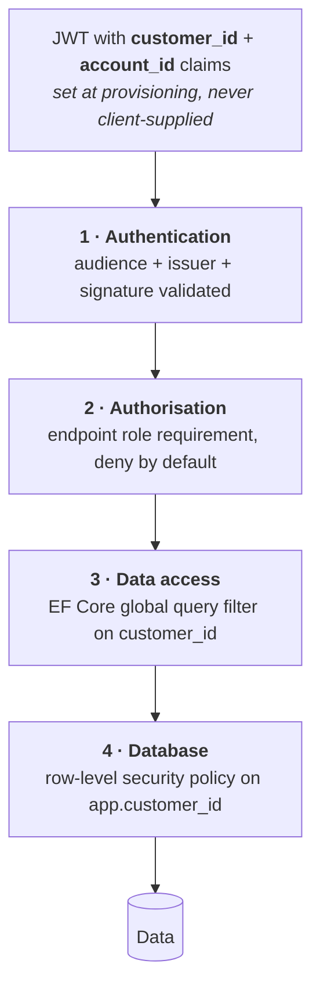

# Security

---

## 1. Threat model

What is actually worth protecting here, and from whom.

| Asset | Threat | Impact | Primary control |
| --- | --- | --- | --- |
| **Customer wallet balances** | Unauthorised movement, replay, race | Direct financial loss | Transactional integrity, idempotency, append-only ledger, reconciliation |
| **Cross-customer data** | Broken tenancy isolation | Competitor sees another's consumption and trading position — commercially serious and a GDPR breach | Token-derived `customer_id`, global query filter, row-level security, `404` not `403` |
| **Attribution integrity** | An action recorded against the wrong person, or against nobody | A trade cannot be traced to who authorised it; disputes become unresolvable | `account_id` from the token only; snapshot of name and job title on every event; accounts deactivated, never deleted |
| **Trade offers** | Manipulation of price or expiry | Financial loss, dispute | Server-side clock, state guards, immutable audit |
| **PVNed webhook** | Forged or replayed metering data | Wrong invoices across the whole customer base | Endpoint authentication, payload retention, versioning, anomaly detection |
| **Payment webhook** | Forged credit | Free money | Signature verification, idempotency, provider-side reconciliation |
| **Invoices** | Tampering post-finalisation | Fiscal and legal exposure | Immutability, gapless numbering, audit |
| **Personal data** | Exfiltration | GDPR, reputation | Minimisation, encryption, access control, audit |
| **Employee accounts** | Credential compromise | Insider-level access to everything | MFA, least privilege, session limits, audit |

The two that keep the design honest are **wallet integrity** and **tenancy isolation**. Almost every
architectural rule in this set traces back to one of them.

## 2. Tenancy isolation

Four layers. Any one of them failing should not expose data.



```csharp
// Layer 3 — applied to every customer-owned entity, not opted into per query
protected override void OnModelCreating(ModelBuilder b)
{
    b.Entity<MeteringPoint>().HasQueryFilter(x => x.CustomerId == _context.CustomerId);
    b.Entity<Trade>()        .HasQueryFilter(x => x.CustomerId == _context.CustomerId);
    b.Entity<Invoice>()      .HasQueryFilter(x => x.CustomerId == _context.CustomerId);
    b.Entity<Wallet>()       .HasQueryFilter(x => x.CustomerId == _context.CustomerId);
}
```

```sql
-- Layer 4 — the customer API connects as app_customer_role
SET LOCAL app.customer_id = '…';   -- set from the validated token, per request, per transaction
```

**Rules:**

1. `customer_id` is read from the token, never from a route, query string, body or header.
2. The customer API has **no** endpoint that accepts a customer identifier.
3. `account_id` is likewise read only from the token, and is used **for attribution, never for
   authorisation** — every account of a company has the same rights **[DEC-16]**. A client cannot
   name a colleague as the actor of its own request.
4. On every request, `account_id` is verified to belong to `customer_id` and to be `ACTIVE`. A
   mismatch is rejected and alerted — it means either a misconfigured claim mapping or an attack.
5. `IgnoreQueryFilters()` is banned in the customer API — enforced by an architecture test.
6. A request for an object belonging to another customer returns **`404`**, not `403`
   **[F13-R19]** — a `403` confirms the object exists.
7. The employee API connects as a different database role with no RLS policy, and every
   cross-customer read is audited.

### 2.1 The test that must exist

An integration test that, for every customer-API endpoint, authenticates as customer A and attempts
to reach an object owned by customer B, asserting `404`. It runs over a route table so a new endpoint
is covered automatically rather than by someone remembering.

## 3. Authentication & session

See [F13](../10-features/F13-identity-and-access.md). Summary:

| Control | Setting |
| --- | --- |
| Protocol | OIDC authorisation code + PKCE |
| Access token lifetime | ≤ 15 min |
| Refresh token | Rotating, reuse detection revokes the family |
| Employee MFA | Mandatory |
| Customer MFA | Supported; mandatory per **[OQ-43]** |
| Idle timeout | 30 min |
| Absolute session | 12 h |
| Token storage in SPA | In memory; refresh token in an `HttpOnly`, `Secure`, `SameSite=Strict` cookie |
| Realm separation | Distinct issuers and audiences; cross-audience tokens rejected |

Tokens are never placed in `localStorage`. The refresh cookie is scoped to the token endpoint path
only.

## 4. Inbound integration security

### 4.1 PVNed webhook

The highest-risk unauthenticated-by-default surface in the system: forged metering data would corrupt
invoices across the entire customer base, and it would look like a data quality problem for weeks.

| Control | Detail |
| --- | --- |
| Transport | TLS 1.3 |
| Authentication | mTLS preferred; shared secret header as a fallback; both supported **[OQ-05]** |
| Network | IP allow-list where PVNed can supply stable egress addresses |
| Payload limit | 25 MB, rejected above **[F02-R06]** |
| XXE / entity expansion | External entity resolution and DTD processing **disabled** on the XML reader — non-negotiable for an XML endpoint |
| Schema validation | Against the pinned XSD before any interpretation |
| Rate limiting | 60/min, burst 200 |
| Retention | Raw payloads kept for dispute resolution and replay |
| Anomaly detection | Volume deviating more than a configured factor from the trailing average for that metering point raises an alert rather than silently superseding |

The anomaly check is the control that catches a forged or badly-corrupted document that passes every
structural test.

### 4.2 Payment webhook

| Control | Detail |
| --- | --- |
| Signature | HMAC verified against the provider secret; unverified callbacks rejected and logged **[F07-R05]** |
| Idempotency | Keyed on the provider payment id **[F07-R06]** |
| Amount validation | Checked against the originating payment record; a mismatch is quarantined, never credited |
| Independent verification | Reconciliation job queries the provider directly rather than trusting only the callback |

## 5. Outbound integration security

| Integration | Controls |
| --- | --- |
| Montel | Credentials in the secret store, rotated; TLS verified; responses schema-validated |
| Odoo | Service account with the minimum object rights; TLS; retries never duplicate a document (external reference is the key) |
| Email | Signed sending domain (SPF, DKIM, DMARC); no tokens or credentials in message bodies |
| Identity provider | Client secret in the secret store; JWKS cached with a bounded TTL |

## 6. Application security

| Area | Control |
| --- | --- |
| Input validation | FluentValidation at the boundary; domain invariants behind it |
| SQL injection | Parameterised everywhere; EF Core or Dapper with parameters, never string concatenation |
| XSS | Angular's default escaping; `bypassSecurityTrust*` banned; strict CSP |
| CSRF | Bearer tokens for the API; the refresh cookie is `SameSite=Strict` and its endpoint requires a custom header |
| Headers | HSTS with preload, CSP, `X-Content-Type-Options`, `Referrer-Policy`, `Permissions-Policy` |
| Dependencies | Dependabot / Renovate; `dotnet list package --vulnerable` and `npm audit` gate the build |
| Secrets | Azure Key Vault via managed identity; no secrets in code, config files or environment variables in source control |
| File uploads | None in the first release. If added, out-of-band scanning and content-type validation |
| Error responses | Problem details with no stack traces, no SQL, no internal identifiers on the customer API |

## 7. Data protection

| Class | Examples | Handling |
| --- | --- | --- |
| **Personal** | Contact name, email, phone | Encrypted at rest (database-level), access audited, minimised in logs |
| **Commercially sensitive** | Consumption profiles, positions, prices, balances | Strict tenancy isolation; never in logs |
| **Financial** | Ledger, invoices | Immutable, audited, retained 7 years |
| **Secrets** | API credentials, signing keys | Key Vault, rotated, never logged |
| **Operational** | Correlation ids, metrics | Freely logged |

### 7.1 GDPR

| Right | Handling |
| --- | --- |
| Access | Export of a customer's data via the employee portal |
| Rectification | Master-data edit with audit |
| Erasure | Personal identifiers pseudonymised; financial, trade and invoice records retained under the legal-obligation basis (fiscal retention). The customer is told which data is retained and why |
| Portability | CSV / JSON export |
| Restriction | Account suspension |

Processing bases: **contract** for platform operation, **legal obligation** for invoicing and fiscal
retention, **legitimate interest** for security logging. A processor agreement is required with every
third party that touches personal data — PVNed, the payment provider, the identity provider, the
email provider and the cloud provider. **[OQ-58]**

### 7.2 Encryption

| State | Control |
| --- | --- |
| In transit | TLS 1.3, minimum 1.2; internal service-to-service also TLS |
| At rest | Database and object storage encryption with platform-managed keys; customer-managed keys if required **[OQ-59]** |
| Backups | Encrypted, same key management |

## 8. Operational security

| Control | Detail |
| --- | --- |
| Least privilege | Distinct database roles per host: `app_customer_role`, `app_employee_role`, `app_worker_role`, `app_migrator_role` |
| Production access | No standing human access to the production database. Break-glass is time-limited, approved and fully audited |
| Deployment | No manual deploys; everything through the pipeline with an audit trail |
| Infrastructure | Infrastructure as code, reviewed like application code |
| Backups | Point-in-time recovery, restore tested quarterly — an untested backup is a hypothesis |
| Vulnerability management | Dependency scanning in CI, base image rebuilds monthly, penetration test before go-live **[OQ-60]** |
| Incident response | Documented procedure, named owners, 72-hour GDPR breach notification path |

## 9. Audit

Every security-relevant event is recorded in the audit trail **[F15](../10-features/F15-audit-and-observability.md)**:
sign-in and sign-out, failed authorisation, role changes, impersonation start and end, cross-customer
reads by employees, manual wallet adjustments, reference-data changes, invoice finalisation, and
message replay.

Audit records are append-only, retained per **[OQ-48]**, and cannot be deleted by any application
path.

## 10. Pre-go-live security checklist

- [ ] Tenancy isolation test covers every customer-API endpoint automatically
- [ ] `IgnoreQueryFilters` architecture test passing
- [ ] Row-level security enabled and verified on every customer-owned table
- [ ] XXE disabled and tested on the PVNed endpoint
- [ ] Payment webhook signature verification tested with a forged payload
- [ ] Idempotency verified on every state-changing endpoint
- [ ] Rate limits verified under load
- [ ] Secrets confirmed absent from source control, images and logs
- [ ] Log redaction verified for tokens, credentials and personal data
- [ ] MFA enforced for all employee accounts
- [ ] Break-glass procedure documented and rehearsed
- [ ] Backup restore rehearsed end to end
- [ ] External penetration test completed and findings closed
- [ ] Processor agreements signed with every third party

## 11. Open questions

| Ref | Question |
| --- | --- |
| [OQ-05] | PVNed endpoint authentication mechanism |
| [OQ-31] | Segregated client account for wallet funds, and any resulting regulatory obligations |
| [OQ-43] | Mandatory MFA for customer users? |
| [OQ-44] | Break-glass procedure if the identity provider is unavailable |
| [OQ-58] | Who owns the DPIA and the processor agreements? |
| [OQ-59] | Are customer-managed encryption keys required? |
| [OQ-60] | Is an external penetration test budgeted before go-live? |
