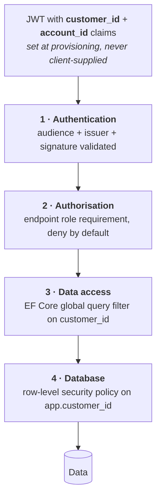

# Security

---

## 1. Threat model

What is actually worth protecting here, and from whom.

| Asset | Threat | Impact | Primary control |
| --- | --- | --- | --- |
| **Customer wallet balances** | Unauthorised movement, replay, race | Direct financial loss | Transactional integrity, idempotency, append-only ledger, reconciliation |
| **Cross-customer data** | Broken tenancy isolation | Competitor sees another's consumption and trading position — commercially serious and a GDPR breach | Token-derived `customer_id`, global query filter, row-level security, `404` not `403` |
| **Attribution integrity** | An action recorded against the wrong person, or against nobody | A trade cannot be traced to who authorised it; disputes become unresolvable | `account_id` from the token only; snapshot of name and job title on every event; accounts deactivated, never deleted |
| **Trade offers** | Manipulation of price or expiry | Financial loss, dispute | Server-side clock, state guards, immutable audit |
| **PVNed webhook** | Forged or replayed metering data | Wrong invoices across the whole customer base | Endpoint authentication, payload retention, versioning, anomaly detection |
| **Payment webhook** | Forged credit | Free money | Signature verification, idempotency, provider-side reconciliation |
| **Invoices** | Tampering post-finalisation | Fiscal and legal exposure | Immutability, gapless numbering, audit |
| **Personal data** | Exfiltration | GDPR, reputation | Minimisation, encryption, access control, audit |
| **Employee accounts** | Credential compromise | Insider-level access to everything | MFA, least privilege, session limits, audit |
| **Break-glass credentials [DEC-53]** | Theft of the hash, or misuse of the account by its holder | Authenticated employee access that bypasses the identity provider entirely | Named accounts only, disabled by default, Argon2id + peppered hashes, an independent second factor, alert on **every** use — §3.2 |

The two that keep the design honest are **wallet integrity** and **tenancy isolation**. Almost every
architectural rule in this set traces back to one of them.

## 2. Tenancy isolation

Four layers. Any one of them failing should not expose data.



```csharp
// Layer 3 — applied to every customer-owned entity, not opted into per query
protected override void OnModelCreating(ModelBuilder b)
{
    b.Entity<MeteringPoint>().HasQueryFilter(x => x.CustomerId == _context.CustomerId);
    b.Entity<Trade>()        .HasQueryFilter(x => x.CustomerId == _context.CustomerId);
    b.Entity<Invoice>()      .HasQueryFilter(x => x.CustomerId == _context.CustomerId);
    b.Entity<Wallet>()       .HasQueryFilter(x => x.CustomerId == _context.CustomerId);
}
```

```sql
-- Layer 4 — the customer API connects as app_customer_role
SET LOCAL app.customer_id = '…';   -- set from the validated token, per request, per transaction
```

**Rules:**

1. `customer_id` is read from the token, never from a route, query string, body or header.
2. The customer API has **no** endpoint that accepts a customer identifier.
3. `account_id` is likewise read only from the token, and is used **for attribution, never for
   authorisation** — every account of a company has the same rights **[DEC-16]**. A client cannot
   name a colleague as the actor of its own request.
4. On every request, `account_id` is verified to belong to `customer_id` and to be `ACTIVE`. A
   mismatch is rejected and alerted — it means either a misconfigured claim mapping or an attack.
5. `IgnoreQueryFilters()` is banned in the customer API — enforced by an architecture test.
6. A request for an object belonging to another customer returns **`404`**, not `403`
   **[F13-R19]** — a `403` confirms the object exists.
7. The employee API connects as a different database role with no RLS policy, and every
   cross-customer read is audited.

### 2.1 The test that must exist

An integration test that, for every customer-API endpoint, authenticates as customer A and attempts
to reach an object owned by customer B, asserting `404`. It runs over a route table so a new endpoint
is covered automatically rather than by someone remembering.

## 3. Authentication & session

See [F13](../10-features/F13-identity-and-access.md). Summary:

| Control | Setting |
| --- | --- |
| Protocol | OIDC authorisation code + PKCE |
| Access token lifetime | ≤ 15 min |
| Refresh token | Rotating, reuse detection revokes the family |
| Employee MFA | **Mandatory** — and mandatory again, by an independent factor, on the break-glass path §3.2 |
| Customer MFA | **Governed by Entra tenant policy, not by the platform [DEC-51]** — §3.1 |
| Idle timeout | 30 min |
| Absolute session | 12 h |
| Token storage in SPA | In memory; refresh token in an `HttpOnly`, `Secure`, `SameSite=Strict` cookie |
| Realm separation | Distinct issuers and audiences; cross-audience tokens rejected |

Tokens are never placed in `localStorage`. The refresh cookie is scoped to the token endpoint path
only.

### 3.1 Customer MFA sits outside the platform's control surface — [DEC-51]

**[DEC-51]** closes [OQ-43] by moving the question rather than answering it in the platform: customer
MFA is whatever the Entra tenant policy says it is. **The platform neither enforces it nor exempts
anyone from it.** There is no MFA setting in the customer portal, no per-customer override, and no
code path that refuses a session for lack of a second factor.

| The platform does | The platform does not |
| --- | --- |
| Read the **`amr`** claim and record it on the session and in the audit trail — evidence of how the subject authenticated | Require a particular `amr` value before granting access |
| Surface, in the employee portal, which customer sessions were multi-factor and which were not | Prompt, step up, enrol or exempt |
| Alert if `amr` is **absent** from a token that should carry it — that is a claim-mapping fault, not a policy statement | Treat a missing `amr` as "no MFA" and act on the inference |

⚠ **Record this as what it is: a security control that has left the control surface.** The platform
can be configured perfectly and still see unauthenticated-strength sessions if the tenant policy is
weak, and it cannot detect or correct that from the inside — `amr` is evidence of what happened, not
a guarantee of what is required. Two consequences follow. The tenant policy belongs in the
pre-go-live checklist (§10) as a thing to *verify with the tenant owner*, not to configure. And if
the answer ever needs to be platform-enforced — a customer contract requiring MFA, say — that is a
new decision reversing **[DEC-51]**, not a setting.

Employee MFA is unaffected and stays **mandatory**. It is inside the control surface because the
employee realm is PeakPower's own.

### 3.2 Break-glass — a bounded exception, not a reversal [DEC-53]

**[DEC-53] amends [DEC-29].** The platform now hashes and stores passwords for a **small set of named
employee accounts**, usable **only** when the identity provider is unavailable. This is a deliberate,
bounded exception to "the platform never stores a password" and it is worth being exact about its
edges:

| | Before **[DEC-53]** | After |
| --- | --- | --- |
| Customers | Provider-authenticated, no stored credential | **Unchanged.** Fully provider-authenticated **[DEC-29]** |
| Employees, normal path | Provider-authenticated | **Unchanged** |
| Employees, IdP unavailable | No route in | A named break-glass account, disabled by default |

There is **no customer break-glass**, no self-service reset, no lockout policy and no credential
storage on the customer side. **[DEC-29] stands** for every account the platform has, except the
handful enumerated below.

#### Non-negotiable constraints — [DEC-53]

| # | Constraint | How it is met |
| --- | --- | --- |
| 1 | **Named accounts only** | One credential per named employee. No shared "admin" account, no service account, no generic `breakglass` login — an unattributable emergency login defeats the audit trail that the rest of this document exists to protect **[DEC-17]** |
| 2 | **Disabled by default** | Each account carries an `enabled_until timestamptz`, `NULL` when disabled. Authentication is refused unless `now() < enabled_until`, and the box reverts to disabled on expiry with no action **[F13-R34]**. Enabling is an explicit, audited action by a **second** named administrator. ⚠ **The duration is deliberately not set here** — **[DEC-53]** does not state one and **[F13-R34]** ships no default, for the same reason as the four-eyes threshold: a guessed window is either too short to survive an incident or long enough to be a standing account. It must be configured before the path is first enabled |
| 3 | **A second factor that does not depend on the identity provider** | TOTP (RFC 6238), seed generated by the platform and encrypted at rest, **or** a FIDO2 security key registered directly with the platform **[F13-R36]**. Explicitly **not** Entra MFA, not a push through the IdP app, and not SMS to a number held in the Entra directory — all three fail in exactly the outage this path exists for |
| 4 | **Every use alerted and audited** | §3.2.3, **[F13-R37]** |
| 5 | **Rehearsed** | §3.2.4, **[F13-R39]**. An unrehearsed break-glass path is not a break-glass path — it is an untested assumption with a password attached |
| 6 | **Least privilege inside the session** | A break-glass session grants the minimum function set needed to run through an outage and **never more than that employee's normal roles [F13-R38]**. No customer-portal access, no acting on a customer's behalf. ⚠ The function set is itself unspecified by **[DEC-53]**; until it is decided with operations, the safe reading is read-only plus the specific actions an incident requires |
| 7 | **Its own lockout, and a kill switch** | Rate limiting, lockout and breach procedure independent of anything the provider does, plus a **documented and practised way to disable every break-glass account at once** on suspicion of compromise **[F13-R40]** |

#### 3.2.1 Credential storage

| Property | Setting |
| --- | --- |
| KDF | **Argon2id** — memory-hard, the current OWASP recommendation, and the only class of algorithm that makes GPU cracking expensive |
| Parameters | `m = 256 MiB`, `t = 4`, `p = 2`, 32-byte output, 16-byte per-credential random salt. **Far above interactive-login norms on purpose**: these credentials are verified a handful of times a year, so login latency is not a constraint and there is no reason to buy anything with the cost parameters except difficulty |
| Pepper | The password is HMAC-SHA-256'd with a server-side key from Key Vault **before** hashing, so a database dump alone yields nothing crackable. The key is **HSM-backed and loaded at host startup** — see the caveat in §3.2.5 |
| Generation | Machine-generated, ≥ 128 bits of entropy. **Never user-chosen**: a memorable password on the one account that bypasses the identity provider is the worst place in the system for one |
| Distribution | Sealed and held offline (physical safe or sealed envelope), one holder per named account. Not in a password manager that authenticates against Entra |
| Failed attempts | 5 consecutive failures lock the account and **page immediately**. There is no self-service unlock |
| Algorithm agility | The stored record carries its KDF and parameters, so a future re-hash is a migration rather than a rewrite |
| Where it lives | ⚠ **Not yet decided, and it should be decided explicitly.** [Database design](04-database-design.md) has no identity schema — until **[DEC-53]** the platform stored no credential at all — and **[F13-R33]** says the account set is "enumerated in configuration", which reads as *not* a table. Two placements work: a small table (name, hash, KDF parameters, second-factor enrolment, `enabled_until`, rotation timestamps) with `REVOKE` on every role but the one that authenticates; or the hashes in Key Vault with the enumeration in configuration. **The constraint that decides it is §3.2.5**: whichever is chosen must be verifiable by a running host with no live Key Vault call and no Azure control-plane access |

#### 3.2.2 Rotation

| Trigger | Action |
| --- | --- |
| **On every use** | The credential is rotated immediately afterwards, without exception. A break-glass password that has been used once is a password that has been read aloud, typed on an unknown machine, or photographed |
| Quarterly | Rotated as part of the drill — **the rehearsal is the rotation**, which is what stops the schedule from being the first thing to lapse |
| Personnel change | Immediate revocation on any change affecting a named holder, on the same day as the normal offboarding step |
| Suspicion | Immediate rotation and an incident record; no threshold of proof is required to rotate |

#### 3.2.3 The alert

**Every authentication attempt on the break-glass path raises a P1 page** — success and failure
alike, and enablement as well as use. Four properties matter:

1. **It routes through the monitoring path** (Azure Monitor → pager, [Deployment](09-deployment.md)
   §7), **not** through the platform's own notification outbox and not through SendGrid. An alert
   that travels over the machinery that may be broken is not an alert.
2. **It goes to a group, never only to the person using the account.** The point of the alert is that
   somebody other than the actor knows.
3. **It fires on enablement too**, so the window between "enabled" and "used" is visible. An account
   enabled and never used is as interesting as one used.
4. **It is audited like every other security event** (§9), with the account name, source IP, the
   second-factor method and the enabling employees. Break-glass sessions are additionally marked on
   every audit record they produce, so any action taken during one is identifiable afterwards as
   having happened outside the normal identity path.

#### 3.2.4 Rehearsal

**At least twice a year and after any change to the path [F13-R39]** — scheduled here **quarterly**,
alongside the backup-restore drill (§8), because it is the same discipline for the same reason: **an
untested recovery path is a hypothesis.** The drill:

- runs end to end in the test environment — enable, authenticate, second factor, act, disable;
- includes a **production dry run of the procedure** as far as enablement, so the runbook's first
  five minutes are known to work against production configuration;
- rotates the credential as its final step (§3.2.2);
- is signed off by a named owner, and a **failed or skipped drill is an incident**, not a to-do.

#### 3.2.5 ⚠ The dependency this does not remove

Honest limitation, and it must be rehearsed rather than assumed away: **the platform's identity
provider is Entra ID [DEC-20], and Azure's own control plane also authenticates against Entra.** The
two failure modes are not the same and only one is fully covered:

| Failure | Covered? |
| --- | --- |
| The platform's app registration, claim mapping or sign-in flow is broken; Entra itself is healthy | **Yes.** This is the common case and the one **[DEC-53]** is really for |
| Entra is globally unavailable | **Partly.** The Azure portal, Key Vault access via managed identity and the deployment pipeline may be impaired at the same time |

Two design consequences follow, and both are requirements rather than observations:

- **Enablement must be a data action, not an Azure control-plane action.** The `enabled_until` flag
  is a row in the platform's own database, reachable by a running host. If enabling break-glass
  requires signing in to the Azure portal, the path does not work in the outage it was built for.
- **The pepper must already be in memory.** Key Vault is read at host startup and cached; a running
  host must not need a fresh Key Vault fetch to verify a break-glass credential. A host that restarts
  during a global Entra outage may not recover the key, which is a scenario the drill must include
  and the runbook must answer.

This is a smaller claim than "break-glass means the platform always lets us in", and it is the true
one.

## 4. Inbound integration security

### 4.1 PVNed webhook

The highest-risk unauthenticated-by-default surface in the system: forged metering data would corrupt
invoices across the entire customer base, and it would look like a data quality problem for weeks.

| Control | Detail |
| --- | --- |
| Transport | TLS 1.3 |
| Authentication | mTLS preferred; shared secret header as a fallback; both supported **[OQ-05]** |
| Network | IP allow-list where PVNed can supply stable egress addresses |
| Payload limit | 25 MB, rejected above **[F02-R06]** |
| XXE / entity expansion | External entity resolution and DTD processing **disabled** on the XML reader — non-negotiable for an XML endpoint |
| Schema validation | Against the pinned XSD before any interpretation |
| Rate limiting | 60/min, burst 200. ⚠ **Sized against the metering-point count, not left at this default** — **[DEC-38]** makes the normal load one document per EAN per day, so 500 metering points arriving in a tight window would be throttled as an attack. See [Database design §2.1](04-database-design.md) |
| Retention | Raw payloads kept for dispute resolution and replay |
| Anomaly detection | Volume deviating more than a configured factor from the trailing average for that metering point raises an alert rather than silently superseding |

The anomaly check is the control that catches a forged or badly-corrupted document that passes every
structural test.

### 4.2 Payment webhook

| Control | Detail |
| --- | --- |
| Signature | HMAC verified against the provider secret; unverified callbacks rejected and logged **[F07-R05]** |
| Idempotency | Keyed on the provider payment id **[F07-R06]** |
| Amount validation | Checked against the originating payment record; a mismatch is quarantined, never credited |
| Independent verification | Reconciliation job queries the provider directly rather than trusting only the callback |

## 5. Outbound integration security

| Integration | Controls |
| --- | --- |
| Montel | Credentials in the secret store, rotated; TLS verified; responses schema-validated |
| Odoo | Service account with the minimum object rights; TLS; retries never duplicate a document (external reference is the key) |
| Email — **SendGrid [DEC-48]** | Dedicated signed sending domain (SPF, DKIM, **DMARC at `p=reject`**); API key in Key Vault, scoped to send only, rotated; no tokens, credentials or invoice attachments-by-link that bypass authentication in message bodies. **[DEC-47]** puts invoices on this channel, so a spoofable sending domain is now an invoice-fraud surface, not only a deliverability problem |
| Identity provider | Client secret in the secret store; JWKS cached with a bounded TTL |

## 6. Application security

| Area | Control |
| --- | --- |
| Input validation | FluentValidation at the boundary; domain invariants behind it |
| SQL injection | Parameterised everywhere; EF Core or Dapper with parameters, never string concatenation |
| XSS | Angular's default escaping; `bypassSecurityTrust*` banned; strict CSP |
| CSRF | Bearer tokens for the API; the refresh cookie is `SameSite=Strict` and its endpoint requires a custom header |
| Headers | HSTS with preload, CSP, `X-Content-Type-Options`, `Referrer-Policy`, `Permissions-Policy` |
| Dependencies | Dependabot / Renovate; `dotnet list package --vulnerable` and `npm audit` gate the build |
| Secrets | Azure Key Vault via managed identity; no secrets in code, config files or environment variables in source control |
| File uploads | None in the first release. If added, out-of-band scanning and content-type validation |
| Error responses | Problem details with no stack traces, no SQL, no internal identifiers on the customer API |

## 7. Data protection

| Class | Examples | Handling |
| --- | --- | --- |
| **Personal** | Contact name, email, phone | Encrypted at rest (database-level), access audited, minimised in logs |
| **Commercially sensitive** | Consumption profiles, positions, prices, balances | Strict tenancy isolation; never in logs |
| **Financial** | Ledger, invoices | Immutable, audited, retained 7 years |
| **Secrets** | API credentials, signing keys | Key Vault, rotated, never logged |
| **Operational** | Correlation ids, metrics | Freely logged |

### 7.1 GDPR

| Right | Handling |
| --- | --- |
| Access | Export of a customer's data via the employee portal |
| Rectification | Master-data edit with audit |
| Erasure | Personal identifiers pseudonymised; financial, trade and invoice records retained under the legal-obligation basis (fiscal retention). The customer is told which data is retained and why |
| Portability | CSV / JSON export |
| Restriction | Account suspension |

Processing bases: **contract** for platform operation, **legal obligation** for invoicing and fiscal
retention, **legitimate interest** for security logging. A processor agreement is required with every
third party that touches personal data — PVNed, the payment provider, the identity provider, the
email provider and the cloud provider. **[OQ-58]**

### 7.2 Encryption

| State | Control |
| --- | --- |
| In transit | TLS 1.3, minimum 1.2; internal service-to-service also TLS |
| At rest | Database and object storage encryption with **platform-managed keys [DEC-52]** — closing [OQ-59]. **No customer-managed keys**, so there is no per-customer key hierarchy, no BYOK onboarding step and no customer-triggered key revocation to design around |
| Application-level | The break-glass second-factor seed and the credential pepper, under Key Vault keys — §3.2.1 |
| Backups | Encrypted, same key management |

## 8. Operational security

| Control | Detail |
| --- | --- |
| Least privilege | Distinct database roles per host: `app_customer_role`, `app_employee_role`, `app_worker_role`, `app_migrator_role` |
| Production access | No standing human access to the production database. Break-glass is time-limited, approved and fully audited |
| Two different break-glass paths | ⚠ **They share a name and nothing else.** *Database* break-glass grants a human a time-limited connection to production data. *Authentication* break-glass **[DEC-53]** grants a named employee a platform session when the identity provider is unavailable — §3.2. Separate credentials, separate approvals, separate alerts, separate drills. Do not let one runbook cover both |
| Deployment | No manual deploys; everything through the pipeline with an audit trail |
| Infrastructure | Infrastructure as code, reviewed like application code |
| Backups | Point-in-time recovery, restore tested quarterly — an untested backup is a hypothesis |
| Vulnerability management | Dependency scanning in CI, base image rebuilds monthly, penetration test before go-live **[OQ-60]** |
| Incident response | Documented procedure, named owners, 72-hour GDPR breach notification path |

## 9. Audit

Every security-relevant event is recorded in the audit trail **[F15](../10-features/F15-audit-and-observability.md)**:
sign-in and sign-out, failed authorisation, role changes, impersonation start and end, cross-customer
reads by employees, manual wallet adjustments, reference-data changes, invoice finalisation, and
message replay.

Audit records are append-only, retained per **[OQ-48]**, and cannot be deleted by any application
path.

## 10. Pre-go-live security checklist

- [ ] Tenancy isolation test covers every customer-API endpoint automatically
- [ ] `IgnoreQueryFilters` architecture test passing
- [ ] Row-level security enabled and verified on every customer-owned table
- [ ] XXE disabled and tested on the PVNed endpoint
- [ ] Payment webhook signature verification tested with a forged payload
- [ ] Idempotency verified on every state-changing endpoint
- [ ] Rate limits verified under load
- [ ] Secrets confirmed absent from source control, images and logs
- [ ] Log redaction verified for tokens, credentials and personal data
- [ ] MFA enforced for all employee accounts
- [ ] Entra **tenant** MFA policy for customer users confirmed **with the tenant owner** — the platform cannot enforce it **[DEC-51]**, §3.1
- [ ] `amr` claim present, recorded and surfaced; an absent `amr` alerts as a mapping fault
- [ ] Break-glass procedure documented and rehearsed
- [ ] Break-glass accounts named, enumerated, and **disabled** (`enabled_until IS NULL`) in production **[DEC-53]**
- [ ] Break-glass hashes verified as Argon2id at the agreed parameters, with the pepper applied
- [ ] Break-glass second factor verified to work with the identity provider unreachable
- [ ] Alert on break-glass enablement **and** use tested end to end, over the monitoring path
- [ ] Break-glass drill completed at least once, including the credential rotation that ends it
- [ ] Backup restore rehearsed end to end
- [ ] External penetration test completed and findings closed
- [ ] Processor agreements signed with every third party

## 11. Open questions

| Ref | Question |
| --- | --- |
| [OQ-05] | PVNed endpoint authentication mechanism |
| [OQ-31] | Segregated client account for wallet funds, and any resulting regulatory obligations |
| ~~[OQ-43]~~ | ~~Mandatory MFA for customer users?~~ **Closed by [DEC-51]** — governed by Entra tenant policy. The platform neither enforces nor exempts; it reads `amr` as evidence. ⚠ Recorded in §3.1 as a control that has left the platform's control surface |
| ~~[OQ-44]~~ | ~~Break-glass procedure if the identity provider is unavailable~~ **Closed by [DEC-53]**, which **amends [DEC-29]** — §3.2. Residual, and named there rather than left implied: the Entra-global-outage case is only partly covered (§3.2.5) |
| [OQ-58] | Who owns the DPIA and the processor agreements? **[DEC-48]** adds SendGrid to the list |
| ~~[OQ-59]~~ | ~~Are customer-managed encryption keys required?~~ **Closed by [DEC-52]** — no. Platform-managed keys at rest |
| [OQ-60] | Is an external penetration test budgeted before go-live? |
| *(new, from **[DEC-53]**)* | Who holds the sealed break-glass credentials, and where? The mechanism is specified in §3.2; the custody arrangement is an operational decision with a named owner, and it must exist before the first drill |
| *(new, from **[DEC-53]**)* | Does the break-glass credential store live in the database or in Key Vault with the enumeration in configuration **[F13-R33]**? Either satisfies **[DEC-53]**; §3.2.1 states the constraint that decides it. Also unanswered by **[DEC-53]**: the enablement time-box **[F13-R34]** and the session's function set **[F13-R38]** |
