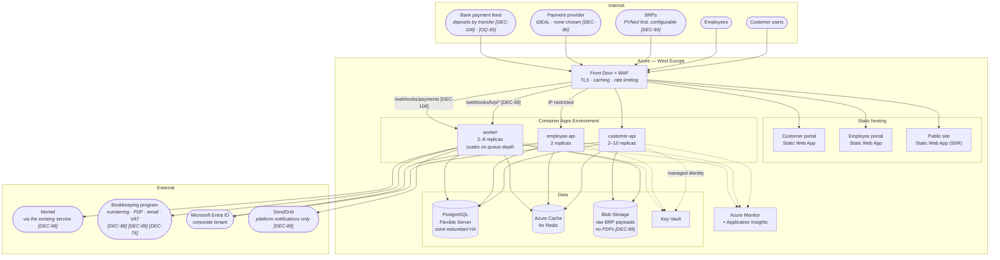

# Deployment

Azure as the default target because .NET Aspire deploys to Azure Container Apps with the least
friction **[OQ-50]**. The design keeps that reversible: everything is a container, the datastore is
standard PostgreSQL, and no Azure-specific service is on the critical path except managed identity
and Key Vault, both of which have direct equivalents elsewhere.

**The Azure estate is greenfield [DEC-56]; the directory above it is not [DEC-66].** Read those two
together, because they are one sentence apart and mean different things.

- **No Azure subscription, no landing zone, no naming standard** to inherit or align with, which
  closes [OQ-64] — in the direction that creates work rather than removes it. The conventions are this
  project's to set, and they are cheapest to set **before the first `deploy/infra` commit**: a naming
  standard adopted after fifty resources exist is a rename exercise, and a subscription layout adopted
  late is a migration. §1.1.
- **But the subscriptions are created *under PeakPower's existing corporate Entra tenant* [DEC-66].**
  "No existing Azure tenancy" was never a statement about the directory, and [OQ-88] closed on exactly
  that distinction. Azure subscriptions have to live in **some** Entra tenant; this one lives in the
  corporate one, which is also where employees already sign in **[DEC-20]**.

⚠ **That is a constraint on this document, not a footnote to it.** It fixes what §1.1.1 can decide, it
decides which directory holds every managed identity in §1.1.4, and it means the Azure control plane
and the employee portal share a single point of failure — see §1.1.5 and §5. What is **not** settled
is *access* to that tenant, which is a dated Phase 0 dependency with a named owner
([Roadmap §2.1](../70-delivery/01-roadmap-and-phasing.md)) rather than an open question.

> **Revised 2026-08-19** on the decision round **[DEC-68]**…**[DEC-112]**. §1.1 is untouched:
> **[DEC-56]**, **[DEC-66]** and **[DEC-67]** stand, and the greenfield-inside-a-corporate-tenant
> story is unchanged. What changed is everything around it. Invoicing mechanics leave the platform
> for the bookkeeping program — numbering **[DEC-88]**, PDF and invoice email **[DEC-89]**, VAT
> **[DEC-76]**, surcharges **[DEC-73]**, invoice payment matching **[DEC-105]** — which takes a
> rendering dependency out of the container images (§3) and a class of traffic off SendGrid
> (§5.1, §9). What arrives is an **incoming-payment ingress** for wallet deposits **[DEC-106]**,
> **per-BRP** endpoint and credential configuration **[DEC-69]**, and an **energiebelasting bracket
> table edited in production** **[DEC-74]** — the first data in this system that a restore cannot
> recover (§6.2). Operationally: **no contractual SLA** **[DEC-103]**, **one named operator**
> **[DEC-104]**, and **no external penetration test** before go-live **[DEC-102]**.

---

## 1. Target topology

**Three inbound feeds now, not one.** The webhook surface used to be PVNed's alone. **[DEC-69]**
makes it *one adapter per BRP* behind a single route prefix — a BRP is reference data with its own
endpoint, format and credentials (§5), so a second one is a row and a secret rather than a release.
**[DEC-106]** adds an unrelated second ingress: incoming bank payments, matched on a payment
reference the platform issued, crediting the wallet without a human touching it. Both terminate on
the worker, both are authenticated at the edge, and neither is configured in code. ⚠ **[OQ-93]**
decides which payment feed — until it is answered the topology reserves the path and nothing more.

**What left the topology.** Nothing renders a PDF **[DEC-89]**, nothing mints an invoice number
**[DEC-88]**, nothing computes VAT **[DEC-76]**. The node that was `Odoo` is now *the bookkeeping
program* — Odoo, Moneybird or another, **[OQ-69]** — and the arrow into it carries **draft invoices
and ledger entries only**: deposits and withdrawals reach that system through its own bank feed
**[DEC-109]**, not through this one. Smaller platform, larger dependency. Under **[DEC-88]** a failed
push means the customer has no numbered invoice at all, which is why §7 raises that alert to P1.

**There is no contractual SLA [DEC-103].** Every availability number in §6 and §7 is an internal
engineering goal with no remedy attached to it. That changes nothing in the diagram — zone-redundant
HA and a floor of two replicas stay, because both are cheap and both cover ordinary events rather
than rare ones — but it removes the argument that used to settle **[OQ-62]** on its own. A warm
secondary region is now a cost judgement PeakPower makes for its own reasons. §6.1, §9.

### 1.1 Greenfield conventions — [DEC-56], inside the corporate tenant [DEC-66]

No Azure estate exists to align with, so these are decided here rather than discovered later. All of
it is cheap now and expensive after the estate has grown. **One thing above them is already fixed**:
the directory. Everything below is designed *inside* PeakPower's corporate Entra tenant, not beside
it.

#### 1.1.1 Directory, subscriptions and resource groups

| Level | Convention |
| --- | --- |
| **Entra tenant (directory)** | **PeakPower's existing corporate tenant — inherited, not created [DEC-66].** Every subscription below is created under it. ⚠ **No project-owned Entra tenant, at any point, for any reason** — a second directory holding employee accounts splits employee identity, and **[DEC-51]** (MFA as tenant policy) and **[DEC-53]** (break-glass covering the outage of *the* provider) are both written against a single one. The customer-facing **External ID tenant** **[F13-R03]** is a separate tenant *for customers* and is not an exception to this: it holds no employee account |
| Subscriptions | **Two: `peakpower-prod` and `peakpower-nonprod`**, both under the corporate tenant. Production isolated at the billing and policy boundary, which is the only boundary Azure enforces without effort. Dev and Test share the non-prod subscription. ⚠ The subscription boundary is **not** an identity boundary — it isolates billing, policy and blast radius, and both subscriptions still trust the one directory |
| **Management group** | One, `mg-peakpower`, holding both subscriptions, so the Azure Policy assignments in §1.1.4 attach **once** rather than twice and a third subscription inherits them by existing. ⚠ Creating it needs a permission at the **tenant root**, which is the corporate tenant's to grant — the first place the access dependency bites |
| Resource groups | One per environment per lifecycle: `rg-peakpower-app-{env}-weu`, `rg-peakpower-data-{env}-weu`, `rg-peakpower-shared-{env}-weu`. Data is separated from application because it outlives it — a redeploy must never be able to take the database with it |
| Region | **West Europe** primary, per §1. A second region is [OQ-62] |

#### 1.1.2 Naming standard

`{org}-{type}-{workload}-{env}-{region}-{instance}`, lowercase, hyphen-separated, with the
abbreviation-only forms where Azure forbids hyphens or caps the length:

| Resource | Pattern | Example |
| --- | --- | --- |
| Container App | `ca-{component}-{env}-{region}` | `ca-customerapi-prod-weu` |
| Container Apps environment | `cae-peakpower-{env}-{region}` | `cae-peakpower-prod-weu` |
| PostgreSQL Flexible Server | `psql-peakpower-{env}-{region}` | `psql-peakpower-prod-weu` |
| Redis | `redis-peakpower-{env}-{region}` | `redis-peakpower-prod-weu` |
| Key Vault | `kv-pp-{env}-{region}` — ≤ 24 chars, globally unique | `kv-pp-prod-weu` |
| Storage account | `stpp{env}{region}{nn}` — lowercase alphanumeric only, ≤ 24 | `stppprodweu01` |
| Static Web App | `swa-{app}-{env}-{region}` | `swa-customerportal-prod-weu` |
| Front Door | `afd-peakpower-{env}` | `afd-peakpower-prod` |
| Managed identity | `id-{component}-{env}-{region}` | `id-worker-prod-weu` |

Environments are `dev`, `tst`, `prod` — three letters, always, so no name is a prefix of another.

#### 1.1.3 Tags, mandatory on every resource

`workload=peakpower`, `env`, `owner`, `cost-centre`, `data-classification`
(`personal` / `financial` / `operational`, matching [Security](07-security.md) §7), `managed-by=iac`.
Enforced by Azure Policy at the subscription, so an untagged resource cannot be created rather than
being found later in a cost review.

#### 1.1.4 The landing zone is ours to build — inside a directory that is not

No inherited guardrails means no inherited protection. Minimum baseline before production carries
real data:

- **Azure Policy**: deny public blob access, deny resources outside the approved regions, require
  TLS 1.2 minimum, require the mandatory tags. Assigned at `mg-peakpower` (§1.1.1) so the two
  subscriptions cannot drift apart.
- **Diagnostic settings** to one Log Analytics workspace per environment, set by policy rather than
  by hand.
- **Network**: private endpoints for PostgreSQL, Key Vault and Storage; the Container Apps
  environment on a delegated subnet. Greenfield means this is designed once, correctly, instead of
  retrofitted around a running system.
- **RBAC**: no standing owner assignments, PIM-style just-in-time elevation for the two humans who
  need it, and every production data path through managed identity ([Security](07-security.md) §8).
  ⚠ **Every one of those principals is an object in the corporate Entra tenant [DEC-66]** — see
  below, because this is where an inherited directory stops being a detail.

#### 1.1.5 What an inherited directory constrains — [DEC-66]

**[DEC-66]** is not only an identity decision. Three consequences land squarely on this design:

| Constraint | What it means here |
| --- | --- |
| **Managed identities live in the corporate directory, not in the subscription** | A user-assigned managed identity (`id-{component}-{env}-{region}`, §1.1.2) is an Azure resource *and* a **service principal in the corporate Entra tenant**. So the naming standard in §1.1.2 is not only ours to keep tidy — those names appear in a directory shared with the rest of PeakPower, which is an argument for the `id-…-peakpower-…` prefixes rather than bare component names. Their **lifecycle** is shared too: a directory-wide cleanup, conditional-access policy or app-registration restriction applies to them |
| **Some steps need permissions only a tenant administrator holds** | Creating `mg-peakpower`, assigning policy at the management group, granting **admin consent** for the two portal app registrations **[F13-R03]**, and creating the customer-facing External ID tenant. None is the delivery team's to do. All of them are why tenant access is a **dated Phase 0 dependency** ([Roadmap §2.1](../70-delivery/01-roadmap-and-phasing.md)) rather than a setup task |
| **The Azure control plane and the employee portal share one directory, and therefore one outage** | An Entra outage does not merely stop employees signing in to the portal — it stops anyone signing in to the **Azure portal, CLI and pipelines** as well. That is the concrete reason break-glass enablement is a **database row** and not App Configuration or a portal action (§5, **[DEC-53]**), and the reason break-glass alerting must not route through anything federated to Entra **[F13-R37]**. Before **[DEC-66]** this was a plausible-sounding precaution; it is now a stated property of the deployment |

> ✅ **The question this section used to carry is answered.** It asked whether a Microsoft 365 / Entra
> tenant already existed for the new Azure subscriptions to sit under, since **[DEC-20]** assumed one
> and **[DEC-56]** said there was no Azure tenancy. **[DEC-66]** answers it: the corporate tenant
> **exists**, the subscriptions sit under it, and **[DEC-56]** is clarified rather than reversed —
> everything in §1.1 stands unchanged. [OQ-88] is closed.
>
> ⚠ **What replaces it is a dependency, not a question.** *Access* to that tenant is granted by
> whoever administers it, outside the delivery team, and is tracked with a named owner and a date in
> [Roadmap §2.1](../70-delivery/01-roadmap-and-phasing.md). Do not look for it in §10 or in
> [80-open-questions.md](../80-open-questions.md) — it is in neither, on purpose. **[DEC-67]** puts it
> on the critical path by choice: the `customer_id` claim-mapping spike **[F13-R32]** runs against
> this tenant. See **[R-24]**.

## 2. Environments

| Environment | Purpose | Data | Scale | Access |
| --- | --- | --- | --- | --- |
| **Local** | Development | Seeded, synthetic | Aspire on one machine, plus the sibling web checkout **[DEC-55]** | Developer |
| **Dev** | Integration, shared | Synthetic + third-party stubs | Minimal | Team |
| **Test / Acceptance** | UAT, third-party integration testing | Anonymised production-shaped | Production-like | Team + stakeholders |
| **Production** | Live | Real | Full | Restricted, no standing DB access |

**Test must be production-shaped in data volume**, not only in configuration. An invoice run over 10
customers proves nothing about an invoice run over 500 metering points, and the interval-data query
plans only diverge at volume.

**Every environment is now deployed by two pipelines [DEC-55]**, so "what is in Dev" is two commit
SHAs rather than one. Each environment surfaces both, on the health endpoint and in the portal
footer — a bug report against a front-end version is unactionable without the API version behind it.

### 2.1 Production now holds data no other environment can derive — [DEC-74]

**[DEC-74]** brings energiebelasting back into scope as a **versioned, editable bracket table** —
tier boundaries and €/kWh rates per year, plus the per-customer reduction or exemption for the
minority who do not pay the standard rate (growers are the example the source names). An employee edits it **in production**,
in the employee portal, and there is no upstream feed to re-ingest it from. That breaks an assumption
this table quietly made, namely that every environment differs only in configuration and data volume.

| Consequence | What it forces |
| --- | --- |
| **Parity is a copy, not a deployment** | Dev and Test cannot be levelled by redeploying; the bracket table has to be exported from production and loaded, which no migration does for you. A calculation tested against last year's brackets is a wrong test and the error is **silent** — the run completes and produces a number, just not the right one |
| **A restore can undo an edit** | Point-in-time recovery rolls the table back with everything else and nothing re-applies what the employee typed. §6.2 |
| **Anonymisation must not touch it** | Test data is anonymised production-shaped data; the brackets are *not* personal data and must survive that pass intact, or the environment that is meant to prove the calculation is the one that cannot |

The same holds, with a smaller blast radius, for the price-indication markup **[DEC-80]** and the BRP
registry **[DEC-69]**: both are production-edited reference data whose only source of truth is the
database row.

## 3. Sizing

| Component | Dev | Test | Production (year 1) |
| --- | --- | --- | --- |
| customer-api | 0.5 vCPU / 1 GB × 1 | 1 / 2 × 1 | **1 / 2 × 2–10** |
| employee-api | 0.5 / 1 × 1 | 1 / 2 × 1 | **1 / 2 × 2** |
| worker | 1 / 2 × 1 | 1 / 2 × 1 | **2 / 4 × 2–8** |
| PostgreSQL | Burstable B1ms | GP D2ds v5 | **GP D4ds v5, zone-redundant HA, 512 GB** |
| Redis | Basic C0 | Standard C1 | **Standard C1** |
| Blob | LRS | LRS | **GRS** with lifecycle rules |

Scaling rules:

| Component | Rule |
| --- | --- |
| customer-api | HTTP concurrency > 50/replica → scale out; min 2 |
| worker | Hangfire queue depth > 100 → scale out; min 2 |
| Both | Scale in only after 10 minutes below the threshold, to avoid flapping |

Minimum 2 replicas everywhere so a rolling deployment never drops to zero capacity.

**No PDF-rendering capacity is sized, and none is installed [DEC-89].** The bookkeeping program
renders the invoice document and emails it, so the container images carry **no headless browser, no
rendering engine and no font packages**, and the worker's allocation covers ingestion, calculation
and queue processing only. The saving is not the vCPU — it is a class of dependency. A headless
Chromium is typically the largest single contributor to an image's size, the most frequent source of
base-image CVEs to patch, and the reason PDF workloads need memory headroom unrelated to the business
logic. The worker row above is unchanged because it was never sized for rendering; what changed is
that it can no longer be asked to render, and neither can a future revision without reopening
**[DEC-89]**.

What this round *adds* to sizing is bounded and moves nothing in the table: one ingestion adapter per
BRP **[DEC-69]** on the same worker; incoming-payment matching **[DEC-106]**, which is one indexed
lookup per payment on a reference the platform issued; the energiebelasting calculation **[DEC-74]**,
which runs inside the existing monthly and annual jobs over data already in PostgreSQL; and the
customer usage API **[DEC-97]**, which is read traffic on `customer-api` against the same interval
data the portal already queries — it scales on the existing HTTP-concurrency rule, and its shape
firms up when **[OQ-95]** chooses between an API and a file drop.

## 4. Pipelines — two of them [DEC-55]

**[DEC-55] splits one pipeline into two, plus a publishing step between them.** The two are
independent — either can ship without the other — which is the point of the decision and also the
thing that has to be managed, because a contract change now lands in two releases instead of one.

### 4.1 Platform pipeline — `peakpower-platform`

```mermaid
flowchart LR
    PR["Pull request"] --> B["Build<br/>restore · compile · analyse"]
    B --> UT["Unit + architecture tests"]
    UT --> IT["Integration tests<br/>Testcontainers"]
    IT --> SEC["Security scan<br/>deps · secrets · SAST"]
    SEC --> OAS["Emit OpenAPI<br/>customer + employee<br/><i>snapshot test gates it</i>"]
    OAS --> CLI["Generate + publish<br/>npm client packages<br/><i>on merge to main</i>"]
    CLI --> IMG["Container images<br/>tagged with commit SHA"]
    IMG --> DEV["Deploy → Dev<br/><i>automatic</i>"]
    DEV --> API["API smoke<br/>health · contract"]
    API --> TST["Deploy → Test<br/><i>automatic on main</i>"]
    TST --> UAT["UAT sign-off<br/><i>manual gate</i>"]
    UAT --> PROD["Deploy → Production<br/><i>manual approval</i>"]
    PROD --> SMOKE["Production smoke test"]
    SMOKE --> OK{"Healthy?"}
    OK -->|no| RB["Roll back<br/>to previous revision"]
    OK -->|yes| DONE(["Done"])

    classDef gate fill:#78350f,stroke:#f59e0b,color:#fff
    class UAT,PROD gate
```

**The `SEC` stage is the whole pre-go-live security assurance — [DEC-102].** No external penetration
test is budgeted, so dependency scanning, secret scanning and SAST on every pull request are not the
first layer of a defence in depth; they are the layer. **[NFR-36]**
([Non-functional requirements](08-non-functional-requirements.md)) assumed a test and is amended to
say so. The residual risk is recorded here rather than dropped, because the pre-go-live gate now
contains one fewer step than it did and that should be visible:

| Accepted residual risk **[DEC-102]** | Why the automated scans miss it | What partially compensates |
| --- | --- | --- |
| **Authorisation flaws** — one customer company reading another's data | SAST cannot see that a query is missing its tenant predicate; it is a logic defect, not a pattern | The tenancy tests in the integration suite, and the fact that customer scoping is enforced in one place ([Security](07-security.md)) rather than per endpoint |
| **Business-logic abuse** — trading, wallet, withdrawal **[DEC-83]** and four-eyes **[DEC-71]** flows exercised out of order or concurrently | No scanner models a domain. Four-eyes in particular is new this round and is exactly the kind of state machine a tester attacks | Integration tests written against the approval states, and **[DEC-17]** recording the acting account on every action, which makes abuse visible after the fact even when it is not prevented |
| **Infrastructure exposure** — a misconfigured private endpoint, an over-broad role assignment | Azure Policy (§1.1.4) denies the configurations it knows about; it does not attack the estate | Policy assigned once at `mg-peakpower`, no standing owner assignments, and every production data path through managed identity |

This is a decision with a date, not an oversight. An external test is the ordinary way to find the
first two rows, it is priced in days of a specialist's time, and declining it means the first
adversarial read of this system is a real one. If the budget reappears, the highest-value target is
the **customer-scoping boundary**, not the perimeter — the perimeter is Front Door and a WAF that
somebody else maintains.

### 4.2 Web pipeline — `peakpower-web`

```mermaid
flowchart LR
    WPR["Pull request"] --> WB["Build<br/>npm ci · lint · tsc"]
    WB --> WUT["Unit tests<br/>Vitest"]
    WUT --> WSEC["Security scan<br/>npm audit · secrets"]
    WSEC --> WBUILD["Bundles<br/>three Angular 22 apps"]
    WBUILD --> WDEV["Deploy → Dev<br/><i>automatic</i>"]
    WDEV --> E2E["E2E smoke<br/>Playwright<br/><i>against Dev, both sides</i>"]
    E2E --> WTST["Deploy → Test<br/><i>automatic on main</i>"]
    WTST --> WUAT["UAT sign-off<br/><i>manual gate</i>"]
    WUAT --> WPROD["Deploy → Production<br/><i>manual approval</i>"]
    WPROD --> WSMOKE["Production smoke test"]

    classDef gate fill:#78350f,stroke:#f59e0b,color:#fff
    class WUAT,WPROD gate
```

**The E2E suite lives with the web pipeline** ([Solution structure](02-solution-structure.md) §1.2)
and is the only stage that exercises both sides together. It is therefore the backstop for the
property **[DEC-55]** removes — a breaking contract change no longer fails a single build — and a
nightly run against both `main` branches is what stops the gap between them growing unobserved.

### 4.3 The client-publishing step, and its versioning story

| Question | Answer |
| --- | --- |
| What is published | `@peakpower-nl/api-client-customer` and `@peakpower-nl/api-client-employee`, generated from the two OpenAPI documents. ⚠ **Scope corrected 2026-09-03 [DEC-116]**: GitHub Packages requires the scope to match the owner, and the organisation is `peakpower-nl` (`[OQ-100]`) |
| Where | **GitHub Packages** **[DEC-116]**, closing the choice this row left open ([Solution structure](02-solution-structure.md) §8). ⚠ **Nothing is published in slice 1** — no CI, no registry, no deployment — so what exists is the fallback: the generated clients are committed as npm **workspace packages** in `peakpower-web`, guarded by a regenerate-and-diff staleness check that runs inside that repository's own `npm test` |
| When | On merge to `main` in the platform repository. **Not on every pull request** — a pull-request build generates and compiles the client to prove it can, and publishes nothing |
| Version | `MAJOR.MINOR.PATCH` derived from the OpenAPI diff, not from the platform's build number: a **removed or narrowed** field or endpoint is a **major**; an added optional field is a minor; anything else is a patch. The build number goes in the pre-release suffix |
| Who consumes it | `peakpower-web`, from its lockfile. A bump is an ordinary reviewable pull request |
| What gates it | The existing OpenAPI snapshot test ([Solution structure](02-solution-structure.md) §6). An unreviewed contract change fails the platform build before anything is published |

⚠ **The version number is the whole control.** If the diff-to-semver rule is advisory, a consuming
build picks up a breaking change silently and the failure surfaces at runtime in a browser — which is
precisely the outcome the generated client existed to prevent. Automate the classification; do not
leave it to whoever writes the release note.

### 4.4 Deployment order, and why expand/contract now applies twice

The two pipelines deploy independently, so the HTTP contract has become a compatibility boundary in
the same way the database schema already was:

| Rule | Reason |
| --- | --- |
| **API deploys before web**, always | The new bundle may use new fields; the old bundle must keep working against the new API. Same ordering argument as migrations, one layer up |
| **API changes are additive within a release** | A field removed in the same release that stops using it leaves no window in which either version of the front-end works with either version of the API |
| **Rolling back the API can strand a deployed bundle** | Roll back both, or forward-fix. This is stated so it is decided in advance rather than at 2am |
| **Contract-breaking changes are expand/contract**: add the new shape, ship both pipelines, remove the old shape a release later | Exactly the [Database design](04-database-design.md) §7 rule, applied to JSON instead of DDL |

### 4.5 Deployment mechanics

- **Rolling with health gates.** Container Apps revisions; traffic shifts only after readiness
  probes pass.
- **Migrations run first, as a job**, before any new revision receives traffic
  ([Solution structure](02-solution-structure.md) §4).
- **Expand/contract** for breaking schema changes, so the previous revision keeps working during the
  shift.
- **Rollback is a traffic shift** back to the previous revision — seconds, not a redeploy. This only
  works because migrations are forward-compatible, which is why the expand/contract rule is not
  optional.
- **Feature flags** for anything that must be dark-launched. ~~particularly invoicing.~~
  ⚠ **Amended 2026-08-19 by [DEC-88], [DEC-89] and [DEC-74]** — "invoicing" is no longer one thing
  this platform owns end to end, so the flag has to be named more precisely. What needs one now: the
  **draft-invoice push** **[DEC-88]**, because it writes into a system of record outside this one and
  must be dark-launchable per environment; the **energiebelasting calculation** **[DEC-74]**, so the
  bracket table can be loaded and reconciled before any amount is pushed; and the **bank-transfer
  deposit route** **[DEC-106]**, which cannot go live before **[OQ-93]** names the feed it consumes.

## 5. Configuration & secrets

| Kind | Where |
| --- | --- |
| Non-secret configuration | Container App environment variables from IaC |
| Secrets | Key Vault, read via managed identity at startup and on rotation — including the **SendGrid API key [DEC-48]**, scoped to send only |
| Reference data (calendars, tariffs, surcharges, **feed-in tariffs [DEC-44]**, **four-eyes thresholds [DEC-33]**, tickers) | **Database, editable in the employee portal** — never configuration **[NFR-54]** |
| Feature flags | Azure App Configuration or a database table |
| Break-glass enablement **[DEC-53]** | **A database row, deliberately not App Configuration and not a portal action** — the switch must be reachable when Entra, and therefore the Azure control plane, is not. ⚠ **[DEC-66] turns that from a precaution into a fact**: the Azure control plane authenticates against the **same corporate tenant** as the employee portal (§1.1.5), so one outage takes both. A switch that needs the Azure portal to flip is a switch that is unavailable exactly when break-glass is needed. [Security](07-security.md) §3.2.5 |

No secret ever exists in source control, a container image, or a pipeline log. Verified in CI
**[NFR-34]**.

### 5.1 SendGrid — a lead-time dependency, not a configuration line [DEC-48]

**[DEC-48]** names the provider; the work it implies is DNS, and DNS is usually owned by somebody who
is not on this project. **[DEC-47]** raises the stakes: invoices now travel on the same channel as
offer notifications, so a mail path that lands in spam is a billing problem as well as a trading one.

| Item | Detail | Lead time |
| --- | --- | --- |
| Dedicated sending domain | e.g. `mail.peakpower.nl`, separate from the corporate mail domain so a marketing sender cannot damage transactional reputation | Days — needs a decision and a DNS owner |
| SPF | Include SendGrid's mechanism in the sending domain's record | DNS change |
| DKIM | CNAMEs for SendGrid's signing keys, published on the sending domain | DNS change |
| DMARC | Published at `p=reject` for the sending domain, with a reporting address that someone reads | ⚠ Longest item — start at `p=none`, read the reports, then tighten. Rushing to `p=reject` before the reports are clean silently drops real mail |
| Reputation warm-up | Transactional volume is low, so this is minor — but the first invoice run is the first burst, and it should not be the first send | Schedule before the first invoice run |
| Processor agreement | SendGrid touches personal data — name, email, invoice PDFs. Required under [Security](07-security.md) §7.1 **[OQ-58]** | Legal, parallel |

**Start this in phase 0.** It costs nothing to begin and it blocks go-live if left; nothing else in
this document has a dependency on a third party's DNS.

## 6. Backup & recovery

| Asset | Backup | RPO | RTO |
| --- | --- | --- | --- |
| PostgreSQL | Automated + PITR, 35-day retention | **5 min** | **< 4 h** |
| Blob storage | GRS with soft delete and versioning | Near-zero | < 1 h |
| Configuration & IaC | Git | — | Redeploy |
| Secrets | Key Vault soft delete + purge protection | — | < 1 h |

Recovery procedures are documented and rehearsed quarterly **[NFR-30]**. A restore that has never
been performed is not a backup.

### 6.1 Disaster recovery

Single-region with zone redundancy for the first release. A regional outage means downtime bounded by
a cross-region restore from geo-redundant backup — hours, not minutes. Whether that is acceptable is
**[OQ-62]**; a warm secondary region roughly doubles the infrastructure cost.

## 7. Monitoring & alerting

| Alert | Threshold | Severity |
| --- | --- | --- |
| API 5xx rate | > 1% over 5 min | **P1** |
| API p95 latency | > 2× target over 10 min | P2 |
| PVNed webhook failures | any 5xx | **P1** |
| No PVNed message received | > 6 h during expected window | **P1** |
| Hangfire critical queue depth | > 20 for 5 min | **P1** |
| Wallet ledger mismatch | any | **P1** |
| Unconfirmed accepted trade | > 4 h | P2 |
| **Break-glass enabled or used [DEC-53]** | any — success or failure | **P1**, over this path and never over the notification outbox. [Security](07-security.md) §3.2.3 |
| **Day-ahead curve incomplete** at the completeness check | any, 22:00 **[DEC-36]** | **P1** — a missing price blocks invoicing for the day **[F08-R07]**, and the manual-entry window closes at midnight |
| Montel feed stale | > 30 min in market hours | P2 |
| **SendGrid delivery failures [DEC-48]** | > 5% of a run, or any bounce on an invoice | P2, **P1 if offer notifications are affected** — a 30-minute window is not survivable by a retry |
| Odoo push failing | > 3 consecutive | P2 |
| Database CPU | > 80% for 15 min | P2 |
| Database storage | > 85% | P2 |
| Certificate expiry | < 21 days | P2 |

P1 pages; P2 raises a ticket during business hours. **[OQ-63]** covers who is on the rota.

## 8. Portability

If Azure is not the answer **[OQ-50]**:

| Azure component | AWS | GCP | Self-hosted |
| --- | --- | --- | --- |
| Container Apps | ECS Fargate / App Runner | Cloud Run | Kubernetes / Nomad |
| PostgreSQL Flexible Server | RDS / Aurora PostgreSQL | Cloud SQL | PostgreSQL + Patroni |
| Blob Storage | S3 | Cloud Storage | MinIO |
| Cache for Redis | ElastiCache | Memorystore | Redis |
| Key Vault | Secrets Manager | Secret Manager | Vault |
| Front Door | CloudFront + WAF | Cloud Armor + LB | nginx + WAF |
| Monitor | CloudWatch + X-Ray | Cloud Operations | Grafana stack |

The migration cost sits in IaC and pipelines, not in the application. Aspire's deployment
integration is the main Azure-specific convenience being given up.

## 9. Cost drivers

Ranked, so the conversation starts in the right place:

1. **PostgreSQL** — the largest line, driven by HA and storage growth from interval data.
2. **Container Apps** — driven by minimum replica counts more than by load at this scale.
3. **Blob storage** — grows steadily with raw message retention; lifecycle rules to cool and archive
   tiers matter more than they look.
4. **Front Door / WAF** — fixed.
5. **Monitoring** — log volume, easily the biggest surprise if sampling is not configured.
6. Redis, Key Vault, Static Web Apps, SendGrid, the private package feed — minor. Transactional
   volume is one invoice per customer per month plus offer notifications; SendGrid's cost here is a
   rounding error next to the DNS work behind it **[DEC-48]**, §5.1.

## 10. Open questions

| Ref | Question |
| --- | --- |
| [OQ-50] | Is Azure confirmed? **Sharper under [DEC-56]**: with nothing to align with, the cost of choosing Azure is now the cost of building a landing zone, which is also the cost of not choosing it later. **[DEC-66]** tilts it without settling it — subscriptions under the corporate Entra tenant make managed identity and RBAC nearly free (§1.1.5); a non-Azure target keeps Entra as the identity provider **[DEC-20]** and gives up that convenience, nothing more |
| [OQ-62] | Is single-region with zone redundancy acceptable, or is a warm secondary region required? |
| [OQ-63] | Who operates the platform after go-live, and what is the support rota? |
| ~~[OQ-64]~~ | ~~Is there an existing Azure tenancy, landing zone or naming standard to align with?~~ **Closed by [DEC-56]** — none of the three exists. ⚠ **Read narrowly, per [DEC-66]**: no Azure **subscription, landing zone or naming standard** — *not* no Entra directory. The conventions are set in §1.1 and should land before the first `deploy/infra` commit |
| ~~*(from **[DEC-56]** × **[DEC-20]**)*~~ | ~~Does a Microsoft 365 / **Entra tenant** already exist that the new Azure subscriptions should sit under?~~ **Closed by [DEC-66]** — **yes, the corporate one**, and the subscriptions sit under it. No second Entra tenant is created. §1.1.5. ⚠ **Its residue is not a question and is not listed here**: *access* to that tenant is a Phase 0 dependency with a named owner and a date ([Roadmap §2.1](../70-delivery/01-roadmap-and-phasing.md)) |
| *(new, from **[DEC-55]**)* | Which private package feed hosts the generated API clients, and who administers it — §4.3 |
| *(new, from **[DEC-48]**)* | Who owns DNS for the sending domain, and what is the lead time on an SPF/DKIM/DMARC change — §5.1 |
