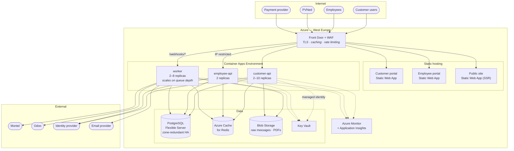

# Deployment

Azure as the default target because .NET Aspire deploys to Azure Container Apps with the least
friction **[OQ-50]**. The design keeps that reversible: everything is a container, the datastore is
standard PostgreSQL, and no Azure-specific service is on the critical path except managed identity
and Key Vault, both of which have direct equivalents elsewhere.

---

## 1. Target topology

## 2. Environments

| Environment | Purpose | Data | Scale | Access |
| --- | --- | --- | --- | --- |
| **Local** | Development | Seeded, synthetic | Aspire on one machine | Developer |
| **Dev** | Integration, shared | Synthetic + third-party stubs | Minimal | Team |
| **Test / Acceptance** | UAT, third-party integration testing | Anonymised production-shaped | Production-like | Team + stakeholders |
| **Production** | Live | Real | Full | Restricted, no standing DB access |

**Test must be production-shaped in data volume**, not only in configuration. An invoice run over 10
customers proves nothing about an invoice run over 500 metering points, and the interval-data query
plans only diverge at volume.

## 3. Sizing

| Component | Dev | Test | Production (year 1) |
| --- | --- | --- | --- |
| customer-api | 0.5 vCPU / 1 GB × 1 | 1 / 2 × 1 | **1 / 2 × 2–10** |
| employee-api | 0.5 / 1 × 1 | 1 / 2 × 1 | **1 / 2 × 2** |
| worker | 1 / 2 × 1 | 1 / 2 × 1 | **2 / 4 × 2–8** |
| PostgreSQL | Burstable B1ms | GP D2ds v5 | **GP D4ds v5, zone-redundant HA, 512 GB** |
| Redis | Basic C0 | Standard C1 | **Standard C1** |
| Blob | LRS | LRS | **GRS** with lifecycle rules |

Scaling rules:

| Component | Rule |
| --- | --- |
| customer-api | HTTP concurrency > 50/replica → scale out; min 2 |
| worker | Hangfire queue depth > 100 → scale out; min 2 |
| Both | Scale in only after 10 minutes below the threshold, to avoid flapping |

Minimum 2 replicas everywhere so a rolling deployment never drops to zero capacity.

## 4. Pipeline

```mermaid
flowchart LR
    PR["Pull request"] --> B["Build<br/>restore · compile · analyse"]
    B --> UT["Unit + architecture tests"]
    UT --> IT["Integration tests<br/>Testcontainers"]
    IT --> SEC["Security scan<br/>deps · secrets · SAST"]
    SEC --> IMG["Container images<br/>tagged with commit SHA"]
    IMG --> DEV["Deploy → Dev<br/><i>automatic</i>"]
    DEV --> E2E["E2E smoke<br/>Playwright"]
    E2E --> TST["Deploy → Test<br/><i>automatic on main</i>"]
    TST --> UAT["UAT sign-off<br/><i>manual gate</i>"]
    UAT --> PROD["Deploy → Production<br/><i>manual approval</i>"]
    PROD --> SMOKE["Production smoke test"]
    SMOKE --> OK{"Healthy?"}
    OK -->|no| RB["Roll back<br/>to previous revision"]
    OK -->|yes| DONE(["Done"])

    classDef gate fill:#78350f,stroke:#f59e0b,color:#fff
    class UAT,PROD gate
```

### 4.1 Deployment mechanics

- **Rolling with health gates.** Container Apps revisions; traffic shifts only after readiness
  probes pass.
- **Migrations run first, as a job**, before any new revision receives traffic
  ([Solution structure](02-solution-structure.md) §4).
- **Expand/contract** for breaking schema changes, so the previous revision keeps working during the
  shift.
- **Rollback is a traffic shift** back to the previous revision — seconds, not a redeploy. This only
  works because migrations are forward-compatible, which is why the expand/contract rule is not
  optional.
- **Feature flags** for anything that must be dark-launched, particularly invoicing.

## 5. Configuration & secrets

| Kind | Where |
| --- | --- |
| Non-secret configuration | Container App environment variables from IaC |
| Secrets | Key Vault, read via managed identity at startup and on rotation |
| Reference data (calendars, tariffs, surcharges, tickers) | **Database, editable in the employee portal** — never configuration **[NFR-54]** |
| Feature flags | Azure App Configuration or a database table |

No secret ever exists in source control, a container image, or a pipeline log. Verified in CI
**[NFR-34]**.

## 6. Backup & recovery

| Asset | Backup | RPO | RTO |
| --- | --- | --- | --- |
| PostgreSQL | Automated + PITR, 35-day retention | **5 min** | **< 4 h** |
| Blob storage | GRS with soft delete and versioning | Near-zero | < 1 h |
| Configuration & IaC | Git | — | Redeploy |
| Secrets | Key Vault soft delete + purge protection | — | < 1 h |

Recovery procedures are documented and rehearsed quarterly **[NFR-30]**. A restore that has never
been performed is not a backup.

### 6.1 Disaster recovery

Single-region with zone redundancy for the first release. A regional outage means downtime bounded by
a cross-region restore from geo-redundant backup — hours, not minutes. Whether that is acceptable is
**[OQ-62]**; a warm secondary region roughly doubles the infrastructure cost.

## 7. Monitoring & alerting

| Alert | Threshold | Severity |
| --- | --- | --- |
| API 5xx rate | > 1% over 5 min | **P1** |
| API p95 latency | > 2× target over 10 min | P2 |
| PVNed webhook failures | any 5xx | **P1** |
| No PVNed message received | > 6 h during expected window | **P1** |
| Hangfire critical queue depth | > 20 for 5 min | **P1** |
| Wallet ledger mismatch | any | **P1** |
| Unconfirmed accepted trade | > 4 h | P2 |
| Montel feed stale | > 30 min in market hours | P2 |
| Odoo push failing | > 3 consecutive | P2 |
| Database CPU | > 80% for 15 min | P2 |
| Database storage | > 85% | P2 |
| Certificate expiry | < 21 days | P2 |

P1 pages; P2 raises a ticket during business hours. **[OQ-63]** covers who is on the rota.

## 8. Portability

If Azure is not the answer **[OQ-50]**:

| Azure component | AWS | GCP | Self-hosted |
| --- | --- | --- | --- |
| Container Apps | ECS Fargate / App Runner | Cloud Run | Kubernetes / Nomad |
| PostgreSQL Flexible Server | RDS / Aurora PostgreSQL | Cloud SQL | PostgreSQL + Patroni |
| Blob Storage | S3 | Cloud Storage | MinIO |
| Cache for Redis | ElastiCache | Memorystore | Redis |
| Key Vault | Secrets Manager | Secret Manager | Vault |
| Front Door | CloudFront + WAF | Cloud Armor + LB | nginx + WAF |
| Monitor | CloudWatch + X-Ray | Cloud Operations | Grafana stack |

The migration cost sits in IaC and pipelines, not in the application. Aspire's deployment
integration is the main Azure-specific convenience being given up.

## 9. Cost drivers

Ranked, so the conversation starts in the right place:

1. **PostgreSQL** — the largest line, driven by HA and storage growth from interval data.
2. **Container Apps** — driven by minimum replica counts more than by load at this scale.
3. **Blob storage** — grows steadily with raw message retention; lifecycle rules to cool and archive
   tiers matter more than they look.
4. **Front Door / WAF** — fixed.
5. **Monitoring** — log volume, easily the biggest surprise if sampling is not configured.
6. Redis, Key Vault, Static Web Apps — minor.

## 10. Open questions

| Ref | Question |
| --- | --- |
| [OQ-50] | Is Azure confirmed? |
| [OQ-62] | Is single-region with zone redundancy acceptable, or is a warm secondary region required? |
| [OQ-63] | Who operates the platform after go-live, and what is the support rota? |
| [OQ-64] | Is there an existing Azure tenancy, landing zone or naming standard to align with? |
