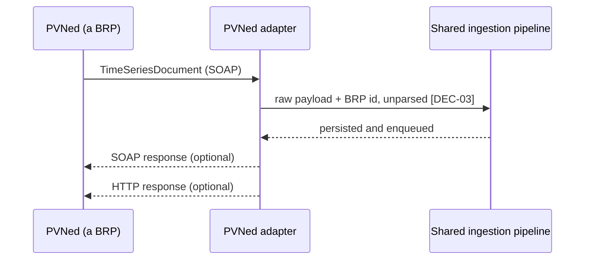
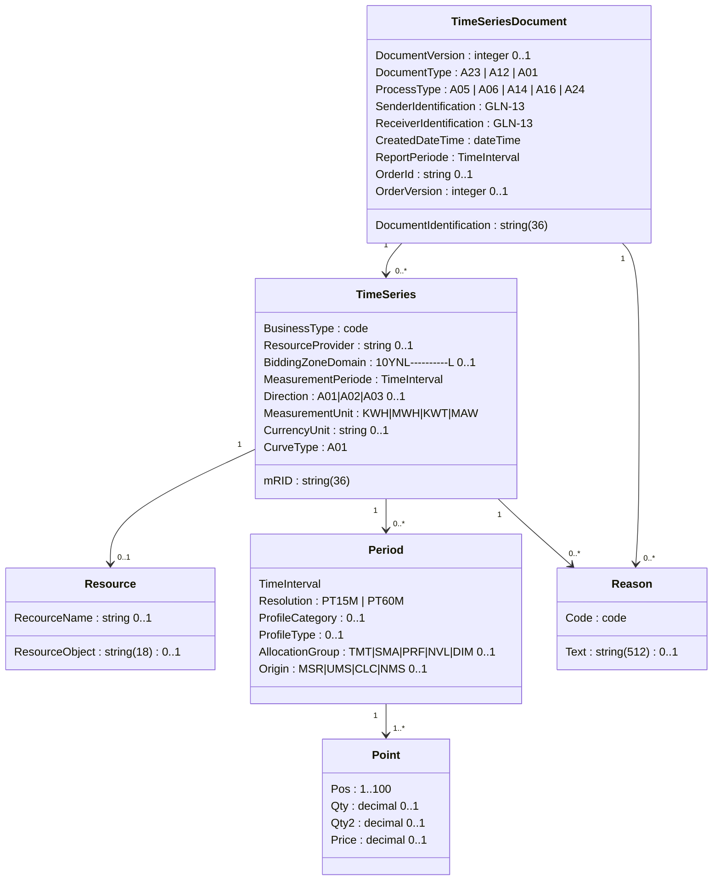

# Integration — PVNed TimeSeries

**Direction:** inbound push · **Protocol:** SOAP/XML over HTTPS · **Criticality:** highest ·
**Role:** the first adapter behind the BRP port **[DEC-69]**

⚠ **Restructured 2026-08-19 by [DEC-69].** PVNed is no longer *the* ingestion pipeline; it is **one
BRP adapter behind a port**. §1.2 states the port — what any BRP adapter must supply, and what the
shared pipeline keeps for every BRP — and §2 onwards is the **PVNed implementation** of it. No wire
detail changed. What changed is which of these details the rest of the platform is allowed to assume.

Written against three PVNed source documents: `TimeSeriesDocument-v2p0.xsd` (schema version 2.0.1),
the *PVNED Timeseries Document Implementation Guide* v2.2, and the sample
`CustomerImbalanceReport.json`.

> Those files are **not** in this repository — they are PVNed's copyright and not ours to
> redistribute. This document restates everything the platform needs from them: the document
> structure, the code lists, the interval mapping, the validation rules, a reconstructed sample, and
> the discrepancies found between the three (§9). Request the originals from PVNed and drop them in
> `specs/pvned_docs/` if you want them alongside.

---

## 1. Overview

PVNed pushes `TimeSeriesDocument` messages to a PeakPower endpoint. Two document categories matter:

| Category | `DocumentType` | `ProcessType` | Content |
| --- | --- | --- | --- |
| **Allocations / realisations** | `A23` | `A05` (metered data aggregation) or `A16` (realized) | Per-EAN consumption and production, 15-minute, kWh |
| **Imbalance report** | `A12` | `A06` (imbalance settlement) | Portfolio-level prognosis, realisation, imbalance volume and imbalance prices |

Namespace: `http://www.pvned.eu/CustomerIntegrations/External/v2p0`

Both categories carry **electricity only**. Gas is out of scope **[DEC-68]**, so no gas document, no
m³ volume and no gas code list is parsed or expected on this feed. The `commodity` discriminator
survives in the model **[DEC-15]** — it is nearly free now and expensive to retrofit — but every
document this adapter accepts is an electricity document.



The adapter, not the pipeline, decides what to say back: acknowledgement format and the meaning of a
non-2xx are **per-BRP** **[DEC-69]**. The guide's own sequence diagram shows both responses as
optional, which means **PeakPower must confirm what PVNed actually expects and how it treats a
non-2xx** — that determines the retry behaviour the platform depends on. **[OQ-05]**

### 1.1 PoC ingestion source **[DEC-21]**

The proof of concept ingests **generated** documents in this format. A mock PVNed service follows in
the test environment; the real integration is validated later. That closes **[OQ-05]** *for the PoC
only* — and the distinction matters, because almost nothing about the transport is actually known:

| Aspect | Status |
| --- | --- |
| Document format, code lists, interval mapping, validation rules | **Settled** — this document |
| Cadence, correction window, and whether a production series is always sent | **Settled** — **[DEC-38]**, ~~[DEC-57]~~ ⚠ **reversed by [DEC-98]**, **[DEC-65]**; §2.1, §2.2, §4.1.1. What follows the window is now settled the other way round: reconciliation data **does** arrive |
| Endpoint URL and authentication mechanism | **Unknown** — [OQ-05], [AS-16]. Under **[DEC-69]** these are **per-BRP reference data**, not one global setting, so the question is asked once per BRP and PVNed's answer binds PVNed only |
| Acknowledgement format and retry behaviour on non-2xx | **Unknown** — [OQ-05]. Per-adapter under **[DEC-69]**. This is why the diagram above is still hedged |
| The nine documentation inconsistencies in §9 | **Unwalked** — [OQ-65] |
| A usable PVNed test environment | **Not established.** The warning stands |

**Risk R-01 is deferred, not closed** ([Risks](../70-delivery/02-risks.md)) — it remains the
highest-scoring risk on the register.

The generated data must be produced **against the reconstructed sample message (§6) and the XSD
described in this document**, and driven through the **real webhook, parser and validation path**
(§8, §11). Data injected past the parser proves nothing: the format is the only part of this
integration the platform can currently test, so it is the part the generator has to exercise
honestly.

### 1.2 The BRP port, and what this document is an implementation of **[DEC-69]**

A **BRP** (*balanceringsverantwoordelijke partij*) is reference data: a row with its own endpoint,
credentials, document format and ingestion adapter. **A metering point is assigned to exactly one BRP
at a time** — the BRP that balances it — so every document has exactly one legitimate source, and
"which BRP does this figure come from" is answerable for every stored reading.

PVNed is the **first** BRP, not the only one. Everything from §2 onwards describes PVNed's adapter.
The split below is what makes a second BRP additive rather than a rewrite.

| Concern | Where it lives | Why there |
| --- | --- | --- |
| **Raw payload persistence before parsing** **[DEC-03]** | **Shared pipeline** | The reason for storing raw — replay, dispute resolution, and seeing quirks that the parser dropped — is identical for every BRP, and a per-adapter raw store would fragment the evidence |
| **Versioning** per (metering point, delivery date, direction) **[DEC-07]** | **Shared pipeline** | "What did we invoice on" is a platform question, not a vendor question |
| **Supersession ordering on receipt time** **[F02-R17]** | **Shared pipeline** | The rule exists because PVNed never revises a document; it is safe for any BRP, including one that *does* revise, because receipt order is always defined |
| **Quarantine** — unresolvable EAN, unknown code, wrong BRP | **Shared pipeline** | Quarantine is a storage state with a replay path **[F02-R27]**, not a parse outcome |
| **Completeness and the `PARTIAL` / `COMPLETE` / `FINAL` states** **[F02-R23]**, **[F02-R32]** | **Shared pipeline** | A property of a (metering point, delivery date), evaluated after application — §8.3 |
| **Calendar handling** — `timestamptz` in UTC, business days in `Europe/Amsterdam`, 92/96/100-interval DST days **[DEC-08]** | **Shared pipeline** | One calendar service, or DST bugs multiply per adapter |
| **Alerting**, raw retention **[NFR-39]**, replay **[F02-R27]**, manual entry **[DEC-60]** | **Shared pipeline** | Operational surface the back office learns once |
| Endpoint URL and transport (SOAP, REST, SFTP drop) | **Per adapter** | PVNed's is SOAP/XML push; nothing about that generalises |
| Authentication mechanism and credential storage | **Per adapter** | Shared secret, mTLS or OAuth is the counterparty's choice — [AS-16], [OQ-05] |
| Document format and schema | **Per adapter** | §3, §6 are PVNed's `TimeSeriesDocument` v2.0.1 and nothing else's |
| Parsing and code decoding | **Per adapter** | §4 — `Direction`, `BusinessType`, `MeasurementUnit`, `ResourceObject` are PVNed code lists |
| Field mapping onto the platform model | **Per adapter** | §7. The *target* shape is fixed by the port; the source fields are not |
| Interval placement rules | **Per adapter**, against the shared calendar | §5 — `Pos` 1..100 is a PVNed convention; the Amsterdam-local mapping it resolves to is not |
| **Acknowledgement semantics** — what to return, and what a non-2xx means to the sender | **Per adapter** | §10. PVNed's is unconfirmed [OQ-05]; a second BRP will have its own |

The contract in one line: **an adapter receives a message, persists it raw with its BRP id, and hands
the pipeline a normalised set of (metering point, delivery date, direction, position, quantity) tuples
plus the document identity.** Everything after that hand-off is BRP-agnostic.

**Cost, stated plainly.** The seam is an interface, a `brp` reference table and a `brp_id` on the
metering point — cheap now, expensive to retrofit once ingestion code assumes a single sender. The
price paid today is one indirection in a pipeline that currently has exactly one implementation, plus
the assignment check in §8.2 that would otherwise not exist. The price avoided is re-deriving raw
storage, versioning, quarantine and completeness for the second BRP.

## 2. Timing

| Aspect | Behaviour |
| --- | --- |
| First data for delivery date D | Arrives from **D+1** |
| **Cadence and granularity** | **One document per EAN per day [DEC-38]** — not a daily batch across EANs. Closes [OQ-21] |
| Corrections | Up to **10 working days** after D **on the routine feed** — the window in which corrections are *expected*, not the end of corrections. See the next row |
| **After the correction window** | ⚠ **Reversed 2026-08-19 by [DEC-98].** Original: ~~**Nothing. PVNed supplies no reconciliation data [DEC-57]** — the window is genuinely closed. Closes [OQ-66]~~. **PVNed does supply reconciliation data after the window** — sometimes as a document on the feed, sometimes as a **manual** process **[DEC-98]**. [OQ-66] closes with the opposite answer. §2.2 |
| Document revision | **Never.** Each send is a new GUID, `DocumentVersion` = 1, new `CreatedDateTime` |
| Authoritative version | *"The latest and greatest received document provides actual generation and load or forecast data"* — the most recently **received** document wins |
| Finalisation | PeakPower marks a date `FINAL` after 10 working days with no newer document **[F02-R23]**. ⚠ **Amended 2026-08-19 by [DEC-98]** — ~~under [DEC-57] that state is **final**: no later feed exists to reopen it~~. `FINAL` now means *the routine feed has stopped*, not *this number cannot change*: reconciliation reopens it, and the reopening produces a correction invoice whenever it lands **[DEC-99]** |

That the version number is always 1 is the reason ordering must be on **receipt time**, not on
`DocumentVersion` and not on `CreatedDateTime` **[F02-R17]**.

### 2.1 What the cadence buys and costs **[DEC-38]**

**[DEC-38]** and **[DEC-21]** are both unchanged by the 2026-08-19 round: one document per EAN per day
stands, and the PoC still ingests generated documents in this format.

| Consequence | Detail |
| --- | --- |
| Document count scales with **metering points**, not with customers | A 50-EAN customer produces ~50 documents a day, ~18 000 a year. Sizing, retention **[NFR-39]** and the raw-message store are dimensioned on that, not on one batch a day |
| Each payload is **small** | One EAN, one or two series, 92–100 points. The 25 MB limit **[F02-R06]** is nowhere near binding for allocation traffic, and a document that approaches it is itself a signal |
| The **mutex is the unit of concurrency** | Serialisation is per (metering point, delivery date) ([Background jobs](../20-architecture/06-background-jobs.md)). With one document per EAN per day, documents for different EANs never contend, so the pipeline parallelises cleanly and supersession still cannot race |
| Silence is **detectable per EAN** | An expected document that does not arrive is a per-metering-point signal rather than an inference from a missing batch **[F02-R26]** |

### 2.2 What arrives after the window ⚠ **Reversed 2026-08-19 by [DEC-98]**

> **Superseded text, kept for the record — §2.2 *The correction window is closed* [DEC-57]:**
>
> No reconciliation feed follows the 10 working days. Three consequences worth stating, because each
> removes work that would otherwise have been designed for:
>
> - `FINAL` is **final**, so nothing routine reopens a finalised date **[F02-R23]**.
> - There is **no second ingestion path** to build for reconciliation documents, and no second set of
>   supersession rules for them.
> - A document arriving **after** the window is an **exception**, not a late feed: it is stored,
>   versioned and applied like any other, it flags any invoice covering the date **[F02-R20]**, and it
>   **alerts**, because it contradicts what PVNed states it sends. It is not silently absorbed.

**PVNed does supply reconciliation data after the 10 working days [DEC-98]**, and it sometimes arrives
as a **manual** process rather than as a document on the feed. All three consequences above are
withdrawn. Two arrival forms, and where each goes:

| Arrival form | Path | What it costs |
| --- | --- | --- |
| A `TimeSeriesDocument` on the normal endpoint, after the window | The **normal** path — raw payload stored **[DEC-03]**, versioned **[DEC-07]**, ordered on receipt time **[F02-R17]**, applied like any other correction | Nothing new to build. One behaviour changes: it is **no longer an anomaly alert**, because PVNed states it sends these. It is an ordinary correction that happens to be late |
| A figure supplied outside the feed — mail, spreadsheet, a phone call | **Manual entry [DEC-60]** — flagged as manual and surfaced on every derived figure and invoice that consumes it | The manual-entry path stops being a rarely-used escape hatch for permanently missing data and becomes a **routine** carrier of reconciliation. It needs an owner, a queue and a review step, not just a form |

Consequences, replacing the three that are withdrawn:

- **`FINAL` is not terminal.** It means *the routine feed has stopped*, not *this number cannot
  change*. **[F02-R23]** keeps its definition; what it no longer implies is immutability, and no
  downstream calculation may treat `FINAL` as permission to discard the inputs.
- **Late corrections invoice.** A reconciliation delta on a month already invoiced produces a
  **correction invoice** for the difference, at any time **[DEC-99]** — see
  [F10 Invoicing & Settlement](../10-features/F10-invoicing-and-settlement.md). There is no cut-off
  date, and no materiality floor below which a difference is netted or waived **[DEC-100]**, so a
  €0,02 delta is invoiced like any other. This is the mechanism the annual true-up used to carry; it
  becomes continuous rather than annual.
- **The correction machinery never retires.** Versioning, supersession, the `AFFECTED_BY_CORRECTION`
  flag **[F02-R20]** and raw retention **[NFR-39]** must stay live for as long as reconciliation can
  arrive — which is now open-ended rather than bounded at 10 working days. Retention sized to the old
  window would destroy the evidence for exactly the invoices most likely to be disputed.

What still happens routinely, and is unchanged, is a correction *inside* the window landing *after* the
monthly invoice run — see [Metering data flow](../40-processes/02-metering-data-flow.md) §4. That is
the ordinary case for `AFFECTED_BY_CORRECTION`; **[DEC-98]** adds the late case to the same mechanism
rather than inventing a second one.

## 3. Document structure



> `RecourceName` is spelled that way in the schema. It is a typo in the source, it is normative, and
> the platform must send and expect it exactly as-is. Do not "fix" it in a mapping.

## 4. Code decoding

### 4.1 Direction

| Code | Meaning | Platform mapping |
| --- | --- | --- |
| `A01` | Production | `PRODUCTION` |
| `A02` | Consumption | `CONSUMPTION` |
| `A03` | Combined production and consumption | Rejected — the platform requires separated series **[AS-05]** |
| `A04` | Not used yet | Rejected |

Both series are **load-bearing for settlement**, not merely for display: **[DEC-22]** makes the
volume basis **net usage = consumption − production**, so `A01` mapped as consumption or `A02` mapped
as production produces a wrong invoice, not a wrong chart. This mapping is now a financial control.

#### 4.1.1 An `A01` series is not always sent **[DEC-65]**

**PVNed sends no `A01` series at all for a connection that never produces** — the series is simply
absent, not present-and-zero. This closes [OQ-84] and settles a question the platform cannot answer
from the wire:

| Observed on the wire | Means | Only distinguishable by |
| --- | --- | --- |
| `A02` present, `A01` absent, connection does not produce | **Complete.** Production is a declared zero | `metering_point.production_expectation = 'NEVER'` **[F01-R39]** |
| `A02` present, `A01` absent, connection **does** produce | **Missing data.** Net usage is unknown for that date | `production_expectation = 'EXPECTED'` — or `'UNKNOWN'`, which is treated the same way |

The two are **byte-identical on the wire**. Nothing in the document, the header or the code lists
separates them, which is why the discriminator has to be master data. The consequences bind the
parser and the completeness check, not the transport:

- **"Both directions present" is not the completeness test** **[F02-R32]**. Applied literally it would
  hold every non-producing connection at `PARTIAL` forever and block its invoicing.
- An absent `A01` is **not** a cancellation. PVNed's cancellation forms — series omitted, or all points
  zero (§7 of the guide) — look the same as this case for a producing connection, so a series that
  stops arriving on a connection flagged as producing is treated as missing and alerted, never as an
  instruction to zero the day.
- An `A01` that arrives for a connection recorded as `NEVER` is still stored and used **[F02-R34]**,
  and the master data is corrected in the same transaction — promoted to `EXPECTED` with source
  `OBSERVED`. The claim yields to the evidence, never the other way round.

**The declaration is the customer's, made at onboarding [DEC-112].** **[DEC-65]** is unchanged, and is
exactly why the declaration is needed: the two rows in the table above are **byte-identical on the
wire**, so the discriminator can only be master data — and master data with no owner and no moment is
a field that stays `UNKNOWN` forever. **[DEC-112]** gives it both.

**SJV** (*standaardjaarverbruik*) and the profile fractions are a **reference** used to sanity-check
what the customer declares, not its source: a profile fraction describes the shape of a connection's
year, not whether there are panels on the roof. A declaration that contradicts the SJV is grounds to
ask the customer again — never grounds to overwrite what they declared.

Unchanged by **[DEC-112]**: the property still defaults to `UNKNOWN`; `UNKNOWN` is still treated as
`EXPECTED` for completeness alerting **[F02-R32]**; and a change to it is still read **forward-only**
**[F01-R41]**, so a customer who installs panels in June does not retroactively make January
incomplete. **Closes [OQ-91].**

### 4.2 BusinessType (the codes that appear in practice)

| Code | Meaning | Where seen |
| --- | --- | --- |
| `A01` | Production | Allocation |
| `A04` | Consumption | Allocation |
| `A02` | *(sample uses this for `Realisation`)* | Imbalance report |
| `A07` | Net production / consumption | Allocation |
| `A14` | Aggregated energy data — used for `Prognosis` in the sample | Imbalance report |
| `A20` | Imbalance volume | Imbalance report |
| `B23` | Consumption imbalance price | Imbalance report |
| `B24` | Production sales imbalance price — `Imbalance price negative` in the sample | Imbalance report |
| `B25` | Production purchase imbalance price — `Imbalance price positive` in the sample | Imbalance report |
| `N101`…`N142` | Allocation variants (TMT, SMA, PRF, NVL, DIM, aggregated per LV) | Allocation |

The full list is in the guide §5.5.2 and the XSD enumeration. **The platform must not hard-code an
exhaustive match**: it handles the codes it knows, and quarantines anything else with an alert rather
than discarding it.

`A14`, `A02`, `A20`, `B23`, `B24` and `B25` are parsed, validated and stored exactly as specified
here. **[DEC-25]** takes imbalance out of scope, so nothing downstream turns them into a charge — the
decoding stays, the charging is deferred. See §7.2.

### 4.3 MeasurementUnit

| Code | Meaning |
| --- | --- |
| `KWH` | Kilowatt hour |
| `MWH` | Megawatt hour |
| `KWT` | Kilowatt |
| `MAW` | Megawatt |

The dependency table specifies `KWH` for allocations and `KWT`/`MWH` for imbalance. **The sample
disagrees**: it uses `KWH` for `A14`, `A02` and `A20`, and `MWH` for `B24` and `B25`. The platform
therefore reads the unit from the message and converts, rather than assuming — and logs a warning
when the unit is not the one the dependency table predicts.

### 4.4 `ResourceObject`

| Value shape | Meaning | Handling |
| --- | --- | --- |
| 18 digits | Metering point EAN (GLN-18) | Resolve to a metering point **[AS-17]** |
| Free text ≤ 18 chars | A descriptive label: `Prognosis`, `Realisation`, `Imbalance`, `Imbalance price negative`, `Imbalance price positive` | Portfolio-level series, stored in the imbalance tables |

Discrimination is on "is it 18 digits", exactly as the guide §5.6.1 describes.

## 5. Interval mapping

```
Pos = 1   →  local 00:00 – 00:15 on the delivery date
Pos = n   →  local start = midnight + (n − 1) × 15 min, in Europe/Amsterdam
```

| Day type | `Pos` range | Note |
| --- | --- | --- |
| Normal | 1 – 96 | |
| Spring forward (last Sunday in March) | 1 – **92** | 02:00–03:00 local does not exist |
| Autumn fall back (last Sunday in October) | 1 – **100** | 02:00–03:00 local occurs twice; `Pos` 9–12 are the first pass, 13–16 the second |

The XSD caps `Pos` at 100 precisely for the autumn day. The delivery date is derived from
`MeasurementPeriode.StartPeriod` converted to `Europe/Amsterdam` — in the sample,
`2024-12-27T23:00:00Z` is midnight on **28 December 2024** local, so the delivery date is
`2024-12-28`.

**Conversion is always via the local calendar, never by adding a fixed offset.**

## 6. Sample document

Reconstructed in XML from the supplied JSON sample, in schema element order:

```xml
<?xml version="1.0" encoding="UTF-8"?>
<soap:Envelope xmlns:soap="http://schemas.xmlsoap.org/soap/envelope/">
  <soap:Body>
    <TimeSeriesDocument xmlns="http://www.pvned.eu/CustomerIntegrations/External/v2p0">
      <DocumentIdentification>8ff18bca-9e80-41aa-bd9f-3202f2fcc6c8</DocumentIdentification>
      <DocumentVersion>1</DocumentVersion>
      <DocumentType>A12</DocumentType>
      <ProcessType>A06</ProcessType>
      <SenderIdentification>8714252005776</SenderIdentification>
      <ReceiverIdentification>8712423456789</ReceiverIdentification>
      <CreatedDateTime>2025-01-14T15:15:05Z</CreatedDateTime>
      <ReportPeriode>
        <StartPeriod>2024-12-27T23:00:00Z</StartPeriod>
        <EndPeriod>2024-12-28T23:00:00Z</EndPeriod>
      </ReportPeriode>

      <TimeSeries>
        <mRID>3e09aa9e-5013-4b32-8305-f9e6c4430614</mRID>
        <BusinessType>A20</BusinessType>
        <MeasurementPeriode>
          <StartPeriod>2024-12-27T23:00:00Z</StartPeriod>
          <EndPeriod>2024-12-28T23:00:00Z</EndPeriod>
        </MeasurementPeriode>
        <Direction>A01</Direction>
        <MeasurementUnit>KWH</MeasurementUnit>
        <CurrencyUnit>EUR</CurrencyUnit>
        <CurveType>A01</CurveType>
        <Resource>
          <RecourceName>Imbalance</RecourceName>
        </Resource>
        <Period>
          <TimeInterval>
            <StartPeriod>2024-12-27T23:00:00Z</StartPeriod>
            <EndPeriod>2024-12-28T23:00:00Z</EndPeriod>
          </TimeInterval>
          <Resolution>PT15M</Resolution>
          <Point><Pos>1</Pos><Qty>0</Qty><Price>-30.81</Price></Point>
          <Point><Pos>2</Pos><Qty>0</Qty><Price>-28.51</Price></Point>
          <!-- … through Pos 96 … -->
        </Period>
      </TimeSeries>
      <!-- further TimeSeries: A14 Prognosis, A02 Realisation, B24/B25 imbalance prices -->
    </TimeSeriesDocument>
  </soap:Body>
</soap:Envelope>
```

## 7. Mapping to the platform model

### 7.1 Allocation documents (`A23`)

| PVNed | Platform |
| --- | --- |
| `SenderIdentification` (GLN-13) | The `brp` row this adapter is configured for **[DEC-69]**, recorded on the version so a later reader can tell which BRP delivered the figure |
| `Resource.ResourceObject` (18 digits) | `metering_point.ean` |
| `MeasurementPeriode.StartPeriod` → Amsterdam date | `interval_data_version.delivery_date` |
| `Direction` `A01`/`A02` | `interval_data_version.direction` |
| `DocumentIdentification` | `interval_data_version.document_id` |
| `CreatedDateTime` | `interval_data_version.document_created` |
| Receipt timestamp | `interval_data_version.received_at` — **the ordering key** |
| `Point.Pos` | `interval_reading.pos` |
| `Point.Qty` (+ unit conversion) | `interval_reading.quantity_kwh` |
| `Point.Qty2` | Not used — see §9 |

### 7.2 Imbalance documents (`A12`)

**Stored, not charged [DEC-25].** Imbalance is out of scope: `A12` documents are received, validated
and persisted exactly as mapped below, and invoice line 3 is not implemented
([Invoice calculation](../50-calculations/03-invoice-calculation.md)). Keeping the mapping specified
means bringing imbalance into scope later is a calculation change, not an ingestion change — which is
the whole reason for storing the documents rather than discarding them.

| Series | Platform target |
| --- | --- |
| `A14` / `Prognosis` | `imbalance_reading.prognosis_kwh` per direction |
| `A02` / `Realisation` | `imbalance_reading.realisation_kwh` per direction |
| `A20` / `Imbalance` | `imbalance_reading.volume_kwh` and `settlement_price` per direction |
| `B24` / `Imbalance price negative` | `imbalance_price.negative_price` |
| `B25` / `Imbalance price positive` | `imbalance_price.positive_price` |

Stored at portfolio level **[AS-18]**. Allocation to EANs — [OQ-15] — is **moot while [DEC-25]
holds**: with no charge there is no allocation key to choose, and no allocation method to state in
the customer contract. [AS-18] and [OQ-15] both become live again only if imbalance is ever invoiced.

## 8. Validation

§8.1 and §8.2 are **adapter-level**: they validate a PVNed `TimeSeriesDocument`, and a second BRP would
bring its own equivalents. §8.3 is **port-level** and BRP-agnostic — completeness is a property of a
(metering point, delivery date), not of a document **[DEC-69]**.

### 8.1 Structural

1. Well-formed XML; SOAP envelope present.
2. **XSD validation** against the pinned `TimeSeriesDocument-v2p0.xsd`.
3. **DTD processing and external entity resolution disabled** — mandatory for any XML endpoint
   ([Security](../20-architecture/07-security.md) §4.1).

### 8.2 Semantic

| Rule | Failure |
| --- | --- |
| `DocumentType`/`ProcessType` is a handled combination | `UNSUPPORTED_DOCUMENT_TYPE` |
| `ReceiverIdentification` is PeakPower's own GLN | `WRONG_RECEIVER` |
| `SenderIdentification` is the GLN configured for this BRP **[DEC-69]** — PVNed's, on this adapter | `UNKNOWN_SENDER` |
| `Resolution` = `PT15M` | `UNSUPPORTED_RESOLUTION` |
| `CurveType` = `A01` | `UNSUPPORTED_CURVE_TYPE` |
| `MeasurementPeriode` covers exactly one Amsterdam calendar day | `INVALID_MEASUREMENT_PERIOD` |
| Point count equals the expected interval count (92/96/100) for that date | `INCOMPLETE_PERIOD` |
| `Pos` values contiguous from 1, no duplicates | `INVALID_POSITIONS` |
| `Qty` ≥ 0 | `NEGATIVE_QUANTITY` |
| `ResourceObject` resolves to a registered metering point valid on that date | `UNKNOWN_METERING_POINT` → **quarantine, not reject** |
| That metering point's assigned BRP is the one this adapter serves **[DEC-69]** | `WRONG_BRP_FOR_METERING_POINT` → **quarantine, not reject**. A metering point has exactly one BRP at a time, so a document from a different one is either a misrouted send or a stale assignment. Both need a human; neither may silently overwrite a good figure |

Failures mark the message `FAILED` with the code, raise an alert, and apply nothing — a document
lands whole or not at all **[F02-R13]**.

### 8.3 Day completeness — a separate check, and not a document check **[DEC-65]**

§8.1 and §8.2 validate a **document**. Completeness is a property of a **(metering point, delivery
date)** and is evaluated after the document has been applied, because under **[DEC-38]** the day's data
may arrive in more than one document and under **[DEC-65]** one of the expected series may never arrive
at all.

| Condition | Result |
| --- | --- |
| `A02` present with the expected interval count (92 / 96 / 100) and `production_expectation = 'NEVER'` | **Complete.** Production is a declared zero **[F02-R33]** |
| `A02` and `A01` both present with the expected count | **Complete**, whatever the expectation says |
| `EXPECTED` and `A01` absent, or short of the expected count | **`PARTIAL`** — alert naming **PVNed** first **[F02-R35]** |
| `UNKNOWN` and `A01` absent | **`PARTIAL`** — treated as `EXPECTED`, but the alert names the **missing customer declaration**, because the fix is to obtain it from the customer rather than to chase a resend from PVNed **[F02-R35]**, **[DEC-112]** |
| `A02` absent or short | **`PARTIAL`** regardless of the expectation |

**This check must not be written as `directions.Count == 2`.** That is the single line **[DEC-65]** was
raised to prevent, and it fails silently: every non-producing connection stops invoicing and the cause
looks like a PVNed fault.

## 9. Documentation inconsistencies found

Reviewing the XSD, the guide and the sample against each other surfaced the following. **These should
be raised with PVNed before implementation** — each one is a place where a reasonable implementer
could guess wrong. **[OQ-65]**

| # | Field | Guide | XSD | Sample | Recommended handling |
| --- | --- | --- | --- | --- | --- |
| 1 | `DocumentIdentification` | max **35** chars | `maxLength 36` | 36-char GUID | Accept 36; a GUID does not fit in 35 |
| 2 | `Sender`/`ReceiverIdentification` | GLN-13, max **13** | `maxLength 16` | 13 digits | Validate as 13 digits; accept up to 16 |
| 3 | `Pos` | max **6** characters | `maxInclusive 100` | 1–96 | Enforce the XSD bound of 100 |
| 4 | `Qty` max value | §5.8.2 says **9999,999**; Annex A says **9999.000** | unbounded `xs:decimal` | max observed 2 164 | 9 999 kWh per 15 min is only ≈ 40 MW average — reachable by a very large connection. **Do not enforce this as a hard cap**; validate plausibility against the metering point's capacity and alert instead of rejecting. Confirm with PVNed whether it is a real limit |
| 5 | `MeasurementUnit` for imbalance | dependency table says `KWT` / `MWH` | enum includes `KWH` | `KWH` for A20/A14/A02 | Read from the message, convert, warn on the unexpected |
| 6 | Annex A validations | reference `DocumentType` `A67`/`A26`, `ProcessType` `A14`/`A33`, `MeasurementUnit` `MAR` | none of these exist in this XSD | — | Annex A describes the **customer → PVNed** direction and does not apply to inbound processing. Confirm |
| 7 | `Period.TimeInterval` | must sit within `MeasurementPeriode` | — | **Contradicts it** — sample shows `2024-11-30T23:00 → 2024-12-27T23:00` against a one-day `MeasurementPeriode` | Treat `MeasurementPeriode` + `Pos` as authoritative; log the discrepancy. **[OQ-20]** |
| 8 | `Qty2` | "the same value for the previous year" | optional | absent | Not used by the platform |
| 9 | `CurveType` `A03` | listed as permitted in §5.5.11 | enum allows only `A01` | `A01` | Reject `A03` |

Item 7 is the one that would silently corrupt data if implemented naively: an implementer who trusts
`Period.TimeInterval` to place the points would write a month's worth of intervals to the wrong dates.

> The sample is an **imbalance** report, so items 4, 5 and 7 are observed in that context. Whether the
> same quirks appear in allocation documents is unknown until real allocation traffic is seen — which
> is itself an argument for storing every raw payload from day one **[DEC-03]**.

## 10. Error handling & operations

Everything in this table is **PVNed's contract**, not the port's: status codes, the duplicate window
and the retry expectation are adapter-level under **[DEC-69]**. What the pipeline guarantees behind it
— raw payload stored before parsing **[DEC-03]**, versioned application **[DEC-07]**, quarantine,
replay **[F02-R27]** — is identical for every BRP.

| Situation | Behaviour |
| --- | --- |
| Auth failure | `401`, logged, alert on repetition |
| Payload too large | `413` |
| Malformed HTTP / storage failure | `5xx` so PVNed retries — the only case where failing loudly is right |
| Stored but invalid | `200` to PVNed, message `FAILED`, alert, manual replay after fix |
| Unknown EAN | `200`, series quarantined, alert |
| EAN assigned to a different BRP | `200`, series quarantined, alert **[DEC-69]** |
| Document arrives **after** the 10-working-day window | `200`, applied as an ordinary correction **[DEC-98]**. ⚠ **No longer an anomaly alert** — see §2.2. It flags any invoice covering the date **[F02-R20]** and can produce a correction invoice **[DEC-99]** |
| Duplicate payload within 24 h | `200`, marked `DUPLICATE`, not reprocessed |

Replay is available to admins **[F02-R27]** and is idempotent.

## 11. Testing

A PVNed test environment may not exist **[OQ-05]**, so the `DevStubs` generator
([Solution structure](../20-architecture/02-solution-structure.md) §4.1) is not only a test fixture —
under **[DEC-21]** it is **the PoC's data source**. Phase 1 ingests what it produces. It must be able
to generate:

- a normal 96-interval allocation day with a realistic load shape, for many EANs;
- **one document per EAN per day [DEC-38]**, so the generator reproduces the real cadence and the
  ingestion pipeline is exercised at the real document count rather than at one batch a day;
- **both directions per EAN, for producing EANs** — `A01` production and `A02` consumption — since net
  usage needs both **[DEC-22]**;
- **EANs with no `A01` series at all**, matching a connection that never produces **[DEC-65]**, so the
  completeness check **[F02-R32]** is exercised against `production_expectation = 'NEVER'` and not
  against "both directions present";
- days where production exceeds consumption in some intervals, so negative net usage is exercised;
- days where the consumption series arrives and the production series does not **for an EAN flagged as
  producing**, so *missing* is exercised as missing rather than as zero — the case that is
  indistinguishable on the wire from the one above;
- 92- and 100-interval DST days;
- a correction superseding an earlier document;
- an imbalance report matching the supplied sample exactly;
- one deliberately invalid document per validation rule in §8.2;
- a document with an unknown EAN;
- an out-of-order pair (later `CreatedDateTime` received first);
- a **post-window reconciliation document** — a correction landing well after the 10 working days and
  after the month has been invoiced — so the correction-invoice path **[DEC-98]**, **[DEC-99]** is
  exercised rather than assumed, and so the absence of an anomaly alert is verified;
- a **manual** reconciliation entry **[DEC-60]** for the same delivery date, so the manual flag is
  exercised on every derived figure that consumes it;
- a document whose EAN is assigned to a **different BRP**, so the assignment check quarantines instead
  of applying **[DEC-69]**;
- a 25 MB document, for the size limit.

Everything it produces is delivered **over the real webhook** and processed by the **real parser and
validation path**. A generator that writes `interval_reading` rows directly, or a test that hands the
processor a pre-built object graph, exercises none of what **[DEC-21]** is relying on it to exercise.

The mock PVNed service in the test environment is the next step up: the same documents, pushed on a
schedule, so cadence, duplicates, the correction window **and what arrives after it** **[DEC-98]** are
exercised as well as the format. Note what the generator is *not*: it produces the **PVNed** format, so
a second BRP needs its own generator. That is the honest measure of how thin the port in §1.2 really
is. Neither substitutes for the real integration — see §1.1.

## 12. Open questions

Post-2026-08-19. **Two questions remain genuinely open on this integration** — [OQ-20] and [OQ-65] —
and they are the same question in two sets of clothes: nobody has yet walked the PVNed documentation
with PVNed. Both need the same conversation and should be scheduled together with [OQ-05].

| Ref | Question |
| --- | --- |
| [OQ-05] | Endpoint URL and authentication; is a SOAP acknowledgement expected and in what format; retry policy on non-2xx; is there a test environment? — **closed for the PoC only by [DEC-21]; open for the real integration** (§1.1). ⚠ **Reframed by [DEC-69]**: endpoint, credentials and acknowledgement semantics are per-BRP reference data, so this is one instance of a question that recurs for every BRP added, and PVNed's answer binds PVNed only |
| [OQ-15] | Can PVNed supply imbalance data per EAN rather than per portfolio? — **moot while [DEC-25] holds** (§7.2) |
| **[OQ-20]** | **OPEN.** How should the `Period.TimeInterval` inconsistency be interpreted? (§9 item 7). Untouched by the 2026-08-19 round |
| ~~[OQ-21]~~ | ~~Message volume and cadence — one document per EAN per day, or batched across EANs?~~ **Closed by [DEC-38]** — one document per EAN per day (§2.1). Unchanged by the 2026-08-19 round |
| **[OQ-65]** | **OPEN.** Walk through the nine inconsistencies in §9 with PVNed and confirm the intended behaviour. Untouched by the 2026-08-19 round |
| ~~[OQ-66]~~ | ~~Does PVNed also supply reconciliation data after the 10-working-day window, and should it be ingested?~~ ⚠ Its first closure — **[DEC-57]**, *it does not* — is **reversed**. **Closed by [DEC-98]** with the opposite answer: PVNed **does** supply it, sometimes as a manual process, and it is ingested through the normal path or through manual entry **[DEC-60]** (§2.2) |
| ~~[OQ-84]~~ | ~~Does PVNed send an `A01` series at all for a connection that never produces?~~ **Closed by [DEC-65]** — it does not; the series is absent. The completeness test moves to `production_expectation` (§4.1.1, §8.3) |
| ~~[OQ-91]~~ | ~~Who sets a metering point's production expectation, and when?~~ **Closed by [DEC-112]** — the customer declares it at onboarding; SJV and profile fractions are a cross-check, not the source (§4.1.1) |

None of the questions opened on 2026-08-19 ([OQ-92]…[OQ-96]) touch this integration.
