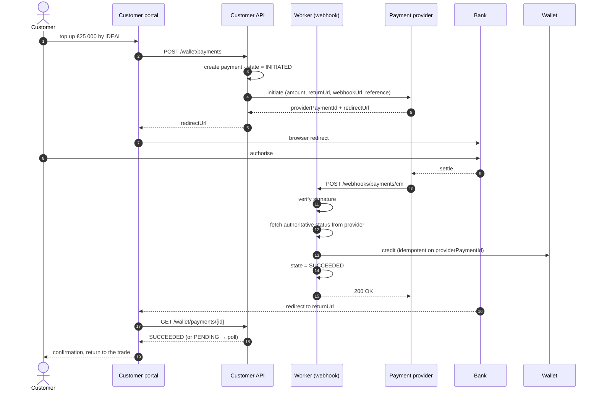
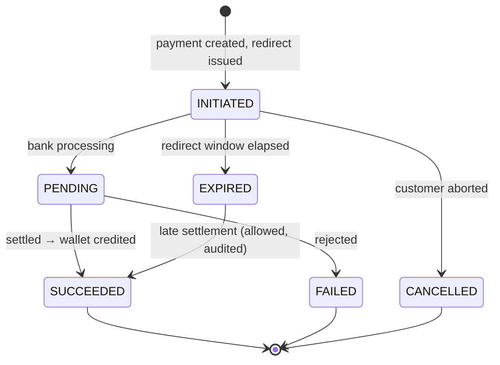

# Integration — Payments (CM.com / iDEAL)

**Direction:** outbound request + inbound webhook · **Protocol:** REST/JSON + HTTPS callback ·
**Criticality:** high

Feature spec: [F07 Wallet top-up & payments](../10-features/F07-wallet-topup-and-payments.md).

CM.com is the candidate provider **[OQ-34]**. The integration is written against a generic
provider port so that Mollie, Adyen, Buckaroo or any other iDEAL acquirer is a configuration change
rather than a rewrite.

---

## 1. Provider port

```csharp
public interface IPaymentProvider
{
    Task<Result<PaymentInitiation>> InitiateAsync(PaymentRequest request, CancellationToken ct);
    Task<Result<PaymentStatus>>     GetStatusAsync(string providerPaymentId, CancellationToken ct);
    Result<WebhookEvent>            ParseAndVerifyWebhook(HttpRequest request, string rawBody);
}

public sealed record PaymentRequest(
    Guid PaymentId, Money Amount, string Description,
    Uri ReturnUrl, Uri WebhookUrl, string CustomerReference);

public sealed record PaymentInitiation(string ProviderPaymentId, Uri RedirectUrl, DateTimeOffset ExpiresAt);

public enum PaymentStatus { Initiated, Pending, Succeeded, Failed, Cancelled, Expired }
```

## 2. Flow



**Step 12 is the one people skip.** The webhook body is treated as a *notification that something
changed*, not as the truth. The worker calls the provider back for the authoritative status before
crediting. A signature proves the message came from the provider; it does not prove the message is
current.

## 3. Webhook handling

| Control | Detail |
| --- | --- |
| Signature | HMAC verified against the shared secret from Key Vault; constant-time comparison; unverified requests rejected `401` and logged |
| Idempotency | Keyed on `provider_payment_id` + status; a repeat is acknowledged and ignored |
| Amount check | Confirmed status amount must equal the originating payment amount. A mismatch is **quarantined and alerted, never credited** |
| Currency check | Must be EUR |
| Ordering | Out-of-order deliveries handled by state precedence — a terminal state is never overwritten by a non-terminal one |
| Response | `200` as fast as possible; heavy work is queued |
| Unknown payment id | `200` (so the provider stops retrying), logged, alerted |

## 4. Payment states



`EXPIRED → SUCCEEDED` is deliberate. A payment that settles after the platform gave up is still the
customer's money, and refusing it would be both wrong and hard to explain.

## 5. Reconciliation

Webhooks get lost. `ReconcilePaymentsJob` runs every 15 minutes and, for every payment in
`INITIATED` or `PENDING` older than 10 minutes, queries the provider for its real status and applies
it through the same idempotent path.

A daily job compares the day's succeeded payments against the provider's settlement report and alerts
on any difference **[OQ-67]**.

## 6. Manual bank transfer

No integration in the first release. The platform provides the instruction data; finance registers
receipts.

| Field | Source |
| --- | --- |
| IBAN, BIC, account holder | Platform configuration |
| **Wallet reference** | Generated per customer, stable, e.g. `PP-4821-QK` |

The reference is the matching key, so it is designed to survive being typed by a human into a banking
app: grouped, uppercase, and drawn from an alphabet excluding `I`, `O`, `0` and `1`. A check
character allows the platform to reject an obvious typo before it becomes an unmatched payment.

Statement import (CAMT.053 / CSV) is [F07-R19], a *Could* **[OQ-07]**.

## 7. Security

| Control | Detail |
| --- | --- |
| Card and account data | **Never touched.** Redirect flow only; the platform holds a payment id and a status |
| Secrets | Key Vault, rotatable without redeployment |
| Webhook endpoint | Public by necessity; rate-limited, signature-verified, logged |
| Amount tampering | Defeated by the amount check plus the authoritative status fetch |
| Replay | Defeated by idempotency on the provider payment id |
| PCI scope | Out of scope for iDEAL redirect. Re-evaluate if card payments are ever added |

## 8. Testing

| Scenario | How |
| --- | --- |
| Success | Provider sandbox |
| Cancellation, failure, expiry | Provider sandbox test states |
| Duplicate webhook | Replay the same payload; assert one credit |
| Out-of-order webhooks | Deliver `SUCCEEDED` then `PENDING`; assert the terminal state holds |
| Forged signature | Assert `401` and no credit |
| Amount mismatch | Assert quarantine, alert, and no credit |
| Missing webhook | Suppress it; assert reconciliation resolves within 15 minutes |
| Late success after expiry | Assert credit and audit note |

## 9. Open questions

| Ref | Question |
| --- | --- |
| [OQ-07] | Is bank statement import in scope? |
| [OQ-30] | Refunds — in scope, who approves, and via the provider or a manual transfer? |
| [OQ-32] | Minimum and maximum top-up amounts |
| [OQ-33] | Chargeback and reversal handling |
| [OQ-34] | Is CM.com contracted, and does it cover iDEAL at the expected volumes? |
| [OQ-67] | Does the provider offer a settlement report suitable for automated reconciliation? |
| [OQ-68] | Are non-iDEAL methods needed (SEPA credit transfer via the provider, Bancontact for Belgian entities)? |
