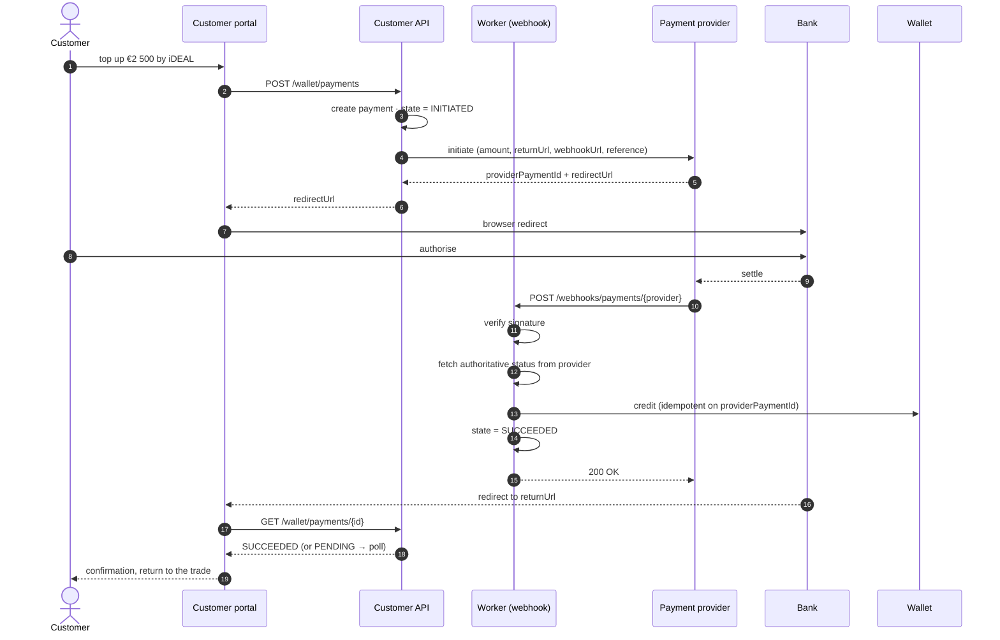
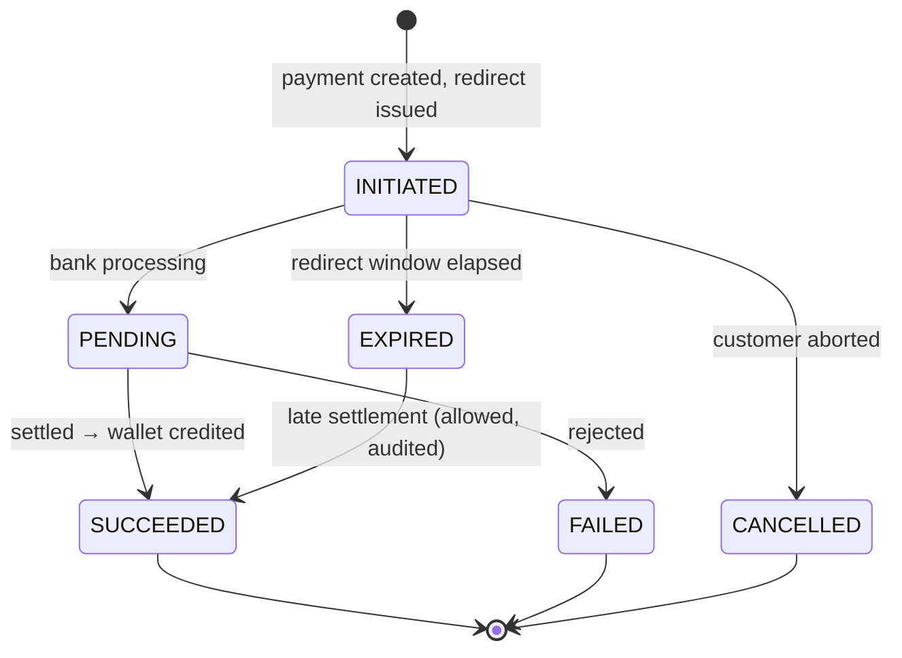
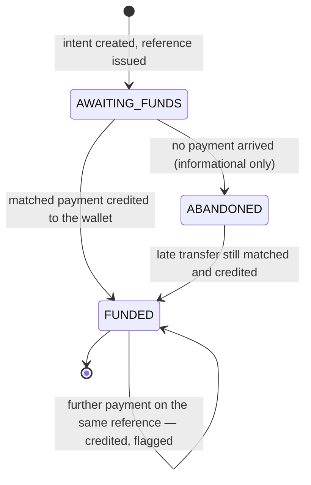
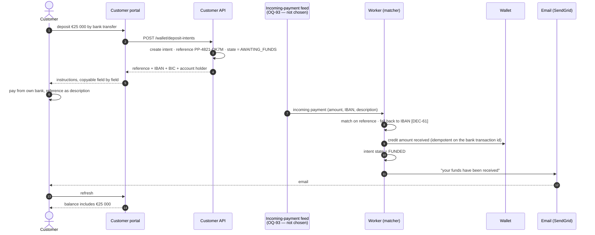

# Integration — Wallet deposits (payment provider · bank transfer)

⚠ **Retitled 2026-08-19 by [DEC-86].** The old title was *Payments (CM.com / iDEAL)*. **No payment
service provider is chosen** — CM.com is a candidate, not a commitment — so a title naming one
provider states a decision that was not taken. The **filename stays `03-payments-cm-com.md`**: every
cross-reference in this set and in the built site resolves to that path, and renaming it would break
those links to buy a tidier filename. The provider name survives in the filename only, and means
nothing there.

**Direction:** outbound request + inbound webhook (provider route) · inbound payment feed
(bank-transfer route — **which feed is not chosen, [OQ-93]**) · **Protocol:** REST/JSON + HTTPS
callback · **Criticality:** high

Feature spec: [F07 Wallet top-up & payments](../10-features/F07-wallet-topup-and-payments.md).
Process: [Wallet top-up flow](../40-processes/03-wallet-topup-flow.md).

~~CM.com is the candidate provider **[OQ-34]**.~~ ⚠ **Amended 2026-08-19 by [DEC-86]** — **[OQ-34]
closes as *deliberately undecided***. It is not settled whether CM.com, another PSP, or **any PSP at
all** will be contracted. The integration is written against a generic provider port so that CM.com,
Mollie, Adyen, Buckaroo or any other iDEAL acquirer is a configuration change rather than a rewrite.
The port stops being a hedge against a contract negotiation and becomes the only reason this route can
be specified, estimated and built while the provider is unknown — it earns its keep on the day the
decision is deferred, not on the day the provider is swapped.

**Why bank transfer is a route and not a consolation prize: iDEAL is limited at the bank side
[DEC-86].** The ceiling sits at the customer's own bank, not at the PSP and not in the platform, so no
contract term and no configuration value removes it. A trading wallet has to carry whatever the
customer intends to trade, and **[DEC-84]** removes the minimum and the maximum deposit amount
precisely because that number "depends on the volume the customer wants to trade". A consumer payment
rail cannot be relied on to carry it. Bank transfer is therefore a **first-class deposit method
[DEC-106]** — modelled, matched and credited by the platform — not an out-of-band manual step.

---

## 1. Provider port

```csharp
public interface IPaymentProvider
{
    Task<Result<PaymentInitiation>> InitiateAsync(PaymentRequest request, CancellationToken ct);
    Task<Result<PaymentStatus>>     GetStatusAsync(string providerPaymentId, CancellationToken ct);
    Result<WebhookEvent>            ParseAndVerifyWebhook(HttpRequest request, string rawBody);
}

public sealed record PaymentRequest(
    Guid PaymentId, Money Amount, string Description,
    Uri ReturnUrl, Uri WebhookUrl, string CustomerReference);

public sealed record PaymentInitiation(string ProviderPaymentId, Uri RedirectUrl, DateTimeOffset ExpiresAt);

public enum PaymentStatus { Initiated, Pending, Succeeded, Failed, Cancelled, Expired }
```

Two things this port deliberately does **not** carry, both decided on 2026-08-19:

| Absent from the port | Why, and what it costs |
| --- | --- |
| A refund or payout call | **[DEC-83]** — withdrawals are paid out **manually** by a PeakPower employee, by bank transfer to the company bank account on the customer record **[DEC-61]**, never pushed back through the provider. A payout method on this interface would imply a capability nobody has decided to buy, and would have to be contracted for on top of iDEAL. Cost: every payout is a human action with a human's latency; see §8 |
| A minimum or maximum amount | **[DEC-84]** — the €100 / €250 000 defaults are **removed**, not configured. The platform initiates whatever amount the customer entered. The only surviving ceiling is the customer's own bank-side iDEAL limit, which the platform cannot see, cannot query and must not pretend to know; a payment that exceeds it fails at the bank and arrives back as `FAILED` |

## 2. Provider (iDEAL) flow



⚠ **The worked amount changed on 2026-08-19.** This diagram used to open with *"top up €25 000 by
iDEAL"*. That example is no longer honest: **iDEAL is limited at the bank side [DEC-86]**, and €25 000
is above what a Dutch bank will typically authorise in one iDEAL payment. The illustration is now
**€2 500** — an amount the rail carries — and the €25 000 case is shown on the bank-transfer route in
§6, which is the route that exists for it. Nothing about the step sequence changed; **[DEC-84]** still
means the platform itself imposes neither a floor nor a ceiling.

⚠ The webhook path is **`/webhooks/payments/{provider}`**, not `/webhooks/payments/cm`. With no
provider chosen **[DEC-86]**, a hard-coded provider segment would have to be migrated the day one is.

**Step 12 is the one people skip.** The webhook body is treated as a *notification that something
changed*, not as the truth. The worker calls the provider back for the authoritative status before
crediting. A signature proves the message came from the provider; it does not prove the message is
current.

## 3. Webhook handling

| Control | Detail |
| --- | --- |
| Signature | HMAC verified against the shared secret from Key Vault; constant-time comparison; unverified requests rejected `401` and logged |
| Idempotency | Keyed on `provider_payment_id` + status; a repeat is acknowledged and ignored |
| Amount check | Confirmed status amount must equal the originating payment amount. A mismatch is **quarantined and alerted, never credited** |
| Currency check | Must be EUR |
| Ordering | Out-of-order deliveries handled by state precedence — a terminal state is never overwritten by a non-terminal one |
| Response | `200` as fast as possible; heavy work is queued |
| Unknown payment id | `200` (so the provider stops retrying), logged, alerted |

These controls belong to the **provider route**. If **[OQ-93]** answers *PSP webhook*, the
bank-transfer route reuses this table unchanged, which is the cheapest of the three outcomes; the other
two answers need their own equivalents (§7).

## 4. Payment states



`EXPIRED → SUCCEEDED` is deliberate. A payment that settles after the platform gave up is still the
customer's money, and refusing it would be both wrong and hard to explain.

**A bank-transfer deposit intent has its own, much smaller state set [DEC-106]** — added so §6's
diagram and this section agree. It is not a payment the platform initiates, so none of the states
above apply to it:



`ABANDONED → FUNDED` exists for the same reason `EXPIRED → SUCCEEDED` does, and matters more here: a
wire the customer sends a fortnight late is still their money, and the reference is still the cleanest
evidence of what it was for. An intent is therefore never *closed* in a way that makes its reference
unmatchable — it is only marked stale so the portal stops nagging. The `FUNDED → FUNDED` self-loop is
the same argument again: a reference is not consumed by use, so a repeat payment is credited rather
than rejected, and finance is shown it rather than asked to fix it. There is **no timeout that cancels
a deposit** and no expiry on a reference; **[DEC-84]** removes the amount bounds and nothing decided
on 2026-08-19 adds a time bound.

## 5. Reconciliation

Webhooks get lost. `ReconcilePaymentsJob` runs every 15 minutes and, for every payment in
`INITIATED` or `PENDING` older than 10 minutes, queries the provider for its real status and applies
it through the same idempotent path. This job belongs to the **provider route only**; the
bank-transfer route's equivalent cannot be written until **[OQ-93]** picks a feed, because what you
poll or replay depends on what the feed is (§7).

~~A daily job compares the day's succeeded payments against the provider's settlement report and alerts
on any difference **[OQ-67]**.~~ ⚠ **Reversed 2026-08-19 by [DEC-105]** — **the platform does not
consume a PSP settlement report**, and **[OQ-67] closes**. Payment settlement reconciliation is the
**bookkeeping program's** job; it sees the money arrive on its own bank feed **[DEC-109]** and holds
the financial record of record **[DEC-95]**.

⚠ Cost of that split, recorded because it is a real hole and not a simplification: `ReconcilePaymentsJob`
proves the platform agrees with the **provider's status endpoint**. It does not prove the money the
provider says it collected reached PeakPower's bank account. That proof now exists only in the
bookkeeping program, and **nobody in the platform is alerted when it fails**. The platform can
therefore show a credited wallet against money that never settled, and only the bookkeeping program
will notice.

## 6. Bank-transfer deposits

~~No integration in the first release. The platform provides the instruction data; finance registers
receipts.~~ ⚠ **Amended 2026-08-19 by [DEC-106]**, which amends **[DEC-58]**. Bank transfer is a
**first-class deposit method**, modelled end to end inside the platform:

1. The customer states an amount and chooses bank transfer. The platform records a **deposit intent**.
2. The platform issues a **unique payment reference for that intent** and shows it with the IBAN, BIC
   and account holder.
3. The customer quotes the reference as the **payment description** of the transfer.
4. The platform reads the incoming payment off a feed (**which feed is [OQ-93]** — §7), **matches on
   the reference**, **credits the wallet**, and **emails the customer that the funds were received**.

No employee stands in that path when the reference is quoted correctly. Manual registration by finance
survives only as the exception route, for a payment nothing matched.

| Field | Source | Status |
| --- | --- | --- |
| IBAN, BIC, account holder | Platform configuration | unchanged |
| ~~**Wallet reference** — generated **per customer**, stable, e.g. `PP-4821-QK`~~ | ~~Platform~~ | ⚠ **Amended by [DEC-106]** — replaced by the per-intent reference below. A per-customer reference identifies *who* paid but never *what for*, so every arrival still needed a human to decide whether it was the transfer being waited on |
| **Deposit-intent reference**, e.g. `PP-4821-QK7M` | Platform, one per deposit intent **[DEC-106]** | new. Identifies **one expected payment from one customer**, which is what lets the platform credit automatically instead of asking a human "is this the transfer we were waiting for?" |
| Fallback matching key — the **company bank account IBAN** on the customer record | **[DEC-61]** | unchanged in substance, now explicitly the **fallback** for a customer who omits the reference |

The reference is the matching key, so it is designed to survive being typed by a human into a banking
app: grouped, uppercase, and drawn from an alphabet excluding `I`, `O`, `0` and `1`. A check
character allows the platform to reject an obvious typo before it becomes an unmatched payment. ⚠ That
property matters **more** under **[DEC-106]**, not less: a per-customer reference was typed once and
then copied from the customer's own payment history, while a per-intent reference is typed fresh for
every deposit, so the number of chances to mistype it rises with the number of deposits.



The €25 000 that used to head the iDEAL diagram lives here, because this is the route that can carry
it **[DEC-86]**. There is no amount validation in either direction **[DEC-84]**.

**When nothing matches.** Reference absent or unreadable → match on the sending IBAN **[DEC-61]**.
IBAN unknown, or resolving to more than one customer → **unmatched queue** for finance, credited only
by a human.

**When the amount is not the amount.** The wallet is credited with **what actually arrived**, not with
what the intent expected, and the difference is flagged for finance rather than blocking the credit.
This is the one place where the bank route deliberately behaves differently from the provider route,
where an amount mismatch is quarantined (§3): a provider payment the platform initiated *should* be
the amount it initiated, and a mismatch means something went wrong. A wire is typed by a human and is
already sitting in PeakPower's bank account — refusing to credit it strands the customer's money with
no automatic route back, which is worse than crediting a wallet the customer owns anyway. Nothing is
netted, batched or waived: **[DEC-100]** removes the materiality threshold, so every difference is
seen and handled individually.

**No invoice is raised for a deposit** (nor for a withdrawal, §8). A deposit is a movement of the
customer's own money into their own wallet, not a supply, so there is nothing to invoice. Under
**[DEC-109]** the bookkeeping program learns about it from its **bank feed**, not from the platform.

~~Statement import (CAMT.053 / CSV) is [F07-R19], a *Could* **[OQ-07]**.~~ ⚠ **Reversed 2026-08-19 by
[DEC-106]** — **[OQ-07] closes**: an incoming-payment feed into the platform **is in scope**, for
**wallet deposits only**. It is no longer a *Could*; it is what makes the deposit route work. Invoice
payments are explicitly **not** matched here — they are matched in the bookkeeping program
**[DEC-88]**, **[DEC-105]** — which keeps the feed's scope to one thing: crediting wallets.
CAMT.053 import survives as **one of three candidate feeds**, not as the answer: see §7.

## 7. The feed is not chosen — [OQ-93]

**[OQ-93] is new on 2026-08-19 and it blocks the bank-transfer route.** **[DEC-106]** requires the
platform to match an incoming wire on a reference it issued, which requires the platform to *see*
incoming payments. The source names a SEPA-instant trigger and a PSP-generated payment description
without choosing between them, so the mechanism is undecided while the behaviour above is decided.
Until it is answered, only the manual registration path exists, and the automatic credit-and-email
that **[DEC-106]** describes cannot be built.

| Candidate | How it works | What it costs | Latency to a credited wallet |
| --- | --- | --- | --- |
| **CAMT.053 import** | The bank delivers an end-of-day statement file (SEPA XML). The platform parses each `Ntry`, reads the remittance information, and matches | An XML parser and an entry model, a transport for the file (SFTP pull or an operator upload), duplicate detection across overlapping files, and a re-import path. **No contract with a PSP and no bank API** — it works with any Dutch bank, which is the whole appeal while **[DEC-86]** holds | **Next business day at best.** A customer who needs funds for a 30-minute offer cannot use this route at all |
| **PSP webhook** | The PSP that carries iDEAL also reports incoming SEPA credit transfers on its own account, over the webhook path §2 already defines | Cheapest to build — signature verification, idempotency, authoritative-status fetch and the amount check all exist. ⚠ But it **requires a PSP to be contracted**, which is exactly the decision **[DEC-86]** declined to take, and it routes customer money through the PSP's account rather than PeakPower's, adding a settlement step that is then the bookkeeping program's problem **[DEC-105]** | Minutes, once the PSP sees the payment |
| **SEPA-instant push from a modern bank** | The bank pushes a notification per incoming payment over an API or webhook, in near real time | A second inbound webhook with its own signature scheme, secret rotation and idempotency — a whole second integration, not a variant of the first. Requires a bank that offers such an API, with a bank-specific contract, and ties the platform to that bank | **Seconds.** The only bank-transfer variant that matches iDEAL's latency, and therefore the only one that makes the large-deposit case behave like the small one |

Whatever the answer, the platform behaviour above the feed — issue a reference, match, credit, email —
is **feed-independent**. The same seam that saves the provider route **[DEC-86]** applies again: one
incoming-payment port with one adapter per feed, so **[OQ-93]** becomes an adapter choice rather than a
rewrite. That is a design consequence of leaving the question open, not a decision that the question is
answered; the cost is one interface and a fake adapter for tests.

## 8. Withdrawals — not this integration

**[DEC-83]** reverses **[DEC-43]**: withdrawals exist. They are **paid out manually by a PeakPower
employee**, by bank transfer to the company bank account on the customer record **[DEC-61]** — **not**
through the payment provider, which is why §1's port has no payout call.

| Step | Where it happens |
| --- | --- |
| Customer raises a withdrawal request in the portal | Platform |
| Approval by a **second admin** of the same customer company, when four-eyes is on | Platform **[DEC-71]** |
| PeakPower is notified | Platform **[DEC-48]** |
| The transfer itself | An employee, in the bank. **No API call, no provider, no automation** |
| Wallet debit, and the record of request, approval and payout | Platform **[DEC-83]** |
| Chargebacks and reversals of any of it | **Bookkeeping program [DEC-85]** — see §9 |

**No invoice is raised for a withdrawal**, for the same reason as a deposit: it is the customer's own
money leaving their own wallet. ⚠ Cost of the manual payout: the platform records an approved
withdrawal it has no way to execute or confirm. Nothing in this integration closes the loop between
"approved" and "paid" except a human marking it so.

## 9. Chargebacks and reversals — out of the platform

~~Handled as a manual adjustment with a mandatory reason.~~ ⚠ **Out 2026-08-19 by [DEC-85]** —
**[OQ-33] closes**. The platform does not handle the payments, so it does not handle their reversal
either: a chargeback is dealt with in the **bookkeeping program** (Odoo, Moneybird or another —
**[OQ-69]**), together with settlement reconciliation **[DEC-105]** and VAT **[DEC-76]**.

⚠ What this costs, recorded rather than assumed away: a reversed deposit leaves a **credited wallet in
the platform with no money behind it**, and the platform has no event that tells it so. The wallet can
already have been spent on a block, and **[AS-11]** forbids a negative balance, so there is no
mechanical route back. Correcting it is a manual wallet adjustment made by someone reading the
bookkeeping program. That is an accepted operational risk of **[DEC-85]** plus **[DEC-105]**, not an
oversight, and it is smallest on the bank-transfer route — an executed SEPA credit transfer is far
harder to reverse than a card payment, which is another reason **[DEC-106]** matters.

## 10. Security

| Control | Detail |
| --- | --- |
| Card and account data | **Never touched.** Redirect flow only; the platform holds a payment id and a status |
| Secrets | Key Vault, rotatable without redeployment |
| Webhook endpoint | Public by necessity; rate-limited, signature-verified, logged |
| Amount tampering | Defeated by the amount check plus the authoritative status fetch |
| Replay | Defeated by idempotency on the provider payment id |
| PCI scope | Out of scope for iDEAL redirect. Re-evaluate if card payments are ever added |
| **Reference guessing** **[DEC-106]** | A deposit-intent reference decides **which wallet is credited**: whoever quotes it credits that wallet. It is therefore generated from a CSPRNG over a large code space, never from a sequence, so one customer's reference cannot be derived from another's. The damage from a guess is bounded — the guesser gives *away* money, to a wallet they cannot withdraw from **[DEC-83]** — but it is still someone else's balance, and the correction is manual |
| **Reference reuse** **[DEC-106]** | A reference is **not consumed by use and does not expire**: a second payment quoting it is credited again to the same wallet, against the same intent, and flagged for finance. The alternative — refusing it — strands real money on the PeakPower account with no automatic route back. Deduplication is on the **feed's transaction id**, not on amount-and-reference, so a genuine second transfer of the same amount is not swallowed |
| **Feed authenticity** **[OQ-93]** | Undecidable until the feed is chosen (§7): a CAMT.053 file, a PSP webhook and a bank push have three different trust models, three different secrets and three different spoofing surfaces. Whichever is picked inherits the signature-verification and idempotency rules of §3 |

## 11. Testing

| Scenario | How |
| --- | --- |
| Success | Provider sandbox |
| Cancellation, failure, expiry | Provider sandbox test states |
| Duplicate webhook | Replay the same payload; assert one credit |
| Out-of-order webhooks | Deliver `SUCCEEDED` then `PENDING`; assert the terminal state holds |
| Forged signature | Assert `401` and no credit |
| Amount mismatch (**provider route**) | Assert quarantine, alert, and no credit. The bank route behaves differently on purpose — see the amount row below and §6 |
| Missing webhook | Suppress it; assert reconciliation resolves within 15 minutes |
| Late success after expiry | Assert credit and audit note |
| ~~Settlement report difference~~ | ⚠ **Removed 2026-08-19 by [DEC-105]** — the platform does not consume a settlement report, so there is nothing to compare (§5) |
| **Deposit above any iDEAL limit** **[DEC-84]** | Initiate €250 000; assert the platform imposes no bound of its own and the bank's refusal surfaces as `FAILED`, not as a platform validation error |
| **Bank transfer, reference quoted** **[DEC-106]** | Feed a matching payment; assert one credit, intent `FUNDED`, and one email to the customer |
| **Bank transfer, reference omitted** **[DEC-61]** | Feed the same payment with an empty description; assert the IBAN fallback credits it, and the email still goes out |
| **Bank transfer, amount ≠ intended amount** | Feed €24 000 against an intent for €25 000; assert the wallet is credited **€24 000** — the amount received — the difference is flagged for finance, and nothing is netted or waived **[DEC-100]** |
| **Bank transfer, second payment on a spent reference** | Feed the same reference again; assert a **second credit** to the same wallet, flagged, not a rejection |
| **Bank transfer, duplicate feed delivery** | Re-deliver the identical feed item; assert **one** credit (idempotent on the feed's transaction id, not on amount-and-reference) |
| **Unknown IBAN, no reference** | Assert the unmatched queue, no credit, and no email |
| **No invoice for a deposit or a withdrawal** **[DEC-83]**, **[DEC-106]** | Assert no draft invoice is pushed to the bookkeeping program for either **[DEC-109]** |

## 12. Open questions

Post-2026-08-19. Every question this document carried is now closed; **one new one blocks half of it**.

| Ref | Status | Question and answer |
| --- | :--: | --- |
| **[OQ-93]** | 🟠 **OPEN — blocks the bank-transfer route** | **Which incoming-payment feed does the platform consume for wallet deposits — CAMT.053 import, a PSP webhook, or a SEPA-instant push from a modern bank?** New this round. **[DEC-106]** decided the behaviour (issue a reference, match on it, credit, email) without deciding the mechanism; the source names SEPA instant and a PSP-generated description and chooses neither. The three candidates and what each costs are in §7. Until it is answered the automatic credit cannot be built and only manual registration exists |
| ~~[OQ-07]~~ | ✅ | ~~Is bank statement import in scope?~~ **CLOSED — a payment feed into the platform IS in scope, for wallet deposits only** **[DEC-106]**. It stops being a *Could* ([F07-R19]) and becomes the mechanism the deposit route depends on. Invoice payments are matched in the bookkeeping program instead **[DEC-88]**, **[DEC-105]**. Which feed is **[OQ-93]** |
| ~~[OQ-30]~~ | ✅ | ~~Refunds — in scope, who approves, and via the provider or a manual transfer?~~ ~~**CLOSED — no payout path [DEC-43]**~~ ⚠ **Reversed 2026-08-19 by [DEC-83]** — **withdrawals exist and are paid out manually** by a PeakPower employee to the company bank account **[DEC-61]**, **not** through the provider, with a second admin's approval when four-eyes is on **[DEC-71]**. See §8 |
| ~~[OQ-32]~~ | ✅ | ~~Minimum and maximum top-up amounts~~ **CLOSED — there are none** **[DEC-84]**. The €100 / €250 000 defaults are removed rather than configured, because the amount "depends on the volume the customer wants to trade". The only real ceiling is the bank-side iDEAL limit, which the platform neither sets nor sees |
| ~~[OQ-33]~~ | ✅ | ~~Chargeback and reversal handling~~ **CLOSED — the bookkeeping program handles them** **[DEC-85]**. The manual-adjustment-with-a-reason path leaves the platform. §9 records what that costs |
| ~~[OQ-34]~~ | ✅ | ~~Is CM.com contracted, and does it cover iDEAL at the expected volumes?~~ **CLOSED as *deliberately undecided*** **[DEC-86]**. No PSP is chosen; CM.com is a candidate, not a commitment. The provider port §1 is the mitigation, and the volume half of the question is answered differently — **iDEAL is limited at the bank side**, so large deposits go by bank transfer **[DEC-106]** rather than by finding an acquirer with a higher limit |
| ~~[OQ-67]~~ | ✅ | ~~Does the provider offer a settlement report suitable for automated reconciliation?~~ **CLOSED — the platform does not consume one** **[DEC-105]**. Settlement reconciliation is the bookkeeping program's, which sees the money on its bank feed **[DEC-109]**. §5 records the hole this leaves |
| ~~[OQ-68]~~ | ✅ | ~~Are non-iDEAL methods needed (SEPA credit transfer via the provider, Bancontact for Belgian entities)?~~ **CLOSED — no** **[DEC-58]**, and ⚠ **amended 2026-08-19 by [DEC-106]**: the payment surface is iDEAL **plus a fully modelled bank transfer**, not iDEAL plus an out-of-band manual step. Still no SEPA *via the provider* and no Bancontact. A Belgian entity reopens this, and reopens the flat 21% of **[DEC-64]** with it |

**Nothing in this document depends on [OQ-69]** (which bookkeeping program, and which version and API)
for the deposit route — but §5, §8 and §9 all hand work to that program, so its answer decides where
three things this integration no longer does actually get done.
