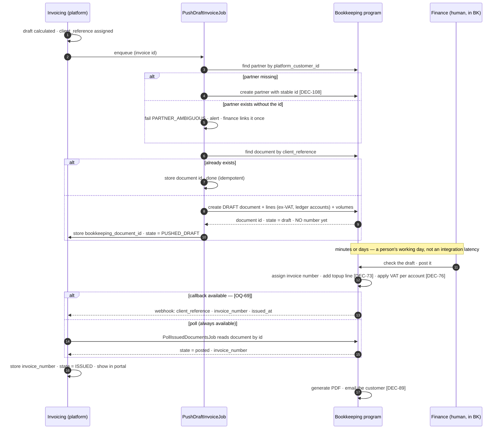

# Integration — Bookkeeping program (invoice drafts & ledger)

⚠ **Retitled 2026-08-19 by [DEC-88], [DEC-89], [DEC-107], [DEC-108] and [DEC-109].** The old title was
*Odoo Accounting*. The source for every one of those decisions says **"Odoo or Moneybird or another
program"**, so a title naming one product states a choice nobody made. **Odoo is the leading
candidate** — it is the only product named more than once in the round, and **[DEC-95]**'s source
names it directly ("most information about finance needs to be stored in Odoo") — but it is a
candidate, not a commitment, and **[OQ-69]** is still open about which version and which API.

**The filename stays `04-odoo-accounting.md`.** [F10](../10-features/F10-invoicing-and-settlement.md),
[the spec index](../README.md) and the built site all resolve to that path; renaming it would break
those links to buy a tidier filename. The product name survives in the filename only, and means
nothing there. The same rule was applied to [03-payments-cm-com.md](03-payments-cm-com.md) on the same
day and for the same reason.

Throughout this document the target is the **bookkeeping program**. Where a field name is Odoo's
(`res.partner`, `account.move`), it is marked as such and is **illustrative until [OQ-69] is
answered**.

**Direction:** outbound push (draft invoices and ledger entries) **plus one narrow inbound path** —
the assigned invoice number returning to the platform (§2.1) ·
**Protocol:** the bookkeeping program's external API (for Odoo, XML-RPC or JSON-RPC) ·
**Criticality:** ~~medium~~ **critical**

⚠ **Criticality raised 2026-08-19.** It was *medium* when the platform numbered its own invoices,
rendered its own PDF and settled from the wallet: the integration was an accounting convenience that
could fail for a day without a customer noticing. After **[DEC-88]**, **[DEC-89]** and **[DEC-77]** it
is the **only** route by which a customer ever receives an invoice. If this integration is down, no
invoice is numbered, no PDF exists and no email is sent. Risk **[R-10]**
([Risks](../70-delivery/02-risks.md)) is scored on the old reading and needs re-scoring.

~~Finalised invoices and credit notes are pushed to Odoo, which is the system of record for accounting
**[AS-13]**. The platform remains the system of record for trades, wallets and the calculation behind
each invoice line.~~
⚠ **Amended 2026-08-19 by [DEC-88], [DEC-95] and [DEC-99].** **Draft** invoices, correction invoices
and credit notes are pushed to the bookkeeping program, which is the **financial record of record**
**[DEC-95]**, **[AS-13]** — not merely the accounting system of record. The platform remains the
system of record for trades, wallets, metering data and the **calculation** behind each invoice line,
and it stores the invoice number that comes back. It no longer holds a finalised document of any kind.

> # ⚠ ~~This integration is **blocked**, not pending~~ — it is now **blocking**
>
> ⚠ **Rewritten 2026-08-19.** The original box is kept below because its reasoning was right and its
> conclusion is now the wrong shape: this integration is no longer something that waits on other
> people. It is the thing everything else waits on.
>
> **Five decisions moved work into this integration and two more added to it.** Numbering **[DEC-88]**,
> the PDF and the customer email **[DEC-89]**, VAT **[DEC-76]**, the topup fee **[DEC-73]** and
> payment settlement reconciliation **[DEC-105]** all left the platform on 2026-08-19; chargebacks
> **[DEC-85]** and the financial record **[DEC-95]** confirm the direction. **[DEC-74]** sends
> energiebelasting here as a ledger entry, **[DEC-107]** grows the mapping that does not exist yet,
> **[DEC-108]** makes the platform create the customer records, and **[DEC-109]** rules deposits out
> of the payload.
>
> **The consequence for [OQ-69] is not a nuance.** Version, hosting model and external API
> availability were a 🟠 question about a convenience integration. They are now **🔴 P1 — the only
> blocking question in the whole specification set**, because *the platform's invoice cannot be
> issued at all without this integration*. There is no degraded mode, no manual fallback specified,
> and nothing the platform can do on its own that results in a customer holding a numbered invoice.
>
> ~~**[DEC-59] answers [OQ-70] with a "no": there is no chart of accounts and no tax-code mapping.** The
> mapping table in §4 therefore has **no source and no owner** — the `account_code` and `tax_codes`
> values in §3 are illustrative and **must not be treated as a starting point**. Combined with
> **[OQ-69]** (Odoo version, hosting model, API availability), **[OQ-71]** (do customer records exist
> in Odoo, and how are they matched) and **[OQ-72]** (does Odoo need wallet data) all still parked,
> **the Odoo integration cannot be specified in detail yet.**~~
> ⚠ **Amended.** **[OQ-71]** and **[OQ-72]** are **closed** — by **[DEC-108]** and **[DEC-109]** —
> and **[OQ-70]**'s closure is **confirmed and enlarged** by **[DEC-107]**. The mapping still has no
> source, and it now has to carry an **energiebelasting account [DEC-74]** and a **VAT rate per
> account [DEC-76]**: it grew before it was written. It still has no owner, and **[DEC-107]** says it
> needs a named one from day one.
>
> ~~**Treat it as blocked rather than pending.** The difference is what a reader should do next: a
> pending item is scheduled, a blocked one needs someone to unblock it. Nothing below §7 can be
> estimated, and nothing below should be built, until §9.1 is answered. What *is* decided is the
> division of responsibility — **the platform owns invoice numbering [DEC-45] and the platform
> generates the PDF [DEC-46]** — and that is decided precisely so the customer-facing side of
> invoicing does not wait on any of this.~~
> ⚠ **Reversed 2026-08-19 by [DEC-88] and [DEC-89].** The last sentence is the one that fell over.
> Numbering and the PDF were placed in the platform *precisely so the customer-facing side of
> invoicing would not wait on this integration*, and both have now been moved into it. The customer
> experience does depend on an integration that will occasionally fail; that is the decided position
> and §6 is where its cost is paid. "Blocked, not pending" still holds for the mapping tables in §4 —
> what changed is that the blockage is now on the critical path rather than beside it.

---

## 1. Division of responsibility

⚠ **Rewritten 2026-08-19.** Every struck row is kept with the decision that moved it.

| Concern | Owner |
| --- | --- |
| Calculating the invoice — volumes, day-ahead settlement, energiebelasting | **Platform** |
| Line-level detail and drill-down | **Platform** |
| ~~Invoice numbering~~ | ~~**Platform [DEC-45]** — see §2~~ ⚠ **Reversed 2026-08-19 by [DEC-88]** → **Bookkeeping program.** The platform pushes a draft, a human checks it there, that program assigns the number and issues it, and the platform stores what comes back — §2, §2.1 |
| ~~PDF generation~~ | ~~**Platform [DEC-46]** — see §2.1~~ ⚠ **Reversed 2026-08-19 by [DEC-89]** → **Bookkeeping program**, which also **sends the email** — §2.2 |
| Sending the invoice to the customer | **Bookkeeping program [DEC-89]** — ⚠ **amends [DEC-47]**: invoices are still emailed *and* visible in the portal, but the platform does not send the email |
| VAT | **Bookkeeping program [DEC-76]**, applied **per ledger account**. The platform computes none — §3.1 |
| Topup / surcharge fee | **Bookkeeping program [DEC-73]**, applied to the **volume** the platform pushes — §3.2 |
| Energiebelasting **calculation** | **Platform [DEC-74]** — computed here, booked there. Direction matters: §3.3 |
| Chart of accounts and tax-code mapping | **Bookkeeping program**, and **it does not exist yet [DEC-107]** — §4 |
| Customer (partner) records | **Platform creates them [DEC-108]**, matched on a stable identifier — §4.1 |
| Customer-facing invoice presentation | **Platform** (portal) — the calculated data, plus the returned number **[DEC-89]** |
| General ledger, VAT return, financial reporting | **Bookkeeping program** |
| Receivables, dunning, payment terms | **Bookkeeping program** |
| Payment settlement reconciliation | **Bookkeeping program [DEC-105]** — the platform consumes no PSP settlement report |
| Chargebacks and reversals | **Bookkeeping program [DEC-85]** |
| Financial record of record | **Bookkeeping program [DEC-95]**. The platform pushes **ledger IDs and values** |
| ~~Wallet settlement~~ | ~~**Platform**~~ ⚠ **Reversed 2026-08-19 by [DEC-77]**, which reverses **[AS-12]**. Delivery invoices are **not settled from the wallet**; they are paid **to the bank** and matched there. The wallet funds **trading only** — §1.1 |

~~Both open questions in this table are now closed the same way, and for the same reason: **the customer
experience must not depend on an integration that will occasionally fail** — and, under **[DEC-59]**,
on an integration that cannot yet be specified at all.~~
⚠ **Reversed 2026-08-19 by [DEC-88] and [DEC-89].** The reason was sound and the decision went the
other way anyway. The stated benefit of moving numbering and the document *out* of the platform is
that one system — the one the accountant already works in, that already produces compliant documents,
and that already owns the VAT return — issues every invoice PeakPower sends. The cost is that the
customer experience now **does** depend on this integration, and on a human opening it. §6 prices that
cost; it does not argue with it.

### 1.1 What this integration deliberately does **not** carry

| Not in the payload | Why | Decision |
| --- | --- | --- |
| Wallet deposits | The money arrives in the bank, the bank feed is connected to the bookkeeping program, so it already knows | **[DEC-109]** |
| Wallet withdrawals | Same route — a manual outbound bank transfer **[DEC-83]** appears on the same feed. No invoice is raised for a deposit or a withdrawal either way | **[DEC-109]**, **[DEC-83]** |
| Wallet balances | Nothing in the accounting depends on the running balance; the movements are on the bank feed | **[DEC-109]** |
| Invoice payments | Matched against the bank feed **there**, not pushed from here. The platform shows no payment state | **[DEC-105]**, **[DEC-77]** |
| PSP settlement reports | Reconciling the provider's payout against its transactions is the bookkeeping program's job | **[DEC-105]** |
| Chargebacks and reversals | Handled entirely there; the manual-adjustment-with-a-reason path left the platform | **[DEC-85]** |
| VAT amounts | The platform computes none and therefore has none to send | **[DEC-76]** |
| The topup / surcharge amount | The platform sends the **volume**; the fee is applied there | **[DEC-73]** |
| A PDF | Generated there, from the posted document | **[DEC-89]** |

⚠ **[DEC-109] contradicts its own source row and the contradiction is recorded, not smoothed over.**
[OQ-72]'s **Answer** column (Rene) says *"Odoo needs to know. It is an actual invoice (without VAT)"* —
i.e. the platform should push deposits. Its **Comment** column says *"as the money comes in the bank
and the bank is connected to Odoo or another tool, Odoo knows"* — i.e. it should not. The round's
column rule is that **the comment governs**, so the payload carries **draft invoices and ledger
entries only**. This is the reading that costs least if it is wrong: adding a deposit document later
is additive, whereas pushing deposits that also arrive on the bank feed produces double-counted
revenue in a live ledger, which is a restatement rather than a bug fix. Worth one sentence of
confirmation at the next session.

The deposit route itself is specified in
[03 Wallet deposits](03-payments-cm-com.md) and [F07](../10-features/F07-wallet-topup-and-payments.md);
the incoming-payment feed the *platform* consumes for wallet crediting **[DEC-106]** is a different
feed, for a different purpose, and its choice is **[OQ-93]**. Neither touches this integration.

## 2. Numbering — ~~the platform owns it **[DEC-45]**~~ **the bookkeeping program owns it [DEC-88]**

~~**Decided: option A**, adopting the recommendation. **[OQ-37] is closed.** The comparison is kept as
the record of what was weighed.~~
⚠ **Reversed 2026-08-19 by [DEC-88].** **Option B is the decision.** [OQ-37] is re-answered the other
way: *"the portal/system should push draft invoices to Odoo or another program. Then they will be
checked and sent. The bookkeeping program therefore handles the numbers."* The comparison below is
kept unchanged, because it is the record of what was weighed — and because option B's stated cost is
now exactly what the platform has to live with.

| Option | Consequence |
| --- | --- |
| ~~**A. Platform numbers — chosen [DEC-45]**~~ | ~~The portal can show a final number immediately. Odoo must be configured to accept an external number rather than generate its own. Risk: a push failure leaves a number issued with no accounting entry — recoverable, since the retry carries the same number **(§5)**~~ ⚠ **Reversed 2026-08-19 by [DEC-88]** |
| **B. The bookkeeping program numbers — chosen [DEC-88]** | ~~Guaranteed consistency with the rest of the accounting. But the invoice has no number until the push succeeds, so the portal must show "pending" and the customer cannot reference it. Every push failure becomes customer-visible~~ ⚠ **Chosen 2026-08-19.** Every word of the original cost line stands and is now accepted, with one addition the original comparison did not anticipate: the number does not appear when the **push** succeeds, it appears when a **human posts the document** there. The wait is not an integration latency, it is a person's working day |

What follows from B:

- ~~**Gapless sequential numbering per legal entity per year is a platform responsibility**, allocated at
  finalisation, before the push ([F10](../10-features/F10-invoicing-and-settlement.md)).~~
  ⚠ **Reversed by [DEC-88].** The platform **never mints a number**. `[F10-R16]` is retired; sequence,
  gaplessness and per-entity scoping are the bookkeeping program's problem, and its statutory one.
- **The platform still needs a stable reference of its own**, because the push must be idempotent and
  the invoice number no longer exists before the first attempt. That reference is the platform's
  **`client_reference`** (§3): unique, assigned when the draft is calculated, identical on every
  retry, and **never shown to a customer as an invoice number**. Under [DEC-45] one identifier did
  both jobs; under [DEC-88] they are two identifiers with two lifetimes, and conflating them in the
  portal is the obvious way to get this wrong.
- ~~The platform's number goes into Odoo's `external_reference` (§3) and is the **idempotency key** for
  the push (§5).~~ ⚠ **Amended.** The `client_reference` goes into the bookkeeping program's external
  reference field and is the idempotency key. The search-before-create in §5 is unchanged in shape;
  only what it searches on changed.
- ~~**Odoo must be configured not to renumber.**~~ ⚠ **Reversed by [DEC-88]** — it is *supposed* to
  number. What must instead be confirmed is that it **exposes the assigned number back over the API**
  and does not change it afterwards. That is now part of **[OQ-69]** and is unconfirmed.

### 2.1 The return path for the number — part of the contract

**[DEC-88] is only half a decision until the number comes back.** The platform has to display the
number in the portal, quote it in support, and reconcile against it (§7), so "the bookkeeping program
handles the numbers" has to be a two-way contract. It is specified here rather than left to the build.

The number does **not** exist at push time. The push creates a **draft**; a human checks and posts it;
only then is a number assigned. So the return path is necessarily **asynchronous**, and the platform
holds two references with different arrival times:

| Field | Assigned by | When | Purpose |
| --- | --- | --- | --- |
| `client_reference` | Platform | When the draft is calculated | Idempotency key; the search key on retry (§5); internal reference in support |
| `bookkeeping_document_id` | Bookkeeping program | In the **create response**, synchronously | The handle used to poll, and to link from the portal for finance |
| `invoice_number` | Bookkeeping program | When a **human posts** the document — minutes or days later | The customer-facing number. Immutable once stored |

Two routes bring `invoice_number` back. Both are specified; which is available is **[OQ-69]**.

| Route | Mechanism | Availability | Notes |
| --- | --- | --- | --- |
| **Callback (preferred)** | The bookkeeping program calls a platform webhook on post: `POST /api/integrations/bookkeeping/documents/issued` with `client_reference`, `bookkeeping_document_id`, `invoice_number`, `invoice_date`, `issued_at`. Authenticated, replay-safe, idempotent on `client_reference` | Needs outbound automation in the target program — an Odoo automated/server action, or the equivalent. **Unconfirmed — [OQ-69]** | Number appears in the portal within seconds of the human posting it |
| **Poll (fallback, always works)** | `PollIssuedDocumentsJob` reads every document in state `PUSHED_DRAFT` by `bookkeeping_document_id`; when its state is *posted*, it stores the number | Needs only read access, which any external API of any candidate program has | Latency is the poll interval: every 15 minutes for the first 7 days, hourly thereafter |

**The poll stays enabled even when the callback works**, at the hourly interval, as the safety net. A
webhook that is silently not firing is indistinguishable from a human who has not posted the document
yet, and the difference matters: one is a broken integration and the other is a Tuesday. The poll is
what tells them apart, and it costs one cheap read per open draft per hour.

Rules on the returned value:

- **The number is immutable in the platform once stored.** If a later read returns a *different*
  number for the same `client_reference`, the platform **alerts** (`NUMBER_CHANGED`) and does not
  overwrite. Two numbers for one document is a reconciliation failure (§7), and silently taking the
  newer one hides it.
- **A number is never derived, guessed or formatted by the platform.** It is stored as the opaque
  string the bookkeeping program returned, including its prefix and its year part.
- **If the human discards the draft there**, the poll finds the document gone or cancelled: platform
  state becomes `DISCARDED_UPSTREAM`, finance is alerted, and the platform invoice returns to draft so
  it can be corrected and pushed again under a **new** `client_reference`. Reusing the reference of a
  discarded document is how a duplicate is created on the next retry.

Platform-side invoice states after [DEC-88]:

| State | Meaning | Customer sees |
| --- | --- | --- |
| `DRAFT` | Calculated, not yet pushed | Nothing |
| `PUSH_FAILED` | Push attempted, failed, retrying (§6) | Nothing |
| `PUSHED_DRAFT` | Document created there, **no number yet** | The calculated invoice, marked *awaiting invoice number* |
| `ISSUED` | Number returned and stored | The full invoice with its number; the PDF and the email came from the bookkeeping program **[DEC-89]** |
| `DISCARDED_UPSTREAM` | The human discarded the draft | Reverts to nothing; finance is alerted |

⚠ **The cost of [DEC-88], stated plainly because [DEC-45]'s entire rationale was avoiding it: a push
failure means the customer has no numbered invoice.** Not a delayed accounting entry — no invoice at
all. Nothing in the platform can produce one, because it cannot mint a number, cannot render the
document **[DEC-89]** and cannot send it. The failure is customer-visible from the first hour, it has
no workaround inside the platform, and there is no contractual SLA behind it either **[DEC-103]**.
Two consequences follow and both are specified: the retry policy in §6 is long rather than aggressive,
and §7 alerts on **drafts without a number**, which is the failure mode that costs money.

### 2.2 The PDF and the email — ~~the platform generates it **[DEC-46]**~~ **the bookkeeping program does [DEC-89]**

*(was §2.1)*

~~**[OQ-38] is closed.** The platform renders the customer-facing invoice PDF; **Odoo receives structured
data, not the document** (§3). Branding, layout, language **[AS-19]** and the portal download path stay
under platform control, and the document exists whether or not the push has succeeded.~~
⚠ **Reversed 2026-08-19 by [DEC-89].** [OQ-38] is re-answered: *"Odoo or Moneybird or any other
program"* generates the PDF, and [OQ-39]'s comment adds *"yes, by bookkeeping program"* for the email.
The push still carries **structured data, not a document** (§3) — what changed is which side produces
the document from it.

~~Consequences: the PDF is generated at finalisation and stored, so re-reading an old invoice never
re-renders it against current templates or current reference data; the portal download and the emailed
copy **[DEC-47]**, [F11-R22](../10-features/F11-notifications.md) serve the same stored artefact; and
whether a copy is also attached to the Odoo record is **not decided** — it is not needed for accounting
and is listed in §9.1 rather than assumed either way.~~
⚠ **Reversed by [DEC-89].** The consequences invert:

| What changes | Consequence, and its cost |
| --- | --- |
| **Branding leaves platform control** | Layout, logo, colours and the invoice template live in the bookkeeping program. **[AS-19]**'s Dutch-first language choice is now that program's setting, not the platform's. **[DEC-94]** points the *portal's* visual identity at peakpower.nl; the invoice document is no longer covered by it, and nothing in this set specifies who aligns the two |
| **The document is no longer re-render-proof by construction** | The platform used to guarantee that an old invoice never re-renders against a current template, because it stored the artefact. That guarantee now rests on the bookkeeping program's own immutability of a posted document — statutory in the Netherlands, but no longer the platform's property to assert |
| **The platform keeps the calculated data and shows it** | The portal shows every line with its inputs, the metered volumes and the number returned by **[DEC-88]**. This is what makes an invoice *reconstructable*, which was the original point of the drill-down |
| **The customer email comes from there** | ⚠ **Amends [DEC-47]** — invoices are still both emailed and in the portal; the platform simply does not send that email. **[DEC-48]** (SendGrid) narrows to the platform's own notifications: offers, wallet events, alerts. See [F11](../10-features/F11-notifications.md), where `[F11-R22]` is replaced accordingly |
| **[OQ-90] closes** | Whether the PDF is *attached to* or *linked from* the notification is no longer the platform's question — the platform neither holds the PDF nor sends the mail. **Closed by [DEC-89]** |
| **Portal download** | The portal offers no PDF download unless the bookkeeping program exposes one. Nothing in the round decides that it must, so the portal shows the calculated invoice and its number, and nothing in this set promises a downloadable document |

## 3. Data pushed

⚠ **Rewritten 2026-08-19 by [DEC-73], [DEC-74], [DEC-76], [DEC-87] and [DEC-88].** The old payload
carried a platform invoice number, a VAT total, a surcharge line and a feed-in line. All four are
gone, and a volume block is new. The example is arithmetically consistent end to end; §3.4 checks it.

```jsonc
{
  "client_reference": "PP-INV-2026-08-c000142",  // platform draft id — NOT an invoice number [DEC-88]
  "partner": { "platform_customer_id": "c-000142" },   // stable identifier, never a name [DEC-108]
  "document_type": "customer_invoice",           // customer_credit_note for a reversal
  "state": "draft",                              // the platform pushes nothing else [DEC-88]
  "period": { "year": 2026, "month": 8 },
  "document_date": "2026-09-05",
  "currency": "EUR",
  "amounts_are": "excluding_vat",                // the platform computes no VAT at all [DEC-76]
  "narration": "Energy supply August 2026",
  "lines": [
    {
      "sequence": 10,
      "category": "BLOCK_ENERGY",
      "name": "Rotterdam DC (871687…0011) — Base block Aug-26 (TRD-1042)",
      "quantity": "297.600000",
      "uom": "MWh",
      "price_unit": "72.4000",
      "amount_ex_vat": "21546.24",
      "ledger_account": "<unmapped — [DEC-107]>",
      "analytic": { "metering_point": "871687…0011", "category": "BLOCK_ENERGY" }
    },
    {
      "sequence": 20,
      "category": "SPOT_PURCHASE",
      "name": "Rotterdam DC (871687…0011) — Day-ahead purchase Aug-26",
      "quantity": "41.200000",
      "uom": "MWh",
      "price_unit": "96.1000",                   // volume-weighted average of the interval prices
      "amount_ex_vat": "3959.32",
      "ledger_account": "<unmapped — [DEC-107]>",
      "analytic": { "metering_point": "871687…0011", "category": "SPOT_PURCHASE" }
    },
    {
      "sequence": 30,
      "category": "SPOT_SALE",                   // unused block cover AND physical export [DEC-87]
      "name": "Rotterdam DC (871687…0011) — Day-ahead sale Aug-26 (unused cover 7 500 kWh, export 4 900 kWh)",
      "quantity": "-12.400000",
      "uom": "MWh",
      "price_unit": "81.5000",
      "amount_ex_vat": "-1010.60",
      "ledger_account": "<unmapped — [DEC-107]>",
      "analytic": { "metering_point": "871687…0011", "category": "SPOT_SALE" }
    },
    {
      "sequence": 40,
      "category": "ENERGY_TAX",                  // calculated by the platform [DEC-74] — §3.3
      "name": "Rotterdam DC (871687…0011) — Energiebelasting Aug-26 (bracket 3, tariff 2026 v1)",
      "quantity": "326400.000",
      "uom": "kWh",
      "price_unit": "0.0331",
      "amount_ex_vat": "10803.84",
      "ledger_account": "<unmapped energiebelasting account — [DEC-107]>",
      "analytic": { "metering_point": "871687…0011", "category": "ENERGY_TAX" }
    }
  ],
  "volumes": [                                   // for the topup fee, applied there [DEC-73] — §3.2
    {
      "metering_point": "871687…0011",
      "uom": "kWh",
      "gross_consumption": "341200.000",
      "production": "14800.000",
      "net_usage": "326400.000",
      "exported": "4900.000"
    }
  ],
  "totals": { "subtotal_ex_vat": "35298.80" }    // no VAT, no grand total — neither is the platform's
}
```

Notes:

- ⚠ **`ledger_account` is a placeholder, not a value.** No chart of accounts exists **[DEC-59]**,
  **[DEC-107]**, so the strings above are shapes showing where real values go. Do not seed them.
- ⚠ **`tax_codes` is gone from every line.** Under **[DEC-76]** the VAT rate is a property of the
  **ledger account** and is set in the bookkeeping program, so a tax code on the line would be the
  platform asserting a rate it no longer owns — §3.1.
- ⚠ **`totals` carries the ex-VAT subtotal only.** There is no `vat` and no `total`, and the subtotal
  is **not** the invoice total: the bookkeeping program adds the topup line **[DEC-73]** and the VAT
  **[DEC-76]** on top. §3.4 works the arithmetic, and §7 is built around this gap.
- **There is no surcharge line.** ⚠ **[DEC-73]** removes invoice line 4 from the platform. The
  `volumes` block replaces it — see §3.2 and [F09](../10-features/F09-surcharges.md).
- **There is no feed-in line.** ⚠ **[DEC-87]** withdraws line 6 and the feed-in tariff; exported
  volume settles on the day-ahead **sale** leg at the raw price, alongside unused cover
  **[F10-R41]**. The line name keeps the two figures visible even though they price identically,
  because the customer asks about them separately.
- ~~`external_reference` is the **platform's** invoice number **[DEC-45]**, and the key the push searches
  on before creating (§5).~~ ⚠ **Amended by [DEC-88]** — `client_reference` is the platform's **draft
  id**, and it is the key the push searches on (§5). It is not an invoice number and must never be
  displayed as one (§2.1).
- **Line granularity mirrors the platform invoice.** Summarising into one line per customer would
  make the two systems impossible to reconcile — and after **[DEC-73]** and **[DEC-76]** the totals no
  longer match anyway, so **line-level identity is the only reconciliation surface left** (§7).
- **Analytic tags** carry the metering point and the line category, so the bookkeeping program can
  report per EAN and per revenue type without the platform having to.
- **Account codes come from a mapping table**, not from code, so the finance team can change them
  without a release — **once that table has a source and an owner, which it does not** (§4).
- The push carries **structured data only**. The PDF is generated there **[DEC-89]**, §2.2.
- The push is a **complete document**, never a delta. A correction is a **new document**
  **[DEC-99]**, **[F10-R49]**, with its own `client_reference` and its own number.

### 3.1 VAT — ~~one rate, and it still needs a code **[DEC-64]**~~ **not the platform's at all [DEC-76]**

~~**VAT is 21% on every line category, with no exemptions and no reverse-charge cases** — see
[Invoice calculation §8](../50-calculations/03-invoice-calculation.md). For this integration that is
simplifying in one way and unhelpful in another:~~
~~- **Simplifying:** there is exactly **one** tax code to map, for every line of every invoice, including
  the negative feed-in credit line **[DEC-44]**. No rate-group logic, no per-line decision, no
  reverse-charge branch.~~
~~- **Unhelpful:** one code is still one code more than exists. **[DEC-59]** means nobody can say what it
  is called in the target instance, so **[DEC-64]** shortens the mapping table to a single row and does
  not fill it in. Keep the *shape* — line category → tax code — so a second rate is data rather than a
  refactor, exactly as the calculation document keeps its rate-group shape.~~

⚠ **Superseded 2026-08-19 by [DEC-76].** *"VAT is handled in the bookkeeping system where we can set a
VAT percentage per ledger nr."* Three consequences, and they are simplifications rather than
transfers of work:

| Before | After **[DEC-76]** |
| --- | --- |
| The platform stored a VAT figure per line and per invoice | The platform stores **no VAT figure anywhere**. Every amount it holds, shows and pushes is ex-VAT — confirming and extending **[DEC-26]** |
| The payload carried `tax_codes` per line | The payload carries **no tax code**. The rate is a property of the ledger account **[DEC-107]**, resolved on the other side |
| A second rate would have been a mapping-table row | A second rate is a **second ledger account** with its own rate, configured by finance, with no platform change at all |

⚠ **What survives of [DEC-64].** Its 21% is **superseded as a platform behaviour** — the platform does
not apply 21% to anything on an invoice — but it is kept as the **reference rate**, because
**[DEC-78]** needs a rate to gross up a **trade reservation**: a wallet reservation and its later
debit are VAT-*inclusive* at `volume × price × (1 + VAT rate)` even though prices are quoted and
stored ex-VAT. That is a wallet concern ([F06](../10-features/F06-wallet-and-ledger.md)),
**not this integration's** — no trade reservation is ever pushed here. The one place the two meet is
that both must read the same reference rate, so it is one configured value, not two.

**[OQ-82]** (VAT rate per line category) therefore closes for a second reason: there is no per-line
rate to hold.

### 3.2 Volume for the topup fee — new, **[DEC-73]**

*"Topups are not handled in the system. When the month is over we have the volume. A bookkeeping
program will do value (kWh) times topup fee."*

⚠ **[DEC-73] reverses [DEC-35]** and moves the surcharge out of the platform entirely: the tariff
table, its resolution order and invoice line 4 all leave. What the platform owes this integration in
their place is **volume**, and that is why the payload gained a `volumes` block. Money out, kWh in.

Three properties of that block, each with a reason:

1. **kWh, not MWh.** The fee is quoted in €/kWh and the multiplication happens on the other side.
   Sending MWh would put a ×1000 between the two systems, which is precisely the shape of risk
   **[R-23]** was raised for. The unit is on the field.
2. **Per metering point, plus a customer total that is their sum.** Per-EAN is the finer grain and the
   coarser one derives from it; the reverse does not. It costs one row per EAN per month.
3. **Three figures, not one: `gross_consumption`, `production`, `net_usage` — and `exported`.** ⚠ This
   is the residue of **[OQ-36]**, which asked what the surcharge is charged *on*. **[DEC-73] closes
   [OQ-36]** on the platform side — the surcharge left, so the platform has no basis to choose — but
   the question does not evaporate, it **reappears in the bookkeeping program**, where somebody still
   has to decide whether the topup is charged on gross consumption or on net usage. Pushing all three
   costs three numbers and lets that decision be made, and changed, without a platform release.
   Pushing only one would silently make the choice from here, which is exactly what [DEC-73] took
   away.

**What the platform does not send, and must not:** the topup fee itself, the resulting amount, or a
line for it. If a fee ever appears in the platform's payload, [DEC-73] has been undone by accident.

### 3.3 Energiebelasting — calculated **here**, booked **there** **[DEC-74]**

⚠ **[DEC-74] reverses [DEC-24]**, which had deferred energiebelasting out of scope. It is back, and
**the direction is the opposite of everything else on this page**:

| | Computed by | Booked by | Direction |
| --- | --- | --- | --- |
| VAT | Bookkeeping program **[DEC-76]** | Bookkeeping program | Not sent |
| Topup fee | Bookkeeping program **[DEC-73]** | Bookkeeping program | Platform sends **volume** |
| **Energiebelasting** | **Platform [DEC-74]** | Bookkeeping program | Platform sends the **calculated amount** against the energiebelasting ledger account |

*"The system should calculate the energiebelasting and push this as a ledger to bookkeeping tooling."*
So:

- **The platform owns the calculation**: a versioned, editable bracket table (tier boundaries and
  €/kWh rates per year), a per-customer reduction or exemption for the minority who do not pay the
  standard rate, and the cumulative per-EAN per-calendar-year method on net usage **[DEC-22]**. It is
  specified in [Invoice calculation](../50-calculations/03-invoice-calculation.md) §7 and
  [F10-R07]; none of it is in scope for the bookkeeping program.
- **The bookkeeping program books it and never recomputes it.** There is no inbound energiebelasting
  value, no bracket table on that side, and no reconciliation of one calculation against another. If
  the amount is wrong, it is wrong in the platform and is corrected by a correction invoice
  **[DEC-99]** like any other error.
- **It is pushed as a line on the draft, against a dedicated energiebelasting ledger account** — which
  is what "as a ledger" means in practice, and what **[DEC-107]** now has to create. It is *not*
  pushed as a separate journal entry: the customer pays it as part of the invoice **[DEC-77]** lists
  it among the amounts collected to the bank, and a journal entry detached from the document the
  customer receives could not be shown on that document.
- **A month that crosses a bracket boundary produces one line per bracket**, each with its own
  quantity, rate and tariff version, because the boundary is a calendar-year cumulative one and the
  rate genuinely differs within the month. The example in §3 shows the single-bracket case.
- ⚠ **Still open: the *vermindering***, the fixed annual reduction per connection. [DEC-74]'s source is
  silent on it and it changes the amount on every affected invoice. Registered as **[OQ-96]**, and it
  lands on *this* line when it is answered.
- **[OQ-77] closes** with [DEC-74]: when an EAN transfers between customers mid-year, **each period
  gets 50% of each bracket** — a straight half-and-half split of the annual tier boundaries, not a
  pro-rata by days.

### 3.4 What the pushed subtotal is, and is not

The example in §3, checked:

| Line | Quantity | Unit price | Amount ex-VAT |
| --- | ---: | ---: | ---: |
| 1 · Block energy | 297,600000 MWh | € 72,4000 /MWh | € 21 546,24 |
| 2 · Day-ahead purchase | 41,200000 MWh | € 96,1000 /MWh | € 3 959,32 |
| 2 · Day-ahead sale (unused cover + export) **[DEC-87]** | −12,400000 MWh | € 81,5000 /MWh | −€ 1 010,60 |
| 5 · Energiebelasting **[DEC-74]** | 326 400,000 kWh | € 0,0331 /kWh | € 10 803,84 |
| **`subtotal_ex_vat` — everything the platform pushes** | | | **€ 35 298,80** |

The volume identity holds on the same figures: `297,6 + 41,2 − 12,4 = 326,4 MWh = 326 400 kWh`, which
is exactly `gross_consumption 341 200 − production 14 800` in the `volumes` block **[F10-R08]**,
**[DEC-22]**.

What happens *after* the push, on the other side, with the same example:

| Added there | By | Amount |
| --- | --- | ---: |
| Topup line: 326 400 kWh × € 0,0045 /kWh | Bookkeeping program **[DEC-73]** | € 1 468,80 |
| **Document subtotal ex-VAT** | | **€ 36 767,60** |
| VAT, per ledger account **[DEC-76]** — illustrative, at 21% on every account | Bookkeeping program | € 7 721,20 |
| **Invoice total the customer receives** | | **€ 44 488,80** |

⚠ **Two numbers, and the platform only knows the first.** €35 298,80 is what it pushed; €44 488,80 is
what the customer pays. The topup fee is not visible to the platform at all — it is not stored here,
not configurable here and not readable back — and the VAT figure is illustrative, because [DEC-76]
sets the rate **per account** and the accounts do not exist yet **[DEC-107]**. The gap is a feature of
the decisions, not a defect, and §7 is designed around it: **the platform can never reconcile document
totals, only the lines it sent.**

## 4. Mapping tables

| Platform concept | Target (Odoo names, illustrative — **[OQ-69]**) | Configurable | Status |
| --- | --- | --- | --- |
| Customer | `res.partner`, matched on the platform customer id in a dedicated field | Yes | ~~⚠ **Blocked — [OQ-71]**: whether partner records exist, and whether that field exists to match on, is unknown~~ ⚠ **Unblocked 2026-08-19 by [DEC-108]** — they do **not** exist; the platform **creates** them. §4.1 |
| Invoice | `account.move` (`out_invoice`), ~~`external_reference` = the platform number **[DEC-45]**~~ ⚠ **Amended by [DEC-88]** — external reference = the platform's **`client_reference`**; the **number is assigned there** and returned (§2.1) | | ⚠ Depends on the number being readable back over the API — **[OQ-69]** |
| Credit note | `account.move` (`out_refund`) with `reversed_entry_id` | | ⚠ Same |
| Correction invoice **[DEC-99]** | `account.move` (`out_invoice`), a new document for the delta | | ⚠ Same. **New 2026-08-19** — corrections are continuous, not annual, so this is not an edge case |
| Line category → GL account | mapping table | **Yes** | 🔴 **Blocked — no source, no owner [DEC-59]**, confirmed and enlarged by **[DEC-107]** |
| **Energiebelasting → its own GL account** | mapping table | **Yes** | 🔴 **New 2026-08-19 — [DEC-74]**, **[DEC-107]**. The mapping grew before it was written |
| **GL account → VAT rate** | property of the account, set **in the bookkeeping program** | **Yes, there** | 🔴 **New 2026-08-19 — [DEC-76]**, **[DEC-107]**. Not a platform table; the platform never reads it |
| ~~Line category → tax code~~ | ~~mapping table~~ | ~~**Yes**~~ | ~~🔴 **Blocked — no source, no owner [DEC-59]**. One row when it exists, per **[DEC-64]** — §3.1~~ ⚠ **Retired 2026-08-19 by [DEC-76]** — replaced by the **GL account → VAT rate** row above. The platform sends no tax code, so it maps to none |
| Metering point | analytic tag | Yes | ⚠ Depends on analytic accounting being enabled — **[OQ-69]** |

~~Partner matching is on a stable platform identifier stored in Odoo, never on name or VAT number.
Name matching across two systems is a reconciliation problem waiting to happen.~~
⚠ **Confirmed and promoted 2026-08-19 by [DEC-108]** — this was the document's own recommendation and
it is now the decision. See §4.1.

> 🔴 **The two mapping tables are the blocking pair.** ⚠ **Amended 2026-08-19 — there are now three,
> and one of them lives on the other side.** They are not "to be filled in during build":
> **[DEC-59]**, confirmed by **[DEC-107]**, says the chart of accounts does not exist, so there is
> nothing to map *to*. Producing one is a finance exercise with its own lead time, and it needs a
> **named owner** before it needs a schema — **[DEC-107]** makes the named owner an explicit
> obligation from day one rather than a suggestion. Until then the push cannot be built, because every
> line it sends carries a value nobody can supply.
>
> **What grew on 2026-08-19:** an **energiebelasting account [DEC-74]**, and a **VAT rate on every
> account [DEC-76]**. Neither is hard; both mean the chart cannot be produced by copying a template
> and must be reviewed by someone who knows how PeakPower's revenue is taxed. That is more lead time,
> not less, on a table that already had no owner.
>
> ⚠ **[OQ-70] closes without unblocking anything.** It asked *"does a mapping already exist, and who
> owns it?"* The answer — no, and nobody — is exactly what makes this the blocker. Closing the
> question does not close the gap.

### 4.1 Customer records — the platform creates them **[DEC-108]**

**[OQ-71] closes: customer records do not exist in the bookkeeping program.** The answer was a plain
"not yet", which makes the first push a **create**, not a link, for every customer — and means there
is **no migration** to run before this integration starts, because there is nothing to migrate.

⚠ **A source anomaly, recorded rather than silently worked around.** [OQ-71]'s **Comment** cell reads
*"Day ahead price is raw"* — which is [OQ-35]'s answer, about day-ahead pricing, and has nothing to do
with customer records. It is evidently misplaced in the source spreadsheet. The round's rule is that
the comment governs *where there is one*; here the comment belongs to a different question, so the
**Answer** column is used. Anyone re-reading the CSV will hit the same oddity and should not conclude
that this section ignored a comment.

Rules:

| Rule | Reason |
| --- | --- |
| The platform **creates** the partner record on first push if it is absent | **[DEC-108]**. ⚠ This **reverses this document's own "never auto-creates a partner"** (§6), which existed because a wrong auto-create in a populated ledger is hard to unpick. In an *empty* ledger the opposite is true: failing every first push for a manual step would stall the very first invoice run |
| Matching is on a **stable identifier carried by both systems** | **[DEC-108]**. The platform customer id (`c-000142`) is written to a dedicated field on the partner and is never edited afterwards |
| **Never on name.** Never on VAT number, address or email either | A customer that renames itself, or that exists twice with a comma in one of the two names, silently splits or merges a ledger. Name matching across two systems is a reconciliation problem waiting to happen |
| The partner is created with the **minimum** fields the program requires, plus the identifier | Everything else — payment terms, dunning settings, bank details — is that program's domain **[DEC-95]** and is maintained by finance there |
| Changes to customer master data are pushed **only** on create | Nothing in the round decides that the platform owns customer master data in the bookkeeping program after creation. Assuming it does would overwrite finance's edits on every invoice run |
| A partner that exists **without** the identifier is **not** matched and **not** created twice | The push fails with `PARTNER_AMBIGUOUS` and finance links it by hand once (§6). This is the one case where a human is cheaper than a guess |

## 5. Push flow

⚠ **Redrawn 2026-08-19.** Three things changed: the partner branch **creates** instead of failing
**[DEC-108]**, the created document is a **draft with no number**, and the number arrives later by a
separate path **[DEC-88]**, §2.1.



Searching by the external reference before creating is what makes the retry safe. Without it, a
timeout on a successful create produces a duplicate invoice in the accounting system — the single
most damaging failure mode of this integration.

~~That the reference is **the platform's own invoice number [DEC-45]** is what makes this work at all: it
exists before the first attempt, it is identical on every retry, and it is the number the customer
already has in the portal and in their inbox **[DEC-47]**. Under option B the retry would have had
nothing stable to search on.~~
⚠ **Amended 2026-08-19 by [DEC-88].** Option B *is* the decision, and the concern in that last
sentence is real and is answered by the `client_reference` (§2.1): a platform-side identifier that
exists before the first attempt and is identical on every retry, exactly as the invoice number used to
be — it simply is not a number the customer has, because under [DEC-88] the customer has no number
until a human posts the document. The retry mechanism is unchanged; the identifier it searches on is
now internal.

⚠ **The human step is inside the critical path and cannot be retried.** Everything above the `Note` is
machine work with a retry policy. Everything below it waits on a person opening a screen in another
system. No amount of engineering on the platform side shortens it, and §7's ageing alert is the only
control over it.

## 6. Error handling

| Failure | Handling |
| --- | --- |
| Bookkeeping program unreachable | Retry with backoff (8 attempts, 30 s → 6 h); invoice state `PUSH_FAILED`; visible on the dashboard |
| ~~Partner not found~~ | ~~Fail with a specific reason; finance links the partner and retries. **Never auto-creates a partner**~~ ⚠ **Reversed 2026-08-19 by [DEC-108]** — the platform **creates** the partner with its stable identifier (§4.1). Records do not exist there, so failing on their absence would fail every first invoice |
| **Partner exists but carries no platform identifier** | **New.** Fail `PARTNER_AMBIGUOUS`; finance links it by hand once; the retry then matches. Creating a second partner for a customer finance already entered is worse than a one-off manual link |
| Validation rejected | Fail with the program's message surfaced verbatim to finance |
| **Ledger account missing or unmapped** | **New — [DEC-107].** The whole draft fails, with the unmapped line category named. It is never pushed to a default or suspense account: a wrong account is invisible until the VAT return, and this failure is loud on the day it happens |
| Timeout after a successful create | Next attempt finds the existing document by `client_reference` and completes |
| Duplicate detected | Logged, alerted, not created again |
| Credentials expired | Alert; retries paused rather than burning attempts |
| **Draft pushed, no number after 3 working days** | **New — [DEC-88].** No retry helps; nobody has posted it. Alert finance, and escalate at 7 days. This is the failure that leaves a customer un-invoiced while every technical indicator is green |
| **A different number returned for a `client_reference` already numbered** | **New — [DEC-88].** Alert `NUMBER_CHANGED`; the stored number is **not** overwritten (§2.1) |
| **Draft discarded in the bookkeeping program** | **New — [DEC-88].** State `DISCARDED_UPSTREAM`; the platform invoice reverts to draft and is re-pushed under a **new** `client_reference` if it is still owed |
| **Callback received for an unknown `client_reference`** | **New.** Rejected and alerted, never auto-created. A number arriving for a document the platform did not push means the two systems disagree about what exists |

~~**A failed push never rolls back the wallet debit.** The invoice is real, the customer owes it, and
the accounting entry catches up. The two are independent
([F10-R19](../10-features/F10-invoicing-and-settlement.md)).~~
⚠ **Reversed 2026-08-19 by [DEC-77] and [DEC-88].** There is **no wallet debit** to roll back —
delivery invoices never touch the wallet, `INVOICE_DEBIT` is removed, and `[F10-R19]` is retired. The
independence this paragraph relied on is gone with it, and the replacement statement is worse for the
customer, which is why it is stated rather than dropped:

**A failed push means there is no invoice.** Not an invoice awaiting an accounting entry — no
numbered document, no PDF, no email, nothing the customer can pay or reference. The platform holds a
calculation and can show it in the portal marked *awaiting invoice number*, and that is the whole of
what it can do. See `[F10-R45]`.

## 7. Reconciliation

A monthly job compares platform invoices for the period against the documents in the bookkeeping
program. ⚠ **Rewritten 2026-08-19** — what can be compared changed, because after **[DEC-73]** and
**[DEC-76]** the two systems no longer hold the same totals (§3.4).

| Check | Alert on | ⚠ 2026-08-19 |
| --- | --- | --- |
| Count | Any difference | Unchanged |
| ~~Total value~~ | ~~Any difference beyond €0.01~~ | ⚠ **Retired.** The document total there includes a topup line **[DEC-73]** and VAT **[DEC-76]** that the platform never sees. Comparing totals would alert on every invoice |
| **Line-level value, for the lines the platform sent** | Any difference beyond €0,01 per line, matched on `client_reference` + `sequence` | **New — this is the only surviving value comparison.** It is also the stronger one: it catches a wrong account or a lost line, which a total never did |
| **Pushed subtotal vs. the sum of those lines there** | Any difference beyond €0,01 | **New.** Confirms nothing was edited by hand on the other side after the push |
| Per-invoice presence | Any invoice missing on either side | Unchanged |
| **Drafts with no number, by age** | Anything older than 3 working days | **New — [DEC-88].** The failure mode that costs money, and the only one the platform can detect but not fix |
| **Numbers held here but not there** | Any | **New.** A stored number whose document no longer exists means a discard was missed |
| Credit notes | Any without a matching reversal | Unchanged |
| **Volumes pushed vs. volumes billed there** | Not checked | ⚠ **Deliberate.** The topup fee is applied there and is not readable here **[DEC-73]**, so the platform cannot verify the multiplication. Whoever owns the chart of accounts **[DEC-107]** owns this check too, on that side |

The report goes to finance. Two systems holding financial records without a scheduled comparison is
a defect, not a design — and after **[DEC-95]** made the bookkeeping program the **financial record of
record**, the comparison is what proves the platform's calculation is what was actually billed.

## 8. Security

| Control | Detail |
| --- | --- |
| Authentication | Dedicated service account in the bookkeeping program, credentials in Key Vault |
| Authorisation | Minimum rights: **read and create** partners *(⚠ create is new — [DEC-108])*, create and read invoice documents and their lines, **read** the assigned number and document state *(⚠ new — [DEC-88], §2.1)*. No delete, no posting rights, no access to bank statements or unrelated models |
| **Why no posting rights** | **[DEC-88]** puts a human check between the draft and the issued invoice. A service account that could post would remove exactly the control the decision was made to create |
| **Why no bank-statement access** | **[DEC-109]** — deposits reach the bookkeeping program through **its** bank feed. The platform has no reason to read it, and reading it would create a second, conflicting source for wallet crediting **[DEC-106]** |
| Inbound callback *(§2.1)* | Authenticated, signature- or token-verified, replay-safe, idempotent on `client_reference`. It carries an invoice number and nothing financial, but it **writes a customer-visible field**, so it is treated as a write endpoint, not a notification |
| Transport | TLS, certificate validated |
| Payload | Contains customer and financial data — logged only as identifiers, never in full |
| Rate limiting | Pushes are serialised per customer to avoid overwhelming a shared instance |

## 9. Open questions

| Ref | Question | Status |
| --- | --- | --- |
| ~~[OQ-37]~~ | ~~Who owns invoice numbering?~~ | ~~**Closed — [DEC-45]: the platform**, adopting the recommendation. §2~~ ⚠ **Re-answered 2026-08-19 — [DEC-88]: the bookkeeping program.** The platform pushes a draft; a human checks it; that program numbers and issues it. §2, §2.1 |
| ~~[OQ-38]~~ | ~~Who generates the PDF?~~ | ~~**Closed — [DEC-46]: the platform.** Odoo receives structured data, not the customer-facing document. §2.1~~ ⚠ **Re-answered 2026-08-19 — [DEC-89]: the bookkeeping program**, which also **sends the email** (OQ-39). The push still carries structured data only. §2.2 |
| **[OQ-69]** | **Bookkeeping program version, hosting model, and external API availability** | 🔴 **P1 — OPEN, and the only blocking question in the specification set.** ⚠ **Re-prioritised 2026-08-19 from 🟠.** It decides the transport, whether the assigned **number can be read back** **[DEC-88]**, whether an **outbound callback** exists (§2.1), whether **analytic accounting** is available, and what a **partner create** requires **[DEC-108]**. Because [DEC-88] and [DEC-89] moved numbering, the PDF and the customer email into this program, **the platform's invoice cannot be issued at all until this is answered.** Nothing else in the set has that property |
| ~~[OQ-70]~~ | ~~Does a chart of accounts and tax code mapping already exist, and who owns it?~~ | **Closed — [DEC-59]: no, and nobody**, ⚠ **confirmed and enlarged 2026-08-19 by [DEC-107]**. The closure **creates** the blocker rather than removing one: the mapping in §4 has no source and no owner, and it now also needs an **energiebelasting account [DEC-74]** and a **VAT rate per account [DEC-76]**. **[DEC-107] requires a named owner from day one** |
| ~~[OQ-71]~~ | ~~Do customer records already exist in Odoo, and how are they matched to platform customers?~~ | **Closed 2026-08-19 — [DEC-108]: they do not exist; the platform creates them**, matched on a **stable identifier**, never on name. ⚠ The source's comment cell for this row reads "Day ahead price is raw" — [OQ-35]'s answer, misplaced — so the **Answer** column was used. §4.1 |
| ~~[OQ-72]~~ | ~~Does Odoo need to know about wallet balances and deposits, or only about invoices?~~ | **Closed 2026-08-19 — [DEC-109]: only invoices and ledger entries.** Deposits reach it through **its own bank feed**. ⚠ The Answer column said the opposite ("Odoo needs to know"); the **comment governs** by the round's column rule, and the conflict is recorded in §1.1 |
| ~~[OQ-67]~~ | ~~Who reconciles PSP settlement against transactions?~~ | **Closed 2026-08-19 — [DEC-105]: the bookkeeping program.** The platform consumes no settlement report. §1.1 |
| ~~[OQ-90]~~ | ~~Is the invoice PDF attached to the notification email or linked from the portal?~~ | **Closed 2026-08-19 — [DEC-89].** Neither is the platform's question: it holds no PDF and sends no invoice email. §2.2 |
| [OQ-82] | VAT rate per line category | ~~**Closed — [DEC-64]: 21% everywhere**, no exemptions, no reverse charge. One tax code to map — §3.1~~ ⚠ **Superseded 2026-08-19 by [DEC-76]** — there is no per-line rate at all. VAT is set **per ledger account** in the bookkeeping program; [DEC-64]'s 21% survives only as the **reference rate [DEC-78]** uses to gross up a **trade reservation**, which is never pushed here. §3.1 |
| **[OQ-92]** | **Are the hedge and the day-ahead delivery one invoice document or two?** | 🟠 **OPEN — new 2026-08-19.** **[DEC-78]**'s source says *"maybe we should handle hedges and day-ahead delivery separately"* and stops there. **[DEC-77]** separates the **money path** — the hedge is paid from the wallet, delivery is paid to the bank — but not the **document**. For this integration the answer decides **how many drafts are pushed per customer per month**, and therefore how many numbers, PDFs and emails the customer receives. It also decides whether the block-energy line in §3 belongs on this document at all. Answer before the push is built; retro-fitting a document split changes every reference in §7 |
| **[OQ-96]** | Does the *vermindering* apply, and to which connections? | 🟠 **OPEN — new 2026-08-19.** It lands on the energiebelasting line §3.3 and changes the amount on every affected invoice **[DEC-74]** |

Not this integration's questions, listed because they are easy to misfile here: **[OQ-93]** (which
incoming-payment feed the *platform* consumes to credit wallet deposits **[DEC-106]**) belongs to
[03 Wallet deposits](03-payments-cm-com.md) — under **[DEC-109]** no deposit reaches the bookkeeping
program from the platform at all.

### 9.1 What would unblock this

⚠ **Reordered 2026-08-19.** Two items are gone because they were answered, one moved to the top
because it became blocking, and the last item lost both of its parts.

In order:

1. **Answer [OQ-69].** ⚠ **Promoted from #2 to #1.** Version, hosting and API decide whether the
   assigned number can be read back **[DEC-88]**, whether a callback exists or the platform must poll
   (§2.1), whether analytic tags exist, and what a partner create needs **[DEC-108]**. It is first
   now because after **[DEC-88]** and **[DEC-89]** *no invoice can be issued to any customer* until it
   is answered — it stopped being a design input and became a go-live gate.
2. **Name an owner for the chart of accounts, the ledger mapping and the per-account VAT rates
   [DEC-107].** It is a finance exercise with external lead time, not a build task, and one owner
   produces all of it. It grew on 2026-08-19 — an energiebelasting account **[DEC-74]** and a VAT rate
   on every account **[DEC-76]** — so it is longer than it was when it had no owner either.
3. **Answer [OQ-92].** One document per customer per month or two. It decides how many drafts §5
   pushes and what §7 reconciles, and it is cheap to answer now and expensive to change later.
4. ~~**Answer [OQ-71].** Whether partners exist, and on which field they are matched, decides whether the
   first push is a create or a link — and whether a migration is needed before any of it runs.~~
   ✅ **Answered 2026-08-19 by [DEC-108]** — they do not exist, every first push is a create, and
   there is no migration. §4.1.
5. ~~**Answer [OQ-72].** One document type or two.~~ ✅ **Answered 2026-08-19 by [DEC-109]** — draft
   invoices and ledger entries only; deposits come off the bank feed. §1.1.
6. ~~Then, and only then, confirm the two details this document deliberately leaves open: whether the
   platform's PDF is also attached to the Odoo record **[DEC-46]**, and the tax-code string
   **[DEC-64]**.~~ ✅ **Both dissolved 2026-08-19.** There is no platform PDF to attach **[DEC-89]**,
   and there is no tax code to name **[DEC-76]**. **[OQ-90]** closes with the first.

~~Until step 1 has an owner, this document is a description of an integration that cannot be estimated.~~
⚠ **Amended 2026-08-19.** Until **[OQ-69]** is answered and the chart of accounts has an owner, this
document describes an integration that cannot be estimated **and without which no customer can be
invoiced**. That is a harder statement than the one it replaces, and it is the direct price of five
decisions moving work into a program nobody has yet chosen a version of. Everything above §7 is the
design that will be built **when** it is unblocked, and none of it is contradicted by the blockage —
which is why it is kept rather than removed.
