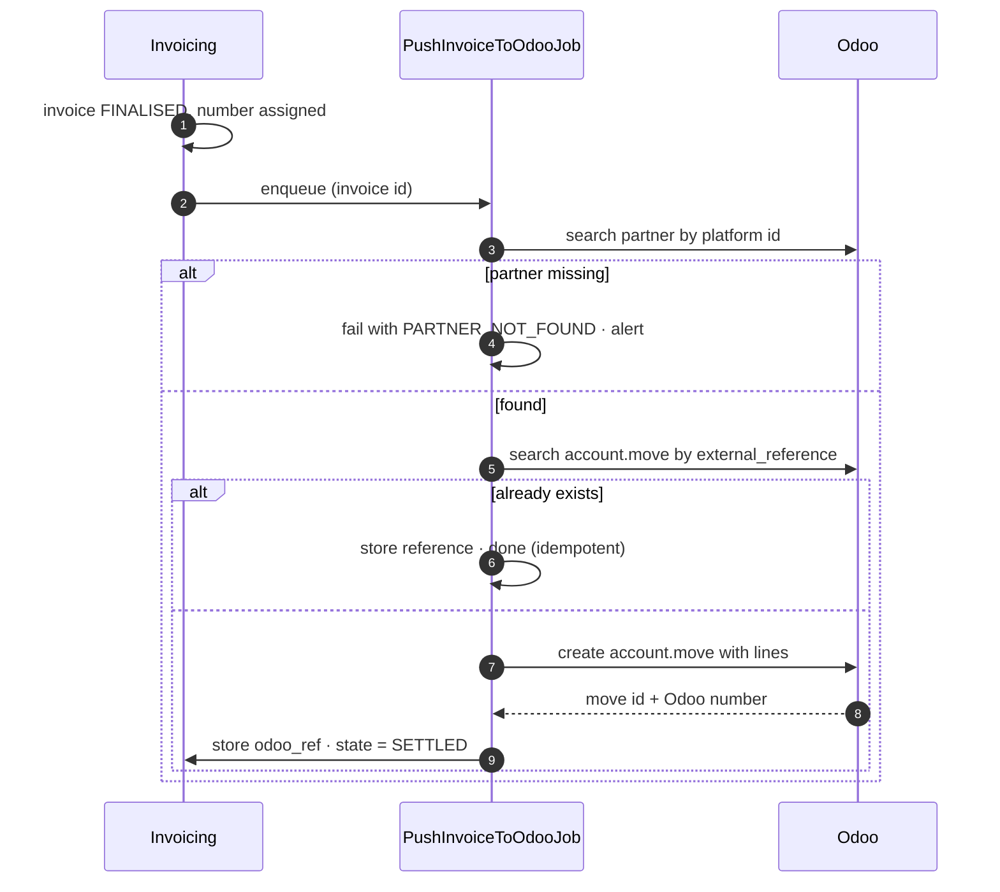

# Integration — Odoo Accounting

**Direction:** outbound push · **Protocol:** Odoo external API (XML-RPC or JSON-RPC) ·
**Criticality:** medium

Finalised invoices and credit notes are pushed to Odoo, which is the system of record for accounting
**[AS-13]**. The platform remains the system of record for trades, wallets and the calculation behind
each invoice line.

---

## 1. Division of responsibility

| Concern | Owner |
| --- | --- |
| Calculating the invoice | **Platform** |
| Line-level detail and drill-down | **Platform** |
| Invoice numbering | **[OQ-37]** — see §2 |
| PDF generation | **[OQ-38]** |
| Customer-facing invoice presentation | **Platform** (portal) |
| General ledger, VAT return, financial reporting | **Odoo** |
| Receivables, dunning, payment terms | **Odoo** |
| Wallet settlement | **Platform** |

## 2. The numbering question

Both systems can allocate gapless sequential numbers. Exactly one must.

| Option | Consequence |
| --- | --- |
| **A. Platform numbers** | The portal can show a final number immediately. Odoo must be configured to accept an external number rather than generate its own. Risk: a push failure leaves a number issued with no accounting entry — recoverable, since the retry carries the same number. **Recommended** |
| **B. Odoo numbers** | Guaranteed consistency with the rest of the accounting. But the invoice has no number until the push succeeds, so the portal must show "pending" and the customer cannot reference it. Every push failure becomes customer-visible |

Recommendation: **A**, with the platform's number written into Odoo's reference field, because it
keeps the customer experience independent of an integration that will occasionally fail. **[OQ-37]**

## 3. Data pushed

```jsonc
{
  "external_reference": "INV-2026-08-0042",
  "partner_reference": "c-000142",
  "move_type": "out_invoice",                  // out_refund for a credit note
  "invoice_date": "2026-09-05",
  "invoice_date_due": "2026-09-05",
  "currency": "EUR",
  "narration": "Energy supply August 2026 — settled from wallet",
  "lines": [
    {
      "sequence": 10,
      "name": "Rotterdam DC (871687…0011) — Base block Aug-26 (TRD-1042)",
      "quantity": "297.600000",
      "uom": "MWh",
      "price_unit": "72.4000",
      "amount": "21546.24",
      "account_code": "8000",
      "tax_codes": ["BTW21"],
      "analytic": { "metering_point": "871687…0011", "category": "BLOCK_ENERGY" }
    }
    // … one line per invoice line
  ],
  "totals": { "subtotal": "…", "vat": "…", "total": "…" }
}
```

Notes:

- **Line granularity mirrors the platform invoice.** Summarising into one line per customer would
  make the two systems impossible to reconcile.
- **Analytic tags** carry the metering point and the line category, so Odoo can report per EAN and
  per revenue type without the platform having to.
- **Account and tax codes come from a mapping table**, not from code, so the finance team can change
  them without a release.
- The push is a **complete document**, never a delta.

## 4. Mapping tables

| Platform concept | Odoo target | Configurable |
| --- | --- | --- |
| Customer | `res.partner`, matched on the platform customer id in a dedicated field | Yes |
| Invoice | `account.move` (`out_invoice`) | |
| Credit note | `account.move` (`out_refund`) with `reversed_entry_id` | |
| Line category → GL account | mapping table | **Yes** |
| Line category → tax code | mapping table | **Yes** |
| Metering point | analytic tag | Yes |

Partner matching is on a stable platform identifier stored in Odoo, never on name or VAT number.
Name matching across two systems is a reconciliation problem waiting to happen.

## 5. Push flow



Searching by `external_reference` before creating is what makes the retry safe. Without it, a
timeout on a successful create produces a duplicate invoice in the accounting system — the single
most damaging failure mode of this integration.

## 6. Error handling

| Failure | Handling |
| --- | --- |
| Odoo unreachable | Retry with backoff (8 attempts, 30 s → 6 h); invoice state `PUSH_FAILED`; visible on the dashboard |
| Partner not found | Fail with a specific reason; finance links the partner and retries. Never auto-creates a partner |
| Validation rejected by Odoo | Fail with Odoo's message surfaced verbatim to finance |
| Timeout after a successful create | Next attempt finds the existing move by reference and completes |
| Duplicate detected | Logged, alerted, not created again |
| Credentials expired | Alert; retries paused rather than burning attempts |

**A failed push never rolls back the wallet debit.** The invoice is real, the customer owes it, and
the accounting entry catches up. The two are independent
([F10-R19](../10-features/F10-invoicing-and-settlement.md)).

## 7. Reconciliation

A monthly job compares platform invoices for the period against Odoo's `account.move` records:

| Check | Alert on |
| --- | --- |
| Count | Any difference |
| Total value | Any difference beyond €0.01 |
| Per-invoice presence | Any invoice missing on either side |
| Credit notes | Any without a matching reversal |

The report goes to finance. Two systems holding financial records without a scheduled comparison is
a defect, not a design.

## 8. Security

| Control | Detail |
| --- | --- |
| Authentication | Dedicated Odoo service account, credentials in Key Vault |
| Authorisation | Minimum rights: read `res.partner`, create/read `account.move` and lines. No delete, no access to unrelated models |
| Transport | TLS, certificate validated |
| Payload | Contains customer and financial data — logged only as identifiers, never in full |
| Rate limiting | Pushes are serialised per customer to avoid overwhelming a shared Odoo instance |

## 9. Open questions

| Ref | Question |
| --- | --- |
| [OQ-37] | Who owns invoice numbering? |
| [OQ-38] | Who generates the PDF? |
| [OQ-69] | Odoo version, hosting (Odoo Online / on-premise), and API availability |
| [OQ-70] | Does a chart of accounts and tax code mapping already exist, and who owns it? |
| [OQ-71] | Do customer records already exist in Odoo, and how are they matched to platform customers? |
| [OQ-72] | Does Odoo need to know about wallet balances and deposits, or only about invoices? |
