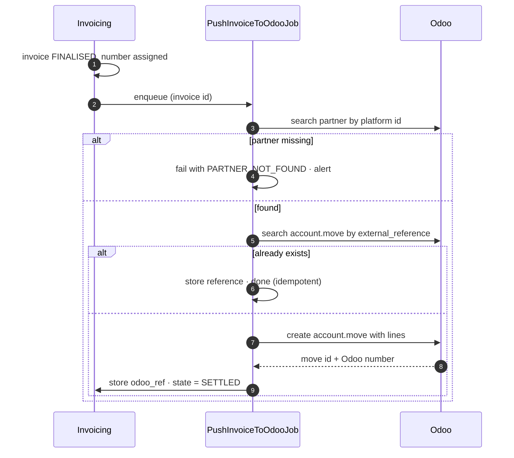

# Integration — Odoo Accounting

**Direction:** outbound push · **Protocol:** Odoo external API (XML-RPC or JSON-RPC) ·
**Criticality:** medium

Finalised invoices and credit notes are pushed to Odoo, which is the system of record for accounting
**[AS-13]**. The platform remains the system of record for trades, wallets and the calculation behind
each invoice line.

> # ⚠ This integration is **blocked**, not pending
>
> **[DEC-59] answers [OQ-70] with a "no": there is no chart of accounts and no tax-code mapping.** The
> mapping table in §4 therefore has **no source and no owner** — the `account_code` and `tax_codes`
> values in §3 are illustrative and **must not be treated as a starting point**. Combined with
> **[OQ-69]** (Odoo version, hosting model, API availability), **[OQ-71]** (do customer records exist
> in Odoo, and how are they matched) and **[OQ-72]** (does Odoo need wallet data) all still parked,
> **the Odoo integration cannot be specified in detail yet.**
>
> **Treat it as blocked rather than pending.** The difference is what a reader should do next: a
> pending item is scheduled, a blocked one needs someone to unblock it. Nothing below §7 can be
> estimated, and nothing below should be built, until §9.1 is answered. What *is* decided is the
> division of responsibility — **the platform owns invoice numbering [DEC-45] and the platform
> generates the PDF [DEC-46]** — and that is decided precisely so the customer-facing side of
> invoicing does not wait on any of this.

---

## 1. Division of responsibility

| Concern | Owner |
| --- | --- |
| Calculating the invoice | **Platform** |
| Line-level detail and drill-down | **Platform** |
| Invoice numbering | **Platform [DEC-45]** — see §2 |
| PDF generation | **Platform [DEC-46]** — see §2.1 |
| Customer-facing invoice presentation | **Platform** (portal) |
| General ledger, VAT return, financial reporting | **Odoo** |
| Receivables, dunning, payment terms | **Odoo** |
| Wallet settlement | **Platform** |

Both open questions in this table are now closed the same way, and for the same reason: **the customer
experience must not depend on an integration that will occasionally fail** — and, under **[DEC-59]**,
on an integration that cannot yet be specified at all.

## 2. Numbering — the platform owns it **[DEC-45]**

**Decided: option A**, adopting the recommendation. **[OQ-37] is closed.** The comparison is kept as
the record of what was weighed.

| Option | Consequence |
| --- | --- |
| **A. Platform numbers — chosen [DEC-45]** | The portal can show a final number immediately. Odoo must be configured to accept an external number rather than generate its own. Risk: a push failure leaves a number issued with no accounting entry — recoverable, since the retry carries the same number **(§5)** |
| **B. Odoo numbers** | Guaranteed consistency with the rest of the accounting. But the invoice has no number until the push succeeds, so the portal must show "pending" and the customer cannot reference it. Every push failure becomes customer-visible |

What follows from A:

- **Gapless sequential numbering per legal entity per year is a platform responsibility**, allocated at
  finalisation, before the push ([F10](../10-features/F10-invoicing-and-settlement.md)).
- The platform's number goes into Odoo's `external_reference` (§3) and is the **idempotency key** for
  the push (§5). That is the same field the retry searches on, so numbering and duplicate-prevention
  are the same mechanism rather than two.
- **Odoo must be configured not to renumber.** If it allocates its own number as well, the two systems
  hold two numbers for one document and reconciliation (§7) compares the wrong things. ⚠ Whether the
  target instance can be configured that way is part of **[OQ-69]** and is unconfirmed.

### 2.1 The PDF — the platform generates it **[DEC-46]**

**[OQ-38] is closed.** The platform renders the customer-facing invoice PDF; **Odoo receives structured
data, not the document** (§3). Branding, layout, language **[AS-19]** and the portal download path stay
under platform control, and the document exists whether or not the push has succeeded.

Consequences: the PDF is generated at finalisation and stored, so re-reading an old invoice never
re-renders it against current templates or current reference data; the portal download and the emailed
copy **[DEC-47]**, [F11-R22](../10-features/F11-notifications.md) serve the same stored artefact; and
whether a copy is also attached to the Odoo record is **not decided** — it is not needed for accounting
and is listed in §9.1 rather than assumed either way.

## 3. Data pushed

```jsonc
{
  "external_reference": "INV-2026-08-0042",
  "partner_reference": "c-000142",
  "move_type": "out_invoice",                  // out_refund for a credit note
  "invoice_date": "2026-09-05",
  "invoice_date_due": "2026-09-05",
  "currency": "EUR",
  "narration": "Energy supply August 2026 — settled from wallet",
  "lines": [
    {
      "sequence": 10,
      "name": "Rotterdam DC (871687…0011) — Base block Aug-26 (TRD-1042)",
      "quantity": "297.600000",
      "uom": "MWh",
      "price_unit": "72.4000",
      "amount": "21546.24",
      "account_code": "8000",
      "tax_codes": ["BTW21"],
      "analytic": { "metering_point": "871687…0011", "category": "BLOCK_ENERGY" }
    }
    // … one line per invoice line
  ],
  "totals": { "subtotal": "…", "vat": "…", "total": "…" }
}
```

Notes:

- ⚠ **`account_code` and `tax_codes` above are placeholders, not values.** No chart of accounts and no
  tax-code mapping exists **[DEC-59]**, so `"8000"` and `"BTW21"` are shapes showing where real values
  go. Do not seed them.
- **Line granularity mirrors the platform invoice.** Summarising into one line per customer would
  make the two systems impossible to reconcile.
- **Analytic tags** carry the metering point and the line category, so Odoo can report per EAN and
  per revenue type without the platform having to.
- **Account and tax codes come from a mapping table**, not from code, so the finance team can change
  them without a release — **once that table has a source and an owner, which it does not** (§4).
- `external_reference` is the **platform's** invoice number **[DEC-45]**, and the key the push searches
  on before creating (§5).
- The push carries **structured data only**. The customer-facing PDF is the platform's and is not sent
  **[DEC-46]**, §2.1.
- The push is a **complete document**, never a delta.

### 3.1 VAT — one rate, and it still needs a code **[DEC-64]**

**VAT is 21% on every line category, with no exemptions and no reverse-charge cases** — see
[Invoice calculation §8](../50-calculations/03-invoice-calculation.md). For this integration that is
simplifying in one way and unhelpful in another:

- **Simplifying:** there is exactly **one** tax code to map, for every line of every invoice, including
  the negative feed-in credit line **[DEC-44]**. No rate-group logic, no per-line decision, no
  reverse-charge branch.
- **Unhelpful:** one code is still one code more than exists. **[DEC-59]** means nobody can say what it
  is called in the target instance, so **[DEC-64]** shortens the mapping table to a single row and does
  not fill it in. Keep the *shape* — line category → tax code — so a second rate is data rather than a
  refactor, exactly as the calculation document keeps its rate-group shape.

## 4. Mapping tables

| Platform concept | Odoo target | Configurable | Status |
| --- | --- | --- | --- |
| Customer | `res.partner`, matched on the platform customer id in a dedicated field | Yes | ⚠ **Blocked — [OQ-71]**: whether partner records exist, and whether that field exists to match on, is unknown |
| Invoice | `account.move` (`out_invoice`), `external_reference` = the platform number **[DEC-45]** | | ⚠ Depends on Odoo accepting an external number — **[OQ-69]** |
| Credit note | `account.move` (`out_refund`) with `reversed_entry_id` | | ⚠ Same |
| Line category → GL account | mapping table | **Yes** | 🔴 **Blocked — no source, no owner [DEC-59]** |
| Line category → tax code | mapping table | **Yes** | 🔴 **Blocked — no source, no owner [DEC-59]**. One row when it exists, per **[DEC-64]** — §3.1 |
| Metering point | analytic tag | Yes | ⚠ Depends on analytic accounting being enabled — **[OQ-69]** |

Partner matching is on a stable platform identifier stored in Odoo, never on name or VAT number.
Name matching across two systems is a reconciliation problem waiting to happen.

> 🔴 **The two mapping tables are the blocking pair.** They are not "to be filled in during build":
> **[DEC-59]** says the chart of accounts does not exist, so there is nothing to map *to*. Producing
> one is a finance exercise with its own lead time, and it needs a **named owner** before it needs a
> schema. Until then the push cannot be built, because every line it sends carries two values nobody
> can supply.

## 5. Push flow



Searching by `external_reference` before creating is what makes the retry safe. Without it, a
timeout on a successful create produces a duplicate invoice in the accounting system — the single
most damaging failure mode of this integration.

That the reference is **the platform's own invoice number [DEC-45]** is what makes this work at all: it
exists before the first attempt, it is identical on every retry, and it is the number the customer
already has in the portal and in their inbox **[DEC-47]**. Under option B the retry would have had
nothing stable to search on.

## 6. Error handling

| Failure | Handling |
| --- | --- |
| Odoo unreachable | Retry with backoff (8 attempts, 30 s → 6 h); invoice state `PUSH_FAILED`; visible on the dashboard |
| Partner not found | Fail with a specific reason; finance links the partner and retries. Never auto-creates a partner |
| Validation rejected by Odoo | Fail with Odoo's message surfaced verbatim to finance |
| Timeout after a successful create | Next attempt finds the existing move by reference and completes |
| Duplicate detected | Logged, alerted, not created again |
| Credentials expired | Alert; retries paused rather than burning attempts |

**A failed push never rolls back the wallet debit.** The invoice is real, the customer owes it, and
the accounting entry catches up. The two are independent
([F10-R19](../10-features/F10-invoicing-and-settlement.md)).

## 7. Reconciliation

A monthly job compares platform invoices for the period against Odoo's `account.move` records:

| Check | Alert on |
| --- | --- |
| Count | Any difference |
| Total value | Any difference beyond €0.01 |
| Per-invoice presence | Any invoice missing on either side |
| Credit notes | Any without a matching reversal |

The report goes to finance. Two systems holding financial records without a scheduled comparison is
a defect, not a design.

## 8. Security

| Control | Detail |
| --- | --- |
| Authentication | Dedicated Odoo service account, credentials in Key Vault |
| Authorisation | Minimum rights: read `res.partner`, create/read `account.move` and lines. No delete, no access to unrelated models |
| Transport | TLS, certificate validated |
| Payload | Contains customer and financial data — logged only as identifiers, never in full |
| Rate limiting | Pushes are serialised per customer to avoid overwhelming a shared Odoo instance |

## 9. Open questions

| Ref | Question | Status |
| --- | --- | --- |
| ~~[OQ-37]~~ | ~~Who owns invoice numbering?~~ | **Closed — [DEC-45]: the platform**, adopting the recommendation. §2 |
| ~~[OQ-38]~~ | ~~Who generates the PDF?~~ | **Closed — [DEC-46]: the platform.** Odoo receives structured data, not the customer-facing document. §2.1 |
| [OQ-69] | Odoo version, hosting (Odoo Online / on-premise), and API availability | **Open — parked.** Determines the transport, whether an external number can be accepted **[DEC-45]**, and whether analytic accounting is available |
| ~~[OQ-70]~~ | ~~Does a chart of accounts and tax code mapping already exist, and who owns it?~~ | **Closed — [DEC-59]: no, and nobody.** ⚠ This closure **creates** the blocker rather than removing one: the mapping table in §4 has no source and no owner |
| [OQ-71] | Do customer records already exist in Odoo, and how are they matched to platform customers? | **Open — parked.** Partner matching (§4, §6) cannot be specified without it |
| [OQ-72] | Does Odoo need to know about wallet balances and deposits, or only about invoices? | **Open — parked.** Decides whether this is a one-document or a two-document integration |
| [OQ-82] | VAT rate per line category | **Closed — [DEC-64]: 21% everywhere**, no exemptions, no reverse charge. One tax code to map — §3.1 |

### 9.1 What would unblock this

In order, because two of these are prerequisites for the others:

1. **Name an owner for the chart of accounts and the tax-code mapping [DEC-59].** Nothing else can
   proceed. It is a finance exercise with external lead time, not a build task, and one owner produces
   both tables.
2. **Answer [OQ-69].** Version, hosting and API decide the transport, whether the platform's invoice
   number can be written as the document number **[DEC-45]**, and whether analytic tags exist.
3. **Answer [OQ-71].** Whether partners exist, and on which field they are matched, decides whether the
   first push is a create or a link — and whether a migration is needed before any of it runs.
4. **Answer [OQ-72].** One document type or two.
5. Then, and only then, confirm the two details this document deliberately leaves open: whether the
   platform's PDF is also attached to the Odoo record **[DEC-46]**, and the tax-code string
   **[DEC-64]**.

Until step 1 has an owner, this document is a description of an integration that cannot be estimated.
Everything above §7 is the design that will be built **when** it is unblocked, and none of it is
contradicted by the blockage — which is why it is kept rather than removed.
